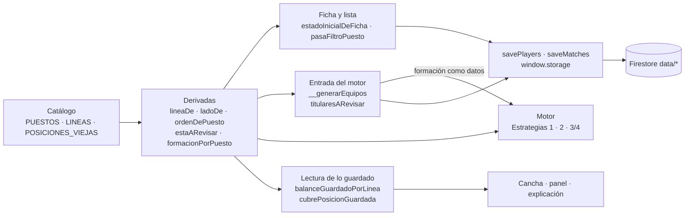
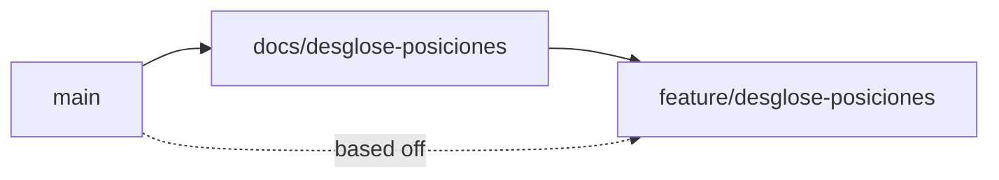
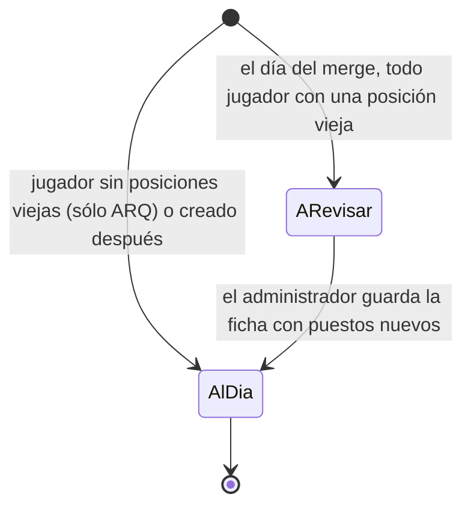

# Desglose de posiciones — Implementation Plan

> **Status:** Draft · **Date:** 2026-09-30 · **Owner:** Lucas Manoukian
>
> **Reviewers:** *pending*
>
> **Spec:** [DESGLOSE_POSICIONES_SPEC.md](./DESGLOSE_POSICIONES_SPEC.md)
>
> **Concept note:** [DESGLOSE_POSICIONES_CONCEPT.md](./DESGLOSE_POSICIONES_CONCEPT.md)

> **Grounding evidence (`MD-25`).** Este Plan se apoya en el ledger §6.5 del Concept Note y
> en las citas en línea de la Spec. Donde una tarea `T-N.*`, una decisión `TD-*` o una
> elección de módulo se apoya en una ubicación de código que ninguno de los dos cubre, la
> cita va en línea acá. Todas las líneas de `index.html`, `tests/` y `tools/` citadas se
> leyeron el 2026-09-30 sobre `7ae5dd1` (rama `docs/desglose-posiciones`), cuyo código es
> idéntico al de `main` en `429ddc5` (`git diff main -- index.html tests tools` vacío).

## 1. Summary

Se reemplaza en `index.html` el catálogo de cuatro posiciones (`POSITIONS`,
[index.html:1485](../../index.html#L1485)) por un catálogo de ocho puestos agrupados en cuatro
líneas, y todo lo que hoy enumera posiciones —ficha, filtro, orden, colores, motor, cancha,
panel— pasa a derivarse de él (`TC-010`). El motor deja de tener "Defensor, Volante, Delantero"
escrito adentro: recibe los puestos como las claves de la formación y resuelve la línea de cada
uno por el catálogo (`TC-012`). Lo único no obvio antes de leer el resto: **ningún dato se
migra**. El arquero se sigue guardando como `'Arquero'`, los puntajes viejos se quedan en el
mismo objeto `scores` bajo su clave vieja (`'Defensor': 7`), y todo lo guardado con la forma
anterior se lee a través de una sola tabla (`TC-011`). Eso hace que el motor generalizado,
corrido sobre el vocabulario viejo expresado como datos, tenga que dar exactamente los mismos
números que hoy: la suite de tests existente queda como red de regresión del refactor
(`TD-05`). La entrega sigue `AGENTS.md` § Ramas: esta rama de documentos primero, la de código
después, sin flag (Spec §13).

## 2. Goals & non-goals

- **Technical goal 1** — Un único catálogo (`PUESTOS`, `LINEAS`, `POSICIONES_VIEJAS`) y un
  puñado de funciones derivadas son el único lugar de `index.html` que conoce puestos, líneas
  y posiciones viejas (`TC-010`, `TC-011`, `NFR-006`).
- **Technical goal 2** — El motor queda parametrizado por la formación recibida: la misma
  función arma 3-3-1 por puesto hoy y arma cualquier formación futura sin cambios de código
  (`TC-012`, `FR-050`, `FR-051`).
- **Technical goal 3** — Cero escrituras a `data/partidos` y `data/partidosArmado` fuera de
  las acciones de siempre, y cero migraciones de `data/players`/`data/playerScores`
  (`TC-002`, `TC-003`, `FR-084`).
- **Technical goal 4** — La generalización del motor se prueba sin cambio de números: la suite
  existente pasa sin tocar ningún valor esperado, salvo las claves de línea y el arquero
  desplazado (`TD-05`, `T-2.4`).

**Non-goals:**

- No se reescribe ningún test existente al vocabulario nuevo; los escenarios nuevos van en un
  archivo nuevo (`TD-14`).
- No se cambian los topes del motor (`MAX_ASIGNACIONES_ENCAJE`, `MAX_REPARTOS_EVALUADOS`)
  salvo que la medición de `T-2.27` lo pida con la regla de `TD-17`.
- No se tocan `saveMatches`, `savePlayers`, `window.storage` ni las reglas de Firestore.
- No se cambia el arrastre (`ARRASTRE_SPEC.md`), el texto copiado (`006`) ni la inversión de
  colores (`INTERCAMBIAR_COLORES_SPEC.md`) — Spec, Declaración de reemplazo, "No reemplaza".
- No se reemplazan los literales `'Arquero'` sueltos del motor por una constante (`TD-18`).

## 3. Architecture overview



Capas (`AGENTS.md`, Arquitectura desacoplada; `TC-012`): la interfaz (ficha, lista, cancha,
panel) y el motor leen el catálogo sólo a través de las funciones derivadas; el motor recibe
la formación y los titulares como datos y no lee el DOM ni `players`; la regla de producto del
bloqueo y la de `FR-066` viven en la entrada (`window.__generarEquipos`), no en el motor
(`TD-08`); la persistencia sigue siendo la interfaz guardar/leer de siempre.

### 3.1 Key design decisions

| ID | Decision | Spec ref | Rationale |
|---|---|---|---|
| TD-01 | Sin feature flag. Dos ramas (`docs/`, `feature/`), y la de código se mergea entera | Spec §13 | Spec §13 declara que no hay convivencia de catálogos: un merge parcial publicaría media feature en GitHub Pages. Un flag sería infraestructura anticipada (Simplicidad); además dejaría convivir, por partido, el catálogo viejo con el nuevo, algo que `D-08`/`D-09` tratan como un estado binario (a revisar / reclasificado) y no como algo gradual que un flag pudiera graduar |
| TD-02 | Valor guardado de cada puesto: ARQ se sigue guardando como `'Arquero'`; los otros siete, como su sigla (`'LI'`, `'DC'`, `'LD'`, `'MI'`, `'MC'`, `'MD'`, `'DEL'`) | FR-001, glosario "Posición vieja", Spec §17 (libertad sobre el valor) | "Arquero no es una posición vieja: es el puesto ARQ" (glosario). Guardarlo igual que hoy deja válidos, sin migrar, a cada arquero, a cada `scores.Arquero` y a cada `posicionAsignada` de arco guardada, y a los 24 literales `'Arquero'` del motor (`TD-18`). Las siglas no chocan con ningún valor viejo: `'DEL'` ≠ `'Delantero'` |
| TD-03 | Catálogo único, al lugar de `POSITIONS`…`posBadgeStyle` ([index.html:1485-1493](../../index.html#L1485-L1493)): `LINEAS` (`{clave, color, textoOscuro}` en orden Arco, Defensa, Medio, Ataque; la clave es el nombre visible, `FR-002`), `PUESTOS` (`{valor, sigla, nombre, linea, lado}` en el orden de `FR-003`) y `POSICIONES_VIEJAS` (`{ Defensor: 'Defensa', Volante: 'Medio', Delantero: 'Ataque' }`, `TC-011`). Todo lo demás se deriva (§7.3.5) | FR-001 a FR-006, TC-010, TC-011, D-01, D-11 | Un solo lugar que enumera; `NFR-006` se vuelve verificable con un `grep`. Los colores son los de `POS_COLOR` de hoy, movidos a su línea (`TC-030`) |
| TD-04 | Los puntajes viejos se quedan donde están: en `p.scores`, bajo su clave vieja. Reclasificar no mueve ni borra ninguno. `computeAvg(scores, posiciones)` promedia sólo las posiciones del jugador (`[principal, ...secundarias]`); el descarte de `FR-014` recorre sólo `VALORES_PUESTO`; la grilla sólo dibuja los puestos elegidos | FR-014, FR-027, FR-028, FR-029, FR-081, TC-041, D-07 | Sin migración de datos. `puntajeEnPosicion(p, 'Defensor')` ([index.html:1912-1915](../../index.html#L1912-L1915)) sigue devolviendo el puntaje viejo para un partido guardado sin cambiar una línea. Como `scores` sólo viaja en `data/playerScores` ([index.html:2142-2154](../../index.html#L2142-L2154)), `TC-041` se cumple por construcción. Promediar las posiciones del jugador en vez de todo el catálogo es lo que separa lo viejo de lo nuevo sin un campo más |
| TD-05 | El motor se generaliza sobre datos: los puestos a repartir salen de las claves de la formación recibida (`puestosDeFormacion`) y la línea de cada puesto, de `lineaDe`. Desaparecen `ORDEN_FORMACION` y `FORMACION_KEY_POR_POSICION` ([index.html:3160-3161](../../index.html#L3160-L3161)) y el `OUTFIELD` de la Estrategia 2 ([index.html:3010](../../index.html#L3010)). La programación dinámica del encaje pasa de tres contadores fijos a uno por puesto de la formación | TC-012, FR-050 a FR-059, D-03, D-05 | Con el vocabulario viejo expresado como datos (formación `{Defensor: 3, Volante: 3, Delantero: 1}`), el motor generalizado recorre exactamente los mismos pasos que hoy. Por eso la suite existente —escrita toda en posiciones viejas— sirve de prueba de que el refactor no cambió el algoritmo, y los escenarios nuevos prueban el catálogo nuevo (`TD-14`, `R-06`) |
| TD-06 | `CANCHAS[*].formacion` pasa a lugares por puesto **por equipo**: F8 `{LI:1, DC:1, LD:1, MI:1, MC:1, MD:1, DEL:1}`, F9 igual con `MC:2`. `formacionPorPuesto(objetivo)` traduce la forma vieja `{defensores, volantes, delanteros}` a `{Defensor, Volante, Delantero}` y es el único lugar que conoce esa forma. `etiquetaFormacion(objetivo)` cuenta lugares por línea de campo | FR-050, FR-051, FR-055, FR-082, FR-083, TC-013 | La forma nueva es la que el motor ya consume por puesto. La vieja sólo aparece al leer un partido guardado: con la traducción, la etiqueta de un partido viejo sigue saliendo "3-3-1" y la de uno nuevo también, por el mismo camino |
| TD-07 | Los lugares extra del equipo corto (hoy ciclan Defensor, Volante, Delantero, [index.html:3654](../../index.html#L3654) y [:5476](../../index.html#L5476)) ciclan por los **puestos centrales** de la formación, en el orden de `FR-003`: DC, MC, DEL | FR-050, FR-052 | La Spec no dice dónde va un lugar que excede la formación. Un central es lo menos arbitrario (no carga un lado) y, como una posición vieja es central (`FR-074`), con el vocabulario viejo el ciclo es el de hoy: la red de regresión de `TD-05` se mantiene |
| TD-08 | El bloqueo y `FR-066` viven en la entrada: `window.__generarEquipos` ([index.html:4193](../../index.html#L4193)) calcula `titularesARevisar(m)` y, si no está vacía, vuelve sin tocar `m` ni guardar; antes de llamar al motor, `posicionesPreviasVigentes(prev)` descarta de `prevPosicionAsignada` los valores que son posiciones viejas | FR-040, FR-041, FR-043, FR-044, FR-045, FR-066, D-09 | El motor no necesita saber qué es "a revisar": nunca recibe un titular libre con posición vieja. Mantenerlo genérico es lo que conserva la red de regresión de `TD-05` |
| TD-09 | El aviso de bloqueo es `renderAvisoBloqueo(m)`, con la forma `.panel-aviso` de `renderAvisoDesactualizado` ([index.html:5946-5955](../../index.html#L5946-L5955)), visible para admin en la tarjeta de equipos mientras el partido esté bloqueado y no cerrado, con o sin equipos generados. Nombra a cada titular a revisar (escapado). Mientras se muestra, reemplaza al aviso de desactualizado. Los botones Generar/Regenerar siguen donde están y su manejador es la guarda de `TD-08` | FR-042, FR-045, NFR-003, TC-030 | Un aviso que ya está a la vista cumple "cuando intente generar" sin estado transitorio ni un toast nuevo. Un solo aviso a la vez: el de desactualizado ofrece un Regenerar que no haría nada. Sin tokens nuevos |
| TD-10 | La lectura de lo guardado pasa por tres funciones: `balanceGuardadoPorLinea(b)` (claves por `lineaDe`, acepta las dos formas), `formacionPorPuesto` (`TD-06`) y `cubrePosicionGuardada(u, pos)` (para una posición vieja compara por línea —el jugador la cubre si su principal o alguna secundaria es de esa línea—; para un puesto, `costoEncaje` de siempre) | FR-080, FR-082, FR-083, FR-084, TC-011, OPEN-Q-02 | Resuelve `OPEN-Q-02` (§15.1). Comparar por línea es lo que deja "cumplida" una formación vieja cuyos jugadores ya fueron reclasificados (`S-10`) y la deja igual que antes mientras no lo fueron (`S-10a`) |
| TD-11 | La cancha agrupa por `lineaDe(posAsignada)` y, dentro de cada fila, ordena de forma estable por lado (izquierdo, central, derecho; una posición vieja cuenta como central). `jugadoresDeEquipoOrdenados` ordena por `ordenDePuesto`. Un valor sin línea sigue cayendo en la fila aparte de hoy ([index.html:4661-4672](../../index.html#L4661-L4672)) | FR-070 a FR-075, D-12 | El orden de `FR-003` ya es izquierda→derecha dentro de cada línea (LI, DC, LD; MI, MC, MD), así que el orden de lectura y el de dibujo coinciden para los puestos nuevos; el orden por lado sólo agrega dónde va una posición vieja. El `sort` estable deja juntos a los integrantes de una dupla, que comparten valor |
| TD-12 | La ficha se genera del catálogo: el `<select id="fPrincipal">` y el filtro `#filters` pierden sus `<option>` escritos a mano ([index.html:1165-1170](../../index.html#L1165-L1170), [:1192-1199](../../index.html#L1192-L1199)) y se llenan al arrancar. La lógica de reclasificación es pura y recortable: `estadoInicialDeFicha(p)`, `precargaDePuesto(puesto, puntajesViejos, scores)` y `scoresAlGuardar(scores, aplicables)`. La precarga sólo escribe un casillero vacío | FR-006, FR-010 a FR-014, FR-020 a FR-027, FR-022b, D-07, D-08 | Probar la reclasificación sin navegador (`S-01a`…`S-01f`). Escribir sólo en un casillero vacío evita pisar lo que el administrador ya cargó si saca y vuelve a poner un puesto |
| TD-13 | Textos de la explicación: `"Se usó a {nombre} de {sigla}, su puesto secundario."` (motivo formación) y la misma frase con `" para emparejar los puestos."` (Estrategia 2); `"No se pudo cubrir {sigla} en el Equipo {color}."` una por lugar faltante con formación por puesto, y la frase de hoy (`"No se pudo completar la formación {etiqueta} en el Equipo …"`) con formación vieja; `"… se ubicó como {sigla} …"` para el arquero desplazado; y una línea nueva para la Estrategia 2: `"Balance por puesto (Blanco–Negro): LI 1–1 · DC 1–1 · …"`, sólo con los puestos que tienen titulares, medida sobre el reparto vigente | FR-057, FR-058, FR-063, FR-065, FR-083, TC-014, D-13 | Son las frases que citan `S-05b`, `S-05c` y `S-08`. La de formación vieja se conserva para que un partido viejo se lea como antes. La de balance por puesto no existe hoy ([index.html:5679-5687](../../index.html#L5679-L5687) sólo lista secundarias usadas) y `FR-063` la pide |
| TD-14 | Tests nuevos en `tests/puestos.test.js` (unitarios, de propiedad y sobre el motor real con `cargarMotor`), con planteles nuevos en `tests/fixtures.js` (`PLANTEL_F8_PUESTOS`, `PLANTEL_F9_PUESTOS` y `aPuestos(plantel)`, traducción determinista de un plantel viejo). Los tests existentes se quedan en vocabulario viejo y cambian sólo donde cambia la forma del dato: las claves de `balanceLineas` (`Defensor` → `Defensa`), la forma de `formacion`, el arquero desplazado (`'Delantero'` → `'DEL'`, `FR-065`) y las listas `DECLARACIONES` | TC-031, TC-032, AC-50 | `TD-05`. Reescribirlos al vocabulario nuevo borraría la única prueba de que el refactor no cambió el algoritmo |
| TD-15 | `tests/fixtures-app.js` gana la opción `docsDesde(fixture, { reclasificados })`, por defecto `true`: traduce el plantel con `aPuestos` conservando los puntajes viejos, y deja los partidos guardados tal cual, con sus posiciones viejas | S-10, FR-080, AC-04 | Así cada escenario existente de `tests/layout.test.js` ejercita `S-10` (partido viejo, jugadores reclasificados) sin escribirlo de nuevo, y los escenarios de bloqueo piden `reclasificados: false` |
| TD-16 | Herramienta nueva de sólo lectura, `tools/revisar-historial.js`: lee `data/players`, `data/playerScores`, `data/partidos` y `data/partidosArmado` de **staging** por la API REST con la cuenta admin del entorno (el patrón de `tests/reglas.test.js`, sin su llave de servicio), y corre sobre cada partido las funciones reales de lectura recortadas con `extraer`. Informa camisetas en la fila sin puesto (`A-01`, `NFR-005`) y compara, para cada partido finalizado que asignó posiciones, los totales con el plantel tal cual y con el plantel reclasificado en memoria por `aPuestos` | NFR-005, AC-13, A-01 | "Un script de lectura que no escribe" (`AC-13`): sólo hace `GET`. Reclasificar en memoria permite medir el "después" sin tocar datos |
| TD-17 | `OPEN-Q-01` — los topes del motor **no cambian**. Regla para revisarlo en `T-2.27`: si `NFR-002` se cumple y la tasa de generaciones truncadas del peor caso supera el 5 %, se sube `MAX_ASIGNACIONES_ENCAJE` a 5.000 (el máximo que cabe en `MAX_REPARTOS_EVALUADOS` en Fútbol 9: 5.000 × 384 = 1,92 M) sólo si `NFR-002` se sigue cumpliendo | NFR-001, NFR-002, A-02, OPEN-Q-01 | Simulación del 2026-09-30 (§15.1): con los topes de hoy el peor caso evalúa 768.000 repartos (38 % del presupuesto) y la búsqueda de empates se corta en 0 a 6 de cada 300 planteles al azar, siempre avisado por `enumeracionTruncada` |
| TD-18 | Los 24 literales `'Arquero'` de `index.html` se quedan. Nombran al único puesto con reglas propias (el invariante de arqueros, `003` `FR-005`), no enumeran puestos | TC-010, NFR-006 | `TC-010` prohíbe *enumerar* puestos fuera del catálogo; una comparación contra un valor no es una enumeración. `NFR-006` no incluye `'Arquero'`. Cambiarlos sería un diff grande en el motor sin cambio de comportamiento |

## 4. Module map

| Module / package | Role | Status |
|---|---|---|
| `index.html` — `LINEAS`, `PUESTOS`, `POSICIONES_VIEJAS`, `VALORES_PUESTO`, `ORDEN_LINEAS` y las derivadas de §7.3.5 (al lugar de [index.html:1485-1493](../../index.html#L1485-L1493)) | Catálogo único (`TD-03`) | new |
| `index.html` — `POSITIONS`, `ORDEN_POSICION`, `POS_COLOR`, `ORDEN_FORMACION`, `FORMACION_KEY_POR_POSICION`, `LABEL_LINEA`, `ORDEN_POSICION_LECTURA` | Reemplazadas por el catálogo | deleted |
| `index.html` — `posTextColor`, `posBadgeStyle`, `computeAvg`, `blankScores`, `loadTestPlayers` y su copia en la carga de convocados ([index.html:6571](../../index.html#L6571)) | Pasan a leer el catálogo (`TD-04`) | modified |
| `index.html` — `CANCHAS`, `formacionTexto` ([index.html:1494-1497](../../index.html#L1494-L1497), [:1681-1684](../../index.html#L1681-L1684)) | Formación por puesto y etiqueta por línea (`TD-06`) | modified |
| `index.html` — `ESTRATEGIAS`, `REGLAS_CATALOGO`, `REGLAS_INVARIANTES` ([index.html:1498-1514](../../index.html#L1498-L1514), [:1533-1586](../../index.html#L1533-L1586), [:1597-1615](../../index.html#L1597-L1615)) | Textos de Configuración (`FR-090`) | modified |
| HTML de `#filters` y `#fPrincipal` ([index.html:1165-1199](../../index.html#L1165-L1199)) | Opciones generadas (`TD-12`) | modified |
| `index.html` — `renderSecBadges`, `renderScoresGrid`, `refreshScoresSection`, `updateAvgPreview`, `validatePlayerForm`, `openForm`, `validateAndSave` ([index.html:2243-2358](../../index.html#L2243-L2358), [:2611-2642](../../index.html#L2611-L2642)) | Ficha con ocho puestos y reclasificación | modified |
| `index.html` — `estadoInicialDeFicha`, `precargaDePuesto`, `scoresAlGuardar`, `puntajesViejosDe` | Reclasificación pura (`TD-12`) | new |
| `index.html` — `sortRoster`, `getFiltered`, `renderPlayersTab` ([index.html:2373-2516](../../index.html#L2373-L2516)) | Orden, filtro "A revisar", marca y sigla | modified |
| `index.html` — `pasaFiltroPuesto`, `FILTRO_A_REVISAR` | Filtro puro | new |
| `index.html` — `mejorPosicionAlternativa` ([index.html:2751-2755](../../index.html#L2751-L2755)) | Arquero desplazado a DEL (`FR-065`) | modified |
| `index.html` — `generarEquiposEstrategia2` ([index.html:2995-3147](../../index.html#L2995-L3147)) | Grupos por puesto presente, grupo "sin puesto" (`TD-05`) | modified |
| `index.html` — `lineaDeUnSoloLugar`, `asignarPosicionesOptimo`, `enumerarAsignacionesOptimas`, `sumasPorLinea`, `balanceLineasDe`, `repartirPorLineasParejo`, `generarEquiposEstrategia3` ([index.html:3176-4089](../../index.html#L3176-L4089)) | Motor generalizado sobre la formación (`TD-05` a `TD-07`) | modified |
| `index.html` — `construirUnidadDupla` ([index.html:4105-4150](../../index.html#L4105-L4150)) | Valor de dupla sobre los ocho puestos y las posiciones viejas (`FR-068`, `FR-081`) | modified |
| `index.html` — `window.__generarEquipos` ([index.html:4193-4278](../../index.html#L4193-L4278)) | Guarda del bloqueo y `FR-066` (`TD-08`) | modified |
| `index.html` — `titularesARevisar`, `posicionesPreviasVigentes`, `renderAvisoBloqueo` | Bloqueo (`TD-08`, `TD-09`) | new |
| `index.html` — `jugadoresDeEquipoOrdenados`, `agruparEnLineasDeCancha`, `renderCamiseta` ([index.html:4615-4840](../../index.html#L4615-L4840)) | Cancha por lados, `title` por nombre (`TD-11`, `FR-076`) | modified |
| `index.html` — `balanceLineasVigente`, `celdasDiferenciaPorLinea`, `faltantesDeFormacionVigente`, `repartoDivergeDeLaGeneracion`, `explicacionesDelArmado` ([index.html:5371-5841](../../index.html#L5371-L5841)) | Lectura de lo guardado y textos (`TD-10`, `TD-13`) | modified |
| `index.html` — `balanceGuardadoPorLinea`, `cubrePosicionGuardada`, `balancePorPuestoTexto`, `textoFormacionesDeCancha` | Lectura y textos (`TD-10`, `TD-13`) | new |
| `index.html` — convocados y autocompletado ([index.html:6868](../../index.html#L6868), [:6881](../../index.html#L6881), [:6972](../../index.html#L6972), [:7029](../../index.html#L7029)) | Sigla escapada en vez de `principal.slice(0,3)` y punto de color solo (`FR-005`, `TC-040`) | modified |
| CSS — `.status-chip.a-revisar` (junto a [index.html:329-332](../../index.html#L329-L332)) | Marca "A revisar": mismos tokens que `.status-chip.teams-ready` | new |
| `index.html` — `savePlayers`, `saveMatches`, `window.storage` | Persistencia | untouched (`TC-002`, `TC-003`) |
| `index.html` — `moverUnJugadorDeEquipo`, `intercambiarUnidades`, `invertirColoresDelPartido`, `formatearFormacionParaCopiar` | Arrastre, colores, copiar | untouched (Spec, "No reemplaza") |
| `tests/puestos.test.js` | Tests nuevos de la feature (`TD-14`) | new |
| `tests/fixtures.js` | Planteles con puestos, `aPuestos`, forma nueva de `formacion` | modified |
| `tests/fixtures-app.js` | `docsDesde(…, { reclasificados })`; partidos viejos intactos (`TD-15`) | modified |
| `tests/harness.js`, `tests/cancha.test.js`, `tests/panel.test.js`, `tests/finalizado.test.js`, `tests/colores.test.js` | `DECLARACIONES` y claves de línea (`TC-032`, `TD-14`) | modified |
| `tests/motor.test.js` | Claves de línea, forma de `formacion`, arquero desplazado | modified |
| `tests/layout.test.js` | Escenarios `puestos-*` | modified |
| `tools/medir-motor.js` | Planteles al azar con siete puestos, referencias traducidas, tasa de truncado (`TD-17`) | modified |
| `tools/revisar-historial.js` | Verificación de sólo lectura contra staging (`TD-16`) | new |
| `tests/README.md`, `AGENTS.md` § Tests, `Roadmap.md:18` | Comandos nuevos; "Lo que ya existe" | modified |

## 5. Engineering rules / project conventions reference

Restatadas de [`AGENTS.md`](../../AGENTS.md).

| Rule | Summary |
|---|---|
| Estructura | Toda la aplicación en `index.html`, dentro de un IIFE. Sin build, bundler ni framework (`TC-001`). |
| Imports | No aplica: no hay módulos. |
| Typing | No aplica: JavaScript sin anotaciones ni type-checker. |
| Logging | No aplica: la app no tiene logging propio. |
| Estilo | Interfaz por plantillas de cadena e `innerHTML`; **todo texto que venga de un jugador o de lo guardado se escapa**, en contenido y en atributos. Un valor de puesto sólo se inserta a través del catálogo o escapado (`TC-040`). |
| Tests | `tests/*.test.js`, con `node`, devuelven 1 sólo ante regresión. Se recorta de `index.html` por nombre con `extraer` de `tests/harness.js`; renombrar o borrar una declaración recortada obliga a actualizar cada lista `DECLARACIONES` en el mismo commit (`TC-032`). |
| Binding | `variant-a` — el ID va en forma canónica con guion dentro de un string literal, con el prefijo `puestos/`: el título del caso en `tests/puestos.test.js` (`'puestos/S-01b: …'`), el campo `spec: ['puestos/S-02a', …]` de cada escenario de `tests/layout.test.js`, y la etiqueta que imprime cada medición de `tools/medir-motor.js` y `tools/revisar-historial.js` (`'puestos/NFR-002'`). Nunca en comentarios (`TC-031`). |
| Supply-chain | `none — el repositorio no versiona ningún lockfile y la aplicación no tiene dependencias instaladas (Firebase por CDN; Playwright es dev-only externo, AGENTS.md § Dependencias)` |
| Lint / type-check | `none — el repositorio no tiene linter ni type-checker configurados`. `T-N.D3`/`T-N.D4` pasan de forma vacua y se declaran como tales. |
| Constants | Puestos, líneas, colores y posiciones viejas sólo en el catálogo (`TD-03`); formaciones sólo en `CANCHAS`. Ningún número mágico nuevo. |
| Commits | Conventional Commits con asunto en español: `tipo(scope): asunto (IDs de la Spec)`, ≤ 72 caracteres, un cambio lógico por commit, cada commit pasa los tests. Scopes `puestos`, `motor`, `tests`, `tools`. Nunca `chore: bump version`: la versión la sube el workflow (`AGENTS.md` § Versionado). |
| Backwards compat | Requerida en la lectura: todo lo guardado con la forma anterior se sigue leyendo (`FR-080` a `FR-084`, `TD-10`). No hay compatibilidad hacia atrás del código viejo con datos nuevos: ver `R-07`. |

## 6. Definition of Done (every branch)

- [ ] La implementación sigue §5
- [ ] Cada FR/TC de la Spec asignado a la rama está implementado
- [ ] Cada escenario y variante tiene un test ejecutable (`AC-50`; `T-N.D8`, `T-N.D8b`)
- [ ] Cada NFR cuantificado tiene un test de medición (`AC-51`; `T-N.D9`)
- [ ] Cada `TC-*` de la Spec §4 tiene entrada en §12 de este Plan (`AC-52`; `T-N.D10`, `T-N.D10b`)
- [ ] §12.2 tiene una fila `IMP-*` por alcance afectado (`AC-53`; `T-N.D15`)
- [ ] Cada NFR cuantificado tiene una fila `OBS-*` en §11 (`AC-54`; `T-N.D16`)
- [ ] Supply-chain: `none` declarado en §5 (`AC-55`; `T-N.D20`, pasa de forma vacua)
- [ ] Cada `R-*` de §14 registra una vía de mitigación (`T-N.D17`)
- [ ] Auto-consistencia (`T-N.D18`) y unicidad de definiciones (`T-N.D18b`)
- [ ] Consistencia cruzada con Spec y Concept Note (`T-N.D19`)
- [ ] Tests nuevos y existentes pasan
- [ ] Linter y type-checker: no aplican (§5), declarado
- [ ] Sin `TODO`/`FIXME`/`HACK`
- [ ] Historial de commits limpio, formato §5 (`T-N.D11`)
- [ ] Descripción del PR con resumen, referencias a la Spec y decisiones (`T-N.D12`)
- [ ] **Gate propio del proyecto:** la pantalla se miró en un navegador real contra staging a 360 px y a 1200 px (`T-N.D13`)
- [ ] PR abierto contra `main` (`T-N.D14`)

## 7. Branch / phase plan

### 7.0 Branch strategy — model (`MD-33`) + sizing (`MD-27`)

```
Branching model: trunk-based — detected by <skill-dir>/scripts/detect-branching-model.sh el 2026-09-30 (basis: fallback; default branch main, sin develop/release/hotfix), consistente con AGENTS.md § Ramas (docs/<rebanada> y feature/<rebanada> salen de main y vuelven a main) y con la resolución por historial de merges de OPEN-Q-05 de INTERCAMBIAR_COLORES_IMPLEMENTATION_PLAN.md
Long-lived branches: none
```

```
Custom arc: 2 branches — AGENTS.md § Ramas fija dos ramas por entrega (docs/<slug> con los documentos, que se mergea primero, y feature/<slug> con el código). La de código no se puede partir en más ramas mergeables: sin flag (Spec §13, TD-01), un merge parcial publicaría el catálogo nuevo sin el motor o sin la lectura de lo guardado. La rama de código se ordena internamente en siete grupos de commits que dejan la suite verde en cada paso (§7.3.9). Spec §10 cambia la forma de datos, pero no hay migración (TC-003, D-08), así que migration-5 no aplica (§8).
```

### 7.1 Branch tracker

| # | Git branch | Base branch | Status | PR | Tests | Notes |
|---|---|---|---|---|---|---|
| 1 | `docs/desglose-posiciones` | `main` | In progress | — | — | Concept Note, Spec, dos críticas, las marcas de reemplazo en las Specs de origen (`82d3d4f`), este Plan y la marca de `PANEL_ARMADO_SPEC.md` |
| 2 | `feature/desglose-posiciones` | `main` | Not started | — | — | Se crea desde `main` una vez mergeada la rama 1 |



Flechas = orden de merge. Línea punteada = base en git: la rama 2 sale de `main` una vez
mergeada la 1, no de la rama 1.

---

### 7.2 Branch 1 — `docs/desglose-posiciones`

**Goal:** dejar mergeados en `main` los tres documentos de la feature, sus dos críticas y las
anotaciones recíprocas que exige `AGENTS.md` en cada Spec que se reemplaza en parte. Sin
cambios de código.

**Spec coverage:** Declaración de reemplazo de la Spec; §17 *Plan must also* (la parte de
documentos).

#### 7.2.7 Verification

- [ ] Cada fila de la Declaración de reemplazo de la Spec tiene su marca en la Spec de origen
  (las de `002`, `003`, `003/data-model.md`, `011`, `ORDEN_JUGADORES_SPEC.md`,
  `CANCHA_SPEC.md` y `PARTIDO_FINALIZADO_SPEC.md` desde `82d3d4f`; la de
  `PANEL_ARMADO_SPEC.md` en `T-1.2`)
- [ ] Los enlaces cruzados de los tres documentos resuelven
- [ ] El diagrama de §3, el de §7.1 y el de §8.2 renderizan con `npx -y @mermaid-js/mermaid-cli@latest` y se leen en el PNG (`AGENTS.md` § Validar los diagramas Mermaid)

#### 7.2.8 Files inventory

**New files:**
```
docs/desglose-posiciones/DESGLOSE_POSICIONES_IMPLEMENTATION_PLAN.md
```

**Modified files:**
```
docs/desglose-posiciones/DESGLOSE_POSICIONES_SPEC.md          (enlace al Plan; NFR-005, S-06a/S-06b, fila nueva de la Declaración de reemplazo)
docs/equipos-en-el-campo/rebanada-3-panel-armado/PANEL_ARMADO_SPEC.md
```

#### 7.2.9 Task checklist (agent-runnable)

- [x] T-1.1 Enmendar la Spec con las dos decisiones del owner del 2026-09-30 (`NFR-005` y `S-06a`/`S-06b`, §15.1) y enlazar este Plan desde su cabecera
- [x] T-1.2 En `PANEL_ARMADO_SPEC.md`, marcar como reemplazados `FR-034`, la regla de color de `TC-013`, la última línea *Then* de `S-04`, la segunda mitad de `S-04d`, `S-04e`, la mitad del Arco de `AC-05` y `AC-26`, con el tachado más nota en negrita que ese archivo ya usa (su `FR-072`), enlace a `S-06a` y una fila en su Change log
- [ ] T-1.C1 Commit — `docs(desglose-posiciones): enmienda la spec y marca el reemplazo en el panel` (incluye `T-1.1` y `T-1.2`)
- [x] T-1.3 Escribir este Plan y renderizar sus tres diagramas
- [ ] T-1.C2 Commit — `docs(desglose-posiciones): agrega el implementation plan`

DoD verification (§6):

- [ ] T-1.D1 Tests nuevos: no aplica, rama de documentos — declarado
- [ ] T-1.D2 Tests existentes: no aplica, no se toca código — declarado
- [ ] T-1.D3 Linter: no aplica (§5), declarado
- [ ] T-1.D4 Type-checker: no aplica (§5), declarado
- [ ] T-1.D5 Sin `TODO`/`FIXME`/`HACK` — `git grep -nE "TODO|FIXME|HACK" -- docs/desglose-posiciones/` vacío
- [ ] T-1.D6 Documentos revisados contra §5 (formato de commits)
- [ ] T-1.D7 La Declaración de reemplazo tiene sus anotaciones recíprocas (§7.2.7)
- [ ] T-1.D8 Binding de escenarios: vacío en esta rama (no hay tests); el gate real corre en `T-2.D8`
- [ ] T-1.D8b Cada `Scenario S-NN` de la Spec tiene `Variants:` o `Variants: none` — ``awk 'BEGIN{in_fence=0} /^```/{in_fence=!in_fence; next} in_fence{next} /^#{2,5} +Scenario +S-[0-9]+([^a-z0-9]|$)/ {if(current!="" && !found) print "MISSING Variants block: " current; current=$0; found=0; next} /^[ \t]*\*\*Variants:\*\*/ || /^[ \t]*Variants: *none/ {found=1} END{if(current!="" && !found) print "MISSING Variants block: " current}' docs/desglose-posiciones/DESGLOSE_POSICIONES_SPEC.md`` vacío
- [ ] T-1.D9 NFRs: vacío en esta rama; el gate real corre en `T-2.D9`
- [ ] T-1.D10 Cada `TC-*` de la Spec §4 aparece en §12 de este Plan — `comm -23 <(sed -n '/^## 4\./,/^## 5\./p' docs/desglose-posiciones/DESGLOSE_POSICIONES_SPEC.md | grep -oE '^- \*\*TC-[0-9]+' | grep -oE 'TC-[0-9]+' | sort -u) <(sed -n '/^## 12\./,/^## 13\./p' docs/desglose-posiciones/DESGLOSE_POSICIONES_IMPLEMENTATION_PLAN.md | grep -oE "TC-[0-9]+" | sort -u)` vacío. Se toman sólo las definiciones de §4 (`- **TC-NNN**`): la Spec cita en §4 el `TC-035` de `PARTIDO_FINALIZADO_SPEC.md`, que no es suyo
- [ ] T-1.D10b Cada `TC-*` de la Spec §4 tiene chequeo en su §11.3 — `comm -23 <(sed -n '/^## 4\./,/^## 5\./p' docs/desglose-posiciones/DESGLOSE_POSICIONES_SPEC.md | grep -oE '^- \*\*TC-[0-9]+' | grep -oE 'TC-[0-9]+' | sort -u) <(sed -nE '/^#{2,4} +11\.3/,/^#{2,4} +11\.4/p' docs/desglose-posiciones/DESGLOSE_POSICIONES_SPEC.md | grep -oE "TC-[0-9]+" | sort -u)` vacío
- [ ] T-1.D11 Historial limpio — `git log --oneline main..HEAD`
- [ ] T-1.D12 Descripción del PR con resumen de los tres documentos, el reemplazo declarado y las dos enmiendas del owner
- [ ] T-1.D13 Gate propio: no aplica a una rama de documentos — declarado
- [ ] T-1.D14 PR abierto contra `main`
- [ ] T-1.D15 §12.2 no vacía — `sed -n '/^### 12\.2/,/^### 12\.3/p' docs/desglose-posiciones/DESGLOSE_POSICIONES_IMPLEMENTATION_PLAN.md | grep -cE "^\| *IMP-[0-9]+"` ≥ 1
- [ ] T-1.D16 Cada NFR de la Spec §8 tiene fila `OBS-*` — `comm -23 <(sed -n '/^## 8\./,/^## 9\./p' docs/desglose-posiciones/DESGLOSE_POSICIONES_SPEC.md | grep -oE "NFR-[0-9]+" | sort -u) <(sed -n '/^## 11\./,/^## 12\./p' docs/desglose-posiciones/DESGLOSE_POSICIONES_IMPLEMENTATION_PLAN.md | grep -oE "NFR-[0-9]+" | sort -u)` vacío
- [ ] T-1.D17 Cada `R-*` de §14 tiene vía de mitigación, y cada `T-N.*` citado en §14 está definido en un checklist — `comm -23 <(sed -n '/^## 14\./,/^## 15\./p' docs/desglose-posiciones/DESGLOSE_POSICIONES_IMPLEMENTATION_PLAN.md | grep -oE "T-[0-9]+\.[A-Z]?[0-9]+" | sort -u) <(grep -oE "^- \[[ x]\] T-[0-9]+\.[A-Z]?[0-9]+" docs/desglose-posiciones/DESGLOSE_POSICIONES_IMPLEMENTATION_PLAN.md | grep -oE "T-[0-9]+\.[A-Z]?[0-9]+" | sort -u)` vacío
- [ ] T-1.D18 Auto-consistencia del Plan (`references/review-passes.md`, Pass 1)
- [ ] T-1.D18b Unicidad de definiciones, por cada uno de los tres documentos por separado — ``for f in docs/desglose-posiciones/DESGLOSE_POSICIONES_CONCEPT.md docs/desglose-posiciones/DESGLOSE_POSICIONES_SPEC.md docs/desglose-posiciones/DESGLOSE_POSICIONES_IMPLEMENTATION_PLAN.md; do { for p in D FR NFR TC AC TD OBS IMP R A US OPEN-Q; do { grep -ohE "^- \*\*${p}-[0-9]+[a-z]*\*\*" "$f"; grep -ohE "^\| *${p}-[0-9]+[a-z]* *\|" "$f"; } | grep -ohE "${p}-[0-9]+[a-z]*"; done; grep -ohE "^#### +Scenario +S-[0-9]+" "$f" | grep -oE "S-[0-9]+"; grep -ohE '^- `S-[0-9]+[a-z]* \[' "$f" | grep -oE "S-[0-9]+[a-z]*"; } | sort | uniq -d; done`` vacío en los tres (mismo comando que `INTERCAMBIAR_COLORES_IMPLEMENTATION_PLAN.md` `T-1.D18b`, porque `scripts/id-uniqueness.sh` no viene con el skill instalado)
- [ ] T-1.D19 Consistencia cruzada, por familia (`FR`, `NFR`, `TC`, `AC`, `S`, y `D` contra el Concept Note), con el left-anchor de la receta del template
- [ ] T-1.D20 Supply-chain: `none` declarado en §5, pasa de forma vacua

---

### 7.3 Branch 2 — `feature/desglose-posiciones`

**Goal:** los ocho puestos funcionando de punta a punta —ficha, reclasificación, lista,
bloqueo, las tres estrategias, cancha, panel, textos— con los partidos guardados leyéndose
igual, todos los escenarios de la Spec cubiertos por tests, la red de regresión de `TD-05`
verde, las mediciones de `NFR-001`, `NFR-002` y `NFR-005` hechas, y probado contra staging.

**Spec coverage:** FR-001 a FR-091, NFR-001 a NFR-006, TC-001 a TC-042, AC-01 a AC-55,
S-01 a S-12, S-20, S-21 y sus variantes.

#### 7.3.1 Design decisions specific to this branch

`TD-02` a `TD-18` (§3.1). El orden de los grupos de commits (§7.3.9) pone primero el refactor
sin cambio de comportamiento (grupo A), para que la red de regresión de `TD-05` mida sólo la
generalización, y recién después cambia el catálogo (grupo B). Los escenarios responsive nuevos
se escriben antes de la pantalla que los hace pasar y se ven fallar (`TC-033`), sin commitear el
estado rojo.

#### 7.3.2 New types / enums

> Spec ref: §7.1, §10.1

File: `index.html` (al lugar de [index.html:1485-1493](../../index.html#L1485-L1493))

| Constante | Forma | Notes |
|---|---|---|
| `LINEAS` | `[{ clave: 'Arco', color: '#dc2626' }, { clave: 'Defensa', color: '#fb923c' }, { clave: 'Medio', color: '#facc15', textoOscuro: true }, { clave: 'Ataque', color: '#16a34a' }]` | Orden de lectura (`FR-002`); los colores son los de `POS_COLOR` de hoy (`TC-030`, `D-11`) |
| `PUESTOS` | `[{ valor: 'Arquero', sigla: 'ARQ', nombre: 'Arquero', linea: 'Arco', lado: 'central' }, { valor: 'LI', sigla: 'LI', nombre: 'Lateral Izquierdo', linea: 'Defensa', lado: 'izquierdo' }, … { valor: 'DEL', sigla: 'DEL', nombre: 'Delantero Central', linea: 'Ataque', lado: 'central' }]` | Los ocho de `FR-001`, en el orden de `FR-003`. `valor` según `TD-02` |
| `POSICIONES_VIEJAS` | `{ Defensor: 'Defensa', Volante: 'Medio', Delantero: 'Ataque' }` | La tabla única de `TC-011`. `'Arquero'` no está: es un puesto |
| `VALORES_PUESTO` | `PUESTOS.map(p => p.valor)` | Reemplaza a `POSITIONS` donde se recorría el catálogo |
| `ORDEN_LINEAS` | `LINEAS.map(l => l.clave)` | Mismo nombre, contenido nuevo (claves de línea en vez de posiciones) |
| `FILTRO_A_REVISAR` | `'a-revisar'` | Valor de la opción "A revisar" del filtro (`FR-030`) |
| `RANGO_LADO` | `{ izquierdo: 0, central: 1, derecho: 2 }` | Orden de dibujo dentro de una fila (`FR-071`) |

**Transición (grupo A de §7.3.9).** Durante el refactor, `PUESTOS` contiene las cuatro
posiciones de hoy (`Arquero`, `Defensor`, `Volante`, `Delantero`, cada una central y de su
línea) y `POSICIONES_VIEJAS` está vacía. El grupo B cambia sólo el contenido.

#### 7.3.3 New constants

File: `index.html`

| Constante | Valor | Purpose |
|---|---|---|
| `CANCHAS.futbol8.formacion` | `{ LI: 1, DC: 1, LD: 1, MI: 1, MC: 1, MD: 1, DEL: 1 }` | `FR-050` (`TD-06`); en la transición, `{ Defensor: 3, Volante: 3, Delantero: 1 }` |
| `CANCHAS.futbol9.formacion` | `{ LI: 1, DC: 1, LD: 1, MI: 1, MC: 2, MD: 1, DEL: 1 }` | `FR-051`; en la transición, `{ Defensor: 3, Volante: 4, Delantero: 1 }` |

#### 7.3.5 New / modified interfaces

File: `index.html` — catálogo y derivadas

| Symbol | Signature | Notes |
|---|---|---|
| `puestoDe` | `(valor) -> puesto \| null` | Entrada de `PUESTOS` con ese `valor` |
| `esPosicionVieja` | `(valor) -> boolean` | `Object.prototype.hasOwnProperty.call(POSICIONES_VIEJAS, valor)` |
| `lineaDe` | `(valor) -> clave \| null` | Del catálogo o de `POSICIONES_VIEJAS`; `null` para un valor desconocido (`TC-042`) |
| `ladoDe` | `(valor) -> 'izquierdo' \| 'central' \| 'derecho' \| null` | Posición vieja → `'central'` (`FR-074`) |
| `ordenDePuesto` | `(valor) -> number` | Índice en `PUESTOS`; una posición vieja va justo después del último puesto de su línea (`FR-032`); desconocido → 99 |
| `siglaDe` | `(valor) -> string` | Sigla del puesto; nombre de la posición vieja; el valor tal cual para lo desconocido (quien lo inserte lo escapa, `TC-040`) |
| `nombreDe` | `(valor) -> string` | Nombre del puesto (`FR-006`, `FR-076`); mismas reglas que `siglaDe` para lo demás |
| `colorDeLinea` | `(clave) -> string \| null` | De `LINEAS` |
| `posTextColor`, `posBadgeStyle` | sin cambio de firma | Resuelven por `lineaDe(valor)`; fallback `var(--muted)` igual que hoy |
| `estaARevisar` | `(p) -> boolean` | `esPosicionVieja(p.principal) \|\| (p.secundarias \|\| []).some(esPosicionVieja)` (`FR-020`). Un valor desconocido no cuenta (`S-20b`) |
| `puntajesViejosDe` | `(p) -> [{ posicion, valor }]` | Las posiciones viejas del principal y las secundarias con puntaje en `p.scores`, en el orden principal, secundarias (`FR-022b`, `FR-023`) |
| `computeAvg` | `(scores, posiciones) -> number \| null` | **Cambia la firma.** Promedia sólo `posiciones` (`TD-04`, `FR-028`). Llamadores: `valorGeneralDe`, `sortRoster`, `renderPlayersTab`, `updateAvgPreview`, `construirUnidadDupla` |
| `valorGeneralDe` | sin cambio de firma | `computeAvg(u.scores, [u.principal, ...(u.secundarias \|\| [])])` para un jugador |
| `formacionPorPuesto` | `(objetivo) -> { [valor]: cupo }` | Si trae `defensores`, devuelve `{ Defensor, Volante, Delantero }`; si no, lo devuelve igual (`TD-06`, `FR-082`) |
| `puestosDeFormacion` | `(objetivo) -> valor[]` | Claves con cupo > 0 de `formacionPorPuesto(objetivo)`, ordenadas por `ordenDePuesto` |
| `lugaresPorLinea` | `(objetivo, clave) -> number` | Suma de cupos de los puestos de esa línea (`FR-056`) |
| `etiquetaFormacion` | `(objetivo) -> string` | Lugares por línea de campo unidos con `-`: `"3-3-1"`, `"3-4-1"` (`TC-013`, `FR-055`, `FR-083`) |
| `formacionTexto` | `(m) -> string` | `etiquetaFormacion(CANCHAS[…].formacion)` |
| `balanceGuardadoPorLinea` | `(balance) -> { [clave]: { blanco, negro, diferencia } }` | Suma bajo `lineaDe(clave)` cada entrada guardada; deja pasar las que ya son claves de línea (`TD-10`) |
| `cubrePosicionGuardada` | `(u, pos) -> number` | `costoEncaje` para un puesto; para una posición vieja, 0/1/`COSTO_DESCUBIERTA` comparando por línea (principal / alguna secundaria / ninguna); en una dupla, por integrante como `costoEncaje` (`TD-10`) |
| `textoFormacionesDeCancha` | `() -> string` | `"Fútbol 8 (3-3-1): LI, DC, LD, MI, MC, MD y DEL; Fútbol 9 (3-4-1): …"`, armado de `CANCHAS` y `PUESTOS` (`FR-090`, `TC-010`) |

File: `index.html` — ficha y lista

| Symbol | Signature | Notes |
|---|---|---|
| `estadoInicialDeFicha` | `(p \| null) -> { principal, secundarias, scores, puntajesViejos, reclasificando }` | Jugador nuevo: vacío con `blankScores()`. Jugador a revisar: `principal` sólo si es un puesto (ARQ), `secundarias` sólo las que son puestos, `scores` = copia completa de `p.scores` (con las claves viejas, `TD-04`), `puntajesViejos` = `puntajesViejosDe(p)`, `reclasificando: true` (`FR-022`, `FR-022b`) |
| `precargaDePuesto` | `(puesto, puntajesViejos, scores) -> number \| null` | Si `scores[puesto]` está vacío y hay un puntaje viejo cuya línea es `lineaDe(puesto)`, lo devuelve; si no, `scores[puesto]` (`FR-023`, `FR-025`, `TD-12`) |
| `scoresAlGuardar` | `(scores, aplicables) -> scores` | Pone en `null` cada valor de `VALORES_PUESTO` que no esté en `aplicables` (`FR-014`) y deja intactas las claves de posiciones viejas (`FR-027`) |
| `renderSecBadges`, `renderScoresGrid` | sin cambio de firma | Recorren `PUESTOS`; el toggle muestra la sigla y el `title` el nombre; la etiqueta del casillero, la sigla con el nombre (`FR-006`). Al prender un secundario, si la ficha está `reclasificando`, aplica `precargaDePuesto` |
| `renderAntesDeReclasificar` | `(puntajesViejos) -> string` | `"Antes: Defensor 7 · Volante 6"`, sólo lectura, debajo de la grilla (`FR-022b`) |
| `pasaFiltroPuesto` | `(p, filtro) -> boolean` | `'todos'` → true; `FILTRO_A_REVISAR` → `estaARevisar(p)`; un puesto → `p.principal === filtro` (`FR-031`) |
| `sortRoster` | sin cambio de firma | `posicion_*` compara `ordenDePuesto(p.principal)` (`FR-032`) |
| `renderPlayersTab` | sin cambio de firma | Insignia con `siglaDe` escapada; secundarias con `siglaDe`; `<span class="status-chip a-revisar">A revisar</span>` si `estaARevisar(p)` (`FR-021`) |

File: `index.html` — bloqueo y motor

| Symbol | Signature | Notes |
|---|---|---|
| `titularesARevisar` | `(m) -> jugador[]` | Integrantes a revisar de las unidades titulares (`getUnidadesConvocatoria(m).slice(0, titularesRequeridos(m))`); una dupla aporta al integrante que lo esté (`FR-043`, `FR-044`) |
| `posicionesPreviasVigentes` | `(prev) -> prev \| null` | Copia de `prev` sin las entradas cuyo valor es posición vieja (`FR-066`) |
| `window.__generarEquipos` | sin cambio de firma | Después de la guarda de admin: si `titularesARevisar(m).length > 0`, `renderMatchesTab()` y `return` sin mutar ni guardar (`FR-040`, `FR-041`, `FR-045`). Si no, pasa `posicionesPreviasVigentes(prevPosicionAsignada)` a la estrategia |
| `renderAvisoBloqueo` | `(m) -> string` | `TD-09`. Texto: `"No se pueden generar los equipos: {nombres} todavía tienen posiciones del catálogo anterior. Reclasificalos en Jugadores."`, nombres escapados y unidos con coma e "y" |
| `mejorPosicionAlternativa` | sin cambio de firma | Sin secundarias de campo, devuelve el `valor` de DEL (`FR-065`) |
| `generarEquiposEstrategia2` | sin cambio de firma | Grupos: uno por valor de posición asignada de campo con `lineaDe !== null`, en orden `ordenDePuesto`, más un grupo final con los titulares sin posición reconocible (`S-20b`); la corrección por secundarias (Paso 2) y el repaso (Paso 4) usan los mismos puestos (`FR-060` a `FR-062`) |
| `asignarPosicionesOptimo`, `enumerarAsignacionesOptimas` | `(unidades, cupoPorPosicion[, tope])` sin cambio | Un contador por clave de `cupoPorPosicion` en vez de tres fijos; la clave del estado es la lista de contadores unida con `,` |
| `lineaDeUnSoloLugar` | `(clave, formacion) -> boolean` | Arco siempre; si no, `lugaresPorLinea(formacion.objetivo, clave) === 1` (`FR-056`) |
| `sumasPorLinea`, `balanceLineasDe` | sin cambio de firma | Suman bajo `lineaDe(pos)` y devuelven claves de línea (`FR-053`); un valor sin línea queda bajo su propio valor, como hoy |
| `generarEquiposEstrategia3` | sin cambio de firma | Cupo por equipo sobre `puestosDeFormacion(formacionObjetivo)`; lugares extra por centrales (`TD-07`); el costo por línea recorre las líneas de campo; `calcularFaltantes` por puesto (`FR-052`, `FR-054`, `FR-059`) |
| `construirUnidadDupla` | sin cambio de firma | `scoresUnidad` sobre `VALORES_PUESTO` más las claves de `POSICIONES_VIEJAS` (`FR-068`, `FR-081`) |

File: `index.html` — lectura de lo guardado, cancha y textos

| Symbol | Signature | Notes |
|---|---|---|
| `jugadoresDeEquipoOrdenados` | sin cambio de firma | `sort` estable por `ordenDePuesto(posicionAsignadaDe(p, m))` |
| `agruparEnLineasDeCancha` | sin cambio de firma | Agrupa por `lineaDe(pos) \|\| pos`; dentro de cada línea, `sort` estable por `RANGO_LADO[ladoDe(pos)]` (`TD-11`) |
| `renderCamiseta` | sin cambio de firma | `title`: `nombreDe(posAsignada)` y, si difiere, `"su puesto es " + nombreDe(principal)` (`FR-076`); marca "2º" igual (`FR-077`) |
| `celdasDiferenciaPorLinea` | sin cambio de firma | `etiqueta: pos` (la clave de línea ya es el nombre); regla de color igual que hoy (`S-06a`, Declaración de reemplazo) |
| `faltantesDeFormacionVigente` | sin cambio de firma | Cupo de `formacionPorPuesto(eq.formacion.objetivo)`; lugares extra por `TD-07`; cobertura por `cubrePosicionGuardada` (`FR-082`) |
| `repartoDivergeDeLaGeneracion` | sin cambio de firma | Compara `balanceGuardadoPorLinea(eq.balanceLineas)` contra el vigente (`TD-10`) |
| `explicacionesDelArmado` | sin cambio de firma | Frases de `TD-13`; etiqueta por `etiquetaFormacion(eq.formacion.objetivo)`; líneas de un solo lugar por `lineaDeUnSoloLugar` |
| `balancePorPuestoTexto` | `(m, eq, porId) -> string \| null` | La línea de `FR-063`, sobre el reparto vigente |

#### 7.3.6 Tests

| File | Case / scenario | What it covers |
|---|---|---|
| `tests/puestos.test.js` | `'puestos/S-01a: …'` a `'puestos/S-01d: …'` | `estadoInicialDeFicha`, `precargaDePuesto`, `scoresAlGuardar` sobre jugadores sintéticos |
| `tests/puestos.test.js` | `'puestos/S-01f: …'` | Propiedad: 500 jugadores a revisar al azar × elecciones al azar → las claves viejas de `scoresAlGuardar` son idénticas a las de entrada (`AC-32`) |
| `tests/puestos.test.js` | `'puestos/S-02b: …'` | `scoresAlGuardar` descarta el puntaje de un secundario quitado |
| `tests/puestos.test.js` | `'puestos/S-03: …'`, `'puestos/S-03a: …'`, `'puestos/S-03b: …'` | `sortRoster` y `pasaFiltroPuesto` sobre el plantel del escenario |
| `tests/puestos.test.js` | `'puestos/S-04a: …'`, `'puestos/S-04b: …'`, `'puestos/S-04c: …'`, `'puestos/S-11a: …'` | `titularesARevisar` con suplentes, un titular que se baja, una dupla |
| `tests/puestos.test.js` | `'puestos/S-05: …'`, `'puestos/S-05a: …'` a `'puestos/S-05c: …'` | Motor real (`cargarMotor`) con `PLANTEL_F8_PUESTOS` / `PLANTEL_F9_PUESTOS` y variantes; textos por `explicacionesDelArmado` |
| `tests/puestos.test.js` | `'puestos/S-05d: …'`, `'puestos/S-06c: …'`, `'puestos/S-06d: …'` | Propiedades sobre 300 planteles al azar con siete puestos (el generador de `tools/medir-motor.js`, `TD-17`) |
| `tests/puestos.test.js` | `'puestos/S-06: …'`, `'puestos/S-06a: …'`, `'puestos/S-06b: …'` | `celdasDiferenciaPorLinea` y `explicacionesDelArmado` sobre armados sintéticos (patrón de `tests/panel.test.js`) |
| `tests/puestos.test.js` | `'puestos/S-06e: …'` | El caso de Juan y Pedro: Juan de LD, Pedro de DC, Defensa 19 contra 18 (`FR-059`) |
| `tests/puestos.test.js` | `'puestos/S-07: …'`, `'puestos/S-07a: …'` a `'puestos/S-07c: …'` | Estrategia 2 con el motor real, con y sin `usarSecundarias` y con la regla apagada; texto de `FR-063` |
| `tests/puestos.test.js` | `'puestos/S-08: …'` | Tres arqueros, uno sin secundarias → `'DEL'` en `posicionAsignada` y en la explicación, con cada estrategia |
| `tests/puestos.test.js` | `'puestos/FR-067: …'` | Con "Por puntaje" y el motor real, ningún titular queda con `posicionAsignada` asignada y la insignia de convocados sigue mostrando la sigla del puesto principal a modo informativo, sin cambio de comportamiento. `FR-067` no tiene escenario propio en la Spec (§9 no lo cubre; sólo la cita amplia de `AC-03`), así que este caso es la única verificación mecánica |
| `tests/puestos.test.js` | `'puestos/S-09: …'`, `'puestos/S-09a: …'` a `'puestos/S-09d: …'` | `agruparEnLineasDeCancha` + `partirLineaEnSubfilas` (patrón de `tests/cancha.test.js`) |
| `tests/puestos.test.js` | `'puestos/S-10: …'`, `'puestos/S-10a: …'` a `'puestos/S-10c: …'` | Partido viejo de `fixtures-app` antes y después de `aPuestos`: filas, totales (`sumasVigentes`), celdas, faltantes, etiqueta, y que el objeto `m` no cambió (`deepStrictEqual` contra una copia, `FR-084`, `AC-17`) |
| `tests/puestos.test.js` | `'puestos/S-10d: …'` | Propiedad sobre todos los partidos de `docsDesde()`: ninguna camiseta en la fila sin puesto |
| `tests/puestos.test.js` | `'puestos/S-11: …'` | Regenerar con el motor real un partido viejo con un bloqueado `'Defensor'` reclasificado a LD, pasando por `posicionesPreviasVigentes`: sigue en su equipo y con un puesto del catálogo |
| `tests/puestos.test.js` | `'puestos/S-12: …'` | Textos de `ESTRATEGIAS`, `REGLAS_CATALOGO` y `REGLAS_INVARIANTES`: sin "defensor", "volante" ni "delantero" como posición; la de Formación Fija nombra los puestos de las dos formaciones |
| `tests/puestos.test.js` | `'puestos/S-20a: …'`, `'puestos/S-20b: …'` | `lineaDe`, `estaARevisar`, `agruparEnLineasDeCancha` y la Estrategia 2 con `'Líbero'` |
| `tests/puestos.test.js` | `'puestos/TC-013: …'` | `etiquetaFormacion` con la forma vieja y la nueva (`AC-20`) |
| `tests/puestos.test.js` | `'puestos/NFR-001: …'` | Los cinco planteles de referencia traducidos con `aPuestos`, en F8 y F9, con Formación Fija: cada generación ≤ 50 ms (mediana de 20 corridas) |
| `tests/puestos.test.js` | `'puestos/NFR-006: …'` | Lee `index.html`, recorta el catálogo y la tabla, y afirma que el resto no contiene `'Defensor'`, `'Volante'`, `'Delantero'` ni una lista de siglas (`AC-14`) |
| `tools/medir-motor.js perf` | etiqueta `'puestos/NFR-002'` | Peor caso de 300 planteles con mezcla 0,95, por cancha, y tasa de truncado (`OBS-02`, `OBS-07`) |
| `tools/revisar-historial.js` | etiqueta `'puestos/NFR-005'` | `TD-16` contra staging |
| `tests/layout.test.js` | `clave: 'puestos-ficha'`, admin, `anchos: ANCHOS`, `spec: ['puestos/S-02', 'puestos/S-02a', 'puestos/S-02c', 'puestos/NFR-003']` | Selector con los ocho puestos y nombre+sigla; siete secundarios elegidos → ocho casilleros sin scroll horizontal; guardar DC 8 → insignia "DC" naranja sin marca; DC 11 → error de rango |
| `tests/layout.test.js` | `clave: 'puestos-reclasificar'`, admin, fixture con `reclasificados: false`, `spec: ['puestos/S-01', 'puestos/S-01e', 'puestos/S-03c', 'puestos/NFR-004']` | La secuencia completa de `S-01` con clics reales, `docsDesde()` después de guardar (puntajes nuevos y viejos en `playerScores`, ninguno en `players`, `AC-16`); guardar sin principal; filtro "A revisar" vacío con el mensaje de siempre; cada insignia y cada etiqueta de la lista tiene texto no vacío |
| `tests/layout.test.js` | `clave: 'puestos-bloqueo'`, admin, `reclasificados: false`, `anchos: ANCHOS`, `spec: ['puestos/S-04', 'puestos/S-04d', 'puestos/NFR-003']` | Tocar Generar: sin escrituras (`window.__escrituras`), aviso con los dos nombres, sin scroll horizontal; con equipos: Regenerar no cambia `docsDesde()` (`AC-30`); reclasificar a los dos y Generar: hay equipos |
| `tests/layout.test.js` | `clave: 'puestos-cancha'`, admin, `anchos: [360, 1200]`, `spec: ['puestos/S-09', 'puestos/S-10', 'puestos/NFR-003']` | Un partido generado en la app con Formación Fija: orden de camisetas izquierda a derecha por fila; un partido viejo: todas en su línea |
| `tests/layout.test.js` | `clave: 'puestos-valor-desconocido'`, admin, `spec: ['puestos/S-20']` | Un partido guardado con `posicionAsignada` = ``: la pantalla se dibuja, `window.__xss` queda `undefined`, la camiseta está en la fila aparte y el texto aparece escapado en el `title` (`AC-31`) |
| `tests/layout.test.js` | `clave: 'puestos-jugador'`, `rol: 'jugador'`, `spec: ['puestos/S-21']` | Sin `#formWrap` visible ni ningún número de puntaje en el DOM |
| `tests/layout.test.js` | escenarios existentes | Corren con `docsDesde()` reclasificado (`TD-15`): cada uno pasa a ejercitar `S-10` sin cambiar su aserción; la de `ficha` (l. 618) se ajusta a los ocho toggles |

#### 7.3.7 Verification

- [ ] `node tests/puestos.test.js` pasa
- [ ] La suite existente pasa sin cambiar ningún número esperado, salvo los de `T-2.4` (listados en el PR)
- [ ] `LAYOUT_STRICT=1 node tests/layout.test.js` pasa
- [ ] `puestos-ficha` y `puestos-bloqueo` se vieron fallar antes de su pantalla (`TC-033`), con la salida pegada en el PR
- [ ] `node tools/medir-motor.js perf --cancha=8` y `--cancha=9` dentro de `NFR-001`/`NFR-002`, números en el PR (`AC-10`)
- [ ] `node tools/revisar-historial.js` sobre staging recién sincronizado: 0 camisetas sin puesto y 0 diferencias de total en los partidos con posiciones (`AC-13`, `A-01`)
- [ ] Probado contra staging en navegador real a 360 y 1200 px (`T-2.30`)

#### 7.3.8 Files inventory

**New files:**
```
tests/puestos.test.js
tools/revisar-historial.js
```

**Modified files:**
```
index.html
tests/fixtures.js
tests/fixtures-app.js
tests/harness.js
tests/motor.test.js
tests/cancha.test.js
tests/panel.test.js
tests/finalizado.test.js
tests/colores.test.js
tests/layout.test.js
tools/medir-motor.js
tests/README.md
AGENTS.md
Roadmap.md
docs/desglose-posiciones/DESGLOSE_POSICIONES_IMPLEMENTATION_PLAN.md   (estado del tracker y Change log al cerrar)
```

#### 7.3.9 Task checklist (agent-runnable)

Implementation tasks (grouped into atomic commits). Cada grupo deja `node tests/*.test.js`
verde; los dos primeros grupos no cambian nada que se vea.

**Grupo A — el catálogo como datos, sin cambio de comportamiento**

- [ ] T-2.1 Agregar `LINEAS`, `PUESTOS` (las cuatro posiciones de hoy), `POSICIONES_VIEJAS` vacía, `VALORES_PUESTO`, `ORDEN_LINEAS` nuevo y las derivadas de catálogo de §7.3.5; reescribir `posTextColor`, `posBadgeStyle`, `blankScores`, `computeAvg` (firma nueva, `TD-04`) y sus llamadores; borrar `POSITIONS`, `ORDEN_POSICION`, `POS_COLOR`, `LABEL_LINEA`, `ORDEN_POSICION_LECTURA`
- [ ] T-2.2 `sumasPorLinea`/`balanceLineasDe` por `lineaDe`; `balanceGuardadoPorLinea` en `repartoDivergeDeLaGeneracion`; `celdasDiferenciaPorLinea`, `explicacionesDelArmado`, `jugadoresDeEquipoOrdenados` y `agruparEnLineasDeCancha` sobre las claves nuevas
- [ ] T-2.3 Actualizar las listas `DECLARACIONES` de `tests/harness.js`, `cancha.test.js`, `panel.test.js`, `finalizado.test.js` y `colores.test.js`, y las claves de línea esperadas (`Defensor` → `Defensa`, `Volante` → `Medio`, `Delantero` → `Ataque`, `Arquero` → `Arco`) en `motor.test.js`, `panel.test.js`, `colores.test.js` y `fixtures-app.js` (`TC-032`)
- [ ] T-2.C1 Commit — `refactor(motor): las líneas salen de un catálogo (TC-010, TC-011)`

- [ ] T-2.4 `CANCHAS[*].formacion` a lugares por puesto en vocabulario viejo; `formacionPorPuesto`, `puestosDeFormacion`, `lugaresPorLinea`, `etiquetaFormacion`, `formacionTexto`; generalizar `asignarPosicionesOptimo`, `enumerarAsignacionesOptimas`, `repartirPorLineasParejo`, `generarEquiposEstrategia3` y `lineaDeUnSoloLugar` (`TD-05`, `TD-06`, `TD-07`); `faltantesDeFormacionVigente` con `formacionPorPuesto` y `cubrePosicionGuardada`; `formacion` de cada fixture a la forma nueva. Correr la suite: **ningún número esperado cambia**. Si alguno cambia, el refactor está mal —no se ajusta el test
- [ ] T-2.C2 Commit — `refactor(motor): la formación llega como lugares por puesto (TC-012, TC-013)`

- [ ] T-2.5 Estrategia 2: grupos por puesto presente en orden `ordenDePuesto` y grupo final sin puesto reconocible (`TD-05`); Paso 2 y Paso 4 sobre los mismos puestos. Correr la suite: ningún número cambia
- [ ] T-2.C3 Commit — `refactor(motor): la estrategia por posición agrupa por puesto presente (FR-060)`

**Grupo B — los ocho puestos**

- [ ] T-2.6 Cambiar el contenido del catálogo a los ocho puestos y las tres posiciones viejas (§7.3.2); `CANCHAS` a las formaciones de §7.3.3; `mejorPosicionAlternativa` a DEL; `construirUnidadDupla` sobre puestos y posiciones viejas; `loadTestPlayers` (las dos copias) ciclando `VALORES_PUESTO`; insignias, etiquetas de convocados, autocompletado y secundarias de la lista con `siglaDe` escapada (`FR-005`, `TC-040`)
- [ ] T-2.7 En la red de regresión, cambiar a `'DEL'` sólo las expectativas de arquero desplazado sin secundarias (`FR-065`) y listar cada una en el PR
- [ ] T-2.8 `tests/fixtures.js`: `aPuestos(plantel)` (Defensa → DC, LI, LD en rueda; Medio → MC, MI, MD; Ataque → DEL; las secundarias de la misma línea se agregan; los puntajes de línea se copian a cada puesto nuevo y los viejos se conservan), `PLANTEL_F8_PUESTOS`, `PLANTEL_F9_PUESTOS`; `tests/fixtures-app.js`: `docsDesde(…, { reclasificados })` (`TD-15`)
- [ ] T-2.C4 Commit — `feat(puestos): catálogo de ocho puestos y cuatro líneas (FR-001, FR-004)`

- [ ] T-2.9 Crear `tests/puestos.test.js` con los casos de motor de §7.3.6: `S-05`…`S-05d`, `S-06e`, `S-07`…`S-07c` (sin el texto de `FR-063`, que llega en `T-2.21`), `S-08`, `S-06c`, `S-06d`, `S-11`, `S-20b` (parte del motor), `TC-013`, `FR-067` (único requisito de la Spec sin escenario propio en §9; ver §7.3.6)
- [ ] T-2.10 [P] Sumar `node tests/puestos.test.js` a `tests/README.md` y a la lista de `AGENTS.md` § Tests
- [ ] T-2.C5 Commit — `test(puestos): el motor con los ocho puestos (S-05, S-06, S-07, S-08)`

**Grupo C — la cancha y lo guardado**

- [ ] T-2.11 `agruparEnLineasDeCancha` con orden por lado; `renderCamiseta` con `nombreDe` en el `title` (`TD-11`, `FR-076`)
- [ ] T-2.12 Casos `S-09`…`S-09d`, `S-10`…`S-10d`, `S-20a` en `tests/puestos.test.js`
- [ ] T-2.C6 Commit — `feat(puestos): cada camiseta en su lado de la cancha (FR-071, FR-074)`

- [ ] T-2.13 Escenarios `puestos-cancha` y `puestos-valor-desconocido` en `tests/layout.test.js`
- [ ] T-2.C7 Commit — `test(puestos): la cancha por lados y el valor desconocido (S-09, S-20)`

**Grupo D — ficha, reclasificación y lista**

- [ ] T-2.14 Escribir `puestos-ficha` y **correrlo con la ficha de hoy**: tiene que fallar por "el selector no ofrece los ocho puestos". Guardar la salida para el PR (`TC-033`). No se commitea todavía
- [ ] T-2.15 Generar las opciones de `#fPrincipal` y `#filters` del catálogo; `renderSecBadges`, `renderScoresGrid`, `refreshScoresSection` (con `scoresAlGuardar`) y `validatePlayerForm` sobre `PUESTOS`; `estadoInicialDeFicha`, `precargaDePuesto`, `renderAntesDeReclasificar`, `puntajesViejosDe`; `openForm` y `validateAndSave` con esos estados (`TD-12`)
- [ ] T-2.16 `pasaFiltroPuesto`, opción "A revisar", `sortRoster` por `ordenDePuesto`, marca `.status-chip.a-revisar` en la fila
- [ ] T-2.17 Casos `S-01a`…`S-01d`, `S-01f`, `S-02b`, `S-03`…`S-03b` en `tests/puestos.test.js`
- [ ] T-2.C8 Commit — `feat(puestos): ficha con ocho puestos y reclasificación (FR-010, FR-023)`, incluye `T-2.14` a `T-2.17`

- [ ] T-2.18 Escenarios `puestos-reclasificar` y `puestos-jugador`; ajustar el escenario existente `ficha` a los ocho toggles
- [ ] T-2.C9 Commit — `test(puestos): la reclasificación en pantalla (S-01, S-21)`

**Grupo E — el bloqueo**

- [ ] T-2.19 Escribir `puestos-bloqueo` y **correrlo sin la guarda**: tiene que fallar por "hubo escrituras al tocar Generar". Guardar la salida para el PR (`TC-033`). No se commitea todavía
- [ ] T-2.20 `titularesARevisar`, `posicionesPreviasVigentes`, la guarda en `window.__generarEquipos` y `renderAvisoBloqueo` en las dos ramas de la tarjeta (sin y con equipos, `TD-08`, `TD-09`); casos `S-04a`…`S-04c`, `S-11a`
- [ ] T-2.C10 Commit — `feat(puestos): no se genera con titulares a revisar (FR-040, FR-042)`, incluye `T-2.19` y `T-2.20`

**Grupo F — los textos**

- [ ] T-2.21 Frases de `TD-13` en `explicacionesDelArmado`, con `balancePorPuestoTexto`; casos de texto de `S-05b`, `S-05c`, `S-07`, `S-07a`, `S-08`, `S-06a`, `S-06b`
- [ ] T-2.22 Textos de `ESTRATEGIAS`, `REGLAS_CATALOGO` y `REGLAS_INVARIANTES` con `textoFormacionesDeCancha` (`FR-090`); la cuenta de repartos de `repartoExhaustivo` pasa a "unos cientos por escenario" (128 en F8, 384 en F9); caso `S-12`
- [ ] T-2.23 Caso `'puestos/NFR-006: …'`; correrlo y dejarlo verde (si encuentra un literal, sacarlo del código, no del test)
- [ ] T-2.C11 Commit — `feat(puestos): el resumen y la configuración nombran los puestos (FR-057, FR-090)`

**Grupo G — medir y verificar**

- [ ] T-2.24 `tools/medir-motor.js`: `CAMPO` a los siete puestos, sorteo de principales por línea y de secundarias con sesgo a la misma línea (el generador de la simulación de §15.1), formaciones de `CANCHAS`, referencias traducidas con `aPuestos`, e impresión de la etiqueta `puestos/NFR-002` con el peor tiempo y la tasa de truncado
- [ ] T-2.25 Caso `'puestos/NFR-001: …'` en `tests/puestos.test.js`
- [ ] T-2.C12 Commit — `test(tools): el medidor del motor con siete puestos (NFR-001, NFR-002)`

- [ ] T-2.26 `tools/revisar-historial.js` (`TD-16`): credenciales `ROL_TEST_ADMIN_USER`/`ROL_TEST_ADMIN_PASS` del entorno, sólo `GET`; sin credenciales avisa y devuelve 0
- [ ] T-2.C13 Commit — `feat(tools): revisa el historial de staging sin escribir (NFR-005)`

- [ ] T-2.27 Correr `perf` en F8 y F9 y aplicar la regla de `TD-17`; anotar los números en el PR y en la fila de cierre del Change log. Si la regla pide subir el tope, commit propio `perf(motor): …`
- [ ] T-2.28 Sincronizar staging desde producción (`tools/sync-staging-data.html`) y correr `node tools/revisar-historial.js`. Si hay camisetas sin puesto, `A-01` es falsa: parar y abrir el caso en la Spec antes de seguir
- [ ] T-2.29 Correr el gate de binding (`T-2.D8`, `T-2.D9`) y cerrar cualquier hueco antes de seguir

**Grupo H — prueba real y documentos**

- [ ] T-2.30 Abrir `index.html` localmente contra staging como admin: reclasificar a dos jugadores de un partido abierto; con uno a revisar, ver el aviso y que Generar no hace nada; con los dos, generar con Formación Fija y mirar la cancha a 360 y 1200 px; abrir un partido finalizado viejo y compararlo con producción. Entrar como jugador y ver siglas y cancha (credenciales de staging fuera del repositorio)
- [ ] T-2.31 [P] Actualizar `Roadmap.md:18` ("Posiciones fijas…") a los ocho puestos y cuatro líneas (Spec §17)
- [ ] T-2.32 [P] En este Plan, pasar el tracker de §7.1 al estado real y agregar la fila de cierre del Change log con los números de `T-2.27` y `T-2.28`
- [ ] T-2.C14 Commit — `docs(desglose-posiciones): registra la implementación en el plan`

DoD verification (§6). Todo arreglo hecho durante la verificación va en un commit propio
(un `T-2.C*` más por arreglo, numerado a continuación del último, con asunto `fix(...)`):

- [ ] T-2.D1 Tests nuevos pasan — `node tests/puestos.test.js && LAYOUT_STRICT=1 node tests/layout.test.js`
- [ ] T-2.D2 Tests existentes pasan — `node tests/motor.test.js && node tests/cancha.test.js && node tests/panel.test.js && node tests/finalizado.test.js && node tests/eventos.test.js && node tests/toque.test.js && node tests/escapado.test.js && node tests/colores.test.js && node tests/sesion.test.js && node tests/rol-script.test.js`
- [ ] T-2.D3 Linter: no aplica (§5), declarado
- [ ] T-2.D4 Type-checker: no aplica (§5), declarado
- [ ] T-2.D5 Sin `TODO`/`FIXME`/`HACK` — `git grep -nE "TODO|FIXME|HACK" -- tests/puestos.test.js tools/revisar-historial.js` vacío, y `git diff main -- index.html tests tools | grep -E "^\+.*(TODO|FIXME|HACK)"` vacío
- [ ] T-2.D6 Implementación revisada contra §5
- [ ] T-2.D7 Cada FR/NFR/TC de la Spec está implementado — revisar las tablas de §7.3.5 contra Spec §7, §8 y §4
- [ ] T-2.D8 Binding de escenarios y variantes — `comm -23 <(sed -n '/^## 9\./,/^## 10\./p' docs/desglose-posiciones/DESGLOSE_POSICIONES_SPEC.md | grep -oE '(^|[^A-Za-z])S-[0-9]+[a-z]*' | sed -E 's/^[^S]+//' | sort -u) <(grep -rEho "puestos/S-[0-9]+[a-z]*" tests/ | sed 's#puestos/##' | sort -u)` vacío
- [ ] T-2.D8b Bloques `Variants:` presentes — mismo `awk` que `T-1.D8b`, vacío
- [ ] T-2.D9 Binding de NFRs — `comm -23 <(sed -n '/^## 8\./,/^## 9\./p' docs/desglose-posiciones/DESGLOSE_POSICIONES_SPEC.md | grep -oE "NFR-[0-9]+" | sort -u) <(grep -rEho "puestos/NFR-[0-9]+" tests/ tools/medir-motor.js tools/revisar-historial.js | sed 's#puestos/##' | sort -u)` vacío
- [ ] T-2.D10 Mismo comando que `T-1.D10`, vacío
- [ ] T-2.D10b Mismo comando que `T-1.D10b`, vacío
- [ ] T-2.D11 Historial limpio — `git log --oneline main..HEAD`, cada commit con formato §5
- [ ] T-2.D12 Descripción del PR: resumen, IDs de la Spec, `TD-*` tomadas, salidas rojas de `T-2.14` y `T-2.19`, expectativas cambiadas en `T-2.7`, números de `T-2.27` y `T-2.28`
- [ ] T-2.D13 Gate propio: `T-2.30` hecho
- [ ] T-2.D14 PR abierto contra `main`
- [ ] T-2.D15 Mismo comando que `T-1.D15`, ≥ 1
- [ ] T-2.D16 Mismo comando que `T-1.D16`, vacío
- [ ] T-2.D17 Mismo comando que `T-1.D17`, vacío
- [ ] T-2.D18 Auto-consistencia del Plan, Pass 1
- [ ] T-2.D18b Unicidad de definiciones — mismo comando que `T-1.D18b`, vacío en los tres documentos
- [ ] T-2.D19 Consistencia cruzada, Pass 2
- [ ] T-2.D20 Supply-chain: `none` declarado en §5, pasa de forma vacua

## 8. Data model & migrations

### 8.1 Schema changes

No hay documentos nuevos ni reglas nuevas (`TC-002`). Cambia qué valores pueden aparecer en los
campos que ya existen:

| Documento / campo | Change | Default values | Backfill plan |
|---|---|---|---|
| `data/players` — `principal`, `secundarias[]` | Pueden valer `'LI'`, `'DC'`, `'LD'`, `'MI'`, `'MC'`, `'MD'`, `'DEL'` además de `'Arquero'`; `'Defensor'`, `'Volante'`, `'Delantero'` ya no se escriben, sólo se leen (`TD-02`) | — | Ninguno: reclasifica el administrador (`D-08`) |
| `data/playerScores` — `scores` de cada jugador | Suma claves de puestos nuevos; las claves viejas se conservan (`TD-04`) | — | Ninguno |
| `data/partidos` — `equipos.posicionAsignada` | Las generaciones nuevas escriben puestos; las guardadas conservan posiciones viejas | — | Ninguno (`TC-003`) |
| `data/partidosArmado` — `equipos.formacion.objetivo` | Las generaciones nuevas escriben lugares por puesto (`TD-06`); las guardadas conservan `{defensores, volantes, delanteros}` | — | Ninguno |
| `data/partidosArmado` — `equipos.balanceLineas`, `formacion.*.faltantes` | Claves de línea y puestos en las nuevas; posiciones viejas en las guardadas | — | Ninguno |

### 8.2 Migration strategy

No hay migración: cada lector acepta las dos formas (`TD-10`) y nada se reescribe
(`TC-003`, `FR-084`). Lo único que cambia de estado es cada jugador, de a uno y a mano:



Un jugador no vuelve a `ARevisar`: la ficha no ofrece posiciones viejas (`FR-013`).

### 8.3 Reversibility

La lectura es reversible (revertir el merge vuelve al código de hoy). **Los datos escritos
después del merge no lo son para el código viejo**: un jugador reclasificado a `'LD'` es, para
el código de hoy, una posición desconocida —fila aparte en la cancha, fuera de los grupos de la
Estrategia 2—. Ver `R-07`.

## 9. API & contract changes

### 9.1 New / modified endpoints

*No aplica* — sin endpoints.

### 9.2 Internal contracts

- `generarEquiposEstrategia3/4(titulares, bloqueados, prevTeamOf, prevPosicionAsignada, formacionObjetivo)`:
  `formacionObjetivo` pasa a ser `{ [valorDePuesto]: lugaresPorEquipo }`. Es el contrato que
  `TC-012` pide: el motor no sabe qué puestos existen hasta que se los pasan.
- `computeAvg(scores, posiciones)`: cambia la firma (§7.3.5).
- Sin pares productor/consumidor nuevos: no corresponde el diagrama de §9.2.1.

### 9.3 Backwards compatibility

- Lectura: todo documento guardado con la forma anterior se sigue leyendo (`TD-10`, `TD-06`).
- `DECLARACIONES`: los nombres borrados de §4 se sacan de cada lista en el mismo commit
  (`TC-032`, `T-2.3`).
- `tools/medir-motor.js comparar <commit>`: contra un commit anterior a este cambio compara
  vocabularios distintos y deja de tener sentido; se documenta en su cabecera.

## 10. Configuration & feature flags

No aplica — `TD-01`. `motorConfig` no cambia: `usarSecundarias` y las demás reglas mantienen sus
claves.

## 11. Observability

> El proyecto no tiene telemetría de producción (riesgo aceptado, `R-01`). Los `OBS-*` son
> chequeos automáticos o manuales que corren en cada PR, como en el resto de las features.

| ID | Signal | Type | Source | Binds to | Threshold / use |
|---|---|---|---|---|---|
| OBS-01 | Mediana del tiempo de generación de cada plantel de referencia traducido, F8 y F9 | automated check | `'puestos/NFR-001: …'` | NFR-001 | Falla si alguno supera 50 ms |
| OBS-02 | Peor tiempo de 300 planteles con mezcla 0,95, por cancha | measurement | `tools/medir-motor.js perf` (`puestos/NFR-002`) | NFR-002 | Supera 1.000 ms → no se mergea |
| OBS-03 | `scrollWidth === clientWidth` y bordes dentro del viewport en los anchos de `ANCHOS` | automated check | escenarios `puestos-ficha`, `puestos-bloqueo`, `puestos-cancha` | NFR-003, R-05 | Falla ante cualquier desborde |
| OBS-04 | Cada insignia y etiqueta de puesto tiene texto no vacío | automated check | escenario `puestos-reclasificar` | NFR-004 | Falla ante una etiqueta sólo de color |
| OBS-05 | Camisetas sin puesto reconocible y diferencias de total, por partido guardado | measurement | `tools/revisar-historial.js` (`puestos/NFR-005`) | NFR-005, A-01, R-04 | Cualquier valor distinto de 0 frena el merge |
| OBS-06 | Literales prohibidos fuera del catálogo | automated check | `'puestos/NFR-006: …'` | NFR-006, R-04 | Falla ante uno |
| OBS-07 | Tasa de generaciones con `enumeracionTruncada` en el peor caso | measurement | `tools/medir-motor.js perf` | NFR-002, R-03 | Mayor que 5 % → regla de `TD-17` |
| OBS-08 | Cantidad de jugadores activos en el filtro "A revisar" | manual | la app, lista de jugadores | `R-02` | 0 antes del primer partido después del merge (Spec §12) |

**Dashboards:** ninguno — no aplica a este proyecto.

## 12. Test plan

### 12.1 Scenario Traceability Matrix

| Spec scenario | Test | Level | Branch |
|---|---|---|---|
| S-01 | `tests/layout.test.js` `puestos-reclasificar` | e2e | Branch 2 |
| S-01a `[boundary]` | `tests/puestos.test.js` `'puestos/S-01a: …'` | unit | Branch 2 |
| S-01b `[boundary]` | `tests/puestos.test.js` `'puestos/S-01b: …'` | unit | Branch 2 |
| S-01c `[boundary]` | `tests/puestos.test.js` `'puestos/S-01c: …'` | unit | Branch 2 |
| S-01d `[boundary]` | `tests/puestos.test.js` `'puestos/S-01d: …'` | unit | Branch 2 |
| S-01e `[failure]` | `tests/layout.test.js` `puestos-reclasificar` | e2e | Branch 2 |
| S-01f `[property]` | `tests/puestos.test.js` `'puestos/S-01f: …'` | property | Branch 2 |
| S-02 | `tests/layout.test.js` `puestos-ficha` | e2e | Branch 2 |
| S-02a `[boundary]` | `tests/layout.test.js` `puestos-ficha` | e2e | Branch 2 |
| S-02b `[boundary]` | `tests/puestos.test.js` `'puestos/S-02b: …'` | unit | Branch 2 |
| S-02c `[failure]` | `tests/layout.test.js` `puestos-ficha` | e2e | Branch 2 |
| S-03 | `tests/puestos.test.js` `'puestos/S-03: …'` | unit | Branch 2 |
| S-03a `[boundary]` | `tests/puestos.test.js` `'puestos/S-03a: …'` | unit | Branch 2 |
| S-03b `[boundary]` | `tests/puestos.test.js` `'puestos/S-03b: …'` | unit | Branch 2 |
| S-03c `[boundary]` | `tests/layout.test.js` `puestos-reclasificar` | e2e | Branch 2 |
| S-04 | `tests/layout.test.js` `puestos-bloqueo` | e2e | Branch 2 |
| S-04a `[boundary]` | `tests/puestos.test.js` `'puestos/S-04a: …'` | unit | Branch 2 |
| S-04b `[boundary]` | `tests/puestos.test.js` `'puestos/S-04b: …'` | unit | Branch 2 |
| S-04c `[boundary]` | `tests/puestos.test.js` `'puestos/S-04c: …'` | unit | Branch 2 |
| S-04d `[failure]` | `tests/layout.test.js` `puestos-bloqueo` | e2e | Branch 2 |
| S-05 | `tests/puestos.test.js` `'puestos/S-05: …'` | integration | Branch 2 |
| S-05a `[boundary]` | `tests/puestos.test.js` `'puestos/S-05a: …'` | integration | Branch 2 |
| S-05b `[boundary]` | `tests/puestos.test.js` `'puestos/S-05b: …'` | integration | Branch 2 |
| S-05c `[failure]` | `tests/puestos.test.js` `'puestos/S-05c: …'` | integration | Branch 2 |
| S-05d `[property]` | `tests/puestos.test.js` `'puestos/S-05d: …'` | property | Branch 2 |
| S-06 | `tests/puestos.test.js` `'puestos/S-06: …'` | unit | Branch 2 |
| S-06a `[boundary]` | `tests/puestos.test.js` `'puestos/S-06a: …'` | unit | Branch 2 |
| S-06b `[boundary]` | `tests/puestos.test.js` `'puestos/S-06b: …'` | unit | Branch 2 |
| S-06c `[property]` | `tests/puestos.test.js` `'puestos/S-06c: …'` | property | Branch 2 |
| S-06d `[property]` | `tests/puestos.test.js` `'puestos/S-06d: …'` | property | Branch 2 |
| S-06e `[boundary]` | `tests/puestos.test.js` `'puestos/S-06e: …'` | integration | Branch 2 |
| S-07 | `tests/puestos.test.js` `'puestos/S-07: …'` | integration | Branch 2 |
| S-07a `[boundary]` | `tests/puestos.test.js` `'puestos/S-07a: …'` | integration | Branch 2 |
| S-07b `[boundary]` | `tests/puestos.test.js` `'puestos/S-07b: …'` | integration | Branch 2 |
| S-07c `[boundary]` | `tests/puestos.test.js` `'puestos/S-07c: …'` | integration | Branch 2 |
| S-08 | `tests/puestos.test.js` `'puestos/S-08: …'` | integration | Branch 2 |
| S-09 | `tests/puestos.test.js` `'puestos/S-09: …'` + `tests/layout.test.js` `puestos-cancha` | unit + e2e | Branch 2 |
| S-09a `[boundary]` | `tests/puestos.test.js` `'puestos/S-09a: …'` | unit | Branch 2 |
| S-09b `[boundary]` | `tests/puestos.test.js` `'puestos/S-09b: …'` | unit | Branch 2 |
| S-09c `[boundary]` | `tests/puestos.test.js` `'puestos/S-09c: …'` | unit | Branch 2 |
| S-09d `[property]` | `tests/puestos.test.js` `'puestos/S-09d: …'` | property | Branch 2 |
| S-10 | `tests/puestos.test.js` `'puestos/S-10: …'` + `tests/layout.test.js` `puestos-cancha` | integration + e2e | Branch 2 |
| S-10a `[boundary]` | `tests/puestos.test.js` `'puestos/S-10a: …'` | integration | Branch 2 |
| S-10b `[boundary]` | `tests/puestos.test.js` `'puestos/S-10b: …'` | integration | Branch 2 |
| S-10c `[boundary]` | `tests/puestos.test.js` `'puestos/S-10c: …'` | integration | Branch 2 |
| S-10d `[property]` | `tests/puestos.test.js` `'puestos/S-10d: …'` + `tools/revisar-historial.js` sobre staging (`T-2.28`) | property | Branch 2 |
| S-11 | `tests/puestos.test.js` `'puestos/S-11: …'` | integration | Branch 2 |
| S-11a `[failure]` | `tests/puestos.test.js` `'puestos/S-11a: …'` | unit | Branch 2 |
| S-12 | `tests/puestos.test.js` `'puestos/S-12: …'` | unit | Branch 2 |
| S-20 | `tests/layout.test.js` `puestos-valor-desconocido` | e2e | Branch 2 |
| S-20a `[failure]` | `tests/puestos.test.js` `'puestos/S-20a: …'` | unit | Branch 2 |
| S-20b `[failure]` | `tests/puestos.test.js` `'puestos/S-20b: …'` | integration | Branch 2 |
| S-21 | `tests/layout.test.js` `puestos-jugador` | e2e | Branch 2 |

### 12.2 Impact Traceability

| ID | Scope | Description | Triggered by | Risk | OBS | Mitigation task |
|---|---|---|---|---|---|---|
| IMP-01 | code | `index.html`: el catálogo reemplaza siete constantes y cambia la firma de `computeAvg`; el motor, la cancha, el panel y la ficha pasan a derivarse del catálogo. Cinco listas `DECLARACIONES` de `tests/` cambian | FR-001, TC-010, TC-012, TC-032 | `R-06` | `OBS-06` | `T-2.3`, `T-2.4` |
| IMP-02 | code | Los tests existentes quedan en vocabulario viejo como red de regresión; cambian sólo claves de línea, forma de `formacion` y el arquero desplazado | TD-05, FR-065 | `R-06` | — | `T-2.4`, `T-2.7` |
| IMP-03 | system | `data/players`, `data/playerScores`, `data/partidos` y `data/partidosArmado` empiezan a guardar valores nuevos en los campos de siempre; lo viejo no se reescribe | TC-002, TC-003, FR-080 | `R-04`, `R-07` | `OBS-05` | `T-2.28` |
| IMP-04 | business | El día del merge todo jugador con una posición vieja queda a revisar, y ningún partido cuyo titular lo esté se puede generar hasta que el administrador lo reclasifique | FR-020, FR-040, D-08, D-09 | `R-02` | `OBS-08` | `T-2.30` |
| IMP-05 | business | Los jugadores del grupo ven siglas nuevas en la lista, los convocados y la cancha, y cada uno en su lado | FR-005, FR-071 | `R-05` | `OBS-03` | `T-2.30` |
| IMP-06 | business | En los partidos viejos de "Por puntaje", el total que ve el admin sigue el promedio actual y cambia al reclasificar (enmienda de `NFR-005` del 2026-09-30) | NFR-005, FR-028 | — | `OBS-05` | `T-1.1` |
| IMP-07 | code | Siete Specs vigentes quedan reemplazadas en parte y lo dicen; `PANEL_ARMADO_SPEC.md` registra además el cambio de color de `09335a6` | Declaración de reemplazo | — | — | `T-1.2` |

Las celdas `Risk`/`OBS` de esta tabla (y la celda `Binds to` de `OBS-08` en §11) llevan
backticks, como las citas del resto del Plan. No es lo que mantiene limpio a `T-N.D18b`: su
patrón de tabla está anclado al comienzo de la fila (`^\| *ID *\|`), así que sólo cuenta la
primera celda, la que define el ID. Verificado el 2026-09-30 sobre una copia de este archivo
sin los backticks: el comando tal cual está escrito da vacío; la variante **sin** el ancla `^`
—la que corrió la crítica— es la que reporta `OBS-*` y `R-*` como duplicados.

### 12.3 Unit tests

- `tests/puestos.test.js` — §7.3.6.
- La red de regresión (`motor`, `cancha`, `panel`, `finalizado`, `colores`) corre con los
  cambios de forma de `T-2.3`, `T-2.4` y `T-2.7`, y ningún otro (`T-2.D2`).

### 12.4 Integration tests

- `tests/puestos.test.js`, casos de motor (`S-05`…`S-08`, `S-06e`, `S-11`, `S-20b`) con el motor
  real recortado por `cargarMotor`, y de lectura (`S-10`…`S-10c`) sobre los partidos de
  `tests/fixtures-app.js`.

### 12.5 Contract tests

*No aplica* — sin pares productor/consumidor.

### 12.6 End-to-end / smoke tests

- `tests/layout.test.js` con `LAYOUT_STRICT=1`, escenarios `puestos-*` y todos los existentes
  sobre el plantel reclasificado (`TD-15`).
- Prueba contra staging en navegador real (`T-2.30`).

### 12.7 Manual QA

- `T-2.30`: reclasificar, bloqueo, generación y cancha contra staging, a 360 y 1200 px.
- `T-2.28`: el historial de staging con `tools/revisar-historial.js`.

### 12.8 Performance / load tests

- `NFR-001`: `'puestos/NFR-001: …'` (`OBS-01`).
- `NFR-002`: `node tools/medir-motor.js perf --cancha=8` y `--cancha=9` (`OBS-02`, `OBS-07`),
  con la regla de `TD-17` (`T-2.27`).

### 12.9 Technical constraint verification (`AC-52`)

| TC | Verification |
|---|---|
| TC-001 | Revisión de código en el PR: `git diff main --stat` no agrega archivos de build ni dependencias; `tools/revisar-historial.js` usa sólo `fetch` de Node (`AC-15`) |
| TC-002 | Revisión de código: `savePlayers` y `saveMatches` sin cambios; ningún `window.storage.set` con una clave nueva (`AC-16`) |
| TC-003 | `'puestos/S-10: …'` compara el partido contra una copia después de leerlo; `puestos-bloqueo` cuenta escrituras (`AC-17`) |
| TC-010 | `'puestos/NFR-006: …'` + revisión de código (`AC-18`) |
| TC-011 | `'puestos/NFR-006: …'` + revisión: toda lectura de un valor guardado pasa por `lineaDe`/`ladoDe`/`siglaDe` (`AC-18`) |
| TC-012 | Revisión de código: el motor no lee `document`, `players` ni `CANCHAS`; recibe la formación por parámetro (`AC-19`) |
| TC-013 | `'puestos/TC-013: …'` (`AC-20`) |
| TC-014 | `'puestos/S-05b: …'`, `'puestos/S-05c: …'`, `'puestos/S-07a: …'`, `'puestos/S-08: …'` (`AC-21`) |
| TC-020 | Escenario `puestos-reclasificar` (`OBS-04`) + revisión contra el design system (`AC-22`) |
| TC-030 | Revisión de código: los cuatro colores de `LINEAS` son los de `POS_COLOR` de hoy; `.status-chip.a-revisar` usa los tokens de `.status-chip.teams-ready`; `renderAvisoBloqueo` usa `.panel-aviso` (`AC-22`) |
| TC-031 | `T-2.D8` y `T-2.D9` (`AC-23`) |
| TC-032 | `T-2.3` en el mismo commit que los borrados; suites verdes (`AC-23`) |
| TC-033 | Salidas rojas de `T-2.14` y `T-2.19` pegadas en el PR (`AC-24`) |
| TC-040 | Escenario `puestos-valor-desconocido` y `'puestos/S-20a: …'` (`AC-25`) |
| TC-041 | Escenario `puestos-reclasificar`: los puntajes nuevos y viejos están en `docsDesde()['playerScores']` y ninguno en `docsDesde()['players']` (`AC-16`) |
| TC-042 | `'puestos/S-20a: …'`, `'puestos/S-20b: …'` (`AC-25`) |

## 13. Rollout plan

1. Mergear la rama 1 (`docs/desglose-posiciones`) a `main`.
2. Crear la rama 2 desde `main`, completar su checklist y su DoD.
3. Probar contra staging (`T-2.28`, `T-2.30`).
4. Elegir el momento del merge con el owner: un día con margen antes del próximo partido,
   porque desde ese momento todos los partidos quedan bloqueados hasta reclasificar a sus
   titulares (`R-02`).
5. Mergear a `main`: GitHub Pages publica contra la base real y el workflow sube la versión.
6. El owner reclasifica el plantel con el filtro "A revisar" hasta que quede vacío (`OBS-08`).
7. No hay flag que retirar (`TD-01`).

## 14. Risks & rollback

| ID | Risk | Likelihood | Severity | Detection signal | Mitigation task | Rollback procedure |
|---|---|---|---|---|---|---|
| R-01 | Sin telemetría, un problema que los tests no atrapen se descubre cuando alguien del grupo lo cuenta | med | low | manual — reporte del grupo | accepted (rationale: agregar telemetría sería infraestructura anticipada, prohibida por Simplicidad; el grupo es chico y el canal es inmediato) | Arreglo hacia adelante (`R-07`) |
| R-02 | El plantel no se reclasifica a tiempo y el partido de la semana no se puede armar | med | high | `OBS-08` | `T-2.30` (el owner practica la reclasificación en staging) y el paso 4 de §13 | Reclasificar a los titulares que nombra el aviso; es lo único que destraba |
| R-03 | Con siete puestos la búsqueda de empates se corta más seguido y el armado puede no ser el mejor posible | low | med | `OBS-07` | `T-2.27` (regla de `TD-17`) | El aviso de truncado ya lo dice en la explicación; subir el tope en un commit propio |
| R-04 | Un lugar del código sigue leyendo una posición vieja como puesto y un partido guardado se dibuja o suma mal | med | med | `OBS-05`, `OBS-06` | `T-2.12`, `T-2.28` | Arreglo hacia adelante: ningún dato guardado cambia, así que corregir el lector alcanza |
| R-05 | La ficha con ocho toggles y ocho casilleros desborda en algún ancho | low | med | `OBS-03` | `T-2.14` | Revertir el commit de la ficha antes del merge |
| R-06 | La red de regresión en vocabulario viejo pasa y el catálogo nuevo tiene un error que ella no ve | med | med | casos de `tests/puestos.test.js` | `T-2.9` | Arreglo hacia adelante |
| R-07 | Revertir el merge después de reclasificar deja a esos jugadores con valores que el código viejo no reconoce | low | high | manual — la cancha muestra la fila aparte | accepted (rationale: la reversión limpia exigiría escribir posiciones viejas de vuelta, que `D-08` y `TC-003` prohíben; el camino previsto es arreglar hacia adelante) | Arreglo hacia adelante sobre `main`; si hiciera falta revertir, restaurar `data/players` desde el backup de Firestore del día del merge |

**Worst-case blast radius:** el día del merge ningún partido abierto se puede generar hasta
reclasificar a sus titulares. Los partidos ya generados y el historial se siguen viendo (`FR-045`,
`FR-080`). Ningún dato guardado se pierde ni se reescribe.

## 15. Open questions & assumptions

### 15.1 Open questions

| ID | Question | Owner | Resolution by branch | Notes |
|---|---|---|---|---|
| OPEN-Q-01 | ¿Hace falta ajustar los topes de combinaciones del motor para cumplir `NFR-002`? | Lucas Manoukian | Resuelta en este Plan | **No, de entrada.** Simulación del 2026-09-30 (réplica generalizada de `enumerarAsignacionesOptimas`, 300 planteles al azar por caso, 2 ARQ + 14/16 de campo, secundarias con sesgo a la misma línea): la mediana de escenarios empatados es 6 a 18; el percentil 95, 72 a 648; con una sola secundaria se corta en el tope de 2.000 en 3 a 6 de cada 300 planteles (sin tope llegan a 23.760), con dos o tres secundarias en 0 a 2. El peor caso con los topes de hoy evalúa 768.000 repartos (2.000 × 384 en F9), el 38 % de `MAX_REPARTOS_EVALUADOS`, y la enumeración de escenarios tarda ≤ 11 ms. La revisión con el motor real queda en `T-2.27` con la regla de `TD-17` |
| OPEN-Q-02 | ¿Qué funciones del panel releen posiciones guardadas? | Lucas Manoukian | Resuelta en este Plan | **Leídas línea por línea el 2026-09-30.** `faltantesDeFormacionVigente` ([index.html:5448-5494](../../index.html#L5448-L5494)) sí: lee `eq.formacion.objetivo` con la forma vieja y compara `posicionAsignadaDe` contra posiciones → `TD-06`, `TD-10`. `repartoDivergeDeLaGeneracion` ([:5513-5535](../../index.html#L5513-L5535)) sí: compara `eq.balanceLineas` guardado por clave de posición → `balanceGuardadoPorLinea`. `celdasDiferenciaPorLinea` ([:5385-5405](../../index.html#L5385-L5405)) no directamente: recalcula con `balanceLineasVigente` y sólo mira que exista `eq.balanceLineas`; lo alcanza el cambio de `sumasPorLinea`. `valorDePuntaje` ([:4584-4590](../../index.html#L4584-L4590)) no: `puntajeEnPosicion(unidad, 'Defensor')` sigue funcionando porque el puntaje viejo no se mueve (`TD-04`); lo que cambia es `construirUnidadDupla`, que tiene que calcular la unidad también en las posiciones viejas. Además del barrido del Concept Note, releen lo guardado: `explicacionesDelArmado` ([:5690-5693](../../index.html#L5690-L5693), [:5717](../../index.html#L5717)), `formacionTexto` ([:1681-1684](../../index.html#L1681-L1684)), `jugadoresDeEquipoOrdenados` ([:4614-4619](../../index.html#L4614-L4619), con `ORDEN_POSICION_LECTURA`), `agruparEnLineasDeCancha` ([:4661-4672](../../index.html#L4661-L4672)) y `renderCamiseta` ([:4725-4745](../../index.html#L4725-L4745), [:4820-4832](../../index.html#L4820-L4832)). Y dos superficies insertan la posición sin escapar: la insignia de la lista ([:2501](../../index.html#L2501)) y la de convocados ([:6868](../../index.html#L6868), [:6881](../../index.html#L6881)) → `T-2.6` |
| OPEN-Q-03 | La Spec prometía que el total de un partido finalizado no cambia al reclasificar, pero en los de "Por puntaje" sale del promedio general, que `FR-028` cambia y `FR-029` no deja reemplazar por el viejo | Lucas Manoukian | Resuelta en la rama 1 | **Decisión del owner del 2026-09-30:** se acepta que cambie, como ya pasa hoy al editar un puntaje. `NFR-005` quedó enmendada (`T-1.1`, `IMP-06`) |
| OPEN-Q-04 | `S-06a` decía que Arco y Ataque nunca se pintan como excedidas, siguiendo `PANEL_ARMADO_SPEC.md` `FR-034`; el código las pinta desde `09335a6` (2026-09-02) y los tests lo afirman | Lucas Manoukian | Resuelta en la rama 1 | **Decisión del owner del 2026-09-30:** vale el código. `S-06a`/`S-06b` enmendadas y `FR-034` marcado como reemplazado (`T-1.1`, `T-1.2`) |
| OPEN-Q-05 | `FR-005` nombra la camiseta entre las etiquetas que muestran la sigla, pero la camiseta no muestra hoy ninguna etiqueta de posición: el puesto va en el `title` (`FR-076`, por nombre) y la marca "2º" | Lucas Manoukian | Branch 2 | **Interpretación del Plan:** la camiseta no gana una etiqueta visible; su `title` nombra el puesto (`FR-076`). Si el owner quiere la sigla visible sobre la camiseta, es un pedido nuevo con su maqueta |

### 15.2 Assumptions

| ID | Assumption | Owner | If false |
|---|---|---|---|
| A-01 | Los partidos guardados tienen en su posición asignada sólo posiciones viejas o ninguna (heredada de la Spec, confirmada por el owner). **Falta verificarla con datos:** `T-2.28` | Lucas Manoukian | Cada valor ajeno cae en la fila aparte (`FR-075`); se decide caso por caso en la Spec antes de mergear |
| A-02 | Con siete puestos el encaje óptimo sigue siendo instantáneo con ~18 unidades (heredada de la Spec). **Verificada en simulación el 2026-09-30:** la programación dinámica tiene a lo sumo 3⁶·5 = 3.645 estados por capa en F9 y la enumeración de empates tardó ≤ 11 ms en el peor de 2.400 planteles. La medición con el motor real es `OBS-01`/`OBS-02` | Lucas Manoukian | `TD-17` |
| A-03 | El administrador reclasifica a los titulares antes de generar (heredada de la Spec) | Lucas Manoukian | `R-02` |
| A-04 | Un plantel real se parece al de la simulación de `OPEN-Q-01` (muchos defensores y volantes, pocos delanteros, secundarias sobre todo de la misma línea) | Lucas Manoukian | La tasa de truncado real puede ser otra: `OBS-07` la mide con el generador actualizado, y `T-2.28` con los datos de staging |
| A-05 | Un literal `'Arquero'` usado como comparación no es una enumeración en el sentido de `TC-010` (`TD-18`) | Lucas Manoukian | Reemplazar los 24 por una constante en un commit propio, sin cambio de comportamiento |

## 16. Acceptance criteria coverage

| Spec AC | Satisfied by | Test |
|---|---|---|
| AC-01 | Branch 2 | `tests/puestos.test.js` + `puestos-ficha`, `puestos-reclasificar` — `S-01`…`S-03` (§12.1) |
| AC-02 | Branch 2 | `puestos-bloqueo` + `'puestos/S-04a: …'`…`'puestos/S-04c: …'`, `'puestos/S-11a: …'` |
| AC-03 | Branch 2 | `tests/puestos.test.js` — `S-05`…`S-08`, `S-11`, `'puestos/FR-067: …'` |
| AC-04 | Branch 2 | `tests/puestos.test.js` + `puestos-cancha` — `S-09`, `S-10` |
| AC-05 | Branch 2 | `'puestos/S-12: …'` (`FR-091`: `formatearFormacionParaCopiar` no se toca, `node tests/layout.test.js` escenario existente de Copiar) |
| AC-10 | Branch 2 | `'puestos/NFR-001: …'` + `tools/medir-motor.js perf` (`T-2.27`) |
| AC-11 | Branch 2 | `puestos-ficha`, `puestos-bloqueo`, `puestos-cancha` (`puestos/NFR-003`) |
| AC-12 | Branch 2 | `puestos-reclasificar` (`puestos/NFR-004`) + revisión en `T-2.30` |
| AC-13 | Branch 2 | `tools/revisar-historial.js` (`T-2.28`) |
| AC-14 | Branch 2 | `'puestos/NFR-006: …'` |
| AC-15 | Branch 2 | revisión de código (§12.9, `TC-001`) |
| AC-16 | Branch 2 | revisión de código + `puestos-reclasificar` (`TC-002`, `TC-041`) |
| AC-17 | Branch 2 | `'puestos/S-10: …'` (`TC-003`, `FR-084`) |
| AC-18 | Branch 2 | revisión + `'puestos/NFR-006: …'` (`TC-010`, `TC-011`) |
| AC-19 | Branch 2 | revisión de código (`TC-012`) |
| AC-20 | Branch 2 | `'puestos/TC-013: …'` |
| AC-21 | Branch 2 | `'puestos/S-05b: …'`, `'puestos/S-05c: …'`, `'puestos/S-07a: …'`, `'puestos/S-08: …'` (`TC-014`) |
| AC-22 | Branch 2 | revisión contra el design system (`TC-020`, `TC-030`) |
| AC-23 | Branch 2 | `T-2.D8`, `T-2.D9`, `T-2.3` (`TC-031`, `TC-032`) |
| AC-24 | Branch 2 | salidas rojas de `T-2.14` y `T-2.19` (`TC-033`) |
| AC-25 | Branch 2 | `puestos-valor-desconocido`, `'puestos/S-20a: …'`, `'puestos/S-20b: …'` (`TC-040`, `TC-042`) |
| AC-30 | Branch 2 | `puestos-bloqueo` (`S-04d`) |
| AC-31 | Branch 2 | `puestos-valor-desconocido` (`S-20`) |
| AC-32 | Branch 2 | `'puestos/S-01f: …'` |
| AC-50 | Branch 2 | meta-gate — §12.1 completa; `T-2.D8` y `T-2.D8b` vacíos |
| AC-51 | Branch 2 | meta-gate — §12.8 y `T-2.D9` |
| AC-52 | Branch 1 y 2 | meta-gate — §12.9, `T-N.D10` y `T-N.D10b` |
| AC-53 | Branch 1 y 2 | meta-gate — §12.2, `T-N.D15` |
| AC-54 | Branch 1 y 2 | meta-gate — §11, `T-N.D16` |
| AC-55 | Branch 1 y 2 | meta-gate — `Supply-chain: none` en §5, `T-N.D20` |

## 17. Change log

| Date | Author | Change |
|---|---|---|
| 2026-09-30 | Lucas Manoukian (claude-opus-5-5) | Initial draft. Resuelve `OPEN-Q-01` (simulación de escenarios empatados; los topes no cambian, `TD-17`) y `OPEN-Q-02` (lectura línea por línea; suma cinco lectores y dos superficies sin escapar que el barrido del Concept Note no nombraba) de la Spec, y verifica `A-02` en simulación; `A-01` queda para `T-2.28`. Surgieron dos contradicciones con el código, resueltas por el owner y aplicadas a la Spec en la rama 1 (`OPEN-Q-03`, `OPEN-Q-04`). Self-critique: skipped (se propone una crítica cross-family en otra sesión). |
| 2026-09-30 | Lucas Manoukian (claude-sonnet-5) | Resuelve los 3 hallazgos de la crítica independiente ([DESGLOSE_POSICIONES_PLAN_CRITIQUE_2026-09-30_claude-sonnet-5.md](./DESGLOSE_POSICIONES_PLAN_CRITIQUE_2026-09-30_claude-sonnet-5.md)): 🔴 las celdas `Risk`/`OBS` de §12.2 (y `Binds to` de `OBS-08` en §11) pasan a llevar backticks, porque una celda de un solo valor sin ellos era indistinguible, para el `grep` de `T-N.D18b`, de la fila que define ese mismo `OBS-*`/`R-*` — verificado corriendo el comando tal cual está escrito, ahora vacío en los tres documentos; 🟡 `FR-067` (el único FR de la Spec sin escenario propio en su §9) suma un caso mecánico propio, `'puestos/FR-067: …'`, citado en `T-2.9` y en la fila `AC-03` de §16; 🔵 `TD-01` deja de citar `D-08`/`D-09` como Spec ref (no justificaban "sin feature flag") y explica en la rationale, en cambio, por qué esas dos decisiones son coherentes con no tener flag. |
| 2026-09-30 | Lucas Manoukian (claude-opus-5-5) | Corrige la nota de §12.2 que agregó la fila anterior: el hallazgo 🔴 de la crítica no se reproduce con el comando de `T-N.D18b` tal como está escrito, que está anclado al comienzo de la fila y siempre dio vacío (corrido en la sesión de autoría antes de la crítica, y de nuevo sobre una copia sin backticks). La evidencia del informe muestra el mismo comando sin el `^`. Los backticks se conservan como estilo. El informe de crítica no se edita (`AGENTS.md`). Las correcciones de `FR-067` y `TD-01` se revisaron y quedan como están. Todos los gates de la rama 1 corridos de nuevo: vacíos. Self-critique: skipped (se hace aparte, a pedido del owner). |

---

*This Implementation Plan is the contract a coding agent (human or AI) executes. Behavioural
questions belong in [DESGLOSE_POSICIONES_SPEC.md](./DESGLOSE_POSICIONES_SPEC.md). Motivation
and decision rationale belong in
[DESGLOSE_POSICIONES_CONCEPT.md](./DESGLOSE_POSICIONES_CONCEPT.md).*
