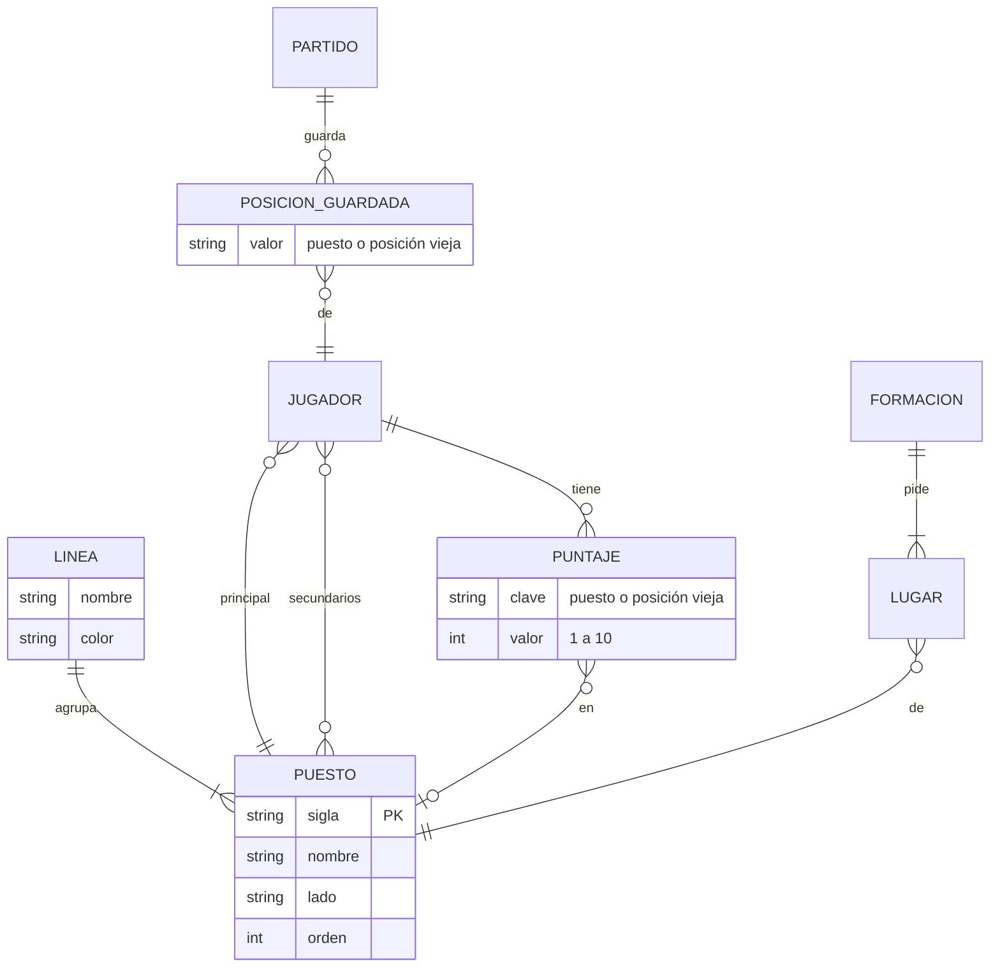

# Desglose de posiciones — Spec

> **Status:** Draft · **Date:** 2026-09-30 · **Owner:** Lucas Manoukian
>
> **Reviewers:** *pending*
>
> **Concept note:** [DESGLOSE_POSICIONES_CONCEPT.md](./DESGLOSE_POSICIONES_CONCEPT.md)
>
> **Implementation plan:** *not yet written*

> **Grounding evidence (`MD-25`).** Esta Spec se apoya en el ledger §6.5 *Sources &
> Origins* del Concept Note. Donde un `FR-*`/`NFR-*`/`TC-*` se apoya en una ubicación de
> código o en una Spec vigente que el Concept Note no cubre, la cita va **en línea** en la
> sección donde se define el requisito.

> **Declaración de reemplazo (gobernanza vigente en [`AGENTS.md`](../../AGENTS.md)).**
> Esta Spec cambia el catálogo de posiciones sobre el que están escritas varias Specs
> vigentes. Para no reescribirlas enteras, declara una **regla de lectura general** y una
> lista de **reemplazos puntuales**.
>
> **Regla de lectura general.** En toda Spec vigente, donde el texto dice "posición" para
> referirse al lugar de un jugador (posición principal, secundaria o asignada), se lee
> "puesto" del catálogo de `FR-001` de esta Spec; donde dice "la misma posición", se lee
> "el mismo puesto". Los requisitos que usan "posición" de forma genérica —sin nombrar
> Defensor, Volante o Delantero ni contar por línea— **siguen vigentes sin cambio de
> texto** bajo esta regla. Es el caso de `FR-003` de `003` (secundaria solo para corregir
> una imparidad), `FR-001` a `FR-005` de `011` (encaje), `FR-001` y `FR-002` de `014`
> (valor de una dupla por posición), `FR-008` de `008`, `FR-003` de `013` y `FR-003` de
> `010` (refinamiento entre titulares del mismo puesto).
>
> **Reemplazos puntuales.** Cada uno queda marcado en su Spec de origen, en la misma rama
> que esta Spec.
>
> | Spec | Parte | Qué dice hoy | Reemplazado por |
> |---|---|---|---|
> | [`002-gestion-jugadores`](../002-gestion-jugadores/spec.md) | `FR-010` (l. 111) | Arquero, Defensor, Volante y Delantero, cada una con un color fijo | `FR-001`, `FR-004` |
> | `002` | Key Entity "Posición" (l. 120) | las cuatro posiciones con color | Glosario "Puesto" y "Línea" (§6) |
> | `002` | `FR-011` (l. 112), en su filtro | filtrar por posición principal | `FR-030`, `FR-031` (se suma "A revisar") |
> | [`003-motor-generacion-equipos`](../003-motor-generacion-equipos/spec.md) | `FR-005` (l. 253), "o, en su defecto, como Delantero" | un arquero desplazado sin secundarias pasa a Delantero | `FR-065` (pasa a DEL) |
> | `003` | `FR-007` (l. 265) y US1 escenario 9 (l. 123) | orden Arquero, Defensor, Volante, Delantero | `FR-003` |
> | `003` | `FR-018` (l. 285), solo la formación | "3 defensores, 3 volantes y 1 delantero […]; 3 defensores, 4 volantes y 1 delantero" | `FR-050`, `FR-051`. La prioridad arqueros > formación > diferencia sigue vigente |
> | `003` | Key Entity "Formación fija" (l. 326) | cantidades por línea | `FR-050`, `FR-051`, Glosario "Formación" |
> | `003` | Key Entity "Línea" (l. 327) | "titulares […] que ocupan la misma posición" | Glosario "Línea": los titulares cuyos puestos pertenecen a esa línea |
> | `003` | Clarification 2026-08-25 Q4 (l. 85) y Edge case (l. 234) | "las permutaciones dentro de una misma línea no cuentan" | `FR-059`: cuentan las permutaciones entre puestos distintos de una línea; entre titulares del mismo puesto siguen sin contar |
> | `003` | Edge case (l. 233), en los números | "800 repartos […] en cancha de 8, 2.800 en cancha de 9" | Sin número fijo; el límite es `NFR-001`/`NFR-002` |
> | `003` | "Notas a futuro" (l. 354) | desglosar posiciones queda sin decidir | Resuelta por esta Spec (`FR-053`, `FR-054`, `FR-059`) |
> | [`003/data-model.md`](../003-motor-generacion-equipos/data-model.md) | l. 7, l. 17-23, l. 53-55 | `POSITIONS` de cuatro; `formacion: {defensores, volantes, delanteros}` | §10.1 de esta Spec |
> | [`011-encaje-optimo-formacion`](../011-encaje-optimo-formacion/spec.md) | Assumption (l. 177) | "las posiciones de campo son tres" | `A-02` de esta Spec (siete puestos de campo) |
> | [`ORDEN_JUGADORES_SPEC.md`](../orden-jugadores/ORDEN_JUGADORES_SPEC.md) | `TC-012` (l. 128), `FR-030` (l. 439), `S-03` (l. 575-580), `S-03b` (l. 585) | secuencia Arquero, Defensor, Volante, Delantero | `FR-003`, `FR-032` |
> | [`CANCHA_SPEC.md`](../equipos-en-el-campo/rebanada-1-cancha/CANCHA_SPEC.md) | Glosario "Línea" (l. 277) | "camisetas […] que comparten posición asignada. Son cuatro: Ataque, Medio, Defensa y Arco" | Glosario "Línea"; `FR-070` |
> | [`PARTIDO_FINALIZADO_SPEC.md`](../equipos-en-el-campo/rebanada-4-partido-finalizado/PARTIDO_FINALIZADO_SPEC.md) | `TC-035` (l. 280) y `A-02` (l. 880), en la forma del dato | la etiqueta se arma como `"{defensores}-{volantes}-{delanteros}"` | `TC-013`: la etiqueta se cuenta por línea. Lo que `TC-035` existe para fijar —que la etiqueta se deriva del dato y nunca es literal— sigue vigente |
>
> **Complementa sin reemplazar** a `FR-015` de `CANCHA_SPEC.md` (orden estable dentro de
> una línea): `FR-071` a `FR-073` fijan *cuál* es ese orden, y el orden sigue siendo estable.
>
> **No reemplaza** —y lo declara para que no se lea como contradicción— a
> [`ARRASTRE_SPEC.md`](../equipos-en-el-campo/rebanada-2-arrastre/ARRASTRE_SPEC.md): un
> movimiento manual sigue sin escribir el puesto asignado (`TC-012`, `FR-022`), así que un
> intercambio puede dejar a un equipo con dos DC y ningún LD, igual que hoy lo deja con
> cuatro defensores. Tampoco reemplaza a `FR-005` de
> [`006-copiar-formacion`](../006-copiar-formacion/spec.md): el texto copiado sigue sin
> puestos (`FR-091`), ni a [`INTERCAMBIAR_COLORES_SPEC.md`](../intercambiar-colores/INTERCAMBIAR_COLORES_SPEC.md):
> `FR-013` y `FR-014` invierten el balance por línea y la formación sea cual sea la forma
> de su contenido. Esto cierra `OPEN-Q-07` del Concept Note.

## 1. Purpose

Esta Spec define cómo la aplicación reemplaza las cuatro posiciones de hoy por ocho
puestos agrupados en cuatro líneas: qué elige el administrador en la ficha de un jugador,
cómo reclasifica a los jugadores existentes, cuándo el motor se niega a generar, qué
pide la Formación Fija, cómo reparte "Por posición y puntaje", cómo se dibujan los lados
en la cancha, y cómo se siguen leyendo los partidos ya guardados. El porqué está en el
Concept Note; cómo se construye, en el Implementation Plan.

## 2. Summary

Hoy un jugador es Arquero, Defensor, Volante o Delantero, y para el motor esa posición es
también su línea. Con esta feature cada jugador tiene un puesto principal y puestos
secundarios entre ocho —ARQ, LD, DC, LI, MD, MC, MI, DEL—, cada uno perteneciente a una
línea: Arco, Defensa, Medio o Ataque. La Formación Fija pide puestos (Fútbol 8:
un jugador en cada uno de los siete puestos de campo; Fútbol 9: lo mismo con dos MC),
"Por posición y puntaje" empareja cada puesto entre los dos equipos, y el equilibrio de
líneas sigue sumando por línea. Los jugadores existentes quedan "a revisar" hasta que el
administrador les elige puestos nuevos, con el puntaje viejo precargado; mientras un
titular esté "a revisar", el partido no se genera. Los partidos guardados no se tocan:
sus posiciones viejas se leen como su línea y sus puntajes viejos se conservan ocultos
para seguir mostrándolos igual. La aplicación sigue siendo un organizador de partidos
entre amigos; lo que cambia es la resolución con la que describe dónde juega cada uno.

## 3. Scope

### 3.1 In scope

- El catálogo de ocho puestos y cuatro líneas, con sigla, nombre, línea, lado, orden y
  color.
- La ficha de jugador con los puestos nuevos, y la reclasificación de los jugadores con
  posiciones viejas, con precarga y conservación de los puntajes viejos.
- El filtro y el orden de la lista de jugadores.
- El bloqueo de la generación por titulares "a revisar".
- La Formación Fija por puesto, el equilibrio de líneas por línea, "Por posición y
  puntaje" por puesto, y los textos del resumen y la explicación.
- El orden izquierda-centro-derecha dentro de cada fila de la cancha.
- La lectura de posiciones viejas en los partidos guardados.

### 3.2 Out of scope / non-goals

- El sistema no ofrecerá puestos fuera de los ocho de `FR-001` (ni carrileros, ni
  mediocampista defensivo u ofensivo, ni extremos, ni segundo delantero).
- El sistema no permitirá elegir la formación por partido: Fútbol 8 es 3-3-1 y Fútbol 9
  es 3-4-1 (postergado, no descartado — Concept Note §14).
- El sistema no asignará un puesto nuevo a ningún jugador sin que lo elija el
  administrador.
- El sistema no reescribirá ningún partido guardado.
- El sistema no medirá el equilibrio por puesto: las líneas siguen siendo Arco, Defensa,
  Medio y Ataque.
- El sistema no mostrará la diferencia por línea con "Por posición y puntaje"
  (`Roadmap.md:46`, sin cambios).
- El sistema no incluirá puestos en el texto copiado de la formación (`006`, `FR-005`).
- El sistema no resuelve condiciones de carrera entre dos administradores editando al
  mismo jugador a la vez: como hoy, gana la última escritura sobre el documento
  compartido (`data/players`/`data/playerScores`); esta Spec no agrega ningún escenario
  `[concurrency]` en §9 para ese caso.

### 3.3 Constraints inherited from the Concept Note

- **D-01** (catálogo de ocho puestos) — heredada; `FR-001`, `FR-002`.
- **D-02** (Estrategia 2 parejo por puesto) — heredada; `FR-060` a `FR-063`.
- **D-03** (Formación Fija por puesto; rótulo por línea) — heredada; `FR-050`, `FR-051`,
  `FR-055`, `TC-013`.
- **D-04** (equilibrio por línea) — heredada; `FR-053`, `FR-056`.
- **D-05** (formación, encaje y reparto por puesto; intercambio entre equipos solo del
  mismo puesto) — heredada; `FR-052`, `FR-054`, `FR-059`.
- **D-06** (un puntaje opcional por puesto jugado) — heredada; `FR-012`.
- **D-07** (puntajes viejos conservados y precargados por línea) — heredada; `FR-023` a
  `FR-025`, `FR-027`.
- **D-08** (nada se convierte solo; "a revisar") — heredada; `FR-020`.
- **D-09** (bloqueo de la generación) — heredada; `FR-040` a `FR-045`.
- **D-10** (partidos guardados leídos por línea, sin reescribir) — heredada; `FR-080` a
  `FR-084`, `TC-003`.
- **D-11** (un color por línea) — heredada; `FR-004`, `TC-030`.
- **D-12** (lados en la cancha) — heredada; `FR-071` a `FR-074`.
- **D-13** (explicación con los puestos nuevos) — heredada; `FR-057`, `FR-058`, `FR-063`,
  `TC-014`.

## 4. Technical & architectural constraints

### 4.1 Platform / stack constraints

- **TC-001** — La feature vivirá en `index.html`, dentro del IIFE existente, sin paso de
  build, sin bundler y sin dependencias nuevas (`AGENTS.md` § Estilo y § Dependencias).
- **TC-002** — Los puestos, los puntajes y los puntajes viejos se persistirán en los
  documentos que ya existen (`data/players` y `data/playerScores`,
  [index.html:2142-2154](../../index.html#L2142-L2154)), a través de la interfaz de
  guardar/leer existente. No se agregará ningún documento nuevo: un documento nuevo
  necesita su propio bloque en las Firestore Rules, publicado a mano en los dos proyectos
  ([index.html:2039-2041](../../index.html#L2039-L2041)).
- **TC-003** — La feature no escribirá `data/partidos` ni `data/partidosArmado` como parte
  de ninguna migración o conversión. Un partido solo se vuelve a escribir por las mismas
  acciones que ya lo escriben hoy (generar, regenerar, mover, intercambiar colores,
  finalizar, cargar el resultado).

### 4.2 Architectural / integration constraints

- **TC-010** — Un único catálogo definirá, para cada puesto, su sigla, nombre, línea, lado
  y lugar en el orden; y para cada línea, su nombre y su color. Ningún otro lugar del
  código enumerará puestos ni líneas como literales: formulario, filtro, orden, colores,
  motor, cancha y panel se derivan del catálogo. Mismo criterio que `TC-013` de
  `PANEL_ARMADO_SPEC.md` (no codificar "Arco" y "Ataque" como literales).
- **TC-011** — Una única tabla definirá la correspondencia de cada posición vieja con su
  línea (Arquero → Arco, Defensor → Defensa, Volante → Medio, Delantero → Ataque),
  y todo lugar que lea una posición guardada la resolverá a través de ella.
- **TC-012** — El motor recibirá los puestos, las líneas y la formación como datos, y la
  interfaz no calculará formación ni encaje. Se mantiene la separación interfaz / motor /
  persistencia de `AGENTS.md` (Arquitectura desacoplada).
- **TC-013** — La etiqueta de formación ("3-3-1", "3-4-1") se derivará de la formación de
  la cancha contando lugares por línea (Defensa-Medio-Ataque), nunca como cadena
  literal. Reemplaza la forma del dato de `TC-035` de `PARTIDO_FINALIZADO_SPEC.md`,
  conservando su propósito.
- **TC-014** — Toda decisión del motor que involucre un puesto (cobertura por secundaria,
  puesto sin cubrir, arquero desplazado, bloqueo) aparecerá en el resumen o en la
  explicación con el nombre o la sigla del puesto (`AGENTS.md`, Explicabilidad del
  motor).

### 4.3 Compliance / regulatory constraints

- **TC-020** — El puesto de un jugador se distinguirá por texto (su sigla) y no solo por
  color, porque varios puestos comparten el color de su línea (WCAG 2.1, criterio 1.4.1
  *Use of Color*,
  [`https://www.w3.org/WAI/WCAG21/Understanding/use-of-color.html`](https://www.w3.org/WAI/WCAG21/Understanding/use-of-color.html),
  verificado por el Concept Note §6.5).

### 4.4 Conventions to follow

- **TC-030** — Los colores de las líneas serán los cuatro que ya usan las posiciones
  ([index.html:1491](../../index.html#L1491): rojo *negative*, naranja *tertiary*,
  amarillo *warning*, verde *positive* del design system), con el texto oscuro sobre el
  amarillo que ya aplica `posTextColor`. Toda otra decisión visual se resuelve contra
  [`.claude/skills/football-app-design/`](../../.claude/skills/football-app-design/); esta
  Spec no declara excepciones al design system.
- **TC-031** — Todo test que satisfaga un `S-NN`, `NFR-NNN` o `TC-NNN` llevará el
  identificador en forma canónica con guion dentro de un string literal —el nombre del
  caso o el campo `spec:` de un escenario de `layout.test.js`—, nunca en un comentario
  (`AGENTS.md` § Tests).
- **TC-032** — Toda constante o función de `index.html` que se renombre o se borre y
  figure en la lista `DECLARACIONES` de `tests/harness.js` o de otro test se actualizará
  en esa lista en el mismo commit (`AGENTS.md` § Estilo).
- **TC-033** — Cada pantalla que esta feature modifica y que `tests/layout.test.js` no
  cubre todavía —la ficha de jugador con los ocho puestos y el aviso de bloqueo— se
  agregará ahí como escenario nuevo, y ese escenario se verá fallar al menos una vez
  antes de darlo por bueno (`AGENTS.md`, Responsive).

### 4.5 Security constraints (`MD-31`)

CWE Top 25 consultado en vivo el 2026-09-30: edición 2025
(`https://cwe.mitre.org/top25/`, que remite a
`https://www.cwe.org/top25/archive/2025/2025_cwe_top25.html`).

- **TC-040** — Todo valor de puesto o de posición leído de lo guardado (del jugador o del
  partido) se insertará en la interfaz solo a través del catálogo (`TC-010`) o de la
  tabla de posiciones viejas (`TC-011`); un valor que no esté en ninguno de los dos se
  insertará escapado, nunca crudo. Hace falta porque `data/partidos`, que guarda el
  puesto asignado de cada jugador, lo puede escribir el rol `jugador`
  ([`firestore-rules.md:65-75`](../rol-en-el-token/contracts/firestore-rules.md)), y hoy
  la aplicación inserta la posición desconocida tal cual en rótulos y `title`
  (`LABEL_LINEA[pos] || pos`), **defends `CWE-79` *Cross-Site Scripting***.
- **TC-041** — Los puntajes nuevos y los puntajes viejos conservados se persistirán solo
  en `data/playerScores`, de lectura exclusiva de `admin`, nunca en `data/players`
  ([index.html:2142-2154](../../index.html#L2142-L2154)), **defends `CWE-200` *Exposure
  of Sensitive Information to an Unauthorized Actor***.
- **TC-042** — Un valor de puesto guardado que no sea ni un puesto del catálogo ni una
  posición vieja se tratará como "sin puesto" sin interrumpir la pantalla ni la
  generación, **defends `CWE-20` *Improper Input Validation***.
- **`CWE-862` *Missing Authorization*** — ruling, no commitment: la ficha de jugador ya
  es exclusiva de `admin` ([index.html:1180](../../index.html#L1180), `admin-only`) y
  esta feature no agrega ninguna acción nueva fuera de ella; el bloqueo de `FR-040` es una
  restricción que se agrega, no un permiso.
- **`CWE-284` / `CWE-863`** — ruling, no commitment: que `jugador` pueda escribir
  `data/partidos` es una condición preexistente
  ([`firestore-rules.md:65-75`](../rol-en-el-token/contracts/firestore-rules.md)), no
  introducida ni agravada por esta feature, que no toca las reglas (Concept Note §5.2).
- **`CWE-352` *CSRF*** — no aplica: no hay endpoint propio con sesión por cookie; la
  escritura va por el SDK de Firestore con el token del usuario.
- Resto de la lista (`CWE-89`, `-787`, `-22`, `-416`, `-125`, `-78`, `-94`, `-120`,
  `-434`, `-476`, `-121`, `-502`, `-122`, `-306`, `-918`, `-77`, `-639`, `-770`) — no
  aplica: sin SQL, sin memoria manual, sin sistema de archivos, sin comandos, sin
  subidas, sin deserialización de datos no confiables más allá del `JSON.parse` de los
  documentos propios, sin pedidos del servidor, y toda acción exige sesión autenticada
  con rol.

## 5. Users & use cases

### 5.1 Personas / actors

| Actor | Description | Primary need |
|---|---|---|
| Administrador (`admin`) | Carga jugadores, arma los partidos, genera los equipos | Describir dónde juega cada uno y que el motor arme equipos que se paren en la cancha |
| Jugador (`jugador`) | Ve la lista, los partidos y la cancha | Ver su puesto y el de los demás |

### 5.2 User stories

| ID | Story | Implements |
|---|---|---|
| US-01 | Como administrador, quiero elegir para cada jugador un puesto principal y secundarios entre los ocho, con su puntaje, para describir dónde juega de verdad. | FR-010 a FR-014 |
| US-02 | Como administrador, quiero reclasificar a los jugadores existentes sin perder sus puntajes, para no cargar todo de nuevo. | FR-020 a FR-029, FR-022b |
| US-03 | Como administrador, quiero encontrar rápido a los jugadores que me faltan reclasificar. | FR-021, FR-030 a FR-032 |
| US-04 | Como administrador, quiero que el motor no arme un partido con datos viejos y me diga a quién tengo que reclasificar. | FR-040 a FR-045 |
| US-05 | Como administrador, quiero que la Formación Fija ponga en cada equipo un lateral de cada lado, los centrales y los volantes por afuera. | FR-050 a FR-058 |
| US-06 | Como administrador, quiero que "Por posición y puntaje" empareje cada puesto. | FR-060 a FR-063 |
| US-07 | Como jugador, quiero ver en la cancha a cada uno de su lado. | FR-070 a FR-077 |
| US-08 | Como administrador, quiero que los partidos ya jugados se sigan viendo como se jugaron. | FR-080 a FR-084 |

## 6. Glossary

| Term | Definition |
|---|---|
| Puesto | Uno de los ocho lugares del catálogo de `FR-001` (ARQ, LD, DC, LI, MD, MC, MI, DEL). Reemplaza a "posición" en toda la aplicación. |
| Línea | Uno de los cuatro grupos de puestos: Arco (ARQ), Defensa (LD, DC, LI), Medio (MD, MC, MI), Ataque (DEL). Los titulares de un equipo en una línea son los que tienen asignado un puesto de esa línea. |
| Lado | Izquierdo, central o derecho. Cada puesto tiene uno; ARQ y DEL son centrales. |
| Posición vieja | Defensor, Volante o Delantero: valores del catálogo anterior que ya no se pueden elegir pero se siguen reconociendo al leer lo guardado. Arquero no es una posición vieja: es el puesto ARQ. |
| Jugador a revisar | Un jugador cuya posición principal o alguna de sus secundarias es una posición vieja. |
| Reclasificar | Guardar la ficha de un jugador a revisar con puestos del catálogo nuevo. |
| Puntaje viejo | El puntaje que un jugador tenía cargado en una posición vieja. Se conserva oculto después de reclasificar (`FR-027`). |
| Formación | La cantidad de lugares por puesto que pide cada tamaño de cancha (`FR-050`, `FR-051`). Su etiqueta ("3-3-1") cuenta lugares por línea. |
| Línea de un solo lugar | Una línea que la formación llena con un solo jugador por equipo: Arco y Ataque en Fútbol 8 y 9. Se define por línea, no por puesto. |
| Unidad de armado | Un jugador suelto o una dupla de rotación, como en `008`. |

## 7. Functional requirements

### 7.1 Catálogo

- **FR-001** — El sistema ofrecerá exactamente estos ocho puestos:

  | Sigla | Nombre | Línea | Lado |
  |---|---|---|---|
  | ARQ | Arquero | Arco | central |
  | LI | Lateral Izquierdo | Defensa | izquierdo |
  | DC | Defensor Central | Defensa | central |
  | LD | Lateral Derecho | Defensa | derecho |
  | MI | Mediocampista Izquierdo | Medio | izquierdo |
  | MC | Mediocampista Central | Medio | central |
  | MD | Mediocampista Derecho | Medio | derecho |
  | DEL | Delantero Central | Ataque | central |

- **FR-002** — El sistema seguirá nombrando las líneas Arco, Defensa, Medio y Ataque en
  toda la interfaz —panel de armado, resumen, explicación y cancha—, como hoy
  (`PANEL_ARMADO_SPEC.md` `FR-031b`, `CANCHA_SPEC.md` `FR-011`).
- **FR-003** — Donde la aplicación ordene por puesto, usará el orden ARQ, LI, DC, LD, MI,
  MC, MD, DEL.
- **FR-004** — El sistema pintará cada puesto con el color de su línea: Arco rojo,
  Defensa naranja, Medio amarillo, Ataque verde (`TC-030`).
- **FR-005** — Donde la aplicación muestre el puesto de un jugador en una etiqueta
  (lista, convocados, autocompletado, camiseta), mostrará su sigla.
- **FR-006** — Donde la aplicación ofrezca elegir un puesto (ficha, filtro), mostrará su
  nombre y su sigla.

### 7.2 Ficha de jugador

- **FR-010** — El sistema permitirá elegir el puesto principal solo entre los ocho
  puestos de `FR-001`.
- **FR-011** — El sistema permitirá elegir como secundarios cualquier cantidad de los
  puestos de `FR-001` distintos del principal.
- **FR-012** — El sistema ofrecerá un casillero de puntaje de 1 a 10, opcional, por el
  puesto principal y por cada secundario, y ninguno por los puestos que el jugador no
  juega.
- **FR-013** — El sistema no ofrecerá Defensor, Volante ni Delantero como valores
  elegibles en ningún selector.
- **FR-014** — Cuando el administrador deje de elegir un puesto nuevo que tenía puntaje,
  el sistema descartará ese puntaje al guardar (mismo comportamiento que el escenario 2
  de la User Story 5 de `002`).

### 7.3 Reclasificación

- **FR-020** — El sistema considerará "a revisar" a todo jugador cuya posición principal
  o alguna de cuyas secundarias sea una posición vieja.
- **FR-021** — Mientras un jugador esté a revisar, el sistema mostrará en su fila de la
  lista de jugadores una marca "A revisar".
- **FR-022** — Cuando el administrador abra la ficha de un jugador a revisar, el sistema
  preseleccionará los valores que sigan siendo puestos (ARQ) y dejará sin elegir los
  que eran posiciones viejas.
- **FR-022b** — Mientras la ficha de un jugador a revisar esté abierta, el sistema
  mostrará, como referencia de solo lectura, sus posiciones viejas con su puntaje viejo
  (p. ej. "Antes: Defensor 7 · Volante 6").
- **FR-023** — Cuando el administrador elija para un jugador a revisar un puesto de una
  línea en la que el jugador tenía un puntaje viejo, el sistema precargará el casillero
  de ese puesto con ese puntaje viejo, venga de la principal o de una secundaria.
- **FR-024** — El sistema permitirá cambiar o borrar un puntaje precargado antes de
  guardar.
- **FR-025** — Si el jugador no tenía puntaje viejo en la línea del puesto elegido,
  entonces el sistema dejará vacío ese casillero.
- **FR-026** — Cuando el administrador guarde la ficha de un jugador a revisar con
  puestos del catálogo nuevo, el sistema dejará de considerarlo a revisar.
- **FR-027** — El sistema conservará los puntajes viejos de un jugador después de
  reclasificarlo, sin mostrarlos ni permitir editarlos en la ficha.
- **FR-028** — El sistema calculará el puntaje promedio de un jugador reclasificado solo
  con los puntajes de sus puestos nuevos, y el de un jugador a revisar con sus puntajes
  viejos, como hoy.
- **FR-029** — El sistema usará un puntaje viejo únicamente para valorar a ese jugador en
  un partido guardado cuya posición guardada para él sea esa posición vieja (`FR-081`).

### 7.4 Lista de jugadores

- **FR-030** — El sistema ofrecerá en el filtro de la lista las opciones "Todas", cada
  uno de los ocho puestos, y "A revisar".
- **FR-031** — Cuando el filtro sea un puesto, el sistema mostrará los jugadores cuyo
  puesto principal es ese puesto; cuando sea "A revisar", los jugadores a revisar.
- **FR-032** — Cuando la lista se ordene por puesto, el sistema usará el orden de
  `FR-003`, y ubicará a un jugador cuya principal es una posición vieja al final del
  grupo de su línea; el descendente invierte ese orden.

### 7.5 Bloqueo de la generación

- **FR-040** — Mientras algún titular de un partido esté a revisar, el sistema no
  generará los equipos de ese partido.
- **FR-041** — Mientras algún titular de un partido esté a revisar, el sistema no
  regenerará los equipos de ese partido.
- **FR-042** — Cuando el administrador intente generar o regenerar un partido bloqueado
  por `FR-040`/`FR-041`, el sistema mostrará un aviso que nombra a cada titular a revisar.
- **FR-043** — El sistema no considerará bloqueante a un suplente a revisar.
- **FR-044** — El sistema considerará titular a revisar a una dupla de rotación titular
  si alguno de sus dos integrantes está a revisar.
- **FR-045** — Mientras un partido esté bloqueado por `FR-040`/`FR-041`, el sistema
  seguirá mostrando los equipos que ya tuviera generados, sin modificarlos.

### 7.6 Motor — Formación Fija

- **FR-050** — Con Formación Fija en Fútbol 8, el sistema completará en cada equipo un
  lugar de cada uno de estos puestos: LD, DC, LI, MD, MC, MI y DEL, además del arco.
- **FR-051** — Con Formación Fija en Fútbol 9, el sistema completará en cada equipo los
  lugares de `FR-050` más un segundo lugar de MC.
- **FR-052** — El sistema decidirá qué titular ocupa cada lugar de la formación con las
  reglas de encaje de `011` (`FR-001` a `FR-005`), donde cada lugar es un puesto.
- **FR-053** — El sistema medirá el equilibrio de líneas sumando, para cada línea y cada
  equipo, el puntaje de los titulares en el puesto de esa línea que efectivamente ocupan.
- **FR-054** — El sistema, al elegir el reparto entre equipos y al refinarlo, solo
  intercambiará entre equipos titulares del mismo puesto asignado.
- **FR-055** — El sistema rotulará la formación como Defensa-Medio-Ataque
  contando lugares por línea: "3-3-1" en Fútbol 8 y "3-4-1" en Fútbol 9 (`TC-013`).
- **FR-056** — El sistema tratará como línea de un solo lugar a toda línea cuyo total de
  lugares por equipo en la formación sea 1, contando todos los puestos de esa línea.
- **FR-057** — Si un lugar de la formación queda cubierto por alguien que no juega ese
  puesto, entonces el sistema lo dirá en la explicación nombrando el puesto (p. ej. "No
  se pudo cubrir LI en el Equipo Negro").
- **FR-058** — Cuando el sistema use el puesto secundario de un jugador para cubrir un
  lugar, lo dirá en la explicación nombrando el puesto (p. ej. "Se usó a Juan de LI, su
  puesto secundario").
- **FR-059** — Al permutar puestos dentro de un mismo equipo (`003` `FR-027`), el sistema
  considerará también las permutaciones entre puestos distintos de una misma línea, no
  solo entre titulares del mismo puesto.

### 7.7 Motor — Por posición y puntaje

- **FR-060** — Con "Por posición y puntaje" y la regla de balancear posiciones activa, el
  sistema repartirá por separado a los titulares de cada puesto de campo.
- **FR-061** — Con "Por posición y puntaje", el sistema usará un puesto secundario solo
  para corregir una cantidad impar de titulares en un puesto (`003` `FR-003`), y solo si
  el parámetro `usarSecundarias` está activo.
- **FR-062** — Con "Por posición y puntaje", el sistema buscará que cada puesto de campo
  tenga la misma cantidad de titulares en los dos equipos, o que difiera en uno cuando el
  total de ese puesto es impar y no se pudo corregir.
- **FR-063** — Con "Por posición y puntaje", el sistema mostrará en el resumen el balance
  de posiciones por puesto.

### 7.8 Motor — común

- **FR-065** — Si un arquero natural no gana el arco y no tiene puestos secundarios de
  campo, entonces el sistema lo ubicará como DEL.
- **FR-066** — Cuando el sistema regenere un partido con un titular bloqueado cuyo puesto
  guardado es una posición vieja, lo mantendrá en su equipo y le asignará puesto como a
  un titular no bloqueado.
- **FR-067** — Con "Por puntaje", el sistema seguirá sin asignar puestos y mostrará la
  sigla del puesto principal a modo informativo (`003` `FR-002`).
- **FR-068** — El sistema calculará el valor de una dupla de rotación en cada uno de los
  ocho puestos con la fórmula de `014` (`FR-001`, `FR-002`).

### 7.9 Cancha

- **FR-070** — El sistema dibujará en cada cancha una fila por línea, de arriba hacia
  abajo Ataque, Medio, Defensa y Arco, e igual dibujará vacía una línea sin
  jugadores (`CANCHA_SPEC.md` `FR-012`).
- **FR-071** — El sistema ordenará las camisetas de cada fila de izquierda a derecha por
  el lado de su puesto asignado: izquierdos, centrales, derechos.
- **FR-072** — El sistema mantendrá juntas, en su lado, a las camisetas del mismo lado,
  en el orden estable de `CANCHA_SPEC.md` `FR-015`.
- **FR-073** — Mientras una fila tenga cinco camisetas o más, el sistema pondrá en la
  sub-fila superior las primeras en el orden de `FR-071` y en la inferior las restantes,
  con la partición de `CANCHA_SPEC.md` `FR-014`.
- **FR-074** — El sistema dibujará a un jugador cuyo puesto guardado es una posición vieja
  en la fila de su línea (`TC-011`), como central.
- **FR-075** — El sistema dibujará a un jugador sin puesto reconocible (`TC-042`) en una
  fila aparte debajo del arco, como hoy
  ([index.html:4661-4672](../../index.html#L4661-L4672)).
- **FR-076** — El sistema expondrá en el `title` de la camiseta el nombre del puesto
  asignado y, si difiere, el del puesto principal (`CANCHA_SPEC.md` `FR-023`,
  `FR-023b`).
- **FR-077** — El sistema mostrará la marca "2º" en la camiseta cuando el puesto asignado
  no sea el principal, como hoy
  ([index.html:4820-4832](../../index.html#L4820-L4832)).

### 7.10 Partidos guardados

- **FR-080** — El sistema leerá cada posición vieja guardada en un partido como su línea
  (`TC-011`) para dibujar la cancha, calcular la diferencia por línea, verificar la
  formación y decidir si el reparto se apartó de la generación.
- **FR-081** — El sistema valorará a un jugador en un partido guardado con posición vieja
  con su puntaje viejo en esa posición.
- **FR-082** — Si la formación guardada de un partido está expresada por línea (forma
  anterior), entonces el sistema verificará su cumplimiento contando titulares por línea.
- **FR-083** — El sistema mostrará la etiqueta de formación de un partido guardado con la
  forma anterior igual que antes ("3-3-1", "3-4-1").
- **FR-084** — El sistema no modificará ningún partido guardado por el solo hecho de
  leerlo (`TC-003`).

### 7.11 Textos

- **FR-090** — El sistema describirá las estrategias y las reglas del motor en la
  pantalla de Configuración con los puestos y las líneas nuevos, sin mencionar
  defensores, volantes ni delanteros como posiciones.
- **FR-091** — El sistema seguirá sin incluir puestos en el texto copiado de la formación
  (`006` `FR-005`).

## 8. Non-functional requirements

| ID | Category | Requirement |
|---|---|---|
| NFR-001 | Performance | Con Formación Fija, cada uno de los cinco planteles de referencia de `node tools/medir-motor.js perf` genera en ≤ 50 ms, en Fútbol 8 y en Fútbol 9. Línea de base medida el 2026-09-30 con las cuatro posiciones: entre 0,5 y 9,6 ms. |
| NFR-002 | Performance | Con Formación Fija, el peor caso de 300 planteles generados con mezcla 0,95 (`perf --n=300`, opción de mezcla por defecto del peor caso) genera en ≤ 1.000 ms, en cada tamaño de cancha. Línea de base 2026-09-30: 534 ms (F8) y 685 ms (F9). |
| NFR-003 | Responsive | La lista de jugadores, la ficha con ocho puestos y ocho casilleros, el aviso de bloqueo, la cancha y el panel de armado cumplen, en 360 px, en cada breakpoint de CSS medido de los dos lados y en la franja de tablet: `scrollWidth === clientWidth` y ningún elemento con el borde derecho fuera del viewport (`node tests/layout.test.js`). |
| NFR-004 | Accessibility | Todo puesto mostrado en una etiqueta tiene su sigla en texto (`TC-020`); el texto sobre el amarillo de Medio usa el color oscuro que ya usa `posTextColor`. |
| NFR-005 | Compatibility | Con los datos reales de staging, el 100% de los partidos guardados se dibuja con cero camisetas en la fila de "sin puesto reconocible" (`FR-075`), y los totales por equipo que muestra cada partido finalizado son iguales antes y después de reclasificar a todos sus jugadores. |
| NFR-006 | Maintainability | Fuera del catálogo (`TC-010`) y de la tabla de posiciones viejas (`TC-011`), `index.html` no contiene ningún literal `'Defensor'`, `'Volante'`, `'Delantero'`, ni lista de siglas de puestos. |

## 9. System behaviour & scenarios

### 9.1 Happy path scenarios

#### Scenario S-01 — Reclasificar a un Defensor con Volante secundaria (covers FR-020 a FR-027, FR-022b)

- **Given** Juan, con posición principal Defensor (puntaje 7) y secundaria Volante
  (puntaje 6)
- **And** la lista de jugadores muestra "A revisar" en su fila
- **When** el administrador abre su ficha
- **Then** el principal y los secundarios están sin elegir y la ficha muestra "Antes:
  Defensor 7 · Volante 6"
- **When** elige LD como principal y DC y MD como secundarios
- **Then** los casilleros de LD y DC muestran 7 y el de MD muestra 6
- **When** cambia DC a 5 y guarda
- **Then** la fila de Juan deja de mostrar "A revisar"
- **And** sus puntajes son LD 7, DC 5, MD 6, y su promedio es 6
- **And** sus puntajes viejos Defensor 7 y Volante 6 siguen guardados y no aparecen en la
  ficha

**Variants:**

- `S-01a [boundary]` — principal Arquero y secundaria Defensor: ARQ viene preseleccionado
  con su puntaje, y el jugador está a revisar solo por la secundaria.
- `S-01b [boundary]` — principal Arquero sin secundarias: el jugador no está a revisar y
  no se le pide nada.
- `S-01c [boundary]` — elige MI sin tener puntaje viejo de Medio: el casillero de MI
  queda vacío.
- `S-01d [boundary]` — borra el puntaje precargado de LD y guarda: LD queda sin puntaje y
  el jugador igual deja de estar a revisar.
- `S-01e [failure]` — intenta guardar sin elegir principal: la ficha no se guarda y
  muestra el error de principal obligatorio que ya existe.
- `S-01f [property]` — para todo jugador a revisar y toda elección de puestos, después de
  guardar sus puntajes viejos son idénticos a los de antes.

#### Scenario S-02 — Alta de un jugador nuevo (covers FR-010 a FR-013, FR-005)

- **Given** la ficha vacía de un jugador nuevo
- **When** el administrador abre el selector de puesto principal
- **Then** ve exactamente los ocho puestos de `FR-001`, cada uno con nombre y sigla, y
  ninguna posición vieja
- **When** elige DC como principal, LD como secundario, carga DC 8 y deja LD vacío, y
  guarda
- **Then** la lista muestra al jugador con la etiqueta "DC" en naranja y sin marca "A
  revisar"

**Variants:**

- `S-02a [boundary]` — elige los siete puestos restantes como secundarios: la ficha
  muestra ocho casilleros y en 360 px no produce scroll horizontal (`NFR-003`).
- `S-02b [boundary]` — quita LD de los secundarios después de cargarle 6: al guardar, el
  puntaje de LD se descarta (`FR-014`).
- `S-02c [failure]` — carga 11 en DC: la ficha no se guarda y muestra el error de rango
  que ya existe.

#### Scenario S-03 — Filtrar y ordenar la lista (covers FR-003, FR-030 a FR-032)

- **Given** un plantel con un ARQ, un LI, dos DC, un "Defensor" sin reclasificar y un DEL
- **When** el administrador ordena por puesto ascendente
- **Then** la lista queda ARQ, LI, DC, DC, "Defensor", DEL
- **When** filtra por "A revisar"
- **Then** la lista muestra solo al "Defensor"

**Variants:**

- `S-03a [boundary]` — orden descendente: DEL, "Defensor", DC, DC, LI, ARQ.
- `S-03b [boundary]` — filtro DC: muestra los dos DC y no al "Defensor".
- `S-03c [boundary]` — sin ningún jugador a revisar, el filtro "A revisar" muestra la
  lista vacía con el mensaje de lista vacía que ya existe.

#### Scenario S-04 — Bloqueo por un titular a revisar (covers FR-040, FR-042, FR-045)

- **Given** un partido de Fútbol 8 con 16 titulares, dos de ellos (Pedro y Luis) a
  revisar
- **When** el administrador toca Generar
- **Then** el sistema no genera equipos y muestra un aviso que nombra a Pedro y Luis
- **When** reclasifica a los dos y vuelve a tocar Generar
- **Then** el sistema genera los equipos

**Variants:**

- `S-04a [boundary]` — el único a revisar es suplente: el partido se genera (`FR-043`).
- `S-04b [boundary]` — un titular se baja y entra un suplente a revisar: el partido queda
  bloqueado.
- `S-04c [boundary]` — una dupla titular con un integrante a revisar: el aviso nombra a
  ese integrante (`FR-044`).
- `S-04d [failure]` — el partido ya tenía equipos generados y el administrador toca
  Regenerar: no se regenera, el aviso nombra a los titulares a revisar y los equipos
  anteriores siguen visibles sin cambios (`FR-041`, `FR-045`).

#### Scenario S-05 — Formación Fija en Fútbol 8 (covers FR-050, FR-052, FR-055, FR-058)

- **Given** un partido de Fútbol 8 con dos ARQ, y dos titulares naturales de cada uno de
  LD, DC, LI, MD, MC, MI y DEL
- **When** el administrador genera con Formación Fija
- **Then** cada equipo tiene exactamente un titular en ARQ, LD, DC, LI, MD, MC, MI y DEL
- **And** la explicación dice que la formación 3-3-1 se cumplió en ambos equipos

**Variants:**

- `S-05a [boundary]` — Fútbol 9 con cuatro MC naturales: cada equipo tiene dos MC y la
  explicación dice 3-4-1 (`FR-051`).
- `S-05b [boundary]` — un solo LI natural y un DC con LI de secundario: el otro equipo
  tiene de LI a ese DC, y la explicación dice "Se usó a {nombre} de LI, su puesto
  secundario" (`FR-058`).
- `S-05c [failure]` — un solo LI natural y nadie con LI de secundario: la generación se
  completa, el LI del otro equipo lo ocupa un titular que no juega ese puesto, y la
  explicación dice "No se pudo cubrir LI en el Equipo {color}" (`FR-057`).
- `S-05d [property]` — para todo plantel cuyos principales y secundarios alcancen para
  cubrir la formación, cada equipo termina con todos los puestos de la formación
  cubiertos por alguien que los juega.

#### Scenario S-06 — Equilibrio de líneas con puestos (covers FR-053, FR-054, FR-056, FR-059)

- **Given** una generación con Formación Fija en Fútbol 8 donde el Blanco tiene LD 7,
  DC 6, LI 5 y el Negro LD 6, DC 6, LI 6
- **When** se muestra el panel de armado
- **Then** la celda de Defensa dice 18 contra 18 y diferencia 0
- **And** las celdas se llaman Arco, Defensa, Medio y Ataque (`FR-002`)

**Variants:**

- `S-06a [boundary]` — Arco y Ataque desparejas por encima del desvío aceptable:
  ninguna de las dos queda distinguida como excedida (`FR-056`).
- `S-06b [boundary]` — Fútbol 9: Medio tiene cuatro lugares por equipo y sí puede
  quedar distinguida como excedida.
- `S-06c [property]` — para todo armado, la suma de las cuatro líneas de un equipo es
  igual al total del equipo.
- `S-06d [property]` — para todo armado, intercambiar entre equipos a dos titulares del
  mismo puesto no cambia el encaje de ninguno de los dos equipos.
- `S-06e [boundary]` — en el Blanco, Juan y Pedro son DC de principal y LD de
  secundario (Juan: DC 5, LD 9; Pedro: DC 5, LD 4), el LI del Blanco vale 5 y la Defensa
  del Negro suma 18; las demás líneas empatan. Las dos formas de ubicarlos tienen el
  mismo encaje, y el sistema pone a Juan de LD y a Pedro de DC: Defensa 19 contra 18, en
  vez de 14 contra 18 (`FR-059`).

#### Scenario S-07 — "Por posición y puntaje" parejo por puesto (covers FR-060 a FR-063)

- **Given** un partido de Fútbol 8 con dos ARQ, y dos titulares naturales de cada puesto
  de campo
- **When** el administrador genera con "Por posición y puntaje"
- **Then** cada equipo tiene exactamente un titular de cada puesto de campo
- **And** el resumen muestra el balance de posiciones por puesto

**Variants:**

- `S-07a [boundary]` — tres LD naturales, uno de ellos con LI de secundario, y un solo
  LI: el sistema pasa a ese LD a LI y lo dice en la explicación.
- `S-07b [boundary]` — el mismo plantel con `usarSecundarias` desactivado: no se usa
  ninguna secundaria y un equipo queda con dos LD.
- `S-07c [boundary]` — la regla de balancear posiciones desactivada: los titulares se
  reparten en un solo grupo (`003`, US3 escenario 2).

#### Scenario S-08 — Arquero desplazado sin secundarias (covers FR-065)

- **Given** tres arqueros naturales titulares, uno de ellos sin puestos secundarios
- **When** el administrador genera con cualquier estrategia
- **Then** el arquero que no gana el arco y no tiene secundarios queda asignado como DEL
- **And** la explicación lo menciona como DEL

Variants: none — single-path scenario.

#### Scenario S-09 — Lados en la cancha (covers FR-070 a FR-073, FR-076)

- **Given** un partido de Fútbol 8 generado con Formación Fija
- **When** se muestra la cancha de un equipo
- **Then** de arriba hacia abajo se ven Ataque (DEL), Medio (MI, MC, MD), Defensa
  (LI, DC, LD) y Arco (ARQ), en ese orden de izquierda a derecha

**Variants:**

- `S-09a [boundary]` — Fútbol 9: el Medio se ve MI, MC, MC, MD.
- `S-09b [boundary]` — con "Por puntaje", un equipo tiene dos LD y un DC: la Defensa se
  ve DC, LD, LD.
- `S-09c [boundary]` — un equipo tiene cinco jugadores de Defensa (LI, LI, DC, LD, LD):
  la sub-fila superior muestra LI, LI, DC y la inferior LD, LD.
- `S-09d [property]` — dos repintados del mismo reparto dibujan las camisetas en el
  mismo orden (`CANCHA_SPEC.md` `FR-015`).

#### Scenario S-10 — Un partido viejo se sigue viendo igual (covers FR-074, FR-080 a FR-084, FR-081)

- **Given** un partido de Fútbol 8 finalizado antes del cambio, generado con Formación
  Fija, cuyos jugadores quedaron guardados como Arquero, Defensor, Volante y Delantero
- **And** todos sus jugadores ya fueron reclasificados
- **When** se abre el partido
- **Then** la cancha muestra a los "Defensor" en la fila de Defensa, a los "Volante" en
  Medio y al "Delantero" en Ataque, todos como centrales
- **And** los totales de cada equipo y la diferencia por línea son los mismos que antes
  del cambio
- **And** la formación se muestra como "3-3-1" cumplida
- **And** el partido guardado no cambió

**Variants:**

- `S-10a [boundary]` — el mismo partido antes de reclasificar a nadie: se ve igual.
- `S-10b [boundary]` — un partido viejo de Fútbol 9: la etiqueta es "3-4-1".
- `S-10c [boundary]` — un partido viejo generado con "Por puntaje" (sin posición
  asignada): cada jugador se dibuja en la línea de su principal actual.
- `S-10d [property]` — para todo partido guardado de staging, ninguna camiseta cae en la
  fila de "sin puesto reconocible" (`NFR-005`).

#### Scenario S-11 — Regenerar un partido armado antes del cambio (covers FR-066)

- **Given** un partido sin jugar, armado antes del cambio, con Juan bloqueado en el
  Blanco y guardado como "Defensor"
- **And** Juan ya fue reclasificado como LD
- **When** el administrador regenera con Formación Fija
- **Then** Juan sigue en el Blanco
- **And** tiene asignado un puesto del catálogo nuevo decidido por el motor

**Variants:**

- `S-11a [failure]` — Juan todavía está a revisar: no se regenera (`FR-041`).

#### Scenario S-12 — Textos de Configuración (covers FR-090)

- **Given** la pantalla de Configuración
- **When** el administrador lee la descripción de "Por posición y puntaje" y de
  "Formación Fija"
- **Then** ninguna menciona "defensor", "volante" ni "delantero" como posición, y la de
  Formación Fija nombra los puestos de 3-3-1 y 3-4-1

Variants: none — single-path scenario.

### 9.2 Edge cases

No hay casos límite sin escenario padre: todos viven como variantes en §9.1.

### 9.3 Failure / unwanted-behaviour scenarios

#### Scenario S-20 — Valor de puesto desconocido en un partido guardado (covers TC-040, TC-042, FR-075)

- **Given** un partido guardado donde el puesto de un jugador es el texto
  ``
- **When** se abre el partido
- **Then** la pantalla se dibuja sin interrumpirse y sin ejecutar ningún script
- **And** ese jugador aparece en la fila aparte debajo del arco, con el texto escapado

**Variants:**

- `S-20a [failure]` — el valor es un texto cualquiera ("Líbero"): mismo comportamiento,
  sin error.
- `S-20b [failure]` — el mismo valor en la principal de un jugador: la lista se dibuja,
  el jugador no está a revisar y no bloquea la generación como "a revisar"; el motor lo
  trata como sin puesto.

#### Scenario S-21 — El rol jugador no reclasifica (covers TC-041, CWE-862 ruling)

- **Given** una sesión con rol `jugador`
- **When** abre la lista de jugadores
- **Then** no ve la ficha de edición ni ningún puntaje, viejo o nuevo

Variants: none — single-path scenario.

## 10. Data model & external contracts

### 10.1 Domain entities (conceptual)

| Entity | Purpose | Key attributes (conceptual) | Lifecycle |
|---|---|---|---|
| Puesto | Lugar de un jugador en la cancha | sigla, nombre, línea, lado, orden | Catálogo fijo (`FR-001`) |
| Línea | Grupo de puestos para medir el equilibrio | nombre, color, orden de dibujo | Catálogo fijo (`FR-002`, `FR-004`) |
| Jugador | Ya existe | puesto principal, puestos secundarios | Pasa de "a revisar" a reclasificado una sola vez |
| Puntaje de jugador | Ya existe | puesto → 1..10 (opcional); posición vieja → 1..10 (oculto) | Los viejos se conservan (`FR-027`) |
| Formación | Ya existe | cancha → lugares por puesto | Fija por cancha (`FR-050`, `FR-051`) |
| Posición guardada en un partido | Ya existe | jugador → puesto o posición vieja | No se reescribe (`TC-003`) |

#### 10.1.1 Entity-relationship diagram

### 10.2 External APIs / events the feature consumes

| Source | Contract | Direction | Notes |
|---|---|---|---|
| Firestore `data/players` | jugador con principal y secundarias | inbound / outbound | Mismo documento; los valores pasan a ser puestos (`TC-002`) |
| Firestore `data/playerScores` | puntajes por clave | inbound / outbound | Solo `admin`; guarda también los puntajes viejos (`TC-041`) |
| Firestore `data/partidos`, `data/partidosArmado` | posición asignada, formación, balance por línea | inbound | Solo lectura para esta feature (`TC-003`) |

### 10.3 External APIs / events the feature exposes

Ninguno.

## 11. Acceptance criteria

### 11.1 Functional acceptance

- **AC-01** — `S-01` a `S-03` y sus variantes pasan (cubre `FR-001` a `FR-032`, incluido
  `FR-022b`).
- **AC-02** — `S-04` y `S-11a` pasan (cubre `FR-040` a `FR-045`).
- **AC-03** — `S-05` a `S-08` y `S-11` pasan (cubre `FR-050` a `FR-068`).
- **AC-04** — `S-09` y `S-10` pasan (cubre `FR-070` a `FR-084`).
- **AC-05** — `S-12` pasa (cubre `FR-090`, `FR-091`).

### 11.2 Non-functional acceptance

- **AC-10** — `NFR-001` y `NFR-002` verificados con `node tools/medir-motor.js perf` en
  cada tamaño de cancha, con los números anotados en el PR.
- **AC-11** — `NFR-003` verificado por `node tests/layout.test.js` con los escenarios de
  `TC-033`.
- **AC-12** — `NFR-004` verificado por revisión de las etiquetas en la lista, la cancha y
  el autocompletado.
- **AC-13** — `NFR-005` verificado abriendo en staging todos los partidos guardados antes
  y después de reclasificar, con un script de lectura que no escribe.
- **AC-14** — `NFR-006` verificado con `grep` sobre `index.html`.

### 11.3 Constraint compliance

- **AC-15** — `TC-001`: revisión de código; `git diff` no agrega archivos de build ni
  dependencias.
- **AC-16** — `TC-002`, `TC-041`: revisión de código; ningún puntaje en `data/players`,
  ningún documento nuevo.
- **AC-17** — `TC-003`, `FR-084`: test que abre un partido guardado y comprueba que no se
  llama a la escritura de partidos.
- **AC-18** — `TC-010`, `TC-011`: revisión de código más el `grep` de `NFR-006`.
- **AC-19** — `TC-012`: revisión de código; el motor no lee el DOM.
- **AC-20** — `TC-013`: test de la etiqueta con las dos formas de formación.
- **AC-21** — `TC-014`: `S-05b`, `S-05c`, `S-07a`, `S-08` verifican los textos.
- **AC-22** — `TC-020`, `TC-030`: revisión contra el design system.
- **AC-23** — `TC-031`, `TC-032`: los gates mecánicos del Plan (`grep` de IDs, suites
  verdes).
- **AC-24** — `TC-033`: el escenario nuevo de `layout.test.js` se ve fallar revirtiendo
  el arreglo, y después pasa.
- **AC-25** — `TC-040`, `TC-042`: `S-20` y sus variantes.

### 11.4 Negative / safety acceptance

- **AC-30** — `S-04d`: con un partido bloqueado, tocar Regenerar no modifica sus equipos.
- **AC-31** — `S-20`: un valor malicioso guardado no ejecuta script.
- **AC-32** — `S-01f`: reclasificar nunca modifica un puntaje viejo.

### 11.5 Test & traceability obligations

- **AC-50** — Todo escenario de §9 —incluida cada variante— tiene al menos un test
  referenciado en el §12.1 del Plan, con el ID embebido según `TC-031`. Todo encabezado de
  escenario en §9 va seguido de un bloque `Variants:` o de la declaración explícita
  `Variants: none — single-path scenario`.
- **AC-51** — Todo NFR cuantificado en §8 tiene un test de medición referenciado en el §12
  del Plan.
- **AC-52** — Todo TC de §4 tiene un chequeo en §11.3 y una entrada en el §12 del Plan.
- **AC-53** — El cambio tiene al menos una fila `IMP-*` en el §12.2 del Plan por cada
  alcance materialmente afectado (`code`/`system`/`business`/`external`).
- **AC-54** — Todo NFR cuantificado en §8 tiene al menos una fila `OBS-*` en el §11 del
  Plan.
- **AC-55** — El lockfile de la rama no tiene ningún advisory sin waiver, o el Plan
  declara `Supply-chain: none — <reason>` en su §5. El repositorio no versiona lockfile
  (`AGENTS.md` § Dependencias), así que se espera la declaración `none`.

## 12. Success metrics

| Metric | Target | Measurement |
|---|---|---|
| Reclasificación completa | 0 jugadores activos a revisar antes del primer partido después de la salida | Filtro "A revisar" de la lista |
| Formación cumplida | En las generaciones con Formación Fija, la explicación dice "cumplida en ambos equipos" en la mayoría de los partidos del primer mes | Explicación guardada de cada partido |
| Historial intacto | 0 reportes de partidos viejos que se vean distinto | Reportes del grupo |

## 13. Dependencies

- **Upstream services / specs:** las Specs listadas en la Declaración de reemplazo.
- **Internal modules / teams:** ninguno fuera de `index.html` y `tests/`.
- **Feature flags / config:** ninguno. El cambio sale entero; no hay convivencia de los
  dos catálogos más allá de la lectura de lo viejo.
- **Third-party APIs:** Cloud Firestore, sin cambios en las reglas.

## 14. Assumptions

- **A-01** — Los partidos guardados antes del cambio tienen en su posición asignada solo
  valores de las cuatro posiciones viejas o ninguno. Confirmado por el owner el
  2026-09-30. [UNVERIFIED — no se recorrieron los datos de staging; AC-13 lo comprueba
  con los datos antes de dar la feature por buena]
- **A-02** — Con siete puestos de campo, el cálculo del encaje óptimo sigue siendo
  instantáneo con hasta ~18 unidades de armado (reemplaza la Assumption de `011`,
  l. 177). Lo mide `NFR-001`.
- **A-03** — El administrador reclasifica a los titulares antes de generar; el bloqueo de
  `FR-040` no tiene una vía para saltearlo.

## 15. Risks

| Risk | Severity | Likelihood | Spec-level mitigation |
|---|---|---|---|
| No se reclasifica a tiempo y el partido de la semana no se puede armar | High | Med | `FR-021`, `FR-030` (filtro "A revisar"), `FR-042` (aviso con nombres) |
| Con siete puestos, las secundarias no alcanzan y la formación sale incompleta más seguido | Med | High | `FR-057`, `FR-058`: la explicación dice exactamente qué puesto quedó sin cubrir |
| La enumeración de la Formación Fija crece y se trunca o se vuelve lenta | Med | Med | `NFR-001`, `NFR-002` |
| Un lugar del código sigue leyendo posiciones viejas como puestos | Med | Med | `TC-011`, `NFR-005`, `NFR-006`, `S-10` |

## 16. Open questions

| ID | Question | Owner | Target stage | Notes |
|---|---|---|---|---|
| OPEN-Q-01 | ¿Hace falta ajustar los topes de combinaciones del motor (`MAX_ASIGNACIONES_ENCAJE`, `MAX_REPARTOS_EVALUADOS`) para cumplir `NFR-002`? | Lucas Manoukian | Plan | Heredada de `OPEN-Q-09` del Concept Note |
| OPEN-Q-02 | Confirmar línea por línea qué funciones del panel releen posiciones guardadas (`faltantesDeFormacionVigente`, `celdasDiferenciaPorLinea`, `repartoDivergeDeLaGeneracion`, `valorDePuntaje`) | Lucas Manoukian | Plan | Heredada del `[UNVERIFIED]` del Concept Note §6.5 |

Resueltas en esta Spec (Concept Note → Spec): `OPEN-Q-01` → `FR-002`; `OPEN-Q-02` →
`FR-003`, `FR-032`; `OPEN-Q-03` → `FR-071` a `FR-075`; `OPEN-Q-04` → `FR-030`, `FR-031`;
`OPEN-Q-05` → `FR-021`, `FR-042`, `FR-043`; `OPEN-Q-06` → `FR-065`; `OPEN-Q-07` →
Declaración de reemplazo; `OPEN-Q-08` → `FR-066`.

## 17. Handoff to the Implementation Plan

- **Plan must respect (no relitigation):** FR-001 a FR-091, NFR-001 a NFR-006, TC-001 a
  TC-042, AC-01 a AC-55, las constraints heredadas en §3.3 y la Declaración de reemplazo.
- **Plan has freedom over:** los valores con que se guardan los puestos (siglas o
  nombres), cómo se representa el catálogo, cómo se adapta el cálculo del encaje a siete
  contadores, en qué archivos de `tests/` viven los tests, y el orden de commits.
- **Plan must resolve:** `OPEN-Q-01`, `OPEN-Q-02`; verificar `A-01` y `A-02`.
- **Plan must also:** actualizar `Roadmap.md:18` ("Posiciones fijas…") al entregar. Las
  partes reemplazadas ya quedaron marcadas en sus Specs de origen el 2026-09-30, en la
  rama de documentos, como exige `AGENTS.md`; si el Plan encuentra otra, la marca igual.
- **Unverified markers heredados:** `A-01` [UNVERIFIED — confirmada por el owner, falta
  comprobarla con los datos de staging, ver AC-13]; el barrido de código del Concept
  Note §6.5 [UNVERIFIED — pendiente de confirmar función por función, ver OPEN-Q-02].

## 18. Change log

| Date | Author | Change |
|---|---|---|
| 2026-09-30 | Lucas Manoukian (claude-opus-5-5) | Initial draft. Self-critique: pending. |
| 2026-09-30 | Lucas Manoukian (claude-opus-5-5) | Revisión del owner: se conserva `FR-022b` (referencia de las posiciones viejas en la ficha); `A-01` pasa a confirmada por el owner, con `AC-13` como comprobación sobre los datos; las líneas vuelven a llamarse Arco, Defensa, Medio y Ataque, como hoy (cambia `FR-002` y todos los textos que las nombran; salen de la Declaración de reemplazo las filas de `003` `FR-026`, `CANCHA_SPEC.md` `FR-011`/`FR-012` y `PANEL_ARMADO_SPEC.md` `FR-031b`, que ya no se reemplazan, y el riesgo de ancho de la etiqueta "Mediocampo"). |
| 2026-09-30 | Lucas Manoukian (claude-sonnet-5) | Self-critique: passed (0🔴 / 3🟡 / 2🔵) — see [DESGLOSE_POSICIONES_SPEC_CRITIQUE_2026-09-30_claude-sonnet-5.md](./DESGLOSE_POSICIONES_SPEC_CRITIQUE_2026-09-30_claude-sonnet-5.md). |
| 2026-09-30 | Lucas Manoukian (claude-sonnet-5) | Resuelve los 5 hallazgos de la autocrítica: `FR-077` corrige su cita a `index.html:4820-4832`; `FR-054` se separa en `FR-054` (intercambio entre equipos) y `FR-059`, nuevo, sin escenario propio todavía (intra-equipo, §17 lo deja pendiente para el Plan); `FR-022b` se escribe explícito en los rangos que antes eran ambiguos (`US-02`, `S-01`, `AC-01`); `A-01` y el aviso de §17 llevan ahora la marca `[UNVERIFIED — …]` en vez de solo prosa; el `erDiagram` de §10.1.1 suma `orden` a `PUESTO` (re-renderizado, sin errores); §3.2 declara explícitamente que las condiciones de carrera entre administradores editando al mismo jugador quedan fuera de alcance. |
| 2026-09-30 | Lucas Manoukian (claude-opus-5-5) | Revisión de las correcciones de la autocrítica: `FR-059` pasa a tener escenario propio en la Spec (`S-06e`) en vez de dejarlo al Plan, y se suma a `D-05` en §3.3; las marcas `[UNVERIFIED — …]` de `A-01` y §17 dejan de ir entre comillas invertidas anidadas, que rompían el formato. |
| 2026-09-30 | Lucas Manoukian (claude-opus-5-5) | Las partes reemplazadas quedan marcadas en sus Specs de origen (`002`, `003` y su `data-model.md`, `011`, `ORDEN_JUGADORES_SPEC.md`, `CANCHA_SPEC.md`, `PARTIDO_FINALIZADO_SPEC.md`); §17 deja de pedírselo al Plan. |

---

*This Spec defines what the system shall do, how it shall behave, and which solutions are
admissible. Concrete implementation choices (module layout, file paths, design patterns,
library picks within TC-* limits) live in
[DESGLOSE_POSICIONES_IMPLEMENTATION_PLAN.md](./DESGLOSE_POSICIONES_IMPLEMENTATION_PLAN.md).
Motivation and decision rationale live in
[DESGLOSE_POSICIONES_CONCEPT.md](./DESGLOSE_POSICIONES_CONCEPT.md).*
