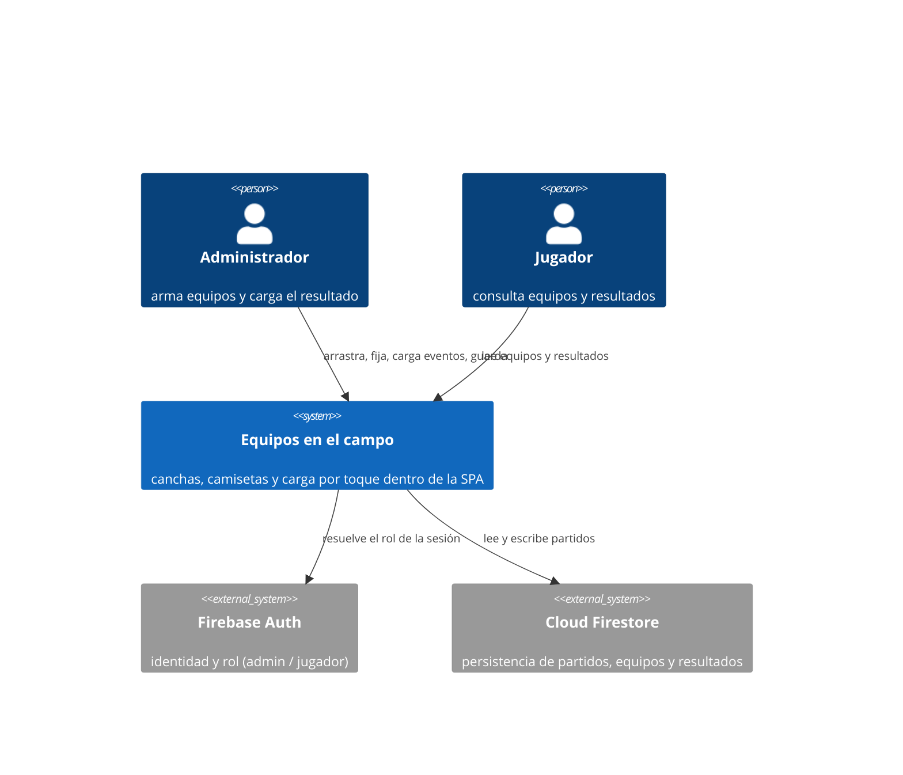

# Equipos en el campo — Concept Note

> **Status:** Draft · **Date:** 2026-08-31 · **Owner:** Lucas Manoukian
>
> **Reviewers:** *pending*
>
> **Spec (rebanada 1 · la cancha):** [rebanada-1-cancha/CANCHA_SPEC.md](./rebanada-1-cancha/CANCHA_SPEC.md)
>
> **Implementation plan (rebanada 1):** *not yet written* · **Rebanadas 2 a 7:** *not yet written*

## 1. TL;DR

Se propone rediseñar tres momentos de la aplicación: **leer el armado de equipos
sobre una cancha** en vez de una lista agrupada por línea, **leer un partido
finalizado** con goles, goles en contra y asistencias dibujados sobre las
camisetas, y **cargar el resultado tocando la camiseta** en vez de completar
alrededor de sesenta casillas numéricas. El destinatario es el administrador del
grupo, que hoy hace las tres cosas desde el celular. Se encara ahora porque
existe un handoff de diseño hi-fi completo —doce vistas interactivas, medidas
finales— y porque la carga de resultados es el punto de mayor fricción del
producto.

La decisión que el lector debe conocer antes que ninguna otra: **la carga de
resultados deja de guardarse como cuatro contadores por jugador y pasa a
guardarse como una lista de eventos** (`D-04`). Es lo que hace posible Deshacer y
lo que elimina de raíz la posibilidad de guardar datos imposibles, y es el único
cambio del rediseño que toca la persistencia. Se entrega en una rebanada propia,
sin cambios visibles, para poder validarla aislada.

## 2. Problem statement

Las tres pantallas involucradas funcionan; la idea es mejorar la UX. Es sobre
todo una evolución de la capa de presentación, con una excepción que conviene
tener presente: la carga de resultados también cambia cómo se guarda el dato
(`D-04`).

- **Pain 1 — el armado no muestra la forma del equipo.** Hoy cada equipo se
  pinta como una lista de filas agrupadas por línea
  ([`index.html:3583-3700`](../../index.html#L3583-L3700)). La formación existe
  en los datos —el motor arma `1 ARQ / 3 DEF / 3 VOL / 1 DEL`— pero no en la
  pantalla: para saber cómo quedó parado el equipo hay que leer ocho filas y
  reconstruirlo mentalmente. El producto cuya promesa central es *entender por
  qué el sistema decidió así* (Principio III de la constitución) presenta su
  resultado en el formato que menos lo muestra. 

- **Pain 2 — cargar el resultado son sesenta casillas en un celular.** La
  pantalla de carga tiene un par ícono + campo numérico por jugador y por tipo de
  evento. Con dieciséis titulares y cuatro tipos de evento, eso da del orden de
  sesenta casillas. No es una estimación: el propio código documenta que agregar
  el cuarto par —el de gol en contra— ya apretó el panel angosto más allá de lo
  cómodo ([`index.html:277-279`](../../index.html#L277-L279)). La tarea real del
  administrador —"Lucas metió dos, uno de penal"— no se parece en nada a tipear
  números en una grilla.

- **Pain 3 — el modelo de datos admite resultados imposibles.** Goles y goles de
  penal se guardan como contadores independientes
  ([`index.html:3369`](../../index.html#L3369)), de modo que nada impide
  persistir un jugador con un gol y tres penales. No es un bug de validación que
  se pueda parchear con un `if`: es una consecuencia directa de la forma del
  dato.

- **Pain 4 — leer y cargar son dos pantallas que no se parecen.** El
  administrador carga en una grilla numérica y después lee el resultado en otro
  formato. Nada de lo que aprendió cargando le sirve para leer, ni al revés.

## 3. Goals

- Que el armado de equipos se lea de un vistazo, mostrando la formación en vez de
  obligar a reconstruirla.
- Que cargar un resultado completo desde el celular sea una secuencia de toques,
  sin tipear números.
- Que el dato guardado no pueda representar un resultado imposible.
- Que la pantalla donde se carga el resultado y la pantalla donde se lee sean la
  misma cancha, con las estadísticas en el mismo lugar.
- Que las tres pantallas cumplan el Principio V a 360 px de ancho, verificado por
  medición y no por inspección visual.

## 4. Non-goals

- **No se modifica el motor de generación de equipos, ni sus estrategias, ni sus
  reglas.** El prototipo del handoff implementa un algoritmo de juguete (sesenta
  repartos candidatos, se elige entre los que caen dentro de `min + 0.5`); el
  motor real del producto es considerablemente más desarrollado. El prototipo
  describe cómo se ve el resultado, nunca cómo se calcula.
- **No se convierte esto en administración del partido en tiempo real.**
  Cronómetro, gestión de cambios y rotaciones en vivo siguen fuera de alcance y
  viven en `Roadmap.md`, igual que hoy.
- **No se agregan estadísticas, rankings ni análisis nuevos.** La carga de
  resultado sigue siendo captura de datos; el análisis permanece fuera de alcance
  según el README de la aplicación.
- **No se soportan tamaños de cancha distintos de fútbol 8 y fútbol 9.** Fútbol
  5, 6, 7 y 11 quedan sin diseñar y sin implementar.
- **No se migran los partidos ya guardados** al nuevo modelo de datos.

## 5. Vision / desired end state

Es jueves a la noche y el partido terminó. El administrador abre la aplicación en
el celular, entra al partido y toca el lápiz de editar resultado. Arriba elige
una vez qué está cargando —"Gol"— y abajo aparece la cancha con las nueve
camisetas de su equipo, la formación reconocible de un vistazo. Toca la camiseta
de Lucas y sobre ella aparece una pastilla con un uno y el ícono de pelota. Toca
otra vez: pasa a dos. Cambia a "Penal", toca a Lucas de nuevo. Cambia a
"Asistencia", toca al que dio el pase. Cambia de equipo con la pestaña y sigue.
El marcador de arriba se va recalculando solo, y los goles en contra se suman
automáticamente al rival. Si se equivoca, toca Deshacer. Cuando termina, toca
Guardar.

Al día siguiente cualquiera del grupo abre el mismo partido y ve la misma cancha
—las mismas camisetas, en las mismas posiciones, con las mismas pastillas en los
mismos lugares— sólo que en modo lectura. La pantalla donde se cargó el resultado
y la pantalla donde se lee son la misma pantalla. No hay nada que traducir entre
una y otra.

Y antes del partido, cuando el motor reparte los equipos, el administrador ya no
lee ocho filas de texto: ve dos canchas lado a lado (o una a la vez en el
celular), con la formación dibujada, el puntaje de cada jugador sobre su
camiseta, y un candado para fijar a quien no quiere que se mueva. Si algo no le
gusta, arrastra una camiseta a otro lugar.

### 5.1 System context diagram

### 5.2 Security posture (`MD-31`)

- **Feature exposure** — Ninguna entrada no confiable. Toda la escritura proviene
  de administradores autenticados vía Firebase Auth; el rol se resuelve en
  [`index.html:795`](../../index.html#L795) y las acciones de escritura están
  cerradas por rol y por estado del partido
  ([`index.html:3580`](../../index.html#L3580)). Los jugadores autenticados sólo
  leen. No hay entrada anónima, ni de sistemas externos, ni carga de archivos.
- **Data sensitivity** — Nombres de jugadores y puntajes de desempeño de un grupo
  cerrado y conocido. Son datos personales, pero no caen en ninguna categoría
  regulada: no hay datos de salud, ni medios de pago, ni documentos de identidad,
  ni datos de menores declarados. El rediseño no introduce ningún dato nuevo: usa
  los mismos campos que la aplicación ya guarda.
- **Deployment surface** — SPA estática de un solo archivo servida por hosting
  público, con los datos en Cloud Firestore detrás de Firebase Auth y reglas por
  rol. El rediseño no agrega endpoints, ni servicios, ni dependencias nuevas: es
  DOM y CSS dentro del mismo `index.html`.

> Con esa forma, las categorías del CWE Top 25 que la Spec deberá atender en su
> §4.5 se acotan a las de **control de acceso** (que la vista de lectura no
> habilite acciones de escritura al rol jugador) y **validación de entrada
> del lado cliente** (que el log de eventos no acepte un evento sobre un jugador
> que no pertenece al partido). Las categorías de inyección, deserialización y
> path traversal no aplican: no hay servidor propio, ni parsing de entrada
> externa, ni acceso a filesystem.

## 6. Context & background

- **Existing system** — Aplicación web de una sola página, HTML y JavaScript
  vanilla en un único `index.html` de 5137 líneas, versión `1.0.58`. Persistencia
  centralizada en Cloud Firestore, sin almacenamiento local del navegador como
  fuente de datos. Dos roles: `admin` y `jugador`. El README define el alcance
  actual como "la organización previa al partido", con la carga de resultado
  incluida como captura de datos y el análisis explícitamente afuera.

- **Related work** — El handoff de diseño completo vive en
  [`handoff/`](./handoff/): un README de 845 líneas con medidas, tokens, estados y
  reglas, más `Equipos en el campo.dc.html`, un prototipo interactivo de doce
  vistas. La constitución del proyecto
  ([`.specify/memory/constitution.md`](../../.specify/memory/constitution.md),
  v2.4.0) fija seis principios, de los cuales tres condicionan fuertemente este
  rediseño: el III (todo lo que decide el motor debe explicarse), el V (responsive
  verificado por medición desde 360 px) y el VI (el design system es la fuente de
  verdad de la UI).

- **Organisational context** — No hay fecha límite externa ni compromiso con
  terceros. El trabajo se entrega por rebanadas para poder validar cada una en la
  aplicación real antes de seguir; el orden y el contenido de las rebanadas están
  fijados en `D-08`.

### 6.5 Sources & Origins (`MD-25`)

**Codebase evidence** — rutas leídas, con una línea de qué fijó cada una:

- [`index.html:3583-3700`](../../index.html#L3583-L3700) —
  `renderTeamPlayerRow` (3583), `renderTeamPlayerRowDupla` (3606),
  `agruparFilasDeEquipo` (3659) y `renderFilaEquipo` (3677): cómo se pinta hoy un
  equipo (lista por línea, con filas de dupla propias). Es exactamente lo que la
  cancha reemplaza; fijó el Pain 1.
- [`index.html:3580`](../../index.html#L3580) — `esFilaEditable`: arrastrar y
  fijar con candado son sólo de `admin` y sólo con el partido abierto. Fijó los
  permisos de las vistas editables y evitó preguntarlo.
- [`index.html:3369`](../../index.html#L3369) — el `stats` por jugador es
  `{goles, golesPenal, golesEnContra, asistencias}`. Es el modelo que `D-04`
  reemplaza, y la razón por la que el Pain 3 no es un bug de validación.
- [`index.html:1836-1847`](../../index.html#L1836-L1847) — `equiposStale()`
  compara `m.estrategia` (elegida) contra `m.equipos.estrategiaKey` (aplicada).
  Fijó que el combo del handoff **no** introduce comportamiento nuevo: la
  mecánica elegida-vs-aplicada ya existe.
- [`index.html:4052-4056`](../../index.html#L4052-L4056) — el `.stale-banner`
  actual cubre cuatro disparadores (convocatoria, estrategia, config del motor,
  duplas). Fundamentó `D-05`.
- [`index.html:3870-4012`](../../index.html#L3870-L4012) — el arreglo
  `explicaciones`, donde se arma el receipt del motor: las cadenas que el bloque
  "Por qué quedaron así" reutiliza literalmente, y el inventario de las que el
  prototipo no emite. **El handoff llama `explicacionesGeneracion` a este
  bloque, pero ese símbolo no existe en el repositorio** — las explicaciones se
  construyen en línea, sin función con nombre propio. Verificado el 2026-08-31.
- [`index.html:2259`](../../index.html#L2259) — `LABEL_LINEA`:
  `Arquero → Arco`, `Defensor → Defensa`, `Volante → Medio`,
  `Delantero → Ataque`. Fijó los rótulos del bloque de diferencia por línea.
- [`index.html:1257-1292`](../../index.html#L1257-L1292) — el recálculo de
  totales por jugador consume los cuatro contadores. Fijó el alcance real de
  `D-04`: el cambio de modelo llega hasta las estadísticas del plantel.
- [`index.html:3378`](../../index.html#L3378) — un partido finalizado no se puede
  editar. Fundamentó `D-06`: los partidos viejos nunca van a necesitar Deshacer,
  así que no hace falta migrarlos.
- [`index.html:277-279`](../../index.html#L277-L279) — comentario de layout: el
  cuarto par ícono + input ya tensionó el panel angosto. Es la evidencia interna
  del Pain 2.
- [`index.html:691-712`](../../index.html#L691-L712) — Firebase App / Firestore /
  Auth, con configuración separada de producción y staging. Fijó la §5.2.
- [`tests/layout.test.js`](../../tests/layout.test.js) — el mecanismo con el que
  el Principio V se verifica. Fijó que el conflicto de 360 px es medible y no
  opinable.
- [`handoff/README.md`](./handoff/README.md) — el handoff completo: doce vistas,
  medidas por vista, tokens, estados, reglas de interacción y modelo de estado.
  Es la fuente de todo el material de diseño de este documento.

**Industry-standard evidence** — estándares contrastados contra la feature:

- *Style / project convention:*
  [`.specify/memory/constitution.md`](../../.specify/memory/constitution.md)
  v2.4.0 — Principio II (simplicidad: la solución más simple que cumpla, sin
  anticipar infraestructura), Principio III (explicabilidad del motor: fundamenta
  que el bloque "Por qué quedaron así" es obligatorio y no decorativo), Principio
  IV (desacople interfaz / motor / persistencia: fundamenta `D-01`), Principio V
  (responsive medido desde 360 px: origen del conflicto que resuelve `D-03`),
  Principio VI (design system como fuente de verdad de UI: fundamenta que los
  tokens del handoff se toman del design system y no se inventan).
- *Style / project convention:*
  [`.claude/skills/football-app-design/`](../../.claude/skills/football-app-design/)
  — el design system referenciado por el Principio VI, del que el handoff toma
  sus tokens.
- *Regulatory:* WCAG 2.2 nivel AA — aplica porque el handoff convierte cuatro
  botones con texto (Copiar, Regenerar, Deshacer, Guardar) en botones solo de
  ícono, y porque fija objetivos táctiles chicos en compacto. El handoff ya
  especifica `aria-label` y `title` en todos ellos y sube los targets del
  compacto, así que la obligación está contemplada en el diseño; la Spec deberá
  convertirla en requisito verificable.
  `[UNVERIFIED — los criterios de éxito puntuales (nombre accesible en controles
  solo-ícono, tamaño mínimo de objetivo) se citan de memoria; no se consultó el
  texto normativo de w3.org en esta sesión]`
- *Architectural:* no aplican 12-factor, DDD, event-driven ni CQRS. Es una SPA de
  un solo archivo sin backend propio; la única frontera arquitectónica relevante
  es la del Principio IV, ya citada arriba.

**Prior-art evidence** — features previas, productos pares, literatura:

- [`docs/goles-en-contra/GOLES_EN_CONTRA_SPEC.md`](../goles-en-contra/GOLES_EN_CONTRA_SPEC.md)
  y
  [`docs/orden-jugadores/ORDEN_JUGADORES_SPEC.md`](../orden-jugadores/ORDEN_JUGADORES_SPEC.md)
  — las dos features anteriores documentadas con esta misma metodología. Fijaron
  la convención de carpeta (`docs/<feature>/NOMBRE_SPEC.md` + su Implementation
  Plan) y el patrón de trabajo por ramas: la rama `docs/<feature>` se mergea
  antes que la rama `feature/<feature>`.
- [`openspec/specs/resultados-partido/`](../../openspec/specs/resultados-partido/)
  — la especificación vigente de la carga de resultados, incluida la regla de que
  los goles de un equipo son los propios más los en contra del rival. `D-04`
  modifica su modelo de datos sin modificar esa regla.
- [`.specify/specs/003-motor-generacion-equipos/`](../../.specify/specs/003-motor-generacion-equipos/),
  `010-refinamiento-objetivo`, `011-encaje-optimo-formacion`,
  `015-minimo-diferencia-alcanzable` — las especificaciones del motor real.
  Fijaron `D-01`: el motor está considerablemente más desarrollado que el
  algoritmo del prototipo, y queda explícitamente fuera de alcance.
- Productos pares con vista de alineación sobre cancha: Fantasy Premier League y
  Biwenger presentan el equipo dibujado sobre un campo con la formación
  reconocible, en vez de una lista por posición. Es el patrón que el Pain 1
  adopta; no es una invención de este rediseño.
  `[UNVERIFIED — patrón conocido, pero no se inspeccionaron los productos en esta
  sesión]`
- *Literatura:* `Prior-art evidence (papers): none — el problema es de diseño de
  interfaz sobre un dominio acotado; no se identificó precedente académico
  pertinente.`

## 7. Research & industry context

### 7.1 How established products handle this

La vista de alineación sobre cancha es el estándar de hecho en las aplicaciones
donde el usuario tiene que entender una formación: los juegos de manager y las
aplicaciones de fantasy la usan porque la posición en pantalla comunica la
posición en el campo sin ninguna traducción. Lo que este rediseño agrega sobre
ese patrón conocido no es la cancha, sino **usar la misma cancha para cargar
datos**: la camiseta pasa de ser una etiqueta a ser un botón, y la pastilla de
estadística aparece durante la carga exactamente donde va a quedar en la lectura.

No se investigó el detalle de implementación de ningún producto par para este
documento; el handoff ya resuelve la forma concreta con medidas finales, así que
la comparación sirve para validar la dirección, no para elegirla.

### 7.2 Relevant prior art / standards

- Constitución del proyecto v2.4.0, Principio III — el motor debe explicarse en
  lenguaje claro reflejando únicamente decisiones que realmente ocurrieron. De
  ahí sale que el bloque "Por qué quedaron así" reutilice las cadenas del motor
  real en vez de generar texto nuevo.
- Constitución del proyecto v2.4.0, Principio V — 360 px de ancho mínimo,
  verificado con `node tests/layout.test.js`. Es el estándar interno que el
  diseño, tal como está dibujado, no cumple (ver `D-03`).
- WCAG 2.2 AA — pertinente por los botones solo de ícono y por los objetivos
  táctiles del compacto.

### 7.3 Proofs of concept

El handoff **es** el proof of concept: un prototipo interactivo y completo, no
una maqueta estática. Las doce vistas responden a toques y arrastres reales, con
el modelo de estado implementado.

| PoC | Status | Link | What it proved | What it disproved |
|---|---|---|---|---|
| Prototipo interactivo de doce vistas | Done | [`handoff/Equipos en el campo.dc.html`](./handoff/) | Que la carga por toque cubre los cuatro tipos de evento sin campos numéricos; que la pastilla de estadística puede aparecer en el mismo lugar durante la carga y durante la lectura; que la lista de eventos hace que Deshacer, el botón `−` por familia y la imposibilidad de "más penales que goles" salgan sin código extra; que la fila de cuatro volantes de la cancha de 9 entra a 390 px con ~8 px de aire | Que las medidas tabuladas por vista escalen a tamaños de cancha nuevos — el propio handoff lo admite en su sección "A futuro". Y, por medición nuestra, que 390 px alcance: a los 360 px que exige el Principio V la cancha de 9 en compacto necesita 326 px de contenido en 312 px disponibles, y desborda unos 14 px |
| Motor de reparto del prototipo | Descartado | idem | — | Que sirva como referencia de implementación: es un algoritmo de juguete frente al motor real del producto. Ver `D-01` |

## 8. Proposed direction

### 8.1 Approach

El rediseño no es una feature sino tres momentos que comparten dos fundaciones.
La primera es **la cancha**: un contenedor de proporción fija con las marcas del
campo dibujadas en porcentajes, y encima una capa de líneas que reparte las
camisetas de arriba hacia abajo. Las seis vistas de fútbol 8 y las seis de fútbol
9 son la misma cancha con distinto juego de medidas. Construirla una vez y
parametrizarla es lo que hace que el resto del rediseño sea barato.

La segunda fundación es **la lista de eventos**. Hoy un resultado se guarda como
cuatro números por jugador; pasa a guardarse como una secuencia ordenada de
hechos —"Lucas, gol"; "Lucas, penal"; "Anibal, en contra"— de la que esos cuatro
números se derivan cuando se necesitan. El cambio es invisible en pantalla y
habilita tres comportamientos que con contadores serían artificiales: deshacer el
último evento, quitar el último de una familia, y la imposibilidad estructural de
tener más penales que goles.

Sobre esas dos fundaciones, los tres momentos se resuelven casi por composición.
El **armado** es la cancha con camisetas arrastrables, candados y, debajo, los
bloques que explican el reparto. El **partido finalizado** es la misma cancha en
lectura, con pastillas de estadística pegadas a cada camiseta. La **carga de
resultados** es la misma cancha otra vez, con las camisetas convertidas en
botones y un selector arriba que define qué se está anotando. Que los tres sean
la misma cancha no es una economía de implementación: es la propuesta de valor.
El administrador aprende una sola pantalla.

La entrega se hace en siete rebanadas (`D-08`), cada una validable en la
aplicación real. El orden pone primero lo que no toca datos y deja el cambio de
persistencia aislado en una rebanada sin efecto visible, de modo que si algo se
rompe se sepa exactamente qué fue.

### 8.2 Information / data model sketch

Se introduce un único concepto nuevo: el **evento de partido**. Conceptualmente
es un hecho ocurrido, atribuido a un jugador, de uno de cuatro tipos: gol, gol de
penal, gol en contra, asistencia. Un partido pasa a tener una **secuencia
ordenada** de estos hechos; el orden importa porque es lo que permite deshacer.

De esa secuencia se derivan, sin guardarse:

- el conteo por jugador y por tipo, que es lo que consumen las estadísticas del
  plantel;
- el marcador, aplicando la regla vigente de que los goles de un equipo son los
  propios más los en contra del rival;
- las filas de detalle que se muestran debajo de cada campo.

Un gol de penal **es** un gol, marcado como tal. No es un tipo paralelo: es la
razón por la que la cantidad de penales nunca puede superar la de goles.

Los partidos guardados antes de la implementación conservan su forma actual y
siguen leyéndose desde los cuatro contadores (`D-06`). No hay conversión, y como
un partido finalizado no se puede editar, tampoco hace falta: nunca van a
necesitar deshacer nada. El formato viejo queda de sólo lectura y deja de crecer.

## 9. Alternatives considered

> Este documento evalúa cuatro alternativas, por lo que ocupan §9.1 a §9.4 y la
> tabla comparativa se corre a §9.5. Se omite el *comparison flowchart* opcional
> del template: las alternativas no comparten un árbol de decisión que agregue
> algo sobre la tabla.

### 9.1 Alternative A — Reestilizar las pantallas actuales sin cancha

- **Description:** Mantener la lista agrupada por línea y la grilla de carga, y
  aplicarles los tokens del design system: colores, tipografía, espaciados y
  radios nuevos, sin cambiar la forma de leer ni de cargar.
- **Pros:** Barato, sin riesgo sobre datos, sin cambios de interacción que haya
  que enseñar. Se podría entregar en una sola rebanada.
- **Cons:** No resuelve ninguno de los cuatro dolores. La formación sigue sin
  verse, la carga sigue siendo sesenta casillas, el dato imposible sigue siendo
  posible, y leer y cargar siguen siendo dos pantallas distintas.
- **Decision:** Rejected — es maquillaje sobre el problema. El costo del
  rediseño se justifica precisamente por lo que esta alternativa no toca.

### 9.2 Alternative B — Cancha sólo para lectura, carga en la grilla actual

- **Description:** Adoptar la cancha en el armado y en el partido finalizado,
  pero dejar la carga de resultados como está: la grilla numérica actual.
- **Pros:** Entrega la mitad visual del rediseño sin tocar la persistencia. Es
  estrictamente menos riesgoso y bastante más corto.
- **Cons:** Deja sin resolver el dolor más agudo, que es cargar desde el celular.
  Y rompe la propuesta central —que leer y cargar sean la misma pantalla—
  justamente en el punto donde más valdría.
- **Decision:** Rejected como destino final, pero **adoptado como estado
  intermedio**: es exactamente lo que la aplicación va a ser después de la
  rebanada 4 y antes de la 6. Lo que se rechaza es detenerse ahí.

### 9.3 Alternative C — Mantener los cuatro contadores y validar

- **Description:** No cambiar la persistencia. Conservar
  `{goles, golesPenal, golesEnContra, asistencias}` y agregar una verificación
  que impida guardar más penales que goles, construyendo la interfaz de carga
  por toque encima de esos contadores.
- **Pros:** Cero riesgo sobre los datos existentes. Ninguna migración, ninguna
  convivencia de formatos, ninguna rebanada invisible.
- **Cons:** Deshacer se vuelve imposible de implementar honestamente: con un
  contador no se sabe cuál fue el último evento, así que habría que mantener un
  historial *además* de los contadores —es decir, la lista de eventos, pero
  duplicada y capaz de desincronizarse. Lo mismo para el botón `−` por familia. Y
  la validación de penales sería un guardia que se puede olvidar en el próximo
  camino de escritura, en vez de una imposibilidad.
- **Decision:** Rejected — resuelve el síntoma manteniendo la causa, y termina
  necesitando la lista de eventos igual, en su peor forma.

### 9.4 Alternative D — Entregar el rediseño completo de una vez

- **Description:** Implementar las doce vistas, el cambio de modelo y los bloques
  nuevos en una sola rama, y mergear cuando esté todo.
- **Pros:** Sin estados intermedios raros, sin código de convivencia temporal,
  sin la disciplina de mantener siete ramas coherentes.
- **Cons:** No se puede validar nada hasta el final. Si el arrastre sobre la
  cancha resulta incómodo en el celular, se descubre después de haber construido
  también la carga y el cambio de persistencia. Y concentra en un solo merge un
  cambio de datos con un rediseño visual completo, que es la forma más segura de
  no saber qué rompió qué.
- **Decision:** Rejected — el objetivo declarado del trabajo es poder validar
  incrementalmente. Ver `D-08`.

### 9.5 Comparison summary

La decisión con más opciones reales fue cómo resolver el desborde de la cancha de
9 a 360 px, el ancho mínimo que exige el Principio V. Se pesaron cuatro caminos:

| Dimensión | Achicar en 360–390 | Regla fluida ahora | Partir la fila en dos | Pedir turno de diseño |
|---|---|---|---|---|
| Esfuerzo | Bajo | Alto | Medio | Bajo, pero bloquea |
| Riesgo de legibilidad | Medio — el nombre puede cortarse | Bajo | Bajo | — |
| Cubre fútbol 5/7/11 | No | Sí | Parcial | Depende |
| Encaje con Principio II | Bueno | Malo — construye para escala inexistente | Bueno | Bueno |
| Cambia la lectura de la formación | No | No | Sí, en el ancho más usado | — |
| Verificable con `layout.test.js` | Sí | Sí | Sí | — |

Se eligió **achicar en la franja 360–390** (`D-03`): es la solución más simple
que cumple el requisito, no compromete la lectura de la formación, y el Principio
II pide explícitamente no construir para un caso que hoy no existe. La regla
fluida queda registrada como diferida (§14), no descartada.

## 10. Key decisions

| ID | Decision | Rationale | Reversibility |
|---|---|---|---|
| D-01 | El motor de generación de equipos, sus estrategias y sus reglas quedan fuera de alcance | El motor real está mucho más desarrollado que el algoritmo del prototipo; el Principio IV exige mantener el motor desacoplado de la interfaz. El handoff aporta cómo se ve el resultado, no cómo se calcula | Easy |
| D-02 | El diseño se recrea en el stack del repo (DOM + CSS vanilla en `index.html`); no se importa el runtime del prototipo | Lo indica el propio handoff, y el Principio II descarta introducir un runtime de plantillas para una feature de interfaz | Hard |
| D-03 | El desborde a 360 px se resuelve achicando medidas en la franja 360–390, no con una regla fluida ni partiendo la fila | Solución más simple que cumple el Principio V; la regla fluida construiría para tamaños de cancha que hoy no existen, contra el Principio II | Easy |
| D-04 | La carga de resultados se persiste como secuencia ordenada de eventos; los cuatro contadores pasan a derivarse | Es lo que hace posibles Deshacer y el `−` por familia, y lo que vuelve imposible —no sólo inválido— un resultado con más penales que goles | Hard |
| D-05 | El aviso de equipos desactualizados conserva su texto actual y adopta el estilo visual del handoff | El texto actual cubre los cuatro disparadores de `equiposStale()`; el del handoff cubre sólo el de estrategia y dejaría tres casos sin aviso | Easy |
| D-06 | Los partidos ya guardados no se migran: se siguen leyendo desde sus contadores. La lista de eventos aplica sólo a partidos cargados desde la implementación | Un partido finalizado no se puede editar, así que nunca va a necesitar deshacer. Migrar sería asumir riesgo sobre datos históricos reales a cambio de nada | Hard |
| D-07 | La hora deja de mostrarse en toda la aplicación; la fecha pasa al formato "Sábado, 5 de Septiembre". Se entrega como cambio transversal, independiente del rediseño | Es una decisión de producto de alcance mayor que estas pantallas, y no depende de ninguna rebanada | Easy |
| D-08 | El rediseño se entrega en siete rebanadas validables, en orden: cancha → arrastre → panel de armado → partido finalizado → modelo de eventos → carga por toque → configuración | Permite validar cada pedazo en la aplicación real y aislar el único cambio de persistencia en una rebanada sin efecto visible | Easy |
| D-09 | Se enmienda la constitución (Principio I y Flujo de Trabajo SDD) para reconocer la metodología de tres documentos en `docs/` | La práctica ya cambió hace dos features; la constitución quedó describiendo un flujo que el equipo dejó de usar, y su Governance prevalece sobre la costumbre en materia de *cómo* se trabaja | Hard |
| D-10 | El bloque "Por qué quedaron así" reutiliza literalmente las cadenas del motor real, y suma los siete casos que el prototipo no emite | Principio III: el resumen debe reflejar únicamente decisiones que realmente ocurrieron. Generar texto nuevo lo violaría | Easy |
| D-11 | Cada rebanada se trabaja con dos ramas: `docs/<rebanada>` con Spec e Implementation Plan, mergeada antes que `feature/<rebanada>` con el código | Es la convención que el repositorio ya usa (`docs/orden-jugadores` mergeada antes que `feature/orden-jugadores`), y permite validar la Spec antes de construir | Easy |
| D-12 | La cancha reemplaza por completo la lista actual de equipos: no conviven, y no queda un camino para volver a la lista | Principio II: una sola forma de pintar un equipo. La lista no es una vista alternativa que alguien pidió, es la que había, y el handoff se diseñó para reemplazarla. La red de seguridad es la rama sin mergear, no código duplicado que después hay que mantener | Hard |
| D-13 | Las medidas de la franja 360–390 px se derivan por medición y se validan mirándolas en la aplicación real; no se pide un turno de diseño | El ajuste es de 4 px por columna (80 → 76) y la camiseta no cambia de tamaño. El handoff ya documenta cómo se comportan los adornos de la camiseta al achicarse, así que hay con qué derivarlo. Si algún nombre queda ilegible, se pide el turno con un caso concreto | Easy |
| D-14 | El combo de estrategia muestra el `resumen` de la estrategia elegida como caption visible; la `descripcion` larga sigue viviendo en Configuración del motor. Desaparece el ícono `?` | Principio III: sacar toda explicación de la pantalla donde se elige la estrategia iría en contra. Un caption visible funciona mejor en mobile que un tooltip que hay que descubrir y tocar. Y `resumen` ya está escrito para las cuatro estrategias sin usarse en ningún lado | Easy |
| D-15 | El "desvío aceptable" del handoff es el `diffObjetivo` que ya existe; no se agrega parámetro. La grilla de diferencia por línea se muestra siempre, y el color aparece sólo cuando hay umbral configurado | Es el mismo valor, ya mostrado con ese texto exacto en [`index.html:4068`](../../index.html#L4068), y la regla de color ya existe en [`index.html:3868`](../../index.html#L3868). Sin umbral configurado la aplicación hoy no emite juicio; mantener ese criterio evita introducir una regla nueva | Easy |
| D-16 | La enmienda de `D-09` es de alcance mínimo: `docs/` es el sistema para features nuevas; las specs vigentes en `.specify/` y `openspec/` siguen siendo fuente de verdad de lo ya construido; y una spec nueva que pise a una vieja lo declara explícitamente. Se ejecuta en su propia rama antes de la primera Spec | Principio II: migrar dieciséis specs de features ya construidas no mejora el producto en nada. Lo que faltaba era que la regla quedara sin ambigüedad, no que hubiera un solo directorio | Hard |
| D-17 | El documento no cita cláusulas normativas de accesibilidad; las obligaciones se enuncian en términos directamente comprobables | Citar mal el nivel de un criterio es el tipo de error que después nadie revisa, y la obligación concreta —nombre accesible en botones solo de ícono, objetivos táctiles de 44×44 px— es verificable sin apoyarse en la cita | Easy |
| D-18 | El arrastre se repone con la API nativa de arrastre del navegador, movida de la fila de lista a la camiseta; no se construye un gesto propio con eventos de puntero | Principio II: es la solución más simple que cumple. El mecanismo está verificado a mano en producción sobre iOS y sobre Chrome en Android (2026-08-27, `.specify/specs/003-motor-generacion-equipos` § Assumptions), así que reemplazarlo por uno propio sería cambiar algo probado por algo por probar. Sienta además el precedente del gesto para la carga por toque de la rebanada 6 | Easy |
| D-19 | La edición manual del reparto se acota a movimientos **entre equipos**: pasar un jugador al otro equipo e intercambiar dos. Mover una camiseta dentro de su propio equipo queda sin rebanada asignada | Mover dentro del propio equipo exige escribir la posición asignada, y con ella el recálculo de los resúmenes de diferencia por línea, que la rebanada 3 rediseña de todos modos. Acotarlo mantiene la rebanada 2 chica sin perder la función que la rebanada 1 había suspendido | Easy |
| D-20 | Un movimiento manual no escribe la posición asignada de nadie | Conserva la regla que la aplicación ya tenía: mover a un jugador sólo lo cambia de equipo. Ninguna spec vigente cambia de sentido, y la formación de cada equipo se sostiene | Easy |
| D-21 | En una sola columna los dos equipos dejan de apilarse y se muestran de a uno, con el selector segmentado del handoff; la pestaña del equipo que no se ve recibe el drop. Reemplaza el `FR-054` de la Spec de la rebanada 1 | Con las canchas apiladas, en un teléfono el destino de todo movimiento manual queda fuera de pantalla, y alcanzarlo depende de cómo cada navegador desplace durante un arrastre nativo — algo que **no se puede verificar en este entorno, porque no hay un dispositivo táctil con el cual probarlo**. La decisión elimina la incógnita en vez de apostar a que se resuelva sola. Alcanza a todas las rebanadas siguientes: cambia cómo se **leen** los equipos en el celular, también para el rol jugador | Hard |

## 11. Risks

| Risk | Severity | Likelihood | Mitigation idea |
|---|---|---|---|
| El cambio de modelo rompe las estadísticas del plantel, que hoy se calculan sobre los cuatro contadores | High | Med | La rebanada 5 es invisible por definición: se implementa el modelo nuevo y se verifica que los totales derivados coincidan exactamente con los actuales, partido por partido, antes de tocar ninguna pantalla |
| El arrastre sobre la cancha resulta menos cómodo que la lista actual en el celular, y `D-12` ya eliminó la lista | High | Med | Las rebanadas 1 y 2 están separadas justamente para validar la cancha antes de reconstruir el arrastre encima. Mientras las ramas no se mergeen, volver atrás es gratis; después de mergear la 2, deja de serlo |
| Convivencia indefinida de dos formatos de resultado en la base | Med | High | Acotada por `D-06`: el formato viejo es de sólo lectura y no crece. Si algún día molesta, la migración sigue siendo posible; no se cierra la puerta |
| Las medidas de la franja 360–390 (`D-03`) no están diseñadas y se derivan (`D-13`) | Med | Med | Doble red: se agrega el escenario a `tests/layout.test.js` —que debe verse fallar al menos una vez antes de darlo por bueno, según el criterio del Principio V— y además se valida a ojo en la aplicación real con nombres reales, porque el test dice si entra pero no si se lee |
| El caption con `resumen` (`D-14`) resulta insuficiente y se extraña la descripción larga en la pantalla del partido | Low | Med | La `descripcion` completa sigue a un toque de distancia en Configuración del motor. Si se extraña en el uso real, se evalúa reponer un acceso desde el combo |
| El handoff arrastra textos desactualizados de sus versiones anteriores ("idéntica en las seis vistas", "candado sólo en 4a y 6a") | Low | High | Inventariados en §17. Ninguna afirmación del handoff se copia a una Spec sin contrastarla contra el prototipo interactivo |

## 12. Success signals

- El administrador carga un resultado completo desde el celular sin que se abra
  el teclado numérico ni una sola vez.
- Deja de ser posible encontrar un partido guardado con más penales que goles.
- Alguien del grupo mira la pantalla de equipos y entiende cómo quedaron parados
  sin preguntarle a nadie.
- `node tests/layout.test.js` cubre las canchas de 8 y de 9 a 360 px y pasa.
- Nadie pide que se explique la pantalla de carga de resultados.

## 13. Dependencies & stakeholders

### 13.1 Dependencies

- **Servicios:** Cloud Firestore (persistencia) y Firebase Auth (rol de la
  sesión). Ninguno cambia de forma por este rediseño.
- **Upstream:** el design system de Football App
  ([`.claude/skills/football-app-design/`](../../.claude/skills/football-app-design/)),
  fuente de verdad de la UI por el Principio VI. El handoff en
  [`handoff/`](./handoff/), congelado como referencia de diseño.
- **Bloqueante de la primera Spec:** la enmienda de la constitución (`D-09`, con
  el alcance mínimo que fija `D-16`) debe ejecutarse en su propia rama y
  mergearse antes de escribir la Spec de la rebanada 1, para que las Specs en
  `docs/` sean formalmente la fuente de verdad.
- **Downstream:** las estadísticas del plantel
  ([`index.html:1257-1292`](../../index.html#L1257-L1292)) consumen los
  contadores y son el consumidor afectado por `D-04`.

### 13.2 Stakeholders

- **Owning:** Lucas Manoukian.
- **Reviewing:** *pending*.
- **Customers:** el grupo de jugadores que usa la aplicación; el administrador
  como usuario principal de las tres pantallas rediseñadas.

## 14. Out of scope / deferred

- **Fútbol 5, 6, 7 y 11** — *diferido hasta que el grupo juegue efectivamente en
  alguna de esas canchas.* Hoy sólo se juega 8 y 9.
- **La regla fluida de dimensionado** (columna que se achica sola con flex,
  camiseta dimensionada por container queries) — *diferida hasta que haga falta
  soportar un tamaño de cancha nuevo.* Está esbozada en el handoff y descartada
  para ahora por `D-03`.
- **Las opciones de configuración** del prototipo (`nameFormat`, `showRatings`,
  `showLocks`) — *diferidas a la rebanada 7, que es opcional.* Ninguna es
  necesaria para que el rediseño funcione. El `desvio` del prototipo no entra en
  esta lista: ya existe como `diffObjetivo` (`D-15`).
- **Migrar los partidos históricos** al modelo de eventos — *diferida sin fecha;
  se reabre sólo si la convivencia de formatos resulta molesta en la práctica.*
- **Migrar las specs de `.specify/` y `openspec/`** al formato de `docs/` —
  *diferida sin fecha* por `D-16`; se reabre sólo si la coexistencia de tres
  sistemas genera confusión real.

## 15. Open questions

Las seis preguntas abiertas del borrador inicial se cerraron en la revisión del
2026-08-31. Se conservan con su resolución para dejar la traza de qué las cerró.

| ID | Question | Owner | Target stage | Notes |
|---|---|---|---|---|
| OPEN-Q-01 | ¿Dónde se reubica la descripción de cada estrategia, hoy en el ícono `?`? | Lucas Manoukian | *Resuelta* | Cerrada por `D-14`: caption con `resumen` debajo del combo; la `descripcion` larga queda en Configuración del motor |
| OPEN-Q-02 | ¿La cancha reemplaza la lista actual o conviven? | Lucas Manoukian | *Resuelta* | Cerrada por `D-12`: reemplazo total, sin vuelta a la lista |
| OPEN-Q-03 | ¿El "desvío aceptable" es el `diffObjetivo` que ya existe, o un parámetro nuevo? | Lucas Manoukian | *Resuelta* | Cerrada por `D-15`: es el mismo parámetro; no se agrega ninguno |
| OPEN-Q-04 | ¿Las medidas de la franja 360–390 las derivamos o se piden al diseño? | Lucas Manoukian | *Resuelta* | Cerrada por `D-13`: se derivan y se validan mirándolas en la aplicación real |
| OPEN-Q-05 | Verificar las cláusulas de accesibilidad citadas de memoria | Lucas Manoukian | *Resuelta* | Cerrada por `D-17`: se retiran las citas normativas y la obligación se enuncia en términos comprobables |
| OPEN-Q-06 | ¿Cuándo y con qué alcance se ejecuta la enmienda de la constitución? | Lucas Manoukian | *Resuelta* | Cerrada por `D-16`: alcance mínimo, en rama propia, antes de la primera Spec |
| OPEN-Q-07 | Cuando **sí** hay un umbral configurado, ¿la regla de color aplica también a Arco y Ataque? Son líneas de un solo lugar por equipo, donde la diferencia es estructural y el motor ya la explica como esperada ([`index.html:3913`](../../index.html#L3913)) | Lucas Manoukian | Spec (rebanada 3) | Con un umbral bajo esas dos celdas irían en rojo casi siempre, y el color perdería su valor de señal |

## 16. Handoff to the Spec

- **Settled (do not relitigate):** `D-01`, `D-02`, `D-03`, `D-04`, `D-05`,
  `D-06`, `D-07`, `D-08`, `D-09`, `D-10`, `D-11`, `D-12`, `D-13`, `D-14`,
  `D-15`, `D-16`, `D-17`, `D-18`, `D-19`, `D-20`, `D-21`.
- **Decide in Spec:** `OPEN-Q-07` (Spec de la rebanada 3). Las otras seis se
  cerraron en la revisión del 2026-08-31; ver §15.
- **Must remain non-goals:**
  - *"No se modifica el motor de generación de equipos, ni sus estrategias, ni sus reglas."*
  - *"No se convierte esto en administración del partido en tiempo real."*
  - *"No se agregan estadísticas, rankings ni análisis nuevos."*
  - *"No se soportan tamaños de cancha distintos de fútbol 8 y fútbol 9."*
  - *"No se migran los partidos ya guardados al nuevo modelo de datos."*

Una nota para quien escriba las Specs: son **siete Specs, una por rebanada**, no
una sola. Cada una hereda este Concept Note completo y acota su alcance a su
rebanada según `D-08`. La rebanada 5 (modelo de eventos) es la única sin efecto
visible, y su Spec debe tratarla como tal: sus criterios de aceptación son de
equivalencia con el comportamiento actual, no de comportamiento nuevo.

## 17. Appendix

- [Handoff de diseño completo](./handoff/) — README de 845 líneas y prototipo
  interactivo de doce vistas. Se abre con un servidor estático desde la carpeta;
  las vistas son interactivas y varias reglas se entienden mejor usándolas.
- **Inventario de textos desactualizados del handoff**, a no arrastrar a ninguna
  Spec sin contrastar contra el prototipo: la sección *Cancha* dice "idéntica en
  las seis vistas" cuando son doce; la sección *Candado* dice "solo 4a y 6a"
  cuando `8a` y `8b` también los tienen; *Chips de estadística* y *Carga de
  resultados* no listan las vistas `8c`–`8f`; la sección *Responsive* no menciona
  la camiseta de 48 px de `8b`; y en el bloque de estado `nueveCopied` aparece
  dos veces.
- **Un error de hecho del handoff, ya verificado:** afirma que el receipt del
  motor es la función `explicacionesGeneracion` de `index.html`. Ese símbolo no
  existe. Las explicaciones se construyen en un arreglo `explicaciones` a partir
  de la línea 3870, sin función con nombre propio. Los números de línea que el
  handoff cita para cada cadena sí son correctos (se verificaron `LABEL_LINEA` en
  2259 y la explicación de líneas de un solo lugar en 3913). La lección para las
  Specs: los números del handoff son buenos, los nombres de símbolo no.
- **Un segundo error de hecho, este nuestro y no del handoff (2026-08-31).** Un
  borrador de la Spec de la rebanada 2 sostuvo que el arrastre nativo "no
  funciona con el dedo", y de ahí que mover jugadores a mano nunca hubiera
  funcionado en el celular. Es falso, y lo desmiente la spec del motor con
  verificación en producción sobre iOS y sobre Chrome en Android:

  > *"La edición manual de equipos por drag & drop funciona también en
  > dispositivos móviles: se verificó a mano en producción (2026-08-27). Está
  > implementada con la API HTML5 de arrastre, sin ningún handler de `pointer`
  > ni de `touch`, y aun así los dos navegadores la disparan desde el gesto de
  > arrastre del sistema. Este spec afirmaba lo contrario hasta esa
  > verificación."*

  El error vino de inferir la capacidad desde la **ausencia de código táctil** en
  `index.html` — exactamente la inferencia que esa spec ya había hecho y
  corregido. La lección, hermana de la del handoff: **la ausencia de código no
  prueba la ausencia de comportamiento; lo que prueba el comportamiento es
  haberlo mirado.** De ahí también `D-21`: donde no hay con qué mirar, el diseño
  no debe depender de lo que no se miró.

- **Inconsistencia señalada por el propio handoff:** las filas de resultado usan
  divisores de `1px var(--color-canvas)`, que es blanco sobre tarjeta blanca y
  por lo tanto invisible. Se implementa con `--color-canvas-soft`.

## 18. Change log

| Date | Author | Change |
|---|---|---|
| 2026-08-31 | Lucas Manoukian | Enmienda desde la rebanada 2: se incorporan `D-18` a `D-21`, las cuatro decisiones de producto que se tomaron al escribir su Spec y que habían quedado registradas dentro de ella. Por la separación de tres documentos (`MD-01`) su lugar es esta §10: `D-19` y `D-21` en particular alcanzan a las rebanadas siguientes, no sólo a la 2. Se agrega además a §17 la lección sobre inferir capacidades desde la ausencia de código. Cierra la `OPEN-Q-07` de la Spec de la rebanada 2. Self-critique: no corresponde (enmienda acotada, verificada con las pasadas de consistencia). |
| 2026-08-31 | Lucas Manoukian | Initial draft, más las seis resoluciones del barrido del mismo día (`D-12` a `D-17`; `OPEN-Q-01` a `OPEN-Q-06` cerradas, `OPEN-Q-07` abierta). Self-critique: passed (1🔴 / 2🟡 / 2🔵) — el 🔴 (cita a `explicacionesGeneracion`, símbolo inexistente heredado del handoff) y un 🟡 (rango de líneas de las funciones de fila) resueltos; el 🟡 restante, sobre el encuadre de §2, elevado al autor. |

---

*Next document: Implementation Plan de la rebanada 1
(`docs/equipos-en-el-campo/rebanada-1-cancha/`). El Concept Note cubre el rediseño
completo; cada rebanada de `D-08` recibe su propia Spec e Implementation Plan, en
su subcarpeta `rebanada-N-<nombre>/`.*
