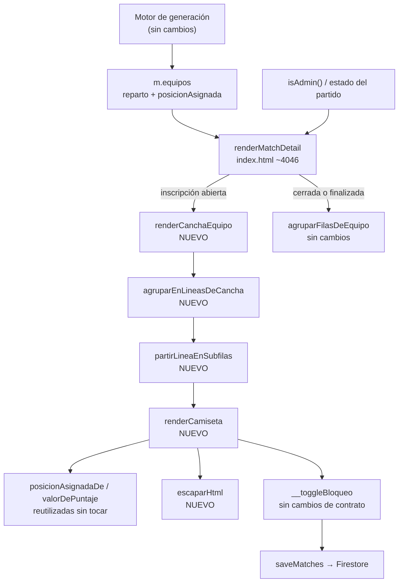
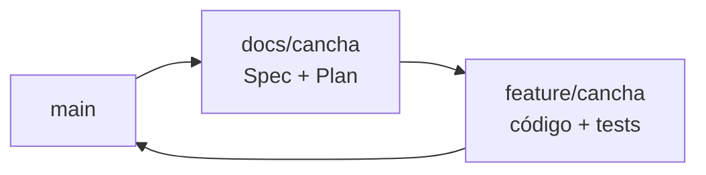

# La cancha (rebanada 1 de "Equipos en el campo") — Implementation Plan

> **Status:** Draft · **Date:** 2026-08-31 · **Owner:** Lucas Manoukian
>
> **Reviewers:** *pending*
>
> **Spec:** [CANCHA_SPEC.md](./CANCHA_SPEC.md)
>
> **Concept note:** [EQUIPOS_EN_EL_CAMPO_CONCEPT.md](../EQUIPOS_EN_EL_CAMPO_CONCEPT.md)

> **Grounding evidence (`MD-25`).** Este Plan se apoya en el ledger §6.5 del
> Concept Note y en las citas en línea de la Spec. Las ubicaciones de código y
> de tests que este Plan agrega como evidencia propia se citan **en línea**, en
> la tarea o en la decisión que cada una fundamenta.

## 1. Summary

Se reemplaza el render de los dos paneles de equipo dentro de
[`index.html`](../../../index.html) —hoy una lista de filas agrupadas por
línea— por un campo de fútbol dibujado con `div` posicionados en porcentajes y
una capa de camisetas SVG repartidas en líneas. El cambio es de presentación:
no toca el motor, no toca la persistencia y reutiliza sin modificar las dos
funciones que resuelven posición y puntaje. Se entrega en **una sola rama**,
`feature/cancha`, con tests nuevos en dos niveles: un archivo de unidad que
recorta las funciones nuevas de `index.html` con el mismo mecanismo que ya usa
`tests/harness.js`, y escenarios nuevos en `tests/layout.test.js` que miden la
pantalla real en trece anchos, incluida por primera vez una cancha de fútbol 9.

## 2. Goals & non-goals

**Goals**

- Implementar `FR-001` a `FR-060` de la Spec dentro de `index.html`, sin
  dependencias nuevas.
- Dejar `node tests/layout.test.js` cubriendo la pantalla de equipos generados
  en fútbol 8 y en fútbol 9, y pasando desde 360 px (`NFR-001`, `AC-10`).
- Dejar la lista de filas intacta y funcionando en los otros dos momentos del
  partido (`FR-042`, `AC-03`).

**Non-goals**

- No se agrega arrastre de camisetas (rebanada 2).
- No se toca el encabezado de la tarjeta, el combo de estrategia, los resúmenes
  ni el bloque "Por qué quedaron así" (rebanada 3).
- No se agrega un job de CI que corra los tests. La brecha queda registrada como
  `R-05` e `IMP-02`, no resuelta.
- No se agrega telemetría de producción. La aplicación no tiene ninguna, y
  agregarla para esta rebanada iría contra el Principio II. Ver §11 y `OPEN-Q-06`.

## 3. Architecture overview

La cancha se inserta en el punto exacto donde hoy `renderMatchDetail` arma
`.teams-wrap`. Todo lo que está aguas arriba —el motor, el partido, el rol— y
aguas abajo —la persistencia— queda igual.



### 3.1 Key design decisions

| ID | Decision | Spec ref | Rationale |
|---|---|---|---|
| TD-01 | Se agrega `escaparHtml(s)` como helper propio de cuatro reemplazos (`&`, `<`, `>`, `"`), y la cancha lo aplica a todo texto de jugador, en contenido y en atributos | TC-041, S-20 | No existe ningún helper de escapado en el repositorio: `fullName` interpola crudo ([`index.html:1009`](../../../index.html#L1009)). La cancha agrega un sink nuevo —el nombre dentro de `title` y `aria-label`—, y ahí una comilla doble rompe el markup |
| TD-02 | El render se hace con plantillas de cadena e `innerHTML`, como el resto del archivo, y no con la API del DOM | TC-001 | Es la convención vigente en todos los renderers del panel ([`index.html:3583-3700`](../../../index.html#L3583-L3700)). Mezclar dos estilos de render en la misma tarjeta cuesta más de mantener que el que ya hay |
| TD-03 | El agrupado en líneas se implementa como función pura `agruparEnLineasDeCancha(m, unidades)`, separada del render | FR-010, FR-011, FR-012 | Es lo que permite testear `S-02`, `S-02a`, `S-02b` y `S-02c` sin navegador, recortando la función con `extraer` de [`tests/harness.js:135`](../../../tests/harness.js#L135) |
| TD-04 | El escalón de medidas se resuelve combinando **dos ejes**: un atributo `data-max-linea="N"` que el render escribe en el contenedor de la cancha con la cantidad de camisetas de su línea más ancha, y una `@container` sobre `.team-panel` para el ancho útil | FR-050, FR-051, TC-013 | Una container query ve el ancho pero no puede contar camisetas, y el escalón depende de las dos cosas. `.team-panel` ya declara `container-type: inline-size` ([`index.html:270`](../../../index.html#L270)), así que el eje de ancho no cuesta nada |
| TD-05 | La partición de una línea de cinco o más se decide en JavaScript (`partirLineaEnSubfilas`), no con `flex-wrap` | FR-014 | `FR-014` fija el punto de corte —la sub-fila de arriba lleva la mitad redondeada hacia arriba—, y `flex-wrap` corta donde el ancho manda, que es indeterminado y cambia con el largo de los nombres |
| TD-06 | Las marcas del campo se dibujan como `div` vacíos posicionados en porcentajes, no como un SVG único | TC-033 | Es la forma en que el handoff las especifica ([`handoff/README.md` § Cancha](../handoff/README.md)), con `inset` y `border` en porcentajes; traducirlas a un `viewBox` obligaría a recalcular cada número y a perder la trazabilidad con el handoff |
| TD-07 | `posicionAsignadaDe` y `valorDePuntaje` se reutilizan **sin renombrar ni mover** | TC-010, TC-011 | Las dos están en la lista `DECLARACIONES` que [`tests/harness.js`](../../../tests/harness.js) recorta por nombre de `index.html`. Renombrarlas rompe `motor.test.js` con un error de "no se encontró la declaración". Ver `R-03` |
| TD-08 | La bifurcación cancha / lista se centraliza en un predicado `mostrarCanchaDeEquipos(m)`, y no se replica el condicional en cada renderer | FR-040, FR-042 | Un solo lugar donde cambiar cuando las rebanadas 4 y 6 muevan la frontera. El predicado es de **estado**, no de rol: la cancha se muestra igual al rol `jugador` (`FR-060`) |
| TD-09 | No se introduce ningún feature flag | — | La Spec §13 lo declara explícitamente: la cancha reemplaza a la lista sin camino de vuelta (`D-12`), así que un flag no tendría a qué volver. El Principio II prohíbe anticipar infraestructura. La red de seguridad es la rama sin mergear |
| TD-10 | Los tests de unidad viven en un archivo nuevo `tests/cancha.test.js` que usa `extraer` de `harness.js` con su propia lista de nombres, sin tocar `DECLARACIONES` | AC-50 | `harness.js` ya exporta `extraer` ([`tests/harness.js:135`](../../../tests/harness.js#L135)). Sumar las funciones de la cancha a `DECLARACIONES` las metería en el sandbox del motor, que no las necesita |

## 4. Module map

| Module / package | Role | Status |
|---|---|---|
| [`index.html`](../../../index.html) | CSS de la cancha y de la camiseta; funciones de agrupado y de render; bifurcación en `renderMatchDetail`; borrado de la lista en el estado abierto | modified |
| [`tests/cancha.test.js`](../../../tests/) | Tests de unidad de las funciones nuevas, recortadas de `index.html` | new |
| [`tests/layout.test.js`](../../../tests/layout.test.js) | Escenarios e invariantes nuevos de la pantalla de equipos generados | modified |
| [`tests/fixtures-app.js`](../../../tests/fixtures-app.js) | Dos partidos nuevos (fútbol 9, y uno sin equipos generados); registro de escrituras del doble de Firebase | modified |
| [`tests/fixtures.js`](../../../tests/fixtures.js) | `PARTIDO_CANCHA9_EMPATE` se reutiliza tal cual | untouched |
| [`tests/harness.js`](../../../tests/harness.js) | Se consume `extraer`; `DECLARACIONES` no se modifica. **Restringe renombres** (ver `TD-07`) | untouched |
| [`tests/motor.test.js`](../../../tests/motor.test.js) | Debe seguir pasando sin cambios: es la señal de que el motor no se tocó | untouched |
| [`tools/servir-fixture.js`](../../../tools/servir-fixture.js) | Verificación visual manual que exige `D-13` | untouched |
| [`assets/`](../../../assets/) | Los tres PNG no se usan en esta rebanada | untouched |
| [`AGENTS.md`](../../../AGENTS.md) | Convenciones de commits, binding de tests y estilo que este Plan restatea en §5 | new |

## 5. Engineering rules / project conventions reference

Restatadas de [`AGENTS.md`](../../../AGENTS.md).

| Rule | Summary |
|---|---|
| Estructura | Toda la aplicación en `index.html`, dentro de un IIFE. Sin build, sin bundler, sin framework (Principio II, `TC-001`) |
| Imports | No aplica: no hay módulos. Las funciones nuevas se declaran dentro del mismo IIFE, junto a las del panel de equipos |
| Typing | No aplica: JavaScript sin anotaciones y sin type-checker configurado |
| Logging | No aplica: la aplicación no tiene logging. Los errores de render se ven como excepciones en consola |
| Tests | `tests/*.test.js`, se corren con `node tests/<archivo>`. Devuelven 1 solo ante regresión. Los tests de unidad recortan declaraciones de `index.html` por nombre con `extraer` de `tests/harness.js` |
| Binding | `variant-a` — el identificador de la Spec va en forma canónica con guion **dentro de un string literal**: el nombre del caso en `tests/cancha.test.js` (`prueba('S-02a — …')`) y el campo `spec: ['S-06', 'S-06a']` de cada escenario e invariante de `tests/layout.test.js`. Nunca en comentarios |
| Supply-chain | `none — sin lockfile` — el repositorio no versiona `package.json`, `package-lock.json` ni `node_modules`, y la aplicación carga Firebase por CDN. Playwright es una dependencia opcional de desarrollo, externa al repositorio |
| Constants | Los valores del handoff van como custom properties de CSS (`--chip-w`, `--chip-size`, `--chip-name`, `--row-pad`, `--row-gap`) en un solo bloque, no repartidos en las reglas |
| Commits | Conventional Commits con asunto en español: `tipo(scope): asunto (IDs de la Spec)`, ≤ 72 caracteres, un cambio lógico por commit, cada commit compila por separado |
| Backwards compat | Requerida en los datos (`NFR-006`, `TC-012`): no se agrega, renombra ni deja de escribir ningún campo. No requerida en la interfaz: `D-12` reemplaza la lista sin camino de vuelta |
| Lint / type-check | `none — el repositorio no tiene linter ni type-checker configurados`. `T-1.D3` y `T-1.D4` pasan de forma vacua y se declaran como tales, no se marcan en silencio |

## 6. Definition of Done (every branch)

- [ ] La implementación sigue las convenciones de §5
- [ ] Cada sección de la Spec asignada a la rama está implementada
- [ ] Cada escenario (`S-*`) y cada variante tiene un test ejecutable (`AC-50`; `T-1.D8` y `T-1.D8b`)
- [ ] Cada NFR cuantificado tiene un test de medición (`AC-51`; `T-1.D9`)
- [ ] Cada `TC-*` de la Spec §4 tiene una entrada de verificación en §12 (`AC-52`; `T-1.D10` y `T-1.D10b`)
- [ ] Las consecuencias están enumeradas en §12.2 (`AC-53`; `T-1.D15`)
- [ ] Cada NFR cuantificado tiene al menos una fila `OBS-*` en §11 (`AC-54`; `T-1.D16`)
- [ ] El lockfile pasa la auditoría de advisories, o §5 declara `Supply-chain: none` (`AC-55`; `T-1.D20`)
- [ ] Cada riesgo `R-*` de §14 registra una vía de mitigación (`T-1.D17`)
- [ ] Auto-consistencia: todo ID referenciado dentro de este Plan resuelve dentro de este Plan (`T-1.D18`)
- [ ] Consistencia cruzada: todo ID de la Spec citado acá existe en la Spec, y todo `D-*` existe en el Concept Note (`T-1.D19`)
- [ ] Todos los tests nuevos pasan
- [ ] Todos los tests existentes pasan, sin regresiones — en particular `node tests/motor.test.js`
- [ ] Linter: no aplica (§5), declarado
- [ ] Type-checker: no aplica (§5), declarado
- [ ] No quedan `TODO`, `FIXME` ni `HACK` en el código commiteado
- [ ] El historial de commits es limpio y sigue el formato de §5 (`T-1.D11`)
- [ ] La descripción del PR resume los cambios y cita las secciones de la Spec (`T-1.D12`)
- [ ] **Gate propio del proyecto:** el escenario nuevo de layout se vio fallar al menos una vez revirtiendo el ajuste que lo motiva (Principio V, `TC-032`, `AC-25`), y la pantalla se miró en un navegador real con `node tools/servir-fixture.js` (`D-13`) (`T-1.D13`)
- [ ] PR abierto contra `main` (`T-1.D14`)

## 7. Branch / phase plan

### 7.0 Branch sizing (`MD-27`)

```
Custom arc: 1 branch — D-11 del Concept Note fija dos ramas por rebanada, `docs/<rebanada>` y `feature/<rebanada>`, y D-08 ya usó la rebanada como unidad de división del trabajo. Subdividir la rebanada otra vez duplicaría el mismo mecanismo en dos niveles.
```

El árbol de decisión del `MD-27` caería en `three-branch-scaffold-core-rollout`
por descarte (no es refactor, no hay migración, no hay par
productor/consumidor entre servicios, no hay NFR de despliegue progresivo, y no
hay backend). Se descarta a conciencia por dos razones concretas, no por
comodidad:

1. **No hay con qué gatear una rama intermedia.** Las tres fases del arco
   suponen un feature flag que deje la rama 1 mergeable sin cambio de
   comportamiento. Este proyecto no tiene infraestructura de flags, y `TD-09`
   explica por qué no se agrega.
2. **La rebanada ya es la fase.** `D-08` partió el rediseño en siete pedazos
   validables justamente para poder mergear y mirar cada uno en la aplicación
   real. La rebanada 1 es el primero de esos pedazos y no se puede partir más
   sin dejar una mitad que no se puede mirar.

### 7.1 Branch tracker

| # | Git branch | Base branch | Status | PR | Tests | Notes |
|---|---|---|---|---|---|---|
| 1 | `feature/cancha` | `main` | Not started | — | — | Se mergea después de `docs/cancha`, según `D-11` |



Las flechas son el orden de merge. Las dos ramas salen de `main`;
`feature/cancha` se abre después de mergear `docs/cancha` para que el Plan que
ejecuta ya esté en el árbol.

> El arco de §7.0 declara **una** rama y el tracker tiene **una** fila, porque el
> arco cuenta ramas de código. `docs/cancha` aparece en el grafo por ser la otra
> mitad de `D-11` y por fijar el orden de merge, pero no es una fase del arco: no
> lleva código, no tiene tareas `T-*` y ya está mergeada cuando arranca la otra.

---

### 7.2 Branch 1 — `feature/cancha`

**Goal:** que un administrador que abre un partido con la inscripción abierta y
los equipos generados vea las dos canchas dibujadas con las camisetas en su
línea, con nombre, puntaje y candado funcionando, en lugar de la lista de filas
— y que `node tests/layout.test.js` lo verifique en trece anchos, en fútbol 8 y
en fútbol 9.

**Spec coverage:** los treinta y seis requisitos funcionales — FR-001, FR-002,
FR-003, FR-004, FR-010, FR-011, FR-012, FR-013, FR-014, FR-015, FR-016, FR-020,
FR-021, FR-022, FR-023, FR-023b, FR-024, FR-025, FR-026, FR-027, FR-028, FR-030,
FR-031, FR-032, FR-033, FR-034, FR-040, FR-041, FR-042, FR-043, FR-050, FR-051,
FR-052, FR-053, FR-054 y FR-060 —; NFR-001 a NFR-007; las catorce TC de la Spec
§4; los veintiocho AC de la Spec §11; y los ocho escenarios de §9 con sus
veinticuatro variantes.

> La lista va enumerada y no como rango con puntos suspensivos a propósito: un
> rango deja requisitos que ninguna tarea nombra, y el agente que ejecuta el Plan
> no tiene cómo notarlo.

#### 7.2.1 Design decisions specific to this branch

> Todas las decisiones de esta rama están en §3.1 (`TD-01` … `TD-10`). No hay
> ninguna adicional específica de rama, porque la rama es una sola.

#### 7.2.3 New constants

File: [`index.html`](../../../index.html), en el bloque `<style>`, junto a
`.team-panel`.

| Constant | Value | Purpose |
|---|---|---|
| `--chip-w` | 96 / 92 / 88 / 80 px según escalón | Ancho de la columna de una camiseta ([`handoff/README.md` § Cancha](../handoff/README.md)) |
| `--chip-size` | 56 / 52 / 48 px según escalón | Lado del cuadro de la camiseta |
| `--chip-name` | 11.5 / 11 / 10.5 px según escalón | Tamaño del nombre. El piso de 10.5 px es el de `NFR-002` |
| `--row-pad` | 20 / 16 / 8 / 6 px según escalón | Padding lateral de una línea |
| `--row-gap` | 6 / 4 / 3 / 2 px según escalón | Separación entre camisetas de una línea |
| `--chip-bg` / `--chip-stroke` | `#ffffff` / `#111827` y sus trazos | Relleno y contorno según equipo (`FR-021`) |

> Los valores del escalón para el ancho útil más chico —el que el handoff no
> diseñó— se derivan en `T-1.25` por medición (`FR-053`, `D-13`, `OPEN-Q-03`).

#### 7.2.5 New / modified interfaces

File: [`index.html`](../../../index.html), dentro del IIFE, junto a las
funciones del panel de equipos (~línea 3580).

| Function | Signature | Notes |
|---|---|---|
| `escaparHtml` | `(s: string) -> string` | Reemplaza `&`, `<`, `>`, `"`. `TC-041`, `S-20` |
| `nombreCorto` | `(p) -> string` | Primer nombre + inicial del último apellido con punto. `FR-022`, `A-01` |
| `agruparEnLineasDeCancha` | `(m, unidades) -> [{ pos, unidades }]` | Agrupa por posición asignada y devuelve las líneas **ya en orden de dibujo**, de Ataque a Arco, omitiendo las vacías. `FR-010`, `FR-011`, `FR-012` |
| `partirLineaEnSubfilas` | `(unidades) -> [unidades[]]` | Un arreglo si son ≤ 4; dos si son ≥ 5, con la mitad redondeada hacia arriba arriba. `FR-013`, `FR-014` |
| `mostrarCanchaDeEquipos` | `(m) -> boolean` | `true` cuando la inscripción no está cerrada, el partido no está finalizado y no se está editando un resultado finalizado. `FR-040`, `FR-042`, `TD-08` |
| `renderCamiseta` | `(grupo, m, equipo) -> string` | Una camiseta por unidad de armado; grupo de uno o de dos (dupla). `FR-020` … `FR-034` |
| `renderCanchaEquipo` | `(m, playersDelEquipo, equipo) -> string` | El campo con sus marcas más la capa de líneas. Escribe `data-max-linea`. `FR-001` … `FR-004`, `TD-04` |
| `posicionAsignadaDe` | *(sin cambios)* | Reutilizada. **No renombrar** (`TD-07`) |
| `valorDePuntaje` | *(sin cambios)* | Reutilizada. **No renombrar** (`TD-07`) |
| `__toggleBloqueo` | *(sin cambios de contrato)* | El candado de la camiseta la invoca igual que la fila. `FR-031`, `TC-012` |

#### 7.2.6 Tests

```
tests/cancha.test.js      (nuevo)
tests/layout.test.js      (modificado — escenarios e invariantes)
tests/fixtures-app.js     (modificado — dos partidos y el registro de escrituras)
```

| File | Qué cubre |
|---|---|
| `tests/cancha.test.js` | `agruparEnLineasDeCancha`, `partirLineaEnSubfilas`, `escaparHtml`, `nombreCorto` y el chequeo de literales visuales. Escenarios `S-01b`–`S-01e`, `S-02`–`S-02c`, `S-03b`, `S-20`–`S-20b`; `NFR-007` |
| `tests/layout.test.js` | Escenarios nuevos `cancha-8`, `cancha-9`, `cancha-jugador`, `cancha-candado`, `cancha-perf`, `partido-editando`, `partido-sin-equipos`, más los invariantes `INVARIANTE_CANCHA` y `INVARIANTE_CANCHA_A11Y`. Escenarios `S-01`, `S-01a`, `S-01f`, `S-03`, `S-03a`, `S-04`–`S-04d`, `S-05`, `S-06`–`S-06d`, `S-10`–`S-10c`; `NFR-001`–`NFR-006` |

#### 7.2.7 Verification

- [ ] `node tests/motor.test.js` pasa sin cambios (el motor no se tocó)
- [ ] `node tests/cancha.test.js` pasa
- [ ] `LAYOUT_STRICT=1 node tests/layout.test.js` pasa en los trece anchos
- [ ] `node tests/layout.test.js --solo=cancha` se vio **fallar** revirtiendo el escalón derivado (`TC-032`)
- [ ] La pantalla se miró en un navegador real con `node tools/servir-fixture.js`, con los nombres largos del partido testigo (`D-13`)

#### 7.2.8 Files inventory

**New files:**
```
tests/cancha.test.js
AGENTS.md
```

**Modified files:**
```
index.html
tests/layout.test.js
tests/fixtures-app.js
tests/README.md
```

**Deleted files:**
```
(ninguno — la lista de filas sigue viva para los otros dos estados del partido)
```

#### 7.2.9 Task checklist (agent-runnable)

Implementation tasks (agrupadas en commits atómicos):

- [ ] T-1.1 Agregar `escaparHtml` y `nombreCorto` en `index.html`, junto a `fullName` ([`index.html:1009`](../../../index.html#L1009)) (`FR-022`, `TC-041`)
- [ ] T-1.2 Agregar `agruparEnLineasDeCancha` y `partirLineaEnSubfilas` junto a `agruparFilasDeEquipo` ([`index.html:3659`](../../../index.html#L3659)). El agrupado conserva un orden estable entre repintados (`FR-015`) y omite sin romper toda unidad que no corresponda a un jugador del plantel (`FR-016`) (`FR-010`, `FR-011`, `FR-012`, `FR-013`, `FR-014`, `FR-015`, `FR-016`)
- [ ] T-1.3 [P] Agregar `mostrarCanchaDeEquipos`, junto a `esFilaEditable` ([`index.html:3572`](../../../index.html#L3572)) (`FR-040`, `FR-042`)
- [ ] T-1.C1 Commit — `feat(cancha): agrupado en líneas, sub-filas y escapado (FR-010, FR-014, TC-041)`

- [ ] T-1.4 Agregar el bloque CSS del campo y sus marcas, con los valores de [`handoff/README.md` § Cancha](../handoff/README.md) (`FR-002`, `FR-003`, `TC-033`)
- [ ] T-1.5 Agregar el bloque CSS de la camiseta, el nombre, la píldora de puntaje, el candado y la cápsula de dupla, con los valores de § Camiseta (`FR-021`, `FR-026`, `TC-033`)
- [ ] T-1.6 [P] Declarar las custom properties de §7.2.3 en un solo bloque, con los escalones que el handoff sí diseñó (`FR-052`)
- [ ] T-1.C2 Commit — `feat(cancha): CSS del campo, la camiseta y sus escalones (FR-002, FR-021, TC-033)`

- [ ] T-1.7 Implementar `renderCamiseta`: silueta y color por equipo (`FR-020`, `FR-021`), nombre corto con ellipsis (`FR-022`), `title` con nombre completo y posición asignada (`FR-023`) declarando cuándo la posición es secundaria (`FR-023b`), píldora de puntaje solo para `admin` (`FR-024`, `FR-060`), sin píldora y con aviso en el `title` cuando no hay puntaje calculable (`FR-025`), cápsula de dupla con el puntaje de la unidad (`FR-026`, `FR-027`) y formato de una decimal sin `.0` (`FR-028`)
- [ ] T-1.8 Agregar el candado sobre la camiseta: visible solo con rol `admin`, inscripción abierta y partido no finalizado (`FR-030`), que alterna el bloqueo llamando a `__toggleBloqueo` sin cambiarlo (`FR-031`), aplicándolo a los dos integrantes de una dupla (`FR-032`), con `aria-label` y `title` que describen la acción y no el ícono (`FR-033`, `NFR-003`), y con la guarda de rol también en el handler (`FR-034`, `TC-012`, `TC-040`)
- [ ] T-1.9 Implementar `renderCanchaEquipo`, que escribe `data-max-linea` con la cantidad de camisetas de la línea más ancha (`FR-001`, `FR-004`, `TD-04`)
- [ ] T-1.C3 Commit — `feat(cancha): render de la camiseta, el candado y el campo (FR-020, FR-030, FR-001)`

- [ ] T-1.10 Cablear la cancha en `renderMatchDetail` detrás de `mostrarCanchaDeEquipos`, dentro de `.teams-wrap` ([`index.html:4057`](../../../index.html#L4057)) (`FR-040`)
- [ ] T-1.11 Dejar de invocar `agruparFilasDeEquipo` en ese estado, sin borrar la función ni su uso en los otros dos estados, y sin dejar ningún camino de vuelta a la lista (`FR-041`, `FR-042`)
- [ ] T-1.11b Verificar por `git diff` que el resto de la tarjeta de equipos —encabezado, subtítulo, aviso de equipos desactualizados, resúmenes de diferencia y de posiciones, bloque "Por qué quedaron así" y botonera ([`index.html:4046-4090`](../../../index.html#L4046-L4090))— no cambió ni una línea (`FR-043`)
- [ ] T-1.C4 Commit — `feat(cancha): la cancha reemplaza la lista con inscripción abierta (FR-040, FR-041, D-12)`

- [ ] T-1.12 Agregar las reglas `@container` sobre `.team-panel` que seleccionan el escalón, combinadas con `[data-max-linea]` (`FR-050`, `FR-051`, `TC-013`)
- [ ] T-1.13 Verificar por revisión que ninguna media query de viewport participa de la selección del escalón (`AC-22`)
- [ ] T-1.C5 Commit — `feat(cancha): el escalón sale del ancho del panel, no del viewport (FR-050, TC-013)`

- [ ] T-1.14 Agregar a `tests/fixtures-app.js` un partido de fútbol 9 con inscripción abierta, reusando `PARTIDO_CANCHA9_EMPATE` de [`tests/fixtures.js:153`](../../../tests/fixtures.js#L153), con una fecha de día distinto de los tres existentes (`S-01a`, `S-06`)
- [ ] T-1.15 Agregar un partido con inscripción abierta y **sin** equipos generados (`S-10c`)
- [ ] T-1.16 [P] Hacer que `fakeFirebase` registre las escrituras en `window.__escrituras`, para poder asertar `NFR-006`
- [ ] T-1.C6 Commit — `test(fixtures): partido de fútbol 9, partido sin equipos y registro de escrituras (S-01a, S-10c, NFR-006)`

- [ ] T-1.17 Crear `tests/cancha.test.js` con el sandbox que recorta las funciones nuevas usando `extraer` de [`tests/harness.js:135`](../../../tests/harness.js#L135) (`TD-10`)
- [ ] T-1.18 Escribir los casos de agrupado y sub-filas: `S-01b`, `S-01c`, `S-01d`, `S-01e`, `S-02`, `S-02a`, `S-02b`, `S-02c`, `S-03b`
- [ ] T-1.19 [P] Escribir los casos de escapado: `S-20`, `S-20a`, `S-20b`
- [ ] T-1.20 [P] Escribir el chequeo de `NFR-007`: los literales visuales del bloque CSS de la cancha están todos en la lista declarada de tokens y excepciones
- [ ] T-1.C7 Commit — `test(cancha): tests de unidad de agrupado, sub-filas y escapado (S-02, S-20, NFR-007)`

- [ ] T-1.21 Agregar el campo `spec:` a los escenarios de `tests/layout.test.js` y los escenarios nuevos `cancha-8`, `cancha-9`, `cancha-jugador`, `partido-editando`, `partido-sin-equipos` (`S-01`, `S-01a`, `S-05`, `S-10a`, `S-10b`, `S-10c`)
- [ ] T-1.22 Agregar `INVARIANTE_CANCHA`: ninguna camiseta de una misma línea se superpone con otra, y el nombre no baja de 10.5 px (`S-01f`, `S-06d`, `NFR-002`)
- [ ] T-1.23 [P] Agregar `INVARIANTE_CANCHA_A11Y`: todo candado tiene `aria-label` no vacío y un rectángulo de al menos 24 px de lado (`NFR-003`, `NFR-004`)
- [ ] T-1.24 Agregar el escenario `cancha-candado` que alterna un candado y mide el repintado, y su variante con rol `jugador` (`S-04` … `S-04d`, `NFR-005`)
- [ ] T-1.C8 Commit — `test(layout): escenarios e invariantes de la cancha en 8 y en 9 (S-01, S-04, S-06, NFR-002)`

- [ ] T-1.25 Correr `node tests/layout.test.js --solo=cancha`, **medir** el ancho útil real del panel a 360 px, derivar los valores del escalón más chico y ajustarlos hasta que la cancha de 9 entre (`FR-053`, `D-13`, `OPEN-Q-03`, `OPEN-Q-04`)
- [ ] T-1.26 Anotar en el Plan y en el PR el ancho útil medido, que cierra `OPEN-Q-04`
- [ ] T-1.C9 Commit — `fix(cancha): escalón derivado para 360px, medido (FR-053, NFR-001)`

- [ ] T-1.27 Actualizar [`tests/README.md`](../../../tests/README.md) con los escenarios e invariantes nuevos y con el archivo `tests/cancha.test.js`
- [ ] T-1.28 [P] Marcar en [`.specify/specs/012-puntajes-coherentes-panel/spec.md`](../../../.specify/specs/012-puntajes-coherentes-panel/spec.md) y [`.specify/specs/008-duplas-rotacion/spec.md`](../../../.specify/specs/008-duplas-rotacion/spec.md) la parte de presentación reemplazada, con puntero a esta Spec (Principio I, `OPEN-Q-05`)
- [ ] T-1.C10 Commit — `docs: documenta los tests de la cancha y marca las specs reemplazadas (OPEN-Q-05)`

DoD verification (§6). Todo cambio de código hecho durante esta fase va en su
propio commit de seguimiento (`T-1.C11`, `fix(...)` o `chore(...)`), nunca
plegado en un commit anterior:

- [ ] T-1.D1 Los tests nuevos pasan — `node tests/cancha.test.js && LAYOUT_STRICT=1 node tests/layout.test.js`
- [ ] T-1.D2 Los tests existentes pasan sin regresiones — `node tests/motor.test.js`
- [ ] T-1.D3 Linter — **no aplica**: §5 declara que el repositorio no tiene linter configurado
- [ ] T-1.D4 Type-checker — **no aplica**: §5 declara que el repositorio no tiene type-checker configurado
- [ ] T-1.D5 No quedan `TODO`/`FIXME`/`HACK` — `git grep -nE "TODO|FIXME|HACK" -- index.html tests/` no devuelve nada nuevo
- [ ] T-1.D6 La implementación cumple §5 (releer §5 antes de abrir el PR)
- [ ] T-1.D7 Cada `FR-*` / `NFR-*` / `TC-*` de la Spec asignado a la rama está implementado
- [ ] T-1.D8 Todo `S-NN` y toda variante tienen test. Binding `variant-a` (§5) sobre strings literales: `comm -23 <(grep -oE '(^|[^A-Za-z])S-[0-9]+[a-z]*' docs/equipos-en-el-campo/rebanada-1-cancha/CANCHA_SPEC.md | sed -E 's/^[^S]*//' | sort -u) <(grep -ohE "['\"]S-[0-9]+[a-z]*['\"]" tests/cancha.test.js tests/layout.test.js | tr -d "'\"" | sort -u)` devuelve vacío. Gate de `AC-50`
- [ ] T-1.D8b Toda cabecera de escenario de la Spec §9 va seguida de un bloque `Variants:` o de la declaración explícita — `awk 'BEGIN{f=0} /^```/{c=!c; next} c{next} /^#{2,5} +Scenario +S-[0-9]+([^a-z0-9]|$)/ {if(cur!="" && !f) print "MISSING: " cur; cur=$0; f=0; next} /^[ \t]*\*\*Variants:\*\*/ || /^[ \t]*Variants: *none/ {f=1} END{if(cur!="" && !f) print "MISSING: " cur}' docs/equipos-en-el-campo/rebanada-1-cancha/CANCHA_SPEC.md` devuelve vacío. Gate de `AC-50`, mitad estructural
- [ ] T-1.D9 Todo `NFR-*` cuantificado tiene test de medición — `comm -23 <(grep -oE "NFR-[0-9]+" docs/equipos-en-el-campo/rebanada-1-cancha/CANCHA_SPEC.md | sort -u) <(grep -ohE "['\"]NFR-[0-9]+['\"]" tests/cancha.test.js tests/layout.test.js | tr -d "'\"" | sort -u)` devuelve vacío. Gate de `AC-51`
- [ ] T-1.D10 Todo `TC-*` de la Spec §4 está referenciado en §12 de este Plan — `comm -23 <(grep -oE "TC-[0-9]+" docs/equipos-en-el-campo/rebanada-1-cancha/CANCHA_SPEC.md | sort -u) <(sed -n '/^## 12\./,/^## 13\./p' docs/equipos-en-el-campo/rebanada-1-cancha/CANCHA_IMPLEMENTATION_PLAN.md | grep -oE "TC-[0-9]+" | sort -u)` devuelve vacío. Gate de `AC-52`
- [ ] T-1.D10b Todo `TC-*` tiene además su chequeo de cumplimiento en la Spec §11.3 — `comm -23 <(grep -oE '(^|[^A-Za-z])TC-[0-9]+' docs/equipos-en-el-campo/rebanada-1-cancha/CANCHA_SPEC.md | sed -E 's/^[^T]*//' | sort -u) <(sed -nE '/^#{2,4} +11\.3/,/^#{2,4} +11\.4/p' docs/equipos-en-el-campo/rebanada-1-cancha/CANCHA_SPEC.md | grep -oE '(^|[^A-Za-z])TC-[0-9]+' | sed -E 's/^[^T]*//' | sort -u)` devuelve vacío. Gate de `AC-52`, segundo conjunto
- [ ] T-1.D11 El historial es limpio y sigue §5 — `git log --oneline main..HEAD`
- [ ] T-1.D12 Descripción del PR redactada: resumen, referencias a la Spec, decisiones tomadas
- [ ] T-1.D13 **Gate del proyecto, en dos partes.** (a) El escenario de layout se vio fallar: revertir el escalón de `T-1.25`, correr `node tests/layout.test.js --solo=cancha`, confirmar que marca `✗` a 360 px, y volver a aplicarlo (`TC-032`, `AC-25`, Principio V). (b) La pantalla se miró en un navegador real: `node tools/servir-fixture.js`, con el emulador de dispositivo a 360 px, confirmando que los nombres largos del partido testigo se leen (`D-13`, `AC-11` no cubre legibilidad)
- [ ] T-1.D14 Abrir el PR contra `main`
- [ ] T-1.D15 Las consecuencias están enumeradas en §12.2 — `sed -n '/^### 12\.2/,/^### 12\.3/p' docs/equipos-en-el-campo/rebanada-1-cancha/CANCHA_IMPLEMENTATION_PLAN.md | grep -cE "^\| *IMP-[0-9]+"` es ≥ 1, y el revisor confirma que cada ámbito tocado tiene fila. Gate de `AC-53`
- [ ] T-1.D16 Todo `NFR-*` cuantificado tiene fila `OBS-*` en §11 — `comm -23 <(grep -oE "NFR-[0-9]+" docs/equipos-en-el-campo/rebanada-1-cancha/CANCHA_SPEC.md | sort -u) <(sed -n '/^## 11\./,/^## 12\./p' docs/equipos-en-el-campo/rebanada-1-cancha/CANCHA_IMPLEMENTATION_PLAN.md | grep -oE "NFR-[0-9]+" | sort -u)` devuelve vacío. Gate de `AC-54`
- [ ] T-1.D17 Todo `R-*` de §14 registra una vía de mitigación, y todo `T-1.*` citado en §14 está definido en §7.2.9
- [ ] T-1.D18 **Auto-consistencia** — todo ID referenciado dentro de este Plan resuelve dentro de este Plan; los `OPEN-Q-*` de §15.1 están resueltos con puntero o surfaceados en el PR
- [ ] T-1.D19 **Consistencia cruzada** — por cada prefijo `FR`, `NFR`, `TC`, `AC`, `S`: `comm -23 <(grep -oE '(^|[^A-Za-z])<PFX>-[0-9]+[a-z]*' <PLAN> | sed -E 's/^[^A-Za-z]*//' | sort -u) <(grep -oE '(^|[^A-Za-z])<PFX>-[0-9]+[a-z]*' <SPEC> | sed -E 's/^[^A-Za-z]*//' | sort -u)` devuelve vacío; ídem `D-` contra el Concept Note. El anclaje izquierdo es obligatorio: sin él `S-` matchea dentro de `OBS-` y `D-` dentro de `TD-`
- [ ] T-1.D20 **Auditoría de dependencias** — pasa de forma vacua: §5 declara `Supply-chain: none`. Se verifica que la declaración sigue siendo cierta — `ls package.json package-lock.json yarn.lock pnpm-lock.yaml 2>/dev/null` no devuelve nada. Gate de `AC-55`

## 8. Data model & migrations

No hay cambios de esquema ni migraciones. La rebanada no agrega, renombra ni
deja de escribir ningún campo (`NFR-006`, `TC-012`). El modelo de datos sí
cambia en la rebanada 5; §8.2 y §8.3 corresponden a ese Plan, no a este.

## 9. API & contract changes

No hay endpoints ni contratos entre servicios. La única escritura, el candado,
conserva su firma y su comportamiento (`TC-012`). No se introduce ningún par
productor/consumidor, así que §9.2.1 no aplica.

## 10. Configuration & feature flags

Ninguno. Ver `TD-09`: `D-12` reemplaza la lista sin camino de vuelta, así que un
flag no tendría a qué volver, y el Principio II prohíbe anticipar
infraestructura. La red de seguridad de esta rebanada es la rama sin mergear.

## 11. Observability

> **Declaración honesta y necesaria.** Esta aplicación **no tiene telemetría de
> producción**: no hay métricas, ni trazas, ni logs centralizados, ni panel. Es
> una SPA estática publicada en GitHub Pages contra Firestore
> ([`README.md:51`](../../../README.md)). Agregar telemetría para esta rebanada
> sería exactamente la infraestructura anticipada que prohíbe el Principio II.
>
> Las filas de abajo son, por lo tanto, señales **previas al merge** —salidas de
> comandos que se corren y se leen— más el canal real por el que este producto
> se entera de sus problemas, que son los reportes del grupo. El gate `AC-54` se
> cumple en su piso: cada NFR cuantificado tiene su señal. Que ese piso sea bajo
> está registrado como `OPEN-Q-06`, no disimulado.

| ID | Signal | Type | Source | Binds to | Threshold / use |
|---|---|---|---|---|---|
| OBS-01 | Salida de `node tests/layout.test.js` — desborde y elementos fuera del viewport por ancho | métrica (pre-merge) | `tests/layout.test.js` | NFR-001 | Falla si hay desborde en cualquiera de los trece anchos |
| OBS-02 | `INVARIANTE_CANCHA` — superposición de camisetas y tamaño de fuente del nombre | métrica (pre-merge) | `tests/layout.test.js` | NFR-002 | Falla si dos camisetas de una línea se intersecan o el nombre baja de 10.5 px |
| OBS-03 | `INVARIANTE_CANCHA_A11Y` — nombre accesible y lado del candado | métrica (pre-merge) | `tests/layout.test.js` | NFR-003, NFR-004 | Falla si algún candado tiene `aria-label` vacío o mide menos de 24 px de lado |
| OBS-04 | Marca de `performance.now()` alrededor del repintado tras alternar un candado | métrica (pre-merge) | escenario `cancha-perf` | NFR-005 | Falla por encima de 100 ms con 18 titulares |
| OBS-05 | `window.__escrituras` — conjunto de claves escritas por el doble de Firebase durante el render | log (pre-merge) | `tests/fixtures-app.js` | NFR-006 | Falla si aparece una clave que no estaba antes del cambio |
| OBS-06 | Chequeo de literales visuales contra la lista declarada de tokens y excepciones | métrica (pre-merge) | `tests/cancha.test.js` | NFR-007 | Falla ante un color, radio o sombra literal no declarado |
| OBS-07 | Reportes del grupo por su canal habitual tras el merge | señal cualitativa | los usuarios | S-01, S-04, R-02 | Es el único canal post-deploy que este producto tiene hoy |

**Dashboards:** ninguno. Ver la declaración de arriba y `OPEN-Q-06`.

## 12. Test plan

### 12.1 Scenario Traceability Matrix

| Spec scenario | Test | Level | Branch |
|---|---|---|---|
| S-01 (parent) | `tests/layout.test.js` escenario `cancha-8` (`spec: ['S-01']`) | e2e | Branch 1 |
| S-01a `[boundary]` fútbol 9 | `tests/layout.test.js` escenario `cancha-9` (`spec: ['S-01a']`) | e2e | Branch 1 |
| S-01b `[boundary]` línea vacía | `tests/cancha.test.js` — `prueba('S-01b …')` | unit | Branch 1 |
| S-01c `[boundary]` línea de 4 | `tests/cancha.test.js` — `prueba('S-01c …')` | unit | Branch 1 |
| S-01d `[boundary]` línea de 5 | `tests/cancha.test.js` — `prueba('S-01d …')` | unit | Branch 1 |
| S-01e `[failure]` id inexistente | `tests/cancha.test.js` — `prueba('S-01e …')` | unit | Branch 1 |
| S-01f `[property]` sin superposición | `tests/layout.test.js` — `INVARIANTE_CANCHA` (`spec: ['S-01f']`) | property | Branch 1 |
| S-02 (parent) sin posiciones asignadas | `tests/cancha.test.js` — `prueba('S-02 …')` | unit | Branch 1 |
| S-02a `[boundary]` cinco volantes | `tests/cancha.test.js` — `prueba('S-02a …')` | unit | Branch 1 |
| S-02b `[boundary]` los ocho iguales | `tests/cancha.test.js` — `prueba('S-02b …')` | unit | Branch 1 |
| S-02c `[boundary]` sin arqueros | `tests/cancha.test.js` — `prueba('S-02c …')` | unit | Branch 1 |
| S-03 (parent) dupla en la cancha | `tests/layout.test.js` escenario `cancha-8` (`spec: ['S-03']`) | e2e | Branch 1 |
| S-03a `[boundary]` dupla en línea de 4 | `tests/layout.test.js` escenario `cancha-9` (`spec: ['S-03a']`) | e2e | Branch 1 |
| S-03b `[boundary]` dupla sin puntaje | `tests/cancha.test.js` — `prueba('S-03b …')` | unit | Branch 1 |
| S-04 (parent) fijar un jugador | `tests/layout.test.js` escenario `cancha-candado` (`spec: ['S-04']`) | e2e | Branch 1 |
| S-04a `[boundary]` candado de dupla | `tests/layout.test.js` escenario `cancha-candado` (`spec: ['S-04a']`) | e2e | Branch 1 |
| S-04b `[boundary]` desbloquear | `tests/layout.test.js` escenario `cancha-candado` (`spec: ['S-04b']`) | e2e | Branch 1 |
| S-04c `[failure]` rol jugador | `tests/layout.test.js` escenario `cancha-jugador` (`spec: ['S-04c']`) | e2e | Branch 1 |
| S-04d `[concurrency]` doble toque | `tests/layout.test.js` escenario `cancha-candado` (`spec: ['S-04d']`) | e2e | Branch 1 |
| S-05 (parent) el jugador consulta | `tests/layout.test.js` escenario `cancha-jugador` (`spec: ['S-05']`) | e2e | Branch 1 |
| S-06 (parent) entra a 360 px | `tests/layout.test.js` escenario `cancha-9` a 360 px (`spec: ['S-06']`) | e2e + property | Branch 1 |
| S-06a `[boundary]` 900 px, una columna | `tests/layout.test.js` escenario `cancha-9` a 900 px (`spec: ['S-06a']`) | property | Branch 1 |
| S-06b `[boundary]` 901 px, dos columnas | `tests/layout.test.js` escenario `cancha-9` a 901 px (`spec: ['S-06b']`) | property | Branch 1 |
| S-06c `[boundary]` 1200 px | `tests/layout.test.js` escenario `cancha-9` a 1200 px (`spec: ['S-06c']`) | property | Branch 1 |
| S-06d `[property]` sin scroll en todo ancho | `tests/layout.test.js` — `MEDIR` sobre los trece anchos (`spec: ['S-06d']`) | property | Branch 1 |
| S-10 (parent) inscripción cerrada | `tests/layout.test.js` escenario `partido-cerrado` (`spec: ['S-10']`) | e2e | Branch 1 |
| S-10a `[boundary]` finalizado | `tests/layout.test.js` escenario `partido-finalizado` (`spec: ['S-10a']`) | e2e | Branch 1 |
| S-10b `[boundary]` finalizado en edición | `tests/layout.test.js` escenario `partido-editando` (`spec: ['S-10b']`) | e2e | Branch 1 |
| S-10c `[boundary]` sin equipos generados | `tests/layout.test.js` escenario `partido-sin-equipos` (`spec: ['S-10c']`) | e2e | Branch 1 |
| S-20 (parent) nombre con marcado | `tests/cancha.test.js` — `prueba('S-20 …')` | unit | Branch 1 |
| S-20a `[failure]` comilla doble | `tests/cancha.test.js` — `prueba('S-20a …')` | unit | Branch 1 |
| S-20b `[failure]` etiqueta de script | `tests/cancha.test.js` — `prueba('S-20b …')` | unit | Branch 1 |

### 12.2 Impact Traceability

| ID | Scope | Description | Triggered by | Risk | OBS | Mitigation task |
|---|---|---|---|---|---|---|
| IMP-01 | code | `index.html` gana ~7 funciones y dos bloques de CSS; `agruparFilasDeEquipo` deja de invocarse en un estado pero sigue viva para los otros dos. `tests/fixtures-app.js` gana dos partidos, que todos los escenarios existentes ven | FR-040, FR-041, FR-042 | R-06 | OBS-01 | `T-1.11`, `T-1.14` |
| IMP-02 | system | La suite de layout crece de 14 a 21 escenarios × 13 anchos: sube el tiempo de corrida y el consumo de Playwright. Nada de eso corre en CI, así que el costo lo paga quien la corre a mano | S-01, S-06 | R-05 | OBS-01 | `T-1.21`, `T-1.24` |
| IMP-03 | business | El administrador **pierde el arrastre manual de jugadores** entre el merge de esta rebanada y el de la 2. La única forma de corregir un reparto pasa a ser regenerar | FR-041 | R-02 | OBS-07 | `T-1.10` |
| IMP-04 | external | Los jugadores del grupo ven una pantalla distinta sin aviso previo: no hay canal de notas de versión, solo el número de versión en la interfaz | FR-001, FR-060 | R-02 | OBS-07 | `T-1.D13` |
| IMP-05 | code | Dos specs de `.specify/` quedan parcialmente reemplazadas y necesitan la anotación recíproca, sin la cual dos specs vigentes se contradicen (Principio I) | FR-026, FR-027 | — | — | `T-1.28` |

### 12.3 Unit tests

`tests/cancha.test.js`, sin navegador. Recorta de `index.html` con `extraer` de
`tests/harness.js` (`TD-10`) y cubre `agruparEnLineasDeCancha`,
`partirLineaEnSubfilas`, `escaparHtml` y `nombreCorto`. Verifica además `NFR-007`
por `grep` sobre el bloque CSS de la cancha. Trece casos, todos listados en
§12.1.

### 12.4 Integration tests

No aplica: no hay servicios que integrar. Lo que en otro proyecto sería
integración acá es el escenario de Playwright, que corre la aplicación real
entera contra un doble de Firebase, y está contado como `e2e` en §12.1.

### 12.5 Contract tests

No aplica: no hay contratos entre servicios (§9).

### 12.6 End-to-end / smoke tests

`tests/layout.test.js`, que sirve el `index.html` del repositorio por HTTP,
falsea el global `firebase` y corre la aplicación real. Siete escenarios nuevos
(`cancha-8`, `cancha-9`, `cancha-jugador`, `cancha-candado`, `cancha-perf`,
`partido-editando`, `partido-sin-equipos`) más dos invariantes nuevos.

**Dónde se mide cada NFR cuantificado.** Es la tabla que lee `T-1.D9`: sin ella
los cuatro primeros NFR quedarían medidos por un invariante pero sin quedar
nombrados en §12, y el gate de `AC-51` fallaría contra este mismo Plan.

| NFR | Test que lo mide | Nivel | OBS |
|---|---|---|---|
| NFR-001 | `tests/layout.test.js` — `MEDIR` sobre los trece anchos, escenarios `cancha-8` y `cancha-9` | property | OBS-01 |
| NFR-002 | `tests/layout.test.js` — `INVARIANTE_CANCHA` | property | OBS-02 |
| NFR-003 | `tests/layout.test.js` — `INVARIANTE_CANCHA_A11Y`, mitad de nombre accesible | property | OBS-03 |
| NFR-004 | `tests/layout.test.js` — `INVARIANTE_CANCHA_A11Y`, mitad de tamaño del candado | property | OBS-03 |
| NFR-005 | `tests/layout.test.js` — escenario `cancha-perf` (ver §12.8) | e2e | OBS-04 |
| NFR-006 | `tests/layout.test.js` — aserción sobre `window.__escrituras` en `cancha-8` | e2e | OBS-05 |
| NFR-007 | `tests/cancha.test.js` — chequeo de literales visuales (ver §12.3) | unit | OBS-06 |

### 12.7 Manual QA

Obligatoria y gateada por `T-1.D13`, en dos partes: ver fallar el escenario
nuevo revirtiendo el escalón derivado (`TC-032`, Principio V), y mirar la
pantalla a 360 px en un navegador real con `node tools/servir-fixture.js`, con
los nombres largos del partido testigo (`D-13`). El test dice si entra; no dice
si se lee.

### 12.8 Performance tests

Un escenario dedicado, `cancha-perf`, que alterna un candado en el partido de
fútbol 9 (18 titulares) y mide el repintado con `performance.now()` dentro de la
página (`NFR-005`, `OBS-04`).

### 12.9 Verificación de las restricciones técnicas

> Sub-sección propia de este Plan, no del template. Existe porque `AC-52`
> exige que **cada** `TC-*` tenga su entrada en §12, y las catorce de esta
> Spec se reparten entre evidencia mecánica y revisión humana: dispersarlas
> por §12.3–§12.8 dejaría al gate `T-1.D10` leyendo una sección sin tabla.

| TC | Evidencia | Forma |
|---|---|---|
| TC-001 | Revisión de código: no aparece `support.js` ni ningún motor de plantillas; `git diff --stat` no toca archivos de dependencias | revisor |
| TC-002 | `ls package.json package-lock.json` sigue sin devolver nada (`T-1.D20`) | mecánica |
| TC-003 | Revisión de código: la camiseta y las marcas son SVG inline y CSS; no se agregan archivos a `assets/` | revisor |
| TC-010 | Revisión de código: la cancha llama a `posicionAsignadaDe` y no reimplementa la precedencia | revisor |
| TC-011 | Revisión de código: el puntaje sale de `valorDePuntaje`; no hay cálculo propio en la vista | revisor |
| TC-012 | `tests/layout.test.js` — `window.__escrituras` sin claves nuevas (`OBS-05`, `NFR-006`) | mecánica |
| TC-013 | Escenarios `S-06b` y `S-06c`, que fallan si el escalón depende del viewport, más `T-1.13` | mecánica + revisor |
| TC-020 | Revisión de código: ningún campo de dato nuevo, ningún destinatario nuevo | revisor |
| TC-030 | `tests/cancha.test.js` — chequeo de literales visuales (`NFR-007`, `OBS-06`) | mecánica |
| TC-031 | Revisión de código: la lista de excepciones del Plan cubre cada literal que el chequeo declara | revisor |
| TC-032 | `T-1.D13(a)`: el escenario se vio fallar revirtiendo el escalón | revisor, con evidencia en el PR |
| TC-033 | Revisión de código contra `handoff/README.md` § Cancha y § Camiseta, valor por valor (`T-1.4`, `T-1.5`) | revisor |
| TC-040 | `tests/layout.test.js` escenario `cancha-jugador` (`S-04c`) más `T-1.8` | mecánica + revisor |
| TC-041 | `tests/cancha.test.js` — `S-20`, `S-20a`, `S-20b` | mecánica |

## 13. Rollout plan

No hay despliegue progresivo ni flag: el proyecto publica por merge a `main`.

1. Mergear `docs/cancha` a `main` (Spec y Plan), según `D-11`.
2. Abrir `feature/cancha` desde `main` y ejecutar §7.2.9.
3. Probar la rama abriendo `index.html` localmente, que apunta a la base de
   **staging** automáticamente por hostname
   ([`README.md:51`](../../../README.md)). Ninguna prueba toca la base real.
4. Mirar la pantalla a 360 px con el emulador de dispositivo (`T-1.D13`).
5. Mergear `feature/cancha` a `main`. GitHub Pages publica contra la base real y
   el workflow de versión sube el patch.
6. Mirar el partido real del grupo en el próximo armado, y escuchar `OBS-07`.

**Rollback:** revertir el merge. No hay dato que deshacer, porque la rebanada no
escribe nada nuevo (`NFR-006`).

## 14. Risks & rollback

| ID | Risk | Likelihood | Severity | Detection signal | Mitigation task | Rollback procedure |
|---|---|---|---|---|---|---|
| R-01 | Las medidas derivadas para 360 px hacen ilegibles los nombres reales: el test dice que entra, pero no que se lee | Med | Med | OBS-02, OBS-07 | `T-1.25`, `T-1.D13` | Volver al escalón anterior y pedir turno de diseño con el caso concreto (`D-13`) |
| R-02 | El administrador extraña el arrastre manual entre esta rebanada y la 2 | High | Med | OBS-07 | `T-1.10` — está declarado como no-objetivo e `IMP-03`, no es sorpresa | Revertir el merge, o adelantar la rebanada 2. No reponer la lista: `D-12` |
| R-03 | Renombrar o mover `posicionAsignadaDe` o `valorDePuntaje` rompe `motor.test.js`, porque `tests/harness.js` las recorta por nombre | Low | High | `node tests/motor.test.js` falla con "no se encontró la declaración" | `TD-07`, `T-1.D2` | Restaurar el nombre, o actualizar `DECLARACIONES` en el mismo commit |
| R-04 | El escalón se implementa contra el viewport y "anda" en el teléfono pero rompe en la banda de dos columnas, donde el panel es igual de angosto | Med | Med | Escenarios `S-06b` y `S-06c` | `T-1.12`, `T-1.13` | Reemplazar la media query por la container query; los escenarios lo atrapan antes del merge |
| R-05 | Los gates del §6 son comandos locales: ningún CI los aplica en el merge, así que dependen de la disciplina de quien ejecute el Plan | High | Med | Ninguna automática — es exactamente el problema | `monitored only — see OBS-01`. Queda fuera de alcance por decisión explícita (§2) y registrado como `IMP-02` | No aplica: es una brecha de proceso, no un cambio a revertir |
| R-06 | Agregar dos partidos a `tests/fixtures-app.js` cambia lo que ven los escenarios existentes —la lista de partidos crece— y podría romper un escenario que hoy pasa | Med | Low | `LAYOUT_STRICT=1 node tests/layout.test.js` completo | `T-1.14`, `T-1.15`, `T-1.D2` | Mover los partidos nuevos a un fixture aparte, que era la segunda opción evaluada |
| R-10 | El invariante de la cancha, en su primera versión, **no podía fallar**: comparaba las cajas de las columnas, que son elementos flexibles y por construcción nunca se solapan. Revertir el escalón para "verlo fallar" lo dejaba en verde | High | Med | Ninguna: pasaba siempre | `T-1.22` — el invariante pasó a medir la unión de la camiseta con sus adornos (candado y píldora), que están en posición absoluta y sobresalen de la columna: ahí sí hay algo que puede chocar. Verificado forzando una camiseta de 96 px en una columna de 80 px, que reporta los cuatro solapamientos y los jugadores por nombre | No aplica: es una corrección del test |
| R-08 | Dos escenarios de `tests/layout.test.js` —`partido-finalizado` y `partido-jugador`— venían midiendo la **lista de partidos** en vez del detalle: la tarjeta de un partido finalizado mide 256 px de alto porque lleva el resumen del resultado, su centro cae sobre `.match-result`, y desde ahí el click no llega al `onclick` de la tarjeta. El escenario dormía medio segundo y medía lo que hubiera. Es previo a esta rebanada | High | Med | Ninguna: pasaban en verde | `T-1.21` — `abrirPartido` clickea `.match-card-top` y **espera a que el detalle esté visible**, así un fallo se reporta como "no se pudo preparar" en vez de medir otra pantalla | No aplica: es una corrección del test, no del producto |
| R-09 | La suite de layout tarda ~10 minutos: 20 escenarios y 230 mediciones, cada una levantando la aplicación entera. A ese costo se corre menos, y un test que no se corre no protege | Med | High | El propio tiempo de corrida | `T-1.21` acota los anchos de los escenarios de comportamiento (`anchos: [...]`). Alcanzó para frenar el crecimiento, no para revertirlo | No aplica |
| R-07 | La aplicación no tiene telemetría, así que un problema que los tests no atrapen se descubre recién cuando alguien del grupo lo cuenta | Med | Med | OBS-07 | `accepted (rationale: agregar telemetría para esta rebanada sería la infraestructura anticipada que prohíbe el Principio II; el grupo es chico y el canal de reporte es inmediato)` | No aplica |

## 15. Open questions & assumptions

### 15.1 Open questions

| ID | Question | Owner | Resolution by branch | Notes |
|---|---|---|---|---|
| OPEN-Q-01 | Selector segmentado de equipo en pantallas angostas: ¿se introduce, y en qué rebanada? | Lucas Manoukian | No se resuelve acá | Heredada de la Spec. Esta rebanada apila las dos canchas (`FR-054`), que no empeora respecto de hoy. Se decide en la Spec de la rebanada 2 o 3 |
| OPEN-Q-02 | ¿El candado debe alcanzar 44×44 px de objetivo táctil? | Lucas Manoukian | No se resuelve acá | Heredada de la Spec. `NFR-004` fija el piso en no-regresión (24 px, el del `.icon-btn` actual). Subirlo pisaría la camiseta vecina y necesita decisión de diseño; la constitución tiene `TODO(OBJETIVO_TACTIL_MINIMO)` abierto |
| OPEN-Q-03 | ~~Valores exactos del escalón derivado para el ancho útil más chico~~ | Lucas Manoukian | **Resuelta** (`T-1.25`) — **no hace falta ninguno** | La pregunta presuponía que el escalón derivado era necesario. No lo es: las columnas son flexibles y se encogen solas, así que con el escalón más chico del handoff la columna se resuelve en 69.5 px y la camiseta conserva 48 px. Se implementó el derivado (70/42), se comparó contra el del handoff (80/48) sobre la aplicación real, y el derivado era peor en las dos dimensiones: camisetas más chicas y más nombres recortados. Se borró. `FR-053` de la Spec queda sin efecto |
| OPEN-Q-04 | ~~¿Cuál es el ancho útil real del panel a 360 px?~~ | Lucas Manoukian | **Resuelta** (`T-1.26`) | **296 px**, medido en Chromium sobre la aplicación real. Los 312 px del Concept Note eran incorrectos. En la banda de dos columnas (≥901 px de viewport) el panel queda en **341 px**, idéntico a 901 px y a 1200 px — que es exactamente lo que fundamenta `TC-013`. Cierra también su `[UNVERIFIED]` |
| OPEN-Q-05 | ~~Anotación recíproca en las dos specs de `.specify/` parcialmente reemplazadas~~ | Lucas Manoukian | **Resuelta** (`T-1.28`) | `012-puntajes-coherentes-panel` y `008-duplas-rotacion` llevan el aviso de reemplazo parcial, con el alcance exacto de lo que se reemplaza y de lo que sigue vigente |
| OPEN-Q-06 | Esta aplicación no tiene observabilidad de producción, así que las filas `OBS-*` de §11 son señales previas al merge más los reportes del grupo. ¿Alcanza, o en algún momento hace falta al menos captura de errores de consola? | Lucas Manoukian | No se resuelve acá | Se registra para no dar por cumplido un gate que se cumple en su piso. Ver `R-07` |
| OPEN-Q-07 | `[UNVERIFIED — offline]` heredado de la Spec §4.5: no se consultó `https://cwe.mitre.org/top25/` para confirmar el ranking vigente | Lucas Manoukian | **Branch 1**, en la revisión del PR | Los identificadores y títulos citados son estables; lo no verificado es la pertenencia al ranking del año |
| OPEN-Q-08 | ~~¿El doble de `tests/fixtures-app.js` permite observar las escrituras?~~ | Lucas Manoukian | **Resuelta** (`T-1.16`) | Sí. `window.__escrituras` las registra. Y la primera versión del chequeo estaba mal planteada: exigía CERO escrituras, cuando la aplicación escribe `players`, `playerScores` y `ordenJugadoresMigrado` al arrancar por sus migraciones. Lo que `NFR-006` pide es que **dibujar la cancha** no agregue ninguna, así que ahora se compara contra una línea de base tomada después de cargar |

| OPEN-Q-09 | Los nombres sobre la camiseta van en peso 500 y no en el 700 que fija el handoff. Es una desviación deliberada de `TC-033`, decidida por el dueño del producto al mirar la pantalla. ¿Se corrige el handoff, o queda como excepción anotada? | Lucas Manoukian | Revisión del PR | El handoff está congelado como referencia; la alternativa es anotar la desviación en el Concept Note §17 junto con las otras del inventario |
| OPEN-Q-10 | El ícono del candado tampoco es el del handoff: sobre la camiseta queda en ~11 px y el candado todo-trazo se rellena solo y deja un bloque. Se rehízo con el cuerpo relleno y sólo el arco trazado. Misma pregunta que `OPEN-Q-09` | Lucas Manoukian | Revisión del PR | La silueta y el significado se conservan; lo que cambia es cómo se dibuja para que se lea al tamaño que la cancha necesita |

> El cuarto `[UNVERIFIED]` de la Spec, el de `AC-55` (ausencia de lockfile),
> **queda cerrado por este Plan**: se verificó que el repositorio no tiene
> `package.json`, `package-lock.json` ni `node_modules`, y §5 lo declara como
> `Supply-chain: none`.

### 15.2 Assumptions

| ID | Assumption | Owner | If false |
|---|---|---|---|
| A-10 | `tests/harness.js` seguirá exportando `extraer`, que es de lo que depende `tests/cancha.test.js` | Lucas Manoukian | Los tests de unidad de la cancha construyen su propio recorte, duplicando ~40 líneas de `harness.js` |
| A-11 | `PARTIDO_CANCHA9_EMPATE` se puede convertir a forma de aplicación con la misma `docsDesde` que el partido testigo | Lucas Manoukian | Se escribe una conversión propia para fútbol 9, que era la segunda opción evaluada en `R-06` |
| A-12 | El navegador de referencia soporta container queries, igual que ya asume `.team-panel` | Lucas Manoukian | El escalón se resuelve con una clase que el render escribe según un ancho medido en JavaScript — más frágil, pero posible |
| A-13 | Las seis suposiciones de la **Spec §14** (`A-01` a `A-06`, definidas allá y no acá) siguen siendo ciertas | Lucas Manoukian | La Spec necesita revisión antes de seguir con el Plan |

## 16. Acceptance criteria coverage

| Spec AC | Satisfied by | Test |
|---|---|---|
| AC-01 | Branch 1 | Escenarios de §12.1 para `S-01`..`S-06d` — `tests/layout.test.js` y `tests/cancha.test.js` |
| AC-02 | Branch 1 | `tests/layout.test.js` escenario `cancha-8`: aserción de que no hay `.team-player-row` en el DOM |
| AC-03 | Branch 1 | Escenarios `partido-cerrado`, `partido-finalizado`, `partido-editando`, `partido-sin-equipos` — cubren `S-10`..`S-10c` |
| AC-04 | Branch 1 | `tests/layout.test.js` escenario `cancha-jugador` — cubre `S-05` y `S-04c` |
| AC-10 | Branch 1 | `LAYOUT_STRICT=1 node tests/layout.test.js` (`OBS-01`) |
| AC-11 | Branch 1 | `INVARIANTE_CANCHA` (`OBS-02`) |
| AC-12 | Branch 1 | `INVARIANTE_CANCHA_A11Y`, mitad de nombre accesible (`OBS-03`) |
| AC-13 | Branch 1 | `INVARIANTE_CANCHA_A11Y`, mitad de tamaño del candado (`OBS-03`) |
| AC-14 | Branch 1 | Escenario `cancha-perf` (`OBS-04`, §12.8) |
| AC-15 | Branch 1 | `window.__escrituras` en el escenario `cancha-8` (`OBS-05`, `T-1.16`) |
| AC-16 | Branch 1 | §7.2.3 más `tests/cancha.test.js` chequeo de literales visuales (`OBS-06`) |
| AC-20 | Branch 1 | §12.9 fila TC-001/TC-002/TC-003 — revisión más `T-1.D20` |
| AC-21 | Branch 1 | §12.9 filas TC-010, TC-011, TC-012 |
| AC-22 | Branch 1 | §12.9 fila TC-013 — escenarios `S-06b`, `S-06c` y `T-1.13` |
| AC-23 | Branch 1 | §12.9 fila TC-020 — revisión |
| AC-24 | Branch 1 | §12.9 filas TC-030, TC-031 — chequeo de literales más revisión de la lista de excepciones |
| AC-25 | Branch 1 | §12.9 fila TC-032 — `T-1.D13(a)`, con evidencia en el PR |
| AC-26 | Branch 1 | §12.9 fila TC-033 — revisión valor por valor contra el handoff |
| AC-27 | Branch 1 | §12.9 fila TC-041 — `S-20`, `S-20a`, `S-20b` en `tests/cancha.test.js` |
| AC-28 | Branch 1 | §12.9 fila TC-040 — escenario `cancha-jugador` (`S-04c`) más `T-1.8` |
| AC-40 | Branch 1 | `tests/cancha.test.js` — `S-20`, `S-20a`, `S-20b` |
| AC-41 | Branch 1 | `tests/layout.test.js` escenario `cancha-jugador` — `S-04c`, con aserción sobre `window.__escrituras` |
| AC-50 | Branch 1 | (meta-gate — `T-1.D8` `comm` vacío y `T-1.D8b` awk vacío; §12.1 con las 32 filas pobladas) |
| AC-51 | Branch 1 | (meta-gate — `T-1.D9`; cada `NFR-*` con su test en §12.1 / §12.8) |
| AC-52 | Branch 1 | (meta-gate — `T-1.D10` y `T-1.D10b`; §12.9 con las catorce filas) |
| AC-53 | Branch 1 | (meta-gate — `T-1.D15`; §12.2 con `IMP-01` a `IMP-05`) |
| AC-54 | Branch 1 | (meta-gate — `T-1.D16`; §11 con `OBS-01` a `OBS-07`) |
| AC-55 | Branch 1 | (meta-gate — `T-1.D20`; §5 declara `Supply-chain: none`, verificado) |

## 17. Change log

| Date | Author | Change |
|---|---|---|
| 2026-08-31 | Lucas Manoukian | Initial draft. Self-critique: passed (1🔴 / 2🟡 / 2🔵), todos resueltos antes de guardar. El 🔴: nueve requisitos funcionales (FR-015, FR-016, FR-023, FR-023b, FR-024, FR-025, FR-032, FR-033 y FR-043) no quedaban nombrados en ninguna tarea porque §7.2 los cubría con un rango de puntos suspensivos — se enumeraron los treinta y seis, se explicitaron en T-1.2, T-1.7 y T-1.8, y FR-043 ganó tarea propia (T-1.11b). Los 🟡: el recuento de escenarios de layout estaba mal (14 → 21, no 20) y la fila Supply-chain de §5 tenía backticks anidados que rompían el render. Los 🔵: el grafo de ramas muestra dos nodos mientras el arco declara una rama (aclarado), y T-1.29 quedaba fuera de orden entre T-1.11 y T-1.12 (renumerada a T-1.11b). |

---

*Este Implementation Plan es el contrato que ejecuta un agente —humano o IA—
para construir la rebanada 1. Qué debe hacer el sistema vive en
[CANCHA_SPEC.md](./CANCHA_SPEC.md); por qué se hace, en
[EQUIPOS_EN_EL_CAMPO_CONCEPT.md](../EQUIPOS_EN_EL_CAMPO_CONCEPT.md).*
