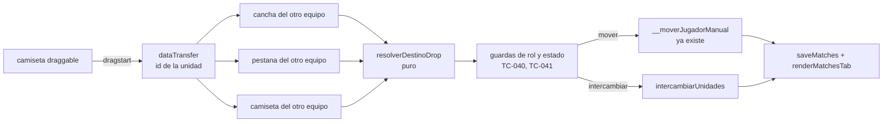
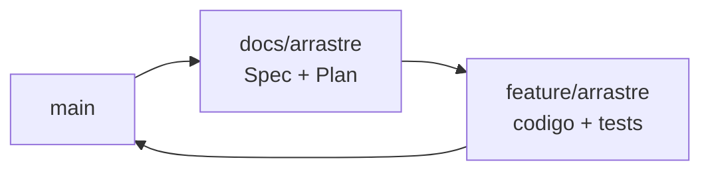

# El arrastre (rebanada 2 de "Equipos en el campo") — Implementation Plan

> **Status:** Draft · **Date:** 2026-08-31 · **Owner:** Lucas Manoukian
>
> **Reviewers:** *pending*
>
> **Spec:** [ARRASTRE_SPEC.md](./ARRASTRE_SPEC.md)
>
> **Concept note:** [EQUIPOS_EN_EL_CAMPO_CONCEPT.md](../EQUIPOS_EN_EL_CAMPO_CONCEPT.md)
>
> **Plan de la rebanada anterior:** [rebanada-1-cancha/CANCHA_IMPLEMENTATION_PLAN.md](../rebanada-1-cancha/CANCHA_IMPLEMENTATION_PLAN.md)

> **Grounding evidence (`MD-25`).** Este Plan se apoya en el ledger §6.5 del
> Concept Note y en las citas en línea de la Spec. Cada tarea que toca un lugar
> concreto de `index.html` lo cita en la propia tarea.

## 1. Summary

Se devuelve la edición manual de equipos, que la rebanada 1 dejó sin punto de
origen, colgándola de la camiseta en vez de la fila de lista; y se introduce el
selector de equipo para que en una sola columna el destino del movimiento esté
siempre a la vista. Todo dentro de `index.html`, reutilizando la API nativa de
arrastre que la aplicación ya usa (`TC-003`) y la ruta de escritura que ya
existe (`TC-010`). La única capacidad nueva es el intercambio de dos unidades,
y sólo existe en dos columnas.

La restricción no obvia que conviene saber antes de leer el resto: **no hay un
dispositivo táctil disponible para probar**, y por eso ningún criterio de
aceptación depende de uno (`NFR-008`). La consecuencia de diseño es el selector:
sin él, el gesto en un teléfono dependía de cómo cada navegador desplaza durante
un arrastre, que es justamente lo que no se puede verificar acá.

## 2. Goals & non-goals

- **Objetivo técnico 1** — Que la camiseta sea el origen del arrastre y que la
  cancha y la pestaña del equipo contrario sean sus destinos, con el efecto
  persistido pasando por `__moverJugadorManual` sin cambiarlo.
- **Objetivo técnico 2** — Que la decisión de qué hace un drop viva en funciones
  **puras**, para que los escenarios se verifiquen con `node tests/cancha.test.js`
  y no dependan de sintetizar un gesto de navegador.
- **Objetivo técnico 3** — Que en una sola columna el DOM contenga exactamente
  una cancha y un selector, y en dos columnas dos canchas y ningún selector, con
  el mismo punto de corte que la tarjeta ya usa.
- **Objetivo técnico 4** — Que el arrastre de la fila de lista y el drop del
  panel, que quedaron sin alcance tras la rebanada 1, desaparezcan.

**No-objetivos:**

- No se toca el motor de generación ni ninguna de sus funciones (`D-01`).
- No se toca el dibujo de la cancha, la camiseta, el candado ni la píldora: la
  rebanada 1 los fijó.
- No se agrega telemetría, CI, feature flags ni ninguna infraestructura que el
  proyecto hoy no tenga (Principio II; ver `TD-09`).
- No se construye un mecanismo de arrastre por eventos de puntero (`TC-003`).
- No se toca el arrastre de la convocatoria ni el del plantel (`FR-052`).

## 3. Architecture overview



Las tres zonas entran por el mismo `resolverDestinoDrop`, que es puro y decide
*qué* movimiento corresponde; las guardas y la escritura quedan del otro lado.
Esa frontera es lo que hace que 25 de los 39 escenarios de la Spec se prueben
sin navegador.

### 3.1 Key design decisions

| ID | Decision | Spec ref | Rationale |
|---|---|---|---|
| TD-01 | El equipo visible es una variable del IIFE (`equipoVisibleCancha`), no un campo del partido ni un atributo del DOM. Se reinicia a `blanco` cuando cambia el partido abierto | `TC-035`, `FR-033`, `NFR-005` | Es estado de pantalla. Persistirlo agregaría un campo a Firestore, que `NFR-005` prohíbe, y guardarlo en el DOM lo perdería en cada repintado |
| TD-02 | En una sola columna se renderiza **sólo** la cancha del equipo visible; la otra no está en el DOM | `FR-030b`, `AC-04`, `S-04d` | La alternativa —renderizar las dos y ocultar una por CSS— rompe el arnés: un elemento con `display:none` devuelve rectángulos de cero, y `INVARIANTE_CANCHA` compara rectángulos ([`tests/layout.test.js:172-186`](../../../tests/layout.test.js)), así que dos canchas ocultas darían solapamientos falsos. Además `AC-04` exige exactamente una |
| TD-03 | El modo de layout lo decide `window.matchMedia('(max-width: 900px)')`, con el mismo literal que la media query de `.teams-wrap` ([`index.html:452`](../../../index.html#L452)) | `TC-015`, `S-04a`, `S-04b` | CSS y JS no pueden compartir el valor, así que el literal queda duplicado. Lo que impide que se desincronicen son los escenarios `S-04a` (900 px → una cancha) y `S-04b` (901 px → dos), que fallan si discrepan. Es la misma técnica con la que `TC-013` de la rebanada 1 ató el escalón al panel: cuando no se puede compartir el valor, se ata con un test |
| TD-04 | La tarjeta se vuelve a pintar al cruzar el punto de corte, escuchando el evento `change` del `matchMedia` | `FR-030`, `FR-031` | Sin eso, agrandar la ventana deja el selector en pantalla con las dos canchas, o al revés. El listener se registra una sola vez |
| TD-05 | La decisión de qué hace un drop se extrae a funciones puras: `unidadDelPartido`, `resolverDestinoDrop` e `intercambiarUnidades` | `FR-010` … `FR-013`, `FR-025`, `AC-50` | Es lo que hace verificables los escenarios sin navegador. El navegador no permite sintetizar un arrastre nativo de punta a punta (Spec §9, preámbulo); si la decisión viviera dentro del manejador de `drop`, 25 escenarios quedarían sin test ejecutable y `AC-50` no se podría cumplir honestamente |
| TD-06 | Los escenarios que sí necesitan DOM disparan el `drop` desde `page.evaluate` con un `DataTransfer` construido a mano | `S-01`, `S-02`, `S-04` | Cubre el cableado DOM → manejador, que es lo que un test puede cubrir. El gesto del navegador queda en `A-01`, declarado |
| TD-07 | `window.__dragStartJugador` se reutiliza tal cual desde la camiseta; no se escribe un `dragstart` nuevo | `TC-010`, `TC-013` | Ya hace exactamente lo que hace falta —guarda el id en el `dataTransfer` con la guarda de rol ([`index.html:3996-3999`](../../../index.html#L3996-L3999))—. Lo que se retira es el `draggable` de la fila, no el manejador |
| TD-08 | Manejadores nuevos, todos `window.__*` como el resto del archivo: `__dropEnCancha`, `__dropEnCamiseta`, `__dropEnPestana`, `__verEquipo` | `FR-010`, `FR-011`, `FR-032`, `FR-034` | Es el patrón que la aplicación ya usa para todo lo que se invoca desde un atributo de HTML generado por plantilla de cadena |
| TD-09 | Sin feature flag | `D-12` | Heredado del `TD-09` de la rebanada 1: no hay infraestructura de flags y el Principio II prohíbe anticiparla. La red de seguridad es la rama sin mergear |
| TD-10 | `tests/cancha.test.js` extiende su lista `DECLARACIONES` con las funciones puras nuevas; no se crea un archivo de test más | `AC-50` | El archivo ya tiene el sandbox que recorta de `index.html` por nombre ([`tests/cancha.test.js:31-40`](../../../tests/cancha.test.js)). Un tercer archivo duplicaría ese andamio para el mismo tipo de prueba |

## 4. Module map

| Module / package | Role | Status |
|---|---|---|
| `index.html` — bloque CSS de la cancha (desde [`index.html:344`](../../../index.html#L344)) | Gana el selector, sus pestañas y los tres realces de drop | modified |
| `index.html` — `renderCamiseta` ([`index.html:3915`](../../../index.html#L3915)) | La camiseta pasa a ser arrastrable y zona de drop | modified |
| `index.html` — `renderCanchaEquipo` ([`index.html:3964`](../../../index.html#L3964)) | La cancha pasa a ser zona de drop | modified |
| `index.html` — panel de equipos en `renderMatchDetail` ([`index.html:4348`](../../../index.html#L4348)) | Gana el selector y el modo de una columna; pierde el drop del panel | modified |
| `index.html` — `renderTeamPlayerRow` / `renderTeamPlayerRowDupla` ([`index.html:3751`](../../../index.html#L3751)) | Pierden el `draggable`, que quedó sin alcance | modified |
| `index.html` — `__moverJugadorManual` y `moverUnJugadorDeEquipo` ([`index.html:4008-4032`](../../../index.html#L4008-L4032)) | Se consumen sin cambios de contrato | untouched |
| `index.html` — `__dropOnTeam` ([`index.html:4000`](../../../index.html#L4000)) | Reemplazado por los tres manejadores nuevos | deleted |
| `tests/cancha.test.js` | Gana los casos de las funciones puras nuevas | modified |
| `tests/layout.test.js` | Gana los escenarios del selector y del drop; se corrigen las etiquetas `spec:` que citaban el apilado | modified |
| `tests/fixtures-app.js` | Sin cambios: los partidos que la rebanada 1 agregó alcanzan | untouched |
| `.specify/specs/003-motor-generacion-equipos/spec.md` | Recibe la anotación recíproca de reemplazo | modified |
| `docs/equipos-en-el-campo/rebanada-1-cancha/CANCHA_SPEC.md` | `FR-054` y `S-06` quedan enmendados | modified |
| `index.html` — motor de generación | En la ruta de la feature, sin cambios (`D-01`) | untouched |

## 5. Engineering rules / project conventions reference

Restatadas de [`AGENTS.md`](../../../AGENTS.md).

| Rule | Summary |
|---|---|
| Estructura | Toda la aplicación en `index.html`, dentro de un IIFE. Sin build, sin bundler, sin framework (Principio II, `TC-001`) |
| Imports | No aplica: no hay módulos. Las funciones nuevas se declaran dentro del mismo IIFE, junto a las del panel de equipos |
| Typing | No aplica: JavaScript sin anotaciones y sin type-checker configurado |
| Logging | No aplica: la aplicación no tiene logging |
| Tests | `tests/*.test.js`, se corren con `node tests/<archivo>`. Devuelven 1 solo ante regresión. Los tests de unidad recortan declaraciones de `index.html` por nombre con `extraer` de `tests/harness.js` |
| Binding | `variant-a` — el identificador de la Spec va en forma canónica con guion **dentro de un string literal**: el nombre del caso en `tests/cancha.test.js` (`prueba('S-02a — …')`) y el campo `spec: ['S-04', 'S-04a']` de cada escenario e invariante de `tests/layout.test.js`. Nunca en comentarios |
| Supply-chain | `none — el repositorio no versiona ningún lockfile; la aplicación no tiene dependencias instaladas`. `.gitignore` excluye `node_modules/` y `package-lock.json`, y Firebase se carga por CDN. Playwright es una dependencia opcional de desarrollo, externa al repositorio |
| Constants | Los valores del handoff van como custom properties de CSS en el bloque que la rebanada 1 ya creó, no repartidos en las reglas |
| Commits | Conventional Commits con asunto en español: `tipo(scope): asunto (IDs de la Spec)`, ≤ 72 caracteres, un cambio lógico por commit, cada commit compila por separado |
| Backwards compat | Requerida en los datos (`NFR-005`, `TC-012`): no se agrega, renombra ni deja de escribir ningún campo. No requerida en la interfaz: el gesto cambia de origen sin camino de vuelta (`TC-013`) |
| Lint / type-check | `none — el repositorio no tiene linter ni type-checker configurados`. `T-1.D3` y `T-1.D4` pasan de forma vacua y se declaran como tales, no se marcan en silencio |

## 6. Definition of Done (every branch)

- [ ] La implementación sigue las convenciones de §5
- [ ] Cada sección de la Spec asignada a la rama está implementada
- [ ] Cada escenario (`S-*`) y cada variante tiene un test ejecutable (`AC-50`; `T-1.D8` y `T-1.D8b`)
- [ ] Cada NFR cuantificado —la lista cerrada del preámbulo de Spec §8— tiene un test de medición (`AC-51`; `T-1.D9`)
- [ ] Cada `TC-*` de la Spec §4 tiene una entrada de verificación en §12 (`AC-52`; `T-1.D10` y `T-1.D10b`)
- [ ] Las consecuencias están enumeradas en §12.2 (`AC-53`; `T-1.D15`)
- [ ] Cada NFR cuantificado tiene al menos una fila `OBS-*` en §11 (`AC-54`; `T-1.D16`)
- [ ] El lockfile pasa la auditoría, o §5 declara `Supply-chain: none` (`AC-55`; `T-1.D20`)
- [ ] Cada riesgo `R-*` de §14 registra una vía de mitigación (`T-1.D17`)
- [ ] Auto-consistencia: todo ID referenciado dentro de este Plan resuelve dentro de este Plan (`T-1.D18`)
- [ ] Consistencia cruzada: todo ID de la Spec citado acá existe en la Spec, y todo `D-*` existe en el Concept Note (`T-1.D19`)
- [ ] Todos los tests nuevos pasan
- [ ] Todos los tests existentes pasan, sin regresiones — en particular `node tests/motor.test.js` y `node tests/cancha.test.js`
- [ ] Linter: no aplica (§5), declarado
- [ ] Type-checker: no aplica (§5), declarado
- [ ] No quedan `TODO`, `FIXME` ni `HACK` en el código commiteado
- [ ] El historial de commits es limpio y sigue el formato de §5 (`T-1.D11`)
- [ ] La descripción del PR resume los cambios y cita las secciones de la Spec (`T-1.D12`)
- [ ] **Gate propio del proyecto:** al menos un escenario nuevo de layout se vio fallar revirtiendo el cambio que lo motiva (Principio V, `TC-032`, `AC-29`), y la pantalla se miró en un navegador real a 360 px y a 1200 px con `node tools/servir-fixture.js` (`T-1.D13`)
- [ ] PR abierto contra `main` (`T-1.D14`)

## 7. Branch / phase plan

### 7.0 Branch sizing (`MD-27`)

```
Custom arc: 1 branch — D-11 del Concept Note fija dos ramas por rebanada, `docs/<rebanada>` y `feature/<rebanada>`, y D-08 ya usó la rebanada como unidad de división del trabajo. Subdividir la rebanada otra vez duplicaría el mismo mecanismo en dos niveles.
```

El árbol de decisión del `MD-27` caería en
`three-branch-scaffold-core-rollout` por descarte, y se descarta por las dos
razones que la rebanada 1 ya registró y que siguen valiendo: no hay
infraestructura de flags con la que gatear una rama intermedia (`TD-09`), y la
rebanada ya *es* la fase (`D-08` partió el rediseño en siete pedazos validables
justamente para poder mirar cada uno en la aplicación real).

### 7.1 Branch tracker

| # | Git branch | Base branch | Status | PR | Tests | Notes |
|---|---|---|---|---|---|---|
| 1 | `feature/arrastre` | `main` | Implementada, sin mergear | — | `motor` 64/64 · `cancha` 42/42 · `layout` 25 escenarios / 240 mediciones | Se mergea después de `docs/arrastre`, según `D-11` |



Las flechas son el orden de merge. Las dos ramas salen de `main`;
`feature/arrastre` se abre después de mergear `docs/arrastre`.

---

### 7.2 Branch 1 — `feature/arrastre`

**Goal:** que un administrador que abre un partido con la inscripción abierta y
los equipos generados pueda arrastrar una camiseta y soltarla sobre la pestaña
del otro equipo (una columna) o sobre la cancha o una camiseta del otro equipo
(dos columnas), con el reparto guardado y repintado; que en una columna vea un
selector y una sola cancha; y que `node tests/cancha.test.js` y
`node tests/layout.test.js` lo verifiquen.

**Spec coverage:** los cuarenta y seis requisitos funcionales (`FR-001` a
`FR-052`, incluidos `FR-007b`, `FR-030b`, `FR-031b`, `FR-032b`, `FR-038b` y
`FR-041b`), los ocho `NFR-*`, los diecinueve `TC-*` y los cuarenta `AC-*`.

#### 7.2.1 Design decisions specific to this branch

> **El orden importa (Spec §17).** Las funciones puras (`T-1.1`–`T-1.3`) van
> primero porque son lo que hace verificable el resto: sin ellas, los
> escenarios dependerían de sintetizar un gesto que el navegador no permite
> sintetizar.

> **La enmienda a la rebanada 1 es trabajo, no efecto colateral.** `T-1.25` y
> `T-1.26` corrigen el `FR-054` y el `S-06` de aquella Spec y las etiquetas
> `spec:` que los citan. Se descubrió por medición que sus *invariantes* no
> afirman el apilado (`R-05`), así que el código de test sobrevive; lo que hay
> que corregir es la documentación y las etiquetas.

#### 7.2.3 New constants

File: `index.html`, en el bloque de custom properties que la rebanada 1 creó.

| Constant | Value | Purpose |
|---|---|---|
| `ANCHO_UNA_COLUMNA` | `900` | El punto de corte, en JS. Duplica el literal de la media query de `.teams-wrap`; `S-04a` y `S-04b` lo mantienen sincronizado (`TD-03`) |
| `--tab-drop-inset` | `-2px` | Realce de la pestaña ([`handoff/README.md` § Selector segmentado](../handoff/README.md)) |
| `--chip-drop-inset` | `-4px -3px` | Realce de la camiseta (§ Arrastre, vista `6a`) |
| `--linea-drop-inset` | `-3px 6px` | Realce de la cancha (§ Arrastre, vista `6a`) |

#### 7.2.5 New / modified interfaces

File: `index.html`

| Función | Firma | Notas |
|---|---|---|
| `unidadDelPartido` | `(m, playerId) -> 'blanco' \| 'negro' \| null` | Pura. Devuelve el equipo al que pertenece la unidad, o `null` si no pertenece al reparto (`FR-025`, `TC-041`) |
| `resolverDestinoDrop` | `(m, idArrastrado, destino) -> {tipo, ...} \| null` | Pura. `destino` es `{clase:'cancha'\|'camiseta'\|'pestana', equipo, id}`. Devuelve `{tipo:'mover', equipo}`, `{tipo:'intercambiar', idDestino}` o `null` cuando el drop no corresponde (`FR-010` a `FR-013`) |
| `intercambiarUnidades` | `(m, idA, idB) -> void` | Muta `m.equipos`: cada unidad —con su pareja de dupla— pasa al equipo de la otra, recalculando totales con `moverUnJugadorDeEquipo` (`FR-011`, `FR-017`, `FR-021`, `FR-024`) |
| `enUnaColumna` | `() -> boolean` | `window.matchMedia('(max-width: ' + ANCHO_UNA_COLUMNA + 'px)').matches` (`TD-03`) |
| `renderSelectorEquipo` | `(m) -> string` | El HTML de las dos pestañas y el thumb, con `aria-pressed` (`FR-030`, `FR-037`) |
| `window.__verEquipo` | `(matchId, equipo) -> void` | Cambia el equipo visible y repinta (`FR-032`, `FR-032b`) |
| `window.__dropEnCancha` | `(e, matchId, equipo) -> void` | (`FR-010`) |
| `window.__dropEnCamiseta` | `(e, matchId, playerId) -> void` | Llama a `stopPropagation` para ganarle a la cancha que la contiene (`FR-012`) |
| `window.__dropEnPestana` | `(e, matchId, equipo) -> void` | Mueve y revela el destino (`FR-034`) |

#### 7.2.6 Tests

```
tests/cancha.test.js     — funciones puras: 25 escenarios y variantes
tests/layout.test.js     — DOM, selector, drop sintetizado y medidas: 14
```

| File | What it covers |
|---|---|
| `tests/cancha.test.js` | `unidadDelPartido`, `resolverDestinoDrop`, `intercambiarUnidades`: precedencia de zonas, drops inválidos, duplas, identificadores ajenos |
| `tests/layout.test.js` | Escenarios `arrastre-selector`, `arrastre-drop`, `arrastre-jugador`; invariante `INVARIANTE_SELECTOR` |

#### 7.2.7 Verification

- [ ] En una columna el DOM tiene exactamente una `.cancha` y un selector; en dos columnas, dos `.cancha` y ningún selector
- [ ] Un drop sintetizado sobre la pestaña contraria cambia `m.equipos` y el equipo visible
- [ ] Un drop sintetizado sobre una camiseta contraria intercambia las dos unidades
- [ ] Ningún elemento de la tarjeta queda con `draggable` cuando el rol es `jugador` o la inscripción está cerrada
- [ ] `window.__escrituras` no gana claves nuevas, y el diff de campos no contiene `posicionAsignada`
- [ ] Todos los tests existentes pasan

#### 7.2.8 Files inventory

**Modified files:**
```
index.html
tests/cancha.test.js
tests/layout.test.js
docs/equipos-en-el-campo/rebanada-1-cancha/CANCHA_SPEC.md
.specify/specs/003-motor-generacion-equipos/spec.md
.specify/specs/008-duplas-rotacion/spec.md
.specify/specs/012-puntajes-coherentes-panel/spec.md
```

No hay archivos nuevos ni borrados: `__dropOnTeam` se retira de `index.html`,
que ya está en la lista de modificados.

#### 7.2.9 Task checklist (agent-runnable)

Implementation tasks (agrupadas en commits atómicos):

- [ ] T-1.1 Agregar `unidadDelPartido` en `index.html`, junto a `getDuplaPartner` ([`index.html:1922`](../../../index.html#L1922)) (`FR-025`, `TC-041`)
- [ ] T-1.2 Agregar `resolverDestinoDrop`: precedencia de camiseta sobre cancha (`FR-012`), `null` para todo destino del propio equipo (`FR-013`), `null` si el origen o el destino no pertenecen al partido (`FR-025`) (`FR-010`, `FR-011`, `FR-012`, `FR-013`, `FR-025`)
- [ ] T-1.3 Agregar `intercambiarUnidades`, que reutiliza `moverUnJugadorDeEquipo` para las dos unidades y arrastra la pareja de cada dupla (`FR-011`, `FR-017`, `FR-021`, `FR-024`)
- [ ] T-1.C1 Commit — `feat(arrastre): resolución pura del destino de un drop (FR-010, FR-013, FR-025)`

- [ ] T-1.4 Agregar el bloque CSS del selector segmentado con los valores de [`handoff/README.md` § Selector segmentado](../handoff/README.md): grilla de dos columnas, thumb y transición (`FR-030`, `TC-033`)
- [ ] T-1.5 Agregar el CSS de los tres realces de drop con los `inset` de §7.2.3, todos con `pointer-events: none` (`FR-014`, `TC-033`, `TC-034`)
- [ ] T-1.C2 Commit — `feat(arrastre): CSS del selector y de los realces de drop (FR-030, TC-033)`

- [ ] T-1.6 Agregar `ANCHO_UNA_COLUMNA` y `enUnaColumna`, y registrar una sola vez el listener de `change` del `matchMedia` que repinta la tarjeta (`TD-03`, `TD-04`, `TC-015`)
- [ ] T-1.7 Agregar `equipoVisibleCancha` como variable del IIFE, con su reinicio a `blanco` cuando cambia el partido abierto (`FR-033`, `TD-01`, `TC-035`)
- [ ] T-1.8 Implementar `renderSelectorEquipo` y `window.__verEquipo`, con `aria-pressed` en cada pestaña. El selector se dibuja también con rol `jugador`, que puede cambiar de equipo visible pero no recibe zonas de drop (`FR-030`, `FR-032`, `FR-032b`, `FR-037`, `FR-038`, `FR-038b`, `NFR-003`)
- [ ] T-1.9 Cablear en el panel de equipos ([`index.html:4348`](../../../index.html#L4348)): en una columna, selector más la cancha del equipo visible; en dos, las dos canchas y ningún selector. Ni el selector ni las zonas de drop aparecen con la inscripción cerrada, el partido finalizado o el resultado en edición — el mismo predicado `mostrarCanchaDeEquipos` ([`index.html:3724`](../../../index.html#L3724)) que la rebanada 1 dejó (`FR-030`, `FR-030b`, `FR-031`, `FR-031b`, `FR-040`, `FR-042`, `TD-02`)
- [ ] T-1.9b Verificar por `git diff` que el resto de la tarjeta de equipos —encabezado, aviso de equipos desactualizados, resúmenes de diferencia y de posiciones, bloque "Por qué quedaron así" y botonera— no cambió, salvo el subtítulo que `T-1.17` reescribe (`FR-044`)
- [ ] T-1.C3 Commit — `feat(arrastre): selector de equipo y modo de una columna (FR-030, FR-031, TC-015)`

- [ ] T-1.10 Marcar la camiseta como arrastrable cuando `esFilaEditable(m)` ([`index.html:3731`](../../../index.html#L3731)), reutilizando `window.__dragStartJugador` sin modificarlo, y anunciar el gesto en su `title` con el texto escapado. El `draggable` va en el contenedor de la camiseta y **no** envuelve al candado, para que activarlo siga siendo un click y no el inicio de un arrastre (`R-09`). Con rol `jugador` no se marca ninguna camiseta (`FR-001`, `FR-002`, `FR-003`, `FR-007b`, `FR-041`, `FR-041b`, `TD-07`, `TC-042`)
- [ ] T-1.11 Agregar los tres manejadores de drop y sus `dragover`, cada uno con la guarda de rol y de estado y con la validación de identificadores antes de escribir. El efecto lo aplican `__moverJugadorManual` e `intercambiarUnidades`, que ya arrastran la pareja de la dupla, recalculan totales, no tocan `posicionAsignada`, no consultan `m.bloqueados` y guardan y repintan: esos comportamientos se **heredan** y se verifican, no se reimplementan (`FR-006`, `FR-010`, `FR-011`, `FR-016`, `FR-020`, `FR-022`, `FR-023`, `FR-026`, `FR-034`, `TC-040`, `TC-041`)
- [ ] T-1.12 Agregar el realce de la zona bajo el puntero durante el `dragover`, y su retiro en `dragleave`, `drop` y `dragend` (`FR-008`, `FR-014`, `FR-015`, `FR-035`)
- [ ] T-1.13 Verificar por revisión que ninguna zona del propio equipo se realza ni acepta el drop, y que la pestaña no cambia de equipo por sobrevuelo (`FR-013`, `FR-015`, `FR-036`)
- [ ] T-1.C4 Commit — `feat(arrastre): la camiseta arrastrable y las tres zonas de drop (FR-001, FR-010, FR-011)`

- [ ] T-1.14 Quitar el `draggable` y el `ondragstart` de `renderTeamPlayerRow` y `renderTeamPlayerRowDupla` ([`index.html:3751`](../../../index.html#L3751), [`index.html:3798`](../../../index.html#L3798)) (`FR-050`, `TC-013`)
- [ ] T-1.15 Quitar `dragAttrsBlanco` / `dragAttrsNegro` del panel ([`index.html:4345-4346`](../../../index.html#L4345-L4346)) y borrar `window.__dropOnTeam`, que queda sin llamadores (`FR-051`, `TC-014`)
- [ ] T-1.16 Verificar por `git grep` que `__dropOnTeam` no tiene ninguna referencia y que `__dragStartConvocatoria` y `__dragStartRosterRow` quedaron intactos (`FR-052`, `AC-24`)
- [ ] T-1.C5 Commit — `refactor(arrastre): retira el arrastre de la fila y el drop del panel (FR-050, TC-013)`

- [ ] T-1.17 Actualizar el subtítulo de la tarjeta ([`index.html:4351`](../../../index.html#L4351)) al texto que fija `OPEN-Q-06` en §15.1 (`FR-043`)
- [ ] T-1.C6 Commit — `feat(arrastre): el subtítulo nombra el gesto que la pantalla ofrece (FR-043)`

- [ ] T-1.18 Extender `DECLARACIONES` de [`tests/cancha.test.js`](../../../tests/cancha.test.js) con `unidadDelPartido`, `resolverDestinoDrop` e `intercambiarUnidades`, en orden de dependencia (`TD-10`)
- [ ] T-1.19b Escribir en `tests/cancha.test.js` el chequeo de literales visuales: todo color, radio, sombra y espaciado del bloque CSS del selector y de los realces está en la lista declarada de tokens y excepciones de §7.2.3 (`NFR-006`, `OBS-06`, `AC-15`)
- [ ] T-1.19 Escribir los veinticinco casos de unidad de §12.1: `S-01a`–`S-01d`, `S-01f`, `S-02a`–`S-02e`, `S-03`, `S-03a`, `S-03b`, `S-20`, `S-20a`–`S-20c`, `S-21`, `S-21a`–`S-21d`, `S-22`
- [ ] T-1.C7 Commit — `test(arrastre): casos de unidad de la resolución del drop (S-02, S-21, S-03)`

- [ ] T-1.20 Agregar a `tests/layout.test.js` el escenario `arrastre-selector`, que comprueba una cancha y un selector en una columna, dos canchas y ningún selector en dos, y el cambio de pestaña (`S-04`, `S-04a`–`S-04c`, `S-06`)
- [ ] T-1.21 Agregar `INVARIANTE_SELECTOR`: en cada ancho medido, la cantidad de `.cancha` es 1 cuando hay selector y 2 cuando no lo hay, y cada pestaña mide al menos 44 px de lado (`S-04d`, `NFR-002`)
- [ ] T-1.22 Agregar el escenario `arrastre-drop`, que sintetiza un `drop` con `DataTransfer` desde `page.evaluate` sobre la pestaña y sobre una camiseta, y mide el ciclo con `performance.now()` (`S-01`, `S-01e`, `S-02`, `NFR-004`, `NFR-005`, `TD-06`)
- [ ] T-1.23 [P] Agregar el escenario `arrastre-jugador` (rol `jugador`) y extender los de partido cerrado y finalizado (`S-06a`, `S-06b`, `S-10`, `S-10a`–`S-10c`)
- [ ] T-1.24 [P] Agregar al invariante de accesibilidad el `title` no vacío de toda camiseta arrastrable y el nombre accesible de cada pestaña (`NFR-003`, `AC-12`)
- [ ] T-1.C8 Commit — `test(layout): selector, drop sintetizado e invariante de una cancha (S-04, S-01)`

- [ ] T-1.25 Corregir en [`CANCHA_SPEC.md`](../rebanada-1-cancha/CANCHA_SPEC.md) el `FR-054` y el último *Then* de `S-06`, que afirman el apilado, con nota de que esta Spec los enmienda (`R-05`, `AC-10`)
- [ ] T-1.26 Corregir las etiquetas `spec:` de `tests/layout.test.js` que citan los escenarios de apilado **de la Spec de la rebanada 1** —su `S-06` y sus cuatro variantes, que no son los de esta Spec pese a coincidir el número— y que dejaron de describir lo que el escenario mide (`R-05`)
- [ ] T-1.C9 Commit — `docs(cancha): el apilado queda enmendado por la rebanada 2 (FR-054, S-06)`

- [ ] T-1.27 Agregar la anotación recíproca de reemplazo en las cuatro specs pisadas: `003-motor-generacion-equipos` (`FR-014`) y `CANCHA_SPEC.md` por esta rebanada; `012-puntajes-coherentes-panel` y `008-duplas-rotacion` por la 1, que quedaron pendientes (`OPEN-Q-04`, Principio I)
- [ ] T-1.C10 Commit — `docs(specs): anotación recíproca de las specs reemplazadas (OPEN-Q-04)`

- [ ] T-1.28 Correr `node tools/servir-fixture.js`, mirar la pantalla a 360 px y a 1200 px con el emulador de dispositivo, y registrar en el PR el resultado y el comportamiento observado de los resúmenes tras un movimiento manual (`OPEN-Q-03`, `T-1.D13`)

DoD verification (§6). Todo cambio de código hecho durante esta verificación va
en su propio commit de arreglo, nunca doblado dentro de uno anterior:

- [ ] T-1.D1 Los tests nuevos pasan — `node tests/cancha.test.js` y `node tests/layout.test.js`
- [ ] T-1.D2 Los tests existentes pasan, sin regresiones — `node tests/motor.test.js` y `LAYOUT_STRICT=1 node tests/layout.test.js`
- [ ] T-1.D3 Linter — no aplica (§5). Se declara, no se marca en silencio
- [ ] T-1.D4 Type-checker — no aplica (§5). Se declara, no se marca en silencio
- [x] T-1.D5 No quedan `TODO`/`FIXME`/`HACK`. **El recetario ingenuo no sirve en este repositorio**: el código está comentado en español y `todo` es una palabra corriente, así que `grep TODO` da falsos positivos. Se busca la forma de MARCADOR: `git grep -nE '(TODO|FIXME|HACK)[(:]' -- index.html tests/`
- [ ] T-1.D6 La implementación sigue §5 (releer §5 antes de abrir el PR)
- [ ] T-1.D7 Cada `FR-*`, `NFR-*`, `TC-*` y `AC-*` de la Spec está implementado o verificado. Incluye recorrer §11 de la Spec confirmando que ningún criterio exige un dispositivo ausente (`NFR-008`, `AC-17`, `OBS-07`)
- [ ] T-1.D8 Cada `S-NN` y cada variante tiene test — `comm -23 <(grep -oE '(^|[^A-Za-z])S-[0-9]+[a-z]*' docs/equipos-en-el-campo/rebanada-2-arrastre/ARRASTRE_SPEC.md | sed -E 's/^[^S]+//' | sort -u) <(grep -rEho "(prueba\('|spec: \[|', ')S-[0-9]+[a-z]*" tests/ | grep -oE "S-[0-9]+[a-z]*" | sort -u)` devuelve vacío (`AC-50`)
- [ ] T-1.D8b Cada cabecera de escenario de Spec §9 lleva bloque `Variants:` o su declaración explícita — el lint `awk` del template sobre `ARRASTRE_SPEC.md` devuelve vacío (`AC-50`)
- [ ] T-1.D9 Cada NFR de la lista cerrada del preámbulo de Spec §8 —`NFR-001`, `NFR-002`, `NFR-004`, `NFR-005`, `NFR-007`— tiene test de medición referenciado en §12 (`AC-51`)
- [ ] T-1.D10 Cada `TC-*` de Spec §4 aparece en §12 de este Plan — `comm -23 <(grep -oE "TC-[0-9]+" ARRASTRE_SPEC.md | sort -u) <(sed -n '/^## 12\./,/^## 13\./p' ARRASTRE_IMPLEMENTATION_PLAN.md | grep -oE "TC-[0-9]+" | sort -u)` devuelve vacío (`AC-52`)
- [ ] T-1.D10b Cada `TC-*` de Spec §4 tiene además su criterio en Spec §11.3 (`AC-52`, segundo conjunto)
- [ ] T-1.D11 El historial de commits es limpio — `git log --oneline main..HEAD`
- [ ] T-1.D12 Descripción del PR redactada: resumen, referencias a la Spec, decisiones tomadas
- [ ] T-1.D13 **Gate del proyecto:** (a) al menos un escenario nuevo de layout se vio fallar revirtiendo el cambio que lo motiva (`TC-032`, `AC-29`); (b) la pantalla se miró a 360 px y a 1200 px en un navegador real (`T-1.28`)
- [ ] T-1.D14 PR abierto contra `main`
- [ ] T-1.D15 §12.2 tiene al menos una fila `IMP-*` por ámbito afectado (`AC-53`)
- [ ] T-1.D16 Cada NFR de la lista cerrada tiene fila `OBS-*` en §11 (`AC-54`)
- [ ] T-1.D17 Cada `R-*` de §14 registra vía de mitigación
- [ ] T-1.D18 Pasada de auto-consistencia dentro de este Plan
- [ ] T-1.D19 Pasada de consistencia cruzada contra la Spec y el Concept Note
- [x] T-1.D20 Auditoría de cadena de suministro — §5 declara `Supply-chain: none`, así que pasa de forma vacua. **Se confirma con `git ls-files package-lock.json package.json` sin resultado, no con `ls`**: los dos archivos SÍ existen en el disco (Playwright los deja al instalarse) pero `.gitignore` los excluye, así que no hay lockfile *versionado* que auditar. La primera versión de esta tarea miraba el disco y habría reportado un lockfile que la rama no contiene (`AC-55`)

## 8. Data model & migrations

No hay cambios de esquema ni migraciones. La rebanada no agrega, renombra ni
deja de escribir ningún campo (`NFR-005`, `TC-012`), y el equipo visible es
estado de pantalla (`TC-035`, `TD-01`). El modelo de datos cambia en la rebanada
5; §8.2 y §8.3 corresponden a ese Plan.

## 9. API & contract changes

No hay endpoints ni contratos entre servicios, y no se introduce ningún par
productor/consumidor, así que §9.2.1 no aplica. El único contrato que la
rebanada consume y no controla es el `dataTransfer` del navegador, que la Spec
trata como canal no confiable (§10.2) y `TC-041` valida.

## 10. Configuration & feature flags

Ninguno (`TD-09`). La red de seguridad de esta rebanada es la rama sin mergear.

## 11. Observability

> **Declaración honesta, heredada de la rebanada 1.** Esta aplicación **no tiene
> telemetría de producción**: no hay métricas, ni trazas, ni logs centralizados,
> ni panel. Agregarla para esta rebanada sería la infraestructura anticipada que
> prohíbe el Principio II. Las filas de abajo son señales **previas al merge**
> —salidas de comandos que se corren y se leen— más el canal real por el que
> este producto se entera de sus problemas, que son los reportes del grupo.

| ID | Signal | Type | Source | Binds to | Threshold / use |
|---|---|---|---|---|---|
| OBS-01 | Salida de `node tests/layout.test.js` — desborde y elementos fuera del viewport por ancho | métrica (pre-merge) | `tests/layout.test.js` | NFR-001 | Falla si hay desborde en cualquiera de los trece anchos |
| OBS-02 | `INVARIANTE_SELECTOR` — cantidad de canchas por modo y lado de cada pestaña | métrica (pre-merge) | `tests/layout.test.js` | NFR-002 | Falla si hay dos canchas con selector, una sin él, o una pestaña de menos de 44 px |
| OBS-03 | `INVARIANTE_CANCHA_A11Y` extendido — `title` de la camiseta arrastrable y nombre accesible de cada pestaña | métrica (pre-merge) | `tests/layout.test.js` | NFR-003 | Falla ante un `title` vacío en una camiseta arrastrable o una pestaña sin nombre accesible |
| OBS-04 | Marca de `performance.now()` alrededor del ciclo soltar-guardar-repintar | métrica (pre-merge) | escenario `arrastre-drop` | NFR-004 | Falla por encima de 150 ms con 18 titulares |
| OBS-05 | `window.__escrituras` — claves escritas, y diff de campos del documento de partido | log (pre-merge) | `tests/fixtures-app.js` | NFR-005, NFR-007 | Falla si aparece una clave nueva, si el diff contiene `posicionAsignada`, o si un drop inválido escribe algo |
| OBS-06 | Chequeo de literales visuales del bloque del selector y de los realces contra la lista declarada | métrica (pre-merge) | `tests/cancha.test.js` | NFR-006 | Falla ante un color, radio o sombra literal no declarado |
| OBS-07 | Recorrido de Spec §11 confirmando que cada criterio nombra `layout.test.js`, `cancha.test.js` o revisión | revisión (pre-merge) | `T-1.D7` | NFR-008 | Falla si algún criterio exige un dispositivo ausente |
| OBS-08 | Reportes del grupo por su canal habitual tras el merge | señal cualitativa | los usuarios | S-01, A-01, R-01, R-03 | Es el único canal post-deploy que este producto tiene hoy, y el que comprueba `A-01` |

**Dashboards:** ninguno. Ver la declaración de arriba.

## 12. Test plan

### 12.1 Scenario Traceability Matrix

| Spec scenario | Test | Level | Branch |
|---|---|---|---|
| S-01 (parent) mover al otro equipo | `tests/layout.test.js` escenario `arrastre-drop` (`spec: ['arrastre/S-01']`) | e2e | Branch 1 |
| S-01a `[boundary]` único de su línea | `tests/cancha.test.js` — `prueba('arrastre/S-01a …')` | unit | Branch 1 |
| S-01b `[boundary]` unidad fijada | `tests/cancha.test.js` — `prueba('arrastre/S-01b …')` | unit | Branch 1 |
| S-01c `[boundary]` equipos desparejos | `tests/cancha.test.js` — `prueba('arrastre/S-01c …')` | unit | Branch 1 |
| S-01d `[failure]` pestaña propia | `tests/cancha.test.js` — `prueba('arrastre/S-01d …')` | unit | Branch 1 |
| S-01e `[failure]` arrastre cancelado | `tests/layout.test.js` escenario `arrastre-drop` (`spec: ['arrastre/S-01e']`) | e2e | Branch 1 |
| S-01f `[property]` unidades conservadas | `tests/cancha.test.js` — `prueba('arrastre/S-01f …')` | unit + property | Branch 1 |
| S-02 (parent) intercambio en ancho | `tests/layout.test.js` escenario `arrastre-drop` (`spec: ['arrastre/S-02']`) | e2e | Branch 1 |
| S-02a `[boundary]` destino fijado | `tests/cancha.test.js` — `prueba('arrastre/S-02a …')` | unit | Branch 1 |
| S-02b `[boundary]` cancha, no camiseta | `tests/cancha.test.js` — `prueba('arrastre/S-02b …')` | unit | Branch 1 |
| S-02c `[failure]` camiseta propia | `tests/cancha.test.js` — `prueba('arrastre/S-02c …')` | unit | Branch 1 |
| S-02d `[failure]` cancha propia | `tests/cancha.test.js` — `prueba('arrastre/S-02d …')` | unit | Branch 1 |
| S-02e `[property]` cantidades idénticas | `tests/cancha.test.js` — `prueba('arrastre/S-02e …')` | unit + property | Branch 1 |
| S-03 (parent) dupla entera | `tests/cancha.test.js` — `prueba('arrastre/S-03 …')` | unit | Branch 1 |
| S-03a `[boundary]` dupla contra dupla | `tests/cancha.test.js` — `prueba('arrastre/S-03a …')` | unit | Branch 1 |
| S-03b `[boundary]` dupla contra individual | `tests/cancha.test.js` — `prueba('arrastre/S-03b …')` | unit | Branch 1 |
| S-04 (parent) el selector decide | `tests/layout.test.js` escenario `arrastre-selector` (`spec: ['arrastre/S-04']`) | e2e | Branch 1 |
| S-04a `[boundary]` 900 px, una columna | `tests/layout.test.js` escenario `arrastre-selector` (`spec: ['arrastre/S-04a']`) | e2e | Branch 1 |
| S-04b `[boundary]` 901 px, dos columnas | `tests/layout.test.js` escenario `arrastre-selector` (`spec: ['arrastre/S-04b']`) | e2e | Branch 1 |
| S-04c `[boundary]` rol jugador a 360 px | `tests/layout.test.js` escenario `arrastre-jugador` (`spec: ['arrastre/S-04c']`) | e2e | Branch 1 |
| S-04d `[property]` una cancha con selector | `tests/layout.test.js` — `INVARIANTE_SELECTOR` (`spec: ['arrastre/S-04d']`) | property | Branch 1 |
| S-05 el candado sigue siendo el candado | `tests/layout.test.js` escenario `cancha-candado` (`spec: ['arrastre/S-05']`) | e2e | Branch 1 |
| S-06 (parent) el DOM declara lo que acepta | `tests/layout.test.js` escenario `arrastre-selector` (`spec: ['arrastre/S-06']`) | e2e | Branch 1 |
| S-06a `[boundary]` rol jugador | `tests/layout.test.js` escenario `arrastre-jugador` (`spec: ['arrastre/S-06a']`) | e2e | Branch 1 |
| S-06b `[boundary]` inscripción cerrada | `tests/layout.test.js` escenario `partido-cerrado` (`spec: ['arrastre/S-06b']`) | e2e | Branch 1 |
| S-10 (parent) pantallas sin arrastre | `tests/layout.test.js` escenario `partido-cerrado` (`spec: ['arrastre/S-10']`) | e2e | Branch 1 |
| S-10a `[boundary]` finalizado | `tests/layout.test.js` escenario `partido-finalizado` (`spec: ['arrastre/S-10a']`) | e2e | Branch 1 |
| S-10b `[boundary]` finalizado en edición | `tests/layout.test.js` escenario `partido-editando` (`spec: ['arrastre/S-10b']`) | e2e | Branch 1 |
| S-10c `[boundary]` sin equipos generados | `tests/layout.test.js` escenario `partido-sin-equipos` (`spec: ['arrastre/S-10c']`) | e2e | Branch 1 |
| S-20 (parent) rol sin permiso | `tests/layout.test.js` escenario `arrastre-permisos` (`spec: ['arrastre/S-20']`) | e2e | Branch 1 |
| S-20a `[failure]` inscripción cerrada | `tests/layout.test.js` escenario `arrastre-permisos-estado` (`spec: ['arrastre/S-20a']`) | e2e | Branch 1 |
| S-20b `[failure]` partido finalizado | `tests/layout.test.js` escenario `arrastre-permisos-estado` (`spec: ['arrastre/S-20b']`) | e2e | Branch 1 |
| S-20c `[failure]` drop de pestaña, rol jugador | `tests/layout.test.js` escenario `arrastre-permisos` (`spec: ['arrastre/S-20c']`) | e2e | Branch 1 |
| S-21 (parent) contenido ajeno al partido | `tests/cancha.test.js` — `prueba('arrastre/S-21 …')` | unit | Branch 1 |
| S-21a `[failure]` texto arbitrario | `tests/cancha.test.js` — `prueba('arrastre/S-21a …')` | unit | Branch 1 |
| S-21b `[failure]` jugador no convocado | `tests/cancha.test.js` — `prueba('arrastre/S-21b …')` | unit | Branch 1 |
| S-21c `[failure]` destino ajeno | `tests/cancha.test.js` — `prueba('arrastre/S-21c …')` | unit | Branch 1 |
| S-21d `[failure]` inválido sobre la pestaña | `tests/layout.test.js` escenario `arrastre-drop` (`spec: ['arrastre/S-21d']`) | e2e | Branch 1 |
| S-22 nombre con marcado en el `title` | `tests/cancha.test.js` — `prueba('arrastre/S-22 …')` | unit | Branch 1 |

Treinta y nueve filas: diez escenarios padre y veintinueve variantes.
**Diecinueve** se resuelven sin navegador gracias a `TD-05`; las **veinte**
restantes necesitan DOM y van a `tests/layout.test.js`. El borrador de este Plan
decía «veinticinco y catorce»: la cuenta estaba mal, y además cuatro escenarios de
permiso (`S-20`, `S-20a`, `S-20b`, `S-20c`) y `S-21d` se movieron de unidad a e2e
al implementarlos, porque la guarda de rol y de estado vive en el manejador —que
no es puro— y probarla en el sandbox habría exigido duplicar la regla.

### 12.2 Impact Traceability

| ID | Scope | Description | Triggered by | Risk | OBS | Mitigation task |
|---|---|---|---|---|---|---|
| IMP-01 | business | El administrador **recupera** la edición manual del reparto, suspendida desde el merge de la rebanada 1, y gana el intercambio de dos unidades | FR-001, FR-010, FR-011 | R-01 | OBS-08 | `T-1.10`, `T-1.11` |
| IMP-02 | business | **Cambia cómo se leen los equipos en el celular**, también para el rol `jugador`: se ve uno por vez con pestañas en vez de los dos apilados. Es alcance más allá del arrastre | FR-030, FR-030b, FR-038 | R-03 | OBS-08 | `T-1.9`, `T-1.28` |
| IMP-03 | system | La suite de layout gana tres escenarios y un invariante, sobre trece anchos: sube el tiempo de corrida. Nada corre en CI, así que el costo lo paga quien la corre a mano | S-04, S-01 | R-06 | OBS-01 | `T-1.20`, `T-1.21` |
| IMP-04 | code | `index.html` gana nueve funciones y dos bloques de CSS, y pierde `__dropOnTeam` y dos atributos de arrastre. Cuatro specs vigentes quedan con anotación recíproca pendiente hasta `T-1.27` | FR-050, FR-051 | R-04 | — | `T-1.14`, `T-1.15`, `T-1.27` |
| IMP-05 | code | El `FR-054` y el `S-06` de la Spec de la rebanada 1 quedan enmendados, junto con las etiquetas `spec:` que los citaban | FR-030b, FR-031 | R-05 | — | `T-1.25`, `T-1.26` |
| IMP-06 | external | Los jugadores del grupo ven una pantalla distinta sin aviso previo: no hay canal de notas de versión, sólo el número de versión en la interfaz | FR-030, FR-038 | R-03 | OBS-08 | `T-1.D13` |

### 12.3 Unit tests

`tests/cancha.test.js`, sin navegador. Extiende su lista `DECLARACIONES` con
`unidadDelPartido`, `resolverDestinoDrop` e `intercambiarUnidades` (`TD-10`) y
cubre las veinticinco filas unitarias de §12.1. Verifica además `NFR-006` por el
chequeo de literales visuales del bloque nuevo de CSS.

### 12.4 Integration tests

No aplica como categoría propia: la aplicación no tiene módulos que integrar
entre sí. Lo que en otro proyecto sería integración —el cableado entre el DOM y
los manejadores— acá se cubre en `tests/layout.test.js` con el drop sintetizado
de `TD-06`.

### 12.5 Contract tests

No aplica: no hay par productor/consumidor (§9).

### 12.6 End-to-end / smoke tests

`tests/layout.test.js` sobre la aplicación real servida desde el repositorio,
con el doble de Firebase de `tests/fixtures-app.js`. Escenarios nuevos
`arrastre-selector`, `arrastre-drop` y `arrastre-jugador`; escenarios existentes
extendidos con las etiquetas `spec:` de §12.1.

### 12.7 Manual QA

`T-1.28`: mirar la pantalla a 360 px y a 1200 px en un navegador real con
`node tools/servir-fixture.js`, y registrar el comportamiento observado de los
resúmenes tras un movimiento manual, que es lo que cierra `OPEN-Q-03` con
evidencia además de lectura de código.

### 12.8 Performance tests

`NFR-004` (150 ms del ciclo soltar-guardar-repintar con 18 titulares) se mide con
`performance.now()` dentro del escenario `arrastre-drop` (`OBS-04`, `T-1.22`).

### 12.9 Verificación de las restricciones técnicas

> Sub-sección propia de este Plan, como en la rebanada 1. Existe porque `AC-52`
> exige que **cada** `TC-*` tenga su entrada en §12, y las diecinueve de esta
> Spec se reparten entre evidencia mecánica y revisión humana.

| TC | Evidencia | Forma |
|---|---|---|
| TC-001 | Revisión de código: no aparece `support.js` ni ningún motor de plantillas; `git diff --stat` no toca archivos de dependencias | revisor |
| TC-002 | `ls package-lock.json` sigue sin devolver nada (`T-1.D20`) | mecánica |
| TC-003 | Revisión de código: el arrastre usa `draggable`/`dragstart`/`dragover`/`drop` y no se agrega ningún manejador de `pointer` ni de `touch` — `git grep -nE "pointer(down|move|up)|touch(start|move|end)" index.html` sin resultados nuevos | mecánica + revisor |
| TC-010 | Revisión de código: el efecto pasa por `__moverJugadorManual` e `intercambiarUnidades`, que a su vez usa `moverUnJugadorDeEquipo` | revisor |
| TC-011 | Revisión de código: no hay cálculo de puntaje ni resolución de posición propios de la vista | revisor |
| TC-012 | `tests/layout.test.js` — el diff de campos no contiene `posicionAsignada` (`OBS-05`, `AC-23`) | mecánica |
| TC-013 | `git grep -n "draggable" index.html` no devuelve ninguna fila de equipo, y `__dropOnTeam` no tiene llamadores (`T-1.16`, `AC-24`) | mecánica |
| TC-014 | Escenario `arrastre-selector`: los atributos de drop están en `.cancha` y en las pestañas, no en `.team-panel` (`AC-25`) | mecánica |
| TC-015 | Escenarios `S-04a` (900 px) y `S-04b` (901 px), que fallan si el literal de JS y el de la media query discrepan (`TD-03`, `AC-26`) | mecánica |
| TC-020 | Revisión de código: ningún campo de dato nuevo, ningún destinatario nuevo | revisor |
| TC-030 | `tests/cancha.test.js` — chequeo de literales visuales (`NFR-006`, `OBS-06`) | mecánica |
| TC-031 | Revisión de código: la lista de excepciones de §7.2.3 cubre cada literal que el chequeo declara | revisor |
| TC-032 | `T-1.D13(a)`: un escenario nuevo se vio fallar revirtiendo el cambio que lo motiva | revisor, con evidencia en el PR |
| TC-033 | Revisión de código contra `handoff/README.md` § Selector segmentado y § Arrastre, valor por valor (`T-1.4`, `T-1.5`) | revisor |
| TC-034 | Escenario `arrastre-selector`: cada realce declara `pointer-events: none` (`AC-31`) | mecánica |
| TC-035 | El equipo visible no aparece en el diff de campos escritos (`OBS-05`, `AC-32`) | mecánica |
| TC-040 | Escenarios `S-20`, `S-20a`–`S-20c` en `tests/cancha.test.js`, más `T-1.11` | mecánica + revisor |
| TC-041 | Escenarios `S-21`, `S-21a`–`S-21d` en `tests/cancha.test.js` | mecánica |
| TC-042 | Escenario `S-22` en `tests/cancha.test.js` | mecánica |

## 13. Rollout plan

No hay despliegue progresivo ni flag: el proyecto publica por merge a `main`.

1. Mergear `docs/arrastre` a `main` (Spec y Plan), según `D-11`.
2. Abrir `feature/arrastre` desde `main` y ejecutar §7.2.9.
3. Probar la rama abriendo `index.html` localmente, que apunta a la base de
   **staging** automáticamente por hostname
   ([`README.md:51`](../../../README.md)). Ninguna prueba toca la base real.
4. Mirar la pantalla a 360 px y a 1200 px con el emulador de dispositivo
   (`T-1.28`, `T-1.D13`).
5. Mergear `feature/arrastre` a `main`. GitHub Pages publica contra la base real
   y el workflow de versión sube el patch.
6. **Escuchar `OBS-08` en el próximo armado real.** Es lo que comprueba `A-01`
   —que el arrastre nativo se dispare desde el gesto del sistema sobre una
   camiseta— y no hay forma de adelantarlo en este entorno.

**Rollback:** revertir el merge. No hay dato que deshacer, porque la rebanada no
escribe ningún campo nuevo (`NFR-005`).

## 14. Risks & rollback

| ID | Risk | Likelihood | Severity | Detection signal | Mitigation task | Rollback procedure |
|---|---|---|---|---|---|---|
| R-01 | El arrastre nativo no se dispara sobre una camiseta dentro de la cancha en un navegador móvil, y no hay cómo saberlo antes de mergear (`A-01`) | Low | Med | OBS-08 | `T-1.28` reduce la incertidumbre mirándolo en el emulador, que no es lo mismo que un teléfono pero descarta los errores groseros. El selector ya achicó lo que el gesto tiene que lograr | Revertir el merge y construir el gesto por eventos de puntero, que con el selector ya no necesita desplazamiento propio y por lo tanto es mucho más chico |
| R-02 | El intercambio no existe en una columna, que es donde se arman los partidos, y nadie lo descubre en ancho | Med | Low | OBS-08 | `accepted (rationale: declarado en Spec §3.2 como límite explícito; el mismo resultado se logra con dos movimientos por pestaña, al costo de un estado intermedio desparejo)` | No aplica |
| R-03 | Mostrar un equipo por vez empeora la lectura para el grupo, y el cambio llega sin aviso (`A-05`, `IMP-02`, `IMP-06`) | Med | Med | OBS-08 | `T-1.28` — mirarlo a 360 px antes de mergear | Revertir el merge. Volver al apilado es volver al estado de la rebanada 1, que está mergeado y funciona |
| R-04 | Renombrar o mover una de las funciones que `tests/harness.js` recorta por nombre rompe `motor.test.js` o `cancha.test.js` | Low | High | `node tests/motor.test.js` falla con "no se encontró la declaración" | `T-1.18`, `T-1.D2` | Restaurar el nombre, o actualizar la lista `DECLARACIONES` en el mismo commit |
| R-05 | La documentación de la rebanada 1 que afirma el apilado queda desactualizada, o se "arregla" un test sin entender que la Spec cambió | Med | Low | Ninguna automática — es documentación | `T-1.25`, `T-1.26` | No aplica: es una corrección de documentos |
| R-06 | Los gates del §6 son comandos locales: ningún CI los aplica en el merge, así que dependen de la disciplina de quien ejecute el Plan | High | Med | Ninguna automática — es exactamente el problema | `monitored only — see OBS-01`. Queda fuera de alcance por decisión explícita (§2) y registrado como `IMP-03` | No aplica: es una brecha de proceso |
| R-07 | El `drop` sintetizado de `TD-06` pasa en el test pero el navegador real construye el evento de otra forma, y el cableado falla en la aplicación | Med | Med | OBS-08, `T-1.28` | `T-1.28` — mirarlo en un navegador real es lo que distingue el test del producto | Corregir el cableado; el efecto está cubierto por los tests de unidad, que no dependen del evento |
| R-08 | El literal de 900 px queda duplicado entre CSS y JS y alguien cambia uno solo (`TD-03`) | Med | Med | Escenarios `S-04a` y `S-04b` | `T-1.6`, `T-1.20` | Reponer el valor; los escenarios lo atrapan antes del merge |
| R-09 | La camiseta pasa a ser arrastrable y contenedor de un botón (el candado): el arrastre podría comerse el click | Med | Med | OBS-02, escenario `cancha-candado` (`S-05`) | `T-1.10`, `T-1.21` | Acotar el `draggable` al contenedor y no al botón; `S-05` lo atrapa |
| R-10 | La aplicación no tiene telemetría, así que un problema que los tests no atrapen se descubre recién cuando alguien del grupo lo cuenta | Med | Med | OBS-08 | `accepted (rationale: agregar telemetría para esta rebanada sería la infraestructura anticipada que prohíbe el Principio II; el grupo es chico y el canal de reporte es inmediato)` | No aplica |

**Worst-case blast radius:** un reparto de equipos mal editado en un partido no
finalizado, corregible regenerando o moviendo de nuevo. Ningún dato histórico
queda afectado: la rebanada no escribe ningún campo nuevo y no toca partidos
finalizados.

## 15. Open questions & assumptions

### 15.1 Open questions

| ID | Question | Owner | Resolution by branch | Notes |
|---|---|---|---|---|
| OPEN-Q-03 | **Resuelta.** ¿Los resúmenes de la tarjeta se recalculan tras un movimiento manual? | Lucas Manoukian | Resuelta en este Plan | Resuelta por lectura del código: **tres de los cuatro sí, uno no.** La *diferencia de puntaje* se recalcula, porque lee `eq.sumaBlanco`/`eq.sumaNegro` ([`index.html:4156`](../../../index.html#L4156)) que `moverUnJugadorDeEquipo` actualiza. El *conteo de posiciones* y los *sin puntaje* también, porque derivan de `eq.blanco`/`eq.negro` ([`index.html:4104-4105`](../../../index.html#L4104-L4105)). La *diferencia por línea* **no**: se calcula al generar y se guarda en `m.equipos.balanceLineas` ([`index.html:3494`](../../../index.html#L3494)), y el render lee el valor guardado ([`index.html:4199`](../../../index.html#L4199)). Queda desactualizada tras un movimiento manual. Es comportamiento **previo a esta rebanada** —el arrastre de la fila tenía el mismo hueco— así que confirma `A-04` de la Spec y no es regresión. Se traslada a la rebanada 3, que rediseña ese bloque. `T-1.28` lo confirma además a ojo |
| OPEN-Q-04 | **Resuelta.** ¿Quién hace la anotación recíproca en las specs reemplazadas? | Lucas Manoukian | Branch 1 | La hace este Plan, para las cuatro de una vez: `003-motor-generacion-equipos` y `CANCHA_SPEC.md` por esta rebanada, y `012-puntajes-coherentes-panel` y `008-duplas-rotacion` por la 1, que quedaron pendientes. Es `T-1.27` |
| OPEN-Q-06 | **Resuelta.** ¿Qué dice el subtítulo de la tarjeta? | Lucas Manoukian | Branch 1 | Un solo texto para los dos modos, que no promete lo que la rebanada no hace: **"Arrastrá una camiseta al otro equipo para pasarlo, o usá el candado para fijarlo"**. No se copia el del handoff, que menciona mover de lugar dentro del equipo — un gesto que esta rebanada declara fuera de alcance. Es `T-1.17` |
| OPEN-Q-02 | ¿El arrastre necesita un equivalente sin gesto de puntero? | Lucas Manoukian | Ninguna — se traslada | Heredada de Spec `OPEN-Q-02`. El selector, por ser dos botones, **sí** es alcanzable por teclado; el arrastre no. Se decide en la rebanada 3 o en una revisión de la Spec |
| OPEN-Q-05 | Con el selector construido, ¿la rebanada 3 lo conserva, lo mueve o lo extiende a las otras pantallas que el handoff dibuja con selector? | Lucas Manoukian | Ninguna — se traslada | Heredada de Spec `OPEN-Q-05`, para la Spec de la rebanada 3 |
| OPEN-Q-07 | **Resuelta.** ¿Se enmienda el Concept Note con las decisiones que la Spec de esta rebanada tomó? | Lucas Manoukian | Ninguna — rama propia | Se enmendó el 2026-08-31 en `docs/enmienda-concept`: la §10 del Concept Note gana `D-18` a `D-21`, y la §3.4 de la Spec se disolvió en su §3.3, donde las cuatro figuran ahora como heredadas |
| OPEN-Q-08 | `[UNVERIFIED — offline; no se consultó https://cwe.mitre.org/top25/ en esta sesión]` — ¿el ranking vigente del CWE Top 25 confirma las categorías de Spec §4.5? | Lucas Manoukian | Ninguna — se traslada | Deuda de verificación heredada de Spec §4.5, arrastrada acá según `MD-26`. No hay conexión al listado de MITRE en este entorno; el marcador queda hasta que la haya |

### 15.2 Assumptions

| ID | Assumption | Owner | If false |
|---|---|---|---|
| A-01 | El arrastre nativo se sigue disparando desde el gesto del sistema en iOS y en Chrome para Android, como se verificó el 2026-08-27 sobre la fila de lista | Lucas Manoukian | `R-01`: se construye el gesto por eventos de puntero, que con el selector ya no necesita desplazamiento propio |
| A-02 | El emulador de dispositivo del navegador de escritorio reproduce el layout a 360 px con fidelidad suficiente para juzgar la lectura, aunque no el gesto táctil | Lucas Manoukian | `T-1.28` pierde valor y la comprobación se corre entera al post-merge (`OBS-08`) |
| A-03 | Los partidos que `tests/fixtures-app.js` ya tiene alcanzan para los escenarios nuevos, sin agregar ninguno | Lucas Manoukian | Se agrega un partido más, con el cuidado que `R-06` de la rebanada 1 documentó: crece lo que ven todos los escenarios |
| A-04 | El comportamiento de los resúmenes tras un movimiento manual es el que `OPEN-Q-03` describe, y no cambia por esta rebanada | Lucas Manoukian | Se revisa `IMP-02` y se decide si la corrección se adelanta desde la rebanada 3 |
| A-05 | Mostrar un equipo por vez en el celular no empeora la lectura. Restata la última suposición de la §14 de la Spec, que es de producto, para que este Plan la tenga a mano al ejecutar `T-1.28` | Lucas Manoukian | `R-03`: se revierte el merge y se vuelve al apilado de la rebanada 1, que está mergeado y funciona |

## 16. Acceptance criteria coverage

| Spec AC | Satisfied by | Test |
|---|---|---|
| AC-01 | Branch 1 | Suite de §12.1 completa — cubre `S-01`..`S-06` con sus variantes |
| AC-02 | Branch 1 | `tests/layout.test.js` escenario `arrastre-drop` (`spec: ['arrastre/S-01']`) |
| AC-03 | Branch 1 | `tests/layout.test.js` escenario `arrastre-drop` (`spec: ['arrastre/S-02']`) |
| AC-04 | Branch 1 | `tests/layout.test.js` — `INVARIANTE_SELECTOR` (`spec: ['arrastre/S-04d']`) |
| AC-05 | Branch 1 | `tests/layout.test.js` escenarios `partido-cerrado`, `partido-finalizado`, `partido-editando` (`spec: ['S-10'…]`) |
| AC-06 | Branch 1 | `tests/layout.test.js` escenario `arrastre-jugador` (`spec: ['S-06a', 'S-04c']`) |
| AC-10 | Branch 1 | `node tests/layout.test.js` completo (`OBS-01`) |
| AC-11 | Branch 1 | `INVARIANTE_SELECTOR` (44 px) y `cancha-candado` (24 px) (`OBS-02`) |
| AC-12 | Branch 1 | `INVARIANTE_CANCHA_A11Y` extendido (`OBS-03`) |
| AC-13 | Branch 1 | `tests/layout.test.js` escenario `arrastre-drop`, marca de `performance.now()` (`OBS-04`) |
| AC-14 | Branch 1 | `window.__escrituras` y diff de campos en `arrastre-drop` (`OBS-05`) |
| AC-15 | Branch 1 | §7.2.3 de este Plan más el chequeo de literales de `tests/cancha.test.js` (`OBS-06`) |
| AC-16 | Branch 1 | `tests/cancha.test.js` — `prueba('arrastre/S-21 …')` y variantes (`OBS-05`) |
| AC-17 | Branch 1 | `T-1.D7` — recorrido de Spec §11 confirmando que cada criterio nombra `layout.test.js`, `cancha.test.js` o revisión (`OBS-07`) |
| AC-20 | Branch 1 | §12.9 `TC-001`, `TC-002` |
| AC-21 | Branch 1 | §12.9 `TC-003` |
| AC-22 | Branch 1 | §12.9 `TC-010`, `TC-011` |
| AC-23 | Branch 1 | §12.9 `TC-012` |
| AC-24 | Branch 1 | §12.9 `TC-013` — `T-1.16` |
| AC-25 | Branch 1 | §12.9 `TC-014` |
| AC-26 | Branch 1 | §12.9 `TC-015` — `S-04a`, `S-04b` |
| AC-27 | Branch 1 | §12.9 `TC-020` |
| AC-28 | Branch 1 | §12.9 `TC-030`, `TC-031` |
| AC-29 | Branch 1 | §12.9 `TC-032` — `T-1.D13(a)` |
| AC-30 | Branch 1 | §12.9 `TC-033` |
| AC-31 | Branch 1 | §12.9 `TC-034` |
| AC-32 | Branch 1 | §12.9 `TC-035` |
| AC-33 | Branch 1 | §12.9 `TC-040` |
| AC-34 | Branch 1 | §12.9 `TC-041` |
| AC-35 | Branch 1 | §12.9 `TC-042` |
| AC-40 | Branch 1 | `tests/cancha.test.js` — `prueba('arrastre/S-20 …')` y variantes |
| AC-41 | Branch 1 | `tests/cancha.test.js` — `prueba('arrastre/S-21 …')` y variantes |
| AC-42 | Branch 1 | `tests/cancha.test.js` — `prueba('arrastre/S-22 …')` |
| AC-43 | Branch 1 | `tests/layout.test.js` escenario `arrastre-drop` (`spec: ['arrastre/S-01e']`) |
| AC-50 | Branch 1 | (meta-gate — §12.1 con las treinta y nueve filas pobladas; `T-1.D8` y `T-1.D8b` devuelven vacío) |
| AC-51 | Branch 1 | (meta-gate — `T-1.D9` sobre la lista cerrada del preámbulo de Spec §8) |
| AC-52 | Branch 1 | (meta-gate — §12.9 con los diecinueve `TC-*`; `T-1.D10` y `T-1.D10b`) |
| AC-53 | Branch 1 | (meta-gate — §12.2 con seis `IMP-*` sobre los cuatro ámbitos; `T-1.D15`) |
| AC-54 | Branch 1 | (meta-gate — §11 con `OBS-01` a `OBS-08`; `T-1.D16`) |
| AC-55 | Branch 1 | (meta-gate — §5 declara `Supply-chain: none`; `T-1.D20`) |

## 17. Change log

| Date | Author | Change |
|---|---|---|
| 2026-08-31 | Lucas Manoukian | **Implementada.** Ocho hallazgos que el Plan no anticipaba, todos resueltos en la rama: (1) el arnés de layout sólo corría `comprobar` en el primer ancho **global**, así que un escenario que acotaba `anchos` sin incluir 360 nunca se comprobaba y se reportaba en verde — salteo silencioso, corregido para que corra en el primer ancho del propio escenario; (2) `saveMatches` es `async`, y leer el contador de escrituras justo después del manejador daba cero siempre, con guarda y sin ella; (3) un escenario de permisos pasaba el mismo jugador como origen y destino del intercambio, que no hace nada por su propia regla: no ejercitaba lo que decía ejercitar; (4) las dos Specs de la feature usan los mismos números de escenario y de NFR, así que las etiquetas `spec:` se prefijaron por rebanada (`cancha/`, `arrastre/`) — sin eso ningún gate podía distinguirlas; (5) la pestaña medía 36 px con el `padding` literal del handoff, contra el piso de 44 px de `NFR-002`, que gana porque es el destino de todo movimiento en angosto; (6) la pista del selector quedaba del mismo color que el fondo de página, porque el handoff la dibuja sobre una tarjeta blanca y acá va sobre el papel — lo detectó mirar la pantalla, no un test, y quedó cubierta por un invariante nuevo; (7) `T-1.D5` no sirve tal como estaba en un código comentado en español, donde `todo` es palabra corriente; (8) `T-1.D20` miraba el disco en vez de git, y `package-lock.json` existe pero está en `.gitignore`. La §12.1 quedó actualizada: el reparto real es 19 unitarios y 20 e2e, no 25 y 14, y cinco escenarios de permiso se movieron a e2e. Self-critique: passed (2🔴 / 4🟡 / 2🔵) sobre el borrador. |
| 2026-08-31 | Lucas Manoukian | Initial draft. Resuelve `OPEN-Q-03` por lectura del código (la diferencia por línea es la única que no se recalcula tras un movimiento manual, y es hueco previo a esta rebanada), `OPEN-Q-04` (la anotación recíproca la hace `T-1.27`, para las cuatro specs de una vez) y `OPEN-Q-06` (el subtítulo). Self-critique: passed (2🔴 / 4🟡 / 2🔵). Los dos 🔴: catorce `FR-*` y dos `NFR-*` no aparecían en ninguna tarea de §7.2.9, de modo que `T-1.D7` no tenía dónde comprobarlos —citados ahora en `T-1.8` a `T-1.11` y en `T-1.D7`, distinguiendo los que se **heredan** de `__moverJugadorManual` de los que se escriben—; y `AC-15` junto con §12.3 daban por existente un chequeo de literales visuales que ninguna tarea creaba, que es la forma más peligrosa de hueco: un criterio declarado satisfecho por un test inexistente (ahora `T-1.19b`). Los 🟡: `FR-044` no tenía verificación de no-regresión, que la rebanada 1 sí tenía (ahora `T-1.9b`); `R-09` tenía detección pero ninguna tarea de mitigación (`T-1.10` fija dónde va el `draggable` para no envolver al candado); tres afirmaciones sobre la enmienda al Concept Note se contradecían entre §3.4, §17 y `OPEN-Q-07` de la Spec —unificadas en «las cuatro decisiones, con los números que la enmienda asigne», lo que además eliminó cuatro `D-*` colgados que `T-1.D19` reportaba—; y dos referencias a otros documentos (`S-06d`, `A-06`) que los gates intra-documento reportaban siempre, reformuladas. Los 🔵: la línea *Spec coverage* de la rama usa un rango en vez de enumerar como hizo la rebanada 1, aceptable con una sola rama; y los dos bloques mermaid se validaron renderizándolos con el Chromium de Playwright (§3 con 10 nodos sobre un tope de 15). |

---

*Este Implementation Plan es el contrato que ejecuta quien escriba el código.
Las preguntas de comportamiento viven en [ARRASTRE_SPEC.md](./ARRASTRE_SPEC.md).
La motivación y el fundamento de las decisiones viven en
[EQUIPOS_EN_EL_CAMPO_CONCEPT.md](../EQUIPOS_EN_EL_CAMPO_CONCEPT.md).*
