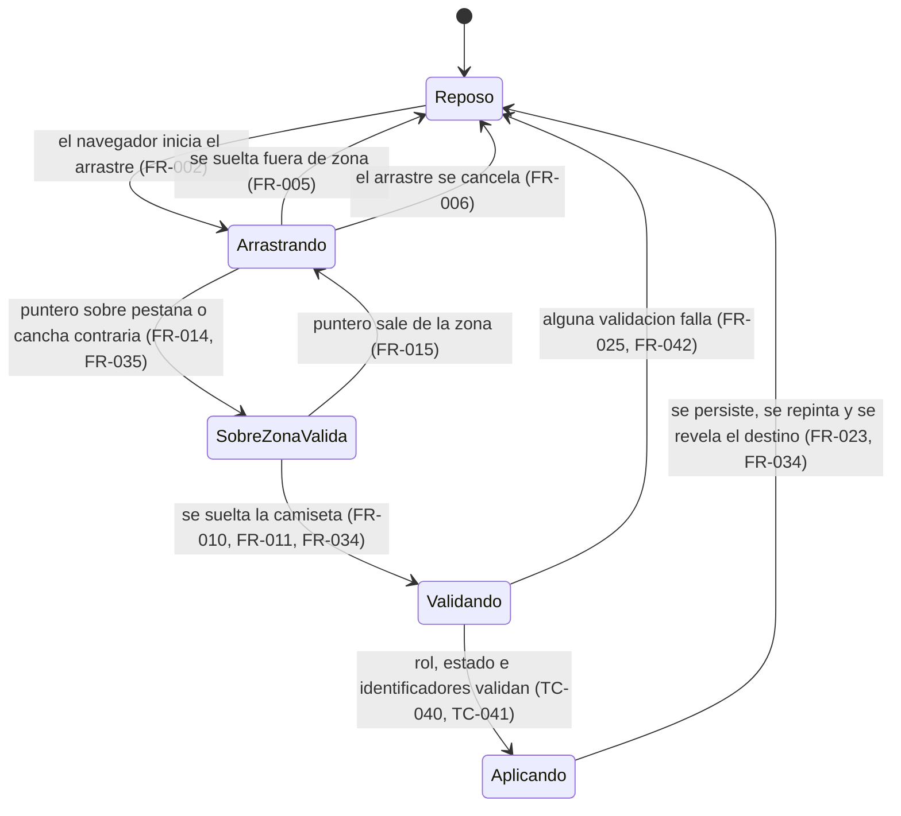

# El arrastre (rebanada 2 de "Equipos en el campo") — Spec

> **Status:** Draft · **Date:** 2026-08-31 · **Owner:** Lucas Manoukian
>
> **Reviewers:** *pending*
>
> **Concept note:** [EQUIPOS_EN_EL_CAMPO_CONCEPT.md](../EQUIPOS_EN_EL_CAMPO_CONCEPT.md)
>
> **Spec de la rebanada anterior:** [rebanada-1-cancha/CANCHA_SPEC.md](../rebanada-1-cancha/CANCHA_SPEC.md)
>
> **Implementation plan:** [ARRASTRE_IMPLEMENTATION_PLAN.md](./ARRASTRE_IMPLEMENTATION_PLAN.md)

> **Grounding evidence (`MD-25`).** Esta Spec se apoya en el ledger §6.5
> *Sources & Origins* del Concept Note y en la Spec de la rebanada 1, que ya
> fijó la cancha sobre la que esta rebanada construye. Donde un `FR-*` /
> `NFR-*` / `TC-*` se apoya en una ubicación del código, en una medida del
> handoff o en una spec vigente que ninguno de los dos cubre, la cita va **en
> línea** en la sección donde se define el requisito.

> **Declaración de reemplazo (Principio I, enmienda 2.5.0).** Esta Spec
> reemplaza, cada uno en su parte, tres documentos vigentes:
>
> - [`.specify/specs/003-motor-generacion-equipos/spec.md`](../../../.specify/specs/003-motor-generacion-equipos/spec.md),
>   `FR-014` y el escenario 4 de su User Story 4 — queda reemplazado **de qué se
>   arrastra y sobre qué se suelta**: mover un jugador deja de ser el arrastre de
>   una fila de lista sobre el panel del otro equipo, y pasa a ser el arrastre de
>   una camiseta sobre la cancha o sobre la pestaña del otro equipo. **No** se
>   reemplaza ninguna de sus reglas: que se pueda mover jugadores a mano después
>   de generar, que el requisito no distinga plataforma, y que el bloqueo fije el
>   equipo frente a una regeneración siguen siendo suyas, y esta Spec las
>   conserva en `FR-020` a `FR-026`.
> - [`.specify/specs/008-duplas-rotacion/spec.md`](../../../.specify/specs/008-duplas-rotacion/spec.md)
>   — ya reemplazada por la rebanada 1 en su fila de dupla. Esta Spec **no
>   amplía** ese reemplazo: su regla de que arrastrar a un integrante de una
>   dupla mueve al otro con él sigue vigente y se conserva en `FR-016`.
> - [`rebanada-1-cancha/CANCHA_SPEC.md`](../rebanada-1-cancha/CANCHA_SPEC.md),
>   `FR-054` y el último *Then* de su escenario `S-06` — queda reemplazada **la
>   forma de mostrar los dos equipos en una sola columna**: dejan de apilarse
>   verticalmente y pasan a mostrarse de a uno, con el selector segmentado de
>   equipo (`FR-030` a `FR-037`). Es una enmienda dentro de la misma feature, una
>   rebanada después, y la razón está en la decisión 4 de §3.4. El resto de
>   aquella Spec queda intacto.
>
> La anotación recíproca en cada documento reemplazado queda pendiente; ver
> `OPEN-Q-04`.

## 1. Purpose

Esta Spec define **cómo se mueve un jugador de un equipo a otro arrastrando su
camiseta**: qué se puede arrastrar, dónde se puede soltar, qué cambia en el
partido cuando se suelta, y cómo se ven los dos equipos en una pantalla angosta
para que soltar en el otro equipo sea posible sin salir de la vista. Es la
segunda de las siete rebanadas de `D-08`.

No cubre *por qué* se hace el rediseño (eso está en el Concept Note) ni *cómo* se
escribe el código (eso queda para el Implementation Plan). Tampoco cubre las
otras cinco rebanadas pendientes: el panel de armado rediseñado (3), el partido
finalizado (4), el modelo de eventos (5), la carga por toque (6) ni las opciones
de configuración (7).

## 2. Summary

La rebanada 1 reemplazó la lista de jugadores por una cancha dibujada, y al
hacerlo se llevó puesta la única forma que había de corregir un reparto a mano:
arrastrar una fila al otro equipo. Esta rebanada la repone sobre la cancha, y
resuelve el problema que aparece al hacerlo en un teléfono.

Aquella rebanada dejó las dos canchas apiladas una debajo de la otra. Sobre una
pantalla angosta eso vuelve el gesto impracticable: el equipo de destino queda
entero fuera de pantalla, así que arrastrar hasta él exige un desplazamiento que
el navegador maneja a su manera y que no hay forma de comprobar. Esta rebanada lo
elimina en vez de sortearlo: en una sola columna los dos equipos se muestran **de
a uno**, con dos pestañas arriba, y **la pestaña del otro equipo es la zona donde
se suelta**. El destino siempre está a la vista, arriba, fijo.

En pantalla ancha, donde las dos canchas entran lado a lado, no hay pestañas y se
puede además soltar una camiseta sobre otra para intercambiar a los dos jugadores
de una sola vez. Lo que el gesto cambia es exactamente lo que cambiaba antes: a
qué equipo pertenece cada jugador y el total de puntaje de cada equipo. No cambia
la posición asignada de nadie.

## 3. Scope

### 3.1 In scope

- El arrastre de una camiseta de la cancha que la rebanada 1 dibujó.
- El selector segmentado de equipo en una sola columna, con una cancha por vez, y
  la enmienda que eso supone sobre el `FR-054` de la rebanada 1.
- Las zonas donde se puede soltar: la pestaña del otro equipo (una columna), la
  cancha del otro equipo y una camiseta del otro equipo (dos columnas).
- El realce visual de la zona válida bajo el puntero mientras se arrastra.
- El efecto persistido del movimiento: cambio de equipo, recálculo de totales y
  guardado, con las reglas que ya existen.
- El intercambio de dos unidades, que es la única capacidad nueva de esta
  rebanada respecto de lo que la aplicación hacía antes.
- La dupla de rotación viajando como una sola unidad.
- El retiro del arrastre de la fila de lista, que la rebanada 1 dejó sin alcance.
- Los escenarios nuevos de `tests/layout.test.js`, y la corrección de los de la
  rebanada 1 que afirmaban que las dos canchas se apilan.

### 3.2 Out of scope / non-goals

Los cinco no-objetivos del Concept Note §16 se heredan enteros. Además, y como
límites propios de esta rebanada:

- El sistema **no** permitirá mover una camiseta dentro de su propio equipo: ni a
  otra línea, ni intercambiándola con otra camiseta del mismo equipo. Es
  consecuencia directa de `TC-012`: la línea de una camiseta se deriva de la
  posición asignada, y esta rebanada no la escribe. Soltar dentro del propio
  equipo es un gesto sin efecto, no un error (`FR-013`).
- El sistema **no** implementará la tercera zona de drop del handoff —soltar
  sobre una línea— por la misma razón: sin escribir la posición asignada, soltar
  sobre una línea no puede tener efecto.
- El sistema **no** ofrecerá el intercambio de dos jugadores en una sola columna.
  Es consecuencia directa del selector: con un equipo por vez no hay ninguna
  camiseta del otro equipo en pantalla sobre la cual soltar. En una columna el
  gesto disponible es uno solo —soltar sobre la pestaña del otro equipo, que
  mueve— y el intercambio queda como capacidad de pantalla ancha. Ver `R-02`.
- El sistema **no** cambiará de pestaña al pasar el puntero por encima durante un
  arrastre. El handoff cambia de pestaña **al soltar**, no al sobrevolar; un
  cambio por sobrevuelo sería invención por fuera del handoff y la única razón
  para construirlo sería habilitar el intercambio en angosto, que el punto
  anterior ya declara fuera de alcance.
- El sistema **no** mostrará el selector cuando la tarjeta esté en dos columnas:
  ahí las dos canchas se ven a la vez y el selector no tendría nada que resolver.
- El sistema **no** modificará el encabezado de la tarjeta de equipos, el combo
  de estrategia, el aviso de equipos desactualizados, los resúmenes de
  diferencia, el bloque "Por qué quedaron así" ni la botonera (rebanada 3). El
  selector se agrega **encima** de las canchas, sin tocar nada de eso.
- El sistema **no** modificará el dibujo de la cancha, de la camiseta, del
  candado ni de la píldora de puntaje: la rebanada 1 los fijó y esta los usa
  como están.
- El sistema **no** tocará el arrastre de la lista de convocatoria
  ([`index.html:4683`](../../../index.html#L4683)) ni el del listado de plantel
  ([`index.html:1773`](../../../index.html#L1773)), que son mecanismos distintos
  sobre pantallas distintas.
- El sistema **no** agregará ni modificará ningún campo persistido en Firestore.
  El equipo visible en el selector es estado de pantalla, no dato del partido.

### 3.3 Constraints inherited from the Concept Note

- **D-01** (el motor queda fuera de alcance) — heredada. Un movimiento manual no
  vuelve a llamar al motor ni altera ninguna regla de reparto.
- **D-02** (se recrea en DOM + CSS vanilla dentro de `index.html`; no se importa
  el runtime del prototipo) — heredada; se encoda como `TC-001`.
- **D-08** (siete rebanadas, en orden) — heredada; fija el alcance de §3.1 y §3.2.
- **D-11** (dos ramas por rebanada: `docs/<rebanada>` antes que
  `feature/<rebanada>`) — heredada; el Implementation Plan la ejecuta.
- **D-12** (una sola forma de pintar un equipo, sin convivencia) — heredada y
  extendida al gesto: una sola forma de mover un jugador. Es lo que fundamenta
  `TC-013` y `FR-050`.
- **D-17** (el documento no cita cláusulas normativas de accesibilidad; las
  obligaciones se enuncian en términos directamente comprobables) — heredada. Es
  la razón de que `NFR-003` hable de nombres accesibles no vacíos y `NFR-002` de
  un piso medible en píxeles.

### 3.4 Decisiones tomadas en esta Spec

El Concept Note fija que el armado es "la cancha con camisetas arrastrables"
(§8.1) pero no fija el mecanismo del arrastre ni su alcance. Las cuatro
decisiones siguientes se resolvieron con el propietario el 2026-08-31, antes de
escribir esta Spec, y se registran acá porque ninguna existe aguas arriba. Las
cuatro se recomiendan además como filas `D-*` nuevas de la §10 del Concept Note
(ver §17).

| # | Decisión | Fundamento | Encoda en |
|---|---|---|---|
| 1 | El arrastre se repone con el mismo mecanismo que la aplicación ya usa (la API nativa de arrastre del navegador), movido de la fila a la camiseta | Principio II: es la solución más simple que cumple. El mecanismo está verificado a mano en producción sobre iOS y sobre Chrome en Android (ver el aviso de premisa corregida más abajo), así que reemplazarlo por uno propio sería cambiar algo probado por algo por probar | `TC-003`, `FR-001` |
| 2 | El alcance se acota a los movimientos **entre equipos** | Se prefirió una rebanada chica. Mover dentro del propio equipo exige escribir la posición asignada, y eso arrastra el recálculo de los resúmenes de diferencia por línea, que la rebanada 3 rediseña de todos modos | `TC-012`, `FR-010` a `FR-013`, §3.2 |
| 3 | El movimiento no escribe la posición asignada | Conserva la regla vigente: mover a un jugador sólo lo cambia de equipo ([`index.html:4008-4020`](../../../index.html#L4008-L4020)). Ninguna spec vigente cambia de sentido por esta rebanada | `TC-012`, `FR-022` |
| 4 | En una sola columna los equipos se muestran de a uno con el selector segmentado, y la pestaña del otro equipo recibe el drop. Reemplaza el apilado que fijó la rebanada 1 | Con las canchas apiladas el destino de todo movimiento queda fuera de pantalla en un teléfono, y alcanzarlo depende de cómo cada navegador desplace durante un arrastre nativo — algo que **no se puede verificar en este entorno, porque no hay un teléfono con el cual probarlo**. La decisión elimina la incógnita en vez de apostar a que se resuelva sola: con el selector, el destino está siempre a la vista y fijo. Es además lo que el handoff diseña para el compacto en su vista `6a` | `TC-015`, `FR-030` a `FR-037`, cierre de `OPEN-Q-01` |

> **Premisa corregida (2026-08-31).** Un borrador anterior de esta Spec sostuvo
> que el arrastre nativo "no funciona con el dedo" y que por lo tanto mover
> jugadores a mano nunca había funcionado en el celular. **Es falso.** La spec
> del motor lo verificó y lo dejó escrito:
>
> > *"La edición manual de equipos por drag & drop funciona también en
> > dispositivos móviles: se verificó a mano en producción sobre iOS y sobre
> > Chrome en Android (2026-08-27). Está implementada con la API HTML5 de
> > arrastre (`draggable` + `dataTransfer`), sin ningún handler de `pointer` ni
> > de `touch`, y aun así los dos navegadores la disparan desde el gesto de
> > arrastre del sistema. Este spec afirmaba lo contrario hasta esa
> > verificación."*
> > — [`.specify/specs/003-motor-generacion-equipos/spec.md`](../../../.specify/specs/003-motor-generacion-equipos/spec.md) § Assumptions
>
> El error vino de inferir la capacidad desde la ausencia de código táctil en
> `index.html`, que es exactamente la inferencia que esa spec ya había hecho y
> corregido. La lección, hermana de la que la rebanada 1 dejó sobre el handoff
> ("los números del handoff son buenos, los nombres de símbolo no"): **la
> ausencia de código no prueba la ausencia de comportamiento; lo que prueba el
> comportamiento es haberlo mirado.** De ahí también la decisión 4: donde no hay
> con qué mirar, el diseño no debe depender de lo que no se miró.

## 4. Technical & architectural constraints

### 4.1 Platform / stack constraints

- **TC-001** — El arrastre y el selector se implementarán como DOM + CSS +
  JavaScript vanilla dentro de `index.html`, con los mismos patrones que ya usa
  la aplicación. No se incorporará el runtime del prototipo del handoff
  (`support.js`), ni un motor de plantillas, ni un framework (`D-02`;
  Principio II).
- **TC-002** — No se agregará ninguna dependencia nueva: ni paquete, ni CDN, ni
  paso de build. En particular **no se incorporará ninguna biblioteca de
  arrastre**, que es la tentación previsible de esta rebanada.
- **TC-003** — El arrastre reutilizará la API nativa del navegador (`draggable`,
  `dragstart`, `dragover`, `drop`) que la aplicación ya usa en sus otras tres
  pantallas arrastrables — plantel
  ([`index.html:1773`](../../../index.html#L1773)), convocatoria
  ([`index.html:4683`](../../../index.html#L4683)) y equipos
  ([`index.html:3751`](../../../index.html#L3751)) — y no construirá un
  mecanismo paralelo basado en eventos de puntero. Es una restricción de alcance
  y no una preferencia técnica: el mecanismo nativo está verificado a mano en
  producción sobre los dos navegadores móviles del grupo, y el Principio II
  descarta reemplazar algo probado por algo por probar.

### 4.2 Architectural / integration constraints

- **TC-010** — El movimiento reutilizará la ruta de escritura que ya existe
  (`moverUnJugadorDeEquipo` y `window.__moverJugadorManual`,
  [`index.html:4008-4032`](../../../index.html#L4008-L4032)) en vez de introducir
  una segunda forma de mover un jugador de equipo. Lo que cambia es de qué
  elemento cuelga el gesto y qué zonas lo reciben; el efecto no (Principio II,
  `D-12`).
- **TC-011** — El arrastre no recalculará ningún puntaje ni resolverá ninguna
  posición por su cuenta: consume las funciones que el panel ya usa
  (`puntajeEnPosicion`, `posicionAsignadaDe`, `getDuplaPartner`). No se
  introducirá ningún cálculo propio de la vista (Principio IV).
- **TC-012** — El arrastre **no escribirá `m.equipos.posicionAsignada`**, ni
  ningún campo que hoy no se escriba al mover un jugador. Los únicos campos que
  el gesto puede modificar son `m.equipos.blanco`, `m.equipos.negro`,
  `m.equipos.sumaBlanco` y `m.equipos.sumaNegro`, que son exactamente los que
  `moverUnJugadorDeEquipo` ya toca (decisión 3 de §3.4).
- **TC-013** — El arrastre de la fila de equipo se **retirará**, no se dejará
  conviviendo. Hoy es código sin alcance: `renderTeamPlayerRow` marca la fila
  como arrastrable sólo cuando `esFilaEditable(m)` es verdadero
  ([`index.html:3751`](../../../index.html#L3751)), y ese predicado es verdadero
  exactamente en el estado donde `mostrarCanchaDeEquipos(m)` reemplazó la lista
  por la cancha ([`index.html:3724-3730`](../../../index.html#L3724-L3730)), de
  modo que desde el merge de la rebanada 1 no queda ninguna fila arrastrable en
  ninguna pantalla. Dejarlo sería mantener dos puntos de origen para un solo
  gesto, uno de ellos inalcanzable (`D-12`, Principio II).
- **TC-014** — La zona de drop de equipo dejará de ser el panel entero
  (`.team-panel`, [`index.html:4345-4346`](../../../index.html#L4345-L4346)) y
  pasará a ser la cancha y, en una sola columna, la pestaña. El panel incluye el
  encabezado con el total del equipo y el espacio en blanco de alrededor;
  aceptar el drop ahí haría que el realce prometido por `FR-014` no coincida con
  la zona que efectivamente recibe.
- **TC-015** — El selector aparecerá exactamente cuando la tarjeta de equipos
  esté en una sola columna, con el **mismo punto de corte** que `.teams-wrap` ya
  usa hoy (`max-width: 900px`,
  [`index.html:452-454`](../../../index.html#L452-L454)). No se introducirá un
  segundo punto de corte para lo mismo: dos umbrales distintos para "una columna"
  y "hay pestañas" abren una franja donde la interfaz queda incoherente.
  `TC-013` de la Spec de la rebanada 1 —que prohíbe elegir el **escalón de
  medidas** de la camiseta por ancho de ventana— sigue vigente y no se toca: esta
  restricción es sobre el **modo de layout**, que la aplicación ya decide por
  viewport.

### 4.3 Compliance / regulatory constraints

- **TC-020** — No aplica ninguna obligación regulatoria de datos: la rebanada no
  introduce ningún dato nuevo, no cambia dónde se guarda nada y no expone
  información a ningún destinatario nuevo (Concept Note §5.2).

### 4.4 Conventions to follow

- **TC-030** — Todo color, radio, sombra y espaciado del selector y del realce de
  zona saldrá de los tokens del design system de Football App
  ([`.claude/skills/football-app-design/`](../../../.claude/skills/football-app-design/)),
  en el orden que fija el Principio VI: token existente → combinación de tokens →
  excepción documentada.
- **TC-031** — Las excepciones a `TC-030` se documentarán explícitamente en el
  Implementation Plan, con su justificación. A la fecha se conocen dos dentro de
  esta rebanada: los `inset` literales del realce (`-3px 6px` para la línea,
  `-4px -3px` para la camiseta, `-2px` para la pestaña) y los radios de 12 / 15
  px, que no corresponden a ningún token
  ([`handoff/README.md` § Arrastre](../handoff/README.md)).
- **TC-032** — El efecto del gesto y el selector se agregarán como escenarios de
  `tests/layout.test.js`, y al menos uno **debe verse fallar** antes de darse por
  bueno, revirtiendo el cambio que lo motiva (Principio V, "Criterio de
  verificación").
- **TC-033** — La geometría y el color del selector y del realce de las zonas de
  drop se tomarán literalmente de [`handoff/README.md`](../handoff/README.md)
  § Selector segmentado (equipo) y § Arrastre, tabla *Feedback de drag-over*, en
  su variante de la vista `6a` (la compacta). Ningún valor se redondea "a ojo".
- **TC-034** — El realce de zona no capturará el puntero: se dibuja por encima
  con `pointer-events: none`, como fija el handoff. Es lo que evita que el propio
  realce se coma el evento que lo mantiene vivo.
- **TC-035** — El equipo visible del selector será estado de pantalla y no se
  persistirá en el documento de partido (`NFR-005`).

### 4.5 Security constraints (`MD-31`)

El Concept Note §5.2 declara la postura: ninguna entrada no confiable, escritura
sólo de administradores autenticados, SPA estática sin servidor propio. Sobre esa
base, las categorías aplicables del CWE Top 25 se acotan a control de acceso y
validación de entrada del lado cliente, que es exactamente el par que la §5.2
anticipa.

`[UNVERIFIED — offline; no se consultó https://cwe.mitre.org/top25/ en esta
sesión. Las categorías se nombran por su identificador y su título, que son
estables, pero el ranking vigente a la fecha no se verificó.]`

- **TC-040** — El movimiento sólo se ejecutará cuando el rol de la sesión sea
  `admin`, la inscripción del partido no esté cerrada y el partido no esté
  finalizado. La comprobación se hará **también en el manejador que recibe el
  drop**, tanto el de la cancha como el de la pestaña, y no sólo al decidir qué
  camisetas se marcan como arrastrables, replicando la guarda que
  `__moverJugadorManual` ya tiene
  ([`index.html:4024`](../../../index.html#L4024)). **Defiende `CWE-862` *Missing
  Authorization*** y **`CWE-863` *Incorrect Authorization***: una vista que sólo
  deja de marcar la camiseta como arrastrable deja la acción alcanzable desde la
  consola.
- **TC-041** — El identificador que llega en el `dataTransfer` y el de la unidad
  de destino se validarán contra el reparto del partido antes de aplicar nada: si
  cualquiera de los dos no pertenece a `m.equipos.blanco` ni a `m.equipos.negro`,
  el movimiento se descarta sin escribir. **Defiende `CWE-20` *Improper Input
  Validation***. No es una precaución teórica: el `dataTransfer` es un canal que
  otra aplicación, otra pestaña o el propio sistema pueden llenar con texto
  arbitrario, y el manejador actual lo consume sin validar más allá de que no
  esté vacío ([`index.html:4004-4005`](../../../index.html#L4004-L4005)). Es
  además la obligación que el Concept Note §5.2 nombra como "validación de
  entrada del lado cliente".
- **TC-042** — Todo texto proveniente de un jugador que el arrastre introduzca en
  el DOM se insertará escapado, tanto en contenido como en atributos.
  **Defiende `CWE-79` *Cross-Site Scripting***. Es la misma obligación que
  `TC-041` de la Spec de la rebanada 1; se restatea porque el `title` que anuncia
  el gesto sobre la camiseta es un atributo nuevo, y la aplicación ya tiene la
  función de escapado (`escaparHtml`).
- **CWE-89 *SQL Injection***, **CWE-78 *OS Command Injection***, **CWE-22 *Path
  Traversal***, **CWE-502 *Deserialization***, **CWE-918 *SSRF*** — no aplican;
  la §5.2 del Concept Note descarta servidor propio, parsing de entrada externa y
  acceso a filesystem.
- **CWE-352 *CSRF*** — no aplica: no hay endpoints propios; la escritura va por
  el SDK de Firestore con el token de la sesión.

## 5. Users & use cases

### 5.1 Personas / actors

| Actor | Description | Primary need |
|---|---|---|
| Administrador | Miembro del grupo con rol `admin`. Arma los partidos desde el celular. | Corregir a mano un reparto que casi le gusta, sin tener que regenerarlo entero y perder lo que sí estaba bien. |
| Jugador | Miembro del grupo con rol `jugador`. Sólo consulta. | Ver en qué equipo y en qué puesto le tocó jugar, y poder mirar el otro equipo, sin gestos que no le corresponden. |

### 5.2 User stories

| ID | Story | Implements |
|---|---|---|
| US-01 | Como administrador, quiero arrastrar una camiseta a la pestaña del otro equipo desde el celular para corregir un reparto sin regenerarlo entero. | FR-001, FR-034, FR-020 |
| US-02 | Como administrador en pantalla ancha, quiero soltar una camiseta sobre otra del equipo contrario para intercambiar a los dos de una sola vez, en vez de hacer dos movimientos que dejan los equipos desparejos en el medio. | FR-011, FR-024 |
| US-03 | Como administrador, quiero ver qué zona va a recibir la camiseta antes de soltarla, para no equivocarme de destino. | FR-014, FR-015, FR-035 |
| US-04 | Como administrador, quiero poder soltar en cualquier lado sin miedo: si el lugar no es válido, que no pase nada. | FR-005, FR-013 |
| US-05 | Como administrador en el celular, quiero que el destino del movimiento esté siempre a la vista, sin tener que arrastrar a ciegas por media pantalla. | FR-030, FR-034 |
| US-06 | Como jugador en el celular, quiero ver mi equipo completo sin que la mitad de la pantalla se la lleve el otro, y poder mirar el otro con un toque. | FR-030, FR-032, FR-041 |

## 6. Glossary

Los términos que la rebanada 1 ya definió —cancha, camiseta, unidad de armado,
dupla de rotación, línea, sub-fila, posición asignada, panel de equipo, nombre
corto— se usan acá con el mismo significado y no se redefinen. Los propios de
esta rebanada:

| Term | Definition |
|---|---|
| Arrastre | El gesto completo que el navegador expone: tomar una camiseta, moverla y soltarla. El navegador lo dispara desde el mouse en escritorio y desde el gesto de arrastre del sistema en un dispositivo táctil. |
| Selector de equipo | El control de dos pestañas —Blanco y Negro— que aparece cuando la tarjeta está en una sola columna, y que decide cuál de las dos canchas se muestra. En el handoff se lo llama "selector segmentado". |
| Pestaña | Cada una de las dos mitades del selector. La del equipo que no se está viendo es, además, zona de drop. |
| Equipo visible | El equipo cuya cancha se está mostrando en una sola columna. Es estado de pantalla: no se guarda con el partido. |
| Una columna | El modo de layout en que la tarjeta de equipos apila sus dos paneles, que la aplicación ya aplica hoy en `max-width: 900px`. Es el modo en que aparece el selector y se ve una cancha por vez. |
| Dos columnas | El modo de layout en que los dos paneles van lado a lado. Es el modo en que se ven las dos canchas a la vez, no hay selector, y existe el intercambio. |
| Zona de drop | Una región que, si la camiseta se suelta sobre ella, produce un movimiento. En una columna hay una: la pestaña del otro equipo. En dos columnas hay dos: la cancha del otro equipo y una camiseta del otro equipo. |
| Realce | El recuadro que se dibuja sobre la zona de drop bajo el puntero mientras se arrastra, para anunciar qué va a recibir la camiseta. |
| Movimiento | El efecto persistido de una camiseta soltada sobre una zona válida: una o dos unidades cambian de equipo, los totales se recalculan y el partido se guarda. |
| Intercambio | El movimiento que produce soltar sobre una camiseta del otro equipo: las dos unidades cambian de equipo a la vez. Sólo existe en dos columnas. |

## 7. Functional requirements

### 7.1 Qué se puede arrastrar

- **FR-001** — Donde el rol de la sesión sea `admin`, la inscripción del partido
  no esté cerrada y el partido no esté finalizado, el sistema marcará cada
  camiseta de la cancha como arrastrable — el mismo predicado que ya gobierna el
  candado ([`index.html:3731-3740`](../../../index.html#L3731-L3740)).
- **FR-002** — Cuando se inicie el arrastre de una camiseta, el sistema
  registrará qué unidad de armado se está moviendo.
- **FR-003** — El sistema anunciará el gesto en el `title` de la camiseta
  arrastrable, sin desplazar la información que ese atributo ya lleva por
  `FR-023` y `FR-023b` de [`CANCHA_SPEC.md`](../rebanada-1-cancha/CANCHA_SPEC.md) — que **no** son los de esta Spec, cuyos números coinciden por casualidad.
- **FR-004** — Mientras un arrastre esté en curso, el sistema no modificará el
  partido: el efecto ocurre al soltar y no antes.
- **FR-005** — Cuando la camiseta se suelte fuera de toda zona de drop válida, el
  sistema terminará el arrastre sin modificar el partido.
- **FR-006** — Si el arrastre se cancela antes de soltarse, entonces el sistema
  terminará sin modificar el partido.
- **FR-007** — Cuando el administrador active el candado de una camiseta, el
  sistema alternará el bloqueo de esa unidad: el candado sigue comportándose como
  en la rebanada 1 (`FR-031` de
  [`CANCHA_SPEC.md`](../rebanada-1-cancha/CANCHA_SPEC.md), que **no** es el `FR-031`
  de esta Spec: los números coinciden por casualidad).
- **FR-007b** — Si el administrador activa el candado de una camiseta, entonces el
  sistema no iniciará ningún arrastre de esa camiseta.
- **FR-008** — Cuando un arrastre termine, por la razón que sea, el sistema
  retirará todo realce de zona.

### 7.2 Las zonas donde soltar

- **FR-010** — Mientras la tarjeta esté en dos columnas, cuando la camiseta se
  suelte sobre la cancha del equipo contrario, y no sobre ninguna de sus
  camisetas, el sistema pasará esa unidad de armado al equipo contrario.
- **FR-011** — Mientras la tarjeta esté en dos columnas, cuando la camiseta se
  suelte sobre una camiseta del equipo contrario, el sistema intercambiará las
  dos unidades de armado: la arrastrada pasa al equipo contrario y la de destino
  al equipo de origen.
- **FR-012** — Mientras el puntero esté sobre una camiseta del equipo contrario,
  el sistema resolverá la zona como camiseta y no como cancha: la camiseta tiene
  precedencia sobre el campo que la contiene.
- **FR-013** — Cuando la camiseta se suelte sobre la cancha de su propio equipo,
  sobre otra camiseta de su propio equipo, o sobre la pestaña de su propio
  equipo, el sistema terminará el arrastre sin modificar el partido.
- **FR-014** — Mientras el puntero esté sobre una zona de drop válida, el sistema
  realzará esa zona con la geometría que fija `TC-033`.
- **FR-015** — Mientras el puntero esté sobre el propio equipo de la camiseta
  arrastrada, o fuera de toda zona de drop, el sistema no realzará nada.
- **FR-016** — El sistema arrastrará la dupla de rotación como una sola unidad:
  el gesto sobre su camiseta mueve a sus dos integrantes juntos, al mismo equipo,
  con la regla que ya aplica `__moverJugadorManual`
  ([`index.html:4028-4029`](../../../index.html#L4028-L4029)) y que
  [`008-duplas-rotacion`](../../../.specify/specs/008-duplas-rotacion/spec.md)
  fija.
- **FR-017** — Cuando el destino de un intercambio sea la camiseta de una dupla
  de rotación, el sistema intercambiará las dos unidades completas: los dos
  integrantes de la dupla viajan juntos.

### 7.3 El efecto del movimiento

- **FR-020** — Cuando el sistema aplique un movimiento, quitará la unidad de
  armado de la lista de su equipo de origen y la agregará a la del equipo de
  destino.
- **FR-021** — Cuando el sistema aplique un movimiento, recalculará el total de
  puntaje de los dos equipos con el mismo criterio que ya usa
  `moverUnJugadorDeEquipo`: el puntaje de la unidad en su posición asignada, o su
  promedio general si no tiene posición asignada
  ([`index.html:4008-4020`](../../../index.html#L4008-L4020)).
- **FR-022** — El sistema no modificará la posición asignada de ninguna unidad al
  aplicar un movimiento (`TC-012`).
- **FR-023** — Cuando el sistema aplique un movimiento, persistirá el partido y
  volverá a pintar la tarjeta de equipos, con el mismo camino que hoy.
- **FR-024** — Cuando el sistema aplique un intercambio, dejará a cada equipo con
  la misma cantidad de unidades de armado que tenía antes del gesto.
- **FR-025** — Si el identificador de la unidad arrastrada o el de la unidad de
  destino no pertenece al reparto del partido, entonces el sistema descartará el
  movimiento sin escribir nada (`TC-041`).
- **FR-026** — El sistema permitirá arrastrar una unidad fijada con el candado, y
  tras el movimiento esa unidad quedará fijada en su equipo nuevo. El candado fija
  el equipo frente a una regeneración, no frente a una edición manual; es la
  regla que la aplicación ya tiene, porque `__moverJugadorManual` no consulta
  `m.bloqueados` ([`index.html:4022-4032`](../../../index.html#L4022-L4032)).

### 7.4 El selector de equipo

- **FR-030** — Mientras la tarjeta de equipos esté en una sola columna, el
  sistema mostrará un selector de dos pestañas —Equipo Blanco y Equipo Negro— por
  encima de las canchas.
- **FR-030b** — Mientras la tarjeta de equipos esté en una sola columna, el
  sistema mostrará la cancha de un solo equipo: la del equipo visible.
- **FR-031** — Mientras la tarjeta de equipos esté en dos columnas, el sistema
  mostrará las dos canchas a la vez.
- **FR-031b** — Mientras la tarjeta de equipos esté en dos columnas, el sistema no
  mostrará el selector.
- **FR-032** — Cuando se active una pestaña, el sistema mostrará la cancha de ese
  equipo.
- **FR-032b** — Cuando se active una pestaña, el sistema marcará esa pestaña como
  la activa.
- **FR-033** — Cuando el administrador o el jugador abra el detalle de un partido
  con el selector en pantalla, el sistema mostrará el Equipo Blanco como equipo
  visible.
- **FR-034** — Cuando una camiseta se suelte sobre la pestaña del equipo
  contrario, el sistema pasará esa unidad de armado a ese equipo **y** cambiará
  el equipo visible a ese equipo, de modo que el resultado del movimiento quede a
  la vista ([`handoff/README.md` § 6a](../handoff/README.md)).
- **FR-035** — Mientras el puntero esté sobre la pestaña del equipo contrario
  durante un arrastre, el sistema realzará esa pestaña con la geometría que fija
  `TC-033`.
- **FR-036** — El sistema no cambiará el equipo visible por el solo hecho de que
  el puntero pase por encima de una pestaña durante un arrastre: el cambio ocurre
  al soltar.
- **FR-037** — El sistema dará a cada pestaña un nombre accesible que identifique
  al equipo y su estado de seleccionada.
- **FR-038** — Donde el rol de la sesión sea `jugador`, el sistema mostrará el
  selector y permitirá cambiar de equipo visible.
- **FR-038b** — Donde el rol de la sesión sea `jugador`, el sistema no expondrá
  ninguna pestaña como zona de drop.

### 7.5 Estados y roles

- **FR-040** — Mientras la inscripción del partido esté cerrada, el partido esté
  finalizado, o se esté editando el resultado de un partido finalizado, el sistema
  no mostrará ningún selector ni ofrecerá ningún arrastre: esas tres pantallas
  siguen mostrando la lista de filas, exactamente como quedaron tras la rebanada
  1 (`FR-042` de la Spec de la rebanada 1).
- **FR-041** — Donde el rol de la sesión sea `jugador`, el sistema no marcará
  ninguna camiseta como arrastrable.
- **FR-041b** — Donde el rol de la sesión sea `jugador`, el sistema no expondrá
  ninguna zona de drop.
- **FR-042** — Si el rol de la sesión no es `admin`, entonces el sistema no
  aplicará ningún movimiento aunque se lo invoque directamente, y no modificará
  el partido (`TC-040`).
- **FR-043** — El sistema actualizará el subtítulo de la tarjeta para que nombre
  el gesto que la pantalla efectivamente ofrece. Hoy dice "arrastrá un jugador a
  otro equipo, o usá el candado para bloquearlo"
  ([`index.html:4351`](../../../index.html#L4351)), lo que en una sola columna ya
  no describe dónde soltar.
- **FR-044** — El sistema no modificará ningún otro elemento de la tarjeta de
  equipos ni de la cancha respecto de como quedaron tras la rebanada 1.

### 7.6 Retiro del punto de origen anterior

- **FR-050** — El sistema dejará de marcar como arrastrable la fila de la lista
  de equipo, que quedó sin alcance al reemplazarse la lista por la cancha
  (`TC-013`).
- **FR-051** — El sistema dejará de exponer el panel de equipo entero como zona
  de drop, que pasa a ser la cancha y la pestaña (`TC-014`).
- **FR-052** — El sistema conservará sin cambios el arrastre de la lista de
  convocatoria y el del listado de plantel, que son mecanismos distintos sobre
  pantallas distintas y no entran en esta rebanada.

## 8. Non-functional requirements

> **Qué cuenta como "objetivo cuantificado".** `AC-51` y `AC-54` obligan a un test
> de medición y a una señal de observabilidad por cada NFR con objetivo
> cuantificado, y los gates `T-N.D9` y `T-N.D16` del Implementation Plan los
> verifican por `grep`. Para que esos gates tengan una lista cerrada y no una
> interpretación, esta Spec la fija acá: **cuentan `NFR-001`, `NFR-002`, `NFR-004`,
> `NFR-005` y `NFR-007`** — los cinco cuyo cumplimiento se decide comparando contra
> un valor fijo (una lista de anchos, un piso en píxeles, un techo en
> milisegundos, un conjunto exacto de campos, un conteo de escrituras igual a
> cero). **No cuentan `NFR-003`, `NFR-006` ni `NFR-008`**, cuyo cumplimiento se
> establece por revisión y no por medición; su evidencia son `AC-12`, `AC-15` y
> `AC-17` respectivamente. Un objetivo no deja de ser cuantificado por expresarse
> como un conjunto en vez de como un número: lo que lo define es que la
> comprobación sea una comparación y no un juicio.

| ID | Category | Requirement |
|---|---|---|
| NFR-001 | Responsive / layout | En cada uno de los anchos que mide `tests/layout.test.js` (360, 390, 430, 479, 481, 559, 561, 600, 699, 701, 768, 900, 1200 px), la pantalla de equipos generados sigue cumpliendo las dos condiciones del Principio V: `scrollWidth === clientWidth` y ningún elemento con su borde derecho fuera del viewport. Es un requisito de no-regresión sobre `NFR-001` de la rebanada 1, ahora con el selector en pantalla en los doce anchos de una columna. |
| NFR-002 | Usabilidad | El área interactiva de cada pestaña no es menor a 44×44 px, y la del candado sigue midiendo al menos 24×24 px en todos los anchos medidos. La pestaña es el destino de todo movimiento en una columna, así que su tamaño es funcional y no cosmético; el handoff ya la dibuja con `padding: 10px 0` sobre la mitad del ancho de la tarjeta, que a 360 px supera holgadamente ese piso. El candado es no-regresión sobre `NFR-004` de la rebanada 1. |
| NFR-003 | Accesibilidad | Toda camiseta arrastrable declara el gesto en su `title`, no vacío; cada pestaña tiene un nombre accesible no vacío que identifica al equipo y expone cuál está seleccionada; y el candado conserva el nombre accesible que `NFR-003` de la rebanada 1 le exige. El arrastre no tiene equivalente de teclado; ver `OPEN-Q-02`. |
| NFR-004 | Rendimiento | Aplicar un movimiento —soltar, escribir y repintar— con un plantel de 18 titulares no supera los 150 ms medidos con `performance.now()` en el Chromium que `tests/layout.test.js` ya usa vía Playwright. El techo es el de `NFR-005` de la rebanada 1 (100 ms para el repintado) más el margen del guardado. |
| NFR-005 | Compatibilidad de datos | El conjunto de campos escritos en el documento de partido por un movimiento es exactamente `equipos.blanco`, `equipos.negro`, `equipos.sumaBlanco` y `equipos.sumaNegro`: el mismo que escribía el arrastre de la lista, sin agregados. Cambiar de pestaña no escribe nada. |
| NFR-006 | Mantenibilidad | Todo valor de color, espaciado, radio y sombra usado por el selector y por el realce proviene de un token del design system o de una excepción listada en el Implementation Plan; no queda ningún valor literal sin declarar. |
| NFR-007 | Seguridad | Un `dataTransfer` con contenido que no corresponde a una unidad del reparto no produce ninguna escritura, verificado disparando los dos manejadores de drop —el de la cancha y el de la pestaña— con contenido arbitrario. |
| NFR-008 | Verificabilidad del gesto | Todo requisito de esta Spec es verificable en el entorno disponible: navegador de escritorio y el Chromium que el arnés ya conduce. **Ningún criterio de aceptación depende de tener un teléfono a mano.** Es una restricción del entorno, declarada, y es lo que fundamenta la decisión 4 de §3.4. Lo que queda sin verificar antes del merge está acotado y enunciado en `A-01` y `R-01`. |

## 9. System behaviour & scenarios

> **Nota sobre el alcance de los tests.** El navegador no permite sintetizar de
> forma confiable un arrastre nativo de punta a punta desde un test
> automatizado. Por eso los escenarios de esta sección están escritos sobre lo
> que **sí** es verificable mecánicamente: qué elementos quedan marcados como
> arrastrables, qué zonas aceptan el drop, qué cancha se muestra en cada modo de
> layout, y qué le pasa al reparto cuando el drop se produce. Lo que queda fuera
> —que el navegador dispare el arrastre desde el gesto de un dedo— está acotado
> en `A-01` y apoyado en la verificación en producción del 2026-08-27, y **no**
> se convierte en un criterio de aceptación, porque en este entorno no hay con
> qué ejecutarlo (`NFR-008`). Es una limitación declarada, no un olvido.

### 9.1 Happy path scenarios

#### Scenario S-01 — El administrador pasa un jugador al otro equipo desde el celular (covers FR-001, FR-020, FR-021, FR-023, FR-030, FR-030b, FR-034)

- **Given** un partido de fútbol 8 con la inscripción abierta y los equipos ya generados
- **And** una sesión con rol `admin` en un viewport de 360 px, con el selector en pantalla y el Equipo Blanco visible
- **When** una camiseta del Equipo Blanco se suelta sobre la pestaña del Equipo Negro
- **Then** el sistema pasa a ese jugador al Equipo Negro
- **And** el equipo visible pasa a ser el Equipo Negro
- **And** la camiseta aparece dibujada en esa cancha, en la línea de su posición asignada, que no cambió
- **And** el total de puntaje de los dos equipos se recalcula
- **And** el partido queda guardado

**Variants:**

- `S-01a [boundary]` — el jugador arrastrado es el único de su línea: la línea de origen deja de dibujarse y las restantes se reparten el alto (`FR-012` de la rebanada 1)
- `S-01b [boundary]` — el jugador arrastrado está fijado con el candado: el movimiento se aplica y queda fijado en su equipo nuevo
- `S-01c [boundary]` — el equipo de destino queda con una unidad más que el de origen: se acepta, es lo que la aplicación hace hoy
- `S-01d [failure]` — el drop se produce sobre la pestaña del **propio** equipo: no se modifica nada y el equipo visible no cambia
- `S-01e [failure]` — el arrastre se cancela antes de soltarse: no se modifica nada y no queda ningún realce en el DOM
- `S-01f [property]` — para cualquier movimiento aplicado, la suma de unidades de los dos equipos es la misma antes y después

#### Scenario S-02 — El administrador intercambia dos jugadores en pantalla ancha (covers FR-011, FR-012, FR-024, FR-031, FR-031b)

- **Given** un partido con la inscripción abierta, los equipos generados y una sesión `admin` en un viewport de 1200 px
- **And** la tarjeta en dos columnas, con las dos canchas a la vista y sin selector
- **When** una camiseta del Equipo Blanco se suelta **sobre la camiseta** de un jugador del Equipo Negro
- **Then** el sistema pasa al primero al Equipo Negro y al segundo al Equipo Blanco
- **And** cada equipo conserva la misma cantidad de unidades que tenía antes
- **And** ninguna de las dos posiciones asignadas cambió

**Variants:**

- `S-02a [boundary]` — la camiseta de destino está fijada con el candado: el intercambio se aplica y esa unidad queda fijada en su equipo nuevo
- `S-02b [boundary]` — el drop se produce sobre la cancha del equipo contrario y no sobre una camiseta: es un movimiento simple, no un intercambio (`FR-010`)
- `S-02c [failure]` — el drop se produce sobre una camiseta del **propio** equipo: no se modifica nada
- `S-02d [failure]` — el drop se produce sobre la cancha del propio equipo: no se modifica nada
- `S-02e [property]` — para cualquier intercambio aplicado, la cantidad de unidades de cada equipo es idéntica antes y después

#### Scenario S-03 — Una dupla de rotación viaja entera (covers FR-016, FR-017)

- **Given** un equipo generado que incluye una dupla de rotación
- **When** la camiseta de la dupla se suelta sobre la pestaña del otro equipo
- **Then** el sistema pasa a los **dos** integrantes al otro equipo
- **And** la dupla se sigue dibujando como una sola camiseta con la cápsula de dos nombres

**Variants:**

- `S-03a [boundary]` — en dos columnas, el destino es la camiseta de otra dupla: las cuatro personas cambian de equipo, dos en cada dirección
- `S-03b [boundary]` — en dos columnas, la dupla se intercambia con un jugador individual: los equipos quedan con distinta cantidad de personas pero la misma cantidad de unidades

#### Scenario S-04 — El selector decide qué cancha se ve (covers FR-030, FR-030b, FR-031, FR-031b, FR-032, FR-032b, FR-033, TC-015)

- **Given** un partido con los equipos generados y una sesión `admin`
- **When** el viewport es de 360 px
- **Then** el sistema muestra el selector con dos pestañas
- **And** muestra una sola cancha, la del Equipo Blanco
- **And** al activar la pestaña del Equipo Negro, muestra la cancha del Equipo Negro y ninguna otra

**Variants:**

- `S-04a [boundary]` — a 900 px de viewport, la tarjeta sigue en una columna: hay selector y una sola cancha
- `S-04b [boundary]` — a 901 px de viewport, la tarjeta pasa a dos columnas: no hay selector y se ven las dos canchas
- `S-04c [boundary]` — con rol `jugador` a 360 px, el selector está y permite cambiar de equipo visible
- `S-04d [property]` — en todos los anchos medidos, la cantidad de canchas en el DOM es 1 cuando hay selector y 2 cuando no lo hay

#### Scenario S-05 — El candado sigue siendo el candado (covers FR-007, FR-007b, NFR-002)

- **Given** un partido con la inscripción abierta, equipos generados y una sesión `admin`
- **When** el administrador activa el candado de una camiseta
- **Then** el sistema alterna el bloqueo de esa unidad
- **And** el reparto no cambia
- **And** el rectángulo del candado sigue midiendo al menos 24 px de lado

Variants: none — single-path scenario.

#### Scenario S-06 — El DOM declara lo que acepta (covers FR-001, FR-035, FR-038, FR-038b, FR-041, FR-041b, FR-050, FR-051, TC-014, TC-034)

- **Given** un partido con la inscripción abierta, los equipos generados y una sesión `admin`
- **When** se inspecciona el DOM de la tarjeta de equipos
- **Then** cada camiseta está marcada como arrastrable
- **And** la cancha y las pestañas aceptan el drop, y el panel que las contiene ya no
- **And** ninguna fila de lista está marcada como arrastrable
- **And** el realce declara `pointer-events: none`

**Variants:**

- `S-06a [boundary]` — con rol `jugador`, ninguna camiseta está marcada como arrastrable y ninguna pestaña ni cancha acepta el drop, pero el selector sigue permitiendo cambiar de equipo visible
- `S-06b [boundary]` — con la inscripción cerrada, no hay cancha ni selector, y ningún elemento de la tarjeta está marcado como arrastrable

### 9.2 Edge cases

#### Scenario S-10 — Las pantallas sin arrastre siguen sin arrastre (covers FR-040, FR-050)

- **Given** un partido con la inscripción cerrada y el resultado sin cargar
- **When** el administrador abre el detalle del partido
- **Then** el DOM no contiene ninguna fila marcada como arrastrable
- **And** el DOM no contiene ninguna cancha ni ningún selector de equipo

**Variants:**

- `S-10a [boundary]` — partido finalizado: tampoco hay elementos arrastrables ni selector
- `S-10b [boundary]` — partido finalizado en edición de resultado: tampoco hay elementos arrastrables ni selector
- `S-10c [boundary]` — partido con la inscripción abierta pero sin equipos generados: no hay cancha ni selector, y por lo tanto no hay nada que arrastrar

### 9.3 Failure / unwanted-behaviour scenarios

#### Scenario S-20 — Una sesión sin permiso invoca el movimiento (covers FR-042, TC-040)

- **Given** una sesión con rol `jugador` y un partido con los equipos generados
- **When** se invoca directamente el manejador que aplica un movimiento
- **Then** el sistema no modifica el reparto
- **And** no produce ninguna escritura en el documento de partido

**Variants:**

- `S-20a [failure]` — la misma invocación con rol `admin` pero con la inscripción cerrada: tampoco se modifica nada
- `S-20b [failure]` — la misma invocación con rol `admin` sobre un partido finalizado: tampoco se modifica nada
- `S-20c [failure]` — con rol `jugador`, el manejador de drop de la pestaña tampoco modifica nada

#### Scenario S-21 — El drop llega con contenido que no es una unidad del partido (covers FR-025, TC-041, NFR-007)

- **Given** un partido con los equipos generados y una sesión `admin`
- **When** se dispara el manejador de drop con un `dataTransfer` cuyo contenido no corresponde a ninguna unidad del reparto
- **Then** el sistema descarta el movimiento
- **And** el reparto queda idéntico
- **And** no produce ninguna escritura en el documento de partido

**Variants:**

- `S-21a [failure]` — el contenido es texto arbitrario arrastrado desde otra aplicación
- `S-21b [failure]` — el contenido es el identificador de un jugador del plantel que no está convocado a este partido
- `S-21c [failure]` — el identificador de destino de un intercambio no pertenece al partido: se descarta igual
- `S-21d [failure]` — el drop con contenido inválido cae sobre la pestaña: tampoco cambia el equipo visible

#### Scenario S-22 — Un nombre con caracteres de marcado en la camiseta arrastrable (covers TC-042)

- **Given** un jugador cuyo nombre contiene caracteres de marcado y una comilla doble
- **When** el administrador abre el detalle del partido con ese jugador en un equipo
- **Then** el `title` de su camiseta conserva el nombre completo y el anuncio del gesto sin romper el markup
- **And** no se ejecuta ningún script

Variants: none — single-path scenario.

### 9.4 Ciclo de vida del gesto

El gesto tiene estados con nombre, y varias reglas de §7 son transiciones entre
ellos. El diagrama los fija; la prosa de §7 sigue siendo el contrato.

## 10. Data model & external contracts

### 10.1 Domain entities (conceptual)

Esta rebanada **no introduce ninguna entidad de dominio nueva** y tampoco agrega
atributos a las existentes: es un punto de origen nuevo para una escritura que ya
existe, más un estado de pantalla que no se persiste (`TC-035`). Las entidades
que consume, todas vigentes, son el partido con su reparto de equipos
(`m.equipos`), el jugador y la dupla de rotación como unidad de armado.

Por lo tanto **no se incluye diagrama entidad-relación** en §10.1.1: la
obligación de `MD-24` se dispara con al menos una entidad nueva, y acá no hay
ninguna. El modelo de datos cambia en la rebanada 5, y el diagrama corresponde a
esa Spec.

### 10.2 External APIs / events the feature consumes

| Source | Contract | Direction | Notes |
|---|---|---|---|
| Cloud Firestore | Documento de partido, con `equipos` y `duplas` | inbound | Sin cambio de forma. |
| Firebase Auth | Rol de la sesión (`admin` / `jugador`) | inbound | Sin cambio. Resuelto por `isAdmin()`. |
| Navegador | `dataTransfer` del arrastre nativo, con el identificador de la unidad | inbound | **Canal no confiable**: otra aplicación o el sistema pueden llenarlo con texto arbitrario. Validado por `TC-041`. |

### 10.3 External APIs / events the feature exposes

| Endpoint / event | Inputs | Outputs | Notes |
|---|---|---|---|
| — | — | — | La rebanada no expone ninguna interfaz nueva. La única escritura, el movimiento manual, ya existe y no cambia de contrato (`TC-010`, `NFR-005`). |

## 11. Acceptance criteria

### 11.1 Functional acceptance

- **AC-01** — Todos los escenarios de §9.1 pasan contra la aplicación real
  servida desde el repositorio (cubre FR-001 … FR-052 —incluidos los sufijados
  `FR-007b`, `FR-030b`, `FR-031b`, `FR-032b`, `FR-038b` y `FR-041b`—, y los
  escenarios S-01 … S-06).
- **AC-02** — Un drop de una camiseta sobre la pestaña del otro equipo deja al
  jugador en ese equipo y deja esa cancha visible, verificado leyendo `m.equipos`
  y el DOM después del gesto (cubre FR-034, FR-020, escenario S-01).
- **AC-03** — En dos columnas, un drop sobre una camiseta contraria deja a cada
  equipo con la misma cantidad de unidades que antes (cubre FR-011, FR-024,
  escenario S-02).
- **AC-04** — En una columna el DOM contiene exactamente una cancha y un
  selector; en dos columnas contiene dos canchas y ningún selector, en los trece
  anchos que el runner mide (cubre FR-030, FR-030b, FR-031, FR-031b, TC-015, escenario S-04).
- **AC-05** — En un partido con la inscripción cerrada, con el resultado en
  edición, o finalizado, el DOM no contiene ningún selector ni ningún elemento
  marcado como arrastrable dentro de la tarjeta de equipos (cubre FR-040, FR-050,
  escenario S-10).
- **AC-06** — Con una sesión de rol `jugador`, ninguna camiseta está marcada como
  arrastrable y ninguna pestaña ni cancha acepta el drop, y el selector sigue
  cambiando de equipo visible (cubre FR-038, FR-038b, FR-041, FR-041b, escenario
  `S-06a`).

### 11.2 Non-functional acceptance

- **AC-10** — `node tests/layout.test.js` pasa con los escenarios nuevos
  incluidos, en los trece anchos que el runner mide (verifica NFR-001). Los
  escenarios de la rebanada 1 que afirmaban el apilado quedan actualizados en el
  mismo cambio.
- **AC-11** — El rectángulo de cada pestaña mide al menos 44 px de lado, y el del
  candado al menos 24 px, en todos los anchos medidos (verifica NFR-002).
- **AC-12** — Toda camiseta arrastrable expone un `title` no vacío que declara el
  gesto, y cada pestaña expone un nombre accesible no vacío con su estado de
  seleccionada, verificado como aserción del escenario de layout (verifica
  NFR-003).
- **AC-13** — Aplicar un movimiento en un partido de 18 titulares completa el
  ciclo soltar-guardar-repintar en menos de 150 ms, medido con
  `performance.now()` dentro del escenario de Playwright (verifica NFR-004).
- **AC-14** — El conjunto de claves registradas en `window.__escrituras` tras un
  movimiento es exactamente el del documento de partido, y el diff de campos del
  documento contiene sólo `equipos.blanco`, `equipos.negro`, `equipos.sumaBlanco`
  y `equipos.sumaNegro`; cambiar de pestaña no agrega ninguna clave (verifica
  NFR-005, TC-035). El arnés registra las escrituras en `window.__escrituras`
  ([`tests/fixtures-app.js:166-173`](../../../tests/fixtures-app.js)), lo que
  cierra la deuda que `AC-15` de la rebanada 1 dejó marcada como `[UNVERIFIED]`.
- **AC-15** — El Implementation Plan lista cada valor visual del selector y del
  realce con su token de origen, o como excepción justificada (verifica NFR-006).
- **AC-16** — Disparar cualquiera de los dos manejadores de drop con contenido
  arbitrario no produce ninguna entrada nueva en `window.__escrituras` (verifica
  NFR-007, escenario S-21).
- **AC-17** — Ningún criterio de aceptación de esta Spec requiere un dispositivo
  que no esté disponible en el entorno de trabajo: todos se ejecutan con `node
  tests/layout.test.js`, con `node tests/cancha.test.js`, o por revisión de
  código (verifica NFR-008). Se comprueba recorriendo §11 y confirmando que cada
  criterio nombra uno de esos tres instrumentos.

### 11.3 Constraint compliance

- **AC-20** — Revisión de código: el `index.html` no incorpora `support.js`,
  ninguna biblioteca de arrastre ni ninguna dependencia nueva, y el `diff` de la
  rama no toca ningún archivo de dependencias (verifica TC-001, TC-002).
- **AC-21** — Revisión de código: el arrastre usa la API nativa del navegador y
  no introduce ningún manejador de `pointer` ni de `touch` (verifica TC-003).
- **AC-22** — Revisión de código: el movimiento se aplica llamando a la ruta de
  escritura existente y no reimplementa el cálculo de totales ni la resolución de
  posiciones (verifica TC-010, TC-011).
- **AC-23** — El diff de campos escritos no contiene `posicionAsignada`,
  verificado como aserción del escenario de layout tras un movimiento (verifica
  TC-012).
- **AC-24** — Revisión de código: `renderTeamPlayerRow` y
  `renderTeamPlayerRowDupla` ya no emiten atributos de arrastre (verifica TC-013,
  FR-050).
- **AC-25** — El DOM muestra los atributos de drop sobre la cancha y sobre las
  pestañas, y no sobre `.team-panel`, verificado como aserción del escenario
  `S-06` (verifica TC-014, FR-051).
- **AC-26** — El CSS del selector usa el mismo umbral de 900 px que
  `.teams-wrap`, verificado por revisión de código y por los escenarios `S-04a` y
  `S-04b`, que fallarían si los dos umbrales discreparan (verifica TC-015).
- **AC-27** — Revisión de código: la rebanada no agrega ningún campo de dato
  nuevo ni ningún destinatario nuevo de información, de modo que la postura de
  §5.2 del Concept Note sigue siendo la vigente (verifica TC-020).
- **AC-28** — Revisión de código contra el design system: todo color, espaciado,
  radio y sombra del selector y del realce resuelve a un token, y las excepciones
  quedan listadas con su justificación en el Implementation Plan (verifica
  TC-030, TC-031, Principio VI).
- **AC-29** — Al menos un escenario nuevo de `tests/layout.test.js` se vio fallar
  revirtiendo el cambio que lo motiva, y la evidencia queda registrada en el
  Implementation Plan (verifica TC-032, Principio V).
- **AC-30** — Revisión de código contra
  [`handoff/README.md`](../handoff/README.md) § Selector segmentado y § Arrastre:
  cada valor de geometría y de color del selector y del realce coincide con el de
  la vista `6a` (verifica TC-033).
- **AC-31** — El realce declara `pointer-events: none`, verificado como aserción
  del escenario `S-06` (verifica TC-034).
- **AC-32** — El equipo visible no aparece en el diff de campos escritos
  (verifica TC-035, y se comprueba junto con `AC-14`).
- **AC-33** — Revisión de código: la guarda de rol y de estado está presente en
  los dos manejadores que reciben el drop, y no sólo donde se decide qué
  camisetas son arrastrables (verifica TC-040).
- **AC-34** — Revisión de código: los identificadores de origen y de destino se
  validan contra el reparto del partido antes de escribir (verifica TC-041).
- **AC-35** — Revisión de código: todo texto proveniente de un jugador que el
  arrastre introduzca en el DOM pasa por el escapado, tanto en contenido como en
  atributos (verifica TC-042).

### 11.4 Negative / safety acceptance

- **AC-40** — El escenario S-20 no produce ninguna escritura: el documento de
  partido queda sin modificar tras invocar los dos manejadores con rol `jugador`,
  con la inscripción cerrada y con el partido finalizado.
- **AC-41** — El escenario S-21 no produce ninguna escritura ni ninguna
  modificación del reparto con contenido ajeno al partido, ni cambia el equipo
  visible.
- **AC-42** — El escenario S-22 no produce ejecución de script y el `title` de la
  camiseta conserva el nombre completo sin romper el markup.
- **AC-43** — Un arrastre cancelado (`S-01e`) deja el reparto idéntico y no deja
  ningún realce en el DOM.

### 11.5 Test & traceability obligations

- **AC-50** — Todo escenario de §9 —incluida cada variante `S-NNa`, `S-NNb`, …—
  tiene al menos un test ejecutable referenciado en la §12.1 *Scenario
  Traceability Matrix* del Implementation Plan, con el identificador embebido en
  un anclaje estructural (el nombre de la función de test o su clave de
  escenario), no en un comentario. Toda cabecera de escenario de §9 va seguida de
  un bloque `Variants:` o de la declaración explícita `Variants: none —
  single-path scenario`. Lo verifican mecánicamente `T-N.D8` y `T-N.D8b`. El
  disparo del arrastre nativo desde un gesto táctil queda fuera de este gate por
  la limitación que declara el preámbulo de §9, y su tratamiento es `A-01`.
- **AC-51** — Todo NFR de §8 con objetivo cuantificado según la lista cerrada del
  preámbulo de §8 —`NFR-001`, `NFR-002`, `NFR-004`, `NFR-005` y `NFR-007`— tiene
  un test de medición referenciado en la §12 del Implementation Plan, con el
  identificador del NFR embebido. Lo verifica `T-N.D9`.
- **AC-52** — Todo TC de §4 tiene una verificación de cumplimiento en §11.3 y una
  entrada correspondiente en la §12 del Implementation Plan: un test ejecutable
  cuando es mecánicamente verificable, o el revisor / la lista de revisión que lo
  comprueba cuando no lo es. Lo verifican `T-N.D10` y `T-N.D10b`.
- **AC-53** — El cambio tiene al menos una fila `IMP-*` en la §12.2 *Impact
  Traceability* del Implementation Plan por cada ámbito materialmente afectado
  (`code` / `system` / `business` / `external`). Se conocen al menos cuatro
  consecuencias a enumerar: la recuperación de la edición manual del reparto, que
  la rebanada 1 había suspendido (`business`); el cambio en cómo se **leen** los
  equipos en el celular, que afecta también al rol `jugador` y no sólo al gesto
  (`business`); los escenarios de `tests/layout.test.js` que se agregan y los de
  la rebanada 1 que se corrigen (`system`); y el retiro del arrastre de la fila
  junto con el reemplazo declarado de tres documentos vigentes (`code`). Lo
  verifica `T-N.D15`.
- **AC-54** — Todo NFR de §8 con objetivo cuantificado según la lista cerrada del
  preámbulo de §8 tiene al menos una fila `OBS-*` en la §11 *Observability* del
  Implementation Plan, con el identificador del NFR en su columna *Binds to*. Lo
  verifica `T-N.D16`.
- **AC-55** — El lockfile de dependencias de la rama pasa una verificación contra
  la base de advisories vigente sin ningún advisory sin waiver. **Este repositorio
  no versiona ningún lockfile**: `.gitignore` excluye `node_modules/` y
  `package-lock.json`, la aplicación carga Firebase por CDN sin dependencias
  instaladas, y el único paquete que los tests usan (Playwright) es opcional y
  externo al repositorio (AGENTS.md § Dependencias). El Implementation Plan
  declara `Supply-chain: none — el repositorio no versiona ningún lockfile; la
  aplicación no tiene dependencias instaladas` en su §5, y este criterio se
  satisface de forma vacua. Lo verifica `T-N.D20`.

## 12. Success metrics

| Metric | Target | Measurement |
|---|---|---|
| Recuperación de la edición manual | ≥ 1 reparto corregido a mano en los dos primeros partidos posteriores al merge, contra 0 entre el merge de la rebanada 1 y el de esta | Conteo directo sobre los partidos del período, por el propio administrador |
| El gesto funciona en el celular | La primera corrección manual posterior al merge se completa desde un teléfono, sin recurrir a una computadora | Registro de ese primer intento por el administrador. Es la comprobación de `A-01`, que el entorno no permite hacer antes del merge |
| Lectura de un equipo por vez | 0 pedidos del grupo de volver a ver los dos equipos a la vez en el celular, en los dos primeros partidos posteriores al merge | Conteo de pedidos recibidos en el período. Un pedido reabre `A-06` |
| Descubrimiento del intercambio | ≥ 1 uso del intercambio en pantalla ancha en los dos primeros partidos posteriores al merge | Conteo directo. Cero usos es la señal que `R-02` vigila |
| Conformidad con el Principio V | `node tests/layout.test.js` cubre el selector y el efecto del gesto, y pasa con código de salida 0 | El propio comando, en cada ejecución |

## 13. Dependencies

- **Upstream services / specs:** la Spec de la rebanada 1
  ([`../rebanada-1-cancha/CANCHA_SPEC.md`](../rebanada-1-cancha/CANCHA_SPEC.md)),
  que fija la cancha y la camiseta sobre las que esta rebanada opera, y cuyo
  `FR-054` esta Spec enmienda;
  [`003-motor-generacion-equipos`](../../../.specify/specs/003-motor-generacion-equipos/spec.md),
  cuyo `FR-014` fija que la edición manual existe y no distingue plataforma;
  [`008-duplas-rotacion`](../../../.specify/specs/008-duplas-rotacion/spec.md),
  cuya regla de arrastre de duplas esta Spec conserva; el design system de
  Football App; el handoff de diseño en [`../handoff/`](../handoff/), § Selector
  segmentado y § Arrastre.
- **Internal modules / teams:** el panel de equipos de `index.html` y su ruta de
  escritura de movimiento manual; `tests/layout.test.js` y su arnés
  `tests/fixtures-app.js`.
- **Feature flags / config:** ninguno. El gesto cambia de punto de origen sin
  camino de vuelta (`D-12`, `TC-013`).
- **Third-party APIs:** Cloud Firestore y Firebase Auth, sin cambio de uso.
- **Bloqueante:** la rebanada 1 debe estar mergeada a `main`, porque esta rebanada
  arrastra las camisetas que aquella dibuja. Está mergeada (commit `041b530`).
- **Restricción del entorno:** no hay un dispositivo táctil disponible para
  probar. `NFR-008` la convierte en requisito de diseño en vez de dejarla como
  circunstancia.

## 14. Assumptions

- **A-01** — El arrastre nativo se sigue disparando desde el gesto del sistema en
  iOS y en Chrome para Android, como se verificó el 2026-08-27. **Es la única
  afirmación de esta Spec que no se puede verificar antes del merge**, porque no
  hay un teléfono disponible. Descansa en tres apoyos: la verificación en
  producción de aquella fecha, que el mecanismo es el mismo (`TC-003` prohíbe
  cambiarlo), y que la decisión 4 achicó lo que el gesto tiene que lograr —de
  "arrastrar por media pantalla hasta una cancha fuera de vista" a "soltar sobre
  una pestaña siempre visible en la parte de arriba". Ver `R-01`.
- **A-02** — El candado es el único otro control interactivo sobre la camiseta, y
  el único con el que el arrastre puede competir (`A-04` de la rebanada 1,
  todavía vigente).
- **A-03** — Mover un jugador a mano deja los equipos con distinta cantidad de
  unidades, y eso es aceptable: es lo que la aplicación hace hoy y ninguna regla
  vigente lo impide. El intercambio (`FR-011`) existe para poder corregir sin
  desbalancear, no porque desbalancear esté prohibido.
- **A-04** — Los resúmenes de la tarjeta (diferencia de puntaje, diferencia por
  línea, conteo de posiciones) se comportan tras un movimiento manual igual que
  hoy; esta rebanada no altera lo que ya ocurre. Ver `OPEN-Q-03`.
- **A-05** — El bloque "Por qué quedaron así" describe la última **generación**,
  no el estado actual del reparto, así que un movimiento manual no lo invalida.
  Es el comportamiento vigente y esta rebanada no lo cambia.
- **A-06** — Mostrar un equipo por vez en el celular no empeora la lectura. El
  handoff lo diseña así para el compacto, y a 360 px las dos canchas apiladas
  ocupan más de dos pantallas de alto, de modo que ver "las dos a la vez" ya era
  una figura retórica. Es una suposición de producto y `OPEN-Q-05` la vigila.

## 15. Risks

| ID | Risk | Severity | Likelihood | Spec-level mitigation |
|---|---|---|---|---|
| R-01 | El arrastre nativo no se dispara sobre una camiseta dentro de la cancha en un navegador móvil, y no hay cómo saberlo antes de mergear | Med | Low | `A-01` lo enuncia con sus tres apoyos. La decisión 4 lo reduce a su forma más simple: soltar sobre un destino fijo y visible, no arrastrar por media pantalla. Si falla en el uso real, la salida es construir el gesto por eventos de puntero, que con el selector ya no necesita desplazamiento propio y por lo tanto es mucho más chico que antes de esta decisión. La métrica de §12 lo detecta en el primer partido |
| R-02 | El intercambio, que es la capacidad nueva de la rebanada, no existe en el celular, que es donde se arman los partidos | Med | High | Declarado en §3.2 como límite explícito, no como olvido. En una columna el mismo resultado se logra con dos movimientos por pestaña, al costo de un estado intermedio desparejo. Si molesta, la salida es el cambio de pestaña por sobrevuelo, que se decidiría con uso real en la mano y no ahora |
| R-03 | El selector se agrega en la rebanada del arrastre y la rebanada 3, que rediseña el encabezado de la tarjeta, lo encuentra ya construido y en otro lugar del que iba a ponerlo | Low | Med | El handoff ya fija dónde va en su vista `6a` —entre el combo de estrategia y la cancha— y `TC-033` obliga a tomarlo de ahí, que es el mismo documento del que la rebanada 3 va a tomar el resto del encabezado. `OPEN-Q-05` lo deja anotado para esa Spec |
| R-04 | La camiseta es un contenedor con un botón adentro (el candado): marcarla como arrastrable podría impedir activar el candado, o al revés | Med | Med | `NFR-002` lo fija como no-regresión medible, `S-05` lo prueba, y `AC-11` lo verifica en el arnés |
| R-05 | La documentación de la rebanada 1 que afirma el apilado queda desactualizada y nadie la corrige, o se "arregla" el test sin entender que la Spec cambió | Low | Med | Acotado por medición: `tests/layout.test.js` **no** afirma que haya dos canchas — su `INVARIANTE_CANCHA` recorre las que encuentre y sólo exige al menos una ([`tests/layout.test.js:172-174`](../../../tests/layout.test.js)), y las comprobaciones puntuales usan la primera. Lo que sí queda desactualizado es el `FR-054` y el último *Then* del `S-06` de la rebanada 1, más las etiquetas `spec:` que los citan. La declaración de reemplazo del encabezado lo nombra, `AC-10` obliga a actualizarlo en el mismo cambio, y `AC-53` lo enumera como impacto de ámbito `system` |
| R-06 | Al retirar el arrastre de la fila (`FR-050`) se rompe el de la convocatoria o el del plantel, que usan el mismo estilo de código | Low | Med | `FR-052` los declara fuera de alcance nominalmente, y `AC-24` acota la revisión a las dos funciones de fila del panel de equipos |
| R-07 | Un movimiento manual deja los resúmenes de la tarjeta mostrando números que ya no corresponden | Low | Med | `A-04` lo declara como comportamiento vigente y no como regresión de esta rebanada; `OPEN-Q-03` lo eleva a la rebanada 3, que rediseña esos bloques |

## 16. Open questions

| ID | Question | Owner | Target stage | Notes |
|---|---|---|---|---|
| OPEN-Q-01 | *Resuelta.* En pantallas angostas, ¿las dos canchas se apilan o se introduce el selector segmentado de equipo del handoff? | Lucas Manoukian | *Resuelta* | Heredada de la `OPEN-Q-01` de la Spec de la rebanada 1, cuyo *target stage* era "Spec de la rebanada 2 o 3". Cerrada por la decisión 4 de §3.4: se introduce el selector, en esta rebanada. La razón que inclinó la balanza no fue estética sino de verificabilidad: el apilado dejaba el gesto dependiendo de algo que este entorno no puede probar |
| OPEN-Q-02 | ¿El arrastre necesita un equivalente alcanzable sin gesto de puntero (teclado, o un menú sobre la camiseta con "pasar al otro equipo")? | Lucas Manoukian | Spec revision o rebanada 3 | El arrastre es intrínsecamente un gesto de puntero y no tiene equivalente de teclado. La alternativa disponible sigue siendo regenerar. No bloquea: no hay regresión respecto de lo que la aplicación ofrecía antes de la rebanada 1. El selector, en cambio, **sí** es alcanzable por teclado por ser dos botones |
| OPEN-Q-03 | ¿Los resúmenes de la tarjeta (diferencia de puntaje, diferencia por línea, conteo de posiciones) se recalculan hoy tras un movimiento manual? Y si no, ¿se arregla en la rebanada 3? | Lucas Manoukian | Implementation Plan | `A-04` asume que esta rebanada no cambia lo que ya ocurre. El Plan lo mide una vez sobre la aplicación real y deja registrado el comportamiento vigente, para que la rebanada 3 sepa qué está heredando |
| OPEN-Q-04 | La anotación recíproca en los documentos reemplazados —`003-motor-generacion-equipos` y la Spec de la rebanada 1 por esta Spec; `012-puntajes-coherentes-panel` y `008-duplas-rotacion` por la rebanada 1— sigue sin hacerse en sus propios archivos. ¿La hace el Plan de esta rebanada, o una tarea aparte? | Lucas Manoukian | Implementation Plan | El Principio I pide la declaración explícita de los dos lados. Es la misma pregunta que la `OPEN-Q-05` de la rebanada 1 dejó abierta, ahora con dos documentos más en la lista. Conviene cerrarla de una vez para los cuatro |
| OPEN-Q-05 | Con el selector ya construido, ¿la rebanada 3 lo conserva donde está, lo mueve, o lo extiende a las otras pantallas que el handoff también dibuja con selector (`6b`, partido finalizado)? | Lucas Manoukian | Spec de la rebanada 3 | Esta rebanada lo introduce sólo donde hay cancha y equipos generados. El handoff lo usa además en `6b` y en `8d`, que son de las rebanadas 4 y 6. Queda anotado para que esas Specs no lo reinventen |
| OPEN-Q-06 | ¿El subtítulo de la tarjeta (`FR-043`) debe decir textos distintos en una y en dos columnas, o uno solo que cubra los dos casos? | Lucas Manoukian | Implementation Plan | El handoff propone para el compacto "Arrastrá una camiseta a otro lugar, o sobre la pestaña del otro equipo para pasarlo", que menciona un gesto —mover de lugar dentro del equipo— que esta rebanada no implementa. El Plan redacta el texto final y no lo copia del handoff sin contrastarlo |
| OPEN-Q-07 | Las cuatro decisiones de §3.4 son decisiones de producto, y por la separación de tres documentos (`MD-01`) su lugar es la §10 del Concept Note, no una sección inventada de esta Spec. ¿Se enmienda el Concept Note agregando una fila `D-*` por cada una, y §3.4 pasa a citarlas como heredadas? | Lucas Manoukian | Concept Note revision | Levantado por la auto-crítica del 2026-08-31 como hallazgo 🟡. No bloquea: las decisiones están registradas, fundamentadas y trazadas desde cada `TC-*` y `FR-*` que las encoda, así que nada se pierde. Lo que se gana enmendando es que la rebanada 3 —que hereda el selector y el no-objetivo de mover dentro del equipo— las lea donde corresponde y no dentro de la Spec de otra rebanada |

## 17. Handoff to the Implementation Plan

- **El Plan debe respetar (sin relitigar):** todo `FR-*` (§7), todo `NFR-*` (§8),
  todo `TC-*` (§4 — incluidos los de seguridad de §4.5), todo `AC-*` (§11 —
  incluidos los seis meta-criterios `AC-50` a `AC-55` de §11.5), las decisiones
  del Concept Note heredadas en §3.3, y las cuatro decisiones de §3.4.
- **El Plan debe tratar la enmienda a la rebanada 1 como trabajo, no como
  efecto colateral.** Cambiar el apilado por el selector toca el CSS de
  `.teams-wrap` y el render de los dos paneles. Los invariantes de
  `tests/layout.test.js` sobreviven sin cambios —no cuentan canchas—, pero sí hay
  que actualizar el `FR-054` y el `S-06` de la Spec de la rebanada 1 y las
  etiquetas `spec:` que los citan. `R-05` y `AC-10` lo cubren; el Plan lo pone
  como tareas propias.
- **El Plan tiene libertad sobre:** cómo se organiza el código dentro de
  `index.html`, los nombres de las funciones y de las clases CSS, cómo se
  mantiene el equipo visible entre repintados, cómo se detecta la zona bajo el
  puntero durante el `dragover`, cómo se estructuran los escenarios nuevos de
  `tests/layout.test.js` y cómo sintetizan el drop, y el agrupamiento de commits.
- **El Plan debe resolver:** `OPEN-Q-03` (comportamiento vigente de los
  resúmenes), `OPEN-Q-04` (anotación recíproca en los cuatro documentos
  reemplazados) y `OPEN-Q-06` (texto del subtítulo).
- **El Plan debe arrastrar la deuda de verificación** del único marcador
  `[UNVERIFIED]` de esta Spec: el de §4.5 (el ranking vigente del CWE Top 25 no se
  consultó).
- **Recomendación aguas arriba (no bloqueante):** las **cuatro** decisiones de
  §3.4 tienen alcance mayor que esta rebanada. La 1 sienta el precedente del
  gesto para la carga por toque de la rebanada 6; la 2 y la 3 dejan el movimiento
  dentro del propio equipo sin rebanada asignada; y la 4 cambia cómo se leen los
  equipos en el celular para **todas** las rebanadas siguientes, no sólo para
  esta. Conviene registrarlas como cuatro filas `D-*` nuevas en la §10 del
  Concept Note, con los números que esa enmienda les asigne. Esta Spec es
  completa sin ella; ver `OPEN-Q-07`.
- **Debe seguir siendo no-objetivo:** mover camisetas dentro del propio equipo,
  el intercambio en una sola columna, el cambio de pestaña por sobrevuelo, el
  panel de armado rediseñado, el partido finalizado, el modelo de eventos, la
  carga por toque, las opciones de configuración, los tamaños de cancha distintos
  de 8 y 9, y cualquier cambio en el motor de generación.

## 18. Change log

| Date | Author | Change |
|---|---|---|
| 2026-08-31 | Lucas Manoukian | Initial draft. Incorpora las cuatro decisiones tomadas con el propietario el mismo día (§3.4). El borrador se reescribió dos veces antes de guardarse. Primera: la premisa de que el arrastre nativo no funciona con el dedo resultó falsa contra `003-motor-generacion-equipos` § Assumptions, lo que cambió la decisión 1 de "construir un gesto propio" a "reponer el nativo"; y la declaración de reemplazo apuntaba a `005-mover-jugador-manual`, carpeta que no existe. Segunda: la decisión 4 pasó de "las pestañas se deciden en la rebanada 3" a "el selector entra en esta rebanada", porque el apilado dejaba el gesto dependiendo de una verificación en teléfono que este entorno no puede hacer; eso incorporó §7.4, `TC-015`, `TC-035`, `NFR-008`, `S-04`, la enmienda al `FR-054` de la rebanada 1, y `R-02` (el intercambio no existe en una columna). Self-critique: passed (1🔴 / 7🟡 / 2🔵). El 🔴 —`FR-033` fuera de los cinco patrones EARS (`MD-03`)— reescrito como event-driven. De los 🟡 se resolvieron seis: dos citas a `index.html` desalineadas por una línea (la guarda de rol estaba en 4024, no 4023; el subtítulo en 4351, no 4350); seis `FR-*` compuestos partidos con sufijo `b` conservando los identificadores estables; "objetivo cuantificado" definido como lista cerrada en el preámbulo de §8, porque `T-N.D9` y `T-N.D16` se construyen sobre ese conjunto y la Spec lo dejaba a interpretación; tres métricas de §12 convertidas de ausencia-de-queja a conteo; y la fila de glosario que definía dos términos, partida en dos. El 🟡 restante —§3.4 y §9.4 son secciones fuera de la plantilla, y registrar decisiones de producto es trabajo del Concept Note (`MD-01`)— se elevó a `OPEN-Q-07` en vez de resolverse acá: enmendar el Concept Note es una rama propia. El 🟡 de §4.5 (`[UNVERIFIED]` del CWE Top 25 por estar sin conexión) queda sin acción disponible en este entorno; la rúbrica lo gradúa 🟡 y no 🔴 por estar declarado. Los 🔵: el diagrama de §9.4 se conserva pese a ser subsección agregada, porque `MD-24` ubica los diagramas de escenario en §9; y el bloque mermaid se validó renderizándolo con el Chromium de Playwright (6 estados, tope 15). |

---

*Esta Spec define qué debe hacer el sistema, cómo debe comportarse y qué
soluciones son admisibles para la rebanada 2 del rediseño. Las decisiones
concretas de implementación viven en el Implementation Plan de esta misma
rebanada. La motivación y el fundamento de las decisiones viven en
[EQUIPOS_EN_EL_CAMPO_CONCEPT.md](../EQUIPOS_EN_EL_CAMPO_CONCEPT.md).*
