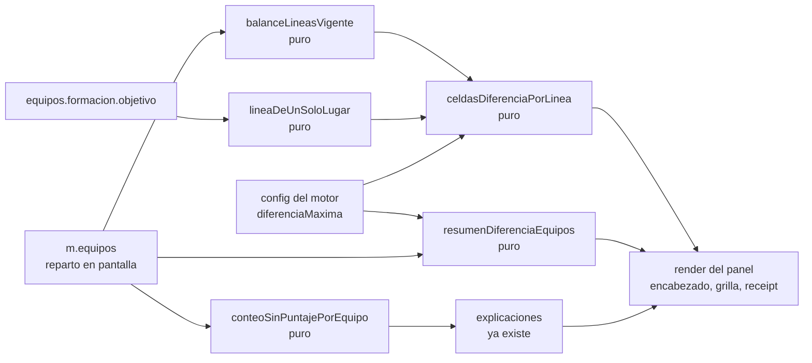
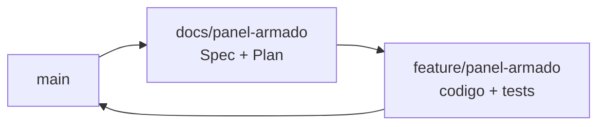

# El panel de armado (rebanada 3 de "Equipos en el campo") — Implementation Plan

> **Status:** Draft · **Date:** 2026-08-31 · **Owner:** Lucas Manoukian
>
> **Reviewers:** *pending*
>
> **Spec:** [PANEL_ARMADO_SPEC.md](./PANEL_ARMADO_SPEC.md)
>
> **Concept note:** [EQUIPOS_EN_EL_CAMPO_CONCEPT.md](../EQUIPOS_EN_EL_CAMPO_CONCEPT.md)
>
> **Planes de las rebanadas anteriores:** [rebanada-1-cancha/CANCHA_IMPLEMENTATION_PLAN.md](../rebanada-1-cancha/CANCHA_IMPLEMENTATION_PLAN.md) ·
> [rebanada-2-arrastre/ARRASTRE_IMPLEMENTATION_PLAN.md](../rebanada-2-arrastre/ARRASTRE_IMPLEMENTATION_PLAN.md)

> **Grounding evidence (`MD-25`).** Este Plan se apoya en el ledger §6.5 del
> Concept Note y en las citas en línea de la Spec. Cada tarea que toca un lugar
> concreto de `index.html` lo cita en la propia tarea. Las líneas citadas
> corresponden al estado del archivo tras el merge de la rebanada 2 (`618b2ae`).

## 1. Summary

Se rediseña todo lo que rodea a la cancha dentro de la tarjeta de equipos: el
encabezado gana la píldora de diferencia y los dos botones de ícono, el combo
gana el resumen visible de la estrategia, los tres resúmenes en cajitas se
retiran, la diferencia por línea pasa a una grilla con regla de color, el
receipt pierde la caja, y la botonera al pie se restila. Todo dentro de
`index.html`, sin dependencias nuevas y sin tocar el motor.

La decisión de diseño que ordena el resto: **los números derivados salen de
funciones puras**, igual que la rebanada 2 hizo con la resolución del drop
(`TD-05` de aquel Plan). No es prolijidad — es lo que hace que la regla de color
de `D-22`, el recálculo de `D-25` y el desglose de `FR-052` tengan test
ejecutable sin depender de un navegador ni de un umbral configurado en el
fixture. Sin esa frontera, 33 de los 51 escenarios y variantes de la Spec no
tendrían forma honesta de cumplir `AC-50`.

El cambio no obvio que conviene saber antes de leer el resto: **el bloque de
diferencia por línea hoy no se dibuja en ningún escenario de layout**, porque
los armados del fixture no llevan `balanceLineas`
([`tests/fixtures-app.js:62-77`](../../../tests/fixtures-app.js)). Ponérselo es
tarea de esta rama (`T-1.24`), y hace que la grilla aparezca en todos los
escenarios que ya existen — que es exactamente donde `NFR-001` la tiene que
medir.

## 2. Goals & non-goals

- **Objetivo técnico 1** — Que cada número que el panel muestra salga de una
  función pura que reciba el reparto en pantalla, de modo que mover un jugador a
  mano no pueda dejar un número viejo (`D-25`, `FR-070`, `FR-071`).
- **Objetivo técnico 2** — Que la regla de color derive del predicado de línea de
  un solo lugar que el receipt ya usa, y no de una lista de nombres (`TC-013`).
- **Objetivo técnico 3** — Que `renderTeamsSection`, que hoy arma la tarjeta
  entera en una sola plantilla de 60 líneas
  ([`index.html:4613-4658`](../../../index.html#L4613-L4658)), quede partida en
  bloques con nombre, uno por pieza de la Spec.
- **Objetivo técnico 4** — Que los tres resúmenes retirados desaparezcan del DOM
  y del CSS, sin quedar ocultos ni detrás de una bandera (`TC-014`).

**No-objetivos:**

- No se toca el motor de generación ni ninguna de sus funciones (`D-01`). La
  única cadena del receipt que cambia es la de `FR-052`.
- No se toca la cancha, la camiseta, el candado, el arrastre ni el selector de
  equipo: las rebanadas 1 y 2 los fijaron.
- No se cambia el texto que copia el botón Copiar (`FR-008`).
- No se agrega telemetría, CI, feature flags ni ninguna infraestructura que el
  proyecto hoy no tenga (Principio II; ver `TD-09`).
- No se extiende la grilla por línea a las estrategias que no la producen
  (Spec §3.2, `OPEN-Q-03`).

## 3. Architecture overview



Todo lo que decide un número o un estado de exceso queda del lado izquierdo, sin
DOM y sin efectos; el render sólo compone cadenas. Esa frontera es lo que hace
que 33 de los 51 escenarios y variantes se prueben con `node tests/panel.test.js`
y sin navegador.

### 3.1 Key design decisions

| ID | Decision | Spec ref | Rationale |
|---|---|---|---|
| TD-01 | Los números derivados del panel se calculan en funciones puras nuevas: `lineaDeUnSoloLugar`, `balanceLineasVigente`, `celdasDiferenciaPorLinea`, `resumenDiferenciaEquipos`, `conteoSinPuntajePorEquipo` y `estrategiaValida` | `AC-50`, `FR-070`, `FR-071`, `TC-010`, `TC-042` | Es lo que hace verificable la regla de color sin un umbral en el fixture, el recálculo sin sintetizar un arrastre y la validación del combo sin DOM. Repite la frontera que la rebanada 2 estableció en su `TD-05` y que ya demostró servir |
| TD-01b | El armado del arreglo `explicaciones` se extrae a una función con nombre, `explicacionesDelArmado(m, eq, jugadores)`, sin cambiar ninguna cadena ni el orden | `NFR-007`, `AC-16`, `AC-25`, `TC-012`, `S-05d`, `S-22` | Hoy se construye **en línea** dentro de `renderTeamsSection` ([`index.html:4438-4581`](../../../index.html#L4438-L4581)), sin función propia — es exactamente lo que el Concept Note §17 registró como error de hecho del handoff, que la llamaba `explicacionesGeneracion`. Y `tests/harness.js` recorta declaraciones **por nombre**: sin nombre no hay forma de comparar la lista antes y después, que es lo que `NFR-007` exige. La extracción es lo que vuelve honesto ese criterio en vez de declarativo |
| TD-02 | `balanceLineasVigente(m, porId)` recalcula con `balanceLineasDe` ([`index.html:2724`](../../../index.html#L2724)) sobre `m.equipos.blanco` / `.negro` y `m.equipos.posicionAsignada`, y devuelve `null` cuando el armado no lleva `balanceLineas` | `FR-030`, `FR-071`, `TC-010`, `TC-015` | La función pura del motor ya existe y ya cuenta la dupla como promedio (`FR-036`). Devolver `null` cuando el armado guardado no lleva balance conserva exactamente la condición de aparición de hoy (`TC-015`): se recalcula el **valor**, no se inventa el **bloque** |
| TD-03 | El valor guardado `m.equipos.balanceLineas` no se borra ni se sobrescribe: el render lo ignora y usa el recalculado | `TC-011`, `NFR-005` | Es el registro de lo que la generación produjo, y `NFR-005` exige que la rebanada no escriba ningún campo. Se usa además como testigo: si el recalculado difiere del guardado, hubo un movimiento manual |
| TD-04 | `lineaDeUnSoloLugar(pos, formacion)` devuelve `true` para `'Arquero'` siempre, y para el resto cuando `formacion.objetivo[FORMACION_KEY_POR_POSICION[pos]] === 1`. Es el mismo predicado de [`index.html:4476-4478`](../../../index.html#L4476-L4478), extraído | `FR-034`, `TC-013`, `S-04d`, `S-04e` | Extraerlo en vez de duplicarlo es lo que garantiza que el color y el texto del receipt no puedan contradecirse. Y deriva de la formación, así que una cancha futura con dos delanteros lo resuelve sola |
| TD-05 | El estado de exceso de la píldora se calcula sobre el **desvío** respecto del objetivo, reutilizando `objetivoDiferencia` ([`index.html:1285`](../../../index.html#L1285)) tal como hoy | `TC-016`, `AC-29` | Es la regla de `009-ventaja-sin-arquero` `FR-010`. Mover el aviso de la cajita a la píldora no puede cambiar cuándo avisa |
| TD-06 | `renderTeamsSection` se parte en `renderEncabezadoTarjeta`, `renderComboEstrategia`, `renderAvisoDesactualizado`, `renderDiferenciaPorLinea`, `renderPorQueQuedaronAsi` y `renderBotoneraTarjeta`, todas devolviendo cadena | `FR-001` … `FR-064` | Una plantilla de 60 líneas con seis piezas condicionales no se puede revisar contra la Spec pieza por pieza. Es además lo que permite que `T-1.17` retire tres bloques sin tocar el resto |
| TD-07 | La confirmación de Copiar es un estado de módulo (`copiadoHasta`, marca de tiempo) más un `setTimeout` que repinta, no una clase agregada al DOM a mano | `FR-006`, `TC-035`, `S-07c` | Repintar es lo que hace la aplicación ante cualquier cambio de estado, y un segundo click antes del plazo sólo corre la marca: no quedan dos temporizadores compitiendo, que es lo que `S-07c` comprueba |
| TD-08 | Las funciones puras nuevas viven en `tests/panel.test.js`, un archivo de test propio, y **no** se agregan a la lista de `tests/cancha.test.js` | `AC-50` | Revierte a propósito el `TD-10` de la rebanada 2, que había decidido no crear un tercer archivo. La razón cambió: aquellas funciones eran del dominio de la cancha, y éstas consumen salidas del motor —`balanceLineasDe`, `sumasPorLinea`, `LABEL_LINEA`, `FORMACION_KEY_POR_POSICION`—, así que la lista de `cancha.test.js` crecería con ocho nombres que la cancha no usa. El andamio que se duplica son quince líneas, y el repositorio ya lo duplica entre `motor.test.js` y `cancha.test.js` |
| TD-09 | Sin feature flag | `D-12` | Heredado de las rebanadas 1 y 2: no hay infraestructura de flags y el Principio II prohíbe anticiparla. La red de seguridad es la rama sin mergear |
| TD-10 | El escenario de layout que ejercita la regla de color configura la "Diferencia aceptable" **por la pantalla de Configuración**, no por el fixture | `S-04`, `FR-033` | El fixture tiene `motorConfig: null` ([`tests/fixtures-app.js:148`](../../../tests/fixtures-app.js)) y el default de `diferenciaMaxima` es `null` ([`index.html:1010`](../../../index.html#L1010)), así que hoy todos los escenarios ejercitan el camino sin umbral (`FR-035`). Ponerle umbral al fixture cambiaría ese camino para todos; hacerlo por la pantalla lo acota a un escenario y además ejercita la ruta real |
| TD-11 | Los armados del fixture ganan `balanceLineas` y `formacion`, que hoy no tienen | `FR-030`, `NFR-001` | Sin ellos la grilla no se dibuja en ningún escenario y `NFR-001` mediría una pantalla que no es la que se va a publicar. Es un cambio de alcance global sobre la suite, registrado como `IMP-05` y `R-03` |

## 4. Module map

| Module / package | Role | Status |
|---|---|---|
| `index.html` — bloque CSS de la tarjeta y de la cancha (desde [`index.html:342`](../../../index.html#L342)) | Gana el encabezado, la píldora, el combo restilado, el aviso, la grilla por línea y el receipt sin caja | modified |
| `index.html` — `.explain-box`, `.conv-summary`, `.stat`, `.stale-banner`, `.info-icon` ([`70`](../../../index.html#L70), [`101-114`](../../../index.html#L101-L114), [`239`](../../../index.html#L239), [`253`](../../../index.html#L253), [`337-339`](../../../index.html#L337-L339)) | Reemplazadas o retiradas según qué las use todavía | modified |
| `index.html` — `renderTeamsSection` ([`index.html:4330`](../../../index.html#L4330)) | Se parte en seis funciones de render (`TD-06`) | modified |
| `index.html` — arreglo `explicaciones` ([`index.html:4438-4581`](../../../index.html#L4438-L4581)) | Se consume sin cambios, salvo la línea de `FR-052` | modified |
| `index.html` — `bindSelectorEstrategia` ([`index.html:4315`](../../../index.html#L4315)) | Gana la validación del valor y el repintado del resumen | modified |
| `index.html` — `__copiarFormacion` ([`index.html:1233`](../../../index.html#L1233)) | Gana la confirmación por ícono; el texto que copia no se toca | modified |
| `index.html` — `formatearFormacionParaCopiar` ([`index.html:1217`](../../../index.html#L1217)) | Se consume sin cambios (`FR-008`) | untouched |
| `index.html` — `balanceLineasDe`, `sumasPorLinea`, `LABEL_LINEA`, `ORDEN_LINEAS`, `FORMACION_KEY_POR_POSICION`, `objetivoDiferencia` | Se consumen sin cambios (`D-01`) | untouched |
| `index.html` — `renderZonaEquipos`, `renderCanchaEquipo`, `renderCamiseta`, `renderSelectorEquipo` | Sin cambios: son de las rebanadas 1 y 2 | untouched |
| `tests/panel.test.js` | Archivo nuevo: las funciones puras del panel (`TD-08`) | new |
| `tests/layout.test.js` | Gana los escenarios del panel y el invariante de los botones de ícono | modified |
| `tests/fixtures-app.js` | Los armados ganan `balanceLineas` y `formacion` (`TD-11`) | modified |
| `.specify/specs/003-motor-generacion-equipos/spec.md` | Recibe la anotación recíproca de reemplazo del `FR-009` | modified |
| `.specify/specs/012-puntajes-coherentes-panel/spec.md` | Recibe la anotación recíproca de la superficie de lectura | modified |

## 5. Engineering rules / project conventions reference

Restatadas de [`AGENTS.md`](../../../AGENTS.md).

| Rule | Summary |
|---|---|
| Estructura | Toda la aplicación en `index.html`, dentro de un IIFE. Sin build, sin bundler, sin framework (Principio II, `TC-001`) |
| Imports | No aplica: no hay módulos. Las funciones nuevas se declaran dentro del mismo IIFE, junto a las del panel de equipos |
| Typing | No aplica: JavaScript sin anotaciones y sin type-checker configurado |
| Logging | No aplica: la aplicación no tiene logging |
| Tests | `tests/*.test.js`, se corren con `node tests/<archivo>`. Devuelven 1 solo ante regresión. Los tests de unidad recortan declaraciones de `index.html` por nombre con `extraer` de `tests/harness.js` |
| Binding | `variant-a` — el identificador de la Spec va en forma canónica con guion **dentro de un string literal**, con el prefijo de rebanada `panel/`: el nombre del caso en `tests/panel.test.js` (`prueba('"panel/S-04a" …')`) y el campo `spec: ['panel/S-04']` de cada escenario e invariante de `tests/layout.test.js`. Nunca en comentarios |
| Supply-chain | `none — el repositorio no versiona ningún lockfile; la aplicación no tiene dependencias instaladas`. `.gitignore` excluye `node_modules/` y `package-lock.json`, y Firebase se carga por CDN. Playwright es una dependencia opcional de desarrollo, externa al repositorio |
| Constants | Los valores del handoff van como custom properties de CSS en el bloque de la tarjeta, no repartidos en las reglas |
| Commits | Conventional Commits con asunto en español: `tipo(scope): asunto (IDs de la Spec)`, ≤ 72 caracteres, un cambio lógico por commit, cada commit compila por separado |
| Backwards compat | Requerida en los datos (`NFR-005`, `TC-011`): no se agrega, renombra ni deja de escribir ningún campo, y el recálculo no persiste. No requerida en la interfaz: tres bloques se retiran sin camino de vuelta (`TC-014`) |
| Lint / type-check | `none — el repositorio no tiene linter ni type-checker configurados`. `T-1.D3` y `T-1.D4` pasan de forma vacua y se declaran como tales, no se marcan en silencio |

## 6. Definition of Done (every branch)

- [ ] La implementación sigue las convenciones de §5
- [ ] Cada sección de la Spec asignada a la rama está implementada
- [ ] Cada escenario (`S-*`) y cada variante tiene un test ejecutable (`AC-50`; `T-1.D8` y `T-1.D8b`)
- [ ] Cada NFR cuantificado —la lista cerrada del preámbulo de Spec §8— tiene un test de medición (`AC-51`; `T-1.D9`)
- [ ] Cada `TC-*` de la Spec §4 tiene una entrada de verificación en §12 (`AC-52`; `T-1.D10` y `T-1.D10b`)
- [ ] Las consecuencias están enumeradas en §12.2 (`AC-53`; `T-1.D15`)
- [ ] Cada NFR cuantificado tiene al menos una fila `OBS-*` en §11 (`AC-54`; `T-1.D16`)
- [ ] El lockfile pasa la auditoría, o §5 declara `Supply-chain: none` (`AC-55`; `T-1.D20`)
- [ ] Cada riesgo `R-*` de §14 registra una vía de mitigación (`T-1.D17`)
- [ ] Auto-consistencia: todo ID referenciado dentro de este Plan resuelve dentro de este Plan (`T-1.D18`)
- [ ] Consistencia cruzada: todo ID de la Spec citado acá existe en la Spec, y todo `D-*` existe en el Concept Note (`T-1.D19`)
- [ ] Todos los tests nuevos pasan
- [ ] Todos los tests existentes pasan, sin regresiones — `node tests/motor.test.js`, `node tests/cancha.test.js` y `LAYOUT_STRICT=1 node tests/layout.test.js`
- [ ] Linter: no aplica (§5), declarado
- [ ] Type-checker: no aplica (§5), declarado
- [ ] No quedan `TODO`, `FIXME` ni `HACK` en el código commiteado
- [ ] El historial de commits es limpio y sigue el formato de §5 (`T-1.D11`)
- [ ] La descripción del PR resume los cambios y cita las secciones de la Spec (`T-1.D12`)
- [ ] **Gate propio del proyecto:** al menos un escenario nuevo de layout se vio fallar revirtiendo el cambio que lo motiva (Principio V, `TC-032`, `AC-31`), y la pantalla se miró en un navegador real a 360 px y a 1200 px con `node tools/servir-fixture.js` (`T-1.D13`)
- [ ] PR abierto contra `main` (`T-1.D14`)

## 7. Branch / phase plan

### 7.0 Branch sizing (`MD-27`)

```
Custom arc: 1 branch — D-11 del Concept Note fija dos ramas por rebanada, `docs/<rebanada>` y `feature/<rebanada>`, y D-08 ya usó la rebanada como unidad de división del trabajo. Subdividir la rebanada otra vez duplicaría el mismo mecanismo en dos niveles.
```

El árbol de decisión del `MD-27` caería en
`three-branch-scaffold-core-rollout`, y se descarta por las dos razones que las
rebanadas 1 y 2 ya registraron y que siguen valiendo: no hay infraestructura de
flags con la que gatear una rama intermedia (`TD-09`), y la rebanada ya *es* la
fase. Lo que en otro proyecto serían tres ramas, acá son los nueve commits
atómicos de §7.2.9.

### 7.1 Branch tracker

| # | Git branch | Base branch | Status | PR | Tests | Notes |
|---|---|---|---|---|---|---|
| 1 | `feature/panel-armado` | `main` | Sin abrir | — | — | Se abre y se mergea después de `docs/panel-armado`, según `D-11` |



Las flechas son el orden de merge. Las dos ramas salen de `main`;
`feature/panel-armado` se abre después de mergear `docs/panel-armado`.

---

### 7.2 Branch 1 — `feature/panel-armado`

**Goal:** que un administrador que abre un partido con equipos generados vea el
encabezado con la píldora de diferencia y los botones de Copiar y Regenerar, el
combo con el resumen de la estrategia debajo, la grilla de diferencia por línea
con el rojo reservado a las líneas que el reparto podía arreglar, y el receipt
sin caja; que los tres resúmenes en cajitas ya no existan; que mover un jugador a
mano actualice los números y no el texto; y que
`node tests/panel.test.js` y `node tests/layout.test.js` lo verifiquen.

**Spec coverage:** los sesenta y cuatro requisitos funcionales (`FR-001` a
`FR-085`, incluidas las variantes con sufijo), los siete `NFR-*`, los veinte
`TC-*` y los cuarenta y cinco `AC-*`.

#### 7.2.1 Design decisions specific to this branch

> **El orden importa (Spec §17).** Las funciones puras (`T-1.1`–`T-1.5`) van
> primero porque son lo que hace verificable el resto: la regla de color de
> `D-22` y el recálculo de `D-25` no tienen forma honesta de probarse desde el
> DOM, porque el fixture no tiene umbral configurado y el arrastre no se puede
> sintetizar de punta a punta.

> **Retirar es trabajo, no efecto colateral.** `T-1.17` y `T-1.18` retiran los
> tres resúmenes y los dos botones del pie. Van en su propio commit para que
> `git revert` de ese commit reponga exactamente lo retirado si en el uso real se
> extraña un dato (`R-02`).

> **El fixture cambia lo que ven todos los escenarios.** `T-1.24` le agrega
> `balanceLineas` y `formacion` a los armados, así que la grilla aparece en los
> escenarios que ya existen. Es deliberado (`TD-11`) y es lo que hace que
> `NFR-001` mida la pantalla real, pero conviene correr la suite entera antes y
> después para ver qué se movió.

#### 7.2.2 New types / enums

Ninguno. La rebanada no introduce ninguna entidad ni ningún tipo nuevo (Spec
§10.1).

#### 7.2.3 New constants

File: `index.html`, en el bloque de custom properties de la tarjeta.

| Constant | Value | Purpose |
|---|---|---|
| `MS_TILDE_COPIADO` | `1800` | Duración de la confirmación de Copiar ([`handoff/README.md` § Botones de ícono del header](../handoff/README.md)) (`FR-006`) |
| `--icono-header-hit` | `44px` | Área mínima del botón de ícono, por encima de los 16 px del dibujo (`NFR-002`) |
| `--celda-linea-pad` | `12px 14px` / compacto `10px 12px` | Celda de la grilla (§ Diferencia por línea) |
| `--celda-linea-radio` | `var(--radius-md)` | idem |
| `--receipt-gap` | `8px` / compacto `7px` | Separación entre viñetas del receipt (§ Por qué quedaron así) |
| `--receipt-punto` | `5px` | Diámetro del punto de viñeta, en `var(--color-primary)` |
| `--divisor-bloque` | `1px solid var(--border-subtle)` | El divisor que reemplaza a la caja del receipt y separa la grilla |

#### 7.2.4 Configuration

Ninguna configuración nueva. El desvío aceptable es el `diferenciaMaxima` que ya
existe ([`index.html:1010`](../../../index.html#L1010)) (`D-15`).

#### 7.2.5 New / modified interfaces

File: `index.html`

| Función | Firma | Notas |
|---|---|---|
| `lineaDeUnSoloLugar` | `(pos, formacion) -> boolean` | Pura. `true` para `'Arquero'` siempre; para el resto, cuando el cupo en `formacion.objetivo` es 1. Devuelve `false` si no hay formación (`FR-034`, `TC-013`, `TD-04`) |
| `balanceLineasVigente` | `(m, porId) -> {[pos]: {blanco, negro, diferencia}} \| null` | Pura. Recalcula con `balanceLineasDe` sobre el reparto actual; `null` cuando el armado guardado no lleva `balanceLineas` (`FR-071`, `TC-010`, `TC-015`, `TD-02`) |
| `celdasDiferenciaPorLinea` | `(m, porId, diffObjetivo) -> [{pos, etiqueta, blanco, negro, diferencia, aFavor, texto, excedida}] \| null` | Pura. Una entrada por línea con contenido, en el orden de `ORDEN_LINEAS`. `excedida` es `false` siempre que `lineaDeUnSoloLugar` sea `true`, o que no haya umbral (`FR-031`, `FR-033`, `FR-034`, `FR-035`) |
| `resumenDiferenciaEquipos` | `(m, diffObjetivo) -> {diferencia, texto, excedida, buscada, aFavorDe}` | Pura. `texto` es `"Equipos parejos"` con diferencia 0 y `"Diferencia N pts"` si no. `excedida` se evalúa sobre el desvío, no sobre la diferencia cruda (`FR-003`, `FR-003b`, `FR-003c`, `FR-009`, `FR-037`, `TC-016`, `TD-05`) |
| `conteoSinPuntajePorEquipo` | `(m, blancoPlayers, negroPlayers) -> {total, blanco, negro}` | Pura sobre unidades de armado, reutilizando `valorDePuntaje` ([`index.html:3744`](../../../index.html#L3744)) (`FR-052`, `FR-074`, `AC-06`) |
| `estrategiaValida` | `(clave) -> boolean` | Pura. `true` sólo si `clave` es una de las del catálogo `ESTRATEGIAS` ([`index.html:961`](../../../index.html#L961)). Vive separada del manejador del combo para que `S-21` se pruebe sin DOM (`FR-014`, `TC-042`, `TD-01`) |
| `explicacionesDelArmado` | `(m, eq, jugadores) -> string[]` | La construcción del arreglo `explicaciones`, extraída sin cambiar ninguna cadena salvo la de `FR-052` ni el orden de emisión. Es lo que permite comparar la lista antes y después (`NFR-007`, `TC-012`, `TD-01b`) |
| `renderEncabezadoTarjeta` | `(m, resumen) -> string` | Título, píldora y los dos botones de ícono (`FR-001` a `FR-009`) |
| `renderComboEstrategia` | `(m) -> string` | El `<select>` restilado, la etiqueta y el resumen visible (`FR-010` a `FR-015`) |
| `renderAvisoDesactualizado` | `(m) -> string` | El aviso con el texto de siempre y la forma del handoff (`FR-020` a `FR-024`) |
| `renderDiferenciaPorLinea` | `(celdas, diffObjetivo) -> string` | La grilla y su encabezado; cadena vacía cuando `celdas` es `null` (`FR-030` a `FR-037`) |
| `renderPorQueQuedaronAsi` | `(explicaciones) -> string` | Lista de viñetas sin caja, con el texto escapado; cadena vacía si no hay explicaciones (`FR-040` a `FR-046`) |
| `renderBotoneraTarjeta` | `(m) -> string` | Los botones de ciclo de vida con los estilos del design system; cadena vacía si no aplica ninguno (`FR-060` a `FR-064`) |
| `window.__copiarFormacion` | `(matchId) -> void` | Gana la confirmación por ícono; el texto que copia no cambia (`FR-006`, `FR-006b`, `FR-006c`, `FR-008`, `TD-07`) |

#### 7.2.6 Tests

```
tests/panel.test.js      — funciones puras del panel: 33 escenarios y variantes
tests/layout.test.js     — DOM, medidas y recálculo: 18 escenarios y variantes
```

| File | What it covers |
|---|---|
| `tests/panel.test.js` | `lineaDeUnSoloLugar`, `balanceLineasVigente`, `celdasDiferenciaPorLinea`, `resumenDiferenciaEquipos`, `conteoSinPuntajePorEquipo`: regla de color, umbrales, recálculo, desglose, escapado del receipt |
| `tests/layout.test.js` | Escenarios `panel-armado`, `panel-umbral`, `panel-jugador`, `panel-recalculo`; invariante `INVARIANTE_PANEL` |

#### 7.2.7 Verification

- [ ] El encabezado contiene la píldora y los dos botones de ícono; el pie no los contiene
- [ ] El DOM no contiene ninguna `.stat` de conteo de posiciones, sin puntaje, bloqueados ni diferencia
- [ ] La grilla dibuja una celda por línea con contenido, y ninguna celda de Arco o Ataque queda marcada como excedida
- [ ] El receipt no tiene borde ni fondo propio, y sus nombres se muestran como texto literal
- [ ] Un drop sintetizado cambia los números de la grilla y de la píldora, y no cambia ninguna línea del receipt
- [ ] `window.__escrituras` no gana claves nuevas al mostrar ni al recalcular
- [ ] Todos los tests existentes pasan

#### 7.2.8 Files inventory

**New files:**
```
tests/panel.test.js
```

**Modified files:**
```
index.html
tests/layout.test.js
tests/fixtures-app.js
AGENTS.md
.specify/specs/003-motor-generacion-equipos/spec.md
.specify/specs/012-puntajes-coherentes-panel/spec.md
```

No hay archivos borrados: los tres resúmenes se retiran de `index.html`, que ya
está en la lista de modificados. `AGENTS.md` gana la línea de
`node tests/panel.test.js` en su bloque de tests.

#### 7.2.9 Task checklist (agent-runnable)

Implementation tasks (agrupadas en commits atómicos):

- [ ] T-1.1 Agregar `lineaDeUnSoloLugar` en `index.html`, junto a `FORMACION_KEY_POR_POSICION` ([`index.html:2444`](../../../index.html#L2444)) (`FR-034`, `TC-013`, `TD-04`)
- [ ] T-1.2 Reescribir el predicado en línea de [`index.html:4476-4478`](../../../index.html#L4476-L4478) para que llame a `lineaDeUnSoloLugar`, verificando que la explicación emitida no cambie (`TC-012`, `TC-013`, `NFR-007`)
- [ ] T-1.3 Agregar `balanceLineasVigente`, que llama a `balanceLineasDe` ([`index.html:2724`](../../../index.html#L2724)) con el reparto actual y devuelve `null` cuando el armado no lleva `balanceLineas` (`FR-071`, `TC-010`, `TC-011`, `TC-015`, `TD-02`, `TD-03`)
- [ ] T-1.4 Agregar `celdasDiferenciaPorLinea`, con la regla de color: `excedida` sólo cuando hay umbral, la diferencia lo **supera** —no lo alcanza— y la línea no es de un solo lugar (`FR-031`, `FR-031b`, `FR-033`, `FR-034`, `FR-035`, `FR-036`)
- [ ] T-1.5 Agregar `resumenDiferenciaEquipos`, evaluando el exceso sobre el desvío con `objetivoDiferencia` ([`index.html:1285`](../../../index.html#L1285)) y no sobre la diferencia cruda (`FR-003`, `FR-003b`, `FR-003c`, `FR-009`, `FR-037`, `TC-016`, `TD-05`)
- [ ] T-1.6 Agregar `conteoSinPuntajePorEquipo`, extrayendo la lógica de `sinPuntajeCount` ([`index.html:4517-4519`](../../../index.html#L4517-L4519)) y devolviendo además el desglose (`FR-052`, `FR-074`)
- [ ] T-1.6b Agregar `estrategiaValida`, que compara contra las claves de `ESTRATEGIAS` ([`index.html:961`](../../../index.html#L961)) (`FR-014`, `TC-042`, `TD-01`)
- [ ] T-1.6c Extraer el armado del arreglo `explicaciones` ([`index.html:4438-4581`](../../../index.html#L4438-L4581)) a `explicacionesDelArmado`, **sin cambiar ninguna cadena ni el orden**: es una extracción, no una reescritura. Verificar en el mismo commit que la lista producida es idéntica a la de antes, corriendo el chequeo de `T-1.25` sobre `HEAD~1` (`NFR-007`, `TC-012`, `TD-01b`)
- [ ] T-1.C1 Commit — `feat(panel): los números del panel salen de funciones puras (FR-031, FR-034, FR-071)`

- [ ] T-1.7 Agregar el CSS del encabezado con los valores de [`handoff/README.md` § Botones de ícono del header](../handoff/README.md): los dos botones redondos, el área de 44 px de `NFR-002` y el verde de Regenerar como único color del header (`FR-002b`, `FR-002c`, `NFR-002`, `TC-033`)
- [ ] T-1.8 Agregar el CSS de la píldora en sus dos tonos: `neutral` dentro del desvío y píldora roja al superarlo, con la geometría del Badge (§ Componentes del design system usados) (`FR-003`, `FR-037`, `TC-030`, `TC-033`)
- [ ] T-1.9 Agregar el CSS del combo restilado y del caption de resumen (§ Combo de estrategia), conservando el `<select>` nativo con `appearance: none` (`FR-010`, `FR-011`, `TC-003`, `TC-033`)
- [ ] T-1.10 Reemplazar el CSS de `.stale-banner` ([`index.html:253`](../../../index.html#L253)) por la forma del handoff: radio, `box-shadow` de advertencia y el triángulo de atención (`FR-020`, `D-05`, `TC-033`)
- [ ] T-1.11 Agregar el CSS de la grilla por línea y del receipt sin caja, con los valores de §7.2.3 y el divisor que reemplaza al borde de `.explain-box` (`FR-030`, `FR-042`, `TC-033`)
- [ ] T-1.C2 Commit — `feat(panel): CSS del encabezado, el combo, la grilla y el receipt (TC-033)`

- [ ] T-1.12 Implementar `renderEncabezadoTarjeta` y cablearlo en `renderTeamsSection` ([`index.html:4613`](../../../index.html#L4613)). La píldora va en el encabezado en dos columnas y en la fila del equipo visible en una, reutilizando `enUnaColumna` de la rebanada 2 ([`index.html:4085`](../../../index.html#L4085)) (`FR-001`, `FR-002`, `FR-002b`, `FR-002c`, `FR-003`, `FR-004`, `FR-005`, `FR-007`, `FR-009`, `TD-06`)
- [ ] T-1.13 Agregar la confirmación por ícono a `__copiarFormacion` ([`index.html:1233`](../../../index.html#L1233)): tilde por `MS_TILDE_COPIADO` y repintado, sin aviso flotante en el éxito; el aviso de error se conserva y el texto copiado no se toca (`FR-006`, `FR-006b`, `FR-006c`, `FR-008`, `TC-035`, `TD-07`)
- [ ] T-1.14 Implementar `renderComboEstrategia` con el resumen visible debajo, retirando el `<span class="info-icon">` y su `info-tip` ([`index.html:4339-4341`](../../../index.html#L4339-L4341)) (`FR-010`, `FR-011`, `FR-012`, `FR-015`)
- [ ] T-1.15 Cablear `estrategiaValida` en `bindSelectorEstrategia` ([`index.html:4317`](../../../index.html#L4317)): el valor se valida antes de escribir `m.estrategia`, y el resumen se repinta sin regenerar (`FR-013`, `FR-014`, `TC-042`, `TD-01`)
- [ ] T-1.16 Implementar `renderAvisoDesactualizado` con la forma del handoff y **el texto actual sin cambios** ([`index.html:4618-4620`](../../../index.html#L4618-L4620)) (`FR-020`, `FR-021`, `FR-022`, `FR-023`, `FR-024`, `D-05`)
- [ ] T-1.C3 Commit — `feat(panel): encabezado, combo con resumen y aviso restilado (FR-001, FR-011, FR-021)`

- [ ] T-1.17 Implementar `renderDiferenciaPorLinea` sobre las celdas de `T-1.4`, con el encabezado que declara el desvío aceptable sólo cuando está configurado (`FR-030`, `FR-031`, `FR-031b`, `FR-032`, `FR-033`, `FR-035`)
- [ ] T-1.18 Implementar `renderPorQueQuedaronAsi` como lista de viñetas sin caja, pasando **cada explicación por `escaparHtml`** ([`index.html:1174`](../../../index.html#L1174)) — hoy se insertan crudas y varias interpolan nombres de jugador ([`index.html:4554`](../../../index.html#L4554), [`index.html:4563`](../../../index.html#L4563)) (`FR-040`, `FR-041`, `FR-042`, `FR-044`, `FR-045`, `FR-046`, `TC-041`)
- [ ] T-1.19 Cambiar dentro de `explicacionesDelArmado` la línea de titulares sin puntaje ([`index.html:4442`](../../../index.html#L4442)) para que use `conteoSinPuntajePorEquipo` y declare el desglose por equipo. Es la **única** cadena del receipt que se modifica, y el chequeo de `T-1.25` la declara como la única diferencia esperada (`FR-052`, `FR-074`, `TC-012`, `NFR-007`)
- [ ] T-1.C4 Commit — `feat(panel): grilla de diferencia por línea y receipt sin caja (FR-030, FR-042)`

- [ ] T-1.20 Retirar el conteo de posiciones ([`index.html:4584-4596`](../../../index.html#L4584-L4596)) y las tres cajitas de sin puntaje, bloqueados y diferencia ([`index.html:4634-4639`](../../../index.html#L4634-L4639)), junto con las reglas CSS que queden sin usar (`FR-050`, `FR-051`, `FR-053`, `TC-014`)
- [ ] T-1.21 Implementar `renderBotoneraTarjeta`: se retiran Copiar y Regenerar del pie ([`index.html:4648-4649`](../../../index.html#L4648-L4649)) y los cuatro botones de ciclo de vida adoptan los estilos del design system, conservando su texto y sus condiciones de aparición (`FR-060`, `FR-061`, `FR-062`, `FR-063`, `FR-064`, `D-24`)
- [ ] T-1.22 Verificar por `git grep` que `.conv-summary`, `.stat` y `.info-icon` no quedan referenciadas por la tarjeta de equipos, y que las que siguen en uso en otras pantallas no se tocaron (`TC-014`, `AC-07`, `AC-27`)
- [ ] T-1.C5 Commit — `refactor(panel): retira los tres resúmenes y baja la botonera (FR-050, FR-063)`

- [ ] T-1.23 Actualizar el subtítulo de la tarjeta ([`index.html:4616`](../../../index.html#L4616)): conserva la mención de la estrategia **aplicada** —que el combo no muestra y el aviso no nombra— y la mención del gesto que la rebanada 2 le agregó (`FR-084`, `FR-085`)
- [ ] T-1.C6 Commit — `feat(panel): el subtítulo distingue la estrategia aplicada de la elegida (FR-084)`

- [ ] T-1.24 Crear `tests/panel.test.js` con su lista `DECLARACIONES` en orden de dependencia, reutilizando `extraer` de [`tests/harness.js`](../../../tests/harness.js) como hace `cancha.test.js` ([`tests/cancha.test.js:22`](../../../tests/cancha.test.js)) (`TD-08`)
- [ ] T-1.25 Escribir los treinta y tres casos de unidad de §12.1, con el prefijo `panel/` en cada título (`AC-50`). El de `S-05d` compara contra una lista de referencia **generada del `index.html` de `main` en `618b2ae`** —volcado a un temporal y cargado con la opción `index` de `extraer`, el mismo mecanismo con que `tools/medir-motor.js` compara contra un commit anterior ([`tests/harness.js:100-110`](../../../tests/harness.js))— y no contra cadenas transcritas a mano, que se desincronizarían (`NFR-007`, `AC-16`)
- [ ] T-1.26 [P] Escribir en `tests/panel.test.js` el chequeo de literales visuales: todo color, radio, sombra y espaciado de los bloques CSS nuevos está en la lista declarada de tokens y excepciones de §7.2.3 (`NFR-006`, `OBS-06`, `AC-15`)
- [ ] T-1.27 [P] Agregar a `AGENTS.md` la línea `node tests/panel.test.js` en su bloque de tests
- [ ] T-1.C7 Commit — `test(panel): casos de unidad de la regla de color y el recálculo (S-04, S-06)`

- [ ] T-1.28 Agregar `balanceLineas` y `formacion` a los dos armados de [`tests/fixtures-app.js`](../../../tests/fixtures-app.js) (el de 8 y el de 9), con valores que dejen una línea de campo por encima de un umbral de 1 punto y el Arco también, que es el caso que distingue `D-22` (`TD-11`, `S-04`, `S-04d`)
- [ ] T-1.29 Agregar a `tests/layout.test.js` el escenario `panel-armado`: encabezado con píldora y dos botones, ausencia de las cuatro `.stat` retiradas, grilla con cuatro celdas, receipt sin borde (`S-01`, `S-01a`, `S-01b`, `S-05`, `S-05c`, `S-10`, `S-11`, `S-11a`, `S-11b`)
- [ ] T-1.30 Agregar el escenario `panel-umbral`, que configura la "Diferencia aceptable" por la pantalla de Configuración con `irAPestania` ([`tests/layout.test.js:822`](../../../tests/layout.test.js)) y después abre el partido, comprobando que la celda de campo queda marcada y la de Arco no (`S-04`, `S-04a`, `TD-10`)
- [ ] T-1.31 Agregar `INVARIANTE_PANEL`: en cada ancho medido, cada botón de ícono del encabezado mide al menos 44 px de lado y expone un nombre accesible no vacío (`NFR-002`, `NFR-003`, `AC-11`, `AC-12`)
- [ ] T-1.32 [P] Agregar el escenario `panel-recalculo`, que sintetiza un `drop` con `DataTransfer` como hace `arrastre-drop` y comprueba que los números cambian, que el receipt no, que no hay escrituras nuevas, y mide el ciclo con `performance.now()` (`S-06`, `S-06b`, `S-06d`, `NFR-004`, `NFR-005`, `FR-073`)
- [ ] T-1.33 [P] Agregar el escenario `panel-jugador` (rol `jugador`): sin combo, sin aviso, sin botones de ícono y sin botonera; con píldora, grilla y receipt (`S-01d`, `S-02c`, `S-20`)
- [ ] T-1.C8 Commit — `test(layout): el panel rediseñado y el invariante de los botones de ícono (S-01, S-04)`

- [ ] T-1.34 Agregar la anotación recíproca de reemplazo en las dos specs pisadas: `FR-009` de [`003-motor-generacion-equipos`](../../../.specify/specs/003-motor-generacion-equipos/spec.md) y la superficie de lectura de [`012-puntajes-coherentes-panel`](../../../.specify/specs/012-puntajes-coherentes-panel/spec.md) (`OPEN-Q-01`, Principio I)
- [ ] T-1.C9 Commit — `docs(specs): anotación recíproca del FR-009 y de 012 (OPEN-Q-01)`

- [ ] T-1.35 Correr `node tools/servir-fixture.js`, mirar la pantalla a 360 px y a 1200 px con el emulador de dispositivo, y registrar en el PR si algún dato retirado se extraña y si el receipt y los números se leen como contradictorios (`R-02`, `R-04`, `OPEN-Q-04`, `T-1.D13`)

DoD verification (§6). Todo cambio de código hecho durante esta verificación va
en su propio commit de arreglo, nunca doblado dentro de uno anterior:

- [ ] T-1.D1 Los tests nuevos pasan — `node tests/panel.test.js` y `node tests/layout.test.js`
- [ ] T-1.D2 Los tests existentes pasan, sin regresiones — `node tests/motor.test.js`, `node tests/cancha.test.js` y `LAYOUT_STRICT=1 node tests/layout.test.js`
- [ ] T-1.D3 Linter — no aplica (§5). Se declara, no se marca en silencio
- [ ] T-1.D4 Type-checker — no aplica (§5). Se declara, no se marca en silencio
- [ ] T-1.D5 No quedan `TODO`/`FIXME`/`HACK`. **El recetario ingenuo no sirve en este repositorio**: el código está comentado en español y `todo` es una palabra corriente, así que `grep TODO` da falsos positivos. Se busca la forma de MARCADOR: `git grep -nE '(TODO|FIXME|HACK)[(:]' -- index.html tests/`
- [ ] T-1.D6 La implementación sigue §5 (releer §5 antes de abrir el PR)
- [ ] T-1.D7 Cada `FR-*`, `NFR-*`, `TC-*` y `AC-*` de la Spec está implementado o verificado
- [ ] T-1.D8 Cada `S-NN` y cada variante tiene test — `comm -23 <(grep -oE '(^|[^A-Za-z])S-[0-9]+[a-z]*' docs/equipos-en-el-campo/rebanada-3-panel-armado/PANEL_ARMADO_SPEC.md | sed -E 's/^[^S]+//' | sort -u) <(grep -rEho "panel/S-[0-9]+[a-z]*" tests/ | sed 's|panel/||' | sort -u)` devuelve vacío (`AC-50`)
- [ ] T-1.D8b Cada cabecera de escenario de Spec §9 lleva bloque `Variants:` o su declaración explícita — el lint `awk` del template sobre `PANEL_ARMADO_SPEC.md` devuelve vacío (`AC-50`)
- [ ] T-1.D9 Cada NFR de la lista cerrada del preámbulo de Spec §8 —`NFR-001`, `NFR-002`, `NFR-004` y `NFR-005`— tiene test de medición referenciado en §12 (`AC-51`)
- [ ] T-1.D10 Cada `TC-*` de Spec §4 aparece en §12 de este Plan — `comm -23 <(grep -oE "TC-[0-9]+" PANEL_ARMADO_SPEC.md | sort -u) <(sed -n '/^## 12\./,/^## 13\./p' PANEL_ARMADO_IMPLEMENTATION_PLAN.md | grep -oE "TC-[0-9]+" | sort -u)` devuelve vacío (`AC-52`)
- [ ] T-1.D10b Cada `TC-*` de Spec §4 tiene además su criterio en Spec §11.3 (`AC-52`, segundo conjunto)
- [ ] T-1.D11 El historial de commits es limpio — `git log --oneline main..HEAD`
- [ ] T-1.D12 Descripción del PR redactada: resumen, referencias a la Spec, decisiones tomadas
- [ ] T-1.D13 **Gate del proyecto:** (a) al menos un escenario nuevo de layout se vio fallar revirtiendo el cambio que lo motiva (`TC-032`, `AC-31`); (b) la pantalla se miró a 360 px y a 1200 px en un navegador real (`T-1.35`)
- [ ] T-1.D14 PR abierto contra `main`
- [ ] T-1.D15 §12.2 tiene al menos una fila `IMP-*` por ámbito afectado (`AC-53`)
- [ ] T-1.D16 Cada NFR de la lista cerrada tiene fila `OBS-*` en §11 (`AC-54`)
- [ ] T-1.D17 Cada `R-*` de §14 registra vía de mitigación
- [ ] T-1.D18 Pasada de auto-consistencia dentro de este Plan
- [ ] T-1.D19 Pasada de consistencia cruzada contra la Spec y el Concept Note
- [x] T-1.D20 Auditoría de cadena de suministro — §5 declara `Supply-chain: none`, así que pasa de forma vacua. **Se confirma con `git ls-files package-lock.json package.json` sin resultado, no con `ls`**: los dos archivos SÍ existen en el disco (Playwright los deja al instalarse) pero `.gitignore` los excluye, así que no hay lockfile *versionado* que auditar (`AC-55`)

## 8. Data model & migrations

No hay cambios de esquema ni migraciones. La rebanada no agrega, renombra ni
deja de escribir ningún campo, y el recálculo de `D-25` es de render y no
persiste (`NFR-005`, `TC-011`, `TD-03`). El modelo de datos cambia en la
rebanada 5; §8.2 y §8.3 corresponden a ese Plan.

## 9. API & contract changes

No hay endpoints ni contratos entre servicios, y no se introduce ningún par
productor/consumidor, así que §9.2.1 no aplica. El único contrato externo que la
rebanada consume es `navigator.clipboard`, que ya se usaba y no cambia de forma
(Spec §10.2): lo que cambia es cómo se confirma el éxito.

## 10. Configuration & feature flags

Ninguno (`TD-09`). La red de seguridad de esta rebanada es la rama sin mergear.
El único parámetro que el panel lee —`diferenciaMaxima`— ya existe y no cambia
(`D-15`).

## 11. Observability

> **Declaración honesta, heredada de las rebanadas 1 y 2.** Esta aplicación **no
> tiene telemetría de producción**: no hay métricas, ni trazas, ni logs
> centralizados, ni panel. Agregarla para esta rebanada sería la infraestructura
> anticipada que prohíbe el Principio II. Las filas de abajo son señales
> **previas al merge** —salidas de comandos que se corren y se leen— más el canal
> real por el que este producto se entera de sus problemas, que son los reportes
> del grupo.

| ID | Signal | Type | Source | Binds to | Threshold / use |
|---|---|---|---|---|---|
| OBS-01 | Salida de `node tests/layout.test.js` — desborde y elementos fuera del viewport por ancho, ahora con la grilla y el encabezado nuevos en pantalla | métrica (pre-merge) | `tests/layout.test.js` | NFR-001 | Falla si hay desborde en cualquiera de los trece anchos |
| OBS-02 | `INVARIANTE_PANEL` — lado de cada botón de ícono del encabezado y su nombre accesible | métrica (pre-merge) | `tests/layout.test.js` | NFR-002, NFR-003 | Falla ante un botón de menos de 44 px o sin nombre accesible |
| OBS-03 | Escenario `panel-umbral` — qué celdas quedan marcadas como excedidas con un umbral configurado | métrica (pre-merge) | `tests/layout.test.js` | NFR-003 | Falla si una celda de línea de un solo lugar queda marcada, o si una de campo excedida no lo queda |
| OBS-04 | Marca de `performance.now()` alrededor del ciclo mover-recalcular-repintar | métrica (pre-merge) | escenario `panel-recalculo` | NFR-004 | Falla por encima de 150 ms con 18 titulares |
| OBS-05 | `window.__escrituras` — claves escritas y diff de campos al mostrar la tarjeta y al recalcular | log (pre-merge) | `tests/fixtures-app.js` | NFR-005 | Falla si aparece cualquier clave: el conjunto esperado es vacío |
| OBS-06 | Chequeo de literales visuales de los bloques CSS nuevos contra la lista declarada de §7.2.3 | métrica (pre-merge) | `tests/panel.test.js` | NFR-006 | Falla ante un color, radio o sombra literal no declarado |
| OBS-07 | Comparación de la lista de explicaciones antes y después del cambio, sobre los mismos armados | métrica (pre-merge) | `tests/panel.test.js` | NFR-007 | Falla si difiere alguna cadena que no sea la de `FR-052` |
| OBS-08 | Reportes del grupo por su canal habitual tras el merge | señal cualitativa | los usuarios | S-05, R-02, R-04, IMP-01, IMP-02 | Es el único canal post-deploy que este producto tiene hoy, y el que comprueba si algún dato retirado se extraña |

**Dashboards:** ninguno. Ver la declaración de arriba.

## 12. Test plan

### 12.1 Scenario Traceability Matrix

> **Cómo se eligió el nivel.** Se aplicó el árbol de decisión de §12 de la guía,
> de arriba hacia abajo. No hay contratos entre servicios ni sistemas externos
> reales, así que `contract` e `integration` no aparecen: lo que en otro proyecto
> sería integración —el cableado entre el DOM y el render— acá es `e2e`, porque
> el arnés conduce la aplicación entera en un navegador. Las decisiones puras van
> a `unit`; los invariantes que valen sobre muchos casos generados llevan además
> `property`; lo que sólo se puede afirmar mirando la pantalla real va a `e2e`.

| Spec scenario | Test | Level | Branch |
|---|---|---|---|
| S-01 (parent) el encabezado | `tests/layout.test.js` escenario `panel-armado` (`spec: ['panel/S-01']`) | e2e | Branch 1 |
| S-01a `[boundary]` diferencia exactamente 0 | `tests/panel.test.js` — `prueba('"panel/S-01a" …')` | unit | Branch 1 |
| S-01b `[boundary]` la píldora a 360 px | `tests/layout.test.js` escenario `panel-armado` (`spec: ['panel/S-01b']`) | e2e | Branch 1 |
| S-01c `[failure]` inscripción cerrada, sin Regenerar | `tests/layout.test.js` escenario `panel-armado` (`spec: ['panel/S-01c']`) | e2e | Branch 1 |
| S-01d `[failure]` rol jugador | `tests/layout.test.js` escenario `panel-jugador` (`spec: ['panel/S-01d']`) | e2e | Branch 1 |
| S-01e `[boundary]` diferencia buscada distinta de cero | `tests/panel.test.js` — `prueba('"panel/S-01e" …')` | unit | Branch 1 |
| S-02 (parent) el combo con resumen | `tests/layout.test.js` escenario `panel-armado` (`spec: ['panel/S-02']`) | e2e | Branch 1 |
| S-02a `[property]` las cuatro estrategias | `tests/panel.test.js` — `prueba('"panel/S-02a" …')` | unit + property | Branch 1 |
| S-02b `[failure]` combo deshabilitado | `tests/layout.test.js` escenario `panel-armado` (`spec: ['panel/S-02b']`) | e2e | Branch 1 |
| S-02c `[failure]` rol jugador sin combo | `tests/layout.test.js` escenario `panel-jugador` (`spec: ['panel/S-02c']`) | e2e | Branch 1 |
| S-03 (parent) el aviso de desactualizado | `tests/layout.test.js` escenario `panel-armado` (`spec: ['panel/S-03']`) | e2e | Branch 1 |
| S-03a `[boundary]` disparador de estrategia | `tests/panel.test.js` — `prueba('"panel/S-03a" …')` | unit | Branch 1 |
| S-03b `[boundary]` disparador de duplas | `tests/panel.test.js` — `prueba('"panel/S-03b" …')` | unit | Branch 1 |
| S-03c `[failure]` inscripción cerrada, sin aviso | `tests/layout.test.js` escenario `panel-armado` (`spec: ['panel/S-03c']`) | e2e | Branch 1 |
| S-04 (parent) el color señala sólo lo arreglable | `tests/layout.test.js` escenario `panel-umbral` (`spec: ['panel/S-04']`) | e2e | Branch 1 |
| S-04a `[boundary]` diferencia igual al umbral | `tests/panel.test.js` — `prueba('"panel/S-04a" …')` | unit | Branch 1 |
| S-04b `[boundary]` diferencia 0 dice "Parejo" | `tests/panel.test.js` — `prueba('"panel/S-04b" …')` | unit | Branch 1 |
| S-04c `[boundary]` sin umbral configurado | `tests/panel.test.js` — `prueba('"panel/S-04c" …')` | unit | Branch 1 |
| S-04d `[boundary]` fútbol 9, el Medio sí puede | `tests/panel.test.js` — `prueba('"panel/S-04d" …')` | unit | Branch 1 |
| S-04e `[property]` ninguna línea de un lugar se marca | `tests/panel.test.js` — `prueba('"panel/S-04e" …')` | unit + property | Branch 1 |
| S-04f `[failure]` armado sin balance por línea | `tests/panel.test.js` — `prueba('"panel/S-04f" …')` | unit | Branch 1 |
| S-05 (parent) el receipt sin caja | `tests/layout.test.js` escenario `panel-armado` (`spec: ['panel/S-05']`) | e2e | Branch 1 |
| S-05a `[boundary]` un solo titular sin puntaje | `tests/panel.test.js` — `prueba('"panel/S-05a" …')` | unit | Branch 1 |
| S-05b `[boundary]` ningún titular sin puntaje | `tests/panel.test.js` — `prueba('"panel/S-05b" …')` | unit | Branch 1 |
| S-05c `[boundary]` sin explicaciones, sin bloque | `tests/layout.test.js` escenario `panel-armado` (`spec: ['panel/S-05c']`) | e2e | Branch 1 |
| S-05d `[property]` cadenas idénticas a las de antes | `tests/panel.test.js` — `prueba('"panel/S-05d" …')` | unit + property | Branch 1 |
| S-06 (parent) los números siguen al reparto | `tests/layout.test.js` escenario `panel-recalculo` (`spec: ['panel/S-06']`) | e2e | Branch 1 |
| S-06a `[property]` las líneas suman el total | `tests/panel.test.js` — `prueba('"panel/S-06a" …')` | unit + property | Branch 1 |
| S-06b `[boundary]` intercambio de dos | `tests/layout.test.js` escenario `panel-recalculo` (`spec: ['panel/S-06b']`) | e2e | Branch 1 |
| S-06c `[boundary]` la dupla entra como promedio | `tests/panel.test.js` — `prueba('"panel/S-06c" …')` | unit | Branch 1 |
| S-06d `[boundary]` una línea queda vacía | `tests/panel.test.js` — `prueba('"panel/S-06d" …')` | unit | Branch 1 |
| S-06e `[boundary]` se mueve un titular sin puntaje | `tests/panel.test.js` — `prueba('"panel/S-06e" …')` | unit | Branch 1 |
| S-06f `[failure]` sin balance, sólo la píldora | `tests/panel.test.js` — `prueba('"panel/S-06f" …')` | unit | Branch 1 |
| S-07 (parent) Copiar confirma con su ícono | `tests/layout.test.js` escenario `panel-armado` (`spec: ['panel/S-07']`) | e2e | Branch 1 |
| S-07a `[failure]` sin acceso al portapapeles | `tests/layout.test.js` escenario `panel-armado` (`spec: ['panel/S-07a']`) | e2e | Branch 1 |
| S-07b `[failure]` la escritura se rechaza | `tests/layout.test.js` escenario `panel-armado` (`spec: ['panel/S-07b']`) | e2e | Branch 1 |
| S-07c `[concurrency]` dos clicks antes del plazo | `tests/layout.test.js` escenario `panel-armado` (`spec: ['panel/S-07c']`) | e2e | Branch 1 |
| S-10 armado sin balance por línea | `tests/layout.test.js` escenario `panel-armado` (`spec: ['panel/S-10']`) | e2e | Branch 1 |
| S-11 (parent) la tarjeta sin cancha | `tests/layout.test.js` escenario `partido-cerrado` (`spec: ['panel/S-11']`) | e2e | Branch 1 |
| S-11a `[boundary]` partido finalizado | `tests/layout.test.js` escenario `partido-finalizado` (`spec: ['panel/S-11a']`) | e2e | Branch 1 |
| S-11b `[boundary]` editando el resultado | `tests/layout.test.js` escenario `partido-cerrado` (`spec: ['panel/S-11b']`) | e2e | Branch 1 |
| S-20 (parent) sesión sin permiso | `tests/layout.test.js` escenario `panel-jugador` (`spec: ['panel/S-20']`) | e2e | Branch 1 |
| S-20a `[failure]` regenerar sin permiso | `tests/layout.test.js` escenario `panel-jugador` (`spec: ['panel/S-20a']`) | e2e | Branch 1 |
| S-20b `[failure]` cambiar estrategia sin permiso | `tests/layout.test.js` escenario `panel-jugador` (`spec: ['panel/S-20b']`) | e2e | Branch 1 |
| S-20c `[failure]` finalizar sin permiso | `tests/layout.test.js` escenario `panel-jugador` (`spec: ['panel/S-20c']`) | e2e | Branch 1 |
| S-21 (parent) valor ajeno en el combo | `tests/panel.test.js` — `prueba('"panel/S-21" …')` | unit | Branch 1 |
| S-21a `[failure]` cadena vacía | `tests/panel.test.js` — `prueba('"panel/S-21a" …')` | unit | Branch 1 |
| S-21b `[failure]` clave inexistente | `tests/panel.test.js` — `prueba('"panel/S-21b" …')` | unit | Branch 1 |
| S-22 (parent) marcado en el receipt | `tests/panel.test.js` — `prueba('"panel/S-22" …')` | unit | Branch 1 |
| S-22a `[failure]` comilla doble | `tests/panel.test.js` — `prueba('"panel/S-22a" …')` | unit | Branch 1 |
| S-22b `[failure]` la otra explicación con nombre | `tests/panel.test.js` — `prueba('"panel/S-22b" …')` | unit | Branch 1 |

Reparto resultante: **33 filas `unit`** (cinco de ellas además `property`) y **18
filas `e2e`**. No se declara ninguna proporción objetivo (`MD-22`): la forma sale
de haber aplicado el árbol fila por fila, y el sesgo hacia `unit` es consecuencia
de `TD-01` —los números son decisiones puras— y no de una meta.

### 12.2 Impact Traceability

| ID | Scope | Description | Triggered by | Risk | OBS | Mitigation task |
|---|---|---|---|---|---|---|
| IMP-01 | business | El administrador **pierde tres resúmenes** del panel: conteo de posiciones, titulares sin puntaje por equipo y jugadores bloqueados. Ningún dato desaparece, los tres cambian de lugar (Spec §9.4) | FR-050, FR-051, FR-053 | R-02 | OBS-08 | `T-1.20`, `T-1.35` |
| IMP-02 | business | El panel **deja de mostrar números desactualizados** después de un movimiento manual. Es una corrección de un dato falso que la aplicación mostraba desde antes de este rediseño | FR-070, FR-071 | R-05 | OBS-04 | `T-1.3`, `T-1.32` |
| IMP-03 | business | El rojo de la grilla **cambia de significado**: pasa de "esta línea supera el umbral" a "esta línea supera el umbral y el reparto podía haberlo evitado". Alcanza a todo armado con umbral configurado | FR-034 | R-04 | OBS-03 | `T-1.1`, `T-1.4`, `T-1.30` |
| IMP-04 | code | `index.html` gana once funciones —cinco puras y seis de render— y pierde tres bloques de plantilla y las reglas CSS que quedan sin uso. `renderTeamsSection` deja de armar la tarjeta entera | FR-050, TD-01, TD-06 | R-06 | — | `T-1.1`–`T-1.6`, `T-1.20` |
| IMP-05 | system | La suite de layout **cambia lo que mide**: los armados del fixture ganan `balanceLineas` y `formacion`, así que la grilla aparece en todos los escenarios que ya existen. Sube además el tiempo de corrida con cuatro escenarios y un invariante nuevos | FR-030, NFR-001 | R-03 | OBS-01 | `T-1.28`, `T-1.29` |
| IMP-06 | code | Dos specs vigentes quedan con anotación recíproca pendiente hasta `T-1.34`: `003-motor-generacion-equipos` (`FR-009`) y `012-puntajes-coherentes-panel` | FR-052 | R-07 | — | `T-1.34` |
| IMP-07 | external | Los jugadores del grupo ven una pantalla distinta sin aviso previo: no hay canal de notas de versión, sólo el número de versión en la interfaz. Alcanza también al rol `jugador`, que ve el panel sin combo pero con la grilla y el receipt nuevos | FR-081, FR-046 | R-02 | OBS-08 | `T-1.D13` |
| IMP-08 | code | El receipt pasa a insertar sus explicaciones **escapadas**. Es una corrección de seguridad pendiente desde antes de esta rebanada; si alguna explicación dependiera de marcado, dejaría de renderizarlo | FR-044, TC-041 | R-08 | OBS-07 | `T-1.18`, `T-1.25` |

### 12.3 Unit tests

`tests/panel.test.js`, sin navegador, archivo nuevo (`TD-08`). Su lista
`DECLARACIONES` lleva, en orden de dependencia: `POSITIONS`, `computeAvg`,
`puntajeEnPosicion`, `ORDEN_FORMACION`, `FORMACION_KEY_POR_POSICION`,
`ORDEN_LINEAS`, `LABEL_LINEA`, `escaparHtml`, `fullName`, `objetivoDiferencia`,
`esDupla`, `getDuplaPartner`, `posicionAsignadaDe`, `valorDePuntaje`,
`agruparFilasDeEquipo`, `sumasPorLinea`, `balanceLineasDe`, `getTitularIds`,
`canonicalDuplas`, `reglasOrdenadas`, `motorConfigHash`, `equiposStale`,
`REGLAS_CATALOGO`, más las ocho funciones nuevas de `T-1.1`–`T-1.6c` y las de
render que se prueban sin DOM: `explicacionesDelArmado` y
`renderPorQueQuedaronAsi`. El prelude declara `players` y `motorConfig` con
setters, con el mismo criterio con el que `harness.js` declara
`reglaEnabled`/`reglaParam` y `cancha.test.js` declara `__setPlayers`.

La comparación de `S-05d` carga **dos** motores: el de `index.html` y el del
`index.html` de `main` en `618b2ae`, con la opción `index` y `omitirFaltantes`
de `extraer` ([`tests/harness.js:100-110`](../../../tests/harness.js)). Es el
mismo mecanismo que `tools/medir-motor.js` usa para comparar contra un commit
anterior, y es lo que hace de `NFR-007` un criterio medible y no declarativo.

Cubre las treinta y tres filas unitarias de §12.1 y verifica además `NFR-006`
(chequeo de literales visuales, `T-1.26`) y `NFR-007` (comparación de la lista de
explicaciones, `S-05d`).

### 12.4 Integration tests

No aplica como categoría propia: la aplicación no tiene módulos que integrar
entre sí. Lo que en otro proyecto sería integración —el cableado entre el render
y el DOM— acá se cubre en `tests/layout.test.js`.

### 12.5 Contract tests

No aplica: no hay par productor/consumidor (§9).

### 12.6 End-to-end / smoke tests

`tests/layout.test.js` sobre la aplicación real servida desde el repositorio, con
el doble de Firebase de `tests/fixtures-app.js`. Escenarios nuevos
`panel-armado`, `panel-umbral`, `panel-recalculo` y `panel-jugador`; los
escenarios `partido-cerrado` y `partido-finalizado` que ya existen ganan las
etiquetas `spec:` de `S-11`, `S-11a` y `S-11b`.

### 12.7 Manual QA

`T-1.35`: mirar la pantalla a 360 px y a 1200 px en un navegador real con
`node tools/servir-fixture.js`, y registrar en el PR dos cosas que un test no
puede juzgar: si algún dato retirado se extraña (`IMP-01`, `R-02`) y si el
receipt y los números se leen como contradictorios después de un movimiento
manual (`R-04`, `OPEN-Q-04` de la Spec).

### 12.8 Performance tests

`NFR-004` (150 ms del ciclo mover-recalcular-repintar con 18 titulares) se mide
con `performance.now()` dentro del escenario `panel-recalculo` (`OBS-04`,
`T-1.32`).

### 12.9 Verificación de las restricciones técnicas

> Sub-sección propia de este Plan, como en las rebanadas 1 y 2. Existe porque
> `AC-52` exige que **cada** `TC-*` tenga su entrada en §12, y los veinte de esta
> Spec se reparten entre evidencia mecánica y revisión humana.

| TC | Evidencia | Forma |
|---|---|---|
| TC-001 | Revisión de código: no aparece `support.js` ni ningún motor de plantillas; `git diff --stat` no toca archivos de dependencias (`AC-20`) | revisor |
| TC-002 | `git ls-files package-lock.json` sigue sin devolver nada (`T-1.D20`, `AC-21`) | mecánica |
| TC-003 | Revisión de código: el combo sigue siendo un `<select>` — `git grep -n "id=\"selectEstrategia\"" index.html` devuelve un `<select>` (`AC-22`) | mecánica + revisor |
| TC-010 | Revisión de código: ningún camino del panel llama a `__generarEquipos` ni a `generarEquiposEstrategia*` — `git grep -n "generarEquiposEstrategia" index.html` no devuelve ninguna llamada desde el render (`AC-23`) | mecánica + revisor |
| TC-011 | Escenario `panel-recalculo`: `window.__escrituras` queda vacío y el diff de campos no contiene `balanceLineas` (`OBS-05`, `AC-24`) | mecánica |
| TC-012 | `tests/panel.test.js` — `S-05d` compara la lista de explicaciones cadena por cadena contra la de antes del cambio (`OBS-07`, `AC-25`) | mecánica |
| TC-013 | `tests/panel.test.js` — `S-04e` sobre muchas formaciones generadas, más revisión de que la regla llama a `lineaDeUnSoloLugar` y no a una lista de nombres (`AC-26`) | mecánica + revisor |
| TC-014 | Escenario `panel-armado`: ninguna `.stat` de las cuatro retiradas está en el DOM, y `git grep -n "conv-summary" index.html` no la devuelve dentro de la tarjeta de equipos (`AC-07`, `AC-27`) | mecánica |
| TC-015 | `tests/panel.test.js` — `S-04f` y `S-06f`: `balanceLineasVigente` devuelve `null` sin `balanceLineas` guardado; más el escenario `panel-armado` con `S-10` (`AC-28`) | mecánica |
| TC-016 | `tests/panel.test.js` — `S-01e` con ventaja buscada alcanzada exactamente: `excedida` es `false` (`AC-29`) | mecánica |
| TC-020 | Revisión de código: ningún campo de dato nuevo, ningún destinatario nuevo (`AC-29b`) | revisor |
| TC-030 | `tests/panel.test.js` — chequeo de literales visuales (`NFR-006`, `OBS-06`, `AC-30`) | mecánica |
| TC-031 | Revisión de código: la lista de excepciones de §7.2.3 cubre cada literal que el chequeo declara (`AC-30`) | revisor |
| TC-032 | `T-1.D13(a)`: un escenario nuevo se vio fallar revirtiendo el cambio que lo motiva (`AC-31`) | revisor, con evidencia en el PR |
| TC-033 | Revisión de código contra `handoff/README.md`, secciones § Botones de ícono del header, § Combo de estrategia, § Diferencia por línea y desvío aceptable, § Por qué quedaron así y § Componentes del design system usados, valor por valor (`T-1.7`–`T-1.11`, `AC-32`) | revisor |
| TC-034 | Revisión de código: cada afirmación del handoff usada se contrastó contra el código o el prototipo, y las discrepancias quedan anotadas en §15.1 (`AC-33`) | revisor |
| TC-035 | Escenario `panel-armado` `S-07`: el estado del tilde no aparece en `window.__escrituras` (`OBS-05`, `AC-34`) | mecánica |
| TC-040 | Escenario `panel-jugador` `S-20`, `S-20a`–`S-20c`, más revisión de que la guarda está dentro de cada manejador (`AC-35`) | mecánica + revisor |
| TC-041 | `tests/panel.test.js` — `S-22`, `S-22a`, `S-22b` (`AC-36`) | mecánica |
| TC-042 | `tests/panel.test.js` — `S-21`, `S-21a`, `S-21b` (`AC-37`) | mecánica |

## 13. Rollout plan

No hay despliegue progresivo ni flag: el proyecto publica por merge a `main`.

1. Mergear `docs/panel-armado` a `main` (Spec y Plan), según `D-11`.
2. Abrir `feature/panel-armado` desde `main` y ejecutar §7.2.9.
3. Correr la suite de layout **antes** de `T-1.28` y guardarla, para poder
   comparar qué cambió cuando el fixture gana la grilla (`IMP-05`, `R-03`).
4. Probar la rama abriendo `index.html` localmente, que apunta a la base de
   **staging** automáticamente por hostname
   ([`README.md:51`](../../../README.md)). Ninguna prueba toca la base real.
5. Mirar la pantalla a 360 px y a 1200 px con el emulador de dispositivo
   (`T-1.35`, `T-1.D13`).
6. Mergear `feature/panel-armado` a `main`. GitHub Pages publica contra la base
   real y el workflow de versión sube el patch.
7. **Escuchar `OBS-08` en el próximo armado real.** Es lo que comprueba si algún
   dato retirado se extraña (`IMP-01`) y si el rojo nuevo se lee como se esperaba
   (`IMP-03`).

**Rollback:** revertir el merge. No hay dato que deshacer, porque la rebanada no
escribe ningún campo (`NFR-005`). El retiro de los tres resúmenes vive en un
commit propio (`T-1.C5`), así que reponerlos sin perder el resto es
`git revert` de ese commit.

## 14. Risks & rollback

| ID | Risk | Likelihood | Severity | Detection signal | Mitigation task | Rollback procedure |
|---|---|---|---|---|---|---|
| R-01 | El encabezado con píldora y dos botones no entra a 360 px junto al título | Med | Med | OBS-01, OBS-02 | `T-1.12` saca la píldora del encabezado en una columna (`FR-005`), que es el modo angosto; `T-1.29` lo mide en los trece anchos | Bajar la píldora a la fila del equipo visible también en dos columnas, o acortar el título |
| R-02 | Alguien extrañaba uno de los tres resúmenes retirados y no lo dijo hasta después del merge | Med | Med | OBS-08 | `T-1.35` lo mira antes de mergear; Spec §9.4 fija dónde quedó cada dato | `git revert` de `T-1.C5`, que es el único commit que retira |
| R-03 | El fixture con `balanceLineas` cambia lo que miden los escenarios existentes y tapa o inventa un desborde | Med | Med | OBS-01, comparación de la corrida previa (§13 paso 3) | `T-1.28` se hace en su propio commit dentro de `T-1.C8`, y la suite se corre antes y después | Revertir el cambio de fixture; la grilla vuelve a no dibujarse y `NFR-001` mide lo de antes |
| R-04 | El rojo que ya no aparece en Arco y Ataque se lee como que el problema desapareció, y no como que era inevitable | Med | Med | OBS-08, `T-1.35` | El número sigue en la celda con su signo (`FR-031`) y el receipt lo explica en palabras. `OPEN-Q-04` de la Spec deja anotado el rótulo si hace falta | Pintar esas celdas en un tercer tono, distinto del rojo y del verde, sin volver a la regla uniforme |
| R-05 | El recálculo y el receipt se leen como contradictorios: los números dicen una cosa y el texto otra | Med | Med | OBS-08, `T-1.35` | Es consecuencia buscada de `D-25`. `T-1.35` lo mira con un movimiento manual hecho a mano | Agregar el rótulo de `OPEN-Q-04` que diga que el receipt describe la generación |
| R-06 | Renombrar o mover una de las funciones que `tests/harness.js` recorta por nombre rompe `motor.test.js` o `cancha.test.js` | Low | High | `node tests/motor.test.js` falla con "no se encontró la declaración" | `T-1.24`, `T-1.D2`. Ninguna tarea renombra funciones existentes: `T-1.2` cambia el cuerpo del predicado, no su nombre | Restaurar el nombre, o actualizar la lista `DECLARACIONES` en el mismo commit (`AGENTS.md` § Estilo) |
| R-07 | Las dos specs pisadas quedan sin anotación recíproca y alguien las lee como vigentes | Med | Low | Ninguna automática — es documentación | `T-1.34` | No aplica: es una corrección de documentos |
| R-08 | Escapar el receipt rompe alguna explicación que hoy dependa de marcado | Low | Low | OBS-07, `S-05d` | `T-1.18` y la comparación cadena por cadena de `S-05d` | Escapar sólo el nombre interpolado en vez de la explicación entera |
| R-09 | El `<select>` restilado se ve distinto en iOS de lo que el handoff dibuja | Low | High | OBS-08 | `TC-003` mantiene el control nativo a propósito: el aspecto exacto es negociable, el comportamiento del sistema no | Ajustar el CSS; no se reemplaza el control |
| R-10 | Los gates del §6 son comandos locales: ningún CI los aplica en el merge, así que dependen de la disciplina de quien ejecute el Plan | High | Med | Ninguna automática — es exactamente el problema | `monitored only — see OBS-01`. Queda fuera de alcance por decisión explícita (§2) y registrado como `IMP-05` | No aplica: es una brecha de proceso |
| R-11 | La aplicación no tiene telemetría, así que un problema que los tests no atrapen se descubre recién cuando alguien del grupo lo cuenta | Med | Med | OBS-08 | `accepted (rationale: agregar telemetría para esta rebanada sería la infraestructura anticipada que prohíbe el Principio II; el grupo es chico y el canal de reporte es inmediato)` | No aplica |

**Worst-case blast radius:** un panel que muestra bien los equipos pero explica
peor el reparto, en partidos no finalizados. Ningún dato queda afectado: la
rebanada no escribe ningún campo y no toca partidos finalizados.

## 15. Open questions & assumptions

### 15.1 Open questions

| ID | Question | Owner | Resolution by branch | Notes |
|---|---|---|---|---|
| OPEN-Q-01 | ¿Quién hace la anotación recíproca en las dos specs reemplazadas? | Lucas Manoukian | Branch 1 | La hace este Plan, en `T-1.34`: `FR-009` de `003-motor-generacion-equipos` y la superficie de lectura de `012-puntajes-coherentes-panel`. Resuelve la `OPEN-Q-01` de la Spec |
| OPEN-Q-02 | ¿El arrastre necesita un equivalente sin gesto de puntero? | Lucas Manoukian | Ninguna — se traslada | Heredada de Spec `OPEN-Q-02`, que a su vez la heredó de la rebanada 2. Esta rebanada no toca el arrastre. Se decide en la rebanada 6 |
| OPEN-Q-03 | ¿La grilla por línea debería mostrarse también con "Por posición y puntaje"? | Lucas Manoukian | Ninguna — se traslada | Heredada de Spec `OPEN-Q-03`. Con `balanceLineasVigente` construido pasa a ser barato; lo que falta sigue siendo decidir si el dato tiene sentido en una estrategia que no empareja líneas |
| OPEN-Q-04 | ¿El receipt necesita un rótulo que aclare que describe la última generación? | Lucas Manoukian | Ninguna — se decide mirándolo | Heredada de Spec `OPEN-Q-04`. `T-1.35` la alimenta con evidencia: se hace un movimiento manual a mano y se mira si los números y el texto se leen como contradictorios (`R-05`) |
| OPEN-Q-05 | `[UNVERIFIED — offline; no se consultó https://cwe.mitre.org/top25/ en esta sesión]` — ¿el ranking vigente del CWE Top 25 confirma las categorías de Spec §4.5? | Lucas Manoukian | Ninguna — se traslada | Deuda de verificación heredada de Spec §4.5 y §17, arrastrada acá según `MD-26`. No hay conexión al listado de MITRE en este entorno; el marcador queda hasta que la haya |
| OPEN-Q-06 | ¿El chequeo de literales visuales de `T-1.26` debería vivir en `panel.test.js` o unificarse con el que la rebanada 2 dejó en `cancha.test.js`? | Lucas Manoukian | Branch 1 | Se resuelve al implementar: si el de `cancha.test.js` se puede parametrizar por bloque de CSS sin retocarlo, se reutiliza; si no, se duplica y se anota. No bloquea |

### 15.2 Assumptions

| ID | Assumption | Owner | If false |
|---|---|---|---|
| A-01 | El campo `resumen` de las cuatro estrategias es apto para mostrarse tal cual, sin edición. Restata `A-01` de la Spec | Lucas Manoukian | Se edita el texto de las cuatro en el mismo commit que `T-1.14`, y se anota que es cambio de copy y no de comportamiento |
| A-02 | Sólo las estrategias 3 y 4 guardan `balanceLineas`, de modo que la grilla no puede aparecer con las otras dos. Restata `A-02` de la Spec | Lucas Manoukian | `TC-015` deja de describir la condición real y hay que revisar `balanceLineasVigente` y `S-04f` |
| A-03 | `balanceLineasDe` cuenta la dupla como promedio, igual que el total, sin que esta rebanada tenga que hacer nada. Es lo que `FR-036` conserva | Lucas Manoukian | `S-06c` falla y hay que decidir si se corrige el motor —fuera de alcance por `D-01`— o si el bloque declara la diferencia |
| A-04 | Los partidos que `tests/fixtures-app.js` ya tiene alcanzan para los escenarios nuevos, agregándoles campos pero sin agregar partidos | Lucas Manoukian | Se agrega un partido más, con el cuidado que `R-06` de la rebanada 1 documentó: crece lo que ven todos los escenarios |
| A-05 | La pantalla de Configuración permite fijar la "Diferencia aceptable" desde el navegador conducido, de modo que `TD-10` es viable | Lucas Manoukian | El escenario `panel-umbral` cae, y `S-04` se cubre sólo por unidad; se anota la pérdida de cobertura e2e en el PR |
| A-06 | Ninguna explicación del motor depende de marcado HTML para renderizarse bien, de modo que escaparlas todas es seguro | Lucas Manoukian | `R-08`: se escapa sólo el nombre interpolado en vez de la explicación entera |

## 16. Acceptance criteria coverage

| Spec AC | Satisfied by | Test |
|---|---|---|
| AC-01 (agrega `S-01`..`S-07`) | Branch 1, §7.2.9 completo | `tests/panel.test.js` + `tests/layout.test.js`, las 51 filas de §12.1 |
| AC-02 | `T-1.12`, `T-1.21` | `tests/layout.test.js` escenario `panel-armado` (`panel/S-01`) |
| AC-03 | `T-1.12` | `tests/layout.test.js` escenario `panel-armado` (`panel/S-01b`) |
| AC-04 | `T-1.14` | `tests/layout.test.js` escenario `panel-armado` (`panel/S-02`) |
| AC-05 | `T-1.1`, `T-1.4`, `T-1.30` | `tests/layout.test.js` escenario `panel-umbral` (`panel/S-04`) |
| AC-06 | `T-1.6`, `T-1.19` | `tests/panel.test.js` (`panel/S-05a`, `panel/S-05b`) |
| AC-07 | `T-1.20`, `T-1.22` | `tests/layout.test.js` escenario `panel-armado` (`panel/S-01`) |
| AC-08 | `T-1.3`, `T-1.32` | `tests/layout.test.js` escenario `panel-recalculo` (`panel/S-06`) |
| AC-09 | `T-1.33` | `tests/layout.test.js` escenario `panel-jugador` (`panel/S-01d`, `panel/S-20`) |
| AC-10 | `T-1.29`, `T-1.D1` | `node tests/layout.test.js` — trece anchos, sin desborde (`OBS-01`) |
| AC-11 | `T-1.31` | `tests/layout.test.js` — `INVARIANTE_PANEL` (`OBS-02`) |
| AC-12 | `T-1.31` | `tests/layout.test.js` — `INVARIANTE_PANEL` (`OBS-02`) |
| AC-13 | `T-1.32` | `tests/layout.test.js` escenario `panel-recalculo`, `performance.now()` (`OBS-04`) |
| AC-14 | `T-1.32` | `tests/layout.test.js` — `window.__escrituras` vacío (`OBS-05`) |
| AC-15 | `T-1.26`, §7.2.3 | `tests/panel.test.js` — chequeo de literales visuales (`OBS-06`) |
| AC-16 | `T-1.19`, `T-1.25` | `tests/panel.test.js` (`panel/S-05d`) (`OBS-07`) |
| AC-20 | `T-1.D6` | Revisión de código en el PR (§12.9, `TC-001`) |
| AC-21 | `T-1.D20` | `git ls-files package-lock.json` sin resultado (§12.9, `TC-002`) |
| AC-22 | `T-1.14` | `git grep` del `<select>` (§12.9, `TC-003`) |
| AC-23 | `T-1.3` | `git grep` de `generarEquiposEstrategia` sin llamadas desde el render (§12.9, `TC-010`) |
| AC-24 | `T-1.32` | `tests/layout.test.js` — diff de campos sin `balanceLineas` (§12.9, `TC-011`) |
| AC-25 | `T-1.19` | `tests/panel.test.js` (`panel/S-05d`) (§12.9, `TC-012`) |
| AC-26 | `T-1.1`, `T-1.2` | `tests/panel.test.js` (`panel/S-04e`) + revisión (§12.9, `TC-013`) |
| AC-27 | `T-1.20`, `T-1.22` | `tests/layout.test.js` escenario `panel-armado` + `git grep` (§12.9, `TC-014`) |
| AC-28 | `T-1.3` | `tests/panel.test.js` (`panel/S-04f`, `panel/S-06f`) (§12.9, `TC-015`) |
| AC-29 | `T-1.5` | `tests/panel.test.js` (`panel/S-01e`) (§12.9, `TC-016`) |
| AC-29b | `T-1.D6` | Revisión de código en el PR (§12.9, `TC-020`) |
| AC-30 | `T-1.26` | `tests/panel.test.js` — chequeo de literales visuales (§12.9, `TC-030`, `TC-031`) |
| AC-31 | `T-1.D13(a)` | Evidencia en el PR: el escenario visto fallar (§12.9, `TC-032`) |
| AC-32 | `T-1.7`–`T-1.11` | Revisión de código contra el handoff, valor por valor (§12.9, `TC-033`) |
| AC-33 | `T-1.D6` | Revisión de código; discrepancias anotadas en §15.1 (§12.9, `TC-034`) |
| AC-34 | `T-1.13` | `tests/layout.test.js` escenario `panel-armado` (`panel/S-07`) (§12.9, `TC-035`) |
| AC-35 | `T-1.33` | `tests/layout.test.js` escenario `panel-jugador` + revisión (§12.9, `TC-040`) |
| AC-36 | `T-1.18` | `tests/panel.test.js` (`panel/S-22`, `panel/S-22a`, `panel/S-22b`) (§12.9, `TC-041`) |
| AC-37 | `T-1.15` | `tests/panel.test.js` (`panel/S-21`, `panel/S-21a`, `panel/S-21b`) (§12.9, `TC-042`) |
| AC-40 | `T-1.33` | `tests/layout.test.js` escenario `panel-jugador` (`panel/S-20a`–`panel/S-20c`) |
| AC-41 | `T-1.15` | `tests/panel.test.js` (`panel/S-21a`, `panel/S-21b`) |
| AC-42 | `T-1.18` | `tests/panel.test.js` (`panel/S-22a`) |
| AC-43 | `T-1.13` | `tests/layout.test.js` escenario `panel-armado` (`panel/S-07a`) |
| AC-50 | `T-1.D8`, `T-1.D8b` | Gates mecánicos: `comm -23` sobre `S-[0-9]+[a-z]*` y lint `awk` de bloques `Variants:` |
| AC-51 | `T-1.D9` | `OBS-01`, `OBS-02`, `OBS-04`, `OBS-05` cubren `NFR-001`, `NFR-002`, `NFR-004` y `NFR-005` |
| AC-52 | `T-1.D10`, `T-1.D10b` | Gates mecánicos sobre §12.9 de este Plan y §11.3 de la Spec |
| AC-53 | `T-1.D15` | §12.2: ocho filas `IMP-*` sobre los cuatro ámbitos |
| AC-54 | `T-1.D16` | §11: `OBS-01`, `OBS-02`, `OBS-04` y `OBS-05` con su columna *Binds to* |
| AC-55 | `T-1.D20` | §5 declara `Supply-chain: none`; se satisface de forma vacua |

## 17. Change log

| Date | Author | Change |
|---|---|---|
| 2026-08-31 | Lucas Manoukian | Initial draft. Deriva de `PANEL_ARMADO_SPEC.md` con una rama (`Custom arc: 1 branch`, como las rebanadas 1 y 2) y nueve commits atómicos. Resuelve la `OPEN-Q-01` de la Spec (`T-1.34` hace la anotación recíproca) y traslada sus otras tres más la deuda de verificación del CWE Top 25. Reverte a propósito el `TD-10` de la rebanada 2 con `TD-08`: las funciones puras del panel van a un archivo de test propio, porque consumen salidas del motor y no geometría de la cancha. Registra dos hallazgos de la lectura del código que la Spec no podía anticipar: el bloque de diferencia por línea **no se dibuja hoy en ningún escenario de layout** porque el fixture no lleva `balanceLineas` (`TD-11`, `T-1.28`), y el fixture tampoco tiene umbral configurado, así que la regla de color se ejercita por la pantalla de Configuración y no por el fixture (`TD-10`). Self-critique: passed (2🔴 / 1🟡 / 0🔵), los tres resueltos. Los 🔴: §12.1 asignaba `S-21`, `S-21a` y `S-21b` a nivel `unit` mientras la validación del combo vivía dentro de un manejador de DOM (se extrajo `estrategiaValida`, `TD-01`), y asignaba `S-05a`, `S-05b`, `S-05d` y `S-22b` a `unit` mientras el arreglo `explicaciones` se construía **en línea**, sin nombre por el que `tests/harness.js` pudiera recortarlo — el mismo hueco que el Concept Note §17 había registrado como error del handoff (se extrajo `explicacionesDelArmado`, `TD-01b`). El 🟡: `NFR-007` pedía comparar la lista de explicaciones "con la de antes" sin decir de dónde salía; ahora sale del `index.html` de `main` en `618b2ae`, cargado con el mismo mecanismo que `tools/medir-motor.js`. |

---

*Este Plan es el contrato ejecutable de la rebanada 3. Lo que el sistema debe
hacer vive en [PANEL_ARMADO_SPEC.md](./PANEL_ARMADO_SPEC.md); la motivación y el
fundamento de las decisiones, en
[EQUIPOS_EN_EL_CAMPO_CONCEPT.md](../EQUIPOS_EN_EL_CAMPO_CONCEPT.md).*
