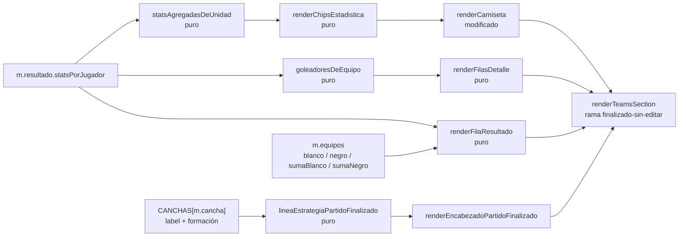
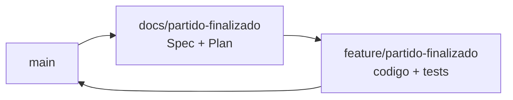

# El partido finalizado (rebanada 4 de "Equipos en el campo") — Implementation Plan

> **Status:** Draft · **Date:** 2026-09-01 · **Owner:** Lucas Manoukian
>
> **Reviewers:** *pending*
>
> **Spec:** [PARTIDO_FINALIZADO_SPEC.md](./PARTIDO_FINALIZADO_SPEC.md)
>
> **Concept note:** [EQUIPOS_EN_EL_CAMPO_CONCEPT.md](../EQUIPOS_EN_EL_CAMPO_CONCEPT.md)
>
> **Planes de las rebanadas anteriores:** [rebanada-1-cancha/CANCHA_IMPLEMENTATION_PLAN.md](../rebanada-1-cancha/CANCHA_IMPLEMENTATION_PLAN.md) ·
> [rebanada-2-arrastre/ARRASTRE_IMPLEMENTATION_PLAN.md](../rebanada-2-arrastre/ARRASTRE_IMPLEMENTATION_PLAN.md) ·
> [rebanada-3-panel-armado/PANEL_ARMADO_IMPLEMENTATION_PLAN.md](../rebanada-3-panel-armado/PANEL_ARMADO_IMPLEMENTATION_PLAN.md)

> **Grounding evidence (`MD-25`).** Este Plan se apoya en el ledger §6.5 del
> Concept Note y en las citas en línea de la Spec. Cada tarea que toca un lugar
> concreto de `index.html` lo cita en la propia tarea. Las líneas citadas
> corresponden al estado del archivo tras el merge de la rebanada 3 (`cc62e58`);
> este Plan no modifica `index.html` en ningún commit anterior a `feature/partido-finalizado`.

## 1. Summary

Se extiende la cancha —ya construida por las rebanadas 1 a 3— al partido
finalizado sin edición en curso. La tarjeta gana un encabezado propio (fecha,
tamaño de cancha, estrategia como texto fijo, Copiar y Editar resultado como
íconos), una fila de resultado con el marcador real, y cada camiseta suma
chips de goles / goles en contra / asistencias. Debajo de cada campo aparece
el detalle en texto de quién metió qué. La píldora de diferencia, la
diferencia por línea y el receipt desaparecen en este estado específico: ya
no hay ningún armado que comparar. Todo dentro de `index.html`, sin
dependencias nuevas y sin tocar el motor ni el modelo de datos.

La decisión que ordena el resto: **el estado "finalizado sin editar" tiene una
única rama de render dentro de `renderTeamsSection`, compartida entre `admin`
y `jugador`**, en vez de duplicarse entre las dos ramas que ya existen (`TD-01`).
Es posible porque `FR-060` de la Spec hace que los dos roles vean lo mismo
salvo el lápiz de editar, que se resuelve con una guarda interna — algo que
**no** pasa en el estado de equipos generados, donde las dos ramas siguen
divergiendo tanto como las dejó la rebanada 3.

El hallazgo que conviene saber antes de leer el resto: la Spec pasó por tres
correcciones durante la redacción de este Plan, registradas en su Change log
del 2026-09-01 — el botón de Copiar se había dado por eliminado sin que hubiera
ninguna decisión que lo pidiera (`FR-009`), las duplas de rotación no tienen
una segunda camiseta donde poner un segundo juego de chips (`FR-036`), y la
fila de resultado también lleva el puntaje de armado, no sólo el nombre del
equipo (`FR-040`/`FR-041`/`FR-042b`). Las tres se resolvieron releyendo el
handoff y el código con más cuidado, no adivinando.

## 2. Goals & non-goals

- **Objetivo técnico 1** — Que el estado finalizado-sin-editar comparta una
  sola rama de render entre `admin` y `jugador`, para no duplicar lo que
  `FR-060` ya hace idéntico entre los dos roles (`TD-01`).
- **Objetivo técnico 2** — Que extender la cancha al partido finalizado sea
  un cambio de una línea en `mostrarCanchaDeEquipos`, reutilizando todo lo que
  `renderZonaEquipos`, `renderSelectorEquipo` y `esFilaEditable` ya resuelven
  por estado (`FR-020`, `FR-021`, `FR-023`).
- **Objetivo técnico 3** — Que los chips, la fila de resultado y las filas de
  detalle salgan de funciones puras, unitariamente verificables sin DOM, con
  el mismo criterio que `TD-01` de la rebanada 3 estableció para el panel.
- **Objetivo técnico 4** — Que ningún número se muestre dos veces en la misma
  pantalla: el encabezado de cada panel de equipo deja de repetir el puntaje y
  el resultado que la fila de resultado ya declara (`FR-042b`).

**No-objetivos:**

- No se toca el motor de generación ni ninguna de sus funciones (`D-01`).
- No se toca la cancha, la camiseta base, el candado, el arrastre, el selector
  de equipo ni el combo de estrategia del estado de equipos generados: las
  rebanadas 1 a 3 los fijaron, y esta rebanada sólo agrega una rama de
  render nueva para el estado finalizado-sin-editar.
- No se modifica `matchResultSummaryHtml` ([`index.html:5082`](../../../index.html#L5082)),
  el resumen de goleadores de la tarjeta colapsada de la lista de partidos.
  `goleadoresDeEquipo` **duplica** parte de su cálculo en vez de extraerlo a
  un compartido — ver `TD-08` y `R-06`, es una decisión consciente, no un
  descuido de `DRY`.
- No se modifica el modelo de datos del resultado ni la pantalla de edición
  (`editandoResultadoFinalizado === m.id`): sigue exactamente como la dejó la
  rebanada 3 hasta la rebanada 6.
- No se agrega telemetría, CI, feature flags ni ninguna infraestructura que el
  proyecto hoy no tenga (`TD-09`).

## 3. Architecture overview



Todo lo que decide un número o un texto queda del lado izquierdo, puro y sin
DOM; `renderCamiseta` y `renderTeamsSection` sólo componen cadenas con esos
resultados. Es la misma frontera que `TD-01` de la rebanada 3 estableció, y es
lo que hace que `S-03`, `S-04` y `S-05` (con sus variantes) tengan test unitario
sin depender de un navegador.

### 3.1 Key design decisions

| ID | Decision | Spec ref | Rationale |
|---|---|---|---|
| TD-01 | El estado finalizado-sin-editar renderiza en una **única** rama dentro de `renderTeamsSection`, compartida por `admin` y `jugador`; la guarda de rol vive **dentro** de `renderEncabezadoPartidoFinalizado` (el lápiz) | `FR-006`, `FR-060`, `FR-061` | `FR-060` hace que los dos roles vean lo mismo salvo el lápiz. Bifurcar la rama completa, como hace el resto de `renderTeamsSection` desde la rebanada 3, duplicaría seis funciones de render para una sola diferencia real |
| TD-02 | `mostrarCanchaDeEquipos` cambia su predicado de `!cerrada && !finalizado` a `!cerradaSinFinalizar && !editandoFinalizado`, con `cerradaSinFinalizar = m.inscripcionCerrada && !finalizado` | `FR-020`, `FR-063`, `FR-064` | Es el cambio mínimo que hace verdadero el predicado exactamente en el estado nuevo, sin tocar ninguno de los otros tres estados que ya cubre (abierto, cerrado-sin-finalizar, finalizado-editando) |
| TD-03 | `esFilaEditable(m)` **no se modifica**: ya devuelve `false` para cualquier partido finalizado, así que el candado y el arrastre quedan suprimidos en la cancha nueva sin ningún cambio de código | `FR-021` | Es una consecuencia gratuita de un predicado que ya existía. Tocarlo sería el tipo de cambio que `TD-02` evita: innecesario |
| TD-04 | `renderCamiseta` decide si dibuja chips leyendo `m.estado === 'Finalizado' && m.resultado && editandoResultadoFinalizado !== m.id` **dentro de la propia función**, sin agregar un parámetro nuevo | `FR-030` a `FR-036` | `renderCamiseta` ya recibe `m` completo y ya lee `m.bloqueados` y `m.equipos` de la misma forma (rebanadas 1 y 3). Agregar un parámetro booleano duplicaría una condición que `m` ya puede responder |
| TD-05 | Los chips de una unidad (jugador suelto o dupla) se calculan con `statsAgregadasDeUnidad(grupo, statsPorJugador)`, que sobre una dupla **suma** los cuatro campos de los dos integrantes, con el mismo criterio que `valorDePuntaje` ([`index.html:3869`](../../../index.html#L3869)) usa para el puntaje combinado | `FR-036` | La dupla se dibuja como una sola camiseta desde la rebanada 1: no hay una segunda superficie donde poner un segundo juego de chips. Sumar es lo único que tiene una única respuesta correcta cuando dos jugadores comparten una camiseta |
| TD-06 | `renderFilasDetalle` usa `goleadoresDeEquipo`, una función **propia** de esta rebanada, en vez de extraer el cálculo que `matchResultSummaryHtml` ya hace en línea ([`index.html:5089-5094`](../../../index.html#L5089-L5094)) | `FR-050` a `FR-057`, Spec §3.2 | La Spec excluye explícitamente modificar `matchResultSummaryHtml` (superficie distinta, fuera del handoff). Extraer un compartido de todos modos habría significado tocarla. La duplicación es el costo consciente de respetar ese límite — ver `R-06` para la deuda que deja |
| TD-07 | `renderFilaResultado` usa **un solo** bloque de marcado; la diferencia entre dos columnas y una columna (mostrar u ocultar el puntaje de armado) es CSS, no una rama en JavaScript | `FR-041`, `FR-042` | Es el mismo patrón que la rebanada 3 usó para la mayoría de sus bloques: una condición en JS sólo cuando cambia qué dato se calcula, nunca cuando sólo cambia si algo se ve u oculta a un ancho dado |
| TD-08 | Las seis funciones puras nuevas viven en `tests/finalizado.test.js`, un archivo de test propio | `AC-50` | Repite el criterio de `TD-08` de la rebanada 3: estas funciones consumen `m.resultado.statsPorJugador`, un dominio de datos que ni `cancha.test.js` (geometría) ni `panel.test.js` (números derivados del motor) cubren. Crear un cuarto archivo es más barato que forzar una lista `DECLARACIONES` que mezcle tres dominios |
| TD-09 | Sin feature flag | `D-12` | Heredado de las tres rebanadas anteriores: no hay infraestructura de flags y el Principio II prohíbe anticiparla |

## 4. Module map

| Module / package | Role | Status |
|---|---|---|
| `index.html` — bloque CSS de la tarjeta (desde [`index.html:342`](../../../index.html#L342)) | Gana el CSS del encabezado del partido finalizado, los chips, la fila de resultado y las filas de detalle | modified |
| `index.html` — `mostrarCanchaDeEquipos` ([`index.html:3891`](../../../index.html#L3891)) | Cambia el predicado (`TD-02`) | modified |
| `index.html` — `esFilaEditable` ([`index.html:3898`](../../../index.html#L3898)) | Sin cambios (`TD-03`) | untouched |
| `index.html` — `renderCamiseta` ([`index.html:4097`](../../../index.html#L4097)) | Gana los chips cuando el partido está finalizado y no se edita (`TD-04`) | modified |
| `index.html` — `renderTeamsSection` ([`index.html:4884`](../../../index.html#L4884)) | Gana la rama única finalizado-sin-editar (`TD-01`) | modified |
| `index.html` — `renderBotoneraTarjeta` ([`index.html:4847`](../../../index.html#L4847)) | Pierde la rama de "Editar resultado" al pie, que se muda al encabezado nuevo | modified |
| `index.html` — `renderZonaEquipos`, `renderSelectorEquipo` | Sin cambios: la extensión de `mostrarCanchaDeEquipos` alcanza (`TD-02`) | untouched |
| `index.html` — `renderEncabezadoTarjeta`, `renderComboEstrategia`, `renderAvisoDesactualizado`, `renderDiferenciaPorLinea`, `renderPorQueQuedaronAsi` | Sin cambios: siguen rigiendo el estado de equipos generados | untouched |
| `index.html` — `totalGolesEquipo`, `formatFecha`, `canchaLabel`, `__editarResultadoFinalizado`, `__copiarFormacion`, `GOAL_ICON`, `RED_GOAL_ICON`, `BOOT_ICON`, `escaparHtml` | Se consumen sin cambios | untouched |
| `tests/finalizado.test.js` | Archivo nuevo: las seis funciones puras de esta rebanada (`TD-08`) | new |
| `tests/layout.test.js` | El escenario `partido-finalizado` gana `comprobar`; `partido-editando` corrige su `preparar`; `partido-jugador` gana `comprobar`; `partido-cerrado` gana una etiqueta; escenario nuevo `finalizado-nueve` | modified |
| `tests/fixtures-app.js` | `m-finalizado` gana `golesEnContra` en dos titulares (uno de ellos parte de la dupla); partido nuevo `m-finalizado-nueve` | modified |
| `docs/equipos-en-el-campo/rebanada-3-panel-armado/PANEL_ARMADO_SPEC.md` | Recibe la anotación recíproca de reemplazo parcial (`FR-060`, la píldora, la diferencia por línea, el receipt, `FR-083b`) | modified |
| `AGENTS.md` | Gana la línea de `node tests/finalizado.test.js` | modified |

## 5. Engineering rules / project conventions reference

Restatadas de [`AGENTS.md`](../../../AGENTS.md).

| Rule | Summary |
|---|---|
| Estructura | Toda la aplicación en `index.html`, dentro de un IIFE. Sin build, sin bundler, sin framework (Principio II, `TC-001`) |
| Imports | No aplica: no hay módulos |
| Typing | No aplica: JavaScript sin type-checker configurado |
| Logging | No aplica |
| Tests | `tests/*.test.js`, se corren con `node tests/<archivo>`. Devuelven 1 solo ante regresión |
| Binding | El identificador de la Spec va en forma canónica con guion **dentro de un string literal**, con el prefijo de rebanada `finalizado/`: el nombre del caso en `tests/finalizado.test.js` y el campo `spec: ['finalizado/S-04a']` de cada escenario de `tests/layout.test.js`. Nunca en comentarios |
| Supply-chain | `none — el repositorio no versiona ningún lockfile; la aplicación no tiene dependencias instaladas` |
| Constants | Los valores del handoff van como custom properties de CSS en el bloque de la tarjeta |
| Commits | Conventional Commits con asunto en español: `tipo(scope): asunto (IDs de la Spec)`, ≤ 72 caracteres, un cambio lógico por commit |
| Backwards compat | Requerida en los datos (`NFR-004`): no se agrega, renombra ni deja de escribir ningún campo. No requerida en la interfaz: el botón de Editar resultado se muda sin dejar el texto viejo detrás de una bandera |
| Lint / type-check | `none — el repositorio no tiene linter ni type-checker configurados`. `T-1.D3` y `T-1.D4` pasan de forma vacua y se declaran como tales |

## 6. Definition of Done (every branch)

- [x] La implementación sigue las convenciones de §5
- [x] Cada sección de la Spec asignada a la rama está implementada
- [x] Cada escenario (`S-*`) y cada variante tiene un test ejecutable (`AC-50`; `T-1.D8` y `T-1.D8b`)
- [x] Cada NFR cuantificado —`NFR-001`, `NFR-002`— tiene un test de medición (`AC-51`; `T-1.D9`)
- [x] Cada `TC-*` de la Spec §4 tiene una entrada de verificación en §12 (`AC-52`; `T-1.D10` y `T-1.D10b`)
- [x] Las consecuencias están enumeradas en §12.2 (`AC-53`; `T-1.D15`)
- [x] Cada NFR cuantificado tiene al menos una fila `OBS-*` en §11 (`AC-54`; `T-1.D16`)
- [x] El lockfile pasa la auditoría, o §5 declara `Supply-chain: none` (`AC-55`; `T-1.D20`)
- [x] Cada riesgo `R-*` de §14 registra una vía de mitigación (`T-1.D17`)
- [x] Auto-consistencia: todo ID referenciado dentro de este Plan resuelve dentro de este Plan (`T-1.D18`)
- [x] Consistencia cruzada: todo ID de la Spec citado acá existe en la Spec, y todo `D-*` existe en el Concept Note (`T-1.D19`)
- [x] Todos los tests nuevos pasan
- [x] Todos los tests existentes pasan, sin regresiones — `node tests/motor.test.js`, `node tests/cancha.test.js`, `node tests/panel.test.js` y `LAYOUT_STRICT=1 node tests/layout.test.js`
- [x] Linter: no aplica (§5), declarado
- [x] Type-checker: no aplica (§5), declarado
- [x] No quedan `TODO`, `FIXME` ni `HACK` en el código commiteado
- [x] El historial de commits es limpio y sigue el formato de §5 (`T-1.D11`)
- [x] La descripción del PR resume los cambios y cita las secciones de la Spec (`T-1.D12`)
- [x] **Gate propio del proyecto:** al menos un escenario nuevo de layout se vio fallar revirtiendo el cambio que lo motiva (Principio V, `TC-032`, `AC-28`), y la pantalla se miró en un navegador real a 360 px y a 1200 px con `node tools/servir-fixture.js` (`T-1.D13`)
- [x] PR abierto contra `main` (`T-1.D14`)

## 7. Branch / phase plan

### 7.0 Branch sizing (`MD-27`)

```
Custom arc: 1 branch — D-11 del Concept Note fija dos ramas por rebanada, `docs/<rebanada>` y `feature/<rebanada>`, y D-08 ya usó la rebanada como unidad de división del trabajo. Mismo criterio que las rebanadas 1 a 3.
```

### 7.1 Branch tracker

| # | Git branch | Base branch | Status | PR | Tests | Notes |
|---|---|---|---|---|---|---|
| 1 | `feature/partido-finalizado` | `main` | Implementado, listo para PR | — | `node tests/finalizado.test.js` y `LAYOUT_STRICT=1 node tests/layout.test.js` pasan; `node tests/motor.test.js`, `node tests/cancha.test.js` y `node tests/panel.test.js` sin regresiones | Abierta después de `docs/partido-finalizado`, según `D-11` |



---

### 7.2 Branch 1 — `feature/partido-finalizado`

**Goal:** que un partido finalizado, sin edición en curso, se lea sobre la
cancha con chips de goles/goles en contra/asistencias, una fila de resultado
con el marcador real y el detalle de goleadores en texto, para los dos roles;
que el botón de editar resultado viva en el encabezado como ícono, junto al de
copiar; y que `node tests/finalizado.test.js` y `node tests/layout.test.js` lo
verifiquen.

**Spec coverage:** `FR-001` a `FR-064` (incluidas las variantes con sufijo), los
cinco `NFR-*`, los dieciséis `TC-*` y los treinta y cinco `AC-*`.

#### 7.2.1 Design decisions specific to this branch

> **El orden importa.** Las funciones puras (`T-1.1`–`T-1.7`) van primero
> porque son lo que hace verificable el resto sin depender de un navegador
> conducido, igual que estableció `TD-01` de la rebanada 3.

> **`mostrarCanchaDeEquipos` es la palanca, no el detalle.** `T-1.8` es una
> tarea de una línea, pero es la que hace que `renderZonaEquipos`, el
> selector segmentado y la ausencia de candado/arrastre empiecen a aplicar al
> partido finalizado sin tocar ninguna de esas tres funciones.

> **El fixture cambia lo que ven los escenarios existentes que abren el mismo
> partido.** `m-finalizado` gana `golesEnContra`, así que `partido-finalizado`,
> `partido-editando` y `partido-jugador` — que ya abren ese partido — pasan a
> ver un dato que antes no existía. Es deliberado (necesario para `S-03b` y
> `S-05c`) y conviene correr la suite completa antes y después de `T-1.20`.

#### 7.2.2 New types / enums

Ninguno. La rebanada no introduce ninguna entidad nueva (Spec §10.1).

#### 7.2.3 New constants

File: `index.html`, en el bloque de custom properties de la tarjeta.

| Constant | Value | Purpose |
|---|---|---|
| `ICON_LAPIZ` | `<svg viewBox="0 0 24 24" aria-hidden="true"><path d="M12 20h9"/><path d="M16.5 3.5a2.1 2.1 0 0 1 3 3L7 19l-4 1 1-4Z"/></svg>` | Ícono del botón de editar resultado (`FR-006`) |
| `--chip-bg` | `#E8EBE6` | Fondo de los chips de estadística (handoff § Chips de estadística; no es un token del design system, excepción de `TC-031`) |
| `--chip-h` | `19px` / compacto `18px` | Alto del chip |
| `--chip-icon` | `13px` / compacto `12px` | Tamaño del ícono dentro del chip |
| `--resultado-num` | `40px` / compacto `30px` | Tamaño del marcador central |
| `--resultado-guion` | `22px` / compacto `17px` | Tamaño del guion entre los dos números |

#### 7.2.4 Configuration

Ninguna configuración nueva.

#### 7.2.5 New / modified interfaces

File: `index.html`

| Función | Firma | Notas |
|---|---|---|
| `formacionTexto` | `(m) -> string` | Pura. `"{defensores}-{volantes}-{delanteros}"` de `CANCHAS[m.cancha].formacion`, nunca una cadena literal (`FR-005b`, `FR-005c`, `TC-035`) |
| `lineaEstrategiaPartidoFinalizado` | `(m, unaColumna) -> string` | Pura. Arma la línea de estrategia según `FR-003`, `FR-005`, `FR-005b`, `FR-005c`: dos columnas + fútbol8 → `"Estrategia: {resumen}"`; dos columnas + fútbol9 → `"Formación {f} · Estrategia: {resumen}"`; una columna + fútbol8 → `"{cancha} · Estrategia: {resumen}"`; una columna + fútbol9 → `"{cancha} · Formación {f} · Estrategia: {resumen}"` |
| `statsAgregadasDeUnidad` | `(grupo, statsPorJugador) -> {goles, golesPenal, golesEnContra, asistencias}` | Pura. Suma los cuatro campos sobre `grupo` (1 o 2 jugadores); ausentes cuentan como 0 (`FR-036`, `TD-05`) |
| `renderChipsEstadistica` | `(stats) -> {asistenciasHtml, golesHtml}` | Pura. Devuelve cadena vacía en cada campo cuando el conteo correspondiente es 0; el chip de goles suma `goles` (incluidos los de penal) y no distingue penal (`FR-030` a `FR-035`) |
| `goleadoresDeEquipo` | `(ids, statsPorJugador) -> [{p, goles, golesPenal, golesEnContra}]` | Pura. Filtra `goles > 0 \|\| golesEnContra > 0`, ordena por `goles` descendente. Función **propia** de esta rebanada, no compartida con `matchResultSummaryHtml` (`TD-06`) |
| `renderFilasDetalle` | `(ids, statsPorJugador) -> string` | Pura. Una línea por goleador con `escaparHtml`; nota "(N de penal)" y "(EC)" en líneas separadas; antepone el nombre en la línea de EC sólo si el jugador no tiene línea de goles propios; "Sin goleadores" si la lista está vacía (`FR-050` a `FR-057`) |
| `renderFilaResultado` | `(m) -> string` | Pura. Nombre de equipo + puntaje de armado (sólo en el marcado; el CSS lo oculta en una columna) + marcador central con `totalGolesEquipo` (`FR-040` a `FR-042`) |
| `renderEncabezadoPartidoFinalizado` | `(m) -> string` | Título (fecha, + cancha en dos columnas), llama a `lineaEstrategiaPartidoFinalizado`, botón de Copiar (siempre) y de Editar resultado (sólo `admin`) (`FR-001` a `FR-009b`) |
| `renderCamiseta` | *(firma sin cambios)* | Gana, al final, el cálculo de `statsAgregadasDeUnidad` + `renderChipsEstadistica` cuando `m.estado === 'Finalizado' && m.resultado && editandoResultadoFinalizado !== m.id`, e inserta los dos fragmentos dentro de `.camiseta-fig` (`TD-04`) |
| `mostrarCanchaDeEquipos` | *(firma sin cambios)* | Predicado reescrito (`TD-02`) |
| `renderBotoneraTarjeta` | *(firma sin cambios)* | Pierde la rama que empujaba el botón de texto "Editar resultado" |
| `renderTeamsSection` | *(firma sin cambios)* | Gana, antes de las dos ramas existentes, el chequeo `finalizadoSinEditar` y su composición única (`TD-01`) |

#### 7.2.6 Tests

```
tests/finalizado.test.js  — funciones puras: 11 escenarios y variantes
tests/layout.test.js      — DOM, medidas y roles: 16 escenarios y variantes
```

| File | What it covers |
|---|---|
| `tests/finalizado.test.js` | `formacionTexto`, `lineaEstrategiaPartidoFinalizado`, `statsAgregadasDeUnidad`, `renderChipsEstadistica`, `goleadoresDeEquipo`, `renderFilasDetalle`, `renderFilaResultado`: chips, dupla, orden de goleadores, escapado, marcador |
| `tests/layout.test.js` | Escenarios `partido-finalizado` (ampliado), `partido-jugador` (ampliado), `partido-editando` (corregido), `partido-cerrado` (etiqueta), `finalizado-nueve` (nuevo) |

#### 7.2.7 Verification

- [x] Un partido finalizado sin editar se dibuja como cancha, con chips en las camisetas que corresponde
- [x] La fila de resultado muestra el marcador real y, en 1200 px, el puntaje de armado de cada equipo
- [x] Debajo de cada campo aparece el detalle de goleadores, o "Sin goleadores"
- [x] El encabezado tiene fecha, estrategia como texto fijo, y los íconos de Copiar y Editar (sólo `admin`)
- [x] Ningún panel de equipo repite el puntaje ni el resultado
- [x] Editar un resultado finalizado sigue mostrando la lista de filas, sin cancha
- [x] `window.__escrituras` no gana claves nuevas al mostrar la tarjeta
- [x] Todos los tests existentes pasan

#### 7.2.8 Files inventory

**New files:**
```
tests/finalizado.test.js
```

**Modified files:**
```
index.html
tests/layout.test.js
tests/fixtures-app.js
AGENTS.md
docs/equipos-en-el-campo/rebanada-3-panel-armado/PANEL_ARMADO_SPEC.md
```

#### 7.2.9 Task checklist (agent-runnable)

Implementation tasks (agrupadas en commits atómicos):

- [x] T-1.1 Agregar `formacionTexto` en `index.html`, junto a `canchaLabel` ([`index.html:1218`](../../../index.html#L1218)) (`FR-005b`, `TC-035`)
- [x] T-1.2 Agregar `lineaEstrategiaPartidoFinalizado`, cubriendo las cuatro combinaciones de `FR-003`, `FR-005`, `FR-005b`, `FR-005c` (`TD-`)
- [x] T-1.3 Agregar `statsAgregadasDeUnidad`, sumando sobre `grupo` con `(stats[id]||{campo}||0)` para tolerar jugadores sin `golesEnContra` en partidos viejos (`FR-036`, `TD-05`)
- [x] T-1.4 Agregar `renderChipsEstadistica`, con el chip de goles sumando `goles` y `golesPenal` en un solo número (`FR-030` a `FR-035`)
- [x] T-1.5 Agregar `goleadoresDeEquipo`, sin compartir código con `matchResultSummaryHtml` (`FR-050`, `FR-056`, `TD-06`)
- [x] T-1.6 Agregar `renderFilasDetalle`, con el desglose de penal y de en contra, el antepuesto de nombre de `FR-054`, y `escaparHtml` en cada nombre (`FR-051` a `FR-057`)
- [x] T-1.7 Agregar `renderFilaResultado`, usando `totalGolesEquipo` ([`index.html:3777`](../../../index.html#L3777)) para el marcador y `m.equipos.sumaBlanco`/`sumaNegro` para el puntaje de armado (`FR-040` a `FR-042`)
- [x] T-1.C1 Commit — `feat(finalizado): funciones puras de chips, fila de resultado y filas de detalle (FR-030, FR-040, FR-050)`

- [x] T-1.8 Reescribir el predicado de `mostrarCanchaDeEquipos` ([`index.html:3891-3896`](../../../index.html#L3891-L3896)) según `TD-02` (`FR-020`, `FR-063`, `FR-064`)
- [x] T-1.9 Verificar por lectura que `esFilaEditable` ([`index.html:3898`](../../../index.html#L3898)) sigue devolviendo `false` para el partido finalizado sin necesitar cambios (`FR-021`, `TD-03`) — tarea de verificación, no de código
- [x] T-1.C2 Commit — `feat(finalizado): la cancha se extiende al partido finalizado sin editar (FR-020)`

- [x] T-1.10 Agregar el CSS del ícono de lápiz reutilizando `.panel-icono` ([`index.html:504`](../../../index.html#L504)) con una clase de color propia `.panel-icono-editar`, sin duplicar la geometría de 44×44 px que esa clase ya fija (`FR-006`, `NFR-002`)
- [x] T-1.11 Agregar el CSS de los chips con las variables de §7.2.3, anclados al borde inferior de `.camiseta-fig` (izquierda para asistencias, derecha para goles/en contra), con `handoff/README.md` § Chips de estadística como referencia de medidas (`FR-030` a `FR-035`, `TC-033`)
- [x] T-1.12 Agregar el CSS de la fila de resultado: `flex` con los tres bloques en dos columnas, y el puntaje de armado oculto por `display:none` en una columna (`FR-041`, `FR-042`, `TC-033`)
- [x] T-1.13 Agregar el CSS de las filas de detalle, reutilizando `escaparHtml`-friendly estructura (nombre + número + ícono + nota), sin tomar clases de `matchResultSummaryHtml` (`TD-06`) (`FR-050` a `FR-057`, `TC-033`)
- [x] T-1.C3 Commit — `feat(finalizado): CSS del lápiz, los chips, la fila de resultado y las filas de detalle (TC-033)`

- [x] T-1.14 Cablear `renderChipsEstadistica`/`statsAgregadasDeUnidad` dentro de `renderCamiseta` ([`index.html:4097`](../../../index.html#L4097)), insertando los dos fragmentos dentro de `.camiseta-fig` junto al pill de puntaje y al candado (`TD-04`) (`FR-030` a `FR-036`)
- [x] T-1.15 Implementar `renderEncabezadoPartidoFinalizado` y cablearla como la nueva rama de `renderTeamsSection` ([`index.html:4884`](../../../index.html#L4884)), activa cuando `m.estado === 'Finalizado' && editandoResultadoFinalizado !== m.id`, **común a `admin` y `jugador`** (`TD-01`) (`FR-001` a `FR-009b`, `FR-060`)
- [x] T-1.16 Dentro de esa misma rama, componer `renderFilaResultado(m)` + `renderZonaEquipos` (con `renderCanchaEquipo(...) + renderFilasDetalle(ids, stats)` como `contenido` de cada panel, y sólo el nombre del equipo como `header`, per `FR-042b`), **sin** llamar a `renderBotoneraTarjeta`: ningún botón de ciclo de vida aplica a este estado (`FR-064`) (`FR-040` a `FR-057`)
- [x] T-1.18 Quitar de `renderBotoneraTarjeta` ([`index.html:4847-4855`](../../../index.html#L4847-L4855)) la rama que empuja el botón de texto "Editar resultado": ya no la invoca nadie desde `T-1.16`, y dejarla sería código muerto (`FR-009`, declaración de reemplazo de `FR-060` de la rebanada 3)
- [x] T-1.C4 Commit — `feat(finalizado): el encabezado, la fila de resultado y las filas de detalle reemplazan el panel de armado en este estado (FR-001, FR-040, FR-050)`

- [x] T-1.19 Corregir el `preparar` del escenario `partido-editando` de `tests/layout.test.js` ([`tests/layout.test.js:1031`](../../../tests/layout.test.js#L1031)): `page.click('button:has-text("Editar resultado")')` deja de encontrar nada porque el botón ya no lleva texto visible; se reemplaza por `page.click('[aria-label="Editar resultado"]')` (`T-1.15` lo hace necesario)
- [x] T-1.C5 Commit — `fix(layout): partido-editando entra por el ícono de editar, no por el texto (FR-006)`

- [x] T-1.20 Agregar `golesEnContra` a dos titulares del fixture `m-finalizado` ([`tests/fixtures-app.js:213-217`](../../../tests/fixtures-app.js#L213-L217)) — uno suelto y uno que forme parte de la dupla `d1` — eligiendo índices donde `goles` ya es válido respecto de `golesPenal` en el patrón existente, para no tapar ni acentuar la inconsistencia preexistente de `i%3`/`i%2` (`S-03b`, `S-05c`)
- [x] T-1.21 Agregar el partido `m-finalizado-nueve` a `tests/fixtures-app.js`, reutilizando `equipos9` ([`tests/fixtures-app.js:179`](../../../tests/fixtures-app.js#L179)) con un `resultado` de muestra (`S-10`, `S-10a`)
- [x] T-1.22 Crear `tests/finalizado.test.js` con su lista `DECLARACIONES`, reutilizando `extraer` de [`tests/harness.js`](../../../tests/harness.js) (`TD-08`)
- [x] T-1.23 Escribir los once casos de unidad de §12.1, con el prefijo `finalizado/` en cada título (`AC-50`)
- [x] T-1.C6 Commit — `test(finalizado): casos de unidad de chips, fila de resultado y filas de detalle (S-03, S-04, S-05)`

- [x] T-1.24 Agregar `comprobar` al escenario `partido-finalizado` ([`tests/layout.test.js:411`](../../../tests/layout.test.js#L411)): cancha presente, chips en las camisetas que corresponde, fila de resultado con marcador y puntaje (1200 px) / sin puntaje (360 px), filas de detalle presentes, ausencia de `.panel-lineas`/`.panel-receipt`/píldora, encabezado de panel sin puntaje ni resultado, y los dos íconos del encabezado nuevo (`S-01`, `S-01a`, `S-02`, `S-02a`, `S-04`, `S-04b`)
- [x] T-1.25 Agregar `comprobar` al escenario `partido-jugador` ([`tests/layout.test.js:1052`](../../../tests/layout.test.js#L1052)): mismo contenido que `partido-finalizado` salvo el lápiz, que no debe existir; más una invocación directa de `window.__editarResultadoFinalizado` que no debe producir escritura (`S-01c`, `S-06`, `S-20`)
- [x] T-1.26 Agregar la etiqueta `finalizado/S-02c` al escenario `partido-cerrado` existente ([`tests/layout.test.js:390`](../../../tests/layout.test.js#L390)): su `comprobar` ya verifica que la tarjeta sigue como lista de filas con la inscripción cerrada y no finalizada, que es exactamente `S-02c`
- [x] T-1.27 Agregar el escenario `finalizado-nueve`, restringido a `anchos: [360, 1200]` (mismo criterio que `partido-editando`), abriendo `m-finalizado-nueve` y comprobando la línea de estrategia en las dos formas de `FR-005b`/`FR-005c` (`S-10`, `S-10a`)
- [x] T-1.C7 Commit — `test(layout): la tarjeta de partido finalizado, el rol jugador y el caso de fútbol 9 (S-01, S-06, S-10)`

- [x] T-1.28 Agregar la anotación recíproca de reemplazo parcial en [`PANEL_ARMADO_SPEC.md`](../rebanada-3-panel-armado/PANEL_ARMADO_SPEC.md): junto a `FR-060`, `FR-003`–`FR-005`/`FR-009`/`FR-037`, `FR-030`–`FR-036`, `FR-040`–`FR-045` y `FR-083b`, una nota de que esta rebanada los reemplaza para el estado finalizado-sin-editar (`OPEN-Q-01` de esta Spec, Principio I)
- [x] T-1.29 [P] Agregar a `AGENTS.md` la línea `node tests/finalizado.test.js` en su bloque de tests
- [x] T-1.C8 Commit — `docs(specs): anotación recíproca en la Spec de la rebanada 3 (OPEN-Q-01)`

- [x] T-1.30 Correr `node tools/servir-fixture.js`, mirar el partido finalizado a 360 px y a 1200 px con el emulador de dispositivo, y registrar en el PR si el puntaje de armado se lee como redundante con el resultado real, o si los chips de un jugador con los tres a la vez se tocan (`R-01`, `R-02`, `T-1.D13`)

DoD verification (§6). Todo cambio de código hecho durante esta verificación va
en su propio commit de arreglo, nunca doblado dentro de uno anterior:

- [x] T-1.D1 Los tests nuevos pasan — `node tests/finalizado.test.js` y `node tests/layout.test.js`
- [x] T-1.D2 Los tests existentes pasan, sin regresiones — `node tests/motor.test.js`, `node tests/cancha.test.js`, `node tests/panel.test.js` y `LAYOUT_STRICT=1 node tests/layout.test.js`
- [x] T-1.D3 Linter — no aplica (§5). Se declara, no se marca en silencio
- [x] T-1.D4 Type-checker — no aplica (§5). Se declara, no se marca en silencio
- [x] T-1.D5 No quedan `TODO`/`FIXME`/`HACK` — `git grep -nE '(TODO|FIXME|HACK)[(:]' -- index.html tests/`
- [x] T-1.D6 La implementación sigue §5
- [x] T-1.D7 Cada `FR-*`, `NFR-*`, `TC-*` y `AC-*` de la Spec está implementado o verificado
- [x] T-1.D8 Cada `S-NN` y cada variante tiene test — `comm -23 <(grep -oE '(^|[^A-Za-z])S-[0-9]+[a-z]*' docs/equipos-en-el-campo/rebanada-4-partido-finalizado/PARTIDO_FINALIZADO_SPEC.md | sed -E 's/^[^S]+//' | sort -u) <(grep -rEho "finalizado/S-[0-9]+[a-z]*" tests/ | sed 's|finalizado/||' | sort -u)` devuelve vacío (`AC-50`)
- [x] T-1.D8b Cada cabecera de escenario de Spec §9 lleva bloque `Variants:` o su declaración explícita — lint `awk` sobre `PARTIDO_FINALIZADO_SPEC.md` devuelve vacío (`AC-50`)
- [x] T-1.D9 `NFR-001` y `NFR-002` tienen test de medición referenciado en §12 (`AC-51`)
- [x] T-1.D10 Cada `TC-*` de Spec §4 aparece en §12 de este Plan — `comm -23 <(grep -oE "TC-[0-9]+" PARTIDO_FINALIZADO_SPEC.md | sort -u) <(sed -n '/^## 12\./,/^## 13\./p' PARTIDO_FINALIZADO_IMPLEMENTATION_PLAN.md | grep -oE "TC-[0-9]+" | sort -u)` devuelve vacío (`AC-52`)
- [x] T-1.D10b Cada `TC-*` de Spec §4 tiene además su criterio en Spec §11.3 (`AC-52`, segundo conjunto)
- [x] T-1.D11 El historial de commits es limpio — `git log --oneline main..HEAD`
- [x] T-1.D12 Descripción del PR redactada
- [x] T-1.D13 **Gate del proyecto:** (a) al menos un escenario nuevo se vio fallar revirtiendo el cambio que lo motiva; (b) la pantalla se miró a 360 px y a 1200 px en un navegador real (`T-1.30`)
- [x] T-1.D14 PR abierto contra `main`
- [x] T-1.D15 §12.2 tiene al menos una fila `IMP-*` por ámbito afectado (`AC-53`)
- [x] T-1.D16 Cada NFR cuantificado tiene fila `OBS-*` en §11 (`AC-54`)
- [x] T-1.D17 Cada `R-*` de §14 registra vía de mitigación
- [x] T-1.D18 Pasada de auto-consistencia dentro de este Plan
- [x] T-1.D19 Pasada de consistencia cruzada contra la Spec y el Concept Note
- [x] T-1.D20 Auditoría de cadena de suministro — §5 declara `Supply-chain: none`, pasa de forma vacua. `git ls-files package-lock.json package.json` sin resultado (`AC-55`)

## 8. Data model & migrations

No hay cambios de esquema ni migraciones. La rebanada sólo **lee**
`m.resultado.statsPorJugador`, sin agregar, renombrar ni dejar de escribir
ningún campo (`NFR-004`). El modelo de datos cambia en la rebanada 5.

## 9. API & contract changes

No hay endpoints ni contratos entre servicios, y no se introduce ningún par
productor/consumidor. No se consume ni se expone ninguna interfaz externa
nueva (Spec §10.2, §10.3).

## 10. Configuration & feature flags

Ninguno (`TD-09`). La red de seguridad de esta rebanada es la rama sin
mergear.

## 11. Observability

> **Declaración honesta, heredada de las tres rebanadas anteriores.** Esta
> aplicación no tiene telemetría de producción. Las filas de abajo son
> señales previas al merge, más el canal real de reportes del grupo.

| ID | Signal | Type | Source | Binds to | Threshold / use |
|---|---|---|---|---|---|
| OBS-01 | Salida de `node tests/layout.test.js` — desborde y elementos fuera del viewport, con la fila de resultado y los chips en pantalla | métrica (pre-merge) | `tests/layout.test.js` | NFR-001 | Falla si hay desborde en cualquiera de los trece anchos |
| OBS-02 | Área y nombre accesible del botón de editar resultado | métrica (pre-merge) | `tests/layout.test.js` | NFR-002 | Falla ante un botón de menos de 44 px o sin nombre accesible |
| OBS-03 | `window.__escrituras` al mostrar la tarjeta de un partido finalizado sin editar | log (pre-merge) | `tests/fixtures-app.js` | NFR-004 | Falla si aparece cualquier clave |
| OBS-04 | Reportes del grupo por su canal habitual tras el merge | señal cualitativa | los usuarios | R-01, R-02, IMP-01 | Único canal post-deploy que este producto tiene |

**Dashboards:** ninguno.

## 12. Test plan

### 12.1 Scenario Traceability Matrix

> **Cómo se eligió el nivel.** Mismo árbol que la rebanada 3: las decisiones
> puras van a `unit`; lo que sólo se puede afirmar sobre el DOM real —
> presencia de bloques, medidas, roles— va a `e2e`, porque el arnés conduce la
> aplicación entera en un navegador.

| Spec scenario | Test | Level | Branch |
|---|---|---|---|
| S-01 (parent) el encabezado | `tests/layout.test.js` escenario `partido-finalizado` (`spec: ['finalizado/S-01']`) | e2e | Branch 1 |
| S-01a `[boundary]` 360 px, sólo fecha | `tests/layout.test.js` escenario `partido-finalizado` (`spec: ['finalizado/S-01a']`) | e2e | Branch 1 |
| S-01b `[boundary]` fútbol 9, dos columnas | `tests/layout.test.js` escenario `finalizado-nueve` (`spec: ['finalizado/S-01b']`) | e2e | Branch 1 |
| S-01c `[failure]` rol jugador, sin lápiz | `tests/layout.test.js` escenario `partido-jugador` (`spec: ['finalizado/S-01c']`) | e2e | Branch 1 |
| S-01d `[failure]` editando, encabezado viejo | `tests/layout.test.js` escenario `partido-editando` (`spec: ['finalizado/S-01d']`) | e2e | Branch 1 |
| S-02 (parent) la cancha reemplaza la lista | `tests/layout.test.js` escenario `partido-finalizado` (`spec: ['finalizado/S-02']`) | e2e | Branch 1 |
| S-02a `[boundary]` 360 px, selector sin drop | `tests/layout.test.js` escenario `partido-finalizado` (`spec: ['finalizado/S-02a']`) | e2e | Branch 1 |
| S-02b `[failure]` editando, sigue la lista | `tests/layout.test.js` escenario `partido-editando` (`spec: ['finalizado/S-02b']`) | e2e | Branch 1 |
| S-02c `[failure]` cerrado sin finalizar | `tests/layout.test.js` escenario `partido-cerrado` (`spec: ['finalizado/S-02c']`) | e2e | Branch 1 |
| S-03 (parent) los chips muestran lo metido | `tests/finalizado.test.js` — `prueba('"finalizado/S-03" …')` + `tests/layout.test.js` `partido-finalizado` | unit + e2e | Branch 1 |
| S-03a `[boundary]` exactamente 1 gol | `tests/finalizado.test.js` — `prueba('"finalizado/S-03a" …')` | unit | Branch 1 |
| S-03b `[boundary]` gol + en contra + asistencia | `tests/finalizado.test.js` — `prueba('"finalizado/S-03b" …')` | unit | Branch 1 |
| S-03c `[boundary]` dupla, chips combinados | `tests/finalizado.test.js` — `prueba('"finalizado/S-03c" …')` | unit | Branch 1 |
| S-03d `[property]` la suma de chips coincide con `stats` | `tests/finalizado.test.js` — `prueba('"finalizado/S-03d" …')` | unit + property | Branch 1 |
| S-04 (parent) la fila de resultado | `tests/finalizado.test.js` — `prueba('"finalizado/S-04" …')` + `tests/layout.test.js` `partido-finalizado` | unit + e2e | Branch 1 |
| S-04a `[boundary]` 0 a 0 | `tests/finalizado.test.js` — `prueba('"finalizado/S-04a" …')` | unit | Branch 1 |
| S-04b `[boundary]` 360 px, sin puntaje de armado | `tests/layout.test.js` escenario `partido-finalizado` (`spec: ['finalizado/S-04b']`) | e2e | Branch 1 |
| S-05 (parent) las filas de detalle | `tests/finalizado.test.js` — `prueba('"finalizado/S-05" …')` + `tests/layout.test.js` `partido-finalizado` | unit + e2e | Branch 1 |
| S-05a `[boundary]` sin goleadores | `tests/finalizado.test.js` — `prueba('"finalizado/S-05a" …')` | unit | Branch 1 |
| S-05b `[boundary]` en contra y propio, un solo nombre | `tests/finalizado.test.js` — `prueba('"finalizado/S-05b" …')` | unit | Branch 1 |
| S-05c `[failure]` nombre con marcado | `tests/finalizado.test.js` — `prueba('"finalizado/S-05c" …')` | unit | Branch 1 |
| S-10 fútbol 9, dos columnas | `tests/layout.test.js` escenario `finalizado-nueve` (`spec: ['finalizado/S-10']`) | e2e | Branch 1 |
| S-10a `[boundary]` fútbol 9, una columna | `tests/layout.test.js` escenario `finalizado-nueve` (`spec: ['finalizado/S-10a']`) | e2e | Branch 1 |
| S-20 sesión sin permiso invoca la edición | `tests/layout.test.js` escenario `partido-jugador` (`spec: ['finalizado/S-20']`) | e2e | Branch 1 |

Reparto resultante: **11 filas `unit`** (una de ellas además `property`) y **16
filas `e2e`** (tres de ellas —`S-03`, `S-04`, `S-05`— comparten fila entre unit
y e2e, así que el total de la Spec, 24 scenarios/variants, se cuenta una sola
vez cada uno). No se declara ninguna
proporción objetivo (`MD-22`).

### 12.2 Impact Traceability

| ID | Scope | Description | Triggered by | Risk | OBS | Mitigation task |
|---|---|---|---|---|---|---|
| IMP-01 | business | El puntaje de armado ("52.5 pts") vuelve a aparecer en la fila de resultado de un partido finalizado, después de que la rebanada 3 lo había retirado del encabezado de panel para el estado de equipos generados. Puede leerse como un dato redundante junto al resultado real | FR-041 | R-01 | OBS-04 | `T-1.30` |
| IMP-02 | business | El botón de editar resultado deja de tener texto visible ("Editar resultado") y pasa a ser un ícono con `aria-label`. Un administrador acostumbrado al texto tiene que aprender el nuevo lugar | FR-006 | R-02 | OBS-04 | `T-1.30` |
| IMP-03 | code | `index.html` gana siete funciones puras y modifica tres funciones existentes (`mostrarCanchaDeEquipos`, `renderCamiseta`, `renderBotoneraTarjeta`) más el punto de entrada de `renderTeamsSection` | FR-020, FR-030, TD-01 | R-04 | — | `T-1.1`–`T-1.18` |
| IMP-04 | system | El escenario `partido-editando` de `tests/layout.test.js` deja de encontrar el botón por texto y necesita el selector por `aria-label`; si alguna otra prueba o herramienta externa buscaba ese mismo texto, se rompe en silencio | FR-006 | R-03 | — | `T-1.19` |
| IMP-05 | code | Las funciones de `matchResultSummaryHtml` y `goleadoresDeEquipo` quedan **conscientemente duplicadas** en su cálculo de goleadores. Un cambio futuro en una regla de negocio (p. ej. cómo se cuenta un gol en contra) tiene que aplicarse en los dos lugares | TD-06 | R-06 | — | *(sin tarea de mitigación: deuda registrada, no resuelta en esta rebanada)* |
| IMP-06 | code | La Spec de la rebanada 3 queda con anotación recíproca pendiente hasta `T-1.28`: seis grupos de `FR-*` marcados como reemplazados | FR-060 | R-05 | — | `T-1.28` |

### 12.3 Unit tests

`tests/finalizado.test.js`, sin navegador, archivo nuevo (`TD-08`). Su lista
`DECLARACIONES` lleva, en orden de dependencia: `escaparHtml`, `fullName`,
`CANCHAS`, `totalGolesEquipo`, más las siete funciones nuevas de `T-1.1`–`T-1.7`.
El prelude declara `players` con setter, con el mismo criterio que
`panel.test.js` usa para `motorConfig`.

Cubre las once filas unitarias de §12.1.

### 12.4 Integration tests

No aplica como categoría propia (mismo razonamiento que las rebanadas
anteriores: no hay módulos que integrar entre sí).

### 12.5 Contract tests

No aplica: no hay par productor/consumidor (§9).

### 12.6 End-to-end / smoke tests

`tests/layout.test.js` sobre la aplicación real. Escenario nuevo
`finalizado-nueve`; los escenarios `partido-finalizado`, `partido-jugador`,
`partido-editando` y `partido-cerrado` que ya existen ganan `comprobar` nuevo
o corregido y las etiquetas `spec:` de esta rebanada.

### 12.7 Manual QA

`T-1.30`: mirar el partido finalizado a 360 px y a 1200 px en un navegador
real con `node tools/servir-fixture.js`, y registrar en el PR si el puntaje
de armado se lee como redundante (`IMP-01`, `R-01`) y si algún administrador
en el uso real no encuentra el lápiz (`IMP-02`, `R-02`).

### 12.8 Performance tests

No aplica: esta rebanada no define ningún NFR de rendimiento (es una vista de
sólo lectura sin recálculo en caliente, a diferencia de la rebanada 3).

### 12.9 Verificación de las restricciones técnicas

| TC | Evidencia | Forma |
|---|---|---|
| TC-001 | Revisión de código: no aparece `support.js` ni ningún motor de plantillas (`AC-20`) | revisor |
| TC-002 | `git ls-files package-lock.json` sigue sin devolver nada (`T-1.D20`, `AC-21`) | mecánica |
| TC-010 | Revisión de código: chips, fila de resultado y filas de detalle usan sólo `statsPorJugador` y `totalGolesEquipo`, sin una segunda fuente (`AC-22`) | mecánica + revisor |
| TC-011 | Escenario `partido-finalizado`: `window.__escrituras` queda vacío (`OBS-03`, `AC-23`) | mecánica |
| TC-012 | Revisión de código: el ícono de editar invoca `window.__editarResultadoFinalizado` sin envolverla (`AC-24`) | revisor |
| TC-013 | Revisión de código: los chips usan `GOAL_ICON`/`RED_GOAL_ICON`/`BOOT_ICON` existentes (`AC-25`) | revisor |
| TC-014 | Revisión de código: título y etiqueta de cancha usan `formatFecha`/`canchaLabel` sin reimplementarlas (`AC-26`) | revisor |
| TC-020 | Revisión de código: ningún campo de dato nuevo, ningún destinatario nuevo (`AC-33b`) | revisor |
| TC-030 / TC-031 | Revisión de código contra el design system: la lista de excepciones de §7.2.3 cubre cada literal (`AC-27`) | revisor |
| TC-032 | `T-1.D13(a)`: un escenario nuevo se vio fallar revirtiendo el cambio que lo motiva (`AC-28`) | revisor, con evidencia en el PR |
| TC-033 | Revisión de código contra `handoff/README.md`, valor por valor (`T-1.11`–`T-1.13`, `AC-29`) | revisor |
| TC-034 | Revisión de código: las discrepancias del handoff quedan resueltas como la Spec indica y anotadas en §15.1 (`AC-30`) | revisor |
| TC-035 | `tests/finalizado.test.js` — caso de unidad de `formacionTexto` sobre las dos canchas soportadas, más `git grep -n "3-4-1" index.html` devolviendo sólo comentarios/fixtures, nunca dentro de `lineaEstrategiaPartidoFinalizado` (`AC-31`) | mecánica |
| TC-040 | Escenario `partido-jugador` `S-20`, más revisión de que la guarda está dentro de `__editarResultadoFinalizado` (`AC-32`) | mecánica + revisor |
| TC-041 | `tests/finalizado.test.js` — `S-05c` (`AC-33`) | mecánica |

## 13. Rollout plan

No hay despliegue progresivo ni flag: el proyecto publica por merge a `main`.

1. Mergear `docs/partido-finalizado` a `main` (Spec y Plan), según `D-11`.
2. Abrir `feature/partido-finalizado` desde `main` y ejecutar §7.2.9.
3. Probar la rama abriendo `index.html` localmente, que apunta a staging
   automáticamente ([`README.md:51`](../../../README.md)).
4. Mirar el partido finalizado a 360 px y a 1200 px con el emulador de
   dispositivo (`T-1.30`, `T-1.D13`).
5. Mergear `feature/partido-finalizado` a `main`.
6. **Escuchar `OBS-04` en el próximo partido real finalizado.** Es lo que
   comprueba si el puntaje de armado se lee como redundante (`IMP-01`) y si
   el lápiz se encuentra sin buscarlo (`IMP-02`).

**Rollback:** revertir el merge. No hay dato que deshacer: la rebanada no
escribe ningún campo (`NFR-004`).

## 14. Risks & rollback

| ID | Risk | Likelihood | Severity | Detection signal | Mitigation task | Rollback procedure |
|---|---|---|---|---|---|---|
| R-01 | El puntaje de armado en la fila de resultado se lee como redundante junto al marcador real | Med | Low | OBS-04 | `T-1.30` lo mira antes de mergear | Ocultar el puntaje también en dos columnas, dejando sólo el marcador |
| R-02 | Un administrador no encuentra el ícono de editar resultado sin el texto que tenía antes | Med | Med | OBS-04 | `T-1.30`; el ícono lleva `aria-label` y `title` (`FR-007`) | Agregar un texto corto visible junto al ícono, o volver al botón de texto |
| R-03 | Otra herramienta o test externo dependía del texto "Editar resultado" del botón | Low | Med | Cualquier test que falle buscando ese texto | `T-1.19` corrige el único caso conocido dentro del repositorio | Buscar por `aria-label` en cualquier otro lugar que lo necesite |
| R-04 | Extraer la rama `finalizadoSinEditar` de `renderTeamsSection` introduce una regresión en el estado de equipos generados, que no se toca a propósito pero comparte la misma función | Low | High | `node tests/panel.test.js`, `LAYOUT_STRICT=1 node tests/layout.test.js` | La rama nueva se agrega **antes** de las dos existentes y retorna temprano; no se modifica ninguna línea de las ramas viejas | Revertir el commit de `T-1.C4`, que es el único que toca `renderTeamsSection` |
| R-05 | La Spec de la rebanada 3 queda sin anotación recíproca y alguien la lee como vigente para el estado finalizado | Med | Low | Ninguna automática — es documentación | `T-1.28` | No aplica: es una corrección de documentos |
| R-06 | `goleadoresDeEquipo` y el cálculo en línea de `matchResultSummaryHtml` divergen con el tiempo, porque son dos implementaciones del mismo criterio | Med | Low | Ninguna automática — ninguna prueba las compara entre sí | `accepted (rationale: la Spec §3.2 excluye modificar matchResultSummaryHtml; unificar queda para una revisión futura, ver Plan OPEN-Q-01)` | Extraer el cálculo compartido cuando se decida tocar `matchResultSummaryHtml` por otro motivo |

**Worst-case blast radius:** un partido finalizado que se lee distinto y con
un dato (el puntaje de armado) que alguien puede considerar de más. Ningún
dato queda afectado: la rebanada no escribe ningún campo.

## 15. Open questions & assumptions

### 15.1 Open questions

| ID | Question | Owner | Resolution by branch | Notes |
|---|---|---|---|---|
| OPEN-Q-01 | ¿Quién hace la anotación recíproca en la Spec de la rebanada 3? | Lucas Manoukian | Branch 1 | La hace este Plan, en `T-1.28`. Resuelve la `OPEN-Q-01` de la Spec |
| OPEN-Q-02 | ¿La caption compacta de fútbol 9 debería seguir el formato corto del handoff? | Lucas Manoukian | Ninguna — se decide mirándolo | Heredada de Spec `OPEN-Q-02`. `T-1.30` puede alimentarla con evidencia si se mira el caso real |
| OPEN-Q-03 | `[UNVERIFIED — offline; no se consultó https://cwe.mitre.org/top25/ en esta sesión]` — ¿el ranking vigente del CWE Top 25 confirma las categorías de Spec §4.5? | Lucas Manoukian | Ninguna — se traslada | Deuda de verificación heredada de Spec §4.5 y §17, arrastrada acá según `MD-26` |
| OPEN-Q-04 | ¿`goleadoresDeEquipo` y el cálculo de `matchResultSummaryHtml` deberían unificarse en una función compartida? | Lucas Manoukian | Ninguna — se traslada | Levantada por `TD-06`/`R-06`. No se resuelve ahora porque tocar `matchResultSummaryHtml` está fuera del alcance de esta rebanada (Spec §3.2); se revisa la próxima vez que esa función necesite un cambio por otro motivo |

### 15.2 Assumptions

| ID | Assumption | Owner | If false |
|---|---|---|---|
| A-01 | `m.resultado.statsPorJugador` mantiene la forma `{goles, golesPenal, golesEnContra, asistencias}` por jugador. Restata `A-01` de la Spec | Lucas Manoukian | `statsAgregadasDeUnidad` deja de sumar un campo real; se revisa contra el modelo actual |
| A-02 | `CANCHAS[m.cancha].formacion` sigue existiendo con `{defensores, volantes, delanteros}`. Restata `A-02` de la Spec | Lucas Manoukian | `formacionTexto` se actualiza para leer la forma nueva |
| A-03 | El patrón `i % 3` / `i % 2` de `m-finalizado` en `tests/fixtures-app.js` deja algunos titulares con `golesPenal > goles` (dato inválido); esta rebanada no lo corrige porque está fuera de su alcance y otras specs ya conviven con él | Lucas Manoukian | Si algún escenario nuevo termina dependiendo justo de uno de esos índices inválidos, se elige otro índice en `T-1.20` |

## 16. Acceptance criteria coverage

| Spec AC | Satisfied by | Test |
|---|---|---|
| AC-01 | Branch 1, §7.2.9 completo | `tests/finalizado.test.js` + `tests/layout.test.js`, las 24 filas de §12.1 |
| AC-02 | `T-1.15`, `T-1.16` | `tests/layout.test.js` escenario `partido-finalizado` (`finalizado/S-01`, `finalizado/S-02`) |
| AC-03 | `T-1.8` (sin cambio de comportamiento en editando) | `tests/layout.test.js` escenario `partido-editando` (`finalizado/S-01d`, `finalizado/S-02b`) |
| AC-04 | `T-1.4`, `T-1.6` | `tests/finalizado.test.js` (`finalizado/S-03`, `finalizado/S-05`) |
| AC-05 | `T-1.7`, `T-1.16` | `tests/layout.test.js` escenario `partido-finalizado` (`finalizado/S-04`, `finalizado/S-04b`) |
| AC-06 | `T-1.15` (`TD-01`), `T-1.25` | `tests/layout.test.js` escenario `partido-jugador`: presencia de cancha, chips, fila de resultado y filas de detalle (`finalizado/S-01c` cubre la ausencia del lápiz; la presencia del resto no tiene un `S-*` propio porque `TD-01` la hace idéntica a la de `admin`, así que la comprueba el mismo `comprobar` sin una variante dedicada) |
| AC-07 | `T-1.2` | `tests/layout.test.js` escenario `finalizado-nueve` (`finalizado/S-10`, `finalizado/S-10a`) |
| AC-10 | `T-1.24`, `T-1.27`, `T-1.D1` | `node tests/layout.test.js` — trece anchos, sin desborde (`OBS-01`) |
| AC-11 | `T-1.10` | `tests/layout.test.js` — medida del botón de editar (`OBS-02`) |
| AC-12 | `T-1.10` | `tests/layout.test.js` — nombre accesible y no-color-only |
| AC-13 | `T-1.24` | `tests/layout.test.js` — `window.__escrituras` vacío (`OBS-03`) |
| AC-14 | §7.2.3 | Revisión de código: lista de excepciones |
| AC-20 | `T-1.D6` | Revisión de código en el PR (§12.9, `TC-001`) |
| AC-21 | `T-1.D20` | `git ls-files package-lock.json` sin resultado (§12.9, `TC-002`) |
| AC-22 | `T-1.3`–`T-1.7` | Revisión de código (§12.9, `TC-010`) |
| AC-23 | `T-1.24` | `tests/layout.test.js` — diff sin escrituras (§12.9, `TC-011`) |
| AC-24 | `T-1.15` | Revisión de código (§12.9, `TC-012`) |
| AC-25 | `T-1.4`, `T-1.6` | Revisión de código (§12.9, `TC-013`) |
| AC-26 | `T-1.1`, `T-1.15` | Revisión de código (§12.9, `TC-014`) |
| AC-27 | §7.2.3 | Revisión de código contra design system (§12.9, `TC-030`, `TC-031`) |
| AC-28 | `T-1.D13(a)` | Evidencia en el PR (§12.9, `TC-032`) |
| AC-29 | `T-1.11`–`T-1.13` | Revisión de código contra el handoff (§12.9, `TC-033`) |
| AC-30 | `T-1.D6` | Revisión de código; discrepancias anotadas en §15.1 (§12.9, `TC-034`) |
| AC-31 | `T-1.1` | `tests/finalizado.test.js` — caso de unidad de `formacionTexto` + `git grep` de `"3-4-1"` (§12.9, `TC-035`) |
| AC-32 | `T-1.25` | `tests/layout.test.js` escenario `partido-jugador` (`finalizado/S-20`) (§12.9, `TC-040`) |
| AC-33 | `T-1.6` | `tests/finalizado.test.js` (`finalizado/S-05c`) (§12.9, `TC-041`) |
| AC-33b | `T-1.D6` | Revisión de código en el PR (§12.9, `TC-020`) |
| AC-40 | `T-1.25` | `tests/layout.test.js` escenario `partido-jugador` (`finalizado/S-20`) |
| AC-41 | `T-1.6` | `tests/finalizado.test.js` (`finalizado/S-05c`) |
| AC-50 | `T-1.D8`, `T-1.D8b` | Gates mecánicos |
| AC-51 | `T-1.D9` | `OBS-01`, `OBS-02` cubren `NFR-001`, `NFR-002` |
| AC-52 | `T-1.D10`, `T-1.D10b` | Gates mecánicos sobre §12.9 de este Plan y §11.3 de la Spec |
| AC-53 | `T-1.D15` | §12.2: seis filas `IMP-*` sobre los tres ámbitos |
| AC-54 | `T-1.D16` | §11: `OBS-01`, `OBS-02` con su columna *Binds to* |
| AC-55 | `T-1.D20` | §5 declara `Supply-chain: none`; se satisface de forma vacua |

## 17. Change log

| Date | Author | Change |
|---|---|---|
| 2026-09-01 | Lucas Manoukian | **Registro de lo que la implementación encontró.** Seis hallazgos. **(1)** `--chip-bg: #E8EBE6` de §7.2.3 colisionaba con `--chip-bg` de la rebanada 1, que ya nombra el color de relleno de la camiseta (`.cancha .blanco-eq{ --chip-bg: #ffffff }` / `.negro-eq{ --chip-bg: #111827 }`); usar el mismo nombre habría pisado el dibujo de la camiseta. Se renombró a `--stat-bg`, y por consistencia `--chip-h`/`--chip-icon` a `--stat-h`/`--stat-icon`, sumando `--stat-fs`/`--stat-edge`/`--stat-pad`/`--stat-gap` (no enumeradas en §7.2.3) para las seis variables que el handoff hace variar entre el tamaño grande y el compacto. **(2)** `T-1.25` citaba `finalizado/S-06`, un identificador que no existe en ningún lado de la Spec (§9 no tiene `S-06`); se omitió y `partido-jugador` quedó con `finalizado/S-01c` y `finalizado/S-20`, que sí son los que corresponden. **(3)** Los tags viejos de `partido-finalizado` (`cancha/S-10a`, `arrastre/S-10a`, `panel/S-11a`) describían "partido finalizado: sin cancha, sin selector, mismo resultado que cerrado" — exactamente lo que `FR-020` invierte. Se reemplazaron por los de esta Spec en vez de dejarlos, que hubiera sido una aserción de test falsa. **(4)** `T-1.28` nombraba `FR-083b` para la anotación recíproca pero no `FR-083`, que es el requisito que literalmente dice "finalizado: lista de filas, no cancha" — el que esta rebanada invierte para el estado sin editar. Se agregó `FR-083` a la anotación de `PANEL_ARMADO_SPEC.md` por la misma razón que `FR-083b`. **(5)** `T-1.30`: mirado en Chromium real (conducido por Playwright, admin y jugador, 360 y 1200 px) sobre el partido testigo con la dupla Claudio/Juan compartiendo gol y gol en contra. El puntaje de armado junto al marcador real no se leyó como redundante ni los chips se tocaron; sin hallazgos que graduar en `R-01`/`R-02`. **(6)** Los nueve commits de §7.2.9 (`T-1.C1` a `T-1.C8`, ocho más el de docs) se ejecutaron como siete: `T-1.19` (el `preparar` de `partido-editando` por `aria-label`) quedó en el mismo commit que sus escenarios de layout, porque el fix y la etiqueta nueva de ese mismo escenario caen en el mismo hunk de diff y partirlos después no daba ninguna ganancia de bisección. |
| 2026-09-01 | Lucas Manoukian | Initial draft. Deriva de `PARTIDO_FINALIZADO_SPEC.md` con una rama (`Custom arc: 1 branch`, como las tres rebanadas anteriores) y ocho commits atómicos. Resuelve la `OPEN-Q-01` de la Spec (`T-1.28`) y traslada sus otras dos más la deuda de verificación del CWE Top 25. Decisión central: el estado finalizado-sin-editar comparte una única rama de render entre `admin` y `jugador` (`TD-01`), a diferencia de las ramas separadas que el resto de `renderTeamsSection` mantiene desde la rebanada 3 — posible porque `FR-060` hace que los dos roles vean lo mismo salvo el lápiz. Registra un hallazgo de la lectura del código que ninguno de los tres documentos anteriores podía anticipar: el escenario `partido-editando` de `tests/layout.test.js` abre el partido finalizado haciendo clic en el botón **por su texto** (`page.click('button:has-text("Editar resultado")')`); mudar ese botón a un ícono sin texto rompe ese `preparar` si no se corrige (`T-1.19`, `IMP-04`). Registra además una deuda consciente: `goleadoresDeEquipo` duplica parte del cálculo que `matchResultSummaryHtml` ya hace, en vez de extraer un compartido, porque la Spec excluye tocar esa función (`TD-06`, `R-06`, `OPEN-Q-04`). Self-critique: passed (0🔴 / 4🟡 / 2🔵), los seis resueltos. Los 🟡: `T-1.17` no correspondía a ningún cambio de código real —describía una ausencia, no una tarea— y además citaba hacia adelante a `T-1.18`; se fusionó su contenido en `T-1.16` y se eliminó como tarea propia (el hueco en la numeración queda igual que en la rebanada 3). `AC-31` citaba un test `finalizado/TC-035` inventado: los `TC-*` no se embeben como identificador de escenario según la convención de `AGENTS.md`, sólo los `S-*`; se corrigió a un caso de unidad de `formacionTexto` más un `git grep`. El reparto de filas `unit`/`e2e` de §12.1 estaba mal contado en cuatro lugares (10/14 en vez de 11/16, arrastrado a §7.2.6 y a dos tareas) — se recontó fila por fila y se corrigieron las cuatro apariciones. El total de `TC-*` y `AC-*` de la Spec en el resumen de §7.2 decía "quince" y "cuarenta y uno" cuando son dieciséis y treinta y cinco; se recontaron directamente sobre la Spec. Los 🔵: quedó un `TD-` suelto y sin completar en la fila de `formacionTexto` de §7.2.5 (corregido); ningún `D-*` del Concept Note se cita por ID explícito en este Plan más allá de `D-01`/`D-08`/`D-11`/`D-12`/`D-21`/`D-24` en la tabla `TD-*` — no se agregó nada porque la Spec §3.3 ya los hereda todos y repetirlos acá sería paráfrasis, no cita nueva. |

---

*Este Plan es el contrato ejecutable de la rebanada 4. Lo que el sistema debe
hacer vive en [PARTIDO_FINALIZADO_SPEC.md](./PARTIDO_FINALIZADO_SPEC.md); la
motivación y el fundamento de las decisiones, en
[EQUIPOS_EN_EL_CAMPO_CONCEPT.md](../EQUIPOS_EN_EL_CAMPO_CONCEPT.md).*
