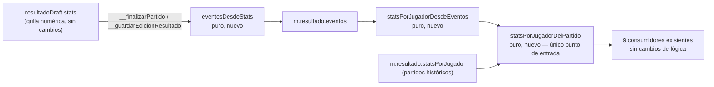
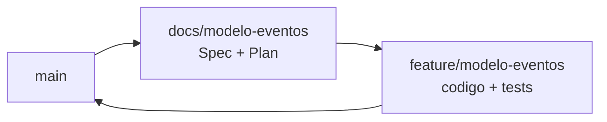

# El modelo de eventos (rebanada 5 de "Equipos en el campo") — Implementation Plan

> **Status:** Draft · **Date:** 2026-09-01 · **Owner:** Lucas Manoukian
>
> **Reviewers:** *pending*
>
> **Spec:** [MODELO_EVENTOS_SPEC.md](./MODELO_EVENTOS_SPEC.md)
>
> **Concept note:** [EQUIPOS_EN_EL_CAMPO_CONCEPT.md](../EQUIPOS_EN_EL_CAMPO_CONCEPT.md)
>
> **Planes de las rebanadas anteriores:** [rebanada-1-cancha/CANCHA_IMPLEMENTATION_PLAN.md](../rebanada-1-cancha/CANCHA_IMPLEMENTATION_PLAN.md) ·
> [rebanada-2-arrastre/ARRASTRE_IMPLEMENTATION_PLAN.md](../rebanada-2-arrastre/ARRASTRE_IMPLEMENTATION_PLAN.md) ·
> [rebanada-3-panel-armado/PANEL_ARMADO_IMPLEMENTATION_PLAN.md](../rebanada-3-panel-armado/PANEL_ARMADO_IMPLEMENTATION_PLAN.md) ·
> [rebanada-4-partido-finalizado/PARTIDO_FINALIZADO_IMPLEMENTATION_PLAN.md](../rebanada-4-partido-finalizado/PARTIDO_FINALIZADO_IMPLEMENTATION_PLAN.md)

> **Grounding evidence (`MD-25`).** Este Plan se apoya en el ledger §6.5 del
> Concept Note y en las citas en línea de la Spec. Cada tarea que toca un
> lugar concreto de `index.html` lo cita en la propia tarea. Las líneas
> citadas corresponden al estado del archivo tras el merge de la rebanada 4
> (`65f5701`); este Plan no modifica `index.html` en ningún commit anterior a
> `feature/modelo-eventos`.

## 1. Summary

Se agregan tres funciones puras a `index.html` —derivación, síntesis y un
único despachador— y se cablean en los once puntos donde el resultado de un
partido hoy se lee o se escribe. Al finalizar un partido por primera vez,
`__finalizarPartido` pasa a escribir `m.resultado.eventos` (una lista
ordenada) en vez de `m.resultado.statsPorJugador` (cuatro contadores); los
nueve puntos de lectura pasan por el despachador, que deriva los mismos
cuatro contadores sin que ninguna de las funciones que ya los consumen
cambie una sola línea. Los partidos finalizados antes de esta rebanada
(y los que se editan sin tener aún `eventos`) siguen escribiendo y leyendo
`statsPorJugador` exactamente igual que hoy: no hay conversión en ningún
sentido.

Ningún archivo de CSS ni de layout cambia: es la única rebanada de las
siete sin superficie visual (`D-08`), así que su Definition of Done
reemplaza el gate visual de las rebanadas 1 a 4 (mirar la pantalla a 360 px)
por uno de equivalencia de datos: un test de propiedad que confirma que
sintetizar y luego derivar un borrador cualquiera devuelve exactamente ese
mismo borrador.

## 2. Goals & non-goals

- **Objetivo técnico 1** — Que exista una única función de derivación y una
  única de síntesis (`TC-010`, `TC-011`), de modo que los once puntos de
  lectura/escritura existentes cambien de dónde llaman, nunca de qué
  calculan.
- **Objetivo técnico 2** — Que la derivación incluya siempre una entrada por
  jugador convocado, aunque esté en cero, para no romper
  `recomputeAllPlayerStatsFromMatches`, que cuenta partidos jugados
  iterando las claves del objeto de estadísticas (`FR-014b`).
- **Objetivo técnico 3** — Que un partido histórico nunca reciba la clave
  `eventos`, ni siquiera al editarlo: el camino de escritura decide el
  formato mirando si esa clave **ya** existe, no reescribiéndola de cero
  (`FR-022`, `FR-023`, `D-06`).
- **Objetivo técnico 4** — Que la equivalencia de datos (`NFR-001`) quede
  demostrada con un test de propiedad, no con un puñado de casos elegidos a
  mano.

**No-objetivos:**

- No se toca ninguna pantalla: ni la grilla numérica de carga/edición, ni la
  cancha con chips de la rebanada 4. Cero líneas de CSS nuevas.
- No se implementa Deshacer, el botón `−` por familia, ni ningún control que
  exponga la secuencia de eventos (rebanada 6, `D-08`).
- No se migra ningún partido histórico. Ningún commit de esta rama recorre
  `matches` para reescribir su forma.
- No se toca el motor de generación de equipos (`D-01`).
- No se agrega telemetría, CI, feature flags ni infraestructura que el
  proyecto hoy no tenga (`TD-09`).

## 3. Architecture overview



La flecha que importa es que `consumers` —`totalGolesEquipo`,
`statsAgregadasDeUnidad`, `goleadoresDeEquipo`, `renderFilasDetalle`,
`renderChipsEstadistica`, `recomputeAllPlayerStatsFromMatches`,
`renderStatsYPuntajeMiembro`, `renderFilaResultado`,
`matchResultSummaryHtml`— sólo recibe un objeto ya resuelto: ninguno sabe si
viene de `eventos` o de `statsPorJugador`, y ninguno cambia de código en esta
rebanada (`TC-010`).

### 3.1 Key design decisions

| ID | Decision | Spec ref | Rationale |
|---|---|---|---|
| TD-01 | La derivación vive en `statsPorJugadorDesdeEventos(eventos, idsConvocados)`; el despacho legado/nuevo vive en una función separada, `statsPorJugadorDelPartido(m)`, que decide el formato y delega | `FR-010` a `FR-016`, `TC-010` | Separar "decidir qué formato" de "calcular sobre eventos" hace que la segunda función sea trivialmente testeable con un arreglo de eventos suelto, sin necesitar un objeto `m` completo |
| TD-02 | El discriminador de formato es `Array.isArray(m.resultado.eventos)`, evaluado una sola vez, dentro de `statsPorJugadorDelPartido` — no se agrega ningún campo booleano nuevo como `m.resultado.formato` | `FR-031` | Un campo aparte podría desincronizarse de cuál de las dos claves existe realmente. La presencia del arreglo ya es la fuente de verdad; agregar un segundo dato que diga lo mismo violaría el principio de una sola fuente de verdad por dato |
| TD-03 | `eventosDesdeStats(idsOrdenados, statsPorJugador)` recibe el orden de jugadores como parámetro explícito, en vez de leer `m.equipos` por su cuenta | `FR-021` | La misma función sirve tanto para `__finalizarPartido` (que arma el orden desde `m.equipos.blanco`/`negro`) como para un futuro llamador que ya tenga el orden resuelto de otra forma; mantiene la función pura y sin acoplar su firma a la forma de `m` |
| TD-04 | `__guardarEdicionResultado` decide entre escribir `eventos` o `statsPorJugador` mirando si `m.resultado.eventos` **ya** existe antes de la edición, nunca recalculando el formato desde otra señal (fecha, presencia de `m.equipos`, etc.) | `FR-022`, `FR-023`, `D-06` | Es la única señal que no puede mentir: si la clave ya estaba, el partido nació con este modelo; si no, nació antes. Cualquier otra heurística (por fecha, por versión de la app) podría desincronizarse de la realidad del documento |
| TD-05 | Las tres funciones nuevas se agregan como funciones libres dentro del IIFE, inmediatamente antes de `totalGolesEquipo` ([`index.html:3852`](../../../index.html#L3852)), en el mismo bloque de funciones puras sobre `stats` | `TC-001` | Es el vecindario de código que ya opera sobre la forma `{goles, golesPenal, golesEnContra, asistencias}` (`totalGolesEquipo` está literalmente al lado); agregarlas ahí evita dispersarlas entre el bloque de escritura (`~3765`) y el de lectura (`~5164`) |
| TD-06 | Las pruebas de las tres funciones nuevas viven en un archivo propio, `tests/eventos.test.js`, con su propia lista `DECLARACIONES` | `AC-50` | Mismo criterio que `TD-08` de la rebanada 4: es un dominio de datos (el evento) que ni `finalizado.test.js` (chips/fila/detalle, que no cambian) ni `panel.test.js` cubren. `recomputeAllPlayerStatsFromMatches` se extrae también acá, con `matches`/`players` declarados en el prelude con setters, igual que `finalizado.test.js` ya hace con `players` |
| TD-07 | Los escenarios que ejercitan la escritura real (`S-01`, `S-03`, `S-04`, `S-20`) viven en `tests/layout.test.js`, invocando `window.__finalizarPartido`/`window.__guardarEdicionResultado`/`window.__editarResultadoFinalizado` directamente vía `page.evaluate` (mismo patrón que la rebanada 2 usó para `window.__dropEnCamiseta`) y leyendo el documento persistido desde `window.__ultimosDocs.partidos` ([`tests/fixtures-app.js:277-279`](../../../tests/fixtures-app.js#L277-L279)) | `AC-50` | Las funciones puras no alcanzan para probar que `__finalizarPartido` decide bien; hace falta un partido real, un `resultadoDraft` real y el modal de confirmación real (`#btnConfirmOk`, [`index.html:1753`](../../../index.html#L1753)). No existe otra forma de observar el documento final sin un navegador |
| TD-08 | La grilla numérica (`resultadoDraft`, sus inputs, sus clamps) **no se toca**: el único cambio de la rebanada está en qué hace `__finalizarPartido`/`__guardarEdicionResultado` con el borrador ya armado | `D-08`, Spec §3.2 | Es literalmente el límite que separa esta rebanada de la 6. Tocar la grilla sería adelantar trabajo que `D-08` reserva para después |
| TD-09 | Sin feature flag | `D-12` | Heredado de las cuatro rebanadas anteriores: no hay infraestructura de flags y el Principio II prohíbe anticiparla |

## 4. Module map

| Module / package | Role | Status |
|---|---|---|
| `index.html` — tres funciones nuevas antes de `totalGolesEquipo` ([`index.html:3852`](../../../index.html#L3852)) | `statsPorJugadorDesdeEventos`, `eventosDesdeStats`, `statsPorJugadorDelPartido` (`TD-01` a `TD-05`) | new |
| `index.html` — `__finalizarPartido` ([`index.html:3765-3805`](../../../index.html#L3765-L3805)) | La línea 3773 pasa de escribir `statsPorJugador` a escribir `eventos` (`FR-020`, `FR-021`) | modified |
| `index.html` — `__editarResultadoFinalizado` ([`index.html:3808-3820`](../../../index.html#L3808-L3820)) | El bucle de precarga (3812-3816) pasa a leer por `statsPorJugadorDelPartido(m)` (`FR-024`) | modified |
| `index.html` — `__guardarEdicionResultado` ([`index.html:3830-3850`](../../../index.html#L3830-L3850)) | La línea 3838 se bifurca según `Array.isArray(m.resultado.eventos)` (`FR-022`, `FR-023`) | modified |
| `index.html` — `teamHeaderTotalText` ([`index.html:3861-3874`](../../../index.html#L3861-L3874)) | La línea 3870 pasa a leer por el despachador (`TC-012`) | modified |
| `index.html` — `renderStatsYPuntajeMiembro` ([`index.html:3885-3925`](../../../index.html#L3885-L3925)) | La línea 3891 pasa a leer por el despachador (`TC-012`) — rama hoy inalcanzable, ver `A-04` | modified |
| `index.html` — llamador de chips dentro de `renderCamiseta` ([`index.html:4224-4236`](../../../index.html#L4224-L4236)) | La línea 4228 pasa a leer por el despachador (`TC-012`) | modified |
| `index.html` — `renderMatchDetail` ([`index.html:4995-5049`](../../../index.html#L4995-L5049)) | Las líneas 5009 y 5029-5030 pasan a leer por el despachador (`TC-012`) | modified |
| `index.html` — `renderFilaResultado` ([`index.html:3852`](../../../index.html#L5235-L5247)) | La línea 5236 pasa a leer por el despachador (`TC-012`) | modified |
| `index.html` — `matchResultSummaryHtml` ([`index.html:5324-5350`](../../../index.html#L5324-L5350)) | La línea 5326 pasa a leer por el despachador (`TC-012`) | modified |
| `index.html` — `statsAgregadasDeUnidad`, `goleadoresDeEquipo`, `renderFilasDetalle`, `renderChipsEstadistica`, `renderEncabezadoPartidoFinalizado` | Sin cambios: reciben el objeto ya resuelto, no saben de dónde vino (`TC-010`) | untouched |
| `index.html` — `ensureResultadoDraft`, los inputs `.team-stat-input` y sus handlers ([`index.html:5085-5106`](../../../index.html#L5085-L5106)) | Sin cambios: la grilla numérica no se toca (`TD-08`) | untouched |
| `tests/eventos.test.js` | Archivo nuevo: las tres funciones puras y `recomputeAllPlayerStatsFromMatches` (`TD-06`) | new |
| `tests/layout.test.js` | Escenario nuevo `eventos-finalizar` (`S-01`); escenarios nuevos o ampliados para `S-03`, `S-04`; etiqueta nueva sobre el chequeo existente de `S-20` (`TD-07`) | modified |
| `tests/fixtures-app.js` | Partido nuevo `m-finalizado-eventos` (con `resultado.eventos`), para `S-02`/`S-03` | modified |
| `docs/equipos-en-el-campo/rebanada-4-partido-finalizado/PARTIDO_FINALIZADO_SPEC.md` | Recibe la anotación recíproca de que `TC-010` quedó generalizado (`OPEN-Q-01` de la Spec de esta rebanada) | modified |
| `AGENTS.md` | Gana la línea `node tests/eventos.test.js` | modified |

## 5. Engineering rules / project conventions reference

Restatadas de [`AGENTS.md`](../../../AGENTS.md).

| Rule | Summary |
|---|---|
| Estructura | Toda la aplicación en `index.html`, dentro de un IIFE. Sin build, sin bundler, sin framework (`TC-001`) |
| Imports | No aplica: no hay módulos |
| Typing | No aplica: JavaScript sin type-checker configurado |
| Logging | No aplica |
| Tests | `tests/*.test.js`, se corren con `node tests/<archivo>`. Devuelven 1 solo ante regresión |
| Binding | El identificador de la Spec va en forma canónica con guion **dentro de un string literal**, con el prefijo de rebanada `eventos/`: el nombre del caso en `tests/eventos.test.js` y el campo `spec: ['eventos/S-01a']` de cada escenario de `tests/layout.test.js`. Nunca en comentarios |
| Supply-chain | `none — el repositorio no versiona ningún lockfile; la aplicación no tiene dependencias instaladas` |
| Constants | No aplica: esta rebanada no introduce ningún valor visual ni custom property de CSS |
| Commits | Conventional Commits con asunto en español: `tipo(scope): asunto (IDs de la Spec)`, ≤ 72 caracteres, un cambio lógico por commit |
| Backwards compat | Requerida en los datos (`NFR-002`): ningún partido histórico cambia de forma. No requerida en la interfaz: no hay interfaz que cambiar |
| Lint / type-check | `none — el repositorio no tiene linter ni type-checker configurados`. `T-1.D3` y `T-1.D4` pasan de forma vacua y se declaran como tales |

## 6. Definition of Done (every branch)

- [ ] La implementación sigue las convenciones de §5
- [ ] Cada sección de la Spec asignada a la rama está implementada
- [ ] Cada escenario (`S-*`) y cada variante tiene un test ejecutable (`AC-50`; `T-1.D8` y `T-1.D8b`)
- [ ] El NFR cuantificado —`NFR-001`— tiene un test de medición (`AC-51`; `T-1.D9`)
- [ ] Cada `TC-*` de la Spec §4 tiene una entrada de verificación en §12 (`AC-52`; `T-1.D10` y `T-1.D10b`)
- [ ] Las consecuencias están enumeradas en §12.2 (`AC-53`; `T-1.D15`)
- [ ] El NFR cuantificado tiene al menos una fila `OBS-*` en §11 (`AC-54`; `T-1.D16`)
- [ ] El lockfile pasa la auditoría, o §5 declara `Supply-chain: none` (`AC-55`; `T-1.D20`)
- [ ] Cada riesgo `R-*` de §14 registra una vía de mitigación (`T-1.D17`)
- [ ] Auto-consistencia: todo ID referenciado dentro de este Plan resuelve dentro de este Plan (`T-1.D18`)
- [ ] Consistencia cruzada: todo ID de la Spec citado acá existe en la Spec, y todo `D-*` existe en el Concept Note (`T-1.D19`)
- [ ] Todos los tests nuevos pasan
- [ ] Todos los tests existentes pasan, sin regresiones — `node tests/motor.test.js`, `node tests/cancha.test.js`, `node tests/panel.test.js`, `node tests/finalizado.test.js` y `LAYOUT_STRICT=1 node tests/layout.test.js`
- [ ] Linter: no aplica (§5), declarado
- [ ] Type-checker: no aplica (§5), declarado
- [ ] No quedan `TODO`, `FIXME` ni `HACK` en el código commiteado
- [ ] El historial de commits es limpio y sigue el formato de §5 (`T-1.D11`)
- [ ] La descripción del PR resume los cambios y cita las secciones de la Spec (`T-1.D12`)
- [ ] **Gate propio de esta rebanada:** el test de propiedad de `NFR-001` se vio fallar al menos una vez (con una síntesis deliberadamente rota) antes de darlo por bueno, mismo criterio que el Principio V pide para `layout.test.js` en las rebanadas visuales (`T-1.D13`)
- [ ] PR abierto contra `main` (`T-1.D14`)

## 7. Branch / phase plan

### 7.0 Branch sizing (`MD-27`)

```
Custom arc: 1 branch — D-11 del Concept Note fija dos ramas por rebanada,
`docs/<rebanada>` y `feature/<rebanada>`, y D-08 ya usa la rebanada como
unidad de división del trabajo (mismo criterio que las rebanadas 1 a 4).
Aunque esta rebanada introduce un campo nuevo (`m.resultado.eventos`), es
un cambio aditivo sin dual-write, sin backfill y sin fase de contract: D-06
prohíbe migrar los partidos existentes, así que no hay fases de migración
que repartir en ramas separadas. El arco `migration-5` asume una migración
que converge a un solo formato; acá los dos formatos coexisten para
siempre por diseño.
```

### 7.1 Branch tracker

| # | Git branch | Base branch | Status | PR | Tests | Notes |
|---|---|---|---|---|---|---|
| 1 | `feature/modelo-eventos` | `main` | Not started | — | — | Abierta después de `docs/modelo-eventos`, según `D-11` |



---

### 7.2 Branch 1 — `feature/modelo-eventos`

**Goal:** que finalizar un partido nuevo persista `m.resultado.eventos` en
vez de `m.resultado.statsPorJugador`; que editar un resultado preserve el
formato que el partido ya tenía; que los once puntos de lectura/escritura
existentes pasen por dos funciones puras y un despachador; y que
`node tests/eventos.test.js` y los escenarios nuevos de
`node tests/layout.test.js` lo verifiquen, sin que ningún test existente
cambie de resultado.

**Spec coverage:** `FR-001` a `FR-031` (incluidas las variantes con
sufijo), los tres `NFR-*`, los diez `TC-*` y los veinticinco `AC-*`.

#### 7.2.1 Design decisions specific to this branch

> **El orden importa, otra vez.** Igual que en la rebanada 4 (`TD-01` de
> ese Plan), las tres funciones puras (`T-1.1`–`T-1.3`) van primero: son lo
> que hace verificable el resto sin depender de un navegador.

> **`statsPorJugadorDelPartido` es la única puerta.** `T-1.4` a `T-1.10`
> son, cada una, un cambio de una o dos líneas — reemplazar un acceso
> directo por una llamada — pero juntas son la tarea que de verdad importa:
> si una queda sin migrar, ese consumidor deja de ver los partidos nuevos
> sin ningún error visible (`R-01`).

> **El fixture nuevo no toca los partidos existentes.** `m-finalizado` y
> `m-finalizado-nueve` siguen exactamente como los dejó la rebanada 4: son,
> a partir de ahora, la prueba viva de que un partido histórico no se
> migra. `m-finalizado-eventos` es el único agregado, y ningún escenario
> existente lo abre.

#### 7.2.2 New types / enums

No hay sistema de tipos en el proyecto (JavaScript sin type-checker), pero
esta rebanada introduce una entidad de dominio nueva (Spec §10.1). Se
documenta acá su forma conceptual, tal como la construyen y consumen las
tres funciones de `T-1.1`–`T-1.3`:

| Forma | Campos | Notas |
|---|---|---|
| Evento | `{ jugadorId: string, tipo: 'gol' \| 'golPenal' \| 'golEnContra' \| 'asistencia' }` | Objeto plano, sin clase. `jugadorId` es el mismo id que ya usa `m.equipos.blanco`/`negro` (`FR-001`, `FR-002`) |
| `m.resultado.eventos` | `Evento[]` | Arreglo ordenado; el orden es la posición en el arreglo (`FR-004`). Ausente en un partido histórico (`FR-031`) |

#### 7.2.3 New constants

Ninguna. Esta rebanada no introduce ningún valor visual (§5).

#### 7.2.4 Configuration

Ninguna configuración nueva.

#### 7.2.5 New / modified interfaces

File: `index.html`

| Función | Firma | Notas |
|---|---|---|
| `statsPorJugadorDesdeEventos` | `(eventos: Evento[], idsConvocados: string[]) -> {[jugadorId]: {goles, golesPenal, golesEnContra, asistencias}}` | Pura. Cuenta, por jugador, `tipo==='gol'\|\|'golPenal'` para `goles`, `tipo==='golPenal'` para `golesPenal`, `tipo==='golEnContra'` para `golesEnContra`, `tipo==='asistencia'` para `asistencias`. Incluye una entrada en cero para todo id de `idsConvocados` sin eventos (`FR-010` a `FR-014b`) |
| `eventosDesdeStats` | `(idsOrdenados: string[], statsPorJugador: {[id]: {goles, golesPenal, golesEnContra, asistencias}}) -> Evento[]` | Pura. Recorre `idsOrdenados`; por cada id, empuja `(goles - golesPenal)` eventos `'gol'`, `golesPenal` eventos `'golPenal'`, `golesEnContra` eventos `'golEnContra'`, `asistencias` eventos `'asistencia'`, en ese orden (`FR-021`) |
| `statsPorJugadorDelPartido` | `(m: Partido) -> {[jugadorId]: {goles, golesPenal, golesEnContra, asistencias}}` | Pura. `idsConvocados = [...m.equipos.blanco, ...m.equipos.negro]`. Si `Array.isArray(m.resultado.eventos)`, devuelve `statsPorJugadorDesdeEventos(m.resultado.eventos, idsConvocados)`; si no, devuelve `m.resultado.statsPorJugador \|\| {}` tal cual (`TC-010`, `FR-015`, `FR-031`) |
| `__finalizarPartido` | *(firma sin cambios)* | La línea que arma `m.resultado` pasa de `{statsPorJugador: {...resultadoDraft.stats}, finalizadoEn}` a `{eventos: eventosDesdeStats([...m.equipos.blanco, ...m.equipos.negro], resultadoDraft.stats), finalizadoEn}` (`FR-020`, `FR-021`) |
| `__editarResultadoFinalizado` | *(firma sin cambios)* | El bucle que arma `stats[id]` pasa a leer de `statsPorJugadorDelPartido(m)[id]` en vez de `m.resultado.statsPorJugador[id]` (`FR-024`) |
| `__guardarEdicionResultado` | *(firma sin cambios)* | Antes de escribir, evalúa `Array.isArray(m.resultado.eventos)`: si es cierto, `m.resultado.eventos = eventosDesdeStats([...m.equipos.blanco, ...m.equipos.negro], resultadoDraft.stats)`; si no, `m.resultado.statsPorJugador = {...resultadoDraft.stats}` (sin cambios respecto de hoy) (`FR-022`, `FR-023`) |
| `teamHeaderTotalText`, `renderStatsYPuntajeMiembro`, `renderMatchDetail` (×2), `renderFilaResultado`, `matchResultSummaryHtml`, llamador de chips en `renderCamiseta` | *(firmas sin cambios)* | Cada uno reemplaza su lectura directa de `m.resultado.statsPorJugador` por `statsPorJugadorDelPartido(m)` (`TC-012`) |

#### 7.2.6 Tests

```
tests/eventos.test.js  — funciones puras: 9 escenarios y variantes
tests/layout.test.js   — escritura real en el navegador: 7 escenarios y variantes
```

| File | What it covers |
|---|---|
| `tests/eventos.test.js` | `statsPorJugadorDesdeEventos`, `eventosDesdeStats`, `statsPorJugadorDelPartido`, `recomputeAllPlayerStatsFromMatches`: síntesis, derivación, el caso de las duplas de eventos, el jugador sin eventos, el dato corrupto, el test de propiedad de `NFR-001`, el recálculo sobre historial mixto |
| `tests/layout.test.js` | Escenario nuevo `eventos-finalizar` (`S-01`); escenario nuevo `eventos-editar` (`S-03`, `S-04`); etiqueta nueva sobre el chequeo existente de rol `jugador` (`S-20`) |

#### 7.2.7 Verification

- [ ] Finalizar `m-cerrado` con valores no triviales en la grilla persiste `m.resultado.eventos` y no `m.resultado.statsPorJugador`
- [ ] Editar `m-finalizado-eventos` reconstruye `eventos`; editar `m-finalizado` (histórico) sigue escribiendo `statsPorJugador` y no gana la clave `eventos`
- [ ] `recomputeAllPlayerStatsFromMatches` sobre un historial con un partido de cada formato da los mismos totales que sumarlos a mano
- [ ] El test de propiedad de 500 borradores generados al azar no encuentra ninguna discrepancia
- [ ] Todos los tests existentes pasan

#### 7.2.8 Files inventory

**New files:**
```
tests/eventos.test.js
```

**Modified files:**
```
index.html
tests/layout.test.js
tests/fixtures-app.js
AGENTS.md
docs/equipos-en-el-campo/rebanada-4-partido-finalizado/PARTIDO_FINALIZADO_SPEC.md
```

#### 7.2.9 Task checklist (agent-runnable)

Implementation tasks (agrupadas en commits atómicos):

- [ ] T-1.1 Agregar `statsPorJugadorDesdeEventos` en `index.html`, antes de `totalGolesEquipo` ([`index.html:3852`](../../../index.html#L3852)) (`FR-010` a `FR-014b`)
- [ ] T-1.2 [P] Agregar `eventosDesdeStats`, junto a la anterior (`FR-021`)
- [ ] T-1.3 Agregar `statsPorJugadorDelPartido`, después de las dos anteriores (`TC-010`, `FR-015`, `FR-031`)
- [ ] T-1.C1 Commit — `feat(modelo-eventos): funciones puras de derivación, síntesis y despacho (FR-001, FR-010, FR-021)`

- [ ] T-1.4 Reescribir la línea 3773 de `__finalizarPartido` según `FR-020`/`FR-021` (`__guardarEdicionResultado` y `__editarResultadoFinalizado` se tocan por separado abajo)
- [ ] T-1.C2 Commit — `feat(modelo-eventos): finalizar un partido persiste eventos, no contadores (FR-020, FR-021)`

- [ ] T-1.5 Reescribir el bucle de precarga de `__editarResultadoFinalizado` (líneas 3812-3816) para leer por `statsPorJugadorDelPartido(m)` (`FR-024`)
- [ ] T-1.6 Bifurcar la línea 3838 de `__guardarEdicionResultado` según `Array.isArray(m.resultado.eventos)` (`FR-022`, `FR-023`)
- [ ] T-1.C3 Commit — `feat(modelo-eventos): editar un resultado preserva el formato del partido (FR-022, FR-023, FR-024)`

- [ ] T-1.7 [P] Reemplazar la lectura de la línea 3870 (`teamHeaderTotalText`) por `statsPorJugadorDelPartido(m)` (`TC-012`)
- [ ] T-1.8 [P] Reemplazar la lectura de la línea 3891 (`renderStatsYPuntajeMiembro`) por `statsPorJugadorDelPartido(m)[p.id]` (`TC-012`)
- [ ] T-1.9 [P] Reemplazar la lectura de la línea 4228 (llamador de chips en `renderCamiseta`) por `statsPorJugadorDelPartido(m)` (`TC-012`)
- [ ] T-1.10 [P] Reemplazar las lecturas de las líneas 5009 y 5029-5030 (`renderMatchDetail`) por `statsPorJugadorDelPartido(m)` (`TC-012`)
- [ ] T-1.11 [P] Reemplazar la lectura de la línea 5236 (`renderFilaResultado`) por `statsPorJugadorDelPartido(m)` (`TC-012`)
- [ ] T-1.12 [P] Reemplazar la lectura de la línea 5326 (`matchResultSummaryHtml`) por `statsPorJugadorDelPartido(m)` (`TC-012`)
- [ ] T-1.C4 Commit — `refactor(modelo-eventos): los nueve puntos de lectura pasan por la función de despacho (TC-012)`

- [ ] T-1.13 Crear `tests/eventos.test.js` con su lista `DECLARACIONES` (`statsPorJugadorDesdeEventos`, `eventosDesdeStats`, `statsPorJugadorDelPartido`, `totalGolesEquipo`, `recomputeAllPlayerStatsFromMatches`), reutilizando `extraer` de [`tests/harness.js`](../../../tests/harness.js); el prelude declara `matches` y `players` con setters, mismo criterio que `finalizado.test.js` usa para `players` (`TD-06`)
- [ ] T-1.14 Escribir los casos de unidad de `S-01`, `S-01a`, `S-01b`, `S-01c` (síntesis) y `S-02`, `S-02a`, `S-02b`, `S-02c`, `S-02d` (derivación), con el prefijo `eventos/` en cada título (`AC-50`)
- [ ] T-1.15 Escribir el caso de unidad de `S-05` (`recomputeAllPlayerStatsFromMatches` sobre un historial con un partido `statsPorJugador` y uno `eventos` para el mismo jugador) (`AC-50`)
- [ ] T-1.16 Escribir el test de propiedad de `S-01c`/`NFR-001`: generar 500 borradores al azar (contadores no negativos, `golesPenal ≤ goles`, hasta 6 jugadores), sintetizar con `eventosDesdeStats`, derivar con `statsPorJugadorDesdeEventos`, y comparar contra el borrador original con `eq` (`AC-10`)
- [ ] T-1.C5 Commit — `test(eventos): casos de unidad de síntesis, derivación y el recálculo mixto (S-01, S-02, S-05)`

- [ ] T-1.17 Agregar el partido `m-finalizado-eventos` a `tests/fixtures-app.js`, reutilizando el mismo plantel y `equipos`/`duplasSnapshot` que `m-finalizado`, con `resultado: { finalizadoEn: <timestamp>, eventos: [...] }` construido a mano para que un titular tenga gol + penal + en contra + asistencia a la vez (`S-02a`) y otro no tenga ningún evento (`S-02d`)
- [ ] T-1.18 Agregar el escenario `eventos-finalizar` a `tests/layout.test.js`: abrir `m-cerrado` como `admin`, llenar con `page.fill` al menos dos `.team-stat-input[data-player][data-tipo]` de jugadores distintos (uno con `golesPenal`, uno con `golesEnContra` y uno con `asistencias`), invocar `window.__finalizarPartido('m-cerrado')` y hacer clic en `#btnConfirmOk` ([`index.html:1753`](../../../index.html#L1753)), y comprobar sobre `window.__ultimosDocs.partidos` (parseado) que el partido tiene `resultado.eventos` como arreglo no vacío y no tiene `resultado.statsPorJugador` (`S-01`)
- [ ] T-1.19 En el mismo escenario, agregar la variante `S-01a` (dejar todos los inputs en 0 antes de finalizar: `resultado.eventos` es un arreglo vacío, no ausente)
- [ ] T-1.20 Agregar el escenario `eventos-editar` a `tests/layout.test.js`: (a) sobre `m-finalizado-eventos`, invocar `window.__editarResultadoFinalizado`, cambiar un valor, invocar `window.__guardarEdicionResultado` + `#btnConfirmOk`, y comprobar que `resultado.eventos` cambió y `resultado.statsPorJugador` sigue ausente (`S-03`); (b) sobre `m-finalizado` (histórico, sin cambios de esta rebanada), el mismo flujo, comprobando que `resultado.statsPorJugador` cambió y `resultado.eventos` sigue ausente (`S-04`)
- [ ] T-1.21 En el mismo escenario, agregar las variantes `S-03a` (llevar un contador de 1 a 0 sobre `m-finalizado-eventos`) y `S-04a` (llevar todos los contadores a 0 sobre `m-finalizado`)
- [ ] T-1.22 Agregar la etiqueta `eventos/S-20` al chequeo existente de rol `jugador` sobre `__finalizarPartido` ([`tests/layout.test.js:559-561`](../../../tests/layout.test.js#L559-L561)): ya verifica exactamente `S-20` de esta Spec, sin necesitar un chequeo nuevo
- [ ] T-1.C6 Commit — `test(layout): finalizar, editar y el rol jugador quedan cubiertos por eventos-finalizar y eventos-editar (S-01, S-03, S-04, S-20)`

- [ ] T-1.23 Agregar la anotación recíproca en [`PARTIDO_FINALIZADO_SPEC.md`](../rebanada-4-partido-finalizado/PARTIDO_FINALIZADO_SPEC.md): junto a `TC-010`, una nota de que esta rebanada lo generaliza (ya no dice "exclusivamente de `statsPorJugador`") sin relajar su intención de una sola fuente de verdad por partido (`OPEN-Q-01` de esta Spec)
- [ ] T-1.24 [P] Agregar a `AGENTS.md` la línea `node tests/eventos.test.js` en su bloque de tests
- [ ] T-1.C7 Commit — `docs(specs): anotación recíproca en la Spec de la rebanada 4 (OPEN-Q-01)`

DoD verification (§6). Todo cambio de código hecho durante esta verificación
va en su propio commit de arreglo, nunca doblado dentro de uno anterior:

- [ ] T-1.D1 Los tests nuevos pasan — `node tests/eventos.test.js` y `node tests/layout.test.js`
- [ ] T-1.D2 Los tests existentes pasan, sin regresiones — `node tests/motor.test.js`, `node tests/cancha.test.js`, `node tests/panel.test.js`, `node tests/finalizado.test.js` y `LAYOUT_STRICT=1 node tests/layout.test.js`
- [ ] T-1.D3 Linter — no aplica (§5). Se declara, no se marca en silencio
- [ ] T-1.D4 Type-checker — no aplica (§5). Se declara, no se marca en silencio
- [ ] T-1.D5 No quedan `TODO`/`FIXME`/`HACK` — `git grep -nE '(TODO|FIXME|HACK)[(:]' -- index.html tests/`
- [ ] T-1.D6 La implementación sigue §5
- [ ] T-1.D7 Cada `FR-*`, `NFR-*`, `TC-*` y `AC-*` de la Spec está implementado o verificado
- [ ] T-1.D8 Cada `S-NN` y cada variante tiene test — `comm -23 <(grep -oE '(^|[^A-Za-z])S-[0-9]+[a-z]*' docs/equipos-en-el-campo/rebanada-5-modelo-eventos/MODELO_EVENTOS_SPEC.md | sed -E 's/^[^S]+//' | sort -u) <(grep -rEho "eventos/S-[0-9]+[a-z]*" tests/ | sed 's|eventos/||' | sort -u)` devuelve vacío (`AC-50`)
- [ ] T-1.D8b Cada cabecera de escenario de Spec §9 lleva bloque `Variants:` o su declaración explícita — lint `awk` sobre `MODELO_EVENTOS_SPEC.md` devuelve vacío (`AC-50`)
- [ ] T-1.D9 `NFR-001` tiene test de medición referenciado en §12 (`AC-51`)
- [ ] T-1.D10 Cada `TC-*` de Spec §4 aparece en §12 de este Plan — `comm -23 <(grep -oE "TC-[0-9]+" MODELO_EVENTOS_SPEC.md | sort -u) <(sed -n '/^## 12\./,/^## 13\./p' MODELO_EVENTOS_IMPLEMENTATION_PLAN.md | grep -oE "TC-[0-9]+" | sort -u)` devuelve vacío (`AC-52`)
- [ ] T-1.D10b Cada `TC-*` de Spec §4 tiene además su criterio en Spec §11.3 (`AC-52`, segundo conjunto)
- [ ] T-1.D11 El historial de commits es limpio — `git log --oneline main..HEAD`
- [ ] T-1.D12 Descripción del PR redactada
- [ ] T-1.D13 **Gate del proyecto:** el test de propiedad de `T-1.16` se vio fallar cambiando deliberadamente la síntesis (por ejemplo, invirtiendo el orden `golPenal`/`golEnContra`) y volviendo a arreglarla, antes de darlo por bueno
- [ ] T-1.D14 PR abierto contra `main`
- [ ] T-1.D15 §12.2 tiene al menos una fila `IMP-*` por ámbito afectado (`AC-53`)
- [ ] T-1.D16 El NFR cuantificado tiene fila `OBS-*` en §11 (`AC-54`)
- [ ] T-1.D17 Cada `R-*` de §14 registra vía de mitigación
- [ ] T-1.D18 Pasada de auto-consistencia dentro de este Plan
- [ ] T-1.D19 Pasada de consistencia cruzada contra la Spec y el Concept Note
- [ ] T-1.D20 Auditoría de cadena de suministro — §5 declara `Supply-chain: none`, pasa de forma vacua. `git ls-files package-lock.json package.json` sin resultado (`AC-55`)

## 8. Data model & migrations

### 8.1 Schema changes

| Colección | Cambio | Índices | Default | Backfill |
|---|---|---|---|---|
| `matches` (documento de partido, campo `resultado`) | Se agrega la clave opcional `eventos: Evento[]`. La clave `statsPorJugador` sigue existiendo, sin cambios, para todo partido que ya la tenía o que se edite sin tener `eventos` | Ninguno — la persistencia es un documento JSON sin índices propios | Ausente por defecto; sólo aparece en un partido finalizado o editado desde esta rebanada | **Ninguno, por diseño** (`D-06`) |

### 8.2 Migration strategy

No hay una migración en el sentido expand-migrate-contract habitual: no hay
fase de dual-write, ni de backfill, ni de contract, porque ninguna de las
tres tiene sentido cuando el objetivo explícito es que los dos formatos
convivan **para siempre**, no que uno reemplace al otro (`D-06`, Concept
Note §14). La única fase real es:

| Phase | Description | Lands in branch |
|---|---|---|
| Expand (permanente) | `m.resultado` admite `eventos` además de `statsPorJugador`; cada escritura elige uno de los dos según `TD-04` | Branch 1 |

No se incluye diagrama `stateDiagram-v2` de migración (`MD-24`): esa
obligación aplica cuando hay fases que migrar entre sí, y acá no las hay —
sería forzar un diagrama sobre una sola fase estática.

### 8.3 Reversibility

Revertir el merge de `feature/modelo-eventos` deja de escribir `eventos` en
partidos nuevos, pero no borra los `eventos` que ya se hayan guardado en
producción entre el merge y el revert: esos partidos quedarían con una
clave que el código revertido no sabe leer (volvería a caer en
`m.resultado.statsPorJugador \|\| {}`, es decir, los vería con TODOS los
contadores en cero). Es el mismo blast radius que cualquier revert de una
rebanada anterior sobre datos ya escritos; no hay backfill que deshaga la
escritura porque no hay backfill en ningún sentido (`R-02`).

## 9. API & contract changes

No hay endpoints ni contratos entre servicios, y no se introduce ningún par
productor/consumidor. No se consume ni se expone ninguna interfaz externa
nueva más allá del campo opcional de §8.1 (Spec §10.2, §10.3).

## 10. Configuration & feature flags

Ninguno (`TD-09`). La red de seguridad de esta rebanada es la rama sin
mergear.

## 11. Observability

> **Declaración honesta, heredada de las cuatro rebanadas anteriores.**
> Esta aplicación no tiene telemetría de producción. Las filas de abajo son
> señales previas al merge, más el canal real de reportes del grupo.

| ID | Signal | Type | Source | Binds to | Threshold / use |
|---|---|---|---|---|---|
| OBS-01 | Resultado del test de propiedad de 500 borradores | métrica (pre-merge) | `tests/eventos.test.js` | NFR-001 | Falla ante cualquier discrepancia entre el borrador original y el derivado |
| OBS-02 | Documento persistido de `m-finalizado` y `m-finalizado-nueve` tras correr la suite completa | log (pre-merge) | `tests/layout.test.js`, `window.__ultimosDocs` | NFR-002 | Falla si cualquiera de los dos gana la clave `eventos` |
| OBS-03 | Reportes del grupo por su canal habitual tras el merge, específicamente sobre estadísticas acumuladas que no coincidan con lo esperado | señal cualitativa | los usuarios | R-01 | Único canal post-deploy que este producto tiene |

**Dashboards:** ninguno.

## 12. Test plan

### 12.1 Scenario Traceability Matrix

> **Cómo se eligió el nivel.** Las funciones puras (síntesis, derivación,
> el recálculo mixto) van a `unit`, con una fila además `property` para
> `S-01c`/`NFR-001`. Lo que sólo se puede afirmar sobre un documento
> realmente persistido —que finalizar o editar escriba la clave correcta—
> va a `e2e`, porque sólo el navegador conducido ve `window.__ultimosDocs`.

| Spec scenario | Test | Level | Branch |
|---|---|---|---|
| S-01 (parent) finalizar persiste eventos | `tests/layout.test.js` escenario `eventos-finalizar` (`spec: ['eventos/S-01']`) | e2e | Branch 1 |
| S-01a `[boundary]` borrador en cero | `tests/layout.test.js` escenario `eventos-finalizar` (`spec: ['eventos/S-01a']`) | e2e | Branch 1 |
| S-01b `[boundary]` un jugador con 5 goles / 3 penal / 2 en contra / 4 asistencias | `tests/eventos.test.js` — `prueba('"eventos/S-01b" …')` | unit | Branch 1 |
| S-01c `[property]` total de eventos = suma de contadores | `tests/eventos.test.js` — `prueba('"eventos/S-01c" …')` (`T-1.16`) | unit + property | Branch 1 |
| S-02 (parent) la derivación reproduce los contadores | `tests/eventos.test.js` — `prueba('"eventos/S-02" …')` + `tests/layout.test.js` `eventos-finalizar`/`eventos-editar` | unit + e2e | Branch 1 |
| S-02a `[boundary]` gol + en contra + asistencia a la vez | `tests/eventos.test.js` — `prueba('"eventos/S-02a" …')` | unit | Branch 1 |
| S-02b `[property]` golesPenal derivado nunca supera goles derivado | `tests/eventos.test.js` — `prueba('"eventos/S-02b" …')` | unit + property | Branch 1 |
| S-02c `[failure]` sin eventos y sin statsPorJugador | `tests/eventos.test.js` — `prueba('"eventos/S-02c" …')` | unit | Branch 1 |
| S-02d `[boundary]` jugador convocado sin ningún evento | `tests/eventos.test.js` — `prueba('"eventos/S-02d" …')` | unit | Branch 1 |
| S-03 editar un partido con eventos reconstruye la secuencia | `tests/layout.test.js` escenario `eventos-editar` (`spec: ['eventos/S-03']`) | e2e | Branch 1 |
| S-03a `[boundary]` llevar un contador de 1 a 0 | `tests/layout.test.js` escenario `eventos-editar` (`spec: ['eventos/S-03a']`) | e2e | Branch 1 |
| S-04 editar un partido histórico preserva el formato viejo | `tests/layout.test.js` escenario `eventos-editar` (`spec: ['eventos/S-04']`) | e2e | Branch 1 |
| S-04a `[boundary]` llevar todos los contadores a 0, histórico | `tests/layout.test.js` escenario `eventos-editar` (`spec: ['eventos/S-04a']`) | e2e | Branch 1 |
| S-05 el recálculo acumulado convive con los dos formatos | `tests/eventos.test.js` — `prueba('"eventos/S-05" …')` | unit | Branch 1 |
| S-20 sesión sin permiso invoca la escritura | `tests/layout.test.js` chequeo existente de rol `jugador` (`spec: ['eventos/S-20']`) | e2e | Branch 1 |

Reparto resultante: **9 filas `unit`** (dos de ellas además `property`) y
**7 filas `e2e`** (una de ellas —`S-02`— comparte fila entre unit y e2e, así
que el total de la Spec, 16 scenarios/variants, se cuenta una sola vez cada
uno). No se declara ninguna proporción objetivo (`MD-22`).

### 12.2 Impact Traceability

| ID | Scope | Description | Triggered by | Risk | OBS | Mitigation task |
|---|---|---|---|---|---|---|
| IMP-01 | code | `index.html` gana tres funciones puras y modifica cinco funciones existentes (`__finalizarPartido`, `__editarResultadoFinalizado`, `__guardarEdicionResultado`) más seis puntos de lectura | FR-010, FR-020, TC-010, TC-012 | R-01 | OBS-01, OBS-02 | `T-1.1`–`T-1.12` |
| IMP-02 | system | Todo partido finalizado desde el merge queda en un formato (`eventos`) que ningún consumidor previo a esta rebanada sabe leer; si algún script o herramienta externa al repositorio lee `m.resultado.statsPorJugador` directamente (fuera de `index.html`), deja de ver esos partidos | FR-020, D-04 | R-03 | — | *(sin tarea de mitigación: no hay ninguna herramienta externa conocida; ver `A-04`)* |
| IMP-03 | business | Las estadísticas acumuladas de los jugadores (goles, penal, en contra, asistencias) quedan calculadas por un camino nuevo para todo partido finalizado desde el merge, aunque el número que ve el administrador no cambia | FR-014b, NFR-001 | R-01 | OBS-01, OBS-03 | `T-1.16` |
| IMP-04 | code | La Spec de la rebanada 4 queda con anotación recíproca pendiente hasta `T-1.23`: `TC-010` marcado como generalizado | TC-010 | R-04 | — | `T-1.23` |

### 12.3 Unit tests

`tests/eventos.test.js`, sin navegador, archivo nuevo (`TD-06`). Su lista
`DECLARACIONES` lleva, en orden de dependencia: `totalGolesEquipo`, más las
tres funciones nuevas de `T-1.1`–`T-1.3`, más
`recomputeAllPlayerStatsFromMatches`. El prelude declara `matches` y
`players` con setters, mismo criterio que `finalizado.test.js` usa para
`players`.

Cubre las nueve filas unitarias de §12.1, incluidas las dos de propiedad.

### 12.4 Integration tests

No aplica como categoría propia (mismo razonamiento que las rebanadas
anteriores: no hay módulos que integrar entre sí).

### 12.5 Contract tests

No aplica: no hay par productor/consumidor (§9).

### 12.6 End-to-end / smoke tests

`tests/layout.test.js` sobre la aplicación real. Escenarios nuevos
`eventos-finalizar` y `eventos-editar`; el chequeo existente de rol
`jugador` sobre `__finalizarPartido` gana la etiqueta `eventos/S-20`.
Ninguno de los dos escenarios nuevos mide geometría: son los primeros
escenarios de `layout.test.js` que existen sólo para inspeccionar
`window.__ultimosDocs`, no el viewport — legítimo, porque ese archivo es el
único arnés del repositorio que conduce un navegador real.

### 12.7 Manual QA

Ninguna. A diferencia de las rebanadas 1 a 4, no hay nada que mirar en
pantalla: el gate propio de esta rebanada (`T-1.D13`) es sobre el test de
propiedad, no sobre un navegador.

### 12.8 Performance tests

No aplica: `NFR-001` es de corrección, no de rendimiento, y esta rebanada
no define ningún NFR cuantificado de latencia o throughput.

### 12.9 Verificación de las restricciones técnicas

| TC | Evidencia | Forma |
|---|---|---|
| TC-001 | Revisión de código: todo el código nuevo vive en `index.html`, sin archivos nuevos de aplicación (`AC-20`) | revisor |
| TC-002 | `git ls-files package-lock.json` sigue sin devolver nada (`T-1.D20`, `AC-21`) | mecánica |
| TC-010 | Revisión de código: existe una única función de derivación (`statsPorJugadorDelPartido`) y ningún otro punto del código recalcula por una vía distinta (`AC-22`) | mecánica + revisor |
| TC-011 | Revisión de código: existe una única función de síntesis (`eventosDesdeStats`) (`AC-23`) | revisor |
| TC-012 | `git grep -n "resultado.statsPorJugador" index.html` no devuelve ninguna ocurrencia fuera de `statsPorJugadorDelPartido` y de `__guardarEdicionResultado`, sobre los nueve puntos de lectura (`AC-24`) | mecánica |
| TC-013 | El mismo `git grep`, sobre los dos puntos de escritura (`__finalizarPartido`, `__guardarEdicionResultado`) — comparten `AC-24` con `TC-012` en la Spec | mecánica |
| TC-014 | `node tests/finalizado.test.js` sigue pasando con sus fixtures literales de `statsPorJugador` sin modificar (`AC-25`) | mecánica |
| TC-020 | Revisión de código: `jugadorId` es el mismo id que ya existía, sin dato personal nuevo (`AC-26`) | revisor |
| TC-031 | `tests/eventos.test.js` y los escenarios de `tests/layout.test.js` llevan el prefijo `eventos/` en cada título/etiqueta (`AC-27`) | mecánica |
| TC-040 | Escenario existente con la etiqueta `eventos/S-20`, más revisión de que la escritura sigue sólo dentro de `__finalizarPartido`/`__guardarEdicionResultado` (`AC-28`) | mecánica + revisor |

## 13. Rollout plan

No hay despliegue progresivo ni flag: el proyecto publica por merge a
`main`.

1. Mergear `docs/modelo-eventos` a `main` (Spec y Plan), según `D-11`.
2. Abrir `feature/modelo-eventos` desde `main` y ejecutar §7.2.9.
3. Probar la rama abriendo `index.html` localmente, que apunta a staging
   automáticamente ([`README.md:51`](../../../README.md)): finalizar un
   partido de prueba y confirmar en las herramientas de Firebase que el
   documento tiene `eventos`, no `statsPorJugador`.
4. Mergear `feature/modelo-eventos` a `main`.
5. **Escuchar `OBS-03` en el próximo partido real finalizado.** Es lo que
   comprueba si alguna estadística acumulada se ve distinta de lo esperado
   (`IMP-03`).

**Rollback:** revertir el merge. Ver §8.3 para el blast radius sobre
partidos ya escritos con `eventos` entre el merge y el revert.

## 14. Risks & rollback

| ID | Risk | Likelihood | Severity | Detection signal | Mitigation task | Rollback procedure |
|---|---|---|---|---|---|---|
| R-01 | Un consumidor futuro vuelve a leer `m.resultado.statsPorJugador` directamente, sin pasar por `statsPorJugadorDelPartido`, y deja de ver los partidos con `eventos` | Med | High | `OBS-01`, `OBS-03`; `TC-012` de §12.9 con `git grep` | `T-1.7`–`T-1.12` cubren los nueve puntos conocidos hoy; el `git grep` de `TC-012` queda como chequeo repetible para el futuro | Revertir el commit de `T-1.C4`/`T-1.C2`/`T-1.C3`, que son los únicos que tocan puntos de lectura/escritura |
| R-02 | Un revert después de que ya se finalizaron partidos reales con `eventos` deja esos partidos ilegibles para el código viejo (§8.3) | Low | Med | Ninguna automática — se descubre al revertir | `accepted (rationale: no hay backfill ni contract por diseño — D-06; el costo de un revert tardío se acepta a cambio de no migrar datos existentes)` | No revertir después de que haya partidos reales con `eventos`; si hace falta, escribir a mano `statsPorJugador` para esos partidos antes de revertir |
| R-03 | Una herramienta externa al repositorio (no versionada en `tests/` ni en `index.html`) lee `m.resultado.statsPorJugador` directamente y deja de ver los partidos nuevos | Low | Low | Ninguna automática — fuera del alcance de este repositorio | `accepted (rationale: no se conoce ninguna herramienta externa que lea este campo; ver A-04)` | Si aparece, se adapta esa herramienta o se le expone `statsPorJugadorDelPartido` |
| R-04 | La Spec de la rebanada 4 queda sin la anotación recíproca y alguien la lee como si `TC-010` siguiera exigiendo "exclusivamente `statsPorJugador`" | Med | Low | Ninguna automática — es documentación | `T-1.23` | No aplica: es una corrección de documentos |

**Worst-case blast radius:** un partido finalizado o editado después del
merge que quede con estadísticas acumuladas incorrectas si alguna de las
tres funciones nuevas tiene un error no capturado por el test de propiedad.
Ningún partido histórico se toca.

## 15. Open questions & assumptions

### 15.1 Open questions

| ID | Question | Owner | Resolution by branch | Notes |
|---|---|---|---|---|
| OPEN-Q-01 | ¿Conviene, ya en esta rebanada, que `resultadoDraft` en memoria pase a ser también una lista de eventos? | Lucas Manoukian | Ninguna — se traslada | Heredada de Spec `OPEN-Q-02`. Esta rebanada mantiene `resultadoDraft` como contadores (`TD-08`); se revisa al empezar la rebanada 6 |
| OPEN-Q-02 | `[UNVERIFIED — offline; no se consultó https://cwe.mitre.org/top25/ en esta sesión]` — ¿el ranking vigente del CWE Top 25 confirma las categorías de Spec §4.5? | Lucas Manoukian | Ninguna — se traslada | Deuda de verificación heredada de Spec §4.5 y §17, arrastrada acá según `MD-26` |

### 15.2 Assumptions

| ID | Assumption | Owner | If false |
|---|---|---|---|
| A-01 | `resultadoDraft.stats` mantiene la forma `{goles, golesPenal, golesEnContra, asistencias}` sin campos faltantes. Restata `A-01` de la Spec | Lucas Manoukian | `eventosDesdeStats` se actualiza para tolerar campos ausentes |
| A-02 | El orden `[...blanco, ...negro]` no tiene significado de producto todavía. Restata `A-02` de la Spec | Lucas Manoukian | Se revisa `FR-021` antes de construir la rebanada 6 |
| A-03 | Ningún partido finalizado en producción tiene `m.resultado` sin `statsPorJugador` y sin `eventos` a la vez. Restata `A-03` de la Spec | Lucas Manoukian | `statsPorJugadorDelPartido` ya devuelve `{}` sin lanzar excepción (`S-02c`), así que una violación de este supuesto no rompe la aplicación, aunque sí muestra ceros donde no correspondía |
| A-04 | Ninguna herramienta externa al repositorio (script, notebook, exportación) lee `m.resultado.statsPorJugador` directamente desde Firestore | Lucas Manoukian | Se documenta esa herramienta y se le da acceso a la misma lógica que `statsPorJugadorDelPartido`, o se acepta que sólo funcione con partidos históricos |

## 16. Acceptance criteria coverage

| Spec AC | Satisfied by | Test |
|---|---|---|
| AC-01 | `T-1.1`–`T-1.4`, `T-1.18`, `T-1.19` | `tests/layout.test.js` `eventos-finalizar` (`eventos/S-01`, `S-01a`) + `tests/eventos.test.js` (`eventos/S-01b`, `S-01c`) |
| AC-02 | `T-1.1`, `T-1.3`, `T-1.14` | `tests/eventos.test.js` (`eventos/S-02` a `S-02d`) |
| AC-03 | `T-1.5`, `T-1.6`, `T-1.20`, `T-1.21` | `tests/layout.test.js` `eventos-editar` (`eventos/S-03`, `S-03a`) |
| AC-04 | `T-1.6`, `T-1.20`, `T-1.21` | `tests/layout.test.js` `eventos-editar` (`eventos/S-04`, `S-04a`) |
| AC-05 | `T-1.13`, `T-1.15` | `tests/eventos.test.js` (`eventos/S-05`) |
| AC-10 | `T-1.16` | `tests/eventos.test.js` — test de propiedad (`OBS-01`) |
| AC-11 | `T-1.18`–`T-1.21` | `window.__ultimosDocs.partidos` sobre `m-finalizado`/`m-finalizado-nueve`/`m-finalizado-eventos` sin cambios inesperados (`OBS-02`) |
| AC-12 | `T-1.13`–`T-1.16` | Título de cada caso de `tests/eventos.test.js` con su identificador (§5 `Binding`) |
| AC-20 | `T-1.D6` | Revisión de código en el PR (§12.9, `TC-001`) |
| AC-21 | `T-1.D20` | `git ls-files package-lock.json` sin resultado (§12.9, `TC-002`) |
| AC-22 | `T-1.1`–`T-1.3` | Revisión de código (§12.9, `TC-010`) |
| AC-23 | `T-1.2` | Revisión de código (§12.9, `TC-011`) |
| AC-24 | `T-1.4`, `T-1.6` (escritura), `T-1.7`–`T-1.12` (lectura) | `git grep -n "resultado.statsPorJugador" index.html` (§12.9, `TC-012`, `TC-013`) |
| AC-25 | `T-1.D2` | `node tests/finalizado.test.js` sin modificar sus fixtures (§12.9, `TC-014`) |
| AC-26 | `T-1.D6` | Revisión de código (§12.9, `TC-020`) |
| AC-27 | `T-1.13`, `T-1.18`, `T-1.20` | Revisión de títulos/etiquetas (§12.9, `TC-031`) |
| AC-28 | `T-1.4`, `T-1.6`, `T-1.22` | Revisión de código + `eventos/S-20` (§12.9, `TC-040`) |
| AC-40 | `T-1.22` | `tests/layout.test.js` chequeo de rol `jugador` (`eventos/S-20`) |
| AC-41 | `T-1.14` | `tests/eventos.test.js` (`eventos/S-02c`) |
| AC-50 | `T-1.D8`, `T-1.D8b` | Gates mecánicos |
| AC-51 | `T-1.D9` | `OBS-01` cubre `NFR-001` |
| AC-52 | `T-1.D10`, `T-1.D10b` | Gates mecánicos sobre §12.9 de este Plan y §11.3 de la Spec |
| AC-53 | `T-1.D15` | §12.2: cuatro filas `IMP-*` sobre los tres ámbitos |
| AC-54 | `T-1.D16` | §11: `OBS-01` con su columna *Binds to* |
| AC-55 | `T-1.D20` | §5 declara `Supply-chain: none`; se satisface de forma vacua |

## 17. Change log

| Date | Author | Change |
|---|---|---|
| 2026-09-01 | Lucas Manoukian | Initial draft. Deriva de `MODELO_EVENTOS_SPEC.md` con una rama (`Custom arc: 1 branch`, como las cuatro rebanadas anteriores) y siete commits atómicos. Resuelve la `OPEN-Q-01` de la Spec de la rebanada 4 (`T-1.23`, la anotación recíproca sobre `TC-010`) y traslada las dos preguntas abiertas propias de esta Spec. Decisión central: una única función de despacho (`statsPorJugadorDelPartido`) decide el formato mirando sólo si `m.resultado.eventos` existe, nunca una señal secundaria (`TD-02`, `TD-04`) — es lo que hace posible que un partido histórico nunca se migre, ni siquiera al editarlo. Registra el descubrimiento de que la rama `finalizado && !editandoFinalizado` dentro de `renderStatsYPuntajeMiembro` (línea 3891) es código hoy inalcanzable —la rebanada 4 ya intercepta ese estado antes, en `renderMatchDetail`— pero se actualiza igual por consistencia y por si alguna vez vuelve a ser alcanzable (`A-04`, módulo map). Self-critique: passed (1🔴 / 3🟡 / 1🔵), los cinco resueltos. El 🔴, encontrado por el propio Plan y corregido en los dos documentos: la Spec daba a `TC-030` un ID numerado sin ofrecerle ningún `AC-*` en su §11.3, violando `AC-52` (una constraint que "no aplica" no tiene evidencia de cumplimiento que citar). Se retiró el ID en la Spec, dejándolo como ruling sin numerar, mismo criterio que las categorías de CWE no aplicables de su §4.5. Los 🟡: la línea de *Spec coverage* de §7.2 decía "quince `TC-*`" y "dieciséis `AC-*`" cuando son diez y veinticinco (recontados directamente sobre la Spec); `TC-013` estaba citado contra `AC-28` en §12.9 y en §16 cuando la Spec lo cubre junto con `TC-012` bajo `AC-24` (corregido en las dos secciones); la celda de mitigación de `R-02` no usaba el token `accepted (rationale: …)` que `T-1.D17` espera, aunque describía exactamente ese caso (reformateada). El 🔵: §8.2 no lleva el `stateDiagram-v2` que `MD-24` pide "cuando hay migraciones presentes"; se decidió omitirlo porque esta migración tiene una sola fase estática (sin dual-write, backfill ni contract), y un diagrama de estados con un solo nodo no agregaría nada sobre la tabla — juicio dejado explícito en el propio §8.2, no una omisión silenciosa. Verificado con `comm` cruzando cada prefijo de ID (`FR`/`NFR`/`TC`/`AC`/`S`/`D`) entre este Plan, la Spec y el Concept Note: sin referencias colgantes. |

---

*Este Plan es el contrato ejecutable de la rebanada 5. Lo que el sistema debe
hacer vive en [MODELO_EVENTOS_SPEC.md](./MODELO_EVENTOS_SPEC.md); la
motivación y el fundamento de las decisiones, en
[EQUIPOS_EN_EL_CAMPO_CONCEPT.md](../EQUIPOS_EN_EL_CAMPO_CONCEPT.md).*
