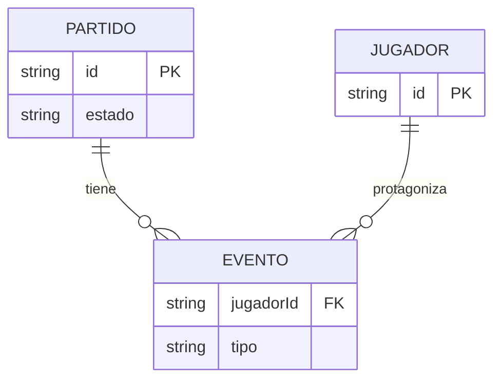

# El modelo de eventos (rebanada 5 de "Equipos en el campo") — Spec

> **Status:** Draft · **Date:** 2026-09-01 · **Owner:** Lucas Manoukian
>
> **Reviewers:** *pending*
>
> **Concept note:** [EQUIPOS_EN_EL_CAMPO_CONCEPT.md](../EQUIPOS_EN_EL_CAMPO_CONCEPT.md)
>
> **Specs de las rebanadas anteriores:** [rebanada-1-cancha/CANCHA_SPEC.md](../rebanada-1-cancha/CANCHA_SPEC.md) ·
> [rebanada-2-arrastre/ARRASTRE_SPEC.md](../rebanada-2-arrastre/ARRASTRE_SPEC.md) ·
> [rebanada-3-panel-armado/PANEL_ARMADO_SPEC.md](../rebanada-3-panel-armado/PANEL_ARMADO_SPEC.md) ·
> [rebanada-4-partido-finalizado/PARTIDO_FINALIZADO_SPEC.md](../rebanada-4-partido-finalizado/PARTIDO_FINALIZADO_SPEC.md)
>
> **Implementation plan:** *not yet written*

> **Nota de gobernanza.** Esta Spec sigue viviendo en `docs/<feature>/`, no en
> `openspec/`, aunque [`openspec/config.yaml`](../../../openspec/config.yaml)
> (vigente desde hoy, 2026-09-01) declara que OpenSpec reemplaza a esta
> metodología "para trabajo nuevo". "Equipos en el campo" no es trabajo nuevo:
> es una feature en curso, con cuatro rebanadas ya mergeadas bajo `D-08`/`D-11`
> del propio Concept Note, que fijan explícitamente que las siete rebanadas se
> especifican con este método. Cambiar de sistema a mitad de una feature en
> curso —con tres Specs y cuatro Implementation Plans ya escritos así—
> introduciría exactamente la clase de inconsistencia que el principio de
> simplicidad pide evitar. Se continúa con `docs/`, a pedido explícito del
> usuario, y se deja constancia acá por si la rebanada 6 o 7 quiere revisar la
> decisión.

> **Grounding evidence (`MD-25`).** Esta Spec se apoya en el ledger §6.5
> *Sources & Origins* del Concept Note, en las Specs de las rebanadas 1 a 4, y
> en la sección *State Management* del handoff
> ([`handoff/README.md:678-721`](../handoff/README.md#L678-L721)), que es la
> única fuente que fija la forma concreta del evento (`entryLog`/`nueveLog`,
> `{ id, ev }`, `ev: "gol"|"penal"|"contra"|"asist"`) citada en el Concept Note
> §8.2 sólo en prosa. Donde un `FR-*` / `NFR-*` / `TC-*` se apoya en una
> ubicación del código que ninguno de esos documentos cubre, la cita va **en
> línea** en la sección donde se define el requisito. Las líneas de
> `index.html` citadas acá corresponden al estado del archivo después del
> merge de la rebanada 4 (`65f5701`).

> **Declaración de reemplazo (Principio de gobernanza vigente en
> [`openspec/config.yaml`](../../../openspec/config.yaml)).** Esta Spec
> enmienda, en su parte, `TC-010` de la Spec de la rebanada 4
> ([`PARTIDO_FINALIZADO_SPEC.md`](../rebanada-4-partido-finalizado/PARTIDO_FINALIZADO_SPEC.md)):
>
> - `TC-010` (rebanada 4) fijaba que los chips y las filas de detalle "se
>   derivarán exclusivamente de `m.resultado.statsPorJugador`... no se
>   agregará ninguna función que recalcule goles, asistencias o goles en
>   contra por una vía distinta: hoy sólo existe una fuente de verdad para ese
>   dato y esta rebanada no crea una segunda." Sigue siendo cierto que existe
>   una sola fuente de verdad **por partido** — eso no cambia — pero esa fuente
>   pasa a poder ser `m.resultado.eventos` en vez de `m.resultado.statsPorJugador`
>   para los partidos finalizados desde esta rebanada (`D-04`). `TC-010` de
>   **esta** Spec reemplaza la restricción literal ("exclusivamente de
>   `statsPorJugador`") por una más general que preserva la intención original
>   (una sola función de derivación, nunca dos calculadoras paralelas): ver
>   §4.2 abajo.
>
> Ningún otro `FR-*`/`TC-*` de las rebanadas 1 a 4 queda tocado: la geometría,
> los roles y el resto del comportamiento de lectura siguen exactamente como
> esas Specs los dejaron. La anotación recíproca en la Spec de la rebanada 4
> queda pendiente, igual que en las rebanadas 2 a 4 (ver `OPEN-Q-01`).

## 1. Purpose

Esta Spec define cómo se **persiste** el resultado de un partido a partir de
esta rebanada: una secuencia ordenada de eventos en vez de cuatro contadores
por jugador, y cómo esa secuencia produce, sin guardarlos, los mismos cuatro
números que cualquier pantalla ya construida necesita. Es la quinta de las
siete rebanadas de `D-08`, y la única sin efecto visible: ningún pixel de
ninguna pantalla cambia por esta Spec.

No cubre *por qué* se hace el cambio (Concept Note, `D-04`) ni *cómo* se
escribe el código (Implementation Plan). No cubre la carga por toque ni
Deshacer ni el botón `−` por familia: esos comportamientos son la rebanada 6,
y esta rebanada sólo construye la base de datos que los va a hacer posibles,
sin exponer ninguno de los tres todavía.

## 2. Summary

Hoy, el resultado de un partido se guarda como cuatro contadores por
jugador —`{goles, golesPenal, golesEnContra, asistencias}`— en
`m.resultado.statsPorJugador`. Nada impide que ese objeto contenga un
jugador con 1 gol y 3 goles de penal: es un dato representable aunque sea
imposible en la cancha.

Esta rebanada reemplaza esa persistencia, sólo para los partidos que se
finalicen o se editen desde que se mergee: en vez de contadores, se guarda
`m.resultado.eventos`, una lista ordenada de hechos —"Lucas, gol", "Lucas,
gol de penal", "Ánibal, en contra"— de la que los cuatro contadores se
recalculan cada vez que una pantalla los necesita, sin volver a guardarse.
Un evento de gol de penal cuenta como gol por construcción, así que la
cantidad de penales nunca puede superar la de goles: no es una validación que
alguien pueda olvidar, es una imposibilidad de la forma del dato.

Los partidos ya finalizados no se toca ni se convierten: siguen leyéndose de
sus cuatro contadores, tal cual están, para siempre. La pantalla de carga
—la grilla numérica de la rebanada 3— y la pantalla de lectura —la cancha con
chips de la rebanada 4— no cambian en nada perceptible: siguen mostrando
exactamente lo mismo que hoy, alimentadas por un dato interno distinto. La
aplicación sigue siendo la misma organizadora de partidos; lo que cambia es
invisible a propósito, para poder validarlo aislado antes de construir encima
la carga por toque.

## 3. Scope

### 3.1 In scope

- El nuevo campo `m.resultado.eventos`: su forma conceptual (un evento por
  hecho, con jugador y tipo) y su orden.
- La función de derivación que reconstruye los cuatro contadores por jugador
  a partir de `m.resultado.eventos`, con la misma forma que
  `m.resultado.statsPorJugador` ya tiene hoy.
- La función de síntesis que construye `m.resultado.eventos` a partir del
  borrador numérico (`resultadoDraft.stats`) al finalizar un partido o al
  guardar la edición de uno ya finalizado.
- La actualización de los puntos de lectura existentes
  (`recomputeAllPlayerStatsFromMatches`, `totalGolesEquipo` a través de sus
  llamadores, `statsAgregadasDeUnidad`, `goleadoresDeEquipo`,
  `renderFilasDetalle`, `renderChipsEstadistica`, `renderStatsYPuntajeMiembro`,
  `renderFilaResultado`, `matchResultSummaryHtml`) para que pasen por esa
  función en vez de leer `m.resultado.statsPorJugador` en forma directa.
- La convivencia de los dos formatos: un partido finalizado antes de esta
  rebanada sigue teniendo sólo `statsPorJugador`; uno finalizado desde esta
  rebanada tiene sólo `eventos`. Ningún partido tiene los dos a la vez.

### 3.2 Out of scope / non-goals

Los cinco no-objetivos del Concept Note §4 se heredan enteros, en particular
"no se migran los partidos ya guardados al nuevo modelo de datos". Además, y
como límites propios de esta rebanada:

- El sistema **no** modificará ninguna pantalla: ni la grilla numérica de
  carga/edición (rebanada 3), ni la cancha con chips de lectura (rebanada 4).
  El DOM que cualquiera de las dos produce, para el mismo resultado, es
  idéntico antes y después de esta rebanada.
- El sistema **no** implementará Deshacer, el botón `−` por familia, ni
  ningún control que exponga la secuencia de eventos al usuario. Eso es la
  rebanada 6 (`D-08`).
- El sistema **no** dará al orden de los eventos sintetizados ningún
  significado observable por el usuario: sirve sólo para que la construcción
  sea determinística y testeable (ver `A-02`).
- El sistema **no** migrará, convertirá ni tocará de ninguna forma
  `m.resultado.statsPorJugador` de un partido ya finalizado antes de esta
  rebanada, ni siquiera al editar su resultado (`D-06`).
- El sistema **no** modificará ningún campo del partido fuera de
  `m.resultado`: `m.equipos`, `m.estrategia`, `m.cancha`, `m.inscripcionCerrada`
  y el resto quedan exactamente igual.
- El sistema **no** agregará el Historial de resultados ni ninguna
  estadística nueva: sigue siendo captura y lectura de datos, sin análisis
  (Concept Note §4).

### 3.3 Constraints inherited from the Concept Note

- **D-01** (el motor queda fuera de alcance) — heredada; esta rebanada no lo
  invoca ni depende de él.
- **D-02** (DOM + CSS vanilla dentro de `index.html`) — heredada; `TC-001`.
  Como esta rebanada no toca DOM ni CSS, se traduce a: todo el código nuevo
  vive dentro del mismo IIFE de `index.html`, como funciones JavaScript
  puras.
- **D-04** (la carga de resultados se persiste como secuencia ordenada de
  eventos; los cuatro contadores pasan a derivarse) — es la decisión que
  esta Spec implementa en su totalidad.
- **D-06** (los partidos ya guardados no se migran; la lista de eventos
  aplica sólo a partidos cargados desde esta rebanada) — heredada; fija
  §3.2 y `FR-030`/`FR-031`.
- **D-08** (siete rebanadas, en orden) — heredada; fija que esta rebanada no
  puede anticipar comportamiento de la 6 (Deshacer, `−`, carga por toque).
- **D-11** (dos ramas por rebanada, `docs/` antes que `feature/`) — heredada;
  el Implementation Plan la ejecuta.

Además, esta Spec no reemplaza ni modifica ninguna de las reglas de
[`openspec/specs/resultados-partido/spec.md`](../../../openspec/specs/resultados-partido/spec.md):
"El gol de penal cuenta como gol", "Validación de penales contra goles del
jugador" y "El gol en contra suma para el equipo rival, no para el propio"
siguen vigentes sin cambios — `D-04` mueve **cómo se guarda** el dato, nunca
**qué regla** rige sobre él (Concept Note §6.5, *Prior-art evidence*:
*"`D-04` modifica su modelo de datos sin modificar esa regla"*). `FR-003` y
`FR-010`/`FR-011` de esta
Spec son, precisamente, la forma en que el modelo de eventos hace cumplir
esas dos primeras reglas por construcción en vez de por validación.

## 4. Technical & architectural constraints

### 4.1 Platform / stack constraints

- **TC-001** — El modelo de eventos se implementará como funciones
  JavaScript dentro de `index.html`, sin ningún archivo nuevo, sin
  `support.js` y sin ningún componente del bundle del design system (`D-02`
  — esta rebanada no tiene componente visual que tomar de ahí).
- **TC-002** — No se agregará ninguna dependencia nueva: ni paquete, ni CDN,
  ni archivo cargado en tiempo de ejecución. El repositorio sigue sin
  lockfile (`AGENTS.md` § Dependencias).

### 4.2 Architectural / integration constraints

- **TC-010** — Existirá **una única función pura** de derivación —sin
  efectos secundarios, sin leer variables globales de estado de la UI— que,
  dado un partido, devuelva el objeto `{jugadorId: {goles, golesPenal,
  golesEnContra, asistencias}}` con una entrada por cada jugador convocado
  (`FR-014b`), sin importar si ese partido tiene `m.resultado.eventos` o
  `m.resultado.statsPorJugador`. Ningún otro punto
  del código volverá a leer `m.resultado.eventos` directamente, ni
  reimplementará el conteo por su cuenta. **Enmienda de `TC-010` de la
  rebanada 4** (declaración de reemplazo, arriba): esa restricción decía
  "exclusivamente de `statsPorJugador`"; esta la generaliza a "exclusivamente
  a través de esta función", que sigue garantizando una sola fuente de
  verdad por partido.
- **TC-011** — Existirá una función pura de síntesis, simétrica a la de
  `TC-010`, que dado el borrador numérico de un partido
  (`resultadoDraft.stats`) y el orden de sus jugadores convocados, devuelva
  la secuencia ordenada de eventos equivalente (Concept Note §8.2: "de esa
  secuencia se derivan, sin guardarse").
- **TC-012** — Los nueve puntos de lectura de `m.resultado.statsPorJugador`
  que existen hoy pasarán a leer a través de la función de `TC-010`:
  [`index.html:1643`](../../../index.html#L1643)
  (`recomputeAllPlayerStatsFromMatches`),
  [`index.html:3814`](../../../index.html#L3814)
  (`__editarResultadoFinalizado`),
  [`index.html:3870`](../../../index.html#L3870) (`teamHeaderTotalText`),
  [`index.html:3891`](../../../index.html#L3891)
  (`renderStatsYPuntajeMiembro`),
  [`index.html:4228`](../../../index.html#L4228) (chips de la cancha,
  rebanada 4), [`index.html:5009`](../../../index.html#L5009) y
  [`index.html:5029-5030`](../../../index.html#L5029-L5030)
  (`renderMatchDetail`), [`index.html:5236`](../../../index.html#L5236)
  (`renderFilaResultado`), y
  [`index.html:5326`](../../../index.html#L5326)
  (`matchResultSummaryHtml`). Ninguno de estos nueve cambiará su propia
  lógica de cálculo: sólo cambia de dónde toman el objeto de estadísticas.
- **TC-013** — Los dos puntos de escritura que existen hoy —
  [`index.html:3773`](../../../index.html#L3773) (`__finalizarPartido`) y
  [`index.html:3838`](../../../index.html#L3838)
  (`__guardarEdicionResultado`)— decidirán, con la regla de `FR-020` a
  `FR-023`, si escriben `eventos` (vía `TC-011`) o `statsPorJugador` (sin
  cambios, para partidos históricos). Ninguno escribirá los dos campos a la
  vez en el mismo partido.
- **TC-014** — Las fixtures existentes de `tests/finalizado.test.js` que
  construyen partidos con `resultado: { statsPorJugador: {...} }` en forma
  literal seguirán pasando sin modificarse: son exactamente el caso de un
  partido histórico que esta rebanada debe seguir leyendo igual (`D-06`).

### 4.3 Compliance / regulatory constraints

- **TC-020** — No aplica ninguna obligación regulatoria de datos: la
  rebanada no introduce ningún dato personal nuevo — un evento es un hecho de
  juego atribuido a un `jugadorId` que ya existe — y no cambia quién puede
  leer o escribir el resultado (Concept Note §5.2).

### 4.4 Conventions to follow

- **Design system** — no aplica ninguna restricción de tokens visuales
  (color, tipografía, spacing, radio): esta rebanada no toca ningún valor
  visual, porque no hay ningún cambio de pantalla (`D-02`, a diferencia de
  las rebanadas 1 a 4). No se le asigna un `TC-*` numerado porque, al no
  admitir ninguna evidencia de cumplimiento propia, no habría ningún `AC-*`
  de §11.3 que citarle — mismo criterio que usan las categorías de CWE no
  aplicables en §4.5.
- **TC-031** — El comportamiento de esta rebanada se agregará como
  escenarios de una suite de unidad nueva o existente, con el identificador
  de esta Spec en forma canónica dentro de un literal de cadena, según la
  convención de `AGENTS.md` § Tests.

### 4.5 Security constraints (`MD-31`)

El Concept Note §5.2 declara la postura: ninguna entrada no confiable,
escritura sólo de administradores autenticados, SPA estática sin servidor
propio. Esta rebanada no agrega ninguna superficie nueva de entrada ni de
lectura: reorganiza cómo se calcula un dato que ya existía, sin cambiar quién
puede escribirlo ni qué puede leer un rol `jugador`.

`[UNVERIFIED — offline; no se consultó https://cwe.mitre.org/top25/ en esta
sesión, igual que en las rebanadas 3 y 4. Las categorías se nombran por su
identificador y su título, que son estables, pero el ranking vigente a la
fecha no se verificó.]`

- **TC-040** — La escritura de `m.resultado.eventos` o
  `m.resultado.statsPorJugador` sólo ocurrirá dentro de
  `__finalizarPartido` y `__guardarEdicionResultado`, cuyas guardas de rol
  `admin` ya existen y esta rebanada no debilita ni rodea. **Defiende
  `CWE-862` *Missing Authorization*** y **`CWE-863` *Incorrect
  Authorization***.
- **CWE-79 *Cross-Site Scripting*** — no aplica: esta rebanada no inserta
  ningún texto nuevo en el DOM. Los nombres de jugador que las funciones de
  lectura de `TC-012` ya insertaban escapados (`escaparHtml`, `TC-041` de la
  rebanada 4) siguen pasando por el mismo camino, sin cambios.
- **CWE-89 *SQL Injection***, **CWE-78 *OS Command Injection***, **CWE-22
  *Path Traversal***, **CWE-502 *Deserialization***, **CWE-918 *SSRF***,
  **CWE-352 *CSRF*** — no aplican, por las mismas razones que en las
  rebanadas 3 y 4 (Concept Note §5.2: sin servidor propio, sin parsing de
  entrada externa, sin acceso a filesystem, escritura vía SDK de Firestore
  con el token de la sesión).
- **CWE-20 *Improper Input Validation*** — no aplica como superficie de
  entrada de usuario: el único dato de entrada sigue siendo el borrador
  numérico de la grilla (rebanada 3), que esta rebanada no toca. La
  invariante "penales ≤ goles" que antes dependía de que nadie la rompiera
  al escribir pasa a ser una imposibilidad estructural (`FR-003`, `FR-010`),
  lo que endurece —no relaja— esta categoría.

## 5. Users & use cases

### 5.1 Personas / actors

| Actor | Description | Primary need |
|---|---|---|
| Administrador | Miembro del grupo con rol `admin`. Carga y edita resultados. | Que cargar y editar el resultado sigan comportándose exactamente igual, sin notar que el dato interno cambió. |
| Implementador de la rebanada 6 | Quien construya la carga por toque, Deshacer y el `−` por familia. | Una fuente de verdad ordenada y sin datos imposibles sobre la que construir esos tres comportamientos sin duplicar el modelo de datos. |

Esta rebanada, al no tener efecto visible, no agrega ninguna historia de
usuario final nueva: las historias de "cargar un resultado" y "leer un
resultado" ya están cubiertas por las Specs de las rebanadas 3 y 4 y no
cambian. Las dos historias de abajo son las únicas que le corresponden a
*esta* rebanada, y son de naturaleza técnica.

### 5.2 User stories

| ID | Story | Implements |
|---|---|---|
| US-01 | Como implementador de la rebanada 6, quiero que el resultado se guarde como una secuencia ordenada de eventos, para poder construir Deshacer y el `−` por familia sin un historial paralelo que se pueda desincronizar. | FR-001, FR-002, FR-003 |
| US-02 | Como administrador, quiero que mis estadísticas acumuladas y las de los partidos ya jugados no cambien en absoluto por este trabajo interno. | FR-010 a FR-016, FR-030, FR-031 |

## 6. Glossary

Los términos que las rebanadas 1 a 4 ya definieron se usan acá con el mismo
significado y no se redefinen. Los propios de esta rebanada:

| Term | Definition |
|---|---|
| Evento de partido | Un hecho atómico atribuido a un jugador: un gol, un gol de penal, un gol en contra o una asistencia. Tiene exactamente dos atributos: `jugadorId` y `tipo`. |
| Tipo de evento | Uno de `gol`, `golPenal`, `golEnContra`, `asistencia`. Un evento `golPenal` cuenta como gol y como penal a la vez (`FR-003`); no existe un tipo de evento paralelo para el penal. |
| `m.resultado.eventos` | El arreglo ordenado de eventos de un partido. Existe sólo en los partidos finalizados o editados desde esta rebanada; su ausencia (incluso siendo `m.resultado` un objeto) marca un partido histórico. |
| Partido histórico (o heredado) | Un partido cuyo `m.resultado` tiene `statsPorJugador` y no tiene `eventos`, porque se finalizó antes de esta rebanada o porque su última edición ocurrió antes de que tuviera `eventos` (`D-06`). |
| Síntesis de eventos | La construcción de `m.resultado.eventos` a partir del borrador numérico `resultadoDraft.stats`, al finalizar un partido o guardar la edición de uno que ya tiene `eventos`. |
| Derivación de estadísticas | El cálculo inverso: reconstruir `{goles, golesPenal, golesEnContra, asistencias}` por jugador a partir de `m.resultado.eventos`. |

## 7. Functional requirements

> Se usa la sintaxis EARS: *ubicuo* ("El sistema…"), *por evento* ("Cuando…"),
> *por estado* ("Mientras…"), *opcional* ("Donde…") y *no deseado* ("Si…,
> entonces…"). Una obligación por línea.

### 7.1 El evento de partido

- **FR-001** — El sistema representará cada hecho de gol, gol de penal, gol
  en contra o asistencia como un evento con exactamente dos atributos: el
  jugador al que se atribuye (`jugadorId`) y su tipo (`FR-002`), grounded en
  el `entryLog`/`nueveLog` del handoff
  ([`handoff/README.md:695,702`](../handoff/README.md#L695)).
- **FR-002** — El sistema restringirá el tipo de cada evento a uno de
  `gol`, `golPenal`, `golEnContra` o `asistencia`, sin admitir ningún otro
  valor.
- **FR-003** — El sistema no agregará ningún tipo de evento paralelo para el
  gol de penal: un evento `golPenal` contará como gol y como penal a la vez
  en toda derivación (`D-04`; handoff: *"El penal no es un campo aparte: es
  un gol marcado como penal. Por construcción `penales ≤ goles` siempre"*,
  [`handoff/README.md:660-661`](../handoff/README.md#L660-L661)).
- **FR-004** — El sistema persistirá los eventos de un partido como una
  secuencia ordenada, en el campo `m.resultado.eventos`, con el orden dado
  por la posición de cada evento en el arreglo.

### 7.2 La derivación de estadísticas

- **FR-010** — Donde el partido tenga `m.resultado.eventos`, el sistema
  calculará la cantidad de goles de un jugador como la suma de sus eventos
  `gol` y `golPenal`.
- **FR-011** — Donde el partido tenga `m.resultado.eventos`, el sistema
  calculará la cantidad de goles de penal de un jugador como la cantidad de
  sus eventos `golPenal`.
- **FR-012** — Donde el partido tenga `m.resultado.eventos`, el sistema
  calculará la cantidad de goles en contra de un jugador como la cantidad de
  sus eventos `golEnContra`.
- **FR-013** — Donde el partido tenga `m.resultado.eventos`, el sistema
  calculará la cantidad de asistencias de un jugador como la cantidad de sus
  eventos `asistencia`.
- **FR-014** — El sistema expondrá las cuatro cantidades de `FR-010` a
  `FR-013`, en la misma forma que `m.resultado.statsPorJugador` ya tiene
  hoy — un objeto por jugador con las claves `goles`, `golesPenal`,
  `golesEnContra`, `asistencias` — de modo que ninguno de los nueve
  consumidores de `TC-012` necesite cambiar su propia lógica de cálculo.
- **FR-014b** — El sistema incluirá, en ese objeto, una entrada para
  **todo** jugador convocado al partido (`[...m.equipos.blanco,
  ...m.equipos.negro]`), con las cuatro cantidades en cero cuando el
  jugador no tenga ningún evento — igual que `m.resultado.statsPorJugador`
  ya incluye hoy una entrada en cero para todo convocado que no metió
  nada. Sin esta regla, `recomputeAllPlayerStatsFromMatches`
  ([`index.html:1649`](../../../index.html#L1649), que recorre
  `Object.entries(stats)`) dejaría de contar como jugado, para un jugador
  sin eventos, un partido en el que sí participó — una regresión real de
  estadísticas acumuladas, no cosmética.
- **FR-015** — Donde el partido NO tenga `m.resultado.eventos`, el sistema
  seguirá leyendo `m.resultado.statsPorJugador` tal cual existe hoy, sin
  ninguna conversión (`D-06`).
- **FR-016** — El sistema no escribirá nunca, en `m.resultado`, los cuatro
  contadores que `FR-010` a `FR-013` calculan: viven sólo en memoria,
  recalculados cada vez que una pantalla los necesita (Concept Note §8.2).

### 7.3 La escritura al finalizar y al editar

- **FR-020** — Cuando se finalice un partido por primera vez
  (`__finalizarPartido`), el sistema construirá `m.resultado.eventos` a
  partir del borrador numérico (`resultadoDraft.stats`) y no escribirá
  `m.resultado.statsPorJugador`.
- **FR-021** — El sistema construirá esa secuencia recorriendo a los
  jugadores convocados en el orden `[...equipo Blanco, ...equipo Negro]`
  (el mismo orden que ya usan `ensureResultadoDraft` y
  `__editarResultadoFinalizado`), y para cada jugador, en este orden fijo:
  los eventos `gol` que no son de penal, luego los eventos `golPenal`, luego
  los eventos `golEnContra`, luego los eventos `asistencia`, cada grupo
  repetido tantas veces como indique el contador correspondiente del
  borrador de ese jugador.
- **FR-022** — Cuando se guarde una edición del resultado de un partido ya
  finalizado (`__guardarEdicionResultado`) y ese partido ya tenga
  `m.resultado.eventos`, el sistema reconstruirá la secuencia completa con
  la regla de `FR-021` a partir del borrador editado, y la escribirá en
  lugar de la anterior.
- **FR-023** — Cuando se guarde una edición del resultado de un partido ya
  finalizado y ese partido NO tenga `m.resultado.eventos` (partido
  histórico), el sistema escribirá `m.resultado.statsPorJugador` con la
  misma forma que tiene hoy, y no creará `m.resultado.eventos` para ese
  partido (`D-06`; editar un partido histórico no lo migra).
- **FR-024** — Cuando se abra la edición del resultado de un partido
  finalizado (`__editarResultadoFinalizado`), el sistema precargará
  `resultadoDraft.stats` con los cuatro contadores derivados (`FR-010` a
  `FR-015`), sin importar si ese partido tiene `eventos` o
  `statsPorJugador`.

### 7.4 Compatibilidad con partidos históricos

- **FR-030** — El sistema no ejecutará, en ningún camino de este rediseño,
  una conversión de `m.resultado.statsPorJugador` a `m.resultado.eventos`
  (`D-06`; Concept Note §4: "no se migran los partidos ya guardados al
  nuevo modelo de datos").
- **FR-031** — El sistema distinguirá un partido con eventos de uno
  histórico exclusivamente por la presencia de la clave `eventos` en
  `m.resultado` (un arreglo, incluso vacío), sin depender de ninguna otra
  marca ni de la fecha del partido.

## 8. Non-functional requirements

> **Objetivo cuantificado.** A los efectos de `AC-51`, el NFR con objetivo
> cuantificado de esta Spec es exactamente `NFR-001`. El resto son
> obligaciones binarias verificables por revisión o por aserción de
> presencia/ausencia.

| ID | Category | Requirement |
|---|---|---|
| NFR-001 | Corrección / equivalencia de datos | Para todo borrador válido `resultadoDraft.stats` (contadores no negativos, con `golesPenal ≤ goles` por jugador, como ya garantiza la UI de la rebanada 3), derivar (`FR-010` a `FR-013`) la secuencia sintetizada a partir de ese borrador (`FR-021`) produce, para cada jugador, los cuatro contadores **idénticos** a los del borrador original. Verificado por un test de propiedad sobre al menos 500 borradores generados. |
| NFR-002 | Compatibilidad de datos | Ningún partido finalizado antes de esta rebanada cambia de forma por el solo hecho de que esta rebanada exista: su `m.resultado` sigue teniendo exactamente las mismas claves y valores que tenía, hasta que un administrador edite su resultado (y en ese caso, `FR-023` preserva la forma). |
| NFR-003 | Mantenibilidad | Todo test que verifique un `FR-*`, `NFR-*` o `TC-*` de esta Spec embebe su identificador en forma canónica dentro de un literal de cadena, según `AGENTS.md` § Tests. |

## 9. System behaviour & scenarios

> **Nota sobre el alcance de los tests.** A diferencia de las rebanadas 1 a
> 4, ninguno de estos escenarios es visual: todos son verificables llamando
> directamente a las funciones puras de `TC-010`/`TC-011` y a los cuatro
> puntos de escritura, con fixtures de `matches`/`players` como ya hace
> `tests/finalizado.test.js`.

### 9.1 Happy path scenarios

#### Scenario S-01 — Finalizar un partido nuevo persiste eventos, no contadores (covers FR-001 a FR-004, FR-020, FR-021)

- **Given** un partido con inscripción cerrada, equipos generados y un
  borrador de resultado con al menos un gol, un gol de penal, un gol en
  contra y una asistencia repartidos entre los dos equipos
- **When** se finaliza el partido
- **Then** `m.resultado.eventos` es un arreglo no vacío, y `m.resultado` no
  tiene la clave `statsPorJugador`
- **And** cada evento tiene exactamente `jugadorId` y `tipo`, y todo `tipo`
  es uno de `gol`, `golPenal`, `golEnContra`, `asistencia`

**Variants:**

- `S-01a [boundary]` — el borrador tiene los cuatro contadores en cero para
  todos los jugadores (0 a 0, sin eventos): `m.resultado.eventos` es un
  arreglo **vacío**, no ausente — sigue marcando a este partido como
  "con eventos" (`FR-031`)
- `S-01b [boundary]` — un jugador con 5 goles, 3 de penal, 2 goles en contra
  y 4 asistencias (un caso por encima de cualquier partido real): la
  secuencia contiene exactamente 5 eventos `gol`/`golPenal` para ese
  jugador (2 `gol` + 3 `golPenal`), 2 `golEnContra` y 4 `asistencia`
- `S-01c [property]` — para todo borrador válido generado al azar, la
  cantidad total de eventos sintetizados es igual a la suma, sobre todos
  los jugadores convocados, de sus cuatro contadores (`NFR-001`)

#### Scenario S-02 — La derivación reproduce los contadores para todo consumidor existente (covers FR-010 a FR-016, FR-014b, TC-010, TC-012)

- **Given** un partido finalizado con `m.resultado.eventos`, con un jugador
  de 2 goles (1 de penal) y 1 asistencia, y otro con 1 gol en contra
- **When** cualquiera de los nueve consumidores de `TC-012`
  (`totalGolesEquipo`, `statsAgregadasDeUnidad`, `goleadoresDeEquipo`,
  `renderFilasDetalle`, `renderChipsEstadistica`,
  `renderStatsYPuntajeMiembro`, `recomputeAllPlayerStatsFromMatches`,
  `renderFilaResultado`, `matchResultSummaryHtml`) se ejecuta sobre ese
  partido
- **Then** cada uno recibe, para el primer jugador,
  `{goles: 2, golesPenal: 1, golesEnContra: 0, asistencias: 1}`, y para el
  segundo, `{goles: 0, golesPenal: 0, golesEnContra: 1, asistencias: 0}` —
  exactamente lo que recibiría si esos mismos valores estuvieran en
  `m.resultado.statsPorJugador`

**Variants:**

- `S-02a [boundary]` — un jugador con gol, gol en contra y asistencia a la
  vez (mismo caso límite que `S-03b` de la rebanada 4): la derivación
  produce los tres contadores no nulos simultáneamente
- `S-02b [property]` — para toda secuencia de eventos generada al azar, la
  cantidad de `golesPenal` derivada nunca supera la cantidad de `goles`
  derivada, para ningún jugador (`FR-003`, `FR-010`, `FR-011` — la
  imposibilidad estructural)
- `S-02c [failure]` — un partido finalizado con `m.resultado` sin
  `eventos` y sin `statsPorJugador` (dato corrupto, fuera de lo que `A-03`
  asume posible en producción): la derivación devuelve un objeto vacío
  para todos los jugadores, sin lanzar una excepción
- `S-02d [boundary]` — un jugador convocado sin ningún evento en un
  partido donde otros jugadores sí metieron goles: la derivación igual le
  da una entrada con los cuatro contadores en cero, y
  `recomputeAllPlayerStatsFromMatches` cuenta ese partido como jugado para
  él (`FR-014b`)

#### Scenario S-03 — Editar el resultado de un partido con eventos reconstruye la secuencia (covers FR-022, FR-024)

- **Given** un partido finalizado con `m.resultado.eventos`, con un jugador
  de 1 gol
- **When** un administrador abre la edición, le suma un segundo gol de
  penal a ese jugador y guarda
- **Then** `resultadoDraft.stats` se precargó, al abrir la edición, con
  `{goles: 1, golesPenal: 0, golesEnContra: 0, asistencias: 0}` para ese
  jugador (`FR-024`)
- **And** después de guardar, `m.resultado.eventos` contiene, para ese
  jugador, un evento `gol` y un evento `golPenal` (dos eventos, no uno)
- **And** `m.resultado` sigue sin la clave `statsPorJugador`

**Variants:**

- `S-03a [boundary]` — la edición lleva un contador de 1 a 0: los eventos
  de ese tipo para ese jugador desaparecen por completo de la secuencia
  reconstruida, no quedan en 0 dentro de un objeto

#### Scenario S-04 — Editar el resultado de un partido histórico preserva el formato viejo (covers FR-023, FR-030, FR-031)

- **Given** un partido finalizado antes de esta rebanada, con
  `m.resultado.statsPorJugador` y sin `m.resultado.eventos`
- **When** un administrador edita su resultado y guarda
- **Then** `m.resultado.statsPorJugador` queda actualizado con los nuevos
  valores, en la misma forma de siempre
- **And** `m.resultado` sigue sin la clave `eventos`

**Variants:**

- `S-04a [boundary]` — la edición deja todos los contadores en cero para
  todos los jugadores: `statsPorJugador` queda con esos ceros explícitos
  (misma forma que hoy), y `eventos` sigue sin existir

#### Scenario S-05 — El recálculo acumulado convive con partidos de los dos formatos (covers FR-010 a FR-016, recomputeAllPlayerStatsFromMatches)

- **Given** el historial de un jugador con dos partidos finalizados: uno
  histórico (`statsPorJugador`, 2 goles) y uno nuevo (`eventos`, 1 gol y 1
  gol de penal)
- **When** se ejecuta `recomputeAllPlayerStatsFromMatches`
- **Then** el total acumulado de goles de ese jugador es 3, y el de goles
  de penal es 1 — la suma de los dos partidos, sin importar que cada uno
  guarde su resultado de una forma distinta

Variants: none — single-path scenario (la propiedad de `S-02b` ya cubre la
derivación de cada partido individualmente; este escenario verifica sólo que
el recálculo agregado no distingue el formato de origen).

### 9.2 Edge cases

*Ninguno* — los casos límite de esta rebanada (borrador en cero, jugador con
los cuatro tipos de evento a la vez, dato corrupto) ya están cubiertos como
variantes de sus escenarios padre en §9.1, siguiendo la convención de la
guía de autoría (co-localizar variantes en vez de duplicarlas como
escenarios hermanos).

### 9.3 Failure / unwanted-behaviour scenarios

#### Scenario S-20 — Una sesión sin permiso invoca la escritura (covers TC-040)

- **Given** una sesión con rol `jugador` sobre un partido con inscripción
  cerrada o ya finalizado
- **When** se invoca directamente `window.__finalizarPartido` o
  `window.__guardarEdicionResultado`
- **Then** el sistema no modifica el partido
- **And** ni `m.resultado.eventos` ni `m.resultado.statsPorJugador` cambian

Variants: none — single-path scenario (la guarda es la misma función que ya
existe desde antes de esta rebanada; no hay una segunda forma de disparar la
escritura que probar).

## 10. Data model & external contracts

### 10.1 Domain entities (conceptual)

| Entity | Purpose | Key attributes (conceptual) | Lifecycle |
|---|---|---|---|
| Evento | Un hecho de gol, gol de penal, gol en contra o asistencia, atribuido a un jugador dentro de un partido. | `jugadorId` (FK a Jugador), `tipo` (`gol` \| `golPenal` \| `golEnContra` \| `asistencia`) | Se crea en bloque, junto con todos los demás eventos del mismo partido, al finalizar (`FR-020`) o al guardar una edición (`FR-022`). Nunca se crea, edita ni borra individualmente: la secuencia entera se reemplaza como una unidad. |
| Partido (existente, sin cambios de identidad) | Gana un campo opcional nuevo, `resultado.eventos`, alternativo a `resultado.statsPorJugador`. | *(sin cambios; ver rebanadas anteriores)* | *(sin cambios)* |

#### 10.1.1 Entity-relationship diagram

### 10.2 External APIs / events the feature consumes

| Source | Contract | Direction | Notes |
|---|---|---|---|
| Cloud Firestore | Documento de partido, con `resultado.eventos` (nuevo, opcional) o `resultado.statsPorJugador` (existente, sin cambios) | inbound/outbound | El documento gana un campo opcional; ningún campo existente cambia de forma. |
| Firebase Auth | Rol de la sesión (`admin` / `jugador`) | inbound | Sin cambio. |

### 10.3 External APIs / events the feature exposes

| Endpoint / event | Inputs | Outputs | Notes |
|---|---|---|---|
| — | — | — | Esta rebanada no expone ninguna interfaz nueva: es un cambio interno de persistencia, sin superficie propia. |

## 11. Acceptance criteria

### 11.1 Functional acceptance

- **AC-01** — El escenario `S-01` y sus variantes pasan (cubre `FR-001` a
  `FR-004`, `FR-020`, `FR-021`).
- **AC-02** — El escenario `S-02` y sus variantes pasan para los nueve
  consumidores enumerados en `TC-012` (cubre `FR-010` a `FR-016`).
- **AC-03** — El escenario `S-03` pasa (cubre `FR-022`, `FR-024`).
- **AC-04** — El escenario `S-04` pasa, y el documento de partido resultante
  no contiene la clave `eventos` (cubre `FR-023`, `FR-030`, `FR-031`).
- **AC-05** — El escenario `S-05` pasa (cubre `FR-010` a `FR-016`, y el
  comportamiento sin cambios de `recomputeAllPlayerStatsFromMatches` frente
  a un historial mixto).

### 11.2 Non-functional acceptance

- **AC-10** — Un test de propiedad con al menos 500 borradores generados al
  azar confirma `NFR-001`: cero discrepancias entre el borrador original y
  los contadores derivados de la secuencia sintetizada.
- **AC-11** — Comparando, antes y después de esta rebanada, el documento de
  cada partido finalizado que existía en un fixture de prueba y que ningún
  escenario edita, el diff es vacío (cubre `NFR-002`).
- **AC-12** — Todo test nuevo de esta rebanada embebe su identificador de
  Spec en forma canónica dentro de un literal de cadena (cubre `NFR-003`).

### 11.3 Constraint compliance

- **AC-20** — Revisión de código: todo el código de esta rebanada vive
  dentro de `index.html`, sin archivos nuevos (`TC-001`).
- **AC-21** — Revisión de código: la rebanada no agrega ninguna dependencia
  ni ningún archivo cargado en tiempo de ejecución (`TC-002`).
- **AC-22** — Revisión de código: existe una única función de derivación,
  y ningún otro punto del código recalcula goles/penales/en
  contra/asistencias por una vía distinta (`TC-010`).
- **AC-23** — Revisión de código: existe una única función de síntesis,
  simétrica a la de derivación (`TC-011`).
- **AC-24** — Revisión de código, con `grep` sobre `index.html`: los nueve
  puntos de lectura y los dos de escritura enumerados en `TC-012`/`TC-013`
  ya no acceden a `m.resultado.statsPorJugador` en forma directa, salvo
  dentro de las dos funciones puras de `TC-010`/`TC-011` (`TC-012`,
  `TC-013`).
- **AC-25** — `tests/finalizado.test.js` sigue pasando sin modificar sus
  fixtures existentes (`TC-014`).
- **AC-26** — Revisión de código: ningún dato personal nuevo se introduce;
  `jugadorId` es el mismo identificador que ya existía (`TC-020`).
- **AC-27** — Revisión de código: todo test nuevo referencia su
  identificador de Spec según `AGENTS.md` § Tests (`TC-031`).
- **AC-28** — Revisión de código: la escritura de `eventos` o
  `statsPorJugador` ocurre únicamente dentro de `__finalizarPartido` y
  `__guardarEdicionResultado`, con sus guardas de rol intactas (`TC-040`).

### 11.4 Negative / safety acceptance

- **AC-40** — El escenario `S-20` no produce ninguna escritura: el
  documento de partido queda idéntico, en cualquiera de los dos formatos.
- **AC-41** — El escenario `S-02c` no lanza ninguna excepción ante un
  `m.resultado` sin `eventos` y sin `statsPorJugador`.

### 11.5 Test & traceability obligations

- **AC-50** — Todo escenario de §9 —incluida cada variante— tiene al menos
  un test ejecutable referenciado en la §12.1 *Scenario Traceability
  Matrix* del Implementation Plan, con el identificador embebido en una
  posición estructural, con el prefijo de rebanada que el arnés ya usa
  (`eventos/S-01b`), según `AGENTS.md` § Tests. Todo encabezado de
  escenario de §9 va seguido de un bloque `Variants:` o de la declaración
  explícita `Variants: none — single-path scenario`. Gateado por `T-N.D8` y
  `T-N.D8b` del Plan.
- **AC-51** — El NFR con objetivo cuantificado de §8 —`NFR-001`— tiene un
  test de medición (el de propiedad de `AC-10`) referenciado en la §12 del
  Plan, con el identificador embebido. Gateado por `T-N.D9`.
- **AC-52** — Todo TC de §4 tiene una verificación de cumplimiento en §11.3
  y una entrada correspondiente en la §12 del Plan. Gateado por `T-N.D10` y
  `T-N.D10b`.
- **AC-53** — Cada ámbito materialmente afectado por el cambio tiene al
  menos una fila `IMP-*` en la §12.2 *Impact Traceability* del Plan.
  Gateado por `T-N.D15`.
- **AC-54** — El NFR con objetivo cuantificado (`NFR-001`) tiene al menos
  una fila `OBS-*` en la §11 *Observability* del Plan, con el identificador
  del NFR en su columna *Binds to*. Gateado por `T-N.D16`.
- **AC-55** — La rebanada no incorpora ningún lockfile. El Plan declara
  `Supply-chain: none — el repositorio no versiona lockfile y la rebanada
  no agrega dependencias (TC-002)` en su §5, y `AC-55` se satisface de
  forma vacua. Gateado por `T-N.D20`.

## 12. Success metrics

| Metric | Target | Measurement |
|---|---|---|
| Cero regresiones en estadísticas acumuladas | El total de goles, penales, en contra y asistencias de cada jugador en staging es idéntico antes y después del deploy de esta rebanada | Comparación de `players` completo, antes/después, contra la base de staging |
| Ningún partido histórico cambia de forma | El documento de cada partido finalizado antes del deploy es byte a byte idéntico después, salvo los que un administrador edite explícitamente | Diff de los documentos de `matches` en Firestore, antes/después |
| Base lista para Deshacer | Todo partido finalizado desde el deploy de esta rebanada tiene `m.resultado.eventos` como arreglo, nunca `statsPorJugador` | Conteo en staging, sobre los partidos finalizados después de la fecha de deploy |

## 13. Dependencies

- **Upstream specs:** Concept Note de `equipos-en-el-campo`; Specs de las
  rebanadas 1 a 4, ya mergeadas.
- **Servicios:** Cloud Firestore y Firebase Auth, ninguno cambia de forma.
- **Diseño:** ninguno — esta rebanada no tiene componente visual; la única
  referencia de diseño es la sección *State Management* del handoff, ya
  citada.
- **Feature flags / config:** ninguna.
- **Third-party APIs:** ninguna nueva.

## 14. Assumptions

- **A-01** — `resultadoDraft.stats` sigue teniendo, para todo jugador
  convocado, exactamente la forma `{goles, golesPenal, golesEnContra,
  asistencias}` sin campos faltantes ni negativos, tal como la construyen
  hoy `ensureResultadoDraft` y `__editarResultadoFinalizado`, y tal como la
  UI de la rebanada 3 ya clampa (`golesPenal ≤ goles`,
  `asistencias`/`golesPenal` deshabilitados cuando corresponde). Verificado
  por lectura el 2026-09-01.
- **A-02** — El orden `[...blanco, ...negro]` usado para sintetizar eventos
  (`FR-021`) no tiene, todavía, ningún significado de producto: nadie lo lee
  ni lo muestra hasta la rebanada 6, que le dará sentido cronológico real
  (carga por toque, un evento por toque). Si esa expectativa cambiara antes
  de la rebanada 6, este orden sintético quedaría invalidado y habría que
  revisitar `FR-021`.
- **A-03** — Ningún partido finalizado en producción tiene un
  `m.resultado` sin `statsPorJugador` y sin `eventos` a la vez: todo
  partido finalizado antes de esta rebanada tiene `statsPorJugador`
  (heredado de `A-01` de la rebanada 4, no verificado contra datos reales de
  producción).

## 15. Risks

| Risk | Severity | Likelihood | Spec-level mitigation |
|---|---|---|---|
| Un consumidor futuro (de esta rebanada o de otra) vuelve a leer `m.resultado.statsPorJugador` directamente, sin pasar por la función de derivación de `TC-010`, y deja de ver los partidos con eventos | High | Med | `TC-012` enumera los nueve puntos existentes con línea exacta; `AC-24` lo verifica con `grep`. El Implementation Plan debe agregar esta verificación a su checklist de DoD, no sólo a la revisión manual |
| El orden sintético de `FR-021` se filtra como si fuera cronológico real antes de que la rebanada 6 le dé ese sentido | Low | Low | `A-02` lo documenta explícitamente; ninguna pantalla de esta rebanada expone el orden, y las rebanadas 3 y 4 no cambian |
| Un partido con datos preexistentes corruptos (sin `eventos` y sin `statsPorJugador`) rompe algún consumidor | Low | Low | `S-02c`/`AC-41` cubren ese caso explícitamente: la derivación devuelve ceros en vez de lanzar una excepción |

## 16. Open questions

| ID | Question | Owner | Target stage | Notes |
|---|---|---|---|---|
| OPEN-Q-01 | La anotación recíproca en la Spec de la rebanada 4 (marcar ahí que `TC-010` quedó enmendado) sigue pendiente, igual que en las rebanadas 2 a 4 | Lucas Manoukian | Implementation Plan | Misma deuda que las rebanadas anteriores dejaron sin saldar; conviene saldar las cuatro juntas |
| OPEN-Q-02 | ¿Conviene, ya en esta rebanada, que `resultadoDraft` en memoria pase a ser también una lista de eventos, para no reescribir la síntesis en la rebanada 6? | Lucas Manoukian | Revisión al empezar la rebanada 6 | Decidido a favor de mantener el borrador como contadores por ahora (Principio de simplicidad: no anticipar la UI de la 6, `D-08`); si la síntesis resulta más cara de lo esperado al construir la 6, se reabre acá |

## 17. Handoff to the Implementation Plan

- **Plan must respect (no relitigation):** todo `FR-*` de §7, todo `NFR-*`
  de §8, todo `TC-*` de §4, todo `AC-*` de §11 —incluidos los seis
  meta-criterios de §11.5— y las constraints heredadas en §3.3.
- **Plan has freedom over:** los nombres concretos de la función de
  derivación y de la función de síntesis, en qué archivo de test viven los
  escenarios nuevos (una suite propia, p. ej. `tests/eventos.test.js`, o
  una extensión de `tests/finalizado.test.js`), y cómo se ordenan las ramas
  y los commits dentro de `feature/modelo-eventos`.
- **Plan must resolve:** `OPEN-Q-02` (aunque la respuesta por defecto de
  esta Spec ya es "no, todavía no").
- **Deuda de verificación heredada (`MD-26`):** el marcador `[UNVERIFIED]`
  de §4.5 —el ranking vigente del CWE Top 25 no se consultó por estar sin
  conexión— se traslada al Plan, que lo debe reenunciar en su §15.1.
- **Cuidado particular:** ninguno de los nueve puntos de lectura de
  `TC-012` puede quedar sin actualizar: un solo call site que siga leyendo
  `m.resultado.statsPorJugador` en forma directa haría que ese consumidor
  deje de ver los partidos finalizados con `eventos`, sin ningún error que
  lo delate (no hay excepción, sólo datos vacíos). El Plan debe incluir el
  `grep` de `AC-24` como tarea de DoD, no sólo como paso de revisión.

## 18. Change log

| Date | Author | Change |
|---|---|---|
| 2026-09-01 | Lucas Manoukian | Corrección encontrada al escribir el Implementation Plan: `TC-030` declaraba "no aplica ningún valor visual" pero, al llevar un ID numerado, `AC-52` exigía que §11.3 le citara un `AC-*` — y ninguno lo hacía, porque una regla que no aplica no tiene evidencia de cumplimiento que ofrecer. Se retira el ID y se deja como ruling sin numerar en §4.4, mismo criterio que ya usan las categorías de CWE no aplicables de §4.5. No cambia ninguna obligación: sigue siendo cierto que esta rebanada no toca ningún valor visual. Self-critique: no corresponde (corrección puntual, verificada contra el propio §11.3). |
| 2026-09-01 | Lucas Manoukian | Initial draft. Deriva la Spec del Concept Note (§8.2, D-04, D-06, D-08) y de la sección *State Management* del handoff, que fija la forma concreta del evento (`entryLog`, `ev: "gol"\|"penal"\|"contra"\|"asist"`) con más precisión que la prosa del Concept Note. Enumera los nueve puntos de lectura y los dos de escritura existentes de `m.resultado.statsPorJugador`, verificados por lectura directa de `index.html` en el estado posterior al merge de la rebanada 4. Declara la enmienda parcial de `TC-010` de la rebanada 4 y la nota de gobernanza sobre continuar con `docs/` en vez de OpenSpec para esta feature en curso. Self-critique: passed (1🔴 / 3🟡 / 1🔵), los cinco resueltos. El 🔴: `FR-014` sólo daba entrada en la derivación a jugadores con al menos un evento, lo que habría hecho que `recomputeAllPlayerStatsFromMatches` (que itera `Object.entries(stats)`) dejara de contar como jugado, para un jugador sin eventos, un partido en el que participó — una regresión real de estadísticas acumuladas descubierta al chequear el propio escenario `S-05` contra el código citado (se agregó `FR-014b`, la variante `S-02d` y su cita en `TC-010`). Los 🟡: `FR-002` no tenía sujeto EARS explícito ("El sistema…", corregido); esta Spec no declaraba en ningún lado que las reglas de `openspec/specs/resultados-partido/spec.md` (penal cuenta como gol, penal ≤ goles, en contra suma al rival) siguen vigentes sin cambios, pese a que el propio Concept Note lo señala en §6.5 (se agregó la cita explícita al final de §3.3); `AC-05` no citaba ningún `FR-*` (se agregó "cubre FR-010 a FR-016"). El 🔵: la etiqueta de la relación `PARTIDO ||--o{ EVENTO` en el diagrama ER llevaba paréntesis y un punto dentro de un string entre comillas, innecesario y con algo de riesgo de parseo Mermaid (simplificada a "tiene"). |

---

*Esta Spec define qué debe hacer el sistema, cómo debe comportarse y qué
soluciones son admisibles. Las decisiones concretas de implementación viven
en `MODELO_EVENTOS_IMPLEMENTATION_PLAN.md` (no escrito todavía). La
motivación y el fundamento de las decisiones viven en
[EQUIPOS_EN_EL_CAMPO_CONCEPT.md](../EQUIPOS_EN_EL_CAMPO_CONCEPT.md).*
