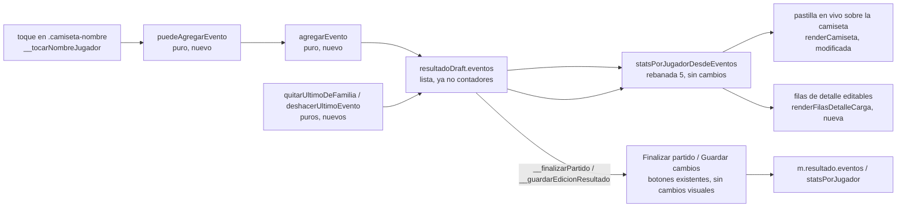
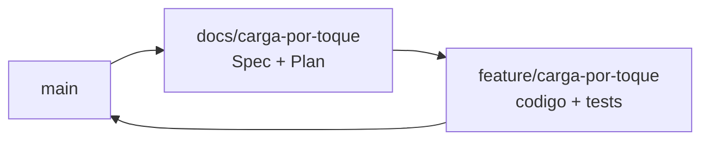

# La carga por toque (rebanada 6 de "Equipos en el campo") — Implementation Plan

> **Status:** Draft · **Date:** 2026-09-01 · **Owner:** Lucas Manoukian
>
> **Reviewers:** *pending*
>
> **Spec:** [CARGA_POR_TOQUE_SPEC.md](./CARGA_POR_TOQUE_SPEC.md)
>
> **Concept note:** [EQUIPOS_EN_EL_CAMPO_CONCEPT.md](../EQUIPOS_EN_EL_CAMPO_CONCEPT.md)
>
> **Planes de las rebanadas anteriores:** [rebanada-1-cancha/CANCHA_IMPLEMENTATION_PLAN.md](../rebanada-1-cancha/CANCHA_IMPLEMENTATION_PLAN.md) ·
> [rebanada-2-arrastre/ARRASTRE_IMPLEMENTATION_PLAN.md](../rebanada-2-arrastre/ARRASTRE_IMPLEMENTATION_PLAN.md) ·
> [rebanada-3-panel-armado/PANEL_ARMADO_IMPLEMENTATION_PLAN.md](../rebanada-3-panel-armado/PANEL_ARMADO_IMPLEMENTATION_PLAN.md) ·
> [rebanada-4-partido-finalizado/PARTIDO_FINALIZADO_IMPLEMENTATION_PLAN.md](../rebanada-4-partido-finalizado/PARTIDO_FINALIZADO_IMPLEMENTATION_PLAN.md) ·
> [rebanada-5-modelo-eventos/MODELO_EVENTOS_IMPLEMENTATION_PLAN.md](../rebanada-5-modelo-eventos/MODELO_EVENTOS_IMPLEMENTATION_PLAN.md)

> **Grounding evidence (`MD-25`).** Este Plan se apoya en el ledger §6.5 del
> Concept Note y en las citas en línea de `CARGA_POR_TOQUE_SPEC.md`. Cada
> tarea que toca un lugar concreto de `index.html` lo cita en la propia
> tarea; las líneas citadas corresponden al estado del archivo tras el merge
> de la rebanada 5 (`92f13eb`, incluye el fix de `a1223bd`). Los números de
> línea de las funciones a **borrar** o **modificar** se verificaron leyendo
> el archivo real antes de escribir este Plan, no se infirieron del Module
> map de rebanadas anteriores.

## 1. Summary

Se agregan nueve funciones puras y una nueva variable de módulo
(`tipoEventoActivo`) a `index.html`; se modifican seis funciones existentes
para que el borrador de carga (`resultadoDraft`) sostenga una lista de
eventos en vez de cuatro contadores; y se borran siete funciones que quedan
muertas porque esta rebanada es la última que dependía de la grilla numérica
(`D-12`, `D-08`). El cambio central es una sola línea: `mostrarCanchaDeEquipos`
deja de existir y sus cinco puntos de llamada dejan de tener una rama
alternativa — la cancha se muestra siempre, sin excepción, cerrando la
frontera que la rebanada 4 dejó abierta ([`index.html:4024-4027`](../../../index.html#L4024-L4027)).
El toque ocurre sobre el **nombre** de cada jugador (no sobre toda la
camiseta), lo que resuelve sin controles nuevos el caso de una dupla de
rotación: cada integrante es su propio destino de toque (`FR-030b`, hallado
al escribir este Plan y ya incorporado a la Spec).

## 2. Goals & non-goals

- **Objetivo técnico 1** — Que `resultadoDraft` sea, en todo momento en que
  el modo de carga está activo, una lista de eventos (`{jugadorId, tipo}[]`)
  y no contadores; que las cuatro funciones que hoy la leen/escriben
  (`__finalizarPartido`, `__editarResultadoFinalizado`,
  `__guardarEdicionResultado`, `teamHeaderTotalText`) pasen exclusivamente
  por las tres funciones de derivación/síntesis de la rebanada 5, nunca por
  un cálculo paralelo (`TC-002`).
- **Objetivo técnico 2** — Que la cancha se muestre en **todo** estado del
  partido, sin ninguna rama que vuelva a la lista (`TC-011` de este Plan;
  cierra `D-12`).
- **Objetivo técnico 3** — Que el código que sólo servía a la lista quede
  borrado en el mismo PR, no comentado ni dejado "por si acaso": es
  exactamente el criterio que la Spec cita en `FR-070` (una sola vía de
  guardado) llevado al código de lectura.

**Non-goals:**

- No se toca el motor de generación de equipos ni sus estrategias (`D-01`).
- No se agrega infraestructura de feature flags (`D-12`, `TD-09` heredado de
  la rebanada 5: no hay flags en el proyecto y el Principio II prohíbe
  anticiparlos).
- No se migra ningún partido histórico (`D-06`).
- No se modifican `renderFilasDetalle`, `goleadoresDeEquipo` ni
  `renderChipsEstadistica` (rebanada 4, modo lectura de un finalizado sin
  editar): esta rebanada agrega sus propias funciones para el modo de
  carga en vez de generalizar las de lectura, mismo criterio que `TD-06` de
  la rebanada 5 usó para no mezclar dominios de datos distintos en un mismo
  archivo de test.

## 3. Architecture overview



La flecha que importa es que `deriva` (`statsPorJugadorDesdeEventos`) es la
**única** función que convierte eventos en números, tanto para la pastilla
en vivo como para las filas de detalle como para lo que finalmente se
persiste: no hay una segunda calculadora para "mientras se carga" (`TC-002`,
reafirma `TC-010` de la rebanada 5).

### 3.1 Key design decisions

| ID | Decision | Spec ref | Rationale |
|---|---|---|---|
| TD-01 | **Enmendado tras probar en un teléfono real** (ver Change log): sobre una unidad individual el toque abarca toda `<div class="camiseta">`, no sólo el nombre; sobre una dupla sigue acotado a cada `<span class="camiseta-nombre">`, sin cambios | `FR-030`, `FR-030b` | Es lo que permite que una dupla (dos nombres, una sola camiseta compartida, [`index.html:4270-4273`](../../../index.html#L4270-L4273)) tenga dos destinos de toque independientes sin agregar ningún control nuevo — cada nombre ya es un elemento propio. Sobre una unidad individual no hay ninguna ambigüedad que resolver, así que restringir el toque al nombre sólo angostaba el blanco sin ninguna ganancia — lo que un teléfono real hizo evidente y una revisión de código no |
| TD-02 | `mostrarCanchaDeEquipos` se **borra**, no se modifica para devolver `true` siempre | `TC-011`, `D-12` | Una función que siempre devuelve lo mismo no es una función, es una constante disfrazada; dejarla invita a que alguien reintroduzca una condición en el futuro. Borrarla junto con sus cinco puntos de llamada hace la reversión imposible por accidente, que es literalmente el propósito de `D-12` ("sin un camino de vuelta") |
| TD-03 | La validación (`puedeAgregarEvento`) y la escritura (`agregarEvento`) son dos funciones puras separadas, no una sola que valide-y-agregue | `FR-032`, `FR-034` | Mismo criterio que `TD-01` de la rebanada 5 (separar "decidir" de "calcular"): permite testear la regla de negocio (¿este toque es válido?) sin necesitar armar un array de eventos, y viceversa |
| TD-04 | `quitarUltimoDeFamilia` recibe la `familia` ya resuelta (`'goles'\|'contra'\|'asist'`) como parámetro, no el `tipo` de evento activo — es el llamador (`__quitarUltimoDeFamiliaCarga`) quien la resuelve leyendo de qué fila vino el toque | `FR-051` | La función pura no necesita saber que `golPenal` es parte de la familia `'goles'`; esa regla vive una sola vez, en `familiaDeTipo`, y todo el resto del código la consume ya resuelta |
| TD-05 | Las nueve funciones puras nuevas se agregan inmediatamente después de `statsPorJugadorDelPartido` ([`index.html:3909`](../../../index.html#L3909)), antes de `totalGolesEquipo` ([`index.html:3914`](../../../index.html#L3914)) | `TC-001` | Mismo vecindario que `TD-05` de la rebanada 5 eligió para sus tres funciones: es el bloque de funciones puras sobre `stats`/`eventos`, y ahora las de esta rebanada quedan al lado de las que consumen |
| TD-06 | `renderFilasDetalleCarga` y `detalleCargaDeEquipo` son funciones **propias** de esta rebanada, no una generalización de `renderFilasDetalle`/`goleadoresDeEquipo` (rebanada 4) | Spec §2 Non-goals | La lectura de un finalizado sin editar no debe arriesgar una regresión por un cambio pensado para la carga; además, a diferencia de `goleadoresDeEquipo`, `detalleCargaDeEquipo` incluye una fila de asistencias, que la de lectura nunca tuvo |
| TD-07 | El estado `tipoEventoActivo` es una variable de módulo, igual que `resultadoDraft` y `editandoResultadoFinalizado` — no vive dentro de `resultadoDraft` | Spec §10.1 | `resultadoDraft` es la forma que se persiste (colapsada a `m.resultado`); `tipoEventoActivo` es puramente de interfaz y no tiene sentido guardarla ni sintetizarla al reabrir un finalizado — mezclar las dos volvería ambiguo qué campos de `resultadoDraft` importan al guardar |
| TD-08 | El equipo visible durante la carga se resuelve con las variables `equipoVisibleCancha`/`partidoDelEquipoVisible` y la función `renderSelectorEquipo` que ya existen ([`index.html:4415-4418`](../../../index.html#L4415-L4418), `D-21`) — no se agrega un segundo selector de equipo | `FR-020`, `TC-010` | Es exactamente el mismo control que ya resuelve qué equipo se ve en armado y en lectura; agregar uno paralelo violaría el Principio II y `TC-010` de la Spec |
| TD-09 | Sin feature flag | `D-12` | Heredado de las cinco rebanadas anteriores |

## 4. Module map

| Module / package | Role | Status |
|---|---|---|
| `index.html` — nueve funciones puras nuevas, después de `statsPorJugadorDelPartido` ([`index.html:3909`](../../../index.html#L3909)) | `familiaDeTipo`, `puedeAgregarEvento`, `agregarEvento`, `quitarUltimoDeFamilia`, `deshacerUltimoEvento`, `enModoCarga`, `detalleCargaDeEquipo` (`TD-01` a `TD-06`) | new |
| `index.html` — variable de módulo `tipoEventoActivo` (junto a `resultadoDraft`, [`index.html:1316-1317`](../../../index.html#L1316-L1317)) | Tipo de evento activo del selector (`FR-010`, `FR-011`) | new |
| `index.html` — constante `ICON_DESHACER` (junto a `ICON_CANDADO_ABIERTO`/`ICON_ROTACION`, [`index.html:4212-4213`](../../../index.html#L4212-L4213)) | Único asset nuevo de esta rebanada (`TC-031`) | new |
| `index.html` — `ensureResultadoDraft` ([`index.html:3757-3763`](../../../index.html#L3757-L3763)) | Inicializa `resultadoDraft.eventos = []` en vez de contadores; resetea `tipoEventoActivo` (`FR-005`, `FR-011`) | modified |
| `index.html` — `__finalizarPartido` ([`index.html:3765-3808`](../../../index.html#L3765-L3808)) | Escribe `m.resultado.eventos = resultadoDraft.eventos` directamente; el recálculo de acumulados pasa por `statsPorJugadorDesdeEventos` (`FR-071`) | modified |
| `index.html` — `__editarResultadoFinalizado` ([`index.html:3811-3824`](../../../index.html#L3811-L3824)) | El borrador se llena con `m.resultado.eventos` tal cual, o con `eventosDesdeStats(...)` si el partido es histórico; resetea `tipoEventoActivo` (`FR-005`, `FR-005b`) | modified |
| `index.html` — `__guardarEdicionResultado` ([`index.html:3834-3862`](../../../index.html#L3834-L3862)) | Escribe `eventos` o `statsPorJugador` según cuál tenía el partido, ambas ramas leyendo `resultadoDraft.eventos` (`FR-072`, `FR-073`) | modified |
| `index.html` — `teamHeaderTotalText` ([`index.html:3920-3933`](../../../index.html#L3920-L3933)) | La rama de borrador activo deriva con `statsPorJugadorDesdeEventos(resultadoDraft.eventos, ...)` en vez de leer `resultadoDraft.stats` (`FR-022`) | modified |
| `index.html` — `renderCamiseta` ([`index.html:4236-4301`](../../../index.html#L4236-L4301)) | El nombre gana el toque cuando `enModoCarga(m) && isAdmin()` (`FR-030`, `FR-030b`); los chips durante la carga se derivan del borrador, no de `m.resultado` (`FR-040`, `FR-041`) | modified |
| `index.html` — `esFilaEditable` ([`index.html:4037-4045`](../../../index.html#L4037-L4045)) | Su cálculo de `cerrada` pasa a delegar en `enModoCarga(m)`, sin duplicar la lógica (`TD-05` de este Plan, DRY) | modified |
| `index.html` — `renderZonaEquipos` ([`index.html:4414-4425`](../../../index.html#L4414-L4425)) | La línea 4419 pierde `&& mostrarCanchaDeEquipos(m)`, que queda vacuamente cierto (`TD-02`) | modified |
| `index.html` — `renderTeamsSection` ([`index.html:5037-5167`](../../../index.html#L5037-L5167)) | Los cuatro usos de `mostrarCanchaDeEquipos(m) ? renderCanchaEquipo(...) : ...` (líneas 5097-5104, 5128-5135) se simplifican a la sola rama de cancha, con las filas de detalle editables agregadas debajo cuando `enModoCarga(m)`; se agrega `renderToolbarCarga(m)` antes de `renderZonaEquipos`; se borra el bloque de wiring de `.team-stat-input` (líneas 5145-5166) | modified |
| `index.html` — `mostrarCanchaDeEquipos` ([`index.html:4024-4035`](../../../index.html#L4024-L4035)) | Función completa, con su comentario | **deleted** |
| `index.html` — `renderStatsYPuntajeMiembro` ([`index.html:3944-3991`](../../../index.html#L3944-L3991)) | Sin llamadores una vez que `renderTeamPlayerRow`/`renderTeamPlayerRowDupla` se borran | **deleted** |
| `index.html` — `renderLockBtn` ([`index.html:4014-4022`](../../../index.html#L4014-L4022)) | Sin llamadores fuera de las dos funciones de fila que se borran | **deleted** |
| `index.html` — `renderTeamPlayerRow` ([`index.html:4047-4064`](../../../index.html#L4047-L4064)) | Sólo la llamaba `renderFilaEquipo` | **deleted** |
| `index.html` — `renderTeamPlayerRowDupla` ([`index.html:4070-4116`](../../../index.html#L4070-L4116)) | Idem | **deleted** |
| `index.html` — `renderFilaEquipo` ([`index.html:4156-4158`](../../../index.html#L4156-L4158)) | Sólo la llamaban las cuatro ramas `: agruparFilasDeEquipo(...).map(...)` que se borran junto con ella | **deleted** |
| `index.html` — `actualizarAsistenciasHabilitadas` ([`index.html:5170-5183`](../../../index.html#L5170-L5183)) | Su lógica (gating de asistencias) se reencarna en `puedeAgregarEvento` (`FR-032`) | **deleted** |
| `index.html` — `actualizarPenalesHabilitados` ([`index.html:5187-5202`](../../../index.html#L5187-L5202)) | Su restricción queda obsoleta por `FR-033` (`D-04`) | **deleted** |
| `index.html` — `agruparFilasDeEquipo`, `jugadoresDeEquipoOrdenados`, `posicionAsignadaDe`, `valorDePuntaje`, `esFilaEditable` (cálculo de `editable`/candado/arrastre) | Compartidas con la cancha (armado, lectura); ningún llamador desaparece | untouched |
| `index.html` — `renderFilasDetalle`, `goleadoresDeEquipo`, `renderChipsEstadistica`, `statsAgregadasDeUnidad`, `renderEncabezadoPartidoFinalizado`, `renderFilaResultado` (modo lectura, rebanada 4) | Ningún camino de esta rebanada las llama ni las modifica (`TD-06`) | untouched |
| `index.html` — `statsPorJugadorDesdeEventos`, `eventosDesdeStats`, `statsPorJugadorDelPartido` (rebanada 5) | Reutilizadas sin cambios (`TC-002`) | untouched |
| `tests/toque.test.js` | Archivo nuevo: las siete funciones puras (`TD-05`) | new |
| `tests/layout.test.js` | Escenario nuevo `carga-por-toque` (`S-01`, `S-01a`, `S-01c`, `S-01e`, `S-05a`, `S-06`, `S-07`, `S-07a`, `S-07b`, `S-07c`, `S-07d`) y mediciones de `NFR-001`/`NFR-002`/`NFR-003` | modified |
| `AGENTS.md` | Gana la línea `node tests/toque.test.js` | modified |

## 5. Engineering rules / project conventions reference

Restatadas de [`AGENTS.md`](../../../AGENTS.md), mismas que las cinco
rebanadas anteriores.

| Rule | Summary |
|---|---|
| Estructura | Toda la aplicación en `index.html`, dentro de un IIFE. Sin build, sin bundler, sin framework (`TC-001`) |
| Imports | No aplica: no hay módulos |
| Typing | No aplica: JavaScript sin type-checker configurado |
| Logging | No aplica |
| Tests | `tests/*.test.js`, se corren con `node tests/<archivo>`. Devuelven 1 solo ante regresión |
| Binding | El identificador de la Spec va en forma canónica con guion **dentro de un string literal**, con el prefijo de rebanada `toque/`: el nombre del caso en `tests/toque.test.js` y el campo `spec: ['toque/S-01a']` de cada escenario/aserción de `tests/layout.test.js`. Nunca en comentarios |
| Supply-chain | `none — el repositorio no versiona ningún lockfile; la aplicación no tiene dependencias instaladas` |
| Constants | Un solo valor visual nuevo: `ICON_DESHACER` (`TC-031`). El resto de la interfaz reutiliza tokens y clases ya existentes (`TC-030`) |
| Commits | Conventional Commits con asunto en español: `tipo(scope): asunto (IDs de la Spec)`, ≤ 72 caracteres, un cambio lógico por commit |
| Backwards compat | Requerida en los datos (`NFR-005`): el formato de un partido histórico no cambia al editarlo por toque. No requerida en la interfaz: la grilla numérica desaparece por diseño (`D-12`) |
| Lint / type-check | `none — el repositorio no tiene linter ni type-checker configurados`. `T-1.D3` y `T-1.D4` pasan de forma vacua y se declaran como tales |

## 6. Definition of Done (every branch)

- [ ] La implementación sigue las convenciones de §5
- [ ] Cada sección de la Spec asignada a la rama está implementada
- [ ] Cada escenario (`S-*`) y cada variante tiene un test ejecutable (`AC-50`; `T-1.D8` y `T-1.D8b`)
- [ ] Cada NFR cuantificado (`NFR-001`, `NFR-002`, `NFR-004`) tiene un test de medición (`AC-51`; `T-1.D9`)
- [ ] Cada `TC-*` de la Spec §4 tiene una entrada de verificación en §12.9 y su criterio en Spec §11.3 (`AC-52`; `T-1.D10` y `T-1.D10b`)
- [ ] Las consecuencias están enumeradas en §12.2 (`AC-53`; `T-1.D15`)
- [ ] Cada NFR cuantificado tiene al menos una fila `OBS-*` en §11 (`AC-54`; `T-1.D16`)
- [ ] El lockfile pasa la auditoría, o §5 declara `Supply-chain: none` (`AC-55`; `T-1.D20`)
- [ ] Cada riesgo `R-*` de §14 registra una vía de mitigación (`T-1.D17`)
- [ ] Auto-consistencia: todo ID referenciado dentro de este Plan resuelve dentro de este Plan (`T-1.D18`)
- [ ] Consistencia cruzada: todo ID de la Spec citado acá existe en la Spec, y todo `D-*` existe en el Concept Note (`T-1.D19`)
- [ ] Todos los tests nuevos pasan
- [ ] Todos los tests existentes pasan, sin regresiones — `node tests/motor.test.js`, `node tests/cancha.test.js`, `node tests/panel.test.js`, `node tests/finalizado.test.js`, `node tests/eventos.test.js` y `LAYOUT_STRICT=1 node tests/layout.test.js`
- [ ] Linter: no aplica (§5), declarado
- [ ] Type-checker: no aplica (§5), declarado
- [ ] No quedan `TODO`, `FIXME` ni `HACK` en el código commiteado
- [ ] El historial de commits es limpio y sigue el formato de §5 (`T-1.D11`)
- [ ] La descripción del PR resume los cambios y cita las secciones de la Spec (`T-1.D12`)
- [ ] **Gate propio de esta rebanada:** ningún llamador de las siete funciones borradas (§4) sobrevive — `git grep` de cada nombre borrado sobre `index.html` después del borrado devuelve cero resultados (`T-1.D13`)
- [ ] PR abierto contra `main` (`T-1.D14`)

## 7. Branch / phase plan

### 7.0 Branch sizing (`MD-27`)

```
Custom arc: 1 branch — D-11 del Concept Note fija dos ramas por rebanada
(`docs/<rebanada>` y `feature/<rebanada>`), y D-08 ya usa la rebanada como
unidad de división del trabajo, mismo criterio que las cinco rebanadas
anteriores. Aunque el alcance de código es mayor que el de la rebanada 5
(agrega interacción nueva Y borra código muerto), no hay una frontera de
despliegue real que separar: la interacción de toque y el borrado del
código que reemplaza son la misma unidad indivisible — no tendría sentido
mergear "el toque funciona" mientras la grilla vieja sigue ahí sin
llamadores, ni viceversa.
```

### 7.1 Branch tracker

| # | Git branch | Base branch | Status | PR | Tests | Notes |
|---|---|---|---|---|---|---|
| 1 | `feature/carga-por-toque` | `main` | Not started | — | — | Abrir después de mergear `docs/carga-por-toque`, según `D-11` |



---

### 7.2 Branch 1 — `feature/carga-por-toque`

**Goal:** que la carga y edición de un resultado se hagan tocando el nombre
de cada jugador sobre la cancha, con selector de tipo de evento, pastilla en
vivo, botón `−` por familia y Deshacer; que la grilla numérica y todo el
código que sólo ella usaba queden borrados; que
`node tests/toque.test.js` y el escenario nuevo de
`node tests/layout.test.js` lo verifiquen, sin que ningún test existente
cambie de resultado.

**Spec coverage:** `FR-001` a `FR-081` (incluidas `FR-005b` y `FR-030b`),
los seis `NFR-*`, los once `TC-*` y los dieciocho `AC-*`.

#### 7.2.1 Design decisions specific to this branch

> **Borrar antes de wire-up, no después.** El orden de los commits pone la
> escritura de las funciones nuevas primero, la interacción después, y el
> borrado de la grilla vieja **al final**, cuando ya no tiene ningún
> llamador real (`T-1.D13` lo verifica). Borrar antes dejaría a la
> aplicación sin forma de cargar un resultado durante los commits
> intermedios — no rompe ningún test porque los tests corren al final de
> cada rama, pero rompería la app si alguien la abriera a mitad de un
> commit local.

> **Los números de línea son del archivo antes de esta rama, no se
> recalculan tarea por tarea.** Cada cita de línea en §7.2.5/§7.2.9 se
> verificó leyendo `index.html` en el estado posterior al merge de la
> rebanada 5, **antes** de que ninguna tarea de esta rama corra. Una tarea
> que edita una función (`T-1.10`, `T-1.13`) desplaza los números de línea
> de todo lo que está debajo dentro del mismo archivo; las tareas
> posteriores que citan una línea dentro de una zona ya tocada (`T-1.22`,
> sobre `renderTeamsSection` después de `T-1.13`) deben ubicarse por el
> nombre de función o el selector CSS citado, no confiando en que el
> número siga exacto.

> **`enModoCarga` resuelve `A-03` de la Spec, no sólo la registra.** La
> Spec dejaba como supuesto que el toque no colisiona con el arrastre
> nativo de la rebanada 2. Este Plan lo verifica con el propio código: el
> toque se activa cuando `enModoCarga(m)` es cierto, y el arrastre
> (`arrastrable = esFilaEditable(m)`) sólo cuando `esFilaEditable(m)` es
> cierto — y por construcción (líneas 4037-4045) `esFilaEditable` exige
> `!cerrada`, donde `cerrada` es exactamente `enModoCarga(m)`. Los dos
> nunca pueden ser ciertos a la vez sobre el mismo partido: no hay ningún
> render posible con toque y arrastre activos simultáneamente sobre la
> misma camiseta. `A-03` queda resuelta, no sólo supuesta.

#### 7.2.2 New types / enums

No hay sistema de tipos en el proyecto. Formas conceptuales nuevas:

| Forma | Campos | Notas |
|---|---|---|
| `resultadoDraft` (nueva forma) | `{ matchId: string, eventos: Evento[] }` | Reemplaza `{ matchId, stats: {...} }`. `Evento` es la forma que ya fijó la rebanada 5 (`{jugadorId, tipo}`) |
| Familia de evento | `'goles' \| 'contra' \| 'asist'` | `'goles'` agrupa `gol` y `golPenal`; devuelta por `familiaDeTipo` (`FR-051`) |
| Fila de detalle de carga | `{ p: Player, familia: string, cantidad: number, nota: string }` | Salida de `detalleCargaDeEquipo`, consumida por `renderFilasDetalleCarga` |

#### 7.2.3 New constants

File: `index.html`, junto a `ICON_CANDADO_ABIERTO`/`ICON_ROTACION` ([`index.html:4212-4213`](../../../index.html#L4212-L4213))

| Constant | Value | Purpose |
|---|---|---|
| `ICON_DESHACER` | SVG inline, mismo estilo que `ICON_ROTACION` (flecha curva hacia atrás) | Ícono del botón Deshacer (`TC-031`, único asset nuevo) |

#### 7.2.4 Configuration

Ninguna configuración nueva. Sin feature flag (`TD-09`).

#### 7.2.5 New / modified interfaces

File: `index.html`

| Función | Firma | Notas |
|---|---|---|
| `familiaDeTipo` | `(tipo: string) -> 'goles' \| 'contra' \| 'asist'` | Pura. `gol`/`golPenal` → `'goles'`; `golEnContra` → `'contra'`; `asistencia` → `'asist'` (`FR-051`) |
| `puedeAgregarEvento` | `(eventos: Evento[], idsConvocados: string[], jugadorId: string, tipo: string, idsEquipoDeJugador: string[]) -> boolean` | Pura. `false` si `jugadorId` no está en `idsConvocados` (`FR-034`); si `tipo==='asistencia'`, `false` cuando `idsEquipoDeJugador` no tiene ningún evento de familia `'goles'` en `eventos` (`FR-032`); `true` en cualquier otro caso — en particular, nunca deshabilita un `golPenal` por goles previos (`FR-033`) |
| `agregarEvento` | `(eventos: Evento[], jugadorId: string, tipo: string) -> Evento[]` | Pura, inmutable: `[...eventos, {jugadorId, tipo}]` (`FR-030`, `FR-031`) |
| `quitarUltimoDeFamilia` | `(eventos: Evento[], jugadorId: string, familia: string) -> Evento[]` | Pura, inmutable. Recorre `eventos` de atrás hacia adelante y quita el primer elemento con ese `jugadorId` cuya `familiaDeTipo(tipo)` coincide; si no hay ninguno, devuelve `eventos` sin cambios (`FR-051`) |
| `deshacerUltimoEvento` | `(eventos: Evento[]) -> Evento[]` | Pura: `eventos.slice(0, -1)` (`FR-061`) |
| `enModoCarga` | `(m: Partido) -> boolean` | Pura. `(m.inscripcionCerrada && m.estado !== 'Finalizado') \|\| (m.estado === 'Finalizado' && editandoResultadoFinalizado === m.id)`. Extrae el cálculo que hoy está duplicado en `esFilaEditable` (línea 4040) y en la `renderStatsYPuntajeMiembro` que se borra (línea 3947) |
| `detalleCargaDeEquipo` | `(ids: string[], eventos: Evento[]) -> FilaDetalleCarga[]` | Pura. Deriva con `statsPorJugadorDesdeEventos(eventos, ids)` (`TC-002`) y devuelve una fila por jugador y familia con cantidad > 0, incluida la de asistencias (a diferencia de `goleadoresDeEquipo`, `TD-06`) (`FR-042`) |
| `ensureResultadoDraft` | *(firma sin cambios)* | Línea 3762 pasa de `resultadoDraft = { matchId: m.id, stats }` a `resultadoDraft = { matchId: m.id, eventos: [] }`, seguida de `tipoEventoActivo = 'gol'` (`FR-005`, `FR-011`) |
| `__finalizarPartido` | *(firma sin cambios)* | La línea que arma `m.resultado` pasa a `{ eventos: resultadoDraft.eventos, finalizadoEn: Date.now() }`; el bloque de acumulados (líneas 3780-3799) deriva `const stats = statsPorJugadorDesdeEventos(resultadoDraft.eventos, idsConvocados)` una vez y la usa en `totalGolesEquipo`/`Object.entries` en vez de `resultadoDraft.stats` (`FR-071`) |
| `__editarResultadoFinalizado` | *(firma sin cambios)* | Reemplaza la construcción de `stats` (líneas 3816-3820) por: `eventos: Array.isArray(m.resultado.eventos) ? [...m.resultado.eventos] : eventosDesdeStats(idsConvocados, m.resultado.statsPorJugador \|\| {})`; agrega `tipoEventoActivo = 'gol'` (`FR-005`, `FR-005b`, `FR-011`) |
| `__guardarEdicionResultado` | *(firma sin cambios)* | La bifurcación (línea 3845) pasa a: si `Array.isArray(m.resultado.eventos)`, `m.resultado.eventos = resultadoDraft.eventos`; si no, `m.resultado.statsPorJugador = statsPorJugadorDesdeEventos(resultadoDraft.eventos, idsConvocados)` (`FR-072`, `FR-073`) |
| `teamHeaderTotalText` | *(firma sin cambios)* | Línea 3927 pasa a `totalGolesEquipo(ids, idsRival, statsPorJugadorDesdeEventos(resultadoDraft.eventos, [...m.equipos.blanco, ...m.equipos.negro]))` (`FR-022`) |
| `esFilaEditable` | *(firma sin cambios)* | Línea 4040 pasa de calcular `cerrada` inline a `const cerrada = enModoCarga(m);` |
| `renderCamiseta` | *(firma sin cambios)* | Ver §7.2.5.1 abajo — es el cambio más grande de la rama |
| `renderToolbarCarga` | `(m: Partido) -> string` | Nueva. `''` si `!enModoCarga(m) \|\| !isAdmin()`. Si no, el selector de 4 opciones (`FR-010`-`FR-013`) + Deshacer (`FR-060`-`FR-062`) |
| `renderFilasDetalleCarga` | `(m: Partido, ids: string[], eventos: Evento[], editable: boolean) -> string` | Nueva. Usa `detalleCargaDeEquipo`; cada fila lleva el botón `−` sólo si `editable` (`FR-042`, `FR-043`, `FR-050`) |
| `window.__tocarNombreJugador` | `(matchId: string, jugadorId: string) -> void` | Nuevo handler. Guardas de admin/estado/`enModoCarga` (`FR-080`, `FR-081`); valida con `puedeAgregarEvento`, agrega con `agregarEvento`, re-renderiza con `renderTeamsSection(m)` |
| `window.__quitarUltimoDeFamiliaCarga` | `(matchId: string, jugadorId: string, familia: string) -> void` | Nuevo handler para el botón `−` (`FR-051`) |
| `window.__deshacerUltimoEventoCarga` | `(matchId: string) -> void` | Nuevo handler para Deshacer (`FR-061`) |
| `window.__cambiarTipoEventoActivo` | `(tipo: string) -> void` | Nuevo handler para el selector de evento (`FR-012`) |
| `renderZonaEquipos` | *(firma sin cambios)* | Línea 4419: `enUnaColumna() && mostrarCanchaDeEquipos(m)` → `enUnaColumna()` |
| `renderTeamsSection` | *(firma sin cambios)* | Ver §7.2.5.2 abajo |

##### 7.2.5.1 `renderCamiseta` — detalle del cambio

```
const enCarga = enModoCarga(m);
const idsEquipo = m.equipos.blanco.includes(p.id) ? m.equipos.blanco : m.equipos.negro;
const statsDraft = (enCarga && resultadoDraft && resultadoDraft.matchId === m.id)
  ? statsPorJugadorDesdeEventos(resultadoDraft.eventos, [...m.equipos.blanco, ...m.equipos.negro])
  : null;
const chips = finalizadoSinEditarChips
  ? renderChipsEstadistica(statsAgregadasDeUnidad(grupo, statsPorJugadorDelPartido(m)))
  : (statsDraft ? renderChipsEstadistica(statsAgregadasDeUnidad(grupo, statsDraft)) : { asistenciasHtml: '', golesHtml: '' });

const puedeTocar = enCarga && isAdmin();
const nombreSpan = (jug) => '<span class="camiseta-nombre"'
  + (puedeTocar ? ' onclick="window.__tocarNombreJugador(\'' + m.id + '\',\'' + jug.id + '\')" role="button" tabindex="0"' : '')
  + '>' + escaparHtml(nombreCorto(jug)) + '</span>';
const nombreHtml = esUnidadDupla
  ? '<div class="camiseta-dupla">' + nombreSpan(grupo[0]) + ICON_ROTACION + nombreSpan(grupo[1]) + '</div>'
  : nombreSpan(p);
```

`idsEquipo` reemplaza el uso ad-hoc que hoy existe sólo dentro de
`renderStatsYPuntajeMiembro` (que se borra); acá se necesita para pasarlo a
`puedeAgregarEvento` desde el handler, no desde `renderCamiseta` (`renderCamiseta`
no valida, sólo pinta — la validación vive en `__tocarNombreJugador`, `TD-03`).

##### 7.2.5.2 `renderTeamsSection` — detalle del cambio

Las cuatro ramas `mostrarCanchaDeEquipos(m) ? renderCanchaEquipo(m, X, equipo) : agruparFilasDeEquipo(...).map(renderFilaEquipo).join('')`
(líneas 5097-5104 y 5128-5135) se reemplazan por:

```
contenido: renderCanchaEquipo(m, Xplayers, 'equipo')
  + (enModoCarga(m)
      ? '<div class="detalle-equipo">' + renderFilasDetalleCarga(m, eq.equipo,
          (resultadoDraft && resultadoDraft.matchId === m.id) ? resultadoDraft.eventos : [],
          isAdmin()) + '</div>'
      : '')
```

(`isAdmin()` como `editable`: un jugador ve las filas de detalle sin botón
`−`, nunca el control — `FR-003`.) Antes de `${renderZonaEquipos(m, {...})}`
en la rama admin (línea ~5125) se agrega `${renderToolbarCarga(m)}`. El
bloque `section.querySelectorAll('.team-stat-input')...` (líneas 5145-5166)
se borra completo — no queda ningún `.team-stat-input` que atar.

#### 7.2.6 Tests

```
tests/toque.test.js   — funciones puras: 7 escenarios y variantes
tests/layout.test.js  — escenario nuevo `carga-por-toque`: interacción real
```

| File | What it covers |
|---|---|
| `tests/toque.test.js` | `familiaDeTipo`, `puedeAgregarEvento`, `agregarEvento`, `quitarUltimoDeFamilia`, `deshacerUltimoEvento`, `enModoCarga`, `detalleCargaDeEquipo`; el test de propiedad de `NFR-004` |
| `tests/layout.test.js` | Escenario `carga-por-toque`: toque real sobre `.camiseta-nombre`, toque sobre una dupla, botón `−`, Deshacer, cambio de pestaña de equipo, Finalizar/Guardar/Cancelar, rol `jugador`; mediciones de `NFR-001`/`NFR-002`/`NFR-003` |

#### 7.2.7 Verification

- [ ] Tocar el nombre de un jugador en `m-cerrado` con "Gol" activo agrega un evento y la pastilla muestra "1"
- [ ] Tocar el nombre de cada integrante de la dupla de `m-cerrado` por separado atribuye el evento sólo a ese integrante
- [ ] "−" sobre una fila con un `golPenal` como último evento de esa familia baja `goles` y `golesPenal` a la vez
- [ ] Deshacer con el borrador vacío está deshabilitado; con eventos, quita el más reciente sin importar tipo
- [ ] Finalizar con el borrador vacío persiste `eventos: []`
- [ ] Editar `m-finalizado-eventos` (rebanada 5) reabre el borrador con esos eventos tal cual; editar `m-finalizado` (histórico) lo sintetiza
- [ ] Ningún `.team-stat-input` se renderiza en ningún estado del partido
- [ ] Todos los tests existentes pasan

#### 7.2.8 Files inventory

**New files:**
```
tests/toque.test.js
```

**Modified files:**
```
index.html
tests/layout.test.js
AGENTS.md
```

**Deleted files:** ninguno (el borrado es de funciones dentro de `index.html`, no de archivos).

#### 7.2.9 Task checklist (agent-runnable)

Implementation tasks (agrupadas en commits atómicos):

- [ ] T-1.1 Agregar `familiaDeTipo`, `puedeAgregarEvento`, `agregarEvento`, `quitarUltimoDeFamilia`, `deshacerUltimoEvento`, `enModoCarga`, `detalleCargaDeEquipo` en `index.html`, después de `statsPorJugadorDelPartido` ([`index.html:3909`](../../../index.html#L3909)) (`FR-030` a `FR-061`, `TD-05`)
- [ ] T-1.2 [P] Agregar `let tipoEventoActivo = 'gol';` junto a `resultadoDraft` ([`index.html:1316-1317`](../../../index.html#L1316-L1317)) (`FR-011`)
- [ ] T-1.3 [P] Agregar `ICON_DESHACER` junto a `ICON_CANDADO_ABIERTO`/`ICON_ROTACION` ([`index.html:4212-4213`](../../../index.html#L4212-L4213)) (`TC-031`)
- [ ] T-1.C1 Commit — `feat(carga-por-toque): funciones puras de validación, borrador y detalle (FR-030, FR-032, FR-034, FR-051, FR-061)`

- [ ] T-1.4 Reescribir `ensureResultadoDraft` ([`index.html:3757-3763`](../../../index.html#L3757-L3763)) según `FR-005`/`FR-011`
- [ ] T-1.5 Reescribir `__finalizarPartido` ([`index.html:3765-3808`](../../../index.html#L3765-L3808)) según `FR-071`
- [ ] T-1.6 Reescribir `__editarResultadoFinalizado` ([`index.html:3811-3824`](../../../index.html#L3811-L3824)) según `FR-005`/`FR-005b`/`FR-011`
- [ ] T-1.7 Reescribir `__guardarEdicionResultado` ([`index.html:3834-3862`](../../../index.html#L3834-L3862)) según `FR-072`/`FR-073`
- [ ] T-1.8 [P] Reescribir la línea 3927 de `teamHeaderTotalText` ([`index.html:3920-3933`](../../../index.html#L3920-L3933)) según `FR-022`
- [ ] T-1.9 [P] Reescribir la línea 4040 de `esFilaEditable` para delegar en `enModoCarga(m)`
- [ ] T-1.C2 Commit — `feat(carga-por-toque): el borrador de carga pasa a ser una lista de eventos (FR-005, FR-011, FR-022, FR-071, FR-072, FR-073)`

- [ ] T-1.10 Modificar `renderCamiseta` ([`index.html:4236-4301`](../../../index.html#L4236-L4301)) según §7.2.5.1: toque sobre el nombre, chips desde el borrador (`FR-030`, `FR-030b`, `FR-040`, `FR-041`)
- [ ] T-1.11 Agregar `renderToolbarCarga` y `renderFilasDetalleCarga`, cerca de `renderChipsEstadistica`/`renderFilasDetalle` ([`index.html:5242`](../../../index.html#L5242)) (`FR-010` a `FR-013`, `FR-042`, `FR-043`, `FR-050`, `FR-060`, `FR-062`)
- [ ] T-1.12 Agregar `window.__tocarNombreJugador`, `window.__quitarUltimoDeFamiliaCarga`, `window.__deshacerUltimoEventoCarga`, `window.__cambiarTipoEventoActivo`, junto a los demás handlers `window.__*` de esta zona (`FR-030`, `FR-051`, `FR-061`, `FR-012`, `FR-080`, `FR-081`)
- [ ] T-1.13 Modificar `renderTeamsSection` ([`index.html:5037-5167`](../../../index.html#L5037-L5167)) según §7.2.5.2: simplificar las cuatro ramas de `mostrarCanchaDeEquipos`, agregar `renderToolbarCarga(m)` y las filas de detalle editables
- [ ] T-1.14 Quitar `&& mostrarCanchaDeEquipos(m)` de la línea 4419 de `renderZonaEquipos`
- [ ] T-1.C3 Commit — `feat(carga-por-toque): el toque sobre el nombre carga eventos, con selector, pastilla en vivo y filas de detalle (FR-010, FR-030, FR-040, FR-042)`

- [ ] T-1.15 Borrar `mostrarCanchaDeEquipos` completa, con su comentario ([`index.html:4024-4035`](../../../index.html#L4024-L4035))
- [ ] T-1.16 Borrar `renderStatsYPuntajeMiembro` ([`index.html:3944-3991`](../../../index.html#L3944-L3991))
- [ ] T-1.17 [P] Borrar `renderLockBtn` ([`index.html:4014-4022`](../../../index.html#L4014-L4022))
- [ ] T-1.18 [P] Borrar `renderTeamPlayerRow` ([`index.html:4047-4064`](../../../index.html#L4047-L4064))
- [ ] T-1.19 [P] Borrar `renderTeamPlayerRowDupla` ([`index.html:4070-4116`](../../../index.html#L4070-L4116))
- [ ] T-1.20 [P] Borrar `renderFilaEquipo` ([`index.html:4156-4158`](../../../index.html#L4156-L4158))
- [ ] T-1.21 [P] Borrar `actualizarAsistenciasHabilitadas` ([`index.html:5170-5183`](../../../index.html#L5170-L5183)) y `actualizarPenalesHabilitados` ([`index.html:5187-5202`](../../../index.html#L5187-L5202))
- [ ] T-1.22 Borrar el bloque `section.querySelectorAll('.team-stat-input')...` que queda al final de `renderTeamsSection` después de `T-1.13` (líneas 5145-5166 **antes** de que `T-1.10`/`T-1.13` corran; ubicarlo por el selector `.team-stat-input`, no por número de línea, porque las ediciones anteriores de esta misma rama ya lo movieron)
- [ ] T-1.C4 Commit — `refactor(carga-por-toque): se borra la grilla numérica y todo el código que sólo ella usaba (D-12, TD-02)`

- [ ] T-1.23 Crear `tests/toque.test.js` con su lista `DECLARACIONES` (las siete funciones de `T-1.1`), reutilizando `extraer` de [`tests/harness.js`](../../../tests/harness.js)
- [ ] T-1.24 Escribir los casos de unidad de `S-01b`, `S-01d` (`toque/S-01b` etc.), `S-02`, `S-02a`, `S-02b`, `S-03`, `S-03a`, `S-03b`, `S-04`, `S-04a`, `S-04b`, `S-04c`, `S-05`, `S-05b`, `S-05c`, `S-06a` — `S-01c` **no** va acá: es `[concurrency]` sobre un toque real y se cubre en `T-1.27` (e2e), no acá
- [ ] T-1.25 Escribir el test de propiedad de `S-01d`/`NFR-004`: generar 500 secuencias de toques al azar sobre hasta 6 jugadores convocados (respetando `FR-032`/`FR-034` al generar), derivar el marcador con `totalGolesEquipo` + `statsPorJugadorDesdeEventos`, y compararlo contra un cálculo independiente (sumar directamente los tipos `gol`/`golPenal`/`golEnContra` de la secuencia)
- [ ] T-1.C5 Commit — `test(toque): casos de unidad de validación, borrador, detalle y el test de propiedad del marcador (S-01 a S-06)`

- [ ] T-1.26 Agregar el escenario `carga-por-toque` a `tests/layout.test.js`: abrir `m-cerrado` como `admin`, hacer `page.click` sobre `.camiseta-nombre` de un titular con "Gol" activo, comprobar la pastilla y `updateTeamTotalsDisplay`; repetir sobre los dos nombres de la dupla de `m-cerrado` y comprobar que cada evento se atribuye por separado (`toque/S-01`, `S-01a`, `S-01e`)
- [ ] T-1.27 En el mismo escenario, agregar: doble click casi simultáneo (`page.click` dos veces sin `await` entre medio) sobre el mismo nombre agrega dos eventos (`toque/S-01c`, cruza con `S-01d` de `T-1.25` para el marcador); Deshacer con el borrador vacío deshabilitado, con eventos habilitado (`toque/S-05a`); cambiar de pestaña de equipo y comprobar que el marcador del equipo no visible sigue actualizado (`toque/S-06`)
- [ ] T-1.28 Invocar `window.__finalizarPartido('m-cerrado')` con el borrador vacío tras los toques de `T-1.26`/`T-1.27` deshechos con Deshacer, y confirmar en `#btnConfirmOk` ([`index.html:1753`](../../../index.html#L1753)); comprobar `resultado.eventos` es `[]` en `window.__ultimosDocs.partidos` (`toque/S-07a`)
- [ ] T-1.29 Sobre `m-finalizado-eventos` (rebanada 5): `window.__editarResultadoFinalizado`, un toque, "Cancelar" — comprobar que `m.resultado` no cambió (`toque/S-07b`); sobre otro partido similar, `window.__editarResultadoFinalizado`, un toque, `window.__guardarEdicionResultado` + `#btnConfirmOk` — comprobar que `resultado.eventos` cambió (`toque/S-07`); repetir sobre `m-finalizado` (histórico) y comprobar que `resultado.statsPorJugador` cambió y `eventos` sigue ausente (`toque/S-07c`)
- [ ] T-1.30 Agregar la etiqueta `toque/S-07d` a los tres chequeos existentes de rol `jugador` que ya cubren `S-07d` sin necesitar un chequeo nuevo: `__finalizarPartido` ([`tests/layout.test.js:559-561`](../../../tests/layout.test.js#L559-L561)), `__guardarEdicionResultado` ([`tests/layout.test.js:563-569`](../../../tests/layout.test.js#L563-L569)) y `__editarResultadoFinalizado` ([`tests/layout.test.js:1144-1148`](../../../tests/layout.test.js#L1144-L1148)), las mismas líneas que ya llevan `eventos/S-20`/`finalizado/S-20`
- [ ] T-1.31 Medir, en los anchos ya cubiertos por `tests/layout.test.js`, el área de Deshacer (≥44×44 px) y del botón `−` (≥26×26 px en ≥390 px, ≥38×38 px en <390 px) y que ambos tengan `title`/`aria-label` no vacío (`toque/NFR-002`, `toque/NFR-003`)
- [ ] T-1.C6 Commit — `test(layout): la carga por toque, la dupla, el − y Deshacer quedan cubiertos por carga-por-toque (S-01, S-05, S-06, S-07)`

- [ ] T-1.32 Agregar a `AGENTS.md` la línea `node tests/toque.test.js` en su bloque de tests
- [ ] T-1.C7 Commit — `docs(agents): agrega node tests/toque.test.js al bloque de tests`

DoD verification (§6). Todo cambio de código hecho durante esta
verificación va en su propio commit de arreglo, nunca doblado dentro de uno
anterior:

- [ ] T-1.D1 Los tests nuevos pasan — `node tests/toque.test.js` y `LAYOUT_STRICT=1 node tests/layout.test.js`
- [ ] T-1.D2 Los tests existentes pasan, sin regresiones — `node tests/motor.test.js`, `node tests/cancha.test.js`, `node tests/panel.test.js`, `node tests/finalizado.test.js`, `node tests/eventos.test.js`
- [ ] T-1.D3 Linter — no aplica (§5). Se declara, no se marca en silencio
- [ ] T-1.D4 Type-checker — no aplica (§5). Se declara, no se marca en silencio
- [ ] T-1.D5 No quedan `TODO`/`FIXME`/`HACK` — `git grep -nE '(TODO|FIXME|HACK)[(:]' -- index.html tests/`
- [ ] T-1.D6 La implementación sigue §5
- [ ] T-1.D7 Cada `FR-*`, `NFR-*`, `TC-*` y `AC-*` de la Spec está implementado o verificado
- [ ] T-1.D8 Cada `S-NN` y cada variante tiene test — `comm -23 <(grep -oE '(^|[^A-Za-z])S-[0-9]+[a-z]*' docs/equipos-en-el-campo/rebanada-6-carga-por-toque/CARGA_POR_TOQUE_SPEC.md | sed -E 's/^[^S]+//' | sort -u) <(grep -rEho "toque/S-[0-9]+[a-z]*" tests/ | sed 's|toque/||' | sort -u)` devuelve vacío (`AC-50`)
- [ ] T-1.D8b Cada cabecera de escenario de Spec §9 lleva bloque `Variants:` — lint `awk` sobre `CARGA_POR_TOQUE_SPEC.md` devuelve vacío (`AC-50`)
- [ ] T-1.D9 Cada NFR cuantificado (`NFR-001`, `NFR-002`, `NFR-004`) tiene test de medición referenciado en §12 (`AC-51`)
- [ ] T-1.D10 Cada `TC-*` de Spec §4 aparece en §12.9 de este Plan — `comm -23 <(grep -oE "TC-[0-9]+" CARGA_POR_TOQUE_SPEC.md | sort -u) <(sed -n '/^### 12\.9/,/^## 13\./p' CARGA_POR_TOQUE_IMPLEMENTATION_PLAN.md | grep -oE "TC-[0-9]+" | sort -u)` devuelve vacío (`AC-52`)
- [ ] T-1.D10b Cada `TC-*` de Spec §4 tiene además su criterio en Spec §11.3 (`AC-52`, segundo conjunto)
- [ ] T-1.D11 El historial de commits es limpio — `git log --oneline main..HEAD`
- [ ] T-1.D12 Descripción del PR redactada
- [ ] T-1.D13 **Gate propio de esta rebanada:** `git grep -n "mostrarCanchaDeEquipos\|renderStatsYPuntajeMiembro\|renderLockBtn\|renderTeamPlayerRow\|renderFilaEquipo\|actualizarAsistenciasHabilitadas\|actualizarPenalesHabilitados" index.html` no devuelve ningún resultado
- [ ] T-1.D14 PR abierto contra `main`
- [ ] T-1.D15 §12.2 tiene al menos una fila `IMP-*` por ámbito afectado (`AC-53`)
- [ ] T-1.D16 Cada NFR cuantificado tiene fila `OBS-*` en §11 (`AC-54`)
- [ ] T-1.D17 Cada `R-*` de §14 registra vía de mitigación
- [ ] T-1.D18 Pasada de auto-consistencia dentro de este Plan
- [ ] T-1.D19 Pasada de consistencia cruzada contra la Spec y el Concept Note
- [ ] T-1.D20 Auditoría de cadena de suministro — §5 declara `Supply-chain: none`, pasa de forma vacua. `git ls-files package-lock.json package.json` sin resultado (`AC-55`)

## 8. Data model & migrations

### 8.1 Schema changes

Ninguno sobre lo persistido: `m.resultado.eventos`/`statsPorJugador` ya
existen desde la rebanada 5 y esta rebanada no les agrega ni les quita
ninguna clave. El único cambio de forma es en `resultadoDraft`, que **no se
persiste** (vive en memoria del cliente, Spec §10.1): pasa de
`{ matchId, stats: {...} }` a `{ matchId, eventos: [] }`.

### 8.2 Migration strategy

No aplica. No hay ninguna colección ni documento que migrar; el cambio de
forma de `resultadoDraft` desaparece solo al recargar la página, sin ningún
dato que sobreviva entre sesiones en ese estado.

### 8.3 Reversibility

Revertir el merge de `feature/carga-por-toque` restaura la grilla numérica
y borra la interacción de toque; ningún partido finalizado o editado entre
el merge y el revert queda en un formato ilegible, porque `m.resultado`
sigue teniendo exactamente la misma forma que la rebanada 5 ya fijó
(`eventos` o `statsPorJugador`) — esta rebanada no le agrega ni le quita
ninguna clave a lo persistido, sólo cambia cómo se llena.

## 9. API & contract changes

No hay endpoints ni contratos entre servicios, y no se introduce ningún par
productor/consumidor. No se consume ni se expone ninguna interfaz externa
nueva (Spec §10.2, §10.3).

## 10. Configuration & feature flags

Ninguno (`TD-09`).

## 11. Observability

> **Declaración honesta, heredada de las cinco rebanadas anteriores.** Esta
> aplicación no tiene telemetría de producción. Las filas de abajo son
> señales previas al merge, más el canal real de reportes del grupo.

| ID | Signal | Type | Source | Binds to | Threshold / use |
|---|---|---|---|---|---|
| OBS-01 | Resultado del test de propiedad de 500 secuencias de toques | métrica (pre-merge) | `tests/toque.test.js` | NFR-004 | Falla ante cualquier discrepancia entre el marcador derivado y el cálculo independiente |
| OBS-02 | Mediciones de `getBoundingClientRect()` de Deshacer y `−` en cada ancho de `tests/layout.test.js` | métrica (pre-merge) | `tests/layout.test.js` | NFR-002 | Falla si algún ancho mide menos de 44×44 px (Deshacer) o 26×26/38×38 px (`−`) |
| OBS-03 | `scrollWidth === clientWidth` y ningún elemento fuera del viewport en cada ancho medido | métrica (pre-merge) | `tests/layout.test.js` | NFR-001 | Falla ante cualquier desborde en la cancha de carga |
| OBS-04 | Reportes del grupo por su canal habitual tras el merge, específicamente sobre toques que no registran o que se atribuyen al integrante equivocado de una dupla | señal cualitativa | los usuarios | R-02, R-04 | Único canal post-deploy que este producto tiene |

**Dashboards:** ninguno.

## 12. Test plan

### 12.1 Scenario Traceability Matrix

> **Cómo se eligió el nivel.** Las funciones puras (validación, agregar,
> quitar, deshacer, detalle) van a `unit`, con una fila además `property`
> para `S-01d`/`NFR-004`. Lo que sólo se puede afirmar sobre un toque real
> en el DOM —que tocar un nombre agregue el evento, que la dupla distinga
> integrantes, que Deshacer se deshabilite visualmente, que Finalizar/Editar
> persista— va a `e2e`, porque sólo `tests/layout.test.js` conduce un
> navegador real.

| Spec scenario | Test | Level | Branch |
|---|---|---|---|
| S-01 (parent) tocar agrega un gol | `tests/layout.test.js` escenario `carga-por-toque` (`spec: ['toque/S-01']`) | e2e | Branch 1 |
| S-01a `[boundary]` segundo toque suma a 2 | `tests/layout.test.js` `carga-por-toque` (`spec: ['toque/S-01a']`) | e2e | Branch 1 |
| S-01b `[failure]` jugador no convocado rechazado | `tests/toque.test.js` — `prueba('"toque/S-01b" …')` | unit | Branch 1 |
| S-01c `[concurrency]` doble toque casi simultáneo agrega dos | `tests/layout.test.js` `carga-por-toque` (`spec: ['toque/S-01c']`) | e2e | Branch 1 |
| S-01d `[property]` marcador coincide con `totalGolesEquipo` | `tests/toque.test.js` — test de propiedad (`T-1.25`) | unit + property | Branch 1 |
| S-01e `[boundary]` toque independiente por integrante de dupla | `tests/layout.test.js` `carga-por-toque` (`spec: ['toque/S-01e']`) | e2e | Branch 1 |
| S-02 (parent) penal a jugador sin goles previos | `tests/toque.test.js` — `prueba('"toque/S-02" …')` | unit | Branch 1 |
| S-02a `[boundary]` penal adicional no afecta goles de juego previos | `tests/toque.test.js` — `prueba('"toque/S-02a" …')` | unit | Branch 1 |
| S-02b `[property]` `golesPenal ≤ goles` siempre | `tests/toque.test.js` — `prueba('"toque/S-02b" …')` | unit + property | Branch 1 |
| S-03 (parent) asistencia con equipo que ya metió gol | `tests/toque.test.js` — `prueba('"toque/S-03" …')` | unit | Branch 1 |
| S-03a `[failure]` equipo sin goles rechaza la asistencia | `tests/toque.test.js` — `prueba('"toque/S-03a" …')` | unit | Branch 1 |
| S-03b `[boundary]` regla evaluada contra el estado actual, no un snapshot | `tests/toque.test.js` — `prueba('"toque/S-03b" …')` | unit | Branch 1 |
| S-04 (parent) `−` quita el último de la familia | `tests/toque.test.js` — `prueba('"toque/S-04" …')` | unit | Branch 1 |
| S-04a `[boundary]` fila con un solo evento desaparece | `tests/toque.test.js` — `prueba('"toque/S-04a" …')` | unit | Branch 1 |
| S-04b `[property]` el evento quitado es siempre el más reciente de esa familia y jugador, sin importar el orden de otros eventos entre medio | `tests/toque.test.js` — `prueba('"toque/S-04b" …')` | unit + property | Branch 1 |
| S-04c `[property]` quitar un `golPenal` baja `goles` y `golesPenal` a la vez | `tests/toque.test.js` — `prueba('"toque/S-04c" …')` | unit + property | Branch 1 |
| S-05 (parent) Deshacer quita el último evento cargado | `tests/toque.test.js` — `prueba('"toque/S-05" …')` | unit | Branch 1 |
| S-05a `[boundary]` Deshacer deshabilitado con borrador vacío | `tests/layout.test.js` `carga-por-toque` (`spec: ['toque/S-05a']`) | e2e | Branch 1 |
| S-05b `[property]` deshacer N veces vacía el borrador, cualquier orden | `tests/toque.test.js` — `prueba('"toque/S-05b" …')` | unit + property | Branch 1 |
| S-05c `[concurrency]` deshacer tras doble toque quita exactamente uno | `tests/toque.test.js` — `prueba('"toque/S-05c" …')` | unit | Branch 1 |
| S-06 (parent) cambiar de equipo conserva ambos borradores | `tests/layout.test.js` `carga-por-toque` (`spec: ['toque/S-06']`) | e2e | Branch 1 |
| S-06a `[property]` marcador del equipo no visible también correcto | `tests/toque.test.js` — `prueba('"toque/S-06a" …')` | unit | Branch 1 |
| S-07 (parent) Finalizar partido persiste eventos | `tests/layout.test.js` `carga-por-toque` (`spec: ['toque/S-07']`) | e2e | Branch 1 |
| S-07a `[boundary]` Finalizar con borrador vacío persiste `eventos: []` | `tests/layout.test.js` `carga-por-toque` (`spec: ['toque/S-07a']`) | e2e | Branch 1 |
| S-07b `[failure]` Cancelar descarta sin escribir | `tests/layout.test.js` `carga-por-toque` (`spec: ['toque/S-07b']`) | e2e | Branch 1 |
| S-07c `[property]` guardar preserva el formato de origen | `tests/layout.test.js` `carga-por-toque` (`spec: ['toque/S-07c']`) | e2e | Branch 1 |
| S-07d `[failure]` rol jugador no puede invocar la escritura | `tests/layout.test.js` etiqueta `toque/S-07d` sobre el chequeo existente de rol | e2e | Branch 1 |

Reparto resultante: **16 filas `unit`** (cinco de ellas además `property`)
y **11 filas `e2e`** — 27 en total, uno por cada scenario/variant enumerado
en la Spec. No se declara ninguna proporción objetivo (`MD-22`).

### 12.2 Impact Traceability

| ID | Scope | Description | Triggered by | Risk | OBS | Mitigation task |
|---|---|---|---|---|---|---|
| IMP-01 | code | `index.html` gana nueve funciones puras y dos handlers de render, modifica seis funciones existentes, y borra siete funciones (~250 líneas) que sólo servían a la grilla numérica | FR-030, FR-070, TC-002, TD-02 | R-01 | OBS-01, OBS-03 | `T-1.1`–`T-1.22`, `T-1.D13` |
| IMP-02 | business | La forma de cargar y editar un resultado cambia por completo: de completar casillas numéricas a tocar nombres sobre la cancha. Es el punto de mayor fricción del producto (Concept Note, Pain 2) y el que más cambia de esta rebanada | D-08, FR-030 a FR-074 | R-02, R-04 | OBS-04 | `T-1.10`–`T-1.14`, `T-1.26`–`T-1.29` |

`system` y `external` no se ven materialmente afectados: no hay servicios
ni consumidores fuera de este repositorio que dependan de cómo se carga un
resultado (sólo de su forma final, que no cambia — `IMP-02` de la rebanada
5 ya cubrió ese riesgo y sigue vigente sin una fila nueva acá).

### 12.3 Unit tests

`tests/toque.test.js`, sin navegador, archivo nuevo (`TD-05`). Su lista
`DECLARACIONES` lleva, en orden de dependencia: `familiaDeTipo`,
`puedeAgregarEvento`, `agregarEvento`, `quitarUltimoDeFamilia`,
`deshacerUltimoEvento`, `enModoCarga`, `detalleCargaDeEquipo`, más
`statsPorJugadorDesdeEventos` y `totalGolesEquipo` (rebanada 5, reutilizadas
para el test de propiedad). Cubre las catorce filas unitarias de §12.1.

### 12.4 Integration tests

No aplica como categoría propia (no hay módulos que integrar entre sí,
mismo razonamiento que las rebanadas anteriores).

### 12.5 Contract tests

No aplica: no hay par productor/consumidor (§9).

### 12.6 End-to-end / smoke tests

`tests/layout.test.js` sobre la aplicación real. Escenario nuevo
`carga-por-toque`, que además de medir geometría (`NFR-001`/`NFR-002`)
conduce toques reales sobre `.camiseta-nombre` y botones nuevos e inspecciona
`window.__ultimosDocs.partidos`, mismo patrón que `eventos-finalizar`/
`eventos-editar` de la rebanada 5.

### 12.7 Manual QA

Una vez que la rama pasa su DoD: abrir `index.html` localmente (apunta a
staging automáticamente, [`README.md:51`](../../../README.md)), cerrar la
inscripción de un partido de prueba, cargar un gol, un penal, un gol en
contra y una asistencia tocando nombres reales, corregir uno con `−` y otro
con Deshacer, finalizar, y confirmar visualmente que las pastillas quedan
donde el modo lectura las muestra (mismo lugar, sin salto). Es el único
chequeo de esta rebanada que un test automatizado no puede reemplazar: si
un nombre se lee cómodo a 360 px es una pregunta de legibilidad, no sólo de
geometría (mismo criterio que `D-13`).

### 12.8 Performance tests

No aplica: ningún `NFR-*` de esta Spec es de latencia o throughput.

### 12.9 Verificación de las restricciones técnicas

| TC | Evidencia | Forma |
|---|---|---|
| TC-001 | Revisión de código: `resultadoDraft` tiene una sola forma nueva (`eventos`), sin un segundo mecanismo de estado (`AC-15`) | revisor |
| TC-002 | `git grep -n "statsPorJugadorDesdeEventos\|eventosDesdeStats\|statsPorJugadorDelPartido" index.html` — todo punto de derivación pasa por estas tres funciones, ninguna calculadora nueva (`AC-15`) | mecánica + revisor |
| TC-003 | Revisión de código: `renderFilasDetalleCarga`/`renderToolbarCarga` usan `escaparHtml` para todo nombre de jugador (`AC-15`) | revisor |
| TC-010 | Revisión de código: `renderToolbarCarga`/`renderCamiseta` reutilizan el patrón de selector segmentado y de pastilla ya existentes, sin un componente visual nuevo (`AC-16`) | revisor |
| TC-011 | `git diff` sobre `renderBotoneraTarjeta` (los cuatro botones de pie) muestra cero cambios; los controles nuevos viven dentro de `renderToolbarCarga`/`renderCamiseta`/`renderFilasDetalleCarga`, nunca en el encabezado ni el pie de la tarjeta (`AC-16`) | mecánica + revisor |
| TC-012 | Revisión de código: la pastilla de carga usa `renderChipsEstadistica`, la misma función que la rebanada 4 (`AC-16`) | revisor |
| TC-020 | `T-1.31` mide 44×44 px (Deshacer) y 26×26/38×38 px (`−`), y confirma `title`/`aria-label` no vacíos (`AC-17`) | mecánica |
| TC-030 | Revisión de código: ningún valor de color/espaciado/radio nuevo fuera de un token del design system (`AC-18`) | revisor |
| TC-031 | Revisión de código: único asset nuevo es `ICON_DESHACER`; el resto reutiliza `GOAL_ICON`/`RED_GOAL_ICON`/`BOOT_ICON` (`AC-18`) | revisor |
| TC-040 | `toque/S-07d`: sesión sin rol admin invoca `__tocarNombreJugador`/`__quitarUltimoDeFamiliaCarga`/`__deshacerUltimoEventoCarga` y el borrador no cambia (`AC-17`) | mecánica |
| TC-041 | `toque/S-01b`: `puedeAgregarEvento` con un `jugadorId` fuera de `idsConvocados` devuelve `false` (`AC-17`) | mecánica |

## 13. Rollout plan

No hay despliegue progresivo ni flag: el proyecto publica por merge a
`main`.

1. Mergear `docs/carga-por-toque` a `main` (Spec y Plan), según `D-11`.
2. Abrir `feature/carga-por-toque` desde `main` y ejecutar §7.2.9.
3. Probar la rama en `index.html` local (apunta a staging automáticamente):
   cerrar la inscripción de un partido de prueba real, cargar un resultado
   completo tocando nombres, finalizar, y confirmar en las herramientas de
   Firebase que el documento tiene `resultado.eventos` con la secuencia
   esperada.
4. Mergear `feature/carga-por-toque` a `main`.
5. **Escuchar `OBS-04` en el próximo partido real.** Es la señal de si el
   toque resulta cómodo en un celular real y si la dupla se atribuye bien
   (`IMP-02`).

**Rollback:** revertir el merge. Ver §8.3 para el blast radius (ninguno
sobre datos ya persistidos, sólo sobre la interacción disponible).

## 14. Risks & rollback

| ID | Risk | Likelihood | Severity | Detection signal | Mitigation task | Rollback procedure |
|---|---|---|---|---|---|---|
| R-01 | Alguna de las siete funciones borradas (§4) todavía se llama desde un punto no revisado, y borrarla rompe un render existente | Low | High | `OBS-01`, `OBS-03`; `T-1.D2`, `T-1.D13` | `T-1.D13` hace el `git grep` de cada nombre borrado antes de dar por buena la rama | Revertir el commit de `T-1.C4`, el único que borra código |
| R-02 | El toque sobre el nombre (target más chico que toda la camiseta, sobre todo en compacto) resulta menos cómodo de lo esperado en un dispositivo real | Med | Med | `OBS-04` | `monitored only — see OBS-04`; si se reporta, se evalúa agregar `padding`/área táctil extra al nombre sin cambiar el mecanismo | No aplica automáticamente: se ajusta CSS en un fix posterior si hace falta |
| R-03 | El doble toque accidental (`S-01c`) agrega un evento de más que el administrador no nota de inmediato | Med | Low | Ninguna automática | `accepted (rationale: Deshacer y el botón "−" son la mitigación funcional que la propia Spec diseñó para este caso, no un bug a prevenir aparte)` | No aplica |
| R-04 | Un toque sobre una dupla se atribuye al integrante equivocado, si los dos nombres quedan visualmente muy juntos en compacto | Low | Med | `OBS-04` | `T-1.26` (test e2e que verifica atribución correcta por integrante) + `T-1.31` (medición táctil) | Se ajusta el espaciado entre `.camiseta-nombre` de una dupla en un fix posterior |

**Worst-case blast radius:** un resultado cargado o editado después del
merge que quede con estadísticas incorrectas si `puedeAgregarEvento`/
`agregarEvento`/`quitarUltimoDeFamilia` tienen un error no capturado por el
test de propiedad. Ningún partido histórico se toca, y ningún dato ya
persistido cambia de forma (§8.3).

## 15. Open questions & assumptions

### 15.1 Open questions

Ninguna: la Spec no dejó preguntas dirigidas al Plan (§16 de la Spec,
"ninguna"), y no se descubrió ninguna nueva al escribir este Plan más allá
de la que ya se resolvió amendando la Spec (`FR-030b`, ver el Change log de
`CARGA_POR_TOQUE_SPEC.md`).

### 15.2 Assumptions

| ID | Assumption | Owner | If false |
|---|---|---|---|
| A-01 | El orden de los eventos sintetizados por `eventosDesdeStats` no tiene significado de producto. Restata `A-01` de la Spec | Lucas Manoukian | No cambia nada de este Plan: Deshacer sobre un histórico recién abierto sigue quitando "el último" según ese orden sintético, documentado |
| A-02 | `resultadoDraft` sigue siendo variable de módulo en memoria, sin guardado automático. Restata `A-02` de la Spec | Lucas Manoukian | Ningún cambio necesario: es el comportamiento que ya existe y esta rebanada no lo toca |
| A-03 | **Resuelta, no sólo supuesta** — ver `TD` de §7.2.1: `enModoCarga(m)` y `esFilaEditable(m)` son mutuamente excluyentes por construcción, así que el toque y el arrastre nativo nunca están activos a la vez sobre la misma camiseta | Lucas Manoukian | Si una futura rebanada relaja esa exclusión mutua, hay que revisar si toque y arrastre pueden convivir sobre el mismo elemento |

## 16. Acceptance criteria coverage

| Spec AC | Satisfied by | Test |
|---|---|---|
| AC-01 | `T-1.10`–`T-1.14` | `tests/layout.test.js` `carga-por-toque` — cubre `S-01` a `S-07` (cada test tagueado con su `S-NN`, ver §12.1) |
| AC-02 | `T-1.16`, `T-1.22` | `git grep -n "team-stat-input" index.html` sin resultado (§12.9) |
| AC-03 | `T-1.11` | `tests/layout.test.js` `toque/S-05a`; `tests/toque.test.js` `toque/S-04a` |
| AC-10 | `T-1.31` | `tests/layout.test.js` mediciones de ancho (`NFR-001`) |
| AC-11 | `T-1.31` | `tests/layout.test.js` mediciones de área táctil (`NFR-002`) |
| AC-12 | `T-1.25` | `tests/toque.test.js` test de propiedad (`OBS-01`) |
| AC-15 | `T-1.1`–`T-1.9` | Revisión de código (§12.9, `TC-001`, `TC-002`, `TC-003`) |
| AC-16 | `T-1.10`–`T-1.14` | Revisión de código + `git diff` sobre `renderBotoneraTarjeta` (§12.9, `TC-010`, `TC-011`, `TC-012`) |
| AC-17 | `T-1.3`, `T-1.12`, `T-1.31` | `tests/toque.test.js` `toque/S-01b` (`TC-041`); `tests/layout.test.js` `toque/S-07d` (`TC-040`); mediciones (`TC-020`) |
| AC-18 | `T-1.3`, `T-1.10`, `T-1.11` | Revisión de código (§12.9, `TC-030`, `TC-031`) |
| AC-20 | `T-1.24` (`toque/S-01b`) | `tests/toque.test.js` |
| AC-21 | `T-1.30` (`toque/S-07d`) | `tests/layout.test.js` |
| AC-50 | `T-1.D8`, `T-1.D8b` | Gates mecánicos |
| AC-51 | `T-1.D9` | `OBS-01`, `OBS-02`, `OBS-03` cubren `NFR-004`, `NFR-002`, `NFR-001` |
| AC-52 | `T-1.D10`, `T-1.D10b` | Gates mecánicos sobre §12.9 de este Plan y §11.3 de la Spec |
| AC-53 | `T-1.D15` | §12.2: dos filas `IMP-*` sobre los dos ámbitos afectados |
| AC-54 | `T-1.D16` | §11: `OBS-01`, `OBS-02`, `OBS-03` con su columna *Binds to* |
| AC-55 | `T-1.D20` | §5 declara `Supply-chain: none`; se satisface de forma vacua |

## 17. Change log

| Date | Author | Change |
|---|---|---|
| 2026-09-01 | Lucas Manoukian | Post-merge: probar `feature/carga-por-toque` en un teléfono real mostró que el nombre solo (`TD-01` original) era un blanco de toque incómodo. Se amplía el toque a toda la camiseta sobre una unidad individual (`TD-01` enmendado, `FR-030` de la Spec ajustada, variante `S-01f` agregada); sobre una dupla sigue acotado al nombre de cada integrante, sin cambios de código en ese caso. Implementado con un solo `git diff` sobre `renderCamiseta`: el `onclick` se mueve del `<span>` al `<div class="camiseta">` cuando la unidad no es dupla, para no disparar el handler dos veces por burbujeo. Cubierto por `toque/S-01f` en `tests/layout.test.js`, más una aserción de que tocar la camiseta de una dupla fuera de los nombres no agrega nada. Self-critique: no corresponde (enmienda acotada, con el código y el test ya verificados). |
| 2026-09-01 | Lucas Manoukian | Initial draft. Deriva de `CARGA_POR_TOQUE_SPEC.md` con una rama (`Custom arc: 1 branch`, como las cinco rebanadas anteriores) y siete commits atómicos. Decisión central: el toque ocurre sobre el nombre del jugador, no toda la camiseta (`TD-01`), lo que resuelve el caso de una dupla de rotación sin agregar ningún control nuevo — hallazgo que motivó la enmienda `FR-030b` a la Spec, hecha antes de escribir este Plan. Segunda decisión central: `mostrarCanchaDeEquipos` se borra en vez de simplificarse a `return true` (`TD-02`), y con ella caen siete funciones que sólo servían a la grilla numérica — verificadas una por una leyendo el archivo real, no infiriendo desde el Module map de rebanadas anteriores. Resuelve además la asunción `A-03` de la Spec (toque vs. arrastre) con una demostración de exclusión mutua en el propio código, en vez de dejarla como supuesto. Self-critique: passed (1🔴 / 4🟡 / 2🔵). El 🔴: la Spec define la variante `S-04b` y este Plan no la tenía en §12.1 ni en `T-1.24` — un `comm` real entre la Spec y el Plan la encontró faltante, lo que habría hecho fallar `AC-50`/`T-1.D8`; se agregó la fila y la tarea, y se recontó el reparto unit/e2e (era 14/12, es 16/11). Los cuatro 🟡: `renderZonaEquipos` estaba citada como `4414-4424` cuando su llave de cierre está en `4425`; `T-1.24` (tests unitarios) incluía por error `S-01c`, que es `[concurrency]` sobre un toque real y sólo tiene sentido a nivel `e2e` (ya estaba, correctamente, en `T-1.27`) — se quitó de `T-1.24`; `AC-21` en §16 citaba `T-1.29` en vez de `T-1.30` — corregido; `T-1.30` sólo citaba uno de los tres chequeos de rol ya existentes cuando `S-07d` cubre las tres funciones — se completó con las tres citas de línea. Los dos 🔵: nota nueva en §7.2.1 sobre que los números de línea no se recalculan tarea por tarea dentro de la misma rama, porque `T-1.22` citaba una línea que una tarea anterior ya había desplazado. Verificado con `comm` cruzando `FR`/`NFR`/`TC`/`AC`/`S`/`D` entre este Plan, la Spec y el Concept Note después de las correcciones: sin referencias colgantes. |

---

*Este Plan es el contrato ejecutable de la rebanada 6. Lo que el sistema debe
hacer vive en [CARGA_POR_TOQUE_SPEC.md](./CARGA_POR_TOQUE_SPEC.md); la
motivación y el fundamento de las decisiones, en
[EQUIPOS_EN_EL_CAMPO_CONCEPT.md](../EQUIPOS_EN_EL_CAMPO_CONCEPT.md).*
