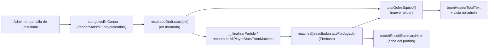
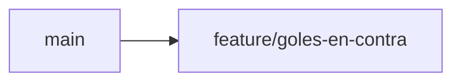

# Goles en contra — Implementation Plan

> **Status:** Draft · **Date:** 2026-08-28 · **Owner:** Lucas Manoukian
>
> **Reviewers:** *pending*
>
> **Spec:** [GOLES_EN_CONTRA_SPEC.md](./GOLES_EN_CONTRA_SPEC.md)
>
> **Concept note:** *not written — see Spec §6.5*

> **Grounding evidence (`MD-25`).** This Plan grounds in the Spec's §6.5
> *Sources & Origins* ledger. New grounding gathered at Plan-authoring time
> (git history / commit-style conventions, absence of lint/CI/lockfile
> tooling) is cited inline below and was not yet in the Spec.

## 1. Summary

This Plan adds one field (`golesEnContra`) to the existing per-player match
result counters in `index.html`, a small shared helper that changes how a
team's total goal count is computed (own goals plus the rival's self-goals),
one new UI input in the result-entry roster row, one new red icon asset, and
an extension to the finished-match summary card. Everything lands in the
single file `index.html` plus one new static asset — there is no backend,
database migration, or API surface in this project. The one non-obvious
constraint: **five separate places** in `index.html` compute a team's goal
total today, and all five must move to the same new formula or the app will
show inconsistent scores depending on which screen you're looking at.

## 2. Goals & non-goals

- **Technical goal 1** — Add `golesEnContra` (per player/match) and
  `golesEnContraTotales` (per player, lifetime) following the exact pattern
  already used for `golesPenal`/`golesPenalTotales`.
- **Technical goal 2** — Centralize the "team goal total" computation in one
  new helper function and make all five existing call sites use it, so the
  own-goal effect (FR-010) can't drift between screens.
- **Technical goal 3** — Add the result-entry input, the red icon asset, and
  the summary-card display without touching the finalized-match per-player
  readonly row (see TD-01 — that row never got the penal breakdown either,
  and this Plan keeps that boundary).

**Non-goals:**

- We will not add a feature flag — this repo has no feature-flag mechanism
  and no prior feature (including the directly analogous
  `2026-08-21-goles-por-penal` change) used one. Confirmed via
  `git log --oneline`: every feature merges as a single branch
  (`feature/design-system-restyle`, `fix/drag-mobile-limitacion-inexistente`,
  etc.), not a flag-gated multi-branch rollout.
- We will not add automated tests for this feature area — see §5 `Tests`
  row and Spec §11.5 `AC-50` ruling.
- We will not change `renderStatsYPuntajeMiembro`'s finalized-match readonly
  line (index.html:3320-3322) — see TD-01.
- We will not touch `tests/motor.test.js` — this feature has no
  interaction with the team-generation engine it covers. **Correction
  made during implementation:** `tests/layout.test.js` turned out *not*
  to be untouched — see the T-1.13 addendum below and R-04.

## 3. Architecture overview

Single-service, single-file client app — no cross-service edge is
introduced, so a `flowchart` at component granularity is the right diagram
type (not C4 Component, which MD-24 reserves for agentic/multi-service
features).



### 3.1 Key design decisions

| ID | Decision | Spec ref | Rationale |
|---|---|---|---|
| TD-01 | Do **not** extend the finalized-match per-player readonly line (`renderStatsYPuntajeMiembro`, index.html:3320-3322) with a self-goal indicator. Only `matchResultSummaryHtml` (the match-list card) shows the red-icon breakdown. | FR-030, FR-031 | Mirrors existing precedent: that same readonly line was never extended with the `golesPenal` breakdown either (verified by reading index.html:3320-3322 — it renders only `goles` and `asistencias`). Extending it now for self-goals but not for penalties would be an inconsistent, unrequested scope increase. |
| TD-02 | Introduce one new shared function `totalGolesEquipo(idsPropio, idsRival, stats)` and call it from all five existing team-goal-total call sites, rather than inlining the `+ rival's golesEnContra` term five times. | FR-010, FR-012 | Spec's biggest named risk (§15) is a missed call site; centralizing removes the chance of the five call sites drifting from each other over time. Spec §17 leaves module organization to the Plan's judgement (TC-001 scope). |
| TD-03 | `matchResultSummaryHtml`'s `equipoHtml(ids, nombre, claseEquipo)` closure gains a fourth parameter, the precomputed team total, instead of computing its own team total internally. | FR-010, FR-030 | The existing closure only has access to its own team's `ids`, not the rival's — it cannot compute FR-010's cross-team formula on its own. Computing both teams' totals once in the caller and passing them in avoids a second, parallel goal-total computation living inside the closure. |
| TD-04 | **(revised after the user reviewed the running feature)** Self-goal display: a **separate line** below the player's regular-goals line, reading `{{count}}{{RED_GOAL_ICON}} (EC)` — the player's name is repeated only when there is no regular-goals line above it (i.e. the player has 0 real goals) — resolves Spec OPEN-Q-01. Superseded the original same-line `en contra` wording. | FR-030 | User's explicit request: `(EC)` instead of the word "en contra", and goals-for / goals-against always on their own line rather than concatenated, so the two kinds of goal read as clearly separate facts about the player rather than one run-on sentence. |
| TD-05 | Result-entry input label: the red goal icon itself (`RED_GOAL_ICON`), not a text abbreviation like "EC" — resolves Spec OPEN-Q-02. | FR-021 | Matches the existing `BOOT_ICON`-as-label precedent for assists (icon-as-label) rather than the `"P"` text-label precedent used for penalties — the user explicitly asked for "the same icon, in red," so the icon itself doing double duty as both visual marker and label is the more literal fit. |
| TD-06 | The `.team-stat-input` change-listener needs **no new branch** for `tipo === 'golesEnContra'` — it already falls into the existing generic `else` branch (index.html:3923-3925) that just clamps to a non-negative integer, because TC-011 explicitly forbids gating/clamping it against `goles` the way `golesPenal` is gated. | TC-011, FR-004, FR-005 | Verified by re-reading the listener: the only special-cased `tipo` today is `'golesPenal'` (index.html:3917-3922); everything else already gets the generic clamp. This is the one place where *not* touching existing code is the correct, spec-compliant choice. |

## 4. Module map

| Module / package | Role | Status |
|---|---|---|
| `index.html` (IIFE, match-result section, ~lines 1028-4045) | Single-file app; owns the match-result data model, draft state, rendering, and persistence this feature extends | modified |
| `assets/goal-icon.png` | Existing green goal icon | untouched |
| `assets/goal-icon-red.png` | New red variant of the same icon, used for self-goal display and input label | new |
| `openspec/specs/resultados-partido/spec.md` | Project's own committed spec for match-result goal tracking (separate from this methodology's docs) | modified |
| `tests/motor.test.js`, `tests/fixtures-app.js`, `tests/harness.js` | Existing automated test suites (team-generation engine) | untouched |
| `tests/layout.test.js` | Responsive-layout regression suite (Principio V) | modified — see T-1.13 |
| `openspec/changes/archive/2026-08-21-goles-por-penal/**` | Prior-art reference for this Plan's shape | untouched (read-only reference) |

## 5. Engineering rules / project conventions reference

| Rule | Summary |
|---|---|
| Imports | N/A — no module system; the app is one `<script>` IIFE with no imports (verified: no `import`/`require` in `index.html`). |
| Typing | N/A — plain JavaScript, no type annotations anywhere in the codebase. |
| Logging | N/A — the app has no logging layer for any existing feature (confirmed in Spec §8 NFR-005); this feature does not introduce one. |
| Tests | **No automated test exists for this feature area** (`tests/motor.test.js` and `tests/layout.test.js` cover the team-generation engine and responsive layout only). Per Spec §11.5 `AC-50`'s explicit ruling, this Plan's §12.1 binds each scenario/variant to a **named, repeatable manual verification procedure** instead of an automated test. |
| Binding | `manual-procedure` — **not** one of the template's `variant-a`/`variant-b`/`none` tokens; this is a disclosed, Spec-sanctioned fourth form (Spec §11.5 `AC-50` ruling) for a feature area with no test framework. The scenario/variant ID is embedded as the leading label of its manual verification step in §12.1 (e.g. `S-01 — ...`); there is no automated `grep`/`comm` gate — a human reviewer confirms the ID↔procedure pairing during PR review (see the adapted `T-1.D8`/`T-1.D9` below). |
| Supply-chain | `none — no package manifest or lockfile in this repo` (verified: no `package.json` at the repo root). `T-1.D20` passes vacuously. |
| Constants | New constants live alongside `GOAL_ICON` (index.html:1028) and `BOOT_ICON` (defined nearby); no separate constants file exists in this codebase, so this Plan follows suit rather than introducing one. |
| Commits | Conventional-Commits-shaped, Spanish subject, as observed in `git log --oneline` (`feat(design): agrega skill football-app-design con design system`, `fix(drag): ...`, `style: ...`, `docs(spec): ...`). This Plan uses `type(scope): subject (Spec-ID[, Spec-ID...])`, e.g. `feat(resultados): suma golesEnContra al conteo del equipo rival (FR-010, FR-012)`. |
| Backwards compat | Required — matches saved before this feature must keep loading with `golesEnContra` treated as `0` (Spec FR-003, AC-02); this repo has no versioned-migration mechanism, so backward-reading defensiveness (`|| 0`) is the only compatibility tool available, matching the existing `golesPenal`-absence handling. |

## 6. Definition of Done (single branch)

- [ ] Implementation follows the conventions in §5
- [ ] Every Spec FR/TC assigned to this branch is implemented (§16 cross-reference)
- [ ] Every Spec scenario (`S-*`) and variant (`S-NNa`, …) has a manual verification procedure in §12.1 (gates Spec §11.5 `AC-50`, adapted per §5 `Binding: manual-procedure`)
- [ ] No quantified NFR exists — `AC-51` is not applicable (Spec §8, §11.5)
- [ ] Every TC (`TC-*`) from Spec §4 has a §12 entry — reviewer-checked, since none are CI-mechanizable in this repo (gates `AC-52`)
- [ ] §12.2 *Impact Traceability* has at least one `IMP-*` row per materially-affected scope (gates `AC-53`)
- [ ] `AC-54` not applicable — no quantified NFR to bind an `OBS-*` to
- [ ] Supply-chain: `none` per §5 — `AC-55` passes vacuously
- [ ] Every risk (`R-*`) in §14 records a mitigation path
- [ ] Self-consistency: every ID referenced in this Plan resolves to a definition in this Plan or the Spec
- [ ] Cross-consistency: every Spec ID cited here exists in the Spec
- [ ] Manual verification of every §12.1 procedure performed in a real browser session against the app (see §12.7)
- [ ] The two existing automated suites still pass — `node tests/motor.test.js && node tests/layout.test.js` (no regressions)
- [ ] No linter/type-checker exists in this repo — N/A, not gated
- [ ] No `TODO`, `FIXME`, or `HACK` comments left in changed code — `git grep -nE "TODO|FIXME|HACK" -- index.html assets/` (scoped to changed paths) returns nothing new
- [ ] Commit history is clean: each commit is atomic and follows §5 `Commits` format
- [ ] PR description includes a summary, Spec cross-references, and the TD-* decisions made
- [ ] PR opened against `main`

## 7. Branch / phase plan

### 7.0 Branch sizing (`MD-27`)

```
Custom arc: 1 branch — this repo has no feature-flag mechanism and no
CI/PR-gating pipeline; every prior feature (including the directly
analogous 2026-08-21-goles-por-penal change) merged as one branch with no
progressive rollout. The FR-count regex would suggest a larger arc
(>3 FRs), but that count reflects this Spec's granularity of
decomposition, not the feature's real size or risk — a single small
single-file, single-service, no-migration change with no cross-service
edge and no rollout NFR. Forcing a 3-5 branch flagged arc here would
manufacture PR overhead this project's own conventions don't use anywhere
else.
```

### 7.1 Branch tracker

| # | Git branch | Base branch | Status | PR | Tests | Notes |
|---|---|---|---|---|---|---|
| 1 | `feature/goles-en-contra` | `main` | In progress | — | manual (§12.1) | Already created and checked out at Plan-authoring time |



---

### 7.2 Branch 1 — `feature/goles-en-contra`

**Goal:** Land the complete feature — data model field, shared team-goal
helper, all five call-site updates, the new input, the new asset, and the
summary-card display — in one mergeable, revertible branch. No flag; the
feature is live for every admin the moment it merges, matching how every
prior feature in this repo shipped.

**Spec coverage:** FR-001 – FR-040 (all), TC-001, TC-010, TC-011, TC-030,
TC-031, TC-040, TC-041, AC-01, AC-02, AC-10, AC-15, AC-16, AC-20.

#### 7.2.1 Design decisions specific to this branch

See §3.1 TD-01 through TD-06 above — all apply to this single branch.

#### 7.2.3 New constants

File: `index.html` (alongside the existing `GOAL_ICON` constant at line 1028)

| Constant | Value | Purpose |
|---|---|---|
| `RED_GOAL_ICON` | `''` | Red goal icon, reused as both the result-entry input's label (FR-021, TD-05) and the summary-card self-goal marker (FR-030, TD-04). |

#### 7.2.5 New / modified interfaces

File: `index.html`

| Function | Signature | Notes |
|---|---|---|
| `totalGolesEquipo` (new) | `(idsPropio: string[], idsRival: string[], stats: Record<string, {goles?, golesPenal?, golesEnContra?, asistencias?}>) => number` | New shared helper (TD-02). Returns `sum(stats[id].goles for id in idsPropio) + sum(stats[id].golesEnContra for id in idsRival)`. Placed near `teamHeaderTotalText` (index.html:3292). Spec FR-010. |
| `teamHeaderTotalText` (modified) | unchanged signature `(ids, sumaPts, m)` | Internally resolves `idsRival` from `m.equipos` (the team not equal to `ids`) and calls `totalGolesEquipo` for both the live-draft branch (currently index.html:3298) and the finalized branch (currently index.html:3300), replacing the direct `ids.reduce(...)` calls. Spec FR-010, FR-012. |
| `renderTeamsSection` (modified, non-admin branch) | unchanged | The `golesBlanco`/`golesNegro` computation at index.html:3634-3635 replaced with two `totalGolesEquipo` calls (`totalGolesEquipo(eq.blanco, eq.negro, m.resultado.statsPorJugador)` and the mirror for negro). Spec FR-012. |
| `ensureResultadoDraft` (modified) | unchanged | The stats-init object literal at index.html:3203 gains `golesEnContra: 0`. Spec FR-001, FR-002. |
| `__editarResultadoFinalizado` (modified) | unchanged | Both the default-object literal and the `stats[id] = {...}` assignment at index.html:3253-3255 gain `golesEnContra`. Spec FR-002, FR-003. |
| `__finalizarPartido` (modified) | unchanged | (a) The `golesPorEquipo` accumulation loop at index.html:3218-3222 becomes a two-pass computation: first pass sums each team's own `goles`; second pass adds the rival team's summed `golesEnContra` (equivalently: call `totalGolesEquipo` per team once both teams' stats are known). (b) The per-player accumulation loop at index.html:3223-3236 gains `p.golesEnContraTotales = (p.golesEnContraTotales \|\| 0) + (st.golesEnContra \|\| 0);` — **not** added to `p.golesTotales` (Spec FR-013, FR-014). |
| `recomputeAllPlayerStatsFromMatches` (modified) | unchanged | (a) `totales[p.id]` init at index.html:1214 gains `golesEnContra: 0`. (b) The `golesPorEquipo` loop at index.html:1218-1222 gets the same two-pass fix as `__finalizarPartido`. (c) The per-player loop at index.html:1223-1234 gains `totales[playerId].golesEnContra += (st.golesEnContra \|\| 0);`. (d) The write-back loop at index.html:1236-1245 gains `p.golesEnContraTotales = t.golesEnContra;`. Spec FR-011, FR-013. |
| `renderStatsYPuntajeMiembro` (modified) | unchanged | In the `cerrada && isAdmin()` branch (index.html:3323-3348): (a) read `gec = draft ? (draft.golesEnContra \|\| 0) : 0` — no gating/clamp (TD-06, TC-011); (b) add a fourth icon+input pair using `RED_GOAL_ICON` as the label (TD-05) and `data-tipo="golesEnContra"`, placed after the penal pair and before the assists pair. The `finalizado` readonly branch (index.html:3320-3322) is **not** touched (TD-01). Spec FR-020, FR-021. |
| `matchResultSummaryHtml` (modified) | unchanged | (a) Before calling `equipoHtml` for either team, compute `const totalBlanco = totalGolesEquipo(m.equipos.blanco, m.equipos.negro, stats)` and the mirror for negro (TD-02, TD-03). (b) `equipoHtml` gains a 4th parameter `totalGoles` and uses it instead of its own `ids.reduce(...)` (currently index.html:4025) (TD-03). (c) The goleadores `.filter(x => x.p && x.goles > 0)` (index.html:4028) becomes `.filter(x => x.p && (x.goles > 0 \|\| x.golesEnContra > 0))` (FR-031). (d) The per-scorer template builds up to **two `<div>` lines per player** instead of one: a `goles > 0` line (`Nombre N⚽ (M de penal)`) and, separately, a `golesEnContra > 0` line (`(prefixed with the name only when there's no goles-for line) K🔴 (EC)`) per TD-04's revised format. Spec FR-030, FR-031, FR-032. |

#### 7.2.6 Tests

No automated test file is added — see §5 `Tests` row. Verification is the
manual procedure list in §12.1.

#### 7.2.7 Verification

- [ ] Every manual procedure in §12.1 performed against a real browser
  session (see §12.7) and observed to match its expected result
- [ ] The five call sites in the Interfaces table above all reflect the
  same team-goal formula (spot-checked by reading the diff, since there is
  no shared-formula lint)
- [ ] `assets/goal-icon-red.png` renders legibly at the 16×16px size used
  inline (Spec §15 risk row 3)
- [ ] A match saved before this feature (no `golesEnContra` anywhere in its
  `statsPorJugador`) still loads, displays, and recomputes without a JS
  console error (Spec AC-02)

#### 7.2.8 Files inventory

**New files:**
```
assets/goal-icon-red.png
docs/goles-en-contra/GOLES_EN_CONTRA_SPEC.md
docs/goles-en-contra/GOLES_EN_CONTRA_IMPLEMENTATION_PLAN.md
```

**Modified files:**
```
index.html
openspec/specs/resultados-partido/spec.md
tests/layout.test.js
```

**Deleted files:**
```
(none)
```

#### 7.2.9 Task checklist (agent-runnable)

Implementation tasks (grouped into atomic commits):

- [x] T-1.1 Generate `assets/goal-icon-red.png` — confirmed the source
  icon is pure grayscale (every opaque pixel has R=G=B) with alpha for
  transparency, so the ball's white panels and its black "gajos"
  (pentagons) are separated purely by luminance. Recolored by mapping
  each pixel's luminance `l` (0=black, 1=white) to
  `color = red + (white - red) * l` using `red = (220, 38, 38)` (the
  project's `--brick` per `index.html:23`) — this turns the black gajos
  fully red, leaves white panels fully white, and preserves the existing
  gray shading/anti-aliasing as a red-tinted gradient in between (same
  ball, same shading, only the gajos' color changes, per explicit user
  request). Same 153×153 dimensions and transparent background as the
  source. Generated and verified visually — see A-01.
- [ ] T-1.2 Add `RED_GOAL_ICON` constant next to `GOAL_ICON` in `index.html`
  (§7.2.3)
- [ ] T-1.C1 Commit — `feat(assets): agrega ícono de gol rojo para goles en contra`

- [ ] T-1.3 Add `totalGolesEquipo(idsPropio, idsRival, stats)` helper near
  `teamHeaderTotalText` in `index.html` (TD-02, FR-010)
- [ ] T-1.4 Add `golesEnContra: 0` default in `ensureResultadoDraft`
  (index.html:3203) (FR-001, FR-002)
- [ ] T-1.5 Add `golesEnContra` to both the default object and the
  `stats[id] = {...}` line in `__editarResultadoFinalizado`
  (index.html:3253-3255) (FR-002, FR-003)
- [ ] T-1.C2 Commit — `feat(resultados): agrega campo golesEnContra al modelo de datos del resultado (FR-001, FR-002, FR-003)`

- [ ] T-1.6 Replace the two `ids.reduce(...)` goal calculations in
  `teamHeaderTotalText` (index.html:3298, 3300) with calls to
  `totalGolesEquipo`, resolving each team's rival ids from `m.equipos`
  (FR-010, FR-012)
- [ ] T-1.7 Replace the `golesBlanco`/`golesNegro` calculation in the
  non-admin branch of `renderTeamsSection` (index.html:3634-3635) with
  `totalGolesEquipo` calls (FR-012) — no `[P]` marker: this task and
  T-1.6 both edit `index.html`, and every task in this Plan shares that
  same single file, so `[P]` (which requires no shared file) does not
  legitimately apply anywhere in this branch
- [ ] T-1.C3 Commit — `feat(resultados): el total de goles por equipo suma los goles en contra del rival (FR-010, FR-012)`

- [ ] T-1.8 In `__finalizarPartido` (index.html:3218-3236): restructure the
  `golesPorEquipo` computation to a two-pass form (own goals per team,
  then add rival's `golesEnContra`), and add the
  `p.golesEnContraTotales = (p.golesEnContraTotales || 0) + (st.golesEnContra || 0);`
  accumulation line — **not** touching `p.golesTotales` (FR-011, FR-013,
  FR-014)
- [ ] T-1.9 In `recomputeAllPlayerStatsFromMatches` (index.html:1212-1246):
  mirror the same two-pass `golesPorEquipo` fix, add `golesEnContra: 0` to
  the `totales[p.id]` init, add the `totales[playerId].golesEnContra += ...`
  accumulation, and add `p.golesEnContraTotales = t.golesEnContra;` in the
  write-back loop (FR-011, FR-013)
- [ ] T-1.C4 Commit — `feat(resultados): el gol en contra suma al marcador rival al finalizar y recalcular partidos (FR-011, FR-013, FR-014)`

- [ ] T-1.10 In `renderStatsYPuntajeMiembro` (index.html:3315-3357): read
  `gec` from the draft with no gating/clamp, and add the fourth
  icon+input pair (`RED_GOAL_ICON` label, `data-tipo="golesEnContra"`)
  between the penal pair and the assists pair (FR-020, FR-021, TD-05,
  TD-06 — confirm no listener change is needed per TD-06)
- [ ] T-1.C5 Commit — `feat(resultados): agrega el input de goles en contra a la carga de resultado (FR-020, FR-021)`

- [ ] T-1.11 In `matchResultSummaryHtml` (index.html:4021-4045): compute
  both teams' totals via `totalGolesEquipo` before calling `equipoHtml`,
  add the 4th `totalGoles` parameter to `equipoHtml` and use it in place
  of the internal `ids.reduce(...)`, widen the goleadores filter to
  include `golesEnContra > 0`, and add the red-icon "en contra" segment to
  the per-scorer line (FR-030, FR-031, FR-032, TD-03, TD-04)
- [ ] T-1.C6 Commit — `feat(resultados): muestra los goles en contra en la ficha del partido (FR-030, FR-031, FR-032)`

- [ ] T-1.12 Add a new `### Requirement: Registro de goles en contra`
  section (mirroring the existing penal-requirement shape) to
  `openspec/specs/resultados-partido/spec.md`, cross-referencing this
  Plan's Spec
- [ ] T-1.C7 Commit — `docs(spec): documenta el registro de goles en contra en resultados-partido`

- [x] T-1.13 **(found during implementation, not originally planned — see R-04)**
  Running `node tests/layout.test.js` after T-1.10 landed broke the
  `detalle de partido · cargar resultado` scenario at 600px viewport
  (536px panel width): `.team-stat-group`'s existing `@container
  (max-width: 500px)` rule (index.html, forces the 4 stat inputs onto
  their own centered line below that panel width) was measured and set
  when the row only had 3 icon+input pairs (goles/penal/asistencias).
  Adding the 4th pair (golesEnContra) widened the group enough that a
  536px-wide panel could no longer fit it on one line, but 536 > 500 so
  the container query no longer covered it — an existing test caught a
  real, un-anticipated regression. Fixed by empirically re-measuring
  (ad-hoc Playwright script, discarded — not part of the shipped diff)
  how many of the 16 roster rows wrap at panel widths 296–576px with the
  new 4-pair layout: wrapping stops entirely at 556px, still occurs at
  536px, so the breakpoint moved from 500px to 550px (same
  "between the last still-wrapping and the first fully-clear width"
  convention the original comment documents). Updated **both**
  `index.html`'s `@container` rule **and** `tests/layout.test.js`'s
  `UMBRAL_PANEL_ANGOSTO` constant to 550, since the test's own header
  comment requires them to stay equal
- [ ] T-1.C8 Commit — `fix(resultados): recalibra el ancho de wrap de los inputs de carga tras sumar el gol en contra`

DoD verification (§6) — adapted for this repo's lack of test/lint/CI
tooling. Any fix made here becomes its own follow-up commit
(`T-1.C9`, `T-1.C10`, …, continuing after T-1.C8 above), never folded into a prior commit:

- [ ] T-1.D1 All §12.1 manual verification procedures performed and pass —
  no automated command; a human runs the app in a browser and observes
  each expected result
- [ ] T-1.D2 No regressions in the two existing automated suites —
  `node tests/motor.test.js && node tests/layout.test.js`
- [ ] T-1.D3 No linter configured — N/A (§5 `Tests`/no lint tooling in
  this repo)
- [ ] T-1.D4 No type-checker configured — N/A
- [ ] T-1.D5 No `TODO`/`FIXME`/`HACK` left in changed files —
  `git grep -nE "TODO|FIXME|HACK" -- index.html assets/goal-icon-red.png openspec/specs/resultados-partido/spec.md` returns nothing
- [ ] T-1.D6 Implementation matches §5 conventions (re-read §5 before
  submitting)
- [ ] T-1.D7 Every Spec FR/TC assigned to this branch is implemented —
  reviewer cross-checks each ID in the Interfaces table (§7.2.5) against
  the actual diff
- [ ] T-1.D8 Every Spec scenario (`S-NN`) and variant has a manual
  verification procedure in §12.1 with the ID as its leading label —
  reviewer confirms by reading §12.1 top to bottom against Spec §9
  (adapted per §5 `Binding: manual-procedure` — no automated `comm` gate
  exists for this feature area)
- [ ] T-1.D9 No quantified NFR exists — N/A (Spec §8)
- [ ] T-1.D10 Every TC (`TC-001`, `TC-010`, `TC-011`, `TC-030`, `TC-031`,
  `TC-040`, `TC-041`) has a §12.3 entry naming its reviewer-check —
  reviewer confirms
- [ ] T-1.D10b Every TC also has a Spec §11.3 compliance check —
  already present in the Spec (AC-15, AC-16); reviewer confirms no drift
- [ ] T-1.D11 Commit history is clean — `git log --oneline main..HEAD`
  shows only the atomic commits above, each compiling (loadable in a
  browser) on its own
- [ ] T-1.D12 PR description drafted: summary, Spec cross-refs, TD-01
  through TD-06 called out explicitly
- [ ] T-1.D13 Manual visual check of the red icon at production render
  size (16×16px) in both the input row and the summary card, in light and
  dark conditions if the app has a dark mode (Spec §15 risk row 3)
- [ ] T-1.D14 Open PR against `main`
- [ ] T-1.D15 §12.2 *Impact Traceability* has at least one `IMP-*` row per
  materially-affected scope — `sed -n '/^### 12\.2/,/^### 12\.3/p' docs/goles-en-contra/GOLES_EN_CONTRA_IMPLEMENTATION_PLAN.md | grep -cE "^\| *IMP-[0-9]+"` ≥ 1
- [ ] T-1.D16 No quantified NFR — N/A, `AC-54` not applicable
- [ ] T-1.D17 Every risk `R-*` in §14 has a mitigation path — reviewer
  confirms every row's *Mitigation task* cell is non-empty
- [ ] T-1.D18 Self-consistency pass — every ID referenced in this Plan
  resolves to a definition in this Plan or the Spec (see
  `references/review-passes.md` Pass 1; performed manually, no test suite
  to run it against)
- [ ] T-1.D19 Cross-consistency pass — every Spec ID cited in this Plan
  exists in the Spec:
  `comm -23 <(grep -oE '(^|[^A-Za-z])(FR|TC|AC|S)-[0-9]+[a-z]*' docs/goles-en-contra/GOLES_EN_CONTRA_IMPLEMENTATION_PLAN.md | sed -E 's/^[^A-Za-z]//' | sort -u) <(grep -oE '(^|[^A-Za-z])(FR|TC|AC|S)-[0-9]+[a-z]*' docs/goles-en-contra/GOLES_EN_CONTRA_SPEC.md | sed -E 's/^[^A-Za-z]//' | sort -u)`
  returns empty
- [ ] T-1.D20 Supply-chain — `none` per §5; passes vacuously, no scanner run

## 8. Data model & migrations

### 8.1 Schema changes

There is no formal schema (Firestore documents are schemaless JSON written
directly by the app). The only "schema change" is additive, optional
fields on existing objects:

| Object | Change | Default when absent | Backfill plan |
|---|---|---|---|
| `matches[].resultado.statsPorJugador[playerId]` | add `golesEnContra` (number) | `0` (read as `st.golesEnContra \|\| 0` everywhere) | None needed — absence is a valid, permanent state for pre-feature matches (Spec FR-003, AC-02) |
| `players[]` | add `golesEnContraTotales` (number) | `0` (uninitialized players never had it either) | Recomputed automatically the next time `recomputeAllPlayerStatsFromMatches()` runs (e.g. any future result edit); no explicit backfill script needed since the value is simply `0` for every match before this feature existed |

### 8.2 Migration strategy

Not applicable — no expand/dual-write/backfill/switch-reads/contract
sequence exists because there is no migration: old documents are read with
`|| 0` fallbacks forever, matching the existing `golesPenal` precedent
(Spec §6.5). No `stateDiagram-v2` is included per MD-24's own skip
condition ("no DB changes").

### 8.3 Reversibility

Fully reversible: reverting the `index.html` diff makes the app stop
reading/writing `golesEnContra`/`golesEnContraTotales`; any values already
persisted in Firestore simply become unread, inert fields (no data loss,
no cleanup required, matching how the `golesPenal` fields would behave if
that feature were ever reverted).

## 9. API & contract changes

Not applicable — no HTTP endpoints or external events exist in this app
(client talks directly to the Firebase SDK). The only "internal contract"
change is the extended shape of `statsPorJugador[playerId]`, documented in
§8.1 above.

## 10. Configuration & feature flags

None. This repo has no feature-flag mechanism (Spec §13; confirmed absent
from `index.html`'s config surface). The feature ships directly on merge,
matching every prior feature in this repo (§2 non-goals).

## 11. Observability

None. The app has no observability layer for any existing feature (Spec §8
NFR-005) and this feature introduces no quantified NFR to bind a signal to
— `AC-54` is not applicable (Spec §11.5).

## 12. Test plan

### 12.1 Scenario Traceability Matrix

> **Binding: manual-procedure** (§5). Each row's *Test* column is a named,
> repeatable manual procedure a human performs against a real browser
> session of the app (see §12.7), not an automated test path. The
> Scenario ID is the row's own identity, not embedded in a file — there is
> no `grep`-based mechanical gate for this table (Spec §11.5 `AC-50`
> ruling).
>
> **Level column.** Still uses the template's closed vocabulary
> (`unit`/`integration`/`contract`/`e2e`/`property`) applied via the same
> decision-tree as any other Plan — only the *execution mode* is manual
> instead of automated, disclosed with a `(manual)` suffix on every row.
> A full click-through of the result-entry screen or the summary card is
> a user-visible flow end to end, so it classifies as `e2e`; the one
> multi-input invariant check classifies as `property`; the one scenario
> that crosses the recompute engine and persistence together classifies
> as `integration`.

| Spec scenario | Test (manual procedure) | Level | Branch |
|---|---|---|---|
| S-01 (happy parent) | Cargar resultado de un partido de prueba; ingresar `1` en el input de gol en contra de un jugador con 0 goles propios; confirmar que se persiste `golesEnContra = 1` y que el total del equipo rival sube en 1 sin cambiar el del equipo propio | e2e (manual) | Branch 1 |
| S-01a `[boundary]` | El mismo jugador con 2 goles propios + 1 de penal + 1 en contra a la vez; confirmar que su equipo suma 2 y el rival suma el 1 en contra, sin mezcla | e2e (manual) | Branch 1 |
| S-01b `[boundary]` | Dejar el input en `0` (valor por defecto); confirmar que no cambia nada respecto al comportamiento actual | e2e (manual) | Branch 1 |
| S-01c `[failure]` | Ingresar un valor no numérico o negativo en el input; confirmar que se clampa a `0` (mismo comportamiento que `goles`/`golesPenal`/`asistencias` hoy) | e2e (manual) | Branch 1 |
| S-01d `[property]` | Con varias combinaciones de valores cargados en un mismo partido, confirmar a mano que la suma de los totales mostrados de ambos equipos es igual a la suma de todos los `goles` cargados más la suma de todos los `golesEnContra` cargados | property (manual) | Branch 1 |
| S-02 (happy parent) | Partido con Blanco 2 goles propios, Negro 1 propio, y 1 gol en contra de un jugador de Negro; finalizar el partido; confirmar que el resultado guardado queda Blanco 3 (2 propios + 1 en contra a su favor) – Negro 1, y que el partido se computa como victoria de Blanco para los jugadores convocados | e2e (manual) | Branch 1 |
| S-02a `[boundary]` | El gol en contra es el único gol del partido; confirmar que el equipo beneficiado gana 1 a 0 | e2e (manual) | Branch 1 |
| S-02b `[concurrency]` | Editar el resultado de un partido ya finalizado cambiando el valor de `golesEnContra` de un jugador y guardar; confirmar que `recomputeAllPlayerStatsFromMatches()` recalcula partidos ganados/empatados/perdidos y `golesEnContraTotales` de todos los convocados de forma consistente con el nuevo valor | integration (manual) | Branch 1 |
| S-03 (happy parent) | Partido finalizado con un jugador de Blanco con 0 goles propios y 1 en contra; abrir la ficha del partido (card en la lista); confirmar que aparece en la sección de Blanco (su propio equipo), en su propio renglón, como "Nombre 1🔴 (EC)", y que el número sumó para Negro | e2e (manual) | Branch 1 |
| S-03a `[boundary]` | El mismo jugador también anotó 2 goles propios; confirmar que aparece en DOS renglones dentro de la sección de su propio equipo: "Nombre 2⚽" arriba, "1🔴 (EC)" abajo sin repetir el nombre | e2e (manual) | Branch 1 |
| S-03b `[boundary]` | Un jugador sin ningún gol propio ni en contra; confirmar que sigue sin aparecer en la lista de goleadores (comportamiento igual al actual) | e2e (manual) | Branch 1 |

### 12.2 Impact Traceability

| ID | Scope | Description | Triggered by | Risk | OBS | Mitigation task |
|---|---|---|---|---|---|---|
| IMP-01 | code | The five team-goal-total call sites (`teamHeaderTotalText`, non-admin `renderTeamsSection` branch, `matchResultSummaryHtml`, `__finalizarPartido`, `recomputeAllPlayerStatsFromMatches`) all change their formula via the shared `totalGolesEquipo` helper | FR-010, FR-012, S-01, S-02, S-03 | R-01 | — | `T-1.3`, `T-1.6`, `T-1.7`, `T-1.8`, `T-1.9`, `T-1.11` |
| IMP-02 | business | Match win/loss/draw outcomes (`partidosGanados`/`partidosEmpatados`/`partidosPerdidos`) for **future** finalized matches can shift relative to pre-feature behavior whenever a self-goal is recorded — the scoreline itself now depends on a new input | FR-011, S-02, S-02a | R-02 | — | `T-1.8`, `T-1.9` |
| IMP-03 | business | Players' lifetime goal statistics gain a new, separate accumulator (`golesEnContraTotales`) that is deliberately excluded from `golesTotales` — any future feature reading player goal stats must know self-goals are not folded in | FR-013, FR-014 | — | — | `T-1.8`, `T-1.9` |

> No `external` scope row: this app has no consumers outside the team
> (no partner API, no mobile app, no third party on a different deploy
> cadence) — `AC-53` requires a row for every scope *materially
> affected*, not one row per closed-vocabulary scope regardless of
> applicability, so an inapplicable scope is correctly left with no row
> rather than stuffed with an unrelated task. (Updating
> `openspec/specs/resultados-partido/spec.md`, `T-1.12`, is internal
> documentation upkeep, not a consequence with an affected external
> party — it doesn't warrant its own `IMP-*` row.)

### 12.3 TC verification (reviewer-checked)

> No TC in this Spec is CI-mechanizable (no lint rule, no dependency audit,
> no CI pipeline exists in this repo) — every TC below is verified by
> named reviewer code review against the cited location.

| TC | Verification |
|---|---|
| TC-001 | Reviewer confirms all new code lives in `index.html` and reuses the existing `matches[].resultado.statsPorJugador` / `players[]` shape — no new file or storage mechanism introduced |
| TC-010 | Reviewer confirms the new input dispatches through the existing `resultadoDraft` / `.team-stat-input` listener, not a parallel handler |
| TC-011 | Reviewer confirms the `.team-stat-input` listener gained **no** new gating/clamp branch for `golesEnContra` (TD-06) |
| TC-030 | Reviewer confirms `golesEnContra`'s read/write paths are only reachable from the existing `isAdmin()`-gated functions listed in §7.2.5 |
| TC-031 | Reviewer confirms new UI copy ("en contra") matches the existing Spanish register ("de penal") |
| TC-040 | Same as TC-030 — reviewer check |
| TC-041 | Reviewer confirms `golesEnContra` falls into the shared clamp path (TD-06), never a raw unvalidated write |

### 12.4 Integration tests

None — no automated integration test framework exists for this feature
area; see §5 `Tests`.

### 12.5 Contract tests

Not applicable — no producer/consumer contract exists.

### 12.6 End-to-end / smoke tests

None automated. §12.7 is the smoke-test equivalent for this Plan.

### 12.7 Manual QA

Run every §12.1 procedure once against a locally served `index.html`
(matching how `tests/layout.test.js`'s own doc-comment describes serving
the file over HTTP for manual/Playwright checks), using a throwaway test
match with at least 2 players per team, before opening the PR.

### 12.8 Performance / load tests

Not applicable — no quantified NFR exists (Spec §8).

## 13. Rollout plan

1. Merge `feature/goles-en-contra` directly to `main` once §6 DoD and
   §12.7 manual QA pass — no flag, no staged percentage rollout (§2
   non-goals; matches every prior feature in this repo).
2. No monitoring window is defined post-merge — this repo has no
   production monitoring for any feature (§11).

## 14. Risks & rollback

| ID | Risk | Likelihood | Severity | Detection signal | Mitigation task | Rollback procedure |
|---|---|---|---|---|---|---|
| R-01 | One of the five team-goal-total call sites is missed, leaving one screen showing a different total than the others | Med | Med | Manual cross-check across the three screens during §12.7 (no automated signal exists) | `T-1.6`, `T-1.7`, `T-1.11`, `T-1.D7` | Revert the PR; re-diff against the Interfaces table in §7.2.5 to find the missed site before re-attempting |
| R-02 | Editing a finalized match's `golesEnContra` value silently fails to update the affected players' win/loss/draw record | Low | Med | Manual check via S-02b procedure in §12.1 | `T-1.8`, `T-1.9` | Revert the PR; `recomputeAllPlayerStatsFromMatches()` is idempotent and can be re-run once the fix lands |
| R-03 | The red icon reads as low-contrast or ambiguous at 16×16px inline size | Low | Low | Manual visual check, `T-1.D13` | `T-1.1`, `T-1.D13` | Regenerate `assets/goal-icon-red.png` with a higher-contrast red before merge; no rollback needed post-merge since it's a static asset swap |
| R-04 | *(materialized during implementation — kept as a permanent record, not hypothetical)* Adding a 4th icon+input pair to `.team-stat-group` silently invalidates the empirically-measured width breakpoint that controls when the result-entry row wraps onto its own line, because that breakpoint was set by measuring 3-pair rows | Med (already occurred once) | — | `node tests/layout.test.js` (`AC` gated by the existing suite, not this Spec's own scenarios) | `T-1.13` | Re-run `node tests/layout.test.js`; if it fails on the `cargar resultado` scenario again after a future change to this row, re-measure the wrap point (see T-1.13's method) and update both `index.html`'s `@container` rule and `tests/layout.test.js`'s `UMBRAL_PANEL_ANGOSTO` together |

**Worst-case blast radius:** a bug in the team-goal formula (R-01) would
show an incorrect scoreline on one or more screens for matches that use
self-goals — no data corruption, since the underlying `golesEnContra`
value itself would still be stored correctly and the display bug is fixed
by re-deploying corrected `index.html`.

## 15. Open questions & assumptions

### 15.1 Open questions

Both Spec open questions are resolved in this Plan:

| ID | Question | Resolution |
|---|---|---|
| OPEN-Q-01 (Spec) | Exact copy/format for the self-goal line in the summary card | Resolved as TD-04 (revised after user review): `{{count}}{{RED_GOAL_ICON}} (EC)` on its own line below the goals-for line |
| OPEN-Q-02 (Spec) | Exact label/affordance for the self-goal input | Resolved as TD-05: the red goal icon itself as the label, no text abbreviation |

### 15.2 Assumptions

| ID | Assumption | Owner | If false |
|---|---|---|---|
| A-01 | ~~`assets/goal-icon.png`'s silhouette can be cleanly recolored to red without redrawing~~ — **confirmed true**: the source is pure grayscale (verified by sampling pixels), so T-1.1's luminance-remap approach produces the same ball with only the black gajos turned red, no redraw needed | Lucas Manoukian | N/A — resolved during Plan authoring |

## 16. Acceptance criteria coverage

| Spec AC | Satisfied by | Test |
|---|---|---|
| AC-01 | Branch 1 | §12.1 full matrix (S-01, S-02, S-03 + all variants) |
| AC-02 | Branch 1 | §12.1 covered implicitly by every procedure using `\|\| 0` fallback reads; explicitly re-checked in §7.2.7's fourth verification bullet |
| AC-10 | Branch 1 | T-1.D13 manual visual check of `title`/`alt` attributes on the new input and icon |
| AC-15 | Branch 1 | §12.3 TC-001/TC-010/TC-011/TC-030/TC-031 reviewer checks |
| AC-16 | Branch 1 | §12.3 TC-040/TC-041 reviewer checks |
| AC-20 | Branch 1 | S-01c manual procedure in §12.1 |
| AC-50 | Branch 1 | (meta-gate, adapted) — §12.1 fully populated per the `manual-procedure` binding; reviewer-checked via T-1.D8, not `comm` |
| AC-51 | Branch 1 | Not applicable — no quantified NFR (§11) |
| AC-52 | Branch 1 | §12.3 — every TC has a reviewer-check entry; T-1.D10/T-1.D10b |
| AC-53 | Branch 1 | §12.2 — 3 `IMP-*` rows covering `code` and `business` (×2), the only scopes this change materially affects; T-1.D15 |
| AC-54 | Branch 1 | Not applicable — no quantified NFR (§11) |
| AC-55 | Branch 1 | Supply-chain: `none` per §5; T-1.D20 passes vacuously |

## 17. Change log

| Date | Author | Change |
|---|---|---|
| 2026-08-28 | Lucas Manoukian | Initial draft. Self-critique: passed (0🔴 / 5🟡 / 0🔵) — fixed the §12.1 `Level` column (was using a non-closed-set "manual" value instead of the template's `unit/integration/contract/e2e/property` vocabulary; reclassified each row and appended `(manual)` for execution-mode disclosure), removed an incorrect `[P]` marker on T-1.7 (it shares `index.html` with T-1.6, so it isn't safely parallelizable), removed IMP-04's mischaracterized `external` scope row (this app has no external consumers; AC-53 doesn't require a row per scope regardless of applicability), switched the §3 diagram's line breaks from `\n` to `<br/>` for reliable Mermaid rendering across versions, and added the missing "existing automated suites pass" bullet to §6 (T-1.D2 already covered it as a task but §6 itself didn't state it). Generated `assets/goal-icon-red.png` during authoring (T-1.1) once the user clarified the exact ask: same ball, only the black gajos recolored to red, panels and shading otherwise unchanged. |
| 2026-08-28 | Lucas Manoukian | During implementation, unit-tested `totalGolesEquipo` in isolation against S-02's own numbers (Node one-liner, not part of the shipped app) and found the Spec's S-02 example was arithmetically wrong (claimed a 2-2 draw; correct result is Blanco 3 – Negro 1). Fixed the Spec and this Plan's §12.1 S-02 row to match. The code itself was correct; only the hand-written scenario text was wrong. |
| 2026-08-28 | Lucas Manoukian | Full manual QA (§12.7) run against the real app via Playwright (ad-hoc script, not committed): confirmed S-01/S-02/S-03 and their variants render and compute correctly end to end, including the exact expected HTML for the self-goal scorer line. This surfaced a real layout regression not anticipated by this Plan: `node tests/layout.test.js` failed on the result-entry screen at 600px viewport because the new 4th input pair widened `.team-stat-group` past the existing 500px wrap breakpoint. Added T-1.13/T-1.C8/R-04 to document the fix (re-measured and moved the breakpoint to 550px in both `index.html` and `tests/layout.test.js`), and corrected §2's non-goal claim that `tests/layout.test.js` would stay untouched. Both automated suites (`motor.test.js`, `layout.test.js`) pass after the fix. |
| 2026-08-28 | Lucas Manoukian | User asked, after trying the running feature locally, to change the summary-card display: `(EC)` instead of "en contra", always on its own line below the goals-for line instead of appended to it. Revised TD-04, the `matchResultSummaryHtml` interface entry, and the S-03/S-03a rows in §12.1. Re-ran the same Playwright manual-QA procedure with a case exercising all three shapes (goals-for only, both lines, self-goal-only) and re-ran `tests/layout.test.js` (still green — two stacked lines instead of one didn't reopen the width regression from the previous entry, since it only adds vertical height, not width, to `.match-result-scorers`). |

---

*This Implementation Plan is the contract a coding agent (human or AI)
executes. Behavioural questions belong in
[GOLES_EN_CONTRA_SPEC.md](./GOLES_EN_CONTRA_SPEC.md).*
