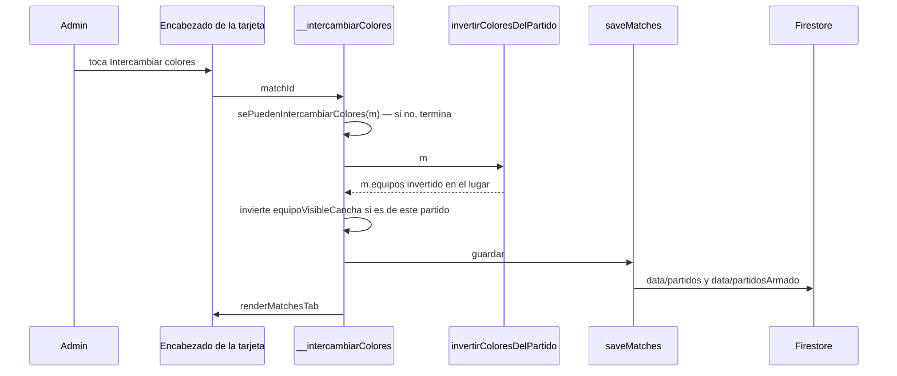
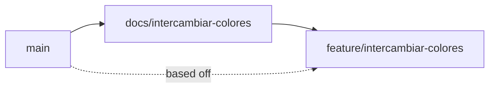

# Intercambiar colores — Implementation Plan

> **Status:** Draft · **Date:** 2026-09-29 · **Owner:** Lucas Manoukian
>
> **Reviewers:** *pending*
>
> **Spec:** [INTERCAMBIAR_COLORES_SPEC.md](./INTERCAMBIAR_COLORES_SPEC.md)
>
> **Concept note:** [INTERCAMBIAR_COLORES_CONCEPT.md](./INTERCAMBIAR_COLORES_CONCEPT.md)

> **Grounding evidence (`MD-25`).** Este Plan se apoya en el ledger §6.5 del Concept Note y
> en las citas en línea de la Spec. Donde una tarea `T-N.*`, una decisión `TD-*` o una
> elección de módulo se apoya en una ubicación de código que ninguno de los dos cubre, la
> cita va en línea acá. Todas las líneas de `index.html` citadas se leyeron el 2026-09-29
> sobre `main` en `106efd8`.

## 1. Summary

Se agrega a `index.html` una función pura que invierte los colores de un partido
(`invertirColoresDelPartido`), un manejador de admin que la aplica, guarda y repinta
(`window.__intercambiarColores`), y un tercer botón de ícono en el encabezado de la tarjeta
de equipos. No hay datos nuevos, no hay flag, el motor no se toca. Lo único no obvio antes de
leer el resto: además de las dos listas y las sumas, el balance por línea guarda una
`diferencia` con signo (`blanco − negro`, definido en
[index.html:3451-3463](../../index.html#L3451-L3463) dentro de `balanceLineasDe`; llamada
en [index.html:4081](../../index.html#L4081)), que la pantalla hoy no lee pero que la inversión tiene que negar para que
lo guardado siga siendo verdad (`TD-03`). La entrega sigue `AGENTS.md` § Ramas: esta rama de
documentos primero, la de código después.

## 2. Goals & non-goals

- **Technical goal 1** — Una sola operación, pura y recortable por nombre, concentra todo el
  conocimiento de qué campos se invierten (`FR-010` a `FR-017`), de modo que la propiedad
  "dos veces = identidad" (`FR-018`) se pruebe sobre el motor real.
- **Technical goal 2** — La disponibilidad del botón y la guarda del manejador salen de la
  misma función, para que no puedan divergir (`FR-001` a `FR-006`, `TC-040`).
- **Technical goal 3** — Cero cambios en el motor y en la forma de los documentos de
  Firestore (`TC-010`, `TC-012`, `NFR-004`).

**Non-goals:**

- No se refactoriza `renderEncabezadoTarjeta` más allá de agregar el botón.
- No se toca `saveMatches`, `window.storage` ni las reglas de Firestore.
- No se agrega manejo propio de errores de guardado (`S-07c`).

## 3. Architecture overview



Capas (`AGENTS.md`, Arquitectura desacoplada): la interfaz (encabezado y manejador) llama a
una función de dominio pura y a la persistencia sólo a través de `saveMatches`, que a su vez
usa `window.storage`. El motor de generación no participa.

### 3.1 Key design decisions

| ID | Decision | Spec ref | Rationale |
|---|---|---|---|
| TD-01 | Sin feature flag: la rama sin mergear es la red de seguridad, como en las rebanadas de `equipos-en-el-campo` y `navegacion-partidos` | D-04, D-08 | El proyecto publica por merge a `main` después de probar contra staging (`AGENTS.md` § Ramas); un flag sería infraestructura anticipada (Simplicidad) |
| TD-02 | `invertirColoresDelPartido(m)` muta `m.equipos` en el lugar y no hace I/O ni render, igual que `intercambiarUnidades` ([index.html:5138-5148](../../index.html#L5138-L5148)); se declara justo después de esa función | FR-010 a FR-018 | Recortable por `extraer` para tests unitarios; mismo idioma que el intercambio de jugadores |
| TD-03 | En cada línea de `balanceLineas` se intercambian `blanco` y `negro` **y se niega `diferencia`**, escribiendo `0` y no `-0` cuando vale cero | FR-013, FR-018, NFR-004 | `diferencia` es `blanco − negro` por construcción (`balanceLineasDe`); intercambiar sólo los dos valores dejaría un signo falso guardado. La pantalla lee la diferencia recalculada (`balanceLineasVigente`, [index.html:5305-5313](../../index.html#L5305-L5313)), así que esto no cambia nada visible; sí mantiene la verdad del dato y la identidad exacta de `FR-018` (`-0` rompería `assert.deepStrictEqual`) |
| TD-04 | `formacion`: se intercambian los objetos `formacion.blanco` y `formacion.negro` (`{cumplida, faltantes}`) y `formacion.objetivo` no se toca. `arquerosInfo`: sólo `equipoCompensado` cambia, y sólo si es `'blanco'` o `'negro'`; `null` queda `null` | FR-014, FR-015, FR-017 | Forma leída en [index.html:4071-4075](../../index.html#L4071-L4075) y [index.html:2826-2830](../../index.html#L2826-L2830) |
| TD-05 | `sePuedenIntercambiarColores(m)` = `isAdmin() && !!m.equipos && !m.inscripcionCerrada && m.estado !== 'Finalizado'`. La usan el render del botón y la guarda del manejador | FR-001 a FR-006, TC-040 | Una sola condición para mostrar y para ejecutar: no pueden divergir. Coincide con el `locked` de Regenerar ([index.html:5817](../../index.html#L5817)); `Finalizado` cubre también la edición de un resultado finalizado |
| TD-06 | El manejador invierte `equipoVisibleCancha` cuando `partidoDelEquipoVisible === m.id`, en cualquier ancho | FR-035 | En dos columnas la variable no se usa para pintar, así que invertirla no tiene efecto visible (`S-04b`); condicionarla al ancho agregaría una rama sin beneficio. Sigue siendo estado de pantalla: no se persiste |
| TD-07 | El ícono es una constante `ICON_INTERCAMBIAR` junto a `ICON_COPIAR` ([index.html:5782](../../index.html#L5782)): dos `path` en un solo `svg`, primero la mitad derecha rellena, después el contorno completo de `shirt`. **Sin `clipPath`** | FR-040, TC-002, TC-030 | Un `clipPath` necesita un `id`, y un `id` repetido en el DOM rompe el recorte. La mitad derecha como figura propia no necesita ninguno. Forma renderizada y verificada el 2026-09-29 |
| TD-08 | Clase `.panel-icono-intercambiar` con las mismas reglas que `.panel-icono-copiar` ([index.html:795-796](../../index.html#L795-L796)) y `path.relleno{ fill: currentColor; stroke: none; }` dentro | FR-043, TC-030 | Mismo peso que Copiar; el relleno hereda el color, así que no hay color nuevo |
| TD-09 | Tests unitarios en un archivo nuevo, `tests/colores.test.js`, con su propia lista `DECLARACIONES`; `tests/harness.js` no cambia | TC-031 | Mismo criterio que `cancha.test.js` (su comentario de cabecera): el sandbox del motor no necesita estas funciones. Para las propiedades sobre partidos reales se usa `cargarMotor` del harness |
| TD-10 | Sin resguardo propio contra dos toques rápidos: se confía en el orden de escritura del SDK de Firestore y se verifica a mano contra staging (`T-2.13`) | S-01h, A-01 | `saveMatches` arma los dos documentos de forma sincrónica al empezar y los escribe en secuencia ([index.html:2155-2178](../../index.html#L2155-L2178)); con escrituras en orden, el último toque gana en los dos. El intercambio por arrastre ya vive con la misma condición |

## 4. Module map

| Module / package | Role | Status |
|---|---|---|
| `index.html` — `invertirColoresDelPartido` (nueva, después de `intercambiarUnidades`, [index.html:5138](../../index.html#L5138)) | Inversión pura de los campos indexados por color (`TD-02` a `TD-04`) | new |
| `index.html` — `sePuedenIntercambiarColores` (nueva, junto a `esFilaEditable`, [index.html:4587](../../index.html#L4587)) | Condición única de disponibilidad (`TD-05`) | new |
| `index.html` — `window.__intercambiarColores` (nuevo, junto a `window.__moverJugadorManual`, [index.html:5243](../../index.html#L5243)) | Manejador: guarda, invierte, pestaña, guardado, repintado | new |
| `index.html` — `ICON_INTERCAMBIAR` (nueva, [index.html:5782-5784](../../index.html#L5782-L5784)) | Glifo (`TD-07`) | new |
| `index.html` — `renderEncabezadoTarjeta` ([index.html:5815-5838](../../index.html#L5815-L5838)) | Agrega el botón antes de Copiar (`FR-042`) | modified |
| CSS — `.panel-icono-intercambiar` (junto a [index.html:795-796](../../index.html#L795-L796)) | Estilo del botón (`TD-08`) | new |
| `index.html` — `saveMatches`, `window.storage` | Persistencia | untouched (`TC-001`) |
| `index.html` — `generarEquiposEstrategia1` a `4`, `resolverArqueros`, `window.__generarEquipos` | Motor | untouched (`TC-010`) |
| `index.html` — `renderZonaEquipos`, `renderCanchaEquipo`, `resumenDiferenciaEquipos`, `celdasDiferenciaPorLinea`, `explicacionesDelArmado`, `formatearFormacionParaCopiar` | Leen los campos por color; siguen al intercambio sin cambios (resuelve `OPEN-Q-03`, §15.1) | untouched |
| `tests/colores.test.js` | Tests unitarios y de propiedad | new |
| `tests/layout.test.js` | Escenarios `colores/*`; el escenario `panel-armado` pasa a esperar tres íconos (`FR-042` reemplaza `FR-002b`) | modified |
| `tests/fixtures-app.js` — `fakeFirebase` | Opción `escrituraFalla` para `S-07c` | modified |
| `tests/README.md`, `AGENTS.md` § Tests | Suman `node tests/colores.test.js` a la lista de comandos | modified |
| `docs/equipos-en-el-campo/rebanada-3-panel-armado/PANEL_ARMADO_SPEC.md` | Anotación recíproca del reemplazo (`D-24` heredada, `FR-002b`, `S-01`) | modified |

## 5. Engineering rules / project conventions reference

Restatadas de [`AGENTS.md`](../../AGENTS.md).

| Rule | Summary |
|---|---|
| Estructura | Toda la aplicación en `index.html`, dentro de un IIFE. Sin build, bundler ni framework. |
| Imports | No aplica: no hay módulos. |
| Typing | No aplica: JavaScript sin anotaciones ni type-checker. |
| Logging | No aplica: la app no tiene logging propio; `saveMatches` ya hace `console.error` ante una falla. |
| Estilo | Interfaz por plantillas de cadena e `innerHTML`; todo texto de jugador se escapa. Este botón no inserta texto de jugador. |
| Tests | `tests/*.test.js`, con `node`, devuelven 1 sólo ante regresión. Se recorta de `index.html` por nombre con `extraer` de `tests/harness.js`. Renombrar una función recortada obliga a actualizar la lista en el mismo commit. |
| Binding | `variant-a` — el ID va en forma canónica con guion dentro de un string literal, con el prefijo `colores/`: el título del caso en `tests/colores.test.js` (`'colores/S-01b: …'`) y el campo `spec: ['colores/S-05', …]` de cada escenario de `tests/layout.test.js`. Nunca en comentarios. |
| Supply-chain | `none — el repositorio no versiona ningún lockfile y la aplicación no tiene dependencias instaladas (Firebase por CDN; Playwright es dev-only externo, AGENTS.md § Dependencias)` |
| Lint / type-check | `none — el repositorio no tiene linter ni type-checker configurados`. `T-N.D3`/`T-N.D4` pasan de forma vacua y se declaran como tales. |
| Constants | El glifo va en `ICON_INTERCAMBIAR`, junto a los otros íconos; ningún número mágico nuevo. |
| Commits | Conventional Commits con asunto en español: `tipo(scope): asunto (IDs de la Spec)`, ≤ 72 caracteres, un cambio lógico por commit, cada commit pasa los tests. Scope `intercambiar-colores`. Nunca `chore: bump version`. La versión la sube el workflow (`AGENTS.md` § Versionado). |
| Backwards compat | Requerida en los datos: mismos documentos, mismos campos (`NFR-004`). En la interfaz, el encabezado pasa de dos a tres íconos (declaración de reemplazo de la Spec). |

## 6. Definition of Done (every branch)

- [ ] La implementación sigue §5
- [ ] Cada FR/TC de la Spec asignado a la rama está implementado
- [ ] Cada escenario y variante tiene un test ejecutable (`AC-50`; `T-N.D8`, `T-N.D8b`)
- [ ] Cada NFR cuantificado tiene un test de medición (`AC-51`; `T-N.D9`)
- [ ] Cada `TC-*` de la Spec §4 tiene entrada en §12 de este Plan (`AC-52`; `T-N.D10`, `T-N.D10b`)
- [ ] §12.2 tiene una fila `IMP-*` por alcance afectado (`AC-53`; `T-N.D15`)
- [ ] Cada NFR cuantificado tiene una fila `OBS-*` en §11 (`AC-54`; `T-N.D16`)
- [ ] Supply-chain: `none` declarado en §5 (`AC-55`; `T-N.D20`, pasa de forma vacua)
- [ ] Cada `R-*` de §14 registra una vía de mitigación (`T-N.D17`)
- [ ] Auto-consistencia (`T-N.D18`) y unicidad de definiciones (`T-N.D18b`)
- [ ] Consistencia cruzada con Spec y Concept Note (`T-N.D19`)
- [ ] Tests nuevos y existentes pasan
- [ ] Linter y type-checker: no aplican (§5), declarado
- [ ] Sin `TODO`/`FIXME`/`HACK`
- [ ] Historial de commits limpio, formato §5 (`T-N.D11`)
- [ ] Descripción del PR con resumen, referencias a la Spec y decisiones (`T-N.D12`)
- [ ] **Gate propio del proyecto:** la pantalla se miró en un navegador real contra staging a 360 px y a 1200 px (`T-N.D13`)
- [ ] PR abierto contra `main` (`T-N.D14`)

## 7. Branch / phase plan

### 7.0 Branch strategy — model (`MD-33`) + sizing (`MD-27`)

```
Branching model: trunk-based — detected by <skill-dir>/scripts/detect-branching-model.sh (basis: fallback; default branch main, sin develop/release/hotfix), consistente con AGENTS.md § Ramas (docs/<rebanada> y feature/<rebanada> salen de main y vuelven a main); confirmado por el historial de git el 2026-09-29: los merges a main vienen de ramas cortas (feat/equipos-en-el-campo, feat/opcion-cog-equipos-en-el-campo, chore/retirar-openspec-y-speckit, y las ramas de los merges b33aceb, 47a6a18 y anteriores), sin develop ni release/*
Long-lived branches: none
```

```
Custom arc: 2 branches — AGENTS.md § Ramas (D-11 de equipos-en-el-campo) fija dos ramas por entrega: docs/<slug> con Spec y Plan, que se mergea primero, y feature/<slug> con el código. El código es chico (4 FRs de disponibilidad, 1 función pura, 1 botón) y no justifica dividir la rama de código.
```

### 7.1 Branch tracker

| # | Git branch | Base branch | Status | PR | Tests | Notes |
|---|---|---|---|---|---|---|
| 1 | `docs/intercambiar-colores` | `main` | In progress | — | — | Concept Note, Spec y crítica ya commiteados (`941b3d6`, `9429986`, `79899fa`); falta este Plan y la anotación recíproca en `PANEL_ARMADO_SPEC.md` |
| 2 | `feature/intercambiar-colores` | `main` | Not started | — | — | Se crea desde `main` después de mergear la rama 1 |



Flechas = orden de merge. Línea punteada = base en git: la rama 2 sale de `main` una vez
mergeada la 1, no de la rama 1.

---

### 7.2 Branch 1 — `docs/intercambiar-colores`

**Goal:** dejar mergeados en `main` los tres documentos de la feature y la anotación
recíproca que exige `AGENTS.md` en el spec que se reemplaza en parte. Sin cambios de código.

**Spec coverage:** Declaración de reemplazo de la Spec; §17 *Plan must also*.

#### 7.2.7 Verification

- [ ] `PANEL_ARMADO_SPEC.md` marca `D-24` (en su §3.3), `FR-002b` y la línea *Then* de
  `S-01` como reemplazados en parte, con enlace a esta Spec
- [ ] Los enlaces cruzados de los tres documentos resuelven

#### 7.2.8 Files inventory

**New files:**
```
docs/intercambiar-colores/INTERCAMBIAR_COLORES_IMPLEMENTATION_PLAN.md
```

**Modified files:**
```
docs/intercambiar-colores/INTERCAMBIAR_COLORES_SPEC.md          (enlace al Plan en la cabecera)
docs/equipos-en-el-campo/rebanada-3-panel-armado/PANEL_ARMADO_SPEC.md
```

#### 7.2.9 Task checklist (agent-runnable)

- [ ] T-1.1 Escribir este Plan y enlazarlo desde la cabecera de la Spec
- [ ] T-1.C1 Commit — `docs(intercambiar-colores): agrega el implementation plan`
- [ ] T-1.2 En `PANEL_ARMADO_SPEC.md`, marcar como reemplazados en parte `D-24` (línea 229),
  `FR-002b` (línea 429) y la línea *Then* de `S-01` (línea 707), con el mismo formato de
  tachado más nota en negrita que ya usa ese archivo (p. ej. su `FR-072`, líneas 587-589) y enlace a
  `INTERCAMBIAR_COLORES_SPEC.md`, más una fila en su Change log
- [ ] T-1.C2 Commit — `docs(panel): anota el reemplazo parcial por intercambiar-colores`

DoD verification (§6):

- [ ] T-1.D1 Tests nuevos: no aplica, rama de documentos — declarado
- [ ] T-1.D2 Tests existentes: no aplica, no se toca código — declarado
- [ ] T-1.D3 Linter: no aplica (§5), declarado
- [ ] T-1.D4 Type-checker: no aplica (§5), declarado
- [ ] T-1.D5 Sin `TODO`/`FIXME`/`HACK` — `git grep -nE "TODO|FIXME|HACK" -- docs/intercambiar-colores/` vacío
- [ ] T-1.D6 Documentos revisados contra §5 (formato de commits)
- [ ] T-1.D7 La Declaración de reemplazo de la Spec tiene su anotación recíproca (`T-1.2`)
- [ ] T-1.D8 Binding de escenarios: vacío en esta rama (no hay tests); el gate real corre en `T-2.D8`
- [ ] T-1.D8b Cada `Scenario S-NN` de la Spec tiene `Variants:` o `Variants: none` — ``awk 'BEGIN{in_fence=0} /^```/{in_fence=!in_fence; next} in_fence{next} /^#{2,5} +Scenario +S-[0-9]+([^a-z0-9]|$)/ {if(current!="" && !found) print "MISSING Variants block: " current; current=$0; found=0; next} /^[ \t]*\*\*Variants:\*\*/ || /^[ \t]*Variants: *none/ {found=1} END{if(current!="" && !found) print "MISSING Variants block: " current}' docs/intercambiar-colores/INTERCAMBIAR_COLORES_SPEC.md`` vacío
- [ ] T-1.D9 NFRs: vacío en esta rama; el gate real corre en `T-2.D9`
- [ ] T-1.D10 Cada `TC-*` de la Spec §4 aparece en §12 de este Plan — `comm -23 <(sed -n '/^## 4\./,/^## 5\./p' docs/intercambiar-colores/INTERCAMBIAR_COLORES_SPEC.md | grep -oE "TC-[0-9]+" | sort -u) <(sed -n '/^## 12\./,/^## 13\./p' docs/intercambiar-colores/INTERCAMBIAR_COLORES_IMPLEMENTATION_PLAN.md | grep -oE "TC-[0-9]+" | sort -u)` vacío
- [ ] T-1.D10b Cada `TC-*` de la Spec §4 tiene chequeo en su §11.3 — `comm -23 <(sed -n '/^## 4\./,/^## 5\./p' docs/intercambiar-colores/INTERCAMBIAR_COLORES_SPEC.md | grep -oE "TC-[0-9]+" | sort -u) <(sed -nE '/^#{2,4} +11\.3/,/^#{2,4} +11\.4/p' docs/intercambiar-colores/INTERCAMBIAR_COLORES_SPEC.md | grep -oE "TC-[0-9]+" | sort -u)` vacío
- [ ] T-1.D11 Historial limpio — `git log --oneline main..HEAD`
- [ ] T-1.D12 Descripción del PR con resumen de los tres documentos y el reemplazo declarado
- [ ] T-1.D13 Gate propio: no aplica a una rama de documentos — declarado
- [ ] T-1.D14 PR abierto contra `main`
- [ ] T-1.D15 §12.2 no vacía — `sed -n '/^### 12\.2/,/^### 12\.3/p' docs/intercambiar-colores/INTERCAMBIAR_COLORES_IMPLEMENTATION_PLAN.md | grep -cE "^\| *IMP-[0-9]+"` ≥ 1
- [ ] T-1.D16 Cada NFR de la Spec §8 tiene fila `OBS-*` — `comm -23 <(sed -n '/^## 8\./,/^## 9\./p' docs/intercambiar-colores/INTERCAMBIAR_COLORES_SPEC.md | grep -oE "NFR-[0-9]+" | sort -u) <(sed -n '/^## 11\./,/^## 12\./p' docs/intercambiar-colores/INTERCAMBIAR_COLORES_IMPLEMENTATION_PLAN.md | grep -oE "NFR-[0-9]+" | sort -u)` vacío
- [ ] T-1.D17 Cada `R-*` de §14 tiene vía de mitigación, y cada `T-N.*` citado en §14 está definido en un checklist
- [ ] T-1.D18 Auto-consistencia del Plan (`references/review-passes.md`, Pass 1)
- [ ] T-1.D18b Unicidad de definiciones — `scripts/id-uniqueness.sh` no está bundleado con
  el skill instalado (hallazgo #3 de
  `INTERCAMBIAR_COLORES_PLAN_CRITIQUE_2026-09-29_claude-sonnet-5.md`); en su lugar, por cada
  uno de los tres documentos por separado (evita que una tabla de referencia de un documento
  choque con la definición en otro): ``for f in docs/intercambiar-colores/INTERCAMBIAR_COLORES_CONCEPT.md docs/intercambiar-colores/INTERCAMBIAR_COLORES_SPEC.md docs/intercambiar-colores/INTERCAMBIAR_COLORES_IMPLEMENTATION_PLAN.md; do { for p in D FR NFR TC AC TD OBS IMP R A US OPEN-Q; do { grep -ohE "^- \*\*${p}-[0-9]+[a-z]*\*\*" "$f"; grep -ohE "^\| *${p}-[0-9]+[a-z]* *\|" "$f"; } | grep -ohE "${p}-[0-9]+[a-z]*"; done; grep -ohE "^#### +Scenario +S-[0-9]+" "$f" | grep -oE "S-[0-9]+"; grep -ohE '^- `S-[0-9]+[a-z]* \[' "$f" | grep -oE "S-[0-9]+[a-z]*"; } | sort | uniq -d; done`` vacío en los tres
- [ ] T-1.D19 Consistencia cruzada, por familia (`FR`, `NFR`, `TC`, `AC`, `S`, y `D` contra el Concept Note), con el left-anchor de la receta del template
- [ ] T-1.D20 Supply-chain: `none` declarado en §5, pasa de forma vacua

---

### 7.3 Branch 2 — `feature/intercambiar-colores`

**Goal:** el botón funcionando para el admin con la inscripción abierta, con todos los
escenarios de la Spec cubiertos por tests, probado contra staging.

**Spec coverage:** FR-001 a FR-050, NFR-001 a NFR-004, TC-001 a TC-041, AC-01 a AC-55,
S-01 a S-07, S-20, S-21 y sus variantes.

#### 7.3.1 Design decisions specific to this branch

`TD-02` a `TD-10` (§3.1). El orden de las tareas pone el escenario responsive antes del botón
para poder verlo fallar (`TC-032`), sin commitear el estado rojo.

#### 7.3.5 New / modified interfaces

File: `index.html`

| Symbol | Signature | Notes |
|---|---|---|
| `invertirColoresDelPartido` | `(m) -> void` | Muta `m.equipos`: intercambia `blanco`/`negro` (arrays, sin reordenar), `sumaBlanco`/`sumaNegro`, cada línea de `balanceLineas` (`TD-03`), `formacion.blanco`/`negro` (`TD-04`), `arquerosInfo.equipoCompensado` (`TD-04`). Si `!m.equipos`, no hace nada. No toca ningún otro campo (`FR-016`, `FR-017`) |
| `sePuedenIntercambiarColores` | `(m) -> boolean` | `TD-05` |
| `window.__intercambiarColores` | `(matchId) -> void` | Busca el partido; si `!m` o `!sePuedenIntercambiarColores(m)`, termina sin mutar ni guardar (`FR-005`, `FR-006`, `TC-040`). Si no: `invertirColoresDelPartido(m)`, `TD-06`, `saveMatches()`, `renderMatchesTab()` (`FR-020`, `FR-021`) |
| `ICON_INTERCAMBIAR` | `string` | `'<svg viewBox="0 0 24 24" aria-hidden="true"><path class="relleno" d="M12 6A4 4 0 0 0 16 2L20.38 3.46A2 2 0 0 1 21.72 5.69L21.14 9.16A1 1 0 0 1 20.15 10H18V20A2 2 0 0 1 16 22H12Z"/><path d="M20.38 3.46 16 2a4 4 0 0 1-8 0L3.62 3.46a2 2 0 0 0-1.34 2.23l.58 3.47a1 1 0 0 0 .99.84H6v10c0 1.1.9 2 2 2h8a2 2 0 0 0 2-2V10h2.15a1 1 0 0 0 .99-.84l.58-3.47a2 2 0 0 0-1.34-2.23z"/></svg>'` — el segundo `path` es `shirt` de Lucide 0.544.0 sin cambios (`TD-07`) |
| `renderEncabezadoTarjeta` | sin cambio de firma | Si `sePuedenIntercambiarColores(m)`, agrega **antes** de Copiar un `<button type="button" class="panel-icono panel-icono-intercambiar" aria-label="Intercambiar colores" title="Intercambiar colores" onclick="window.__intercambiarColores('<id>')">` con `ICON_INTERCAMBIAR` (`FR-041`, `FR-042`) |

File: `tests/fixtures-app.js`

| Symbol | Change | Notes |
|---|---|---|
| `fakeFirebase` | Nueva opción `escrituraFalla` (bool): `set` tira `Error('no se pudo guardar')` y no registra la escritura | Sólo para `S-07c` |

#### 7.3.6 Tests

| File | Case / scenario | What it covers |
|---|---|---|
| `tests/colores.test.js` | `'colores/S-01: …'` | Sobre un `m` sintético de fútbol 8: listas intercambiadas en el mismo orden, sumas, balance, formación invertidos |
| `tests/colores.test.js` | `'colores/S-01a: …'`, `'colores/S-01b: …'` | Propiedades sobre partidos generados con `cargarMotor` por cada estrategia vigente y varios planteles (`AC-02`): compañeros se conservan; dos veces = `deepStrictEqual` al original |
| `tests/colores.test.js` | `'colores/S-01c'` a `'colores/S-01g'` | Impar, un solo arquero (con la frase de `explicacionesDelArmado` si se puede recortar; si no, en layout), dupla, sin `balanceLineas`/`formacion`, bloqueados |
| `tests/colores.test.js` | `'colores/S-06: …'`, `'colores/S-06a: …'` | Regenerar con `cargarMotor` pasando `prevTeamOf` y `bloqueados` ya invertidos: el bloqueado sigue en el color nuevo |
| `tests/colores.test.js` | `'colores/NFR-004: …'` | Diff campo a campo de `m` antes/después: sólo cambian los siete campos de `NFR-004`, sin claves nuevas (`TC-012`) |
| `tests/layout.test.js` | `clave: 'colores-intercambio'`, admin, `anchos: [1200]`, `spec: ['colores/S-01', 'colores/S-01h', 'colores/S-02', 'colores/S-02b', 'colores/S-02c', 'colores/S-07', 'colores/S-07a', 'colores/S-07b', 'colores/NFR-001']` | Clic real sobre `.panel-icono-intercambiar` en `m-abierto`: DOM repintado, píldora y celdas del lado nuevo, receipt sin dividir, `window.__escrituras` = `partidos` + `partidosArmado`, `docsDesde()` con los campos de armado sólo en `partidosArmado`, tiempo de `performance.now()` hasta el siguiente `requestAnimationFrame` ≤ 150 ms; doble clic vuelve al original en pantalla y en `docsDesde()` |
| `tests/layout.test.js` | `clave: 'colores-receipt-dividido'`, admin, `anchos: [1200]`, `spec: ['colores/S-02a']` | Sobre el fixture que ya llega dividido (el de `panel/S-06`): sigue dividido, con los colores invertidos |
| `tests/layout.test.js` | `clave: 'colores-copiar'`, admin, `spec: ['colores/S-03']` | Intercambiar y copiar: el texto capturado pone a cada grupo bajo su color nuevo (mismo mecanismo de captura que el escenario de Copiar existente, [tests/layout.test.js:1055](../../tests/layout.test.js#L1055)) |
| `tests/layout.test.js` | `clave: 'colores-pestana'`, admin, `anchos: [360, 1200]`, `spec: ['colores/S-04', 'colores/S-04a', 'colores/S-04b', 'colores/S-04c']` | A 360: `.equipo-tabs[data-visible]` cambia y los ids de la cancha visible son los mismos; a 1200: dos canchas, sin cambio de layout; recarga: vuelve a Blanco y ninguna escritura menciona el equipo visible |
| `tests/layout.test.js` | `clave: 'colores-encabezado'`, admin, `anchos: ANCHOS` (los diecisiete), `invariantes` con `INVARIANTE_PANEL`, `spec: ['colores/S-05', 'colores/S-05a', 'colores/S-05b', 'colores/S-05c', 'colores/NFR-002', 'colores/NFR-003']` | Orden intercambiar, copiar, regenerar; nombre accesible; mismo `color` computado que Copiar; sin scroll horizontal ni bordes fuera del viewport; 44 × 44 px |
| `tests/layout.test.js` | `clave: 'colores-guardado-falla'`, admin, `spec: ['colores/S-07c']` | Con `escrituraFalla`: la pantalla muestra lo aplicado, no hay excepción sin capturar |
| `tests/layout.test.js` | `clave: 'colores-no-disponible'`, admin, `spec: ['colores/S-20', 'colores/S-20a', 'colores/S-20b', 'colores/S-20c', 'colores/S-20d']` | `m-cerrado`, `m-finalizado` (y con el lápiz de edición abierto), `m-sin-equipos`: sin botón; `window.__intercambiarColores(id)` no cambia `docsDesde()` ni suma escrituras; reabrir `m-cerrado`: el botón aparece |
| `tests/layout.test.js` | `clave: 'colores-jugador'`, `rol: 'jugador'`, `spec: ['colores/S-21', 'colores/S-21a']` | Sin botón; invocación directa sin cambios ni escrituras |
| `tests/layout.test.js` | escenario existente `panel-armado` | `ordenIconos` clasifica tres clases y espera `intercambiar,copiar,regenerar` (reemplaza la expectativa de `FR-002b`, [tests/layout.test.js:1000](../../tests/layout.test.js#L1000) y [:1018](../../tests/layout.test.js#L1018)) |

#### 7.3.7 Verification

- [ ] `node tests/colores.test.js` pasa
- [ ] `LAYOUT_STRICT=1 node tests/layout.test.js` pasa, incluido `panel-armado` con la expectativa nueva
- [ ] El escenario `colores-encabezado` se vio fallar antes de agregar el botón (`TC-032`), con la salida pegada en el PR
- [ ] Probado contra staging en navegador real a 360 y 1200 px, incluido el doble toque rápido seguido de recarga (`T-2.13`)

#### 7.3.8 Files inventory

**New files:**
```
tests/colores.test.js
```

**Modified files:**
```
index.html
tests/layout.test.js
tests/fixtures-app.js
tests/README.md
AGENTS.md
```

#### 7.3.9 Task checklist (agent-runnable)

Implementation tasks (grouped into atomic commits):

- [ ] T-2.1 Declarar `invertirColoresDelPartido(m)` después de `intercambiarUnidades` (`TD-02` a `TD-04`)
- [ ] T-2.C1 Commit — `feat(intercambiar-colores): invierte los colores de un partido (FR-010, FR-013)`

- [ ] T-2.2 Crear `tests/colores.test.js` con los casos unitarios y de propiedad de §7.3.6 (`S-01`, `S-01a` a `S-01g`, `S-06`, `S-06a`, `NFR-004`)
- [ ] T-2.3 [P] Sumar `node tests/colores.test.js` a `tests/README.md` y a la lista de `AGENTS.md` § Tests
- [ ] T-2.C2 Commit — `test(intercambiar-colores): cubre la inversión y sus propiedades (S-01, S-06)`

- [ ] T-2.4 Agregar la opción `escrituraFalla` a `fakeFirebase` en `tests/fixtures-app.js`
- [ ] T-2.C3 Commit — `test(tests): agrega la falla de escritura al firebase falso`

- [ ] T-2.5 Escribir el escenario `colores-encabezado` en `tests/layout.test.js` y **correrlo sin el botón**: tiene que fallar por "falta el botón de intercambiar". Guardar la salida para el PR (`TC-032`). No se commitea todavía
- [ ] T-2.6 Declarar `sePuedenIntercambiarColores` y `window.__intercambiarColores` (`TD-05`, `TD-06`)
- [ ] T-2.7 Agregar `ICON_INTERCAMBIAR`, la clase `.panel-icono-intercambiar` y el botón en `renderEncabezadoTarjeta` (`TD-07`, `TD-08`)
- [ ] T-2.8 En el escenario `panel-armado`, cambiar el clasificador `ordenIconos` de un
  ternario binario (`b.className.includes('copiar') ? 'copiar' : 'regenerar'`, que manda
  cualquier clase no reconocida a `'regenerar'`) a uno de tres ramas que reconozca
  `panel-icono-intercambiar`, y actualizar la expectativa a `intercambiar,copiar,regenerar`
  (sin el cambio al clasificador, el botón nuevo se clasifica como `'regenerar'` y el test
  sigue fallando aunque se actualice sólo la expectativa)
- [ ] T-2.C4 Commit — `feat(intercambiar-colores): agrega el botón al encabezado (FR-001, FR-042)`, incluye `T-2.5` a `T-2.8`

- [ ] T-2.9 Escribir los escenarios `colores-intercambio`, `colores-receipt-dividido`, `colores-copiar`, `colores-pestana`, `colores-guardado-falla`, `colores-no-disponible` y `colores-jugador` de §7.3.6
- [ ] T-2.C5 Commit — `test(intercambiar-colores): escenarios de pantalla (S-01..S-07, S-20, S-21)`

- [ ] T-2.10 Correr el gate de binding (`T-2.D8`) y cerrar cualquier hueco antes de seguir
- [ ] T-2.11 Abrir `index.html` localmente contra staging como admin: intercambiar en un partido abierto, recargar y confirmar que persiste; entrar como jugador y confirmar los colores nuevos y la ausencia del botón (credenciales de staging fuera del repositorio)
- [ ] T-2.12 [P] Mirar el ícono a 360 y 1200 px y compararlo contra la maqueta D1 aprobada
- [ ] T-2.13 Doble toque rápido sobre el botón contra staging, recarga inmediata: el partido vuelve al estado original en pantalla y en los dos documentos. Si no, abrir `R-03` y proponer resguardo antes de mergear (`A-01`)

DoD verification (§6). Todo arreglo hecho durante la verificación va en un commit propio
(`T-2.C6` en adelante, `fix(...)`):

- [ ] T-2.D1 Tests nuevos pasan — `node tests/colores.test.js && LAYOUT_STRICT=1 node tests/layout.test.js`
- [ ] T-2.D2 Tests existentes pasan — `node tests/motor.test.js && node tests/cancha.test.js && node tests/panel.test.js && node tests/finalizado.test.js && node tests/eventos.test.js && node tests/toque.test.js && node tests/escapado.test.js && node tests/sesion.test.js && node tests/rol-script.test.js`
- [ ] T-2.D3 Linter: no aplica (§5), declarado
- [ ] T-2.D4 Type-checker: no aplica (§5), declarado
- [ ] T-2.D5 Sin `TODO`/`FIXME`/`HACK` — `git grep -nE "TODO|FIXME|HACK" -- tests/colores.test.js` vacío, y `git diff main -- index.html tests/layout.test.js tests/fixtures-app.js | grep -E "^\+.*(TODO|FIXME|HACK)"` vacío
- [ ] T-2.D6 Implementación revisada contra §5
- [ ] T-2.D7 Cada FR/NFR/TC de la Spec está implementado — revisar la tabla de §7.3.5 contra Spec §7, §8 y §4
- [ ] T-2.D8 Binding de escenarios y variantes — `comm -23 <(sed -n '/^## 9\./,/^## 10\./p' docs/intercambiar-colores/INTERCAMBIAR_COLORES_SPEC.md | grep -oE '(^|[^A-Za-z])S-[0-9]+[a-z]*' | sed -E 's/^[^S]+//' | sort -u) <(grep -rEho "colores/S-[0-9]+[a-z]*" tests/ | sed 's#colores/##' | sort -u)` vacío
- [ ] T-2.D8b Bloques `Variants:` presentes — mismo `awk` que `T-1.D8b`, vacío
- [ ] T-2.D9 Binding de NFRs — `comm -23 <(sed -n '/^## 8\./,/^## 9\./p' docs/intercambiar-colores/INTERCAMBIAR_COLORES_SPEC.md | grep -oE "NFR-[0-9]+" | sort -u) <(grep -rEho "colores/NFR-[0-9]+" tests/ | sed 's#colores/##' | sort -u)` vacío
- [ ] T-2.D10 Mismo comando que `T-1.D10`, vacío
- [ ] T-2.D10b Mismo comando que `T-1.D10b`, vacío
- [ ] T-2.D11 Historial limpio — `git log --oneline main..HEAD`, cada commit con formato §5
- [ ] T-2.D12 Descripción del PR: resumen, IDs de la Spec, `TD-*` tomadas, salida roja de `T-2.5`, resultado de `T-2.13`
- [ ] T-2.D13 Gate propio: `T-2.11` y `T-2.12` hechos
- [ ] T-2.D14 PR abierto contra `main`
- [ ] T-2.D15 Mismo comando que `T-1.D15`, ≥ 1
- [ ] T-2.D16 Mismo comando que `T-1.D16`, vacío
- [ ] T-2.D17 Cada `R-*` de §14 tiene vía de mitigación, y cada `T-N.*` citado en §14 está definido
- [ ] T-2.D18 Auto-consistencia del Plan, Pass 1
- [ ] T-2.D18b Unicidad de definiciones — mismo comando que `T-1.D18b`, vacío en los tres
  documentos
- [ ] T-2.D19 Consistencia cruzada, Pass 2
- [ ] T-2.D20 Supply-chain: `none` declarado en §5, pasa de forma vacua

## 8. Data model & migrations

No aplica: sin cambios de esquema ni de forma (Spec §10, `NFR-004`, `TC-012`).

## 9. API & contract changes

No aplica: sin endpoints ni contratos nuevos. Los documentos `data/partidos` y
`data/partidosArmado` conservan su forma. No hay pares productor/consumidor nuevos, así que
no corresponde diagrama §9.2.1.

## 10. Configuration & feature flags

No aplica — `TD-01`.

## 11. Observability

> El proyecto no tiene telemetría de producción (riesgo aceptado, `R-01`). Los `OBS-*` son
> chequeos automáticos o manuales que corren en cada PR, como en el resto de las features.

| ID | Signal | Type | Source | Binds to | Threshold / use |
|---|---|---|---|---|---|
| OBS-01 | Tiempo de `performance.now()` del clic al siguiente `requestAnimationFrame` | automated check | escenario `colores-intercambio` | NFR-001 | Falla si supera 150 ms |
| OBS-02 | `scrollWidth === clientWidth` y bordes dentro del viewport en los diecisiete anchos | automated check | escenario `colores-encabezado` + invariantes de `tests/layout.test.js` | NFR-002 | Falla ante cualquier desborde |
| OBS-03 | `INVARIANTE_PANEL` ([tests/layout.test.js:268](../../tests/layout.test.js#L268)): cada `.panel-icono` ≥ 44 × 44 px y con `aria-label` | automated check | escenario `colores-encabezado` | NFR-003 | Falla ante un botón más chico o sin nombre |
| OBS-04 | Diff de campos antes/después del intercambio y conjunto de claves escritas (`window.__escrituras`, `docsDesde()`) | automated check | `tests/colores.test.js` + escenario `colores-intercambio` | NFR-004, R-02 | Falla ante un campo de más o de menos |

**Dashboards:** ninguno — no aplica a este proyecto.

## 12. Test plan

### 12.1 Scenario Traceability Matrix

| Spec scenario | Test | Level | Branch |
|---|---|---|---|
| S-01 | `tests/colores.test.js` `'colores/S-01: …'` + `tests/layout.test.js` `colores-intercambio` | unit + e2e | Branch 2 |
| S-01a `[property]` | `tests/colores.test.js` `'colores/S-01a: …'` | property | Branch 2 |
| S-01b `[property]` | `tests/colores.test.js` `'colores/S-01b: …'` | property | Branch 2 |
| S-01c `[boundary]` | `tests/colores.test.js` `'colores/S-01c: …'` | unit | Branch 2 |
| S-01d `[boundary]` | `tests/colores.test.js` `'colores/S-01d: …'` | unit | Branch 2 |
| S-01e `[boundary]` | `tests/colores.test.js` `'colores/S-01e: …'` | unit | Branch 2 |
| S-01f `[boundary]` | `tests/colores.test.js` `'colores/S-01f: …'` | unit | Branch 2 |
| S-01g `[boundary]` | `tests/colores.test.js` `'colores/S-01g: …'` | unit | Branch 2 |
| S-01h `[concurrency]` | `tests/layout.test.js` `colores-intercambio` (doble clic) + `T-2.13` contra staging | e2e | Branch 2 |
| S-02 | `tests/layout.test.js` `colores-intercambio` | e2e | Branch 2 |
| S-02a `[boundary]` | `tests/layout.test.js` `colores-receipt-dividido` | e2e | Branch 2 |
| S-02b `[boundary]` | `tests/layout.test.js` `colores-intercambio` | e2e | Branch 2 |
| S-02c `[boundary]` | `tests/layout.test.js` `colores-intercambio` | e2e | Branch 2 |
| S-03 | `tests/layout.test.js` `colores-copiar` | e2e | Branch 2 |
| S-04 | `tests/layout.test.js` `colores-pestana` | e2e | Branch 2 |
| S-04a `[boundary]` | `tests/layout.test.js` `colores-pestana` | e2e | Branch 2 |
| S-04b `[boundary]` | `tests/layout.test.js` `colores-pestana` | e2e | Branch 2 |
| S-04c `[boundary]` | `tests/layout.test.js` `colores-pestana` | e2e | Branch 2 |
| S-05 | `tests/layout.test.js` `colores-encabezado` | e2e | Branch 2 |
| S-05a `[boundary]` | `tests/layout.test.js` `colores-encabezado` | e2e | Branch 2 |
| S-05b `[boundary]` | `tests/layout.test.js` `colores-encabezado` | e2e | Branch 2 |
| S-05c `[boundary]` | `tests/layout.test.js` `colores-encabezado` | e2e | Branch 2 |
| S-06 | `tests/colores.test.js` `'colores/S-06: …'` | integration | Branch 2 |
| S-06a `[boundary]` | `tests/colores.test.js` `'colores/S-06a: …'` | integration | Branch 2 |
| S-07 | `tests/layout.test.js` `colores-intercambio` | e2e | Branch 2 |
| S-07a `[boundary]` | `tests/layout.test.js` `colores-intercambio` + `tests/colores.test.js` `'colores/NFR-004: …'` | unit + e2e | Branch 2 |
| S-07b `[boundary]` | `tests/layout.test.js` `colores-intercambio` | e2e | Branch 2 |
| S-07c `[failure]` | `tests/layout.test.js` `colores-guardado-falla` | e2e | Branch 2 |
| S-20 | `tests/layout.test.js` `colores-no-disponible` | e2e | Branch 2 |
| S-20a `[failure]` | `tests/layout.test.js` `colores-no-disponible` | e2e | Branch 2 |
| S-20b `[failure]` | `tests/layout.test.js` `colores-no-disponible` | e2e | Branch 2 |
| S-20c `[failure]` | `tests/layout.test.js` `colores-no-disponible` | e2e | Branch 2 |
| S-20d `[boundary]` | `tests/layout.test.js` `colores-no-disponible` | e2e | Branch 2 |
| S-21 | `tests/layout.test.js` `colores-jugador` | e2e | Branch 2 |
| S-21a `[failure]` | `tests/layout.test.js` `colores-jugador` | e2e | Branch 2 |

### 12.2 Impact Traceability

| ID | Scope | Description | Triggered by | Risk | OBS | Mitigation task |
|---|---|---|---|---|---|---|
| IMP-01 | code | `index.html` suma dos funciones, un manejador, un ícono y una clase CSS, y `renderEncabezadoTarjeta` dibuja un botón más. El escenario `panel-armado` de `tests/layout.test.js` pierde su expectativa de dos íconos | FR-001, FR-010, FR-042 | R-04 | OBS-02 | `T-2.8` |
| IMP-02 | system | Un intercambio escribe los dos documentos de Firestore, con los mismos campos de siempre | FR-020, NFR-004, TC-041 | R-02, R-03 | OBS-04 | `T-2.2`, `T-2.13` |
| IMP-03 | business | El admin puede invertir los colores sin rearmar; los jugadores ven el color nuevo al abrir el partido | FR-010, FR-036 | R-01 | — | `T-2.11` |
| IMP-04 | code | `PANEL_ARMADO_SPEC.md` queda reemplazada en parte y lo dice | Declaración de reemplazo | — | — | `T-1.2` |

### 12.3 Unit tests

- `tests/colores.test.js` — §7.3.6.
- Los demás archivos de `tests/` corren sin cambios para confirmar que no hay regresión
  (`T-2.D2`).

### 12.4 Integration tests

- `tests/colores.test.js`, casos `S-06`/`S-06a` — regenerar con el motor real recortado por
  `cargarMotor`.

### 12.5 Contract tests

*No aplica* — sin pares productor/consumidor.

### 12.6 End-to-end / smoke tests

- `tests/layout.test.js` con `LAYOUT_STRICT=1`, escenarios `colores-*`.
- Prueba contra staging en navegador real (`T-2.11`, `T-2.13`).

### 12.7 Manual QA

- `T-2.12`: el ícono a 360 y 1200 px contra la maqueta D1.
- `T-2.13`: doble toque rápido contra staging.

### 12.8 Performance / load tests

- `NFR-001`: escenario `colores-intercambio` con `performance.now()` (`OBS-01`), mismo método
  que `arrastre/NFR-004` en [tests/layout.test.js:1268](../../tests/layout.test.js#L1268).

### 12.9 Technical constraint verification (`AC-52`)

| TC | Verification |
|---|---|
| TC-001 | Revisión de código en el PR: `window.__intercambiarColores` guarda sólo con `saveMatches()` (`AC-15`) |
| TC-002 | Revisión de código: ningún `<script>` ni dependencia nueva; el ícono es SVG en línea (`AC-15`) |
| TC-010 | `git diff main -- index.html` no toca `generarEquiposEstrategia1` a `4`, `resolverArqueros` ni `window.__generarEquipos`; `node tests/motor.test.js` pasa sin cambios (`AC-16`) |
| TC-011 | Revisión de código: el botón vive en `renderEncabezadoTarjeta` con la clase `panel-icono` (`AC-17`) |
| TC-012 | `tests/colores.test.js` `'colores/NFR-004: …'` falla ante cualquier clave nueva (`AC-18`) |
| TC-030 | Revisión de código contra el handoff y la excepción documentada; `T-2.12` contra la maqueta (`AC-17`) |
| TC-031 | `T-2.D8` y `T-2.D9` (`AC-19`) |
| TC-032 | Salida roja de `T-2.5` pegada en el PR (`AC-19`) |
| TC-040 | Escenarios `colores-no-disponible` y `colores-jugador` invocando `window.__intercambiarColores` directamente (`AC-21`) |
| TC-041 | Escenario `colores-intercambio`: los campos de armado aparecen en `docsDesde()['partidosArmado']` y no en `docsDesde()['partidos']` (`AC-22`) |

## 13. Rollout plan

1. Mergear la rama 1 (`docs/intercambiar-colores`) a `main`.
2. Crear la rama 2 desde `main`, completar su checklist y su DoD.
3. Probar contra staging (`T-2.11` a `T-2.13`).
4. Mergear a `main`: GitHub Pages publica contra la base real y el workflow sube la versión.
5. No hay flag que retirar (`TD-01`).

## 14. Risks & rollback

| ID | Risk | Likelihood | Severity | Detection signal | Mitigation task | Rollback procedure |
|---|---|---|---|---|---|---|
| R-01 | Sin telemetría, un problema que los tests no atrapen se descubre cuando alguien del grupo lo cuenta | med | low | manual — reporte del grupo | accepted (rationale: agregar telemetría para un botón sería infraestructura anticipada, prohibida por Simplicidad; el grupo es chico y el canal es inmediato) | Revertir el merge |
| R-02 | Queda algún campo indexado por color sin invertir y la explicación miente | med | med | `OBS-04` | `T-2.2` | Revertir el merge; los partidos intercambiados se corrigen intercambiando de nuevo o regenerando |
| R-03 | Dos toques rápidos terminan con los documentos en estados distintos si el SDK no respeta el orden (`A-01`) | low | med | `T-2.13` | `T-2.13` | Intercambiar de nuevo desde la pantalla, que rescribe los dos documentos |
| R-04 | El encabezado con tres botones desborda en algún ancho | low | med | `OBS-02` | `T-2.5` | Revertir el commit del botón |

**Worst-case blast radius:** un partido con los colores invertidos a medias en la base. Se
arregla desde la app volviendo a intercambiar o regenerando; ningún gol, estadística ni
integrante se pierde, porque ninguno se toca.

## 15. Open questions & assumptions

### 15.1 Open questions

| ID | Question | Owner | Resolution by branch | Notes |
|---|---|---|---|---|
| OPEN-Q-03 | ¿Hay algún texto de la pantalla que nombre un color fijo en vez de leerlo del dato? | Lucas Manoukian | Resuelta en este Plan | **No.** Cada texto con "Blanco"/"Negro" de la interfaz sale de un dato: las etiquetas de panel y pestaña van emparejadas con su lista ([index.html:5032](../../index.html#L5032), [:6098-6101](../../index.html#L6098-L6101)); la grilla por línea y el recuento de formación y de duplas se recalculan sobre el reparto vigente ([:5319-5335](../../index.html#L5319-L5335), [:5622-5635](../../index.html#L5622-L5635), [:5699-5722](../../index.html#L5699-L5722)); la píldora y la frase del arquero leen `equipoCompensado` ([:5489](../../index.html#L5489), [:5676](../../index.html#L5676)), que `TD-04` invierte |
| OPEN-Q-05 | ¿El owner confirma `trunk-based` como modelo de ramas (§7.0)? | Lucas Manoukian | Resuelta en este Plan | **Sí, por evidencia.** El owner no conocía el nombre del modelo; `git log --merges main` muestra que todo se entregó con ramas cortas que salen de `main` y vuelven a `main`, sin `develop` ni ramas de release. Eso es `trunk-based`, y coincide con `AGENTS.md` § Ramas |

### 15.2 Assumptions

| ID | Assumption | Owner | If false |
|---|---|---|---|
| A-01 | Dos escrituras sucesivas del mismo cliente al mismo documento se aplican en el orden pedido (heredado de la Spec). `[UNVERIFIED — la documentación consultada el 2026-09-29 no lo afirma para el SDK web; se verifica a mano en T-2.13]` | Lucas Manoukian | `R-03`: agregar un resguardo (p. ej. ignorar un segundo toque mientras el primer guardado no terminó) con su propio FR |
| A-02 | El gris de Copiar alcanza el contraste 3:1 de WCAG 2.1 1.4.11 (heredado de la Spec). **Verificado el 2026-09-29:** `--muted` `#6b7280` da 4,83:1 sobre la tarjeta blanca (`#ffffff`) y 4,41:1 sobre `--paper` (`#f1f5f9`), fórmula de luminancia relativa de WCAG | Lucas Manoukian | — |

## 16. Acceptance criteria coverage

| Spec AC | Satisfied by | Test |
|---|---|---|
| AC-01 | Branch 2 | `tests/colores.test.js` + escenarios `colores-*` de `tests/layout.test.js` — cubren `S-01`..`S-21` (§12.1) |
| AC-02 | Branch 2 | `tests/colores.test.js` `'colores/S-01b: …'` sobre cada estrategia |
| AC-10 | Branch 2 | `colores-intercambio` (`colores/NFR-001`) |
| AC-11 | Branch 2 | `colores-encabezado` (`colores/NFR-002`) + salida roja de `T-2.5` |
| AC-12 | Branch 2 | `colores-encabezado` (`colores/NFR-003`) |
| AC-13 | Branch 2 | `tests/colores.test.js` `'colores/NFR-004: …'` |
| AC-15 | Branch 2 | revisión de código (§12.9, `TC-001`, `TC-002`) |
| AC-16 | Branch 2 | diff + `node tests/motor.test.js` (`TC-010`) |
| AC-17 | Branch 2 | revisión de código + `T-2.12` (`TC-011`, `TC-030`) |
| AC-18 | Branch 2 | `'colores/NFR-004: …'` (`TC-012`) |
| AC-19 | Branch 2 | `T-2.D8`, `T-2.D9`, `T-2.5` (`TC-031`, `TC-032`) |
| AC-21 | Branch 2 | `colores-no-disponible`, `colores-jugador` (`TC-040`) |
| AC-22 | Branch 2 | `colores-intercambio` (`TC-041`) |
| AC-23 | Branch 2 | `colores-no-disponible`, `colores-jugador` |
| AC-50 | Branch 2 | meta-gate — §12.1 completa; `T-2.D8` y `T-2.D8b` vacíos |
| AC-51 | Branch 2 | meta-gate — §12.8 y `T-2.D9` |
| AC-52 | Branch 1 y 2 | meta-gate — §12.9, `T-N.D10` y `T-N.D10b` |
| AC-53 | Branch 1 y 2 | meta-gate — §12.2, `T-N.D15` |
| AC-54 | Branch 1 y 2 | meta-gate — §11, `T-N.D16` |
| AC-55 | Branch 1 y 2 | meta-gate — `Supply-chain: none` en §5, `T-N.D20` |

## 17. Change log

| Date | Author | Change |
|---|---|---|
| 2026-09-29 | Lucas Manoukian (claude-opus-5-5) | Initial draft. Resuelve `OPEN-Q-03` de la Spec y verifica `A-02`; `A-01` queda para `T-2.13`. Agrega `TD-03` (negar `diferencia` en `balanceLineas`), detalle que la Spec no nombra y que cae dentro de `FR-013`. Self-critique: skipped (ver fila siguiente — crítica cross-family corrida en su lugar). |
| 2026-09-29 | Lucas Manoukian (claude-sonnet-5, crítico) | Crítica corrida, guardada en `INTERCAMBIAR_COLORES_PLAN_CRITIQUE_2026-09-29_claude-sonnet-5.md`: 1🔴 (`T-1.D18b`/`T-2.D18b` citan `scripts/id-uniqueness.sh`, que no existe en el repo ni en el skill), 2🟡 (cita de `index.html:4081` para el signo de `diferencia` apunta a un call site y no a `balanceLineasDe`; `T-2.8` no dice que el clasificador `ordenIconos` del escenario `panel-armado` necesita una tercera rama). |
| 2026-09-29 | Lucas Manoukian (claude-sonnet-5) | Resueltos los 3 hallazgos de la crítica: cita de `diferencia` repuntada a `index.html:3451-3463` (definición de `balanceLineasDe`); `T-1.D18b`/`T-2.D18b` reemplazan `scripts/id-uniqueness.sh` (inexistente) por un comando `grep`/`sort` corrido y verificado por documento; `T-2.8` ahora nombra explícitamente el cambio al clasificador `ordenIconos`. |
| 2026-09-29 | Lucas Manoukian (claude-opus-5-5) | Resuelta `OPEN-Q-05` (modelo de ramas) con el historial de merges de `main`. Self-critique: skipped (crítica cross-family ya corrida, filas anteriores). |

---

*This Implementation Plan is the contract a coding agent (human or AI) executes. Behavioural
questions belong in [INTERCAMBIAR_COLORES_SPEC.md](./INTERCAMBIAR_COLORES_SPEC.md).
Motivation and decision rationale belong in
[INTERCAMBIAR_COLORES_CONCEPT.md](./INTERCAMBIAR_COLORES_CONCEPT.md).*
