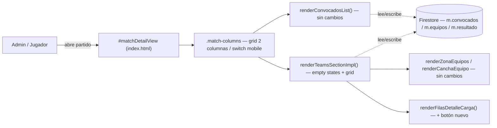
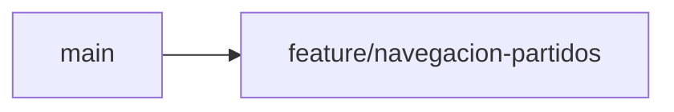

# Partido en dos columnas — Implementation Plan

> **Status:** Draft · **Date:** 2026-09-02 · **Owner:** Lucas Manoukian
>
> **Reviewers:** *pending*
>
> **Spec:** [NAVEGACION_PARTIDOS_SPEC.md](./NAVEGACION_PARTIDOS_SPEC.md)
>
> **Concept note:** [NAVEGACION_PARTIDOS_CONCEPT.md](./NAVEGACION_PARTIDOS_CONCEPT.md)

> **Grounding evidence (`MD-25`).** Este Plan se apoya en el ledger §6.5 del Concept Note
> y en las citas en línea de la Spec. Donde una tarea `T-N` o una `TD-*` se apoya en una
> ubicación de código que ninguno de los dos cubre, la cita va en línea. La convención de
> ramas, commits, tests y ausencia de feature flags de este Plan restata
> [`AGENTS.md`](../../AGENTS.md) y sigue el mismo patrón que los cinco Implementation
> Plans ya mergeados de "Equipos en el campo" (ver `TD-01` abajo).

## 1. Summary

Este Plan reestructura la pantalla de partido (`#matchDetailView`,
[index.html:951-982](../../index.html#L951-L982)) para pasar de un apilado vertical a un
grid de dos columnas en desktop, con un switch de dos pestañas por debajo del breakpoint.
Todo el trabajo entra en **una sola rama de código**, sin feature flag — el proyecto no
tiene esa infraestructura y su constitución la prohíbe anticipar (`TD-01`). No hay cambios
de modelo de datos ni de API: es una reestructuración de HTML/CSS/JS dentro del mismo
`index.html`, que reutiliza sin reescribir la lógica de arrastre, el render de cancha y
las funciones de agregar/quitar evento ya existentes.

## 2. Goals & non-goals

- **Technical goal 1** — Envolver `#convocadosList`/`#convSummary` (columna izquierda) y
  `#teamsSection` (columna derecha) en un grid de dos columnas, sin reescribir las
  funciones que ya las rellenan.
- **Technical goal 2** — Reemplazar el `@media (max-width: 900px)` actual
  ([index.html:518-528](../../index.html#L518-L528)) por un switch de pestañas que
  muestre una columna a la vez, en un breakpoint mayor (`OPEN-Q-01`).
- **Technical goal 3** — Agregar un botón "+" a `renderFilasDetalleCarga` (rebanada 6)
  que invoque la misma función que ya usa el toque en la camiseta, sin tocar el modelo de
  eventos.

**Non-goals** (heredados de Spec §3.2):

- No se toca el motor de generación de equipos ni el modelo de eventos/carga por toque.
- No se implementa `13b`, ni el restyle de los botones de header, ni el scroll `sticky`.
- No se agrega infraestructura de feature flags, CI, telemetría ni linter/type-checker
  que el proyecto no tenga hoy (`TD-01`, Principio II).

## 3. Architecture overview



Feature enteramente client-side: no hay un boundary de sistema nuevo, Firestore ya es el
mismo backend que usan las seis rebanadas anteriores.

### 3.1 Key design decisions

| ID | Decision | Spec ref | Rationale |
|---|---|---|---|
| TD-01 | Sin feature flag, una sola rama de código | `D-01`..`D-07` | El proyecto no tiene infraestructura de flags y el Principio II de [`.specify/memory/constitution.md`](../../.specify/memory/constitution.md) v2.4.0 prohíbe anticiparla. La red de seguridad es la rama sin mergear, igual que en las cinco rebanadas ya mergeadas de "Equipos en el campo" (`TD-09` de esas Specs). |
| TD-02 | El grid de dos columnas se logra envolviendo el HTML estático existente en dos `<div>` nuevos (`#matchColConvocados`, `#matchColEquipos`) dentro de un contenedor `#matchColumns`, sin mover el contenido a JS | `FR-001` | Los elementos que hoy son hijos directos de `#matchDetailView` (`#convBuscadorWrap`, el botón de prueba, `#convocadosList`, `#convSummary`, `#teamsSection`) no cambian de id ni de función que los llena — sólo cambian de padre en el HTML estático. Minimiza el diff y preserva `TC-002`/`TC-003`. |
| TD-03 | El componente visual `EmptyState` del design system **no se importa como librería** — se recrea como `<div class="empty-state-ds">` con el mismo padding/fondo/tipografía que `_ds_bundle.js:536-577`, igual que ya hace el resto de la aplicación con el resto de los componentes (`D-02` de `EQUIPOS_EN_EL_CAMPO_CONCEPT.md`: "el diseño se recrea en el stack del repo, no se importa el runtime del prototipo") | `TC-001` | La app es un `index.html` sin build ni framework (Principio II); no hay manera de `import` un componente React. |
| TD-04 | El switch mobile (`FR-009`) alterna visibilidad con una clase CSS (`.match-columns[data-mob-tab="equipos"]` / `"convocados"` / `"resultado"`) sobre el mismo contenedor `#matchColumns`, sin desmontar ni re-renderizar ninguna columna | `FR-009`-`FR-012` | Evita duplicar el render de `renderConvocadosList`/`renderTeamsSectionImpl` para mobile; el mismo DOM que arma desktop se oculta/muestra con `display:none` por breakpoint + atributo. |
| TD-05 | El valor de trabajo del breakpoint (`A-01`) se fija en **1100px** al implementar, con una tarea explícita de validación en un dispositivo real antes de cerrar la rama (`T-1.13`) | `OPEN-Q-01` | Interpola entre los 900px que hoy alcanzan para el grid interno blanco/negro solo ([index.html:518-521](../../index.html#L518-L521)) y los 1280px del mockup, descontando los ~368px que resta la columna nueva. Es un punto de partida, no un valor validado. |

## 4. Module map

| Module / package | Role | Status |
|---|---|---|
| `index.html` — HTML estático de `#matchDetailView` (líneas 951-982) | Estructura de columnas nueva (`TD-02`) | modified |
| `index.html` — `renderMatchDetail()` (línea 5687) | Setea el atributo/clase de pestaña activa del switch mobile (`FR-010`/`FR-011`) | modified |
| `index.html` — `renderConvocadosList()` (líneas 5739-5814) | Rellena la columna izquierda | untouched (`TC-002`) |
| `index.html` — `renderTeamsSectionImpl()` (líneas 5208-5313+) | Empty states restyleados (`FR-005`-`FR-008`); sin cambios en la rama de partido finalizado salvo el layout que la envuelve | modified |
| `index.html` — `renderZonaEquipos()` / `renderCanchaEquipo()` / `renderEncabezadoPartidoFinalizado()` | Cancha y camisetas | untouched (`TC-003`) |
| `index.html` — `renderFilasDetalleCarga()` (rebanada 6, `CARGA_POR_TOQUE_SPEC.md`) | Agrega el botón "+" por fila (`FR-013`/`FR-014`) | modified |
| CSS — bloque `@media (max-width: 900px)` (líneas 518-528) | Reemplazado por el breakpoint del switch mobile (`TC-007`) | deleted → replaced |
| CSS — nuevo bloque `.match-columns` / `.empty-state-ds` / switch mobile | Grid, empty state, pestañas | new |
| `tests/partido.test.js` | Tests unitarios de esta feature | new |
| `tests/layout.test.js` | Escenarios de breakpoint agregados con prefijo `partido/` | modified |
| `tests/harness.js` | Puede necesitar agregar nombres de función nuevos a `DECLARACIONES` si se introduce alguna función con nombre propio (`TD-04`) | modified (si aplica) |

## 5. Engineering rules / project conventions reference

Restatadas de [`AGENTS.md`](../../AGENTS.md).

| Rule | Summary |
|---|---|
| Estructura | Toda la aplicación en `index.html`, dentro de un IIFE. Sin build, sin bundler, sin framework (Principio II). |
| Imports | No aplica: no hay módulos. Las funciones nuevas se declaran junto a las del panel de equipos. |
| Typing | No aplica: JavaScript sin anotaciones ni type-checker configurado. |
| Logging | No aplica: la aplicación no tiene logging. |
| Tests | `tests/*.test.js`, se corren con `node tests/<archivo>`. Devuelven 1 ante regresión. Los tests recortan declaraciones de `index.html` por nombre con `tests/harness.js`. |
| Binding | `variant-a` — el identificador de la Spec va en forma canónica con guion **dentro de un string literal**, con el prefijo de esta feature `partido/`: el nombre del caso en `tests/partido.test.js` y el campo `spec: ['partido/S-01', ...]` de cada escenario de `tests/layout.test.js`. Nunca en comentarios. |
| Supply-chain | `none — el repositorio no versiona ningún lockfile; la aplicación no tiene dependencias instaladas` (Firebase por CDN; Playwright es dev-only externo). |
| Lint / type-check | `none — el repositorio no tiene linter ni type-checker configurados`. `T-1.D3`/`T-1.D4` pasan de forma vacua y se declaran como tales. |
| Constants | Los valores del handoff (352px, breakpoint, paddings) van como custom properties de CSS en el bloque nuevo, no repartidos en las reglas. |
| Commits | Conventional Commits con asunto en español: `tipo(scope): asunto (IDs de la Spec)`, ≤ 72 caracteres, un cambio lógico por commit. |
| Backwards compat | Requerida en los datos: esta feature no toca `m.convocados`/`m.equipos`/`m.resultado`. No requerida en la interfaz: el apilado anterior se retira sin camino de vuelta (ya cubierto por `TC-007`). |

## 6. Definition of Done (every branch)

- [ ] La implementación sigue las convenciones de §5
- [ ] Cada FR/TC de la Spec asignado a la rama está implementado
- [ ] Cada escenario (`S-*`) y cada variante tiene un test ejecutable (`AC-50`; `T-1.D8`, `T-1.D8b`)
- [ ] Cada NFR cuantificado tiene un test de medición o verificación manual documentada (`AC-51`; `T-1.D9`)
- [ ] Cada `TC-*` de la Spec §4 tiene una entrada de verificación en §12 (`AC-52`; `T-1.D10`, `T-1.D10b`)
- [ ] Las consecuencias están enumeradas en §12.2 (`AC-53`; `T-1.D15`)
- [ ] Cada NFR cuantificado tiene al menos una fila `OBS-*` en §11 (`AC-54`; `T-1.D16`)
- [ ] Supply-chain: `none` declarado (`AC-55`; `T-1.D20`, pasa de forma vacua)
- [ ] Cada riesgo `R-*` de §14 registra una vía de mitigación (`T-1.D17`)
- [ ] Auto-consistencia: todo ID referenciado dentro de este Plan resuelve dentro de este Plan (`T-1.D18`)
- [ ] Consistencia cruzada: todo ID de la Spec citado acá existe en la Spec, y todo `D-*` existe en el Concept Note (`T-1.D19`)
- [ ] `node tests/motor.test.js`, `node tests/cancha.test.js`, `node tests/panel.test.js`, `node tests/finalizado.test.js`, `node tests/eventos.test.js`, `node tests/toque.test.js` y `node tests/partido.test.js` pasan
- [ ] `LAYOUT_STRICT=1 node tests/layout.test.js` pasa
- [ ] Linter: no aplica (§5), declarado
- [ ] Type-checker: no aplica (§5), declarado
- [ ] No quedan `TODO`/`FIXME`/`HACK` en el código commiteado
- [ ] El historial de commits es limpio y sigue el formato de §5 (`T-1.D11`)
- [ ] La descripción del PR resume los cambios y cita las secciones de la Spec (`T-1.D12`)
- [ ] **Gate propio del proyecto:** la pantalla se miró en un navegador real a 1280px, en el breakpoint elegido (`T-1.13`), y a 390px, con `node tools/servir-fixture.js` si existe o abriendo `index.html` localmente (`T-1.D13`)
- [ ] PR abierto contra `main` (`T-1.D14`)

## 7. Branch / phase plan

### 7.0 Branch sizing (`MD-27`)

```
Custom arc: 1 branch — el proyecto no gatea por feature flags (TD-01) y la convención de
AGENTS.md § Ramas ya usa la rama de código como unidad de entrega (docs/<slug> primero,
feature/<slug> después), igual que las cinco rebanadas ya mergeadas de "Equipos en el
campo" (todas Custom arc: 1 branch). Subdividir en scaffolding/core/rollout duplicaría el
mismo mecanismo que la rama-sin-mergear ya provee como red de seguridad.
```

### 7.1 Branch tracker

| # | Git branch | Base branch | Status | PR | Tests | Notes |
|---|---|---|---|---|---|---|
| 1 | `feature/navegacion-partidos` | `main` | In progress (rama ya creada) | — | — | Docs (Concept/Spec/Plan) y código en la misma rama — ver `OPEN-Q-05` sobre si conviene separar en `docs/navegacion-partidos` primero, per `AGENTS.md` § Ramas |



### 7.2 Branch 1 — `feature/navegacion-partidos`

**Goal:** Landear el grid de dos columnas, el empty state restyleado, el switch mobile y
el botón "+" de las filas de detalle, todo en un solo merge a `main` — sin flag, probado
localmente contra staging antes de mergear (convención de `AGENTS.md`).

**Spec coverage:** FR-001 a FR-015, NFR-001 a NFR-004, TC-001 a TC-007, AC-01 a AC-55.

#### 7.2.1 Design decisions specific to this branch

> Ver `TD-02` a `TD-05` en §3.1 — todas aplican a esta única rama.

#### 7.2.4 Configuration

No aplica — sin feature flag (`TD-01`), sin variables de entorno nuevas.

#### 7.2.5 New / modified interfaces

Archivo: `index.html` (dentro del IIFE existente, junto a las funciones de la rebanada 3
y 6).

| Function | Signature | Notes |
|---|---|---|
| `renderMatchDetail` | `(m) => void` (existente, modificada) | Agrega, después de llamar `renderConvocadosList`/`renderTeamsSection`, la lógica que decide la pestaña inicial del switch mobile: `data-mob-tab="resultado"` si `m.inscripcionCerrada`, si no `"convocados"` (`FR-010`/`FR-011`). |
| `renderTeamsSectionImpl` | `(m) => void` (existente, modificada) | Las dos ramas de `if(titularIds.length===0)` / `if(!m.equipos)` ([index.html:5215-5227](../../index.html#L5215-L5227)) cambian su `innerHTML` para usar la clase `.empty-state-ds` con título+caption (`FR-005`/`FR-006`), y agregan el bloque "Con qué va a armar" como hermano cuando aplica `FR-006` (`AC-16`). |
| `renderBotonesFilaDetalle` (nueva, extraída de `renderFilasDetalleCarga`) | `(fila, m) => string` | Devuelve el HTML de los botones "−"/"+" de una fila; el "+" invoca la misma función de agregar evento que ya usa el toque en la camiseta (`TC-004`), citada por su nombre exacto una vez identificada en `CARGA_POR_TOQUE_SPEC.md` §7 del Plan de la rebanada 6. |
| `toggleMobTab` (nueva) | `(m, tab: 'convocados'\|'equipos'\|'resultado') => void` | Setea `data-mob-tab` en `#matchColumns` y persiste la pestaña activa sólo en memoria (no en Firestore) — `FR-009`. |

#### 7.2.6 Tests

```
tests/partido.test.js
tests/layout.test.js (casos agregados, prefijo partido/)
```

| File | Test case | What it covers |
|---|---|---|
| `tests/partido.test.js` | `'partido/S-03 — empty state sin titulares'` | `S-03`, `FR-005` |
| `tests/partido.test.js` | `'partido/S-04a — botón Generar equipos visible para admin'` | `S-04a`, `FR-007` |
| `tests/partido.test.js` | `'partido/S-04b — botón Generar equipos oculto para jugador'` | `S-04b`, `FR-008` |
| `tests/partido.test.js` | `'partido/S-04c — falla de generación no deja estado inconsistente'` | `S-04c`, `AC-20` |
| `tests/partido.test.js` | `'partido/S-05 — sin subtítulo de estrategia en finalizado'` | `S-05`, `TC-006` |
| `tests/partido.test.js` | `'partido/S-07 — botón + agrega el mismo evento que tocar la camiseta'` | `S-07`, `FR-013`, `FR-014`, `TC-004` |
| `tests/partido.test.js` | `'partido/S-07a — fila desaparece sin eventos'` | `S-07a` |
| `tests/partido.test.js` | `'partido/S-07b — dos toques de + agregan dos eventos'` | `S-07b` |
| `tests/partido.test.js` | `'partido/S-20 — jugador no ve botones +/- '` | `S-20`, `FR-015` |
| `tests/layout.test.js` (agregado) | `spec: ['partido/S-01', 'partido/S-01a', 'partido/S-01b']` | Grid de dos columnas en 1280px, en el breakpoint, y justo debajo (`NFR-003`) |
| `tests/layout.test.js` (agregado) | `spec: ['partido/S-06', 'partido/S-06a', 'partido/S-06b']` | Switch mobile en 390px, con inscripción abierta y cerrada |

`S-01c`/`S-01d`/`S-02`/`S-02a` reutilizan las aserciones de arrastre ya existentes en
`tests/cancha.test.js`/`arrastre` — no necesitan test nuevo, sólo confirmar que siguen
pasando dentro del nuevo contenedor (cubierto por `T-1.D2`).

#### 7.2.7 Verification

- [ ] Grid de dos columnas visible en 1280px y en el breakpoint de trabajo (1100px, `TD-05`)
- [ ] Switch mobile visible y funcional en 390px
- [ ] Botón "+" de la fila de detalle agrega el mismo evento que tocar la camiseta
- [ ] Todos los tests existentes pasan sin regresión

#### 7.2.8 Files inventory

**New files:**
```
tests/partido.test.js
```

**Modified files:**
```
index.html
tests/layout.test.js
tests/harness.js (si se agrega alguna función con nombre propio a DECLARACIONES)
docs/navegacion-partidos/DELTA.md (nuevo, si se decide llevar el mismo patrón de
  design_handoff_equipos_en_el_campo/DELTA.md — ver OPEN-Q-06)
```

#### 7.2.9 Task checklist (agent-runnable)

Implementation tasks (grouped into atomic commits):

- [ ] T-1.1 Modificar el HTML estático de `#matchDetailView` (index.html:967-981) para
  envolver `#convBuscadorWrap` + botón de prueba + `#convocadosList` + `#convSummary` en
  `<div id="matchColConvocados">`, y `#teamsSection` en `<div id="matchColEquipos">`,
  ambos dentro de `<div id="matchColumns">` (`TD-02`)
- [ ] T-1.2 [P] Agregar el bloque CSS `.match-columns` (grid `352px minmax(0,1fr)`,
  `gap:16px`) activo desde 1100px (`TD-05`), reemplazando el `@media (max-width: 900px)`
  de index.html:518-528 (`TC-007`)
- [ ] T-1.C1 Commit — `feat(navegacion-partidos): agrega el grid de dos columnas (FR-001, TC-007)`

- [ ] T-1.3 Agregar el bloque CSS `.empty-state-ds` (fondo `--surface-card-sage`, padding
  `--space-3xl`, tipografía `--type-display-xs`/`--type-body-md`) recreando
  `_ds_bundle.js:536-577` en CSS vanilla (`TD-03`)
- [ ] T-1.4 Modificar `renderTeamsSectionImpl` (index.html:5215-5227) para usar
  `.empty-state-ds` en las dos ramas de empty state, agregando el bloque "Con qué va a
  armar" como hermano en la rama de `FR-006` (`FR-005`, `FR-006`)
- [ ] T-1.C2 Commit — `feat(navegacion-partidos): empty state con el componente del design system (FR-005, FR-006)`

- [ ] T-1.5 Confirmar que el botón "Generar equipos" sigue detrás de `isAdmin()`
  (`FR-007`/`FR-008`, ya existente — sin cambios de código, sólo de posición visual)
- [ ] T-1.6 [P] Agregar la clase `.empty-state-ds` también a la rama `titularIds.length === 0`
  con el copy ya existente (`FR-005`)
- [ ] T-1.C3 Commit — `fix(navegacion-partidos): reubica el botón Generar equipos en el nuevo layout (FR-007, FR-008)`

- [ ] T-1.7 Agregar el switch de pestañas mobile (`toggleMobTab`, `FR-009`) con la
  lógica de arranque en "Resultado"/"Convocados" según `m.inscripcionCerrada`
  (`FR-010`, `FR-011`)
- [ ] T-1.8 [P] Agregar la variante de lectura de la pestaña "Convocados" (sin buscador,
  sin quitar, sin arrastre) cuando la inscripción está cerrada (`FR-012`)
- [ ] T-1.C4 Commit — `feat(navegacion-partidos): switch de pestañas para viewports angostos (FR-009, FR-010, FR-011, FR-012)`

- [ ] T-1.9 Extraer `renderBotonesFilaDetalle` de `renderFilasDetalleCarga` (rebanada 6) y
  agregar el botón "+" que invoca la misma función de agregar evento que el toque en la
  camiseta (`FR-013`, `FR-014`, `TC-004`)
- [ ] T-1.10 [P] Confirmar que el botón "−" sigue invocando exactamente la función
  existente, sin cambios (`TC-005`)
- [ ] T-1.11 Ocultar ambos botones para el rol `jugador` (`FR-015`, hereda
  `CARGA_POR_TOQUE_SPEC.md` `FR-003`)
- [ ] T-1.C5 Commit — `feat(navegacion-partidos): botón + en la fila de detalle (FR-013, FR-014, FR-015)`

- [ ] T-1.12 Escribir `tests/partido.test.js` con los casos de §7.2.6
- [ ] T-1.13 Agregar los casos `partido/S-01`, `S-01a`, `S-01b`, `S-06`, `S-06a`, `S-06b` a
  `tests/layout.test.js`, y **validar el breakpoint real** abriendo `index.html` en un
  navegador a distintos anchos entre 900px y 1280px — ajustar `TD-05` si 1100px no
  alcanza (resuelve `OPEN-Q-01`)
- [ ] T-1.C6 Commit — `test(navegacion-partidos): cobertura de escenarios y breakpoint (S-01..S-20)`

DoD verification (§6):

- [ ] T-1.D1 Todos los tests nuevos pasan — `node tests/partido.test.js`
- [ ] T-1.D2 Todos los tests existentes pasan — `node tests/motor.test.js && node tests/cancha.test.js && node tests/panel.test.js && node tests/finalizado.test.js && node tests/eventos.test.js && node tests/toque.test.js`
- [ ] T-1.D3 Linter: no aplica (§5), declarado
- [ ] T-1.D4 Type-checker: no aplica (§5), declarado
- [ ] T-1.D5 Sin `TODO`/`FIXME`/`HACK` — `git grep -nE "TODO|FIXME|HACK" -- index.html tests/partido.test.js`
- [ ] T-1.D6 Implementación revisada contra §5
- [ ] T-1.D7 Cada FR/TC de la Spec asignado a esta rama está implementado (FR-001 a FR-015, TC-001 a TC-007)
- [ ] T-1.D8 Cada escenario y variante de la Spec §9 tiene un test — `comm -23 <(grep -oE "S-[0-9]+[a-z]*" ../docs/navegacion-partidos/NAVEGACION_PARTIDOS_SPEC.md | sort -u) <(grep -rEho "partido/S-[0-9]+[a-z]*" tests/ | grep -oE "S-[0-9]+[a-z]*" | sort -u)` vacío
- [ ] T-1.D8b Cada encabezado de escenario de la Spec §9 tiene un bloque `Variants:` o la declaración `Variants: none` — lint `awk` sobre `NAVEGACION_PARTIDOS_SPEC.md` (ver receta del template) vacío
- [ ] T-1.D9 Cada NFR cuantificado tiene un test o verificación manual documentada — `NFR-001`/`NFR-004` verificados por revisión de código (ver §12.4); `NFR-002`/`NFR-003` por medición manual (§11)
- [ ] T-1.D10 Cada TC-* está referenciado en §12 de este Plan — `comm -23 <(grep -oE "TC-[0-9]+" ../docs/navegacion-partidos/NAVEGACION_PARTIDOS_SPEC.md | sort -u) <(sed -n '/^## 12\./,/^## 13\./p' NAVEGACION_PARTIDOS_IMPLEMENTATION_PLAN.md | grep -oE "TC-[0-9]+" | sort -u)` vacío
- [ ] T-1.D10b Cada TC-* tiene un chequeo en Spec §11.3 — ya verificado al escribir la Spec
- [ ] T-1.D11 Historial de commits limpio, formato de §5
- [ ] T-1.D12 Descripción del PR con resumen, referencias a la Spec y decisiones tomadas
- [ ] T-1.D13 Pantalla mirada en navegador real a 1280px, en el breakpoint elegido, y a 390px
- [ ] T-1.D14 PR abierto contra `main`
- [ ] T-1.D15 §12.2 tiene al menos una fila `IMP-*` por alcance afectado — `sed -n '/^### 12\.2/,/^### 12\.3/p' NAVEGACION_PARTIDOS_IMPLEMENTATION_PLAN.md | grep -cE "^\| *IMP-[0-9]+"` ≥ 1
- [ ] T-1.D16 Cada NFR cuantificado tiene una fila `OBS-*` en §11 — `comm -23 <(grep -oE "NFR-[0-9]+" ../docs/navegacion-partidos/NAVEGACION_PARTIDOS_SPEC.md | sort -u) <(sed -n '/^## 11\./,/^## 12\./p' NAVEGACION_PARTIDOS_IMPLEMENTATION_PLAN.md | grep -oE "NFR-[0-9]+" | sort -u)` vacío
- [ ] T-1.D17 Cada `R-*` de §14 registra una vía de mitigación
- [ ] T-1.D18 Auto-consistencia: todo ID referenciado en este Plan resuelve en este Plan
- [ ] T-1.D19 Consistencia cruzada: todo ID de Spec citado acá existe en la Spec; todo `D-*` existe en el Concept Note
- [ ] T-1.D20 Supply-chain: `none` declarado en §5, pasa de forma vacua

## 8. Data model & migrations

No aplica — sin cambios de esquema. `m.convocados`, `m.equipos`, `m.resultado` no cambian
de forma (Spec §10).

## 9. API & contract changes

No aplica — sin endpoints nuevos, sin contratos nuevos. Todo el trabajo es client-side
sobre datos que ya se leen/escriben en Firestore desde antes de esta feature.

## 10. Configuration & feature flags

No aplica — `TD-01`. Sin flags: el proyecto publica por merge directo a `main`, probado
localmente contra staging antes de mergear (`AGENTS.md` § Ramas).

## 11. Observability

> El proyecto no tiene telemetría (aceptado como riesgo en rebanadas anteriores, ver
> `R-01` abajo). Los `OBS-*` de esta feature son checks manuales at build/PR time, no
> señales de producción — igual que el resto de "Equipos en el campo".

| ID | Signal | Type | Source | Binds to | Threshold / use |
|---|---|---|---|---|---|
| OBS-01 | Medición manual del tiempo de transición del switch con las devtools del navegador (pestaña Performance) | manual check | `toggleMobTab` | NFR-002 | ≤150ms, verificado una vez por PR (`T-1.D9`) |
| OBS-02 | Inspección visual del ancho del panel de equipos en el breakpoint elegido | manual check | `.match-columns` | NFR-003 | El panel no cae por debajo de lo que documenta index.html:518-521 |

**Dashboards:** ninguno — no aplica a este proyecto.

## 12. Test plan

### 12.1 Scenario Traceability Matrix

| Spec scenario | Test | Level | Branch |
|---|---|---|---|
| S-01 (happy parent) | `tests/layout.test.js` → `spec: ['partido/S-01']` | integration | Branch 1 |
| S-01a `[boundary]` en el breakpoint | `tests/layout.test.js` → `spec: ['partido/S-01a']` | integration | Branch 1 |
| S-01b `[boundary]` justo debajo | `tests/layout.test.js` → `spec: ['partido/S-01b']` | integration | Branch 1 |
| S-01c `[failure]` sin convocados | `tests/cancha.test.js` (ya existente, sin cambios) | unit | Branch 1 |
| S-01d `[property]` invariante de arrastre | `tests/cancha.test.js`/`arrastre` (ya existente) | property | Branch 1 |
| S-02 | Cubierto por el arrastre ya existente (`tests/cancha.test.js`), sin test nuevo | unit | Branch 1 |
| S-02a `[failure]` drag cancelado | Cubierto por el arrastre ya existente | unit | Branch 1 |
| S-03 | `tests/partido.test.js::'partido/S-03'` | unit | Branch 1 |
| S-04 | `tests/partido.test.js::'partido/S-04'` | unit | Branch 1 |
| S-04a `[boundary]` admin ve el botón | `tests/partido.test.js::'partido/S-04a'` | unit | Branch 1 |
| S-04b `[boundary]` jugador no lo ve | `tests/partido.test.js::'partido/S-04b'` | unit | Branch 1 |
| S-04c `[failure]` falla la generación | `tests/partido.test.js::'partido/S-04c'` | unit | Branch 1 |
| S-05 | `tests/partido.test.js::'partido/S-05'` | unit | Branch 1 |
| S-05a `[boundary]` admin ve editar | `tests/finalizado.test.js` (ya existente) | unit | Branch 1 |
| S-05b `[boundary]` jugador no ve editar | `tests/finalizado.test.js` (ya existente) | unit | Branch 1 |
| S-06 | `tests/layout.test.js` → `spec: ['partido/S-06']` | integration | Branch 1 |
| S-06a `[boundary]` inscripción cerrada | `tests/layout.test.js` → `spec: ['partido/S-06a']` | integration | Branch 1 |
| S-06b `[property]` una pestaña a la vez | `tests/layout.test.js` → `spec: ['partido/S-06b']` | property | Branch 1 |
| S-07 | `tests/partido.test.js::'partido/S-07'` | unit | Branch 1 |
| S-07a `[failure]` fila sin eventos | `tests/partido.test.js::'partido/S-07a'` | unit | Branch 1 |
| S-07b `[concurrency]` doble toque | `tests/partido.test.js::'partido/S-07b'` | unit | Branch 1 |
| S-20 | `tests/partido.test.js::'partido/S-20'` | unit | Branch 1 |

### 12.2 Impact Traceability

| ID | Scope | Description | Triggered by | Risk | OBS | Mitigation task |
|---|---|---|---|---|---|---|
| IMP-01 | code | `renderTeamsSectionImpl`, `renderMatchDetail` y `renderFilasDetalleCarga` cambian de forma; cualquier código externo a este archivo que dependa de la estructura de `#teamsSection`/`#convocadosList` (no hay ninguno conocido) debería revisarse | FR-001, FR-005, FR-013 | R-02 | — | `T-1.D2` |
| IMP-02 | business | La pantalla de partido cambia de layout para admin y jugador — es el cambio de UX que motiva la feature | FR-001, FR-004, FR-009 | — | OBS-01, OBS-02 | `T-1.13` |
| IMP-03 | system | El CSS de index.html:518-528 se reemplaza; cualquier otra regla que dependiera de ese breakpoint (no se encontró ninguna) debería revisarse | TC-007 | R-03 | — | `T-1.2` |

### 12.3 Unit tests

- `tests/partido.test.js` — casos de §7.2.6.
- `tests/cancha.test.js`, `tests/panel.test.js`, `tests/finalizado.test.js`,
  `tests/toque.test.js` — se corren sin cambios para confirmar ausencia de regresión.

### 12.4 Integration tests

- `tests/layout.test.js` (`LAYOUT_STRICT=1`) — agrega los casos de breakpoint de §7.2.6,
  usando Playwright cuando está disponible.

### 12.6 End-to-end / smoke tests

- Apertura manual de `index.html` contra staging en 1280px, en el breakpoint elegido, y
  en 390px, antes de mergear (`T-1.D13`).

### 12.7 Manual QA

- Confirmar en un dispositivo mobile real que el switch arranca en "Resultado" con la
  inscripción cerrada (`FR-010`).

### 12.8 Performance / load tests

- `NFR-002` se verifica con la pestaña Performance del navegador (`OBS-01`), no con un
  test automatizado — el proyecto no tiene infraestructura de medición continua.

## 13. Rollout plan

1. Terminar y mergear la rama única `feature/navegacion-partidos` contra `main`.
2. Probar localmente contra staging (`AGENTS.md` § Ramas) en los tres anchos de `NFR-003`.
3. Mergear a `main` — GitHub Pages publica contra producción automáticamente.
4. No hay enable progresivo ni flag que retirar (`TD-01`).

## 14. Risks & rollback

| ID | Risk | Likelihood | Severity | Detection signal | Mitigation task | Rollback procedure |
|---|---|---|---|---|---|---|
| R-01 | La app no tiene telemetría, así que un problema que los tests no atrapen se descubre recién cuando alguien del grupo lo cuenta | Med | Med | manual — reporte del grupo | `accepted (rationale: agregar telemetría para esta feature sería la infraestructura anticipada que prohíbe el Principio II; el grupo es chico y el canal de reporte es inmediato)` | Revertir el commit de merge |
| R-02 | El breakpoint de trabajo (1100px, `TD-05`) resulta incorrecto en dispositivos reales | Med | Med | `OBS-02` | `T-1.13` | Ajustar el valor de la custom property CSS, sin tocar lógica |
| R-03 | Ningún otro selector CSS dependía del `@media (max-width: 900px)` retirado, pero no se auditó exhaustivamente todo `index.html` | Baja | Med | manual — regresión visual reportada | `T-1.D2` (correr toda la suite de tests, que ejercita el resto de la UI) | Revertir el commit que tocó el CSS |

**Worst-case blast radius:** un `git revert` del merge deja la app exactamente como está
hoy — no hay flag, no hay dato persistido nuevo, no hay migración que deshacer.

## 15. Open questions & assumptions

### 15.1 Open questions

| ID | Question | Owner | Resolution by branch | Notes |
|---|---|---|---|---|
| OPEN-Q-01 | ¿Cuál es el breakpoint real, validado en dispositivo? | Lucas | Branch 1 (`T-1.13`) | Inherited de Spec `OPEN-Q-01`; valor de trabajo 1100px (`TD-05`) |
| OPEN-Q-05 | ¿Conviene separar los documentos (Concept/Spec/Plan) en una rama `docs/navegacion-partidos` mergeada primero, tal como describe `AGENTS.md` § Ramas, en vez de compartir `feature/navegacion-partidos`? | Lucas | Antes de abrir el PR de código | Descubierto al escribir este Plan — no estaba en la Spec ni en el Concept Note; el Concept Note tampoco declaró explícitamente la política de "sin feature flags", que sí es una convención documentada del proyecto (ver `TD-01`) |
| OPEN-Q-06 | ¿Esta feature necesita su propio `DELTA.md` (como `design_handoff_equipos_en_el_campo/DELTA.md`) para trackear futuras vistas del turno 12/13/14 que todavía no se implementen? | Lucas | Post-launch | Sólo relevante si se agregan más vistas del mismo proyecto de diseño más adelante |

### 15.2 Assumptions

| ID | Assumption | Owner | If false |
|---|---|---|---|
| A-01 | 1100px es un breakpoint razonable de partida (`TD-05`) | Lucas | Ajustar la custom property CSS; no invalida ninguna otra parte de la rama |
| A-02 | Ningún otro selector CSS del archivo depende del `@media (max-width: 900px)` que se retira | Lucas | Revisar `index.html` completo por `900px` antes de mergear; si aparece otro uso, evaluar si also debe moverse al breakpoint nuevo |

## 16. Acceptance criteria coverage

| Spec AC | Satisfied by | Test |
|---|---|---|
| AC-01 | Branch 1 | `tests/partido.test.js` + `tests/layout.test.js` (partido/S-01..S-20, ver §12.1) |
| AC-02 | Branch 1 | `tests/layout.test.js` → `partido/S-01`, `S-01a`, `S-01b` |
| AC-03 | Branch 1 | `tests/partido.test.js::'partido/S-04a'` + `'partido/S-04b'` |
| AC-10 | Branch 1 | `OBS-01` — medición manual, `T-1.13` |
| AC-11 | Branch 1 | Revisión contra el mismo checklist de `INVARIANTE_CANCHA_A11Y` (`T-1.D13`) |
| AC-15 | Branch 1 | Revisión de código — `TC-002`/`TC-003` no reescriben `renderConvocadosList`/`renderZonaEquipos` |
| AC-16 | Branch 1 | `tests/partido.test.js::'partido/S-07'` confirma que "+" invoca la misma función que el toque |
| AC-17 | Branch 1 | `tests/partido.test.js::'partido/S-05'` |
| AC-18 | Branch 1 | `T-1.2` — revisión de código confirmando que el CSS viejo fue reemplazado, no duplicado |
| AC-20 | Branch 1 | `tests/partido.test.js::'partido/S-04c'` |
| AC-50 | Branch 1 | (meta-gate — §12.1 completo; `T-1.D8`/`T-1.D8b`) |
| AC-51 | Branch 1 | (meta-gate — §12.8/§11 con `OBS-01`; `T-1.D9`) |
| AC-52 | Branch 1 | (meta-gate — TC-001 a TC-007 en §12/§11.3; `T-1.D10`/`T-1.D10b`) |
| AC-53 | Branch 1 | (meta-gate — §12.2 con 3 filas `IMP-*`; `T-1.D15`) |
| AC-54 | Branch 1 | (meta-gate — §11 con `OBS-01`/`OBS-02`; `T-1.D16`) |
| AC-55 | Branch 1 | (meta-gate — `Supply-chain: none` declarado en §5; `T-1.D20` pasa de forma vacua) |

## 17. Change log

| Date | Author | Change |
|---|---|---|
| 2026-09-02 | Lucas Manoukian | Initial draft. |

---

*Este Implementation Plan es el contrato que ejecuta un agente de código (humano o IA).
Las preguntas de comportamiento viven en
[NAVEGACION_PARTIDOS_SPEC.md](./NAVEGACION_PARTIDOS_SPEC.md). La motivación y el
razonamiento de las decisiones viven en
[NAVEGACION_PARTIDOS_CONCEPT.md](./NAVEGACION_PARTIDOS_CONCEPT.md).*
