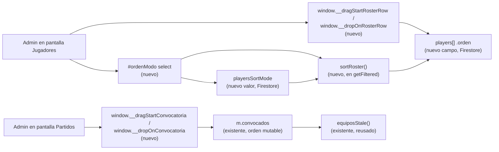
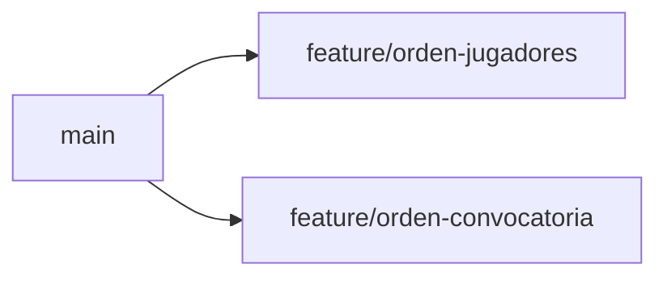

# Orden del listado de jugadores — Implementation Plan

> **Status:** Draft · **Date:** 2026-08-28 · **Owner:** Lucas Manoukian
>
> **Reviewers:** *pending*
>
> **Spec:** [ORDEN_JUGADORES_SPEC.md](./ORDEN_JUGADORES_SPEC.md)
>
> **Concept note:** *not written — see the Spec's §6.5 for why*

> **Grounding evidence (`MD-25`).** This Plan grounds in the Spec's §6.5
> *Sources & Origins* ledger and its inline stage-specific citations. Where a
> task or module choice is pinned by a specific codebase location beyond
> what §6.5 already captures, it is cited inline below.

## 1. Summary

This Plan builds two independently mergeable pieces of the Spec: (1) the
"Jugadores" screen's modo de orden control — manual drag-and-drop, plus
puntaje/posición sort filters — and (2) drag-and-drop-only manual reordering
of a match's titulares/suplentes convocatoria queue. Both extend the
existing single-file `index.html` app; neither introduces a new file,
library, or persistence mechanism.

## 2. Goals & non-goals

**Goals:**

- Ship every FR in the Spec (§7) without regressing the two existing
  automated test suites (`tests/motor.test.js`, `tests/layout.test.js`).
- Reuse the app's one existing drag-and-drop pattern
  (`window.__dragStartJugador`/`window.__dropOnTeam`) rather than
  introducing a new interaction model or a third-party library.

**Non-goals:**

- No feature flag — the app has no feature-flag mechanism (Spec §13), and
  no prior feature in this repo ships behind one.
- No new automated test framework — this feature area has no coverage
  today (Spec §11.5 AC-50 ruling), and this Plan does not introduce one.
- No CI pipeline — none exists in this repo; verification is manual plus
  the two existing `node`-run test files.

## 3. Architecture overview



### 3.1 Key design decisions

| ID | Decision | Rationale |
|---|---|---|
| TD-01 | `orden` lives as a plain integer field directly on each player object in `players[]`, not a separate ordering document. | Matches how every other player attribute (`estado`, `principal`, …) is modeled; no new document type needed (TC-001). |
| TD-02 | `playersSortMode` is persisted as a plain string value (`'manual'` etc.), not a JSON blob. | Matches the existing plain-string migration-flag pattern (`index.html:1187-1203`), the simplest form for a five-value enum. |
| TD-03 | Sorting logic lives in one new function, `sortRoster(list, mode)`, called from `getFiltered()` in place of its current hard-coded `.sort()`. | Keeps `getFiltered()`'s filter → search → sort shape intact (TC-010) and gives puntaje/posición/manual sorting one seam to test manually. |
| TD-04 | Jugadores-screen drag-and-drop is implemented as two new handlers, `window.__dragStartRosterRow`/`window.__dropOnRosterRow`, structurally mirroring `window.__dragStartJugador`/`window.__dropOnTeam`. | Direct reuse of the app's only existing drag-and-drop shape (TC-001, TC-041). |
| TD-05 | A drop reorders `orden` by resequencing the full manually-sorted list as consecutive integers (`0, 1, 2, …`) after splicing the dragged id into its new index — never fractional/gap-based indices. | Simplest correct approach; avoids float-precision or index-collision bugs a gap-based scheme would risk, at the cost of rewriting every player's `orden` on each drop (acceptable — roster size is small, NFR-001). |
| TD-06 | Convocatoria drag-and-drop identifies the dragged/target **unidad** via `getUnidadesConvocatoria(m)`, using the unit's first id as the drag payload. | Reuses the existing dupla-grouping function (TC-014) rather than re-deriving it. |
| TD-07 | New handlers `window.__dragStartConvocatoria(e, matchId, playerId)`/`window.__dropOnConvocatoria(e, matchId, targetPlayerId)`, structurally mirroring TD-04's pair. | Consistency with TD-04; reuses native HTML5 drag-and-drop (TC-015). |
| TD-08 | A convocatoria drop splices the dragged unit's id(s) out of `m.convocados` and re-inserts them immediately before the target unit's first id (end-of-list if dropped past the last row). | `m.convocados` is already an ordered array — a splice is simpler and safer than Branch 1's full-resequence approach (TD-05), and there is no separate `orden` field to keep in sync here. |
| TD-09 | The convocatoria drag handler checks `isAdmin()` only — **not** the `locked` flag that gates add/quitar/dupla. | Deliberate, per Spec FR-070/TC-042; the code carries an explicit comment citing FR-070 so a future reader doesn't "fix" this as an oversight. |

## 4. Module map

Single-file app; no new files. All changes land in `index.html`.

| Area | Existing anchor | New/modified symbols |
|---|---|---|
| Jugadores — state & load | `index.html:1085-1148` (`DOCS_SOLO_ADMIN`, `claves`, `loadAll`) | `DOCS_SOLO_ADMIN` gains `'ordenJugadoresMigrado'`; base `claves` (both call sites, `index.html:1100` and `1132`) gains `'playersSortMode'`; `loadAll` reads it into a new `playersSortMode` variable |
| Jugadores — sort & render | `index.html:1474-1538` (`getFiltered`, `renderPlayersTab`) | New `sortRoster(list, mode)`, `effectiveSortMode()`; `getFiltered` calls `sortRoster`; `renderPlayersTab` renders `#ordenModo` and draggable rows |
| Jugadores — drag handlers | `index.html:3541-3551` (existing pattern reused, not modified) | New `window.__dragStartRosterRow`, `window.__dropOnRosterRow` |
| Jugadores — persistence | `index.html:1256-1266` (`savePlayers`), `index.html:982-995` (`window.__showToast`) | `savePlayers()` reused unchanged; new failure handling around the drop handler's call to it (FR-053) |
| Jugadores — migration & create | `index.html:1187-1203` (migration flags), `index.html:1585-1598` (`validateAndSave`) | New one-time `orden` backfill block; `validateAndSave` assigns `orden` on create |
| Convocatoria — render & drag | `index.html:4193-4258` (`renderConvocadosList`) | Adds `draggable`/`ondragstart`/`ondragover`/`ondrop` to `.conv-row`/`.conv-row-dupla`; new `window.__dragStartConvocatoria`, `window.__dropOnConvocatoria` |
| Convocatoria — persistence | `index.html:1273-` (`saveMatches`) | Reused unchanged |

## 5. Engineering rules / project conventions reference

| Rule | Summary |
|---|---|
| Imports | N/A — no module system; one `<script>` IIFE, no `import`/`require` anywhere in `index.html`. |
| Typing | N/A — plain JavaScript, no type annotations anywhere in the codebase. |
| Logging | N/A — no logging layer for any existing feature (Spec §8 NFR-005); this feature does not introduce one. |
| Tests | **No automated test exists for either surface** (`tests/motor.test.js`/`tests/layout.test.js` cover the team-generation engine and responsive layout only). Per Spec §11.5 `AC-50`'s explicit ruling, this Plan's §12.1 binds each scenario/variant to a **named, repeatable manual verification procedure** instead. |
| Binding | `manual-procedure` — not the template's `variant-a`/`variant-b`/`none`; a disclosed, Spec-sanctioned fourth form for a feature area with no test framework (Spec §11.5 AC-50). The scenario/variant ID is the leading label of its §12.1 row; a human reviewer confirms the ID↔procedure pairing at PR review (T-N.D8 below, adapted). |
| Supply-chain | `none — no package manifest or lockfile in this repo` (no `package.json` at repo root). `T-N.D20` passes vacuously. |
| Constants | New constants (if any, e.g. `ORDEN_MODOS`) live near the existing `POSITIONS`/`GOAL_ICON`-style top-level constants; no separate constants file exists in this codebase. |
| Commits | Conventional-Commits-shaped, Spanish subject, matching `git log` history in this repo. Format: `type(scope): subject (Spec-ID[, Spec-ID...])`, e.g. `feat(jugadores): agrega selector de modo de orden (FR-001, FR-003)`. |
| Backwards compat | Required. A player with no `orden` (pre-feature data) is backfilled once (FR-060); a match's `m.convocados` needs no backfill (its existing order already stands); `playersSortMode` absent in Firestore reads as `'manual'` (the default), never `undefined`. |

## 6. Definition of Done (every branch)

- [ ] Implementation follows the conventions in §5
- [ ] Every Spec FR/TC assigned to this branch is implemented (§16 cross-reference)
- [ ] Every Spec scenario (`S-*`) and variant (`S-NNa`, …) assigned to this branch has a manual verification procedure in §12.1 (gates Spec §11.5 `AC-50`, adapted per §5 `Binding: manual-procedure`)
- [ ] `AC-51` not applicable — no quantified NFR (Spec §8)
- [ ] Every TC (`TC-*`) assigned to this branch has a §12 entry — reviewer-checked, none are CI-mechanizable in this repo (gates `AC-52`)
- [ ] §12.2 *Impact Traceability* has at least one `IMP-*` row per materially-affected scope for this branch's changes (gates `AC-53`)
- [ ] `AC-54` not applicable — no quantified NFR to bind an `OBS-*` to
- [ ] Supply-chain: `none` per §5 — `AC-55` passes vacuously
- [ ] Every risk (`R-*`) touching this branch in §14 records a mitigation path
- [ ] Self-consistency: every ID referenced in this Plan resolves to a definition in this Plan or the Spec
- [ ] Cross-consistency: every Spec ID cited here exists in the Spec
- [ ] Every §12.1 procedure assigned to this branch performed in a real browser session against the app (staging Firebase)
- [ ] The two existing automated suites still pass — `node tests/motor.test.js && node tests/layout.test.js` (no regressions)
- [ ] No linter/type-checker exists in this repo — N/A, not gated
- [ ] No `TODO`/`FIXME`/`HACK` left in changed code — `git grep -nE "TODO|FIXME|HACK" -- index.html` (scoped to this branch's diff) returns nothing new
- [ ] Commit history is clean: each commit atomic, follows §5 `Commits` format
- [ ] PR description includes a summary, Spec cross-references, and the `TD-*` decisions made
- [ ] PR opened against `main`

## 7. Branch / phase plan

### 7.0 Branch sizing (`MD-27`)

```
Custom arc: 2 branches — this repo has no feature-flag mechanism and no
CI/PR-gating pipeline, and every prior feature (including the directly
analogous goles-en-contra change) merged as a single branch. The two
pieces of this feature are nonetheless genuinely separable: Branch 1
(Jugadores roster ordering) and Branch 2 (convocatoria queue
drag-and-drop) touch disjoint render functions (`renderPlayersTab` vs.
`renderConvocadosList`), disjoint data (`players[].orden`/
`playersSortMode` vs. `m.convocados`), were scoped in two distinct passes
of Spec authoring at the user's own request, and neither depends on the
other landing first. Splitting them keeps each PR reviewable and
independently revertible without manufacturing rollout machinery this
project doesn't otherwise use.
```

### 7.1 Branch tracker

| # | Git branch | Base branch | Status | PR | Tests | Notes |
|---|---|---|---|---|---|---|
| 1 | `feature/orden-jugadores` | `main` | Not started | — | manual (§12.1) | Covers Spec FR-001–FR-061 |
| 2 | `feature/orden-convocatoria` | `main` | Not started | — | manual (§12.1) | Covers Spec FR-070–FR-075; independent of Branch 1 |



---

### 7.2 Branch 1 — `feature/orden-jugadores`

**Goal:** Add the modo de orden control, manual drag-and-drop, and
puntaje/posición sort filters to the Jugadores screen, with shared
persistence and a one-time legacy-data migration.
**Spec coverage:** FR-001–FR-061 (all), TC-001, TC-010–TC-013, TC-030,
TC-031, TC-040, TC-041, AC-01, AC-02, AC-10, AC-11, AC-15, AC-16.

#### 7.2.1 Design decisions specific to this branch

TD-01 through TD-05 (§3.1).

#### 7.2.3 New constants

| Constant | Value | Purpose |
|---|---|---|
| `ORDEN_MODOS` | `['manual', 'puntaje_asc', 'puntaje_desc', 'posicion_asc', 'posicion_desc']` | Closed set backing `#ordenModo`'s options and `playersSortMode`'s valid values (FR-001). |
| `ORDEN_POSICION` | `{ Arquero: 0, Defensor: 1, Volante: 2, Delantero: 3 }` | Duplicated from the equipos screen's local `ordenarPorPosicion` map (`index.html:3638`) for the posición sort (TC-012) — the Spec leaves extraction-vs-duplication as this Plan's choice; duplication is chosen to avoid touching `renderMatchesTab`'s closure in this branch. |

#### 7.2.5 New / modified interfaces

| Function | Signature | Notes |
|---|---|---|
| `sortRoster` | `sortRoster(list: Player[], mode: string): Player[]` | New. Returns a sorted copy; `mode='manual'` sorts by `orden` ascending, `puntaje_*` by `computeAvg(p.scores)` (FR-020–FR-022), `posicion_*` by `ORDEN_POSICION[p.principal]` (FR-030/FR-031); alphabetical tiebreak in every branch (FR-022, FR-031). |
| `effectiveSortMode` | `effectiveSortMode(): string` | New. Returns `playersSortMode` unless it starts with `'puntaje'` and `!isAdmin()`, in which case returns `'manual'` (FR-052). |
| `getFiltered` | (unchanged signature) | Modified body: replaces the hard-coded `.sort((a,b) => ...)` (`index.html:1483`) with `sortRoster(filteredList, effectiveSortMode())` (TC-010). |
| `renderPlayersTab` | (unchanged signature) | Modified: renders `#ordenModo`'s options per `isAdmin()` (FR-002); adds `draggable="true"`/`ondragstart` to each `.row` only when `effectiveSortMode() === 'manual' && isAdmin()` (FR-010, FR-012, FR-013). |
| `window.__dragStartRosterRow` | `(e: DragEvent, playerId: string) => void` | New. Mirrors `window.__dragStartJugador` (`index.html:3541`); no-ops if `!isAdmin()`. |
| `window.__dropOnRosterRow` | `(e: DragEvent, targetPlayerId: string) => void` | New. Validates the dragged id exists in the current visible list (TC-041), resequences `orden` per TD-05, calls `savePlayers()`; on rejection, shows `window.__showToast(msg, 'error')` and reverts (FR-053). |
| (migration block, unnamed IIFE-style) | inserted after `index.html:1203` | New. `if(!crudo['ordenJugadoresMigrado']){ ...assign orden sequentially by current alphabetical order...; await savePlayers(); await window.storage.set('ordenJugadoresMigrado','true',false); }` (FR-060), following the exact shape of the two existing migrations at that location. |
| `validateAndSave` | (unchanged signature) | Modified: on create (`!editingId`), sets `orden = Math.max(-1, ...players.map(p => p.orden ?? -1)) + 1` (FR-061). |

#### 7.2.6 Tests

No automated test exists for this screen (§5 `Tests`). See §12.1 for the
manual verification procedures bound to every scenario/variant this branch
covers (S-01 through S-07 and their variants).

#### 7.2.7 Verification

- [ ] Every §12.1 row tagged "Branch 1" performed manually against a real
      browser session (admin and non-admin sessions both exercised)
- [ ] `node tests/motor.test.js && node tests/layout.test.js` still pass
- [ ] A plantel with pre-existing players (no `orden` field) loads once
      after this branch deploys and every player ends up with a defined
      `orden` (AC-02)

#### 7.2.8 Files inventory

**New files:**
```
(none)
```

**Modified files:**
```
index.html
```

**Deleted files:**
```
(none)
```

#### 7.2.9 Task checklist (agent-runnable)

- [ ] T-1.1 Add `ORDEN_MODOS` and `ORDEN_POSICION` constants near the
  existing `POSITIONS` constant (FR-001, TC-012)
- [ ] T-1.2 Add the `#ordenModo` `<select>` to `.controls` in
  `#panelJugadores` (`index.html:500-518`), initially empty; populate its
  `<option>`s from JS in `renderPlayersTab` per `isAdmin()` (FR-001, FR-002)
- [ ] T-1.3 Implement `sortRoster(list, mode)` and `effectiveSortMode()`
  (FR-020, FR-021, FR-022, FR-030, FR-031, FR-052, TC-011, TC-012)
- [ ] T-1.C1 Commit — `feat(jugadores): agrega selector de modo de orden y sortRoster() (FR-001, FR-002, FR-020, FR-030)`
- [ ] T-1.4 Wire `getFiltered()` to call `sortRoster(..., effectiveSortMode())`
  instead of its hard-coded alphabetical sort (TC-010)
- [ ] T-1.5 Add the `#ordenModo` change listener, persisting via
  `window.storage.set('playersSortMode', mode, false)` and re-rendering
  (FR-003, FR-051)
- [ ] T-1.6 Add `'playersSortMode'` to the base (non-admin-gated) `claves`
  array at both `index.html:1100` and `index.html:1132`, and read it into
  a `playersSortMode` module-level variable defaulting to `'manual'` in
  `loadAll` (FR-051, TC-013)
- [ ] T-1.C2 Commit — `feat(jugadores): persiste y sincroniza playersSortMode entre sesiones (FR-003, FR-051, TC-013)`
- [ ] T-1.7 Add `draggable`/`ondragstart` to each roster `.row` in
  `renderPlayersTab`, gated on `effectiveSortMode() === 'manual' &&
  isAdmin()` (FR-010, FR-012, FR-013); add matching `.row[draggable]`
  grab-cursor CSS mirroring `.team-player-row` (`index.html:282-283`)
- [ ] T-1.8 Implement `window.__dragStartRosterRow`/`window.__dropOnRosterRow`,
  including the dragged-id validation (TC-041), the `savePlayers()` call
  (FR-050), and the FR-053 failure/revert/toast path (FR-011, FR-050,
  FR-053)
- [ ] T-1.C3 Commit — `feat(jugadores): agrega drag and drop manual del listado (FR-010, FR-011, FR-041, FR-053)`
- [ ] T-1.9 Add the one-time `orden` migration block after the existing
  `puntajeArmadoSeparadoMigrado` migration (`index.html:1203`), and add
  `'ordenJugadoresMigrado'` to `DOCS_SOLO_ADMIN` (`index.html:1085-1086`)
  (FR-060)
- [ ] T-1.10 Assign `orden` on player creation in `validateAndSave`
  (FR-061)
- [ ] T-1.C4 Commit — `feat(jugadores): migra orden inicial de jugadores existentes y lo asigna a altas nuevas (FR-060, FR-061)`
- [ ] T-1.11 Manually verify FR-040/FR-041 (drag under an active
  search/filter reorders only the visible subset) — no code change
  expected beyond T-1.8 if `sortRoster`/drop logic already operate on the
  filtered list correctly; fix if not
- [ ] T-1.C5 Commit (only if T-1.11 required a fix) — `fix(jugadores): el drag and drop respeta el subconjunto filtrado (FR-040, FR-041)`

DoD verification (§6) — adapted for this repo's lack of test/lint/CI
tooling. Any fix made here becomes its own follow-up commit
(`T-1.C6`, `T-1.C7`, …), never folded into a prior commit:

- [ ] T-1.D1 All §12.1 "Branch 1" manual verification procedures performed
  and pass — no automated command; a human runs the app in a browser and
  observes each expected result
- [ ] T-1.D2 No regressions in the two existing automated suites —
  `node tests/motor.test.js && node tests/layout.test.js`
- [ ] T-1.D3 `git grep -nE "TODO|FIXME|HACK" -- index.html` returns nothing
  new introduced by this branch's diff

---

### 7.3 Branch 2 — `feature/orden-convocatoria`

**Goal:** Add drag-and-drop-only manual reordering of a match's
titulares/suplentes convocatoria queue, admin-only, in every match state.
**Spec coverage:** FR-070–FR-075 (all), TC-001, TC-014, TC-015, TC-040,
TC-042, AC-01, AC-15, AC-16, AC-21.

#### 7.3.1 Design decisions specific to this branch

TD-06 through TD-09 (§3.1).

#### 7.3.3 New constants

```
(none)
```

#### 7.3.5 New / modified interfaces

| Function | Signature | Notes |
|---|---|---|
| `renderConvocadosList` | (unchanged signature) | Modified: adds `draggable="true"`/`ondragstart`/`ondragover`/`ondrop` to `.conv-row`/`.conv-row-dupla` (`index.html:4221-4227`, `4239-4256`) gated on `isAdmin()` only — **not** `locked` (FR-070, TC-042). |
| `window.__dragStartConvocatoria` | `(e: DragEvent, matchId: string, playerId: string) => void` | New. Mirrors `window.__dragStartJugador`; no-ops if `!isAdmin()` (FR-075, TC-040). |
| `window.__dropOnConvocatoria` | `(e: DragEvent, matchId: string, targetPlayerId: string) => void` | New. Resolves both the dragged and target unidades via `getUnidadesConvocatoria(m)` (TC-014), splices per TD-08, calls `saveMatches()` (FR-071). |

#### 7.3.6 Tests

No automated test exists for this screen. See §12.1 for the manual
verification procedures bound to S-08 and its variants.

#### 7.3.7 Verification

- [ ] Every §12.1 row tagged "Branch 2" performed manually, including at
      least one match in each of the three observed states
      (`Inscripción abierta`, `Equipos generados`, `Finalizado`)
- [ ] Confirmed `m.equipos`/`m.resultado` are byte-for-byte unchanged
      before/after a convocatoria reorder on a `Finalizado` match (FR-073)
- [ ] `node tests/motor.test.js && node tests/layout.test.js` still pass

#### 7.3.8 Files inventory

**New files:**
```
(none)
```

**Modified files:**
```
index.html
```

**Deleted files:**
```
(none)
```

#### 7.3.9 Task checklist (agent-runnable)

- [ ] T-2.1 Add `draggable`/`ondragstart` to `.conv-row`/`.conv-row-dupla`
  in `renderConvocadosList`, gated on `isAdmin()` only, reusing the native
  HTML5 drag-and-drop pattern (TC-015), with an inline comment citing
  FR-070/TC-042 explaining why `locked` is intentionally not checked here
  (FR-070, FR-075)
- [ ] T-2.2 Add `ondragover`/`ondrop` to the same rows, or to a
  drop-target wrapper, per whichever markup shape OPEN-Q-02 resolves to
  (Spec §16, TC-015)
- [ ] T-2.C1 Commit — `feat(convocatoria): habilita filas arrastrables en la cola de titulares/suplentes (FR-070)`
- [ ] T-2.3 Implement `window.__dragStartConvocatoria`/
  `window.__dropOnConvocatoria`, resolving unidades via
  `getUnidadesConvocatoria` and splicing `m.convocados` per TD-08
  (FR-071, TC-014)
- [ ] T-2.4 Call `saveMatches()` after a successful drop; on failure, show
  `window.__showToast(msg, 'error')` and revert the visible order
  (mirrors Branch 1's T-1.8 failure path; no new Spec FR — reuses the
  same reliability posture as FR-053)
- [ ] T-2.C2 Commit — `feat(convocatoria): persiste el reordenamiento manual de la convocatoria (FR-071)`
- [ ] T-2.5 Manually confirm `equiposStale(m)` already fires correctly
  when a reorder changes the titular set relative to
  `m.equipos.titularesSnapshot` — no code change expected (FR-074 reuses
  the existing function unmodified); if it does not fire, investigate and
  fix as its own follow-up commit
- [ ] T-2.6 Manually confirm no code path in `__finalizarPartido`,
  `recomputeAllPlayerStatsFromMatches`, or `matchResultSummaryHtml` reads
  `m.convocados`'s order as an input to stats/result computation (FR-073)
  — this is a read-only audit task, not expected to require a change
- [ ] T-2.C3 Commit (only if T-2.5/T-2.6 required a fix) — `fix(convocatoria): <describe the specific fix found>`

DoD verification (§6):

- [ ] T-2.D1 All §12.1 "Branch 2" manual verification procedures
  performed and pass
- [ ] T-2.D2 No regressions in the two existing automated suites —
  `node tests/motor.test.js && node tests/layout.test.js`
- [ ] T-2.D3 `git grep -nE "TODO|FIXME|HACK" -- index.html` returns
  nothing new introduced by this branch's diff

---

## 8. Data model & migrations

### 8.1 Schema changes

| Object | Change | Default when absent | Backfill plan |
|---|---|---|---|
| Player (`players[]`) | Adds `orden: number` | Treated as "no orden" — a player instance without it sorts as if `orden = Infinity` until backfilled | One-time migration (FR-060, T-1.9); new players get it at creation (FR-061, T-1.10) |
| `playersSortMode` (new top-level value) | New plain string, one of `ORDEN_MODOS` | `'manual'` | Not applicable — a fresh value with a hard-coded default, no existing data to migrate |
| Match (`matches[].convocados`) | No schema change — the existing array's order becomes mutable via drag, not just via push/filter | N/A | Not applicable |

### 8.2 Migration strategy

**Explicit ruling: no `stateDiagram-v2` diagram.** MD-24 requires one
"when a migration is present" — FR-060 is technically a migration, but it
is a single one-time, idempotent backfill (`ordenJugadoresMigrado` flag)
with exactly one phase (assign-and-flag), structurally identical to the
two existing migrations at `index.html:1187-1203`, neither of which was
ever diagrammed either. There is no expand/dual-write/backfill/switch-
reads/contract sequence to diagram — modeling one phase as a state diagram
would add a picture with no information a single sentence doesn't already
carry. No dual-write phase, no read-path branching beyond "is `orden`
present," no contract phase (the field is additive and never removed).

### 8.3 Reversibility

Reverting Branch 1 (dropping the code) leaves the `orden`/
`playersSortMode` fields present but unread in `players`/Firestore —
harmless, matching how this repo already tolerates stale fields from
reverted-in-spirit past features. Reverting Branch 2 similarly leaves
`m.convocados`'s order as whatever it was left at — also harmless, since
order was always significant (it already determined titular/suplente
before this feature).

## 9. API & contract changes

Not applicable — no external API or backend contract exists in this
project; persistence is a direct Firebase client SDK write, unchanged in
shape by either branch.

## 10. Configuration & feature flags

None — see §2 non-goals.

## 11. Observability

None — the app has no observability layer for any existing feature (Spec
§8 NFR-005); neither branch introduces one.

## 12. Test plan

### 12.1 Scenario Traceability Matrix

> **Binding: manual-procedure** (§5). Each row's *Test* column is a named,
> repeatable manual procedure performed against a real browser session of
> the app (staging Firebase per the user's saved staging credentials), not
> an automated test path — per Spec §11.5 `AC-50`'s explicit ruling.
> **Level** uses the template's closed vocabulary
> (`unit`/`integration`/`contract`/`e2e`/`property`), execution mode
> disclosed with a `(manual)` suffix.

| Spec scenario | Test (manual procedure) | Level | Branch |
|---|---|---|---|
| S-01 (happy) | Con ≥3 jugadores, arrastrar el 2° a la 1ª posición; confirmar que `orden` se reordena y persiste en Firestore | e2e (manual) | 1 |
| S-01a `[boundary]` | Arrastrar el último jugador visible a la 1ª posición; confirmar que todos los demás se corren un lugar | e2e (manual) | 1 |
| S-01b `[boundary]` | Soltar un jugador sobre su propia posición actual; confirmar que no se persiste ningún cambio | e2e (manual) | 1 |
| S-01c `[failure]` | Simular una falla de red durante el guardado; confirmar el toast de error y que el orden visible revierte | e2e (manual) | 1 |
| S-01d `[concurrency]` | Dos sesiones (dos pestañas admin) arrastran casi simultáneamente; confirmar que gana el último guardado, sin error de la app | integration (manual) | 1 |
| S-01e `[property]` | Tras varios arrastres consecutivos, confirmar que la lista de ids visibles antes y después es idéntica (sin pérdidas/duplicados) | property (manual) | 1 |
| S-02 (happy) | Con puntajes variados cargados, seleccionar "Puntaje descendente"; confirmar orden de mayor a menor y los sin-puntaje al final | e2e (manual) | 1 |
| S-02a `[boundary]` | Todos los jugadores visibles con el mismo promedio; confirmar que el resultado es el orden alfabético existente | e2e (manual) | 1 |
| S-02b `[boundary]` | Ningún jugador visible con puntaje cargado; confirmar orden alfabético completo | e2e (manual) | 1 |
| S-02c `[property]` | Aplicar "Puntaje ascendente" y luego "Puntaje descendente"; confirmar que el orden entre jugadores con promedio es exactamente el inverso | property (manual) | 1 |
| S-03 (happy) | Seleccionar "Posición ascendente"; confirmar agrupamiento Arquero→Defensor→Volante→Delantero | e2e (manual) | 1 |
| S-03a `[boundary]` | Todos los visibles con la misma posición principal; confirmar orden alfabético dentro del grupo | e2e (manual) | 1 |
| S-03b `[property]` | Confirmar que "Posición descendente" es exactamente el inverso de "Posición ascendente" por grupo | property (manual) | 1 |
| S-04 (happy) | En modo Manual, seleccionar "Puntaje ascendente"; confirmar que ninguna fila queda arrastrable | e2e (manual) | 1 |
| S-04a `[boundary]` | Volver a "Manual"; confirmar que las filas vuelven a ser arrastrables y se ve el último orden manual guardado | e2e (manual) | 1 |
| S-05 (happy) | Con el modo global en "Puntaje descendente", abrir sesión no-admin; confirmar que no ve opciones de puntaje y ve el orden Manual sin drag | e2e (manual) | 1 |
| S-05a `[failure]` | Como no-admin, forzar `draggable` desde devtools e intentar un drop; confirmar que no se persiste ningún cambio | e2e (manual) | 1 |
| S-06 (happy) | Con filtro de posición aplicado (subconjunto visible), arrastrar dentro del subconjunto; confirmar que solo se reordena ese subconjunto | e2e (manual) | 1 |
| S-06a `[boundary]` | Filtro que deja un solo jugador visible; confirmar que arrastrarlo sobre sí mismo no cambia nada | e2e (manual) | 1 |
| S-06b `[property]` | Quitar el filtro tras reordenar el subconjunto; confirmar que el listado completo respeta ambos órdenes relativos | property (manual) | 1 |
| S-07 (happy) | Cargar un plantel legacy sin `orden`; confirmar backfill automático de una sola vez al primer load admin | e2e (manual) | 1 |
| S-07a `[boundary]` | Plantel vacío; confirmar que la migración marca el flag sin error | e2e (manual) | 1 |
| S-07b `[boundary]` | Crear un jugador nuevo tras la migración; confirmar que queda al final | e2e (manual) | 1 |
| S-08 (happy) | En la convocatoria de un partido, arrastrar un suplente a una posición de titular; confirmar que `m.convocados` se reordena y no se toca `m.equipos`/`m.resultado` | e2e (manual) | 2 |
| S-08a `[boundary]` | Repetir en un partido `Finalizado`; confirmar que el reordenamiento se permite y no altera goles/asistencias ya cargados | e2e (manual) | 2 |
| S-08b `[boundary]` | Arrastrar una dupla; confirmar que ambos integrantes se mueven juntos | e2e (manual) | 2 |
| S-08c `[boundary]` | Reordenar en un partido con equipos ya generados de forma que cambie el conjunto de titulares; confirmar que `equiposStale(m)` pasa a `true` | integration (manual) | 2 |
| S-08d `[failure]` | Como no-admin, forzar un drop en la convocatoria; confirmar que no se persiste ningún cambio | e2e (manual) | 2 |
| S-08e `[property]` | Tras varios arrastres, confirmar que el conjunto de unidades antes/después es idéntico | property (manual) | 2 |

### 12.2 Impact Traceability

| ID | Scope | Description | Triggered by | Risk | OBS | Mitigation task |
|---|---|---|---|---|---|---|
| IMP-01 | `code` | `getFiltered()`'s sort step and the roster row render both gain a new branch (sort mode); any bug there affects every user of the Jugadores screen | S-01–S-07 | — | — | T-1.11, T-1.D1 |
| IMP-02 | `business` | Existing players get a one-time reassigned `orden`; the previously-implicit "always alphabetical" behaviour becomes "Manual by default, seeded from the migrated alphabetical snapshot" | S-07 | (Spec risk row 1) | — | T-1.9, T-1.D1 |
| IMP-03 | `business` | A `Finalizado` match's titular/suplente record becomes editable after the fact for the first time (non-destructive to stats, per FR-073) | S-08a | (Spec risk row 4) | — | T-2.6, T-2.D1 |
| IMP-04 | `code` | `renderConvocadosList`'s existing `locked` gate is deliberately bypassed for the new drag path only, a pattern this codebase has not used before | S-08a | (Spec risk row: none explicit — see TC-042) | — | T-2.1 |

### 12.3 Unit tests

Not applicable — no unit-test framework exists in this repo (§5).

### 12.4 Integration tests

Not applicable as automated tests; the `(manual)`-suffixed `integration`-level
rows in §12.1 (S-01d, S-08c) are performed by hand per the `manual-procedure`
binding.

### 12.5 Contract tests

Not applicable — no external contract exists (§9).

### 12.6 End-to-end / smoke tests

See §12.1 — every `e2e (manual)` row is this Plan's smoke-test coverage.

### 12.7 Manual QA (if any)

All of §12.1. Performed against the staging Firebase environment (per the
project's existing staging credentials) in both an admin and a non-admin
session, covering every row tagged with either branch before that branch's
PR is opened.

### 12.8 Performance / load tests

Not applicable — no quantified NFR exists (Spec §8, `AC-51`).

## 13. Rollout plan

Direct ship, no flag, matching every prior feature in this repo. Branch 1
and Branch 2 can merge and deploy independently and in either order — they
touch disjoint code paths and neither depends on the other's fields.

## 14. Risks & rollback

| ID | Risk | Likelihood | Severity | Detection signal | Mitigation task | Rollback procedure |
|---|---|---|---|---|---|---|
| R-01 | Two admins run the one-time `orden` migration from different sessions nearly simultaneously | Low | Low | Manual observation of inconsistent starting order across sessions | T-1.9 follows the existing migration-flag pattern's accepted last-write-wins behaviour | Re-run the migration is not needed — revert Branch 1's commits; the flag stays `true` but is simply unread |
| R-02 | A non-admin is confused by seeing "Manual" order when they know an admin set a Puntaje sort (FR-052) | Low | Med | User report | T-1.C2/T-1.D1 (FR-052 is silent by design; OPEN-Q-03 may add a UI hint later) | Revert the fallback is not desirable (it's the safety behaviour) — no rollback needed, this is accepted behaviour |
| R-03 | Native HTML5 drag-and-drop misbehaves on touch/mobile in either branch | Med | Med | Manual testing on a phone browser during §12.7 | Accepted limitation (Spec A-05); no fix planned in this Plan | Not applicable — pre-existing limitation, shared with the equipos screen |
| R-04 | Reordering a `Finalizado` match's convocatoria is perceived as "changing history" even though FR-073 guarantees no stats/result side effect | Med | Low | User/admin report during §12.7 | T-2.6 (manual audit confirming no stats path reads `m.convocados`'s order) plus Spec OPEN-Q-04 (confirmation UI, deferred) | Revert Branch 2; `m.convocados`'s order simply stops being editable via drag again |
| R-05 | `equiposStale` (FR-074) starts firing on `Finalizado` matches where "regenerate equipos" may already be hidden, producing a non-actionable warning | Low | Low | Manual observation during T-2.5/§12.7 | T-2.5 explicitly audits this before merge; if confirmed non-actionable, Plan revision may suppress the flag for `Finalizado` (OPEN-Q-05) | Revert Branch 2 |

**Worst-case blast radius:** a bug in `sortRoster`/`getFiltered` (Branch 1)
could show every user (admin and non-admin) a broken or empty Jugadores
roster; a bug in the convocatoria splice (Branch 2) could corrupt a single
match's `m.convocados` order (recoverable by re-adding/removing players, or
by reverting the branch before wider Firestore writes accumulate). Neither
branch can corrupt `m.equipos` or `m.resultado` directly, since neither
touches those objects (FR-073, TC-014/015 scope).

## 15. Open questions & assumptions

### 15.1 Open questions

| ID | Question | Resolution |
|---|---|---|
| OPEN-Q-01 (Spec) | Exact visual affordance for the drag handle | Deferred to implementation — start with the whole row draggable (matches equipos precedent), revisit if usability testing during §12.7 suggests a dedicated grip icon |
| OPEN-Q-02 (Spec) | Exact drop-target semantics | This Plan adopts: drop **onto** a row inserts the dragged item immediately **before** that row (simplest to implement identically in both branches); revisit if manual testing (§12.7) finds it unintuitive |
| OPEN-Q-03 (Spec) | Hint for non-admin viewers under FR-052's fallback | Deferred — ship silent for v1; revisit based on real usage feedback |
| OPEN-Q-04 (Spec) | Confirmation/warning when reordering a `Finalizado` match's convocatoria | Deferred — ship without a confirmation dialog for v1 (T-2.6 confirms no destructive effect exists, so the risk is purely perceptual); revisit if R-04 materializes |
| OPEN-Q-05 (Spec) | Whether to suppress `equiposStale` for `Finalizado` matches | T-2.5 resolves this empirically during implementation: if the "regenerate equipos" affordance is confirmed already hidden for `Finalizado` matches, no change is needed since the flag is then purely informational; otherwise, file a small follow-up fix |

### 15.2 Assumptions

| ID | Assumption | Owner | If false |
|---|---|---|---|
| A-01–A-07 (Spec §14) | Carried forward unchanged — see the Spec | Lucas Manoukian | Would require a Spec revision before this Plan's affected tasks proceed |
| A-08 (Plan-level) | The whole-row-draggable, drop-inserts-before semantics chosen for OPEN-Q-01/02 are acceptable as a v1 default | Lucas Manoukian | Revisit T-1.7/T-2.1/T-2.2's exact markup; low-cost to change post-merge |

## 16. Acceptance criteria coverage

| Spec AC | Satisfied by | Test |
|---|---|---|
| AC-01 | Branch 1 + Branch 2 | §12.1 full matrix (S-01–S-08 + all variants) |
| AC-02 | Branch 1 | §12.1 S-07 row; T-1.9, T-1.D1 |
| AC-10 | Branch 1 | Manual observation of no visible delay during T-1.7/T-1.8 testing |
| AC-11 | Branch 1 | §12.1 S-01c row |
| AC-15 | Branch 1 + Branch 2 | Code review against §4 module map and §3.1 TD citations |
| AC-16 | Branch 1 + Branch 2 | Code review confirming `isAdmin()` gating on every new handler, and the `locked` bypass specifically for Branch 2 (TC-042) |
| AC-20 | Branch 1 | §12.1 S-05a row |
| AC-21 | Branch 2 | §12.1 S-08d and S-08a rows |
| AC-50 | Branch 1 + Branch 2 | (meta-gate, adapted) — §12.1 fully populated per `manual-procedure` binding; reviewer-checked at PR review, not `comm` |
| AC-51 | Branch 1 + Branch 2 | Not applicable — no quantified NFR (Spec §8) |
| AC-52 | Branch 1 + Branch 2 | §12.1/§12.2 entries per TC, all reviewer-checked (no CI in this repo) |
| AC-53 | Branch 1 + Branch 2 | §12.2 — IMP-01 (`code`), IMP-02/IMP-03 (`business`), IMP-04 (`code`) |
| AC-54 | Branch 1 + Branch 2 | Not applicable — no quantified NFR to bind an `OBS-*` to |
| AC-55 | Branch 1 + Branch 2 | Supply-chain: `none` (§5) — passes vacuously |

## 17. Change log

| Date | Author | Change |
|---|---|---|
| 2026-08-28 | Lucas Manoukian | Initial draft, covering both branches (Jugadores roster ordering and convocatoria drag-and-drop) in one pass since the Spec already reflected both by the time this Plan was authored. Self-critique: passed (0🔴 / 3🟡 / 0🔵) — fixed a dangling task reference in R-04 (cited a non-existent `T-2.7`; corrected to `T-2.6`), added missing FR-050/FR-075/TC-015 citations to T-1.8/T-2.1/T-2.2 so every Branch-2-relevant FR/TC has an explicit task-level binding, and added an explicit ruling in §8.2 for why no `stateDiagram-v2` diagram accompanies FR-060's one-phase migration. |

---

*This Implementation Plan is the contract a coding agent (human or AI)
executes. Behavioural questions belong in
[ORDEN_JUGADORES_SPEC.md](./ORDEN_JUGADORES_SPEC.md).*
