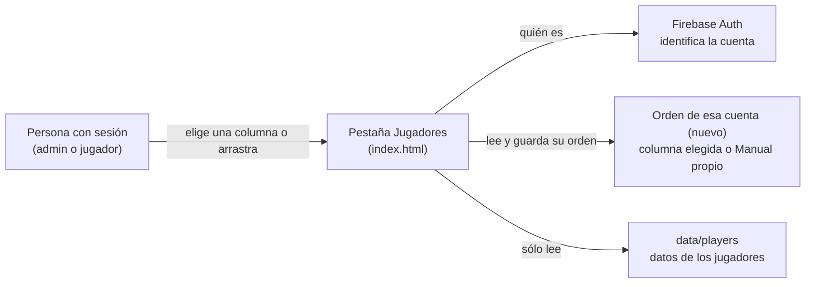

# Orden por columnas del listado de jugadores — Concept Note

> **Status:** Draft · **Date:** 2026-10-02 · **Owner:** Lucas Manoukian
>
> **Reviewers:** *pending*
>
> **Spec:** *not yet written* · **Implementation plan:** *not yet written*

## 1. TL;DR

Hoy el listado de la pestaña **Jugadores** se puede ordenar sólo por Manual, Puntaje o
Posición, desde un menú desplegable, y el orden elegido es **uno solo para todos**. Se
propone poder ordenar ascendente y descendente por seis de las siete columnas que la
pantalla ya muestra — **Posición, Jugador, PJ, Goles, Asistencias y Pts**; G E P queda
afuera (§14) —, tocando el título de la
columna desde 760px y desde el menú desplegable abajo de ese ancho, donde los títulos no
existen: cada ancho tiene un solo control, nunca los dos. La decisión que el lector debe conocer antes que ninguna otra:
el orden elegido pasa a ser **de cada cuenta**, guardado en la base y no en el navegador,
lo que **reemplaza** la persistencia compartida de `FR-051` de
[`ORDEN_JUGADORES_SPEC.md`](../orden-jugadores/ORDEN_JUGADORES_SPEC.md) y exige un
documento de Firestore **por cuenta**, direccionado por el `uid` de Firebase Auth, con su
regla nueva. El orden **Manual** también pasa a ser
**de cada cuenta**, admin o `jugador`, y deja de ser una opción que se elige: se entra a él
**arrastrando una fila**, cosa que cualquier cuenta puede hacer siempre, esté la lista
ordenada como esté. Al soltar, el orden de la lista tal como se ve, con la fila movida, pasa a
ser **su** orden Manual, y reemplaza el que tenía. Nadie cambia el orden de nadie: deja de existir un orden Manual
compartido (`FR-050`), y un `jugador` puede arrastrar (hoy no, `FR-013`).

## 2. Problem statement

La pantalla ya muestra, por jugador, partidos jugados, goles, asistencias y — para admin —
puntaje ([`index.html:2671-2680`](../../index.html#L2671-L2680)), pero no deja ordenar por
la mayoría de esos datos. El selector ofrece cinco modos: Manual, Puntaje ↑/↓ y
Posición ↑/↓ ([`index.html:1597`](../../index.html#L1597),
[`index.html:2625`](../../index.html#L2625)).

- **Pain 1 — no se puede responder "¿quién hizo más goles?" mirando la lista.** Para
  encontrar al goleador, al que más asistió o al que más partidos jugó hay que recorrer la
  lista entera a ojo. Con hasta ~500 jugadores por grupo (volumen esperado de
  [`AGENTS.md`](../../AGENTS.md) → Stack y persistencia) eso no es práctico.
- **Pain 2 — tampoco se puede ordenar por nombre.** El listado no tiene un orden
  alfabético seleccionable: el alfabético existe sólo como desempate interno de los otros
  modos ([`index.html:2563`](../../index.html#L2563)).
- **Pain 3 — el orden de uno cambia lo que ven todos.** El modo elegido se guarda en un
  único valor compartido, `data/playersSortMode`
  ([`index.html:2883-2887`](../../index.html#L2883-L2887), `FR-051` de la Spec vigente).
  Un admin que ordena por puntaje para consultar algo deja la lista así para todos los
  demás: admins y jugadores (lo lee cualquier sesión, [`index.html:2127`](../../index.html#L2127)). Ordenar para consultar es un gesto personal; hoy tiene efecto global.
- **Pain 4 — una cuenta `jugador` cree que guardó su orden y no lo guardó.** La interfaz
  le deja cambiar el selector, pero la regla de Firestore rechaza su escritura y el error
  se traga en silencio: al recargar, el orden volvió al que había
  ([`docs/rol-en-el-token/contracts/firestore-rules.md`](../rol-en-el-token/contracts/firestore-rules.md),
  §2.3 "Hallazgo C"). Ese contrato lo registró como limitación preexistente y dejó la
  decisión de cerrarla al producto: esta feature la toma.

## 3. Goals

- Cualquier cuenta puede ordenar el listado de Jugadores por toda columna ordenable que
  tiene permiso de ver (D-07), en los dos sentidos, en todos los anchos desde 360px.
- En pantalla ancha, el gesto es el que la gente ya conoce de cualquier tabla: tocar el
  título de la columna.
- El orden que cada persona eligió la acompaña: se mantiene al recargar y en cualquier
  dispositivo donde inicie sesión con su cuenta, sin afectar lo que ven los demás.
- Desaparece la escritura que hoy falla en silencio para la cuenta `jugador` (Pain 4).
- Reordenar a mano deja de requerir un paso previo y deja de ser sólo de admin: cualquier
  cuenta arrastra una fila en cualquier momento, sin elegir antes "Manual" en un menú, y lo
  que arma es su propio orden.

## 4. Non-goals

- No se ordena por más de una columna a la vez (orden primario + secundario elegible por
  el usuario). El desempate es siempre fijo: el alfabético existente.
- No se ocultan, agregan ni reacomodan columnas del listado: se ordena por las que ya están.
- No se cambia qué datos ve cada rol: Pts sigue siendo sólo de admin, y por lo tanto
  ordenar por Pts también.
- No se toca el orden de la cola de convocatoria de un partido (§7.8 de la Spec vigente).
- No se agrega una forma de armar el orden Manual sin arrastrar (teclado o lector de
  pantalla). Se conserva la limitación que ya acepta la Spec vigente (`A-05`, `NFR-006`),
  ahora extendida a la cuenta `jugador`. Ordenar por columna sí es operable con teclado (§6.5).

## 5. Vision / desired end state

Un admin abre Jugadores en la computadora y toca el título **Goles**: la lista se
reordena con el goleador arriba y una flecha al lado del título indica el sentido. Toca de
nuevo y se invierte. Cierra la pestaña; al día siguiente abre la app en el teléfono y la
lista sigue ordenada por goles. En el teléfono no hay fila de títulos, así que si quiere
cambiar el orden usa el menú desplegable que ya conoce, que ahora trae también Jugador,
PJ, Goles y Asistencias. Mientras tanto, otro admin sigue viendo la lista en su propio orden:
el del primero no lo alcanzó.

Más tarde, el primer admin quiere armar a mano el orden de la lista. No busca ninguna
opción "Manual": con la lista ordenada por goles, arrastra a un jugador dos lugares más
arriba. La flecha de Goles desaparece, porque la lista ya no está ordenada por goles, y ese
orden — el de goles con el jugador movido — queda como **su** orden Manual. Nadie más lo ve.
El orden que había armado a mano antes de tocar Goles se perdió con ese arrastre: no hay
forma de volver a él (D-04, R8).

Un jugador que entra a mirar las estadísticas ordena por Asistencias, y la próxima vez
que entra la encuentra igual — algo que hoy, para su cuenta, no funciona. Si después
quiere poner a sus amigos arriba, los arrastra: también él tiene su orden Manual.

Los jugadores que todavía no jugaron ningún partido no ensucian el principio de la lista
al ordenar por PJ, Goles o Asistencias: quedan siempre al final, en los dos sentidos.

### 5.1 System context diagram

### 5.2 Security posture (`MD-31`)

- **Feature exposure** — Entrada de cuentas autenticadas (`admin` y `jugador`): la elección
  de un criterio y un sentido de orden, y el orden Manual que arma arrastrando (una lista de
  jugadores). Una cuenta puede escribir en su propia preferencia cualquier valor, no sólo
  los que ofrece la interfaz, así que la app tiene que tratar lo que lee de ahí como no
  confiable: caer a Manual ante un criterio desconocido (hoy ya lo hace con
  `playersSortMode`, [`index.html:2127`](../../index.html#L2127)) e ignorar en el orden
  Manual cualquier jugador que no exista.
- **Lo que esta feature deliberadamente NO abre** — Que un `jugador` arrastre **no** le da
  permiso de escritura sobre `data/players`. Ese documento guarda todos los datos de todos
  los jugadores en un solo bloque: un único campo `value` con todo el plantel serializado
  como texto ([`index.html:2293`](../../index.html#L2293),
  [`index.html:1399`](../../index.html#L1399)). Las reglas no pueden mirar dentro de ese
  texto, así que se deduce que sólo pueden conceder escribirlo entero
  ([`firestore-rules.md`](../rol-en-el-token/contracts/firestore-rules.md), bloque
  `data/players`): abrirlo para guardar un orden habilitaría a cualquier `jugador` a
  editar o borrar jugadores. Por eso el orden Manual vive en el documento de cada cuenta (D-04).
- **Forma de la regla nueva** — El documento de cada cuenta se direcciona por el `uid` del
  token, y la regla exige `request.auth.uid` igual a ese `uid` para leer y para escribir.
  No se resuelve con una regla comodín dentro de `data/`, aunque `window.storage` hoy sólo
  opere sobre esa colección ([`index.html:1387-1403`](../../index.html#L1387-L1403)): el
  contrato vigente registra como propiedad que no hay ninguna regla catch-all
  (`firestore-rules.md` §2.3, Hallazgo B). Si la regla exige además un `rol` reconocido
  (como las demás escrituras para una cuenta sin claim, contrato §3) lo decide `OPEN-Q-13`.
- **Confidencialidad del orden guardado** — El orden Manual de un admin puede haberse armado
  a partir de la lista ordenada por Pts (D-04), y entonces codifica el ranking de puntajes.
  No son puntajes, pero sí información derivada: por eso la lectura es sólo del dueño, no
  sólo la escritura.
- **Valores inflados** — Una cuenta puede escribir en su propio documento un valor enorme
  (hasta el máximo de Firestore) y alargar su propio arranque. El daño queda en esa cuenta.
- **Data sensitivity** — Ninguna regulada. La preferencia es un dato de interfaz asociado a
  una cuenta. El único dato sensible cercano es el puntaje (Pts), que sigue sólo-admin: una
  cuenta `jugador` no recibe `playerScores`, así que no puede ordenar por Pts aunque su
  preferencia lo pida.
- **Deployment surface** — Página estática en GitHub Pages contra Firestore; la
  autorización la ponen las reglas de Firestore, que se publican a mano desde la consola
  ([`docs/rol-en-el-token/contracts/firestore-rules.md`](../rol-en-el-token/contracts/firestore-rules.md), línea 19).

Categorías que la Spec §4.5 debe tratar como mínimo: **falta de autorización** (que una
cuenta lea o escriba la preferencia de otra, o que el arrastre de un `jugador` escriba
`data/players`) y **validación de entrada** (valor desconocido en la preferencia). La
autorización del orden cambia de lugar: hoy la pone el `isAdmin()` del cliente (`TC-040` de
la Spec vigente); pasa a ponerla la regla de Firestore por `uid`, y el `isAdmin()` sigue
gobernando `data/players`. `[UNVERIFIED — el número y la vigencia de esas categorías
en el CWE Top 25 se consultan en vivo al escribir la Spec, según el protocolo de MD-31]`

## 6. Context & background

- **Existing system** — El listado se arma filtrando, buscando y después ordenando con un
  único comparador, `sortRoster`, que resuelve los cinco modos actuales
  ([`index.html:2575-2601`](../../index.html#L2575-L2601),
  [`index.html:2622`](../../index.html#L2622)). El modo activo vive en
  `playersSortMode`, leído al arrancar por cualquier cuenta y escrito por el selector
  ([`index.html:2127`](../../index.html#L2127), [`index.html:2883`](../../index.html#L2883)).
  La fila de títulos sólo aparece desde 760px y hoy está marcada `aria-hidden`, o sea que
  no es interactiva ni la anuncia un lector de pantalla
  ([`index.html:223-233`](../../index.html#L223-L233),
  [`index.html:2671-2680`](../../index.html#L2671-L2680)). Cada cuenta es personal y está
  vinculada a un jugador (`D-02` de
  [`ROL_EN_EL_TOKEN_CONCEPT.md`](../rol-en-el-token/ROL_EN_EL_TOKEN_CONCEPT.md)), de lo
  que se deduce que "la preferencia de cada cuenta" equivale a "la preferencia de cada
  persona".
- **Related work** — [`ORDEN_JUGADORES_SPEC.md`](../orden-jugadores/ORDEN_JUGADORES_SPEC.md)
  es la Spec vigente del orden del listado (sin Concept Note). Esta feature modifica parte
  de ella; la Spec de esta feature deberá declarar el reemplazo y marcarlo allá (regla de
  [`AGENTS.md`](../../AGENTS.md) → "Dónde vive la fuente de verdad"). Partes previstas:
  - `FR-001` y `FR-002` — las opciones del selector (se amplían con Jugador, PJ, Goles,
    Asistencias; Puntaje pasa a llamarse como su columna, Pts; **Manual deja de ser una
    opción**).
  - `FR-003` — el cambio de criterio deja de venir sólo del selector: también del título.
  - `FR-051` — la persistencia **compartida** del modo pasa a ser **por cuenta**.
  - `FR-052` — el respaldo a Manual para un no-admin con Pts se conserva, pero aplicado a
    su propia preferencia y no a un valor global.
  - `FR-020`–`FR-022` y `FR-030`–`FR-031` se conservan y se generalizan a las columnas nuevas.
  - `FR-010` y `FR-012` — el arrastre deja de depender de que Manual esté activo: se
    puede arrastrar con cualquier orden.
  - `FR-013` — el arrastre deja de ser sólo de admin: cualquier cuenta arrastra.
  - `FR-011` y `FR-050` — soltar una fila escribe el orden Manual **de esa cuenta**, a
    partir de la lista visible, en su propio documento; ya no el `orden` compartido de
    `data/players`. Deja a esa cuenta en Manual.
  - `FR-053` — el aviso y la reversión ante una falla al guardar se conservan, aplicados
    al documento de la cuenta.
  - `FR-060`–`FR-061` — la migración del `orden` y el `orden` de un jugador nuevo quedan
    sin propósito si el `orden` compartido se retira (`OPEN-Q-04`); dónde aparece un
    jugador nuevo en el orden Manual de cada cuenta lo define `OPEN-Q-11`.
  - **No** se tocan `FR-040` (filtros) ni §7.8 (convocatoria). `FR-041` se conserva, pero
    su combinación con un orden por columna queda abierta (`OPEN-Q-09`).

  Además de los `FR-*`, D-03, D-04 y D-07 vuelven falsas estas piezas de la Spec vigente,
  que la Spec nueva también reemplaza y marca:

  | Pieza de la Spec vigente | Qué deja de ser cierto | Qué la reemplaza |
  |---|---|---|
  | `TC-040` (seguridad, defiende `CWE-862`) | Toda mutación del orden pasa por `isAdmin()` | La autorización del orden de cada cuenta la pone una regla de Firestore por `uid` (§5.2); `isAdmin()` sigue gobernando `data/players` |
  | `TC-030` | Todo handler de arrastre y de cambio de orden empieza con `if(!isAdmin()) return;` | El arrastre y el cambio de orden son de cualquier cuenta (D-04) |
  | `TC-013` | `playersSortMode` se lee en toda sesión porque gobierna la vista | El valor global deja de gobernar la vista (D-03; destino en `OPEN-Q-04`) |
  | `TC-031` | Migración única del `orden` | Depende de `OPEN-Q-04`, igual que `FR-060` |
  | §3.2, non-goal "per-user … ordering preferences" | No hay preferencias de orden por usuario | Esta feature es exactamente eso (D-03) |
  | `A-02`, `A-03`, `A-04` | Arrastre sólo en Manual; orden compartido; arrastre sólo admin | D-04, D-03 |
  | `US-01`, `US-04`, `US-05` | Arrastre de admin; mismo orden para todos los admins; el `jugador` ante el modo global | D-04, D-03, D-07 |
  | `S-01`, `S-01d`, `S-04` (con `S-04a`), `S-05`, `S-05a` | Orden compartido, last-write-wins entre admins, volver a seleccionar Manual, arrastre rechazado a un no-admin | D-03, D-04 (y R8: ya no se vuelve al Manual anterior) |
  | `AC-16`, `AC-20` | Verifican `TC-040` y `S-05a` | Los criterios de aceptación de la Spec nueva para la regla por `uid` |
  | §10.1 (entidades `orden` y `playersSortMode`), §6 Glosario ("Modo de orden", "Orden manual") | Definiciones del modelo compartido | §8.2 de este documento |
  | `A-05`, `NFR-006` | — se conservan | Su alcance se extiende a la cuenta `jugador` (§4) |
  - Además, la tabla de acceso del contrato de reglas cambia: `data/playersSortMode` deja
    de usarse y aparece un documento por cuenta, direccionado por `uid` (ver `OPEN-Q-04`,
    `OPEN-Q-05`). La regla
    de `data/players` **no** cambia: sigue escribiéndola sólo admin.
- **Organisational context** — Pedido directo del propietario el 2026-10-02. **No
  figuraba en [`Roadmap.md`](../../Roadmap.md) al empezar** (buscado por "orden",
  "column" y "sort": sin coincidencias), así que no hay idea que retirar. La única
  coincidencia actual es el diferido de G E P que esta misma feature agregó (§14). La idea "Ranking de jugadores" del
  Roadmap (§3, Estadísticas e historial) es vecina pero distinta — un ranking es una
  vista propia, no el orden de este listado — y queda donde está.

### 6.5 Sources & Origins (`MD-25`)

**Codebase evidence**

- `index.html:1597` — `ORDEN_MODOS`: los cinco modos actuales; es el conjunto cerrado que
  hoy valida lo leído de la base.
- `index.html:2563` — `alfabetico`: compara por apellido+nombre, mientras que el nombre se
  muestra nombre+apellido (`index.html:1858`). Origen de `OPEN-Q-02`.
- `index.html:2568-2571` — `effectiveSortMode`: respaldo a Manual para no-admin con
  Puntaje (`FR-052`), que esta feature conserva.
- `index.html:2575-2601` — `sortRoster`: comparador único con desempate alfabético y
  "sin dato al final" para Puntaje (`FR-021`); el patrón que se generaliza a PJ, Goles y
  Asistencias (`D-05`).
- `index.html:2671-2680` — fila de títulos: Posición no tiene rótulo (celda vacía sobre
  el badge, `index.html:2673`), Pts sólo para admin, todo `aria-hidden`. Origen de `D-09`.
- `index.html:227-231` — la columna de Posición mide 34px, el ancho del badge
  (`index.html:209`); los títulos van en mayúscula, tipografía mono de 10px. Origen del
  límite de espacio de `D-09`.
- `index.html:2687-2703` — un jugador que nunca jugó muestra "—" en PJ y celdas vacías en
  el resto (`partidosJugados` falsy): es el caso de `D-05`.
- `index.html:223-233` — la fila de títulos existe sólo desde 760px; abajo el renglón es
  apilado. Origen de `D-02` (los títulos no alcanzan en celular).
- `index.html:1399` y `index.html:2293` — `data/players` es un único campo `value` con el
  plantel entero serializado: origen de la premisa de §5.2 de que su regla no puede
  conceder escribir sólo el orden.
- `index.html:1387-1403` — `window.storage`: la interfaz simple de guardar/leer, hoy
  sobre claves fijas de la colección `data`. Una preferencia por cuenta no entra en una
  clave fija: origen de `OPEN-Q-05`.
- `index.html:2088-2093` — `iniciarLecturas`: todas las lecturas del arranque salen
  juntas; una lectura nueva tiene que sumarse ahí para no alargar el arranque (riesgo R3).
  La misma lista de documentos se repite en `loadAll` (`index.html:2107`) y en
  `tests/sesion.test.js:264-271`.
- `index.html:2883-2887` — el selector escribe `playersSortMode` y traga el error.
- `docs/rol-en-el-token/contracts/firestore-rules.md` §2.3 — Hallazgo C (Pain 4) y el
  precedente de un documento nuevo agregado sin su bloque en el contrato (riesgo R1).
- `tests/reglas.test.js:286-295` — la tabla de acceso por documento que verifica las
  reglas contra staging; un documento nuevo tiene que entrar ahí.
- `tests/sesion.test.js:264-271` — fija qué documentos se piden al arrancar; cambia si
  `playersSortMode` se retira.

**Industry-standard evidence**

- *Regulatory:* WCAG 2.1 AA aplica a los títulos que pasan a ser interactivos. El patrón
  de referencia es el de WAI-ARIA APG, *Sortable Table*
  (https://www.w3.org/WAI/ARIA/apg/patterns/table/examples/sortable-table/, consultado el
  2026-10-02): el texto del título va dentro de un `button`, y `aria-sort`
  (`ascending`/`descending`) va **sólo en la columna ordenada**, moviéndose cuando cambia.
- *Architectural:* sin estándares arquitectónicos aplicables más allá de las convenciones
  del proyecto.
- *Style / project convention:* [`AGENTS.md`](../../AGENTS.md) — persistencia sólo en
  Firestore, nunca localStorage como fuente de datos (descarta la Alternativa D);
  separación interfaz / persistencia; responsive desde 360px medido con
  `tests/layout.test.js`; design system como fuente de UI. El design system no tiene un
  componente de tabla ordenable: `DataTable` no ordena
  (`.claude/skills/football-app-design/components/data/DataTable.jsx`) y los íconos
  salen de Lucide vía `Icon` (`.claude/skills/football-app-design/readme.md`,
  Iconografía). El indicador de sentido se resuelve en el Plan con esos dos.

**Prior-art evidence**

- [`ORDEN_JUGADORES_SPEC.md`](../orden-jugadores/ORDEN_JUGADORES_SPEC.md) — la solución
  actual: selector único, persistencia compartida. Esta Concept Note parte de ella.
- Patrón universal de tablas ordenables (planillas de cálculo, tablas de estadísticas
  deportivas): tocar el título ordena, tocar de nuevo invierte, una flecha indica el
  sentido. `[UNVERIFIED — conocimiento general, no se relevó un producto concreto]`

## 7. Research & industry context

### 7.1 How established products handle this

El gesto de "tocar el título para ordenar, tocar otra vez para invertir" es el estándar de
facto en tablas, y la guía WAI-ARIA APG lo formaliza (ver §6.5). En pantallas angostas, donde
una tabla no entra, los productos suelen reemplazar los títulos por un control "Ordenar por"
aparte. `[UNVERIFIED — observación general, no relevada sobre productos concretos]` La
pantalla de Jugadores ya sigue ese modelo de dos bandas: columnas desde 760px, apilado abajo.

### 7.2 Relevant prior art / papers / standards

- WAI-ARIA APG *Sortable Table* — `button` dentro del título; `aria-sort` en una sola
  columna a la vez.

### 7.3 Proofs of concept

No se hizo ninguna. El orden es local (≤500 jugadores, en memoria) y el comparador ya
existe; lo nuevo y con riesgo es la persistencia por cuenta, que se valida en la Spec/Plan
contra las reglas de staging con `tests/reglas.test.js`.

## 8. Proposed direction

### 8.1 Approach

**Un solo estado de orden, un control por ancho.** El estado es un par *criterio +
sentido*, donde criterio es Manual o una de las seis columnas. Desde 760px se cambia con los
títulos de columna; abajo de 760px, con el menú desplegable. Nunca se muestran los dos a la
vez, porque harían lo mismo. Los dos leen y escriben ese mismo estado, así que si la ventana
cruza el corte, el orden elegido se conserva y el control que aparece lo refleja. Ninguno
de los dos ofrece Manual: a Manual se entra arrastrando (D-04).

**Las columnas nuevas reusan la lógica que ya existe.** Posición y Pts ya están resueltos
(`FR-030`/`FR-020`). Jugador ordena alfabéticamente (`OPEN-Q-02` define por qué campo). PJ,
Goles y Asistencias ordenan por su número, con el jugador que nunca jugó siempre al final,
igual que hoy queda al final el jugador sin puntaje. Todo empate se desempata con el orden
alfabético existente.

**La preferencia se guarda por cuenta, en la base.** Cada cuenta tiene su propia
preferencia, que sólo ella lee y escribe. Si una cuenta no tiene preferencia guardada, ve
Manual. Si su preferencia es inválida o no aplica a su rol (Pts para un `jugador`), ve
Manual, sin error visible y sin pisar lo guardado. El valor compartido
`data/playersSortMode` deja de gobernar lo que ve cada uno.

**Manual es un estado, no una opción, y es de cada cuenta.** Ni el menú ni los títulos
ofrecen "Manual". Una cuenta está en Manual cuando nunca eligió una columna, o cuando su
preferencia no se puede aplicar (D-07), o justo después de arrastrar. Cualquier cuenta,
admin o `jugador`, puede arrastrar con cualquier orden activo. Al soltar, el orden de la
lista tal como se ve, con la fila movida, se guarda como **su** orden Manual, en su propio
documento, reemplazando el que tenía, y su preferencia pasa a Manual. Qué pasa con los
jugadores que una búsqueda o un filtro ocultan en ese momento lo define `OPEN-Q-09`. Elegir
una columna deja el orden Manual anterior sin camino de vuelta: no hay control que lo
ofrezca, y el siguiente arrastre lo reemplaza (R8, aceptado). Qué muestra el menú del
celular mientras la cuenta está en Manual lo define `OPEN-Q-12`. No toca lo que ven las demás cuentas ni escribe
`data/players`. Una cuenta que nunca arrastró parte de un orden Manual inicial que define
`OPEN-Q-10`.

### 8.2 Information / data model sketch

- **Preferencia de orden (nuevo).** Un documento por cuenta, direccionado por el `uid` de
  Firebase Auth. Contiene el criterio y el sentido elegidos, y el orden Manual propio de
  esa cuenta (la secuencia de jugadores que armó arrastrando). El orden Manual sólo se
  muestra mientras la cuenta está en Manual; elegir una columna lo deja sin uso hasta que
  el siguiente arrastre lo reemplaza (D-04). Pertenece a la cuenta, no a un jugador ni al grupo. Se crea la primera vez
  que la cuenta cambia el orden o arrastra; no tiene vencimiento. Con ~500 jugadores, el
  orden Manual es una lista de hasta ~500 identificadores por cuenta.
- **Modo de orden compartido (`data/playersSortMode`, existente).** Deja de usarse
  (`OPEN-Q-04` define si se retira y qué se hace con su valor actual).
- **Orden manual compartido (`orden` en cada jugador de `data/players`, existente).** Deja
  de escribirse: ningún arrastre lo toca. Si sirve como punto de partida del orden Manual de
  cada cuenta o se retira lo definen `OPEN-Q-04` y `OPEN-Q-10`.

## 9. Alternatives considered

### 9.1 Alternative A — Títulos + menú, preferencia por cuenta en Firestore

- **Description:** la de §8.
- **Pros:** gesto conocido en pantalla ancha; funciona en celular; el orden acompaña a la
  persona entre dispositivos; resuelve Pain 3 y Pain 4.
- **Cons:** la opción más trabajosa: documento y regla de Firestore nuevos, una lectura más
  al arrancar, títulos que pasan a ser interactivos y accesibles.
- **Decision:** Selected — elección del propietario el 2026-10-02.

### 9.2 Alternative B — Sólo ampliar el menú desplegable

- **Description:** agregar las opciones nuevas al selector actual, sin tocar los títulos.
  Asume la misma persistencia por cuenta que A: lo único que la distingue de A son los
  títulos interactivos. (C es la variante que conserva la persistencia compartida.)
- **Pros:** el cambio de interfaz más chico; igual en todos los anchos.
- **Cons:** en pantalla ancha los títulos están ahí y no responden, contra lo que la gente
  espera de una tabla.
- **Decision:** Rejected — el propietario eligió títulos + menú.

### 9.3 Alternative C — Mantener el orden compartido

- **Description:** las columnas nuevas, pero el modo sigue siendo uno para todos.
- **Pros:** sin documento ni regla nuevos.
- **Cons:** deja Pain 3 y Pain 4 como están; ordenar para consultar sigue alterando la
  vista de los demás.
- **Decision:** Rejected — el propietario eligió orden por persona.

### 9.4 Alternative D — Preferencia por persona en el navegador

- **Description:** guardar el orden en localStorage del dispositivo.
- **Pros:** sin cambios en Firestore ni en las reglas.
- **Cons:** no acompaña a la persona a otro dispositivo; [`AGENTS.md`](../../AGENTS.md)
  prohíbe localStorage como fuente de datos y habría que justificar la excepción.
- **Decision:** Rejected — el propietario eligió guardarlo en la cuenta.

### 9.5 Alternative E — Preferencia por persona sólo mientras la página está abierta

- **Description:** el orden vive en memoria y al recargar vuelve a Manual.
- **Pros:** la más simple: no guarda nada.
- **Cons:** la persona tiene que volver a elegir el orden cada vez que entra.
- **Decision:** Rejected — el propietario quiere que el orden se recuerde.

### 9.6 Alternative F — Orden Manual compartido, que cambia con el arrastre de cualquiera

- **Description:** un solo orden Manual para el grupo, que cualquier cuenta (incluida
  `jugador`) puede reordenar.
- **Pros:** un orden común que todos ven igual.
- **Cons:** el arrastre de una persona pisa el orden que armó otra, sin forma de
  recuperarlo. Además, guardarlo donde está hoy obliga a abrir la escritura de
  `data/players` a la cuenta `jugador` (§5.2), así que habría que moverlo a un documento
  propio.
- **Decision:** Rejected — el propietario eligió un orden Manual por cuenta (2026-10-02).
  Antes había elegido que el arrastre de un admin reemplazara el orden de todos; esa
  elección quedó reemplazada al habilitar el arrastre para `jugador`.

### 9.7 Alternative G — "Mi orden" como opción para volver al orden Manual propio

- **Description:** además de entrar a Manual arrastrando, ofrecer "Mi orden" en el menú del
  celular y un control en la fila de títulos, que muestren el último orden Manual que la
  cuenta armó.
- **Pros:** tocar una columna para consultar no hace perder el orden armado a mano.
- **Cons:** un control más en cada ancho; vuelve a existir "Manual" como opción, que D-04
  sacó a propósito.
- **Decision:** Rejected — el propietario aceptó perder el orden Manual anterior
  (2026-10-02, a partir del hallazgo 4 de la crítica del mismo día). Ver R8.

### 9.8 Comparison summary

| Dimensión | A (elegida) | B | C | D | E | F | G |
|---|---|---|---|---|---|---|---|
| Títulos interactivos | Sí | No | Sí | Sí | Sí | Sí | Sí |
| Orden por persona | Sí | Sí | No | Sí | Sí | No (Manual común) | Sí |
| Se recuerda al recargar | Sí | Sí | Sí | Sí | No | Sí | Sí |
| Sigue entre dispositivos | Sí | Sí | Sí (global) | No | No | Sí (global) | Sí |
| Se puede volver al Manual anterior | No | No | — | No | No | — | Sí |
| Cambia reglas de Firestore | Sí | Sí | No | No | No | Sí | Sí |

## 10. Key decisions

| ID | Decision | Rationale | Reversibility |
|---|---|---|---|
| D-01 | Los criterios que se eligen son las seis columnas visibles (Manual no se elige, ver D-04): Posición, Jugador, PJ, Goles, Asistencias y Pts; cada columna en sentido ascendente y descendente. Pts es el mismo dato que hoy se llama "Puntaje". | Es exactamente lo pedido; Pts y Puntaje son el mismo promedio (`computeAvg`, [`index.html:2683`](../../index.html#L2683)), así que no se mantienen dos nombres | Easy |
| D-02 | El orden se cambia tocando el título de la columna **desde 760px**, y desde el menú desplegable **sólo abajo de 760px**. Nunca se muestran los dos a la vez. Los dos muestran y cambian el mismo estado. | Abajo de 760px no hay fila de títulos ([`index.html:223`](../../index.html#L223)), así que los títulos solos dejarían sin control al celular. Donde la tabla tiene títulos, el menú sería redundante (decisión del propietario, 2026-10-02). Ningún control ofrece Manual: a Manual se entra arrastrando, y se entra a un orden Manual nuevo, no al anterior (D-04) | Easy |
| D-03 | El orden elegido — la columna y el sentido, y también el orden Manual (D-04) — es **por cuenta** y se guarda en Firestore, en un documento por cuenta, direccionado por el `uid` de Firebase Auth, que sólo esa cuenta lee y escribe. Reemplaza la persistencia compartida de `FR-051` y `FR-050`. | Elección del propietario: el orden tiene que seguir a la persona entre recargas y dispositivos sin afectar a los demás; además elimina la escritura que hoy falla para `jugador` | Hard — agrega un documento y una regla publicados en dos proyectos |
| D-04 | El orden Manual es **de cada cuenta** y es lo que ve una cuenta sin preferencia guardada. **No es una opción** del menú ni de los títulos: se entra a él sólo arrastrando. **Cualquier cuenta**, admin o `jugador`, puede arrastrar con cualquier orden activo. Al soltar, el orden de la lista tal como se ve, con la fila movida, pasa a ser su orden Manual y reemplaza el anterior; su preferencia pasa a Manual. Ningún arrastre cambia lo que ven otras cuentas ni escribe `data/players`. **Consecuencia aceptada:** elegir una columna deja el orden Manual anterior sin camino de vuelta, y el siguiente arrastre lo reemplaza (R8). No hay confirmación ni "deshacer" (R9). | Elección del propietario (2026-10-02): reordenar a mano es una acción implícita, no un modo que haya que activar, y es para todos. Que cada cuenta tenga el suyo evita que un arrastre pise el orden de otro, y evita abrir la escritura de `data/players` a `jugador` (§5.2). El propietario aceptó, además, que no haya camino de vuelta al orden Manual anterior (Alternativa G, rechazada) ni forma de deshacer un arrastre | Hard — deja de existir un orden Manual común para el grupo |
| D-05 | Al ordenar por PJ, Goles o Asistencias, el jugador que nunca jugó un partido finalizado va **siempre al final**, en los dos sentidos. | Elección del propietario; es la misma regla que hoy rige para el jugador sin puntaje (`FR-021`) | Easy |
| D-06 | Todo empate se desempata con el orden alfabético existente. | Ya es la regla de los modos actuales (`FR-022`, `FR-031`); un desempate fijo hace el orden estable y predecible | Easy |
| D-07 | Cada cuenta puede ordenar por toda columna que tiene permiso de ver: un admin, por las seis; un `jugador`, por Posición, Jugador, PJ, Goles y Asistencias. Ordenar por Pts sigue siendo sólo de admin, y a un `jugador` no se le ofrece ni en el menú ni como título. Dos casos caen a Manual, sin error y sin modificar lo guardado: (a) la preferencia es Pts y la cuenta ya no es admin — sólo pasa si a una cuenta se le baja el rol; (b) la preferencia tiene un valor desconocido — sólo pasa por una escritura que no hizo la interfaz (§5.2). | Un no-admin no recibe los puntajes y no puede calcular ese orden (conserva `FR-052`); lo leído de la base no es confiable (§5.2) | Easy |
| D-08 | El orden se aplica sobre el resultado de la búsqueda y los filtros, como hoy. | Conserva `FR-040`; no hay motivo para cambiarlo | Easy |
| D-09 | El título de la columna de posición es **"Pos"** (hoy esa celda está vacía), y el de asistencias pasa de "Asist." a **"Asist"**, sin punto. Las abreviaturas de la fila de títulos van sin punto: Pos, PJ, Asist, Pts. | Decisión del propietario (2026-10-02). Para ordenar tocando el título hace falta un título; "Posición" no entra en una columna de 34px. "Asist." era la única abreviatura con punto; se le saca para que quede consistente. Es el único lugar de la app con ese texto ([`index.html:2678`](../../index.html#L2678)). Si "Pos" entra junto con la flecha de sentido se mide en el Plan (R2) | Easy |

## 11. Risks

| Risk | Severity | Likelihood | Mitigation idea |
|---|---|---|---|
| R1 — El documento nuevo se publica sin su bloque en el contrato de reglas, o el contrato sin publicar en las dos consolas. Ya pasó con `playersSortMode` (contrato de reglas §2.3). | High | Med | Bloque nuevo en [`firestore-rules.md`](../rol-en-el-token/contracts/firestore-rules.md) en la misma rama; fila nueva en `tests/reglas.test.js` que verifique que una cuenta no puede leer ni escribir la preferencia de otra, y que `jugador` sigue sin poder escribir `data/players`; publicar en staging y producción como paso explícito del Plan |
| R2 — Los títulos interactivos rompen accesibilidad o el layout: hoy son `aria-hidden` y entran justos en la grilla. El caso más ajustado es "Pos" (D-09) más la flecha de sentido, en una columna de 34px. | Med | Med | Patrón WAI-ARIA APG (§6.5); escenario nuevo en `tests/layout.test.js` en 760px de los dos lados del corte, visto fallar antes del arreglo. Si "Pos" con flecha no entra, el Plan resuelve el ancho de la columna o la ubicación de la flecha |
| R3 — La lectura de la preferencia alarga el arranque, que ya se midió como sensible (~620 ms de mediana, Roadmap §3). | Med | Low | Sumarla a las lecturas en paralelo, en los tres lugares donde se repite la lista de documentos (`iniciarLecturas`, `loadAll`, `tests/sesion.test.js`); medir el arranque antes y después con `tools/medir-arranque.js` contra el umbral de `OPEN-Q-14` |
| R4 — Una falla al guardar la preferencia vuelve a ser silenciosa, como hoy. | Low | Med | `OPEN-Q-07` decide si se avisa |
| R5 — Confusión al ordenar por Jugador si el criterio es apellido y la pantalla muestra nombre primero. | Low | Med | `OPEN-Q-02` |
| R6 — Para dar el arrastre a `jugador` se abre la escritura de `data/players`, y con ella la posibilidad de editar o borrar jugadores. | High | Low | Excluido por D-04: el orden Manual vive en el documento de cada cuenta. La regla de `data/players` no cambia, y R1 agrega la verificación |
| R7 — El orden Manual de una cuenta queda desactualizado: jugadores nuevos que no figuran en él, o borrados que sí. | Low | High | Borrados: se ignoran (§5.2). Nuevos: `OPEN-Q-11` |
| R8 — Una cuenta arma su orden Manual, toca una columna para consultar y pierde ese orden: no puede volver a él, y el siguiente arrastre lo reemplaza. | Med | High | **Aceptado por el propietario** (D-04, 2026-10-02; Alternativa G rechazada). La Spec lo declara como comportamiento, para que no se lo tome por un error |
| R9 — Un arrastre sin querer cambia el orden: como toda fila es arrastrable siempre, un solo soltado descarta el orden por columna elegido y reemplaza el Manual. | Med | Med | **Aceptado por el propietario** (D-04, 2026-10-02): sin confirmación ni "deshacer" |
| R10 — El arrastre en pantalla táctil, ahora la única entrada a Manual y también para `jugador`, que mira sobre todo desde el teléfono. | Low | Low | El arrastre nativo de equipos se verificó a mano en iOS y Android el 2026-08-27 ([`Roadmap.md`](../../Roadmap.md) §3, Mejoras de UX); la Spec vigente lo registra como limitación aceptada. `[UNVERIFIED — no se probó el arrastre del listado en un teléfono]` |
| R11 — Una misma cuenta abierta en dos dispositivos: gana la última escritura, que reescribe la lista entera. | Low | Low | Aceptable: el daño queda en esa cuenta |

## 12. Success signals

- Un admin y un jugador pueden encontrar al goleador, al máximo asistidor y al que más
  partidos jugó en un toque, sin recorrer la lista.
- Cambiar el orden en una cuenta no cambia lo que ve otra cuenta (verificable con las dos
  cuentas de staging).
- Una cuenta `jugador` recarga y encuentra el orden que eligió (hoy no pasa).
- Una cuenta `jugador` arrastra una fila, recarga y la encuentra donde la dejó, sin que
  ninguna otra cuenta vea el cambio.
- El arranque no se alarga más allá del umbral que fije `OPEN-Q-14`, medido antes y
  después con `tools/medir-arranque.js` (línea de base: ~620 ms de mediana, Roadmap §3).

## 13. Dependencies & stakeholders

### 13.1 Dependencies

- **Services / vendors:** Cloud Firestore (documento y regla nuevos), Firebase Auth (la
  identidad de la cuenta que da dueño a la preferencia). Ambos ya en uso.
- **Upstream specs / RFCs:** [`ORDEN_JUGADORES_SPEC.md`](../orden-jugadores/ORDEN_JUGADORES_SPEC.md)
  (se reemplaza en parte, §6); [`DESGLOSE_POSICIONES_SPEC.md`](../desglose-posiciones/DESGLOSE_POSICIONES_SPEC.md)
  (`FR-003`/`FR-032`: secuencia del orden por posición, se conserva);
  [`firestore-rules.md`](../rol-en-el-token/contracts/firestore-rules.md) (contrato de reglas vigente).
- **Downstream consumers:** ninguno fuera de la propia pantalla.

### 13.2 Stakeholders

- **Owning team:** Lucas Manoukian (propietario del producto).
- **Reviewing teams:** *pending*.
- **Customers / partners:** las cuentas `admin` y `jugador` del grupo.

## 14. Out of scope / deferred

- Ordenar por la columna **G E P** (ganados, empatados, perdidos) — *diferido*: no se
  pidió, y no es una sola cifra, así que primero hay que decidir por cuál de las tres se
  ordenaría. Vuelve si alguien lo pide; se agregó a [`Roadmap.md`](../../Roadmap.md) §3.

## 15. Open questions

| ID | Question | Owner | Target stage | Notes |
|---|---|---|---|---|
| OPEN-Q-01 | Al tocar por primera vez una columna, ¿en qué sentido ordena? ¿Igual para todas, o "lo más alto primero" en PJ, Goles, Asistencias y Pts, y A→Z en Jugador? | Lucas Manoukian | Spec | Afecta también qué opción del menú aparece primero |
| OPEN-Q-02 | Ordenar por Jugador, ¿es por apellido+nombre (el alfabético existente) o por el nombre tal como se muestra (nombre+apellido)? | Lucas Manoukian | Spec | `index.html:2563` contra `index.html:1858`; el apellido es opcional |
| OPEN-Q-03 | En pantalla ancha, ¿el menú desplegable sigue visible junto a los títulos, o sólo aparece abajo de 760px? | Lucas Manoukian | — | **Resuelta el 2026-10-02 en `D-02`:** el menú sólo aparece abajo de 760px. La consecuencia (cómo volver a Manual en pantalla ancha) pasa a `OPEN-Q-06` |
| OPEN-Q-04 | ¿Qué pasa con `data/playersSortMode` y con el `orden` compartido de `data/players`, que ya nadie escribe? ¿Se retiran (documento, regla, lectura al arrancar, migración de `FR-060`), o alguno se usa como punto de partida? | Lucas Manoukian | Spec | Simplicidad ante todo sugiere retirarlos; depende de `OPEN-Q-10` |
| OPEN-Q-05 | ¿Cómo entra el documento por cuenta en la interfaz simple de guardar/leer, que hoy usa claves fijas de `data`? | — | Plan | Que es un documento por cuenta, direccionado por `uid` y sin regla comodín, ya está fijado (D-03, §5.2): eso es de seguridad y no del Plan. Al Plan le queda sólo el cómo, sin que el resto del código conozca el detalle |
| OPEN-Q-06 | En pantalla ancha, sin menú, ¿cómo se vuelve a Manual? Por ejemplo: un tercer toque sobre el título activo (↑, ↓, Manual), o un control propio de Manual en la fila de títulos. | Lucas Manoukian | — | **Resuelta el 2026-10-02 en `D-04`:** Manual no se elige; se entra arrastrando, y el arrastre está disponible con cualquier orden. Se entra a un orden Manual nuevo, no al anterior (R8). Tocar de nuevo el título activo sólo invierte el sentido. La consecuencia para la cuenta `jugador` pasa a `OPEN-Q-08` |
| OPEN-Q-07 | Si falla guardar el cambio de columna, ¿se avisa a la persona o se sigue en silencio? | Lucas Manoukian | Spec | Ver R4; hoy es silencioso. Sólo el cambio de columna: una falla al guardar un arrastre ya avisa y revierte (`FR-053` se conserva, §6) |
| OPEN-Q-08 | Una cuenta `jugador` no puede arrastrar (`FR-013`). Por D-04, una vez que elige una columna ya no puede volver a ver el orden Manual. ¿Es aceptable? | Lucas Manoukian | — | **Resuelta el 2026-10-02 en `D-04`:** el `jugador` también arrastra, así que entra a Manual igual que un admin: a un orden Manual nuevo, no al anterior (R8) |
| OPEN-Q-09 | Si una cuenta arrastra con la lista ordenada por una columna **y** con una búsqueda o un filtro activos, ¿dónde quedan, en su orden Manual, los jugadores que no se ven? `FR-041` hoy los deja en su orden relativo anterior, pero los visibles pasan a estar en el orden de la columna. | Lucas Manoukian | Spec | Combinación nueva que crea D-04 |
| OPEN-Q-10 | Una cuenta que nunca arrastró, ¿desde qué orden Manual parte? Por ejemplo: el `orden` compartido que existe hoy, congelado; o el alfabético. | Lucas Manoukian | Spec | Es lo que ve cualquier cuenta nueva y cualquier cuenta existente el día del cambio. Ligada a `OPEN-Q-04` |
| OPEN-Q-11 | Un jugador agregado al plantel después de que una cuenta armó su orden Manual, ¿dónde aparece en ese orden? Por ejemplo: al final, o al principio para que se note. | Lucas Manoukian | Spec | Hoy `FR-061` lo pone al final del orden compartido |
| OPEN-Q-12 | Abajo de 760px, mientras la cuenta está en Manual, ¿qué muestra el menú desplegable, si Manual no es una de sus opciones? Por ejemplo: un texto "Orden manual" que no se puede elegir. | Lucas Manoukian | Spec | Consecuencia de D-02 y D-04 |
| OPEN-Q-13 | La regla del documento por cuenta, ¿exige sólo que sea la propia cuenta (`uid`), o además un `rol` reconocido, como las demás escrituras? | Lucas Manoukian | Spec | Contrato de reglas §3, "Cuenta sin claim". Es la misma decisión fail-closed de `rol-en-el-token`; va a `TC-*` de §4.5 |
| OPEN-Q-14 | ¿Cuántos milisegundos puede subir, como máximo, la mediana del arranque? | Lucas Manoukian | Spec | Línea de base ~620 ms (Roadmap §3); se mide con `tools/medir-arranque.js`. Es el número que le falta a la señal de éxito de §12 |

## 16. Handoff to the Spec

- **Settled (do not relitigate):** D-01, D-02, D-03, D-04, D-05, D-06, D-07, D-08, D-09.
- **Decide in Spec:** OPEN-Q-01, OPEN-Q-02, OPEN-Q-04, OPEN-Q-07, OPEN-Q-09, OPEN-Q-10,
  OPEN-Q-11, OPEN-Q-12, OPEN-Q-13, OPEN-Q-14. OPEN-Q-03 quedó resuelta en D-02; OPEN-Q-06
  y OPEN-Q-08, en D-04. OPEN-Q-05 pasa al Plan.
- **Alcance de "settled" en D-04:** la Spec puede precisar la redacción de D-04 donde lo
  requieran las respuestas a OPEN-Q-09, OPEN-Q-10 y OPEN-Q-11 (jugadores ocultos por un
  filtro, orden Manual inicial, jugador nuevo) sin que eso cuente como relitigar la decisión.
  Lo que no se relitiga: Manual por cuenta, entrada sólo por arrastre, arrastre para
  cualquier cuenta, sin camino de vuelta al Manual anterior y sin "deshacer".
- **Reemplazo obligatorio:** la Spec declara qué partes de
  [`ORDEN_JUGADORES_SPEC.md`](../orden-jugadores/ORDEN_JUGADORES_SPEC.md) reemplaza —
  los `FR-*` y la tabla de las demás piezas de §6, incluido `TC-040` — y las marca como
  reemplazadas allá, en la misma rama.
- **Deuda de verificación heredada (`MD-26`):** CWE Top 25 vigente (§5.2); patrón habitual
  de tablas ordenables (§6.5, §7.1); arrastre del listado en teléfono (R10).
- **Responsive:** la Spec declara el comportamiento desde 360px, con el corte de 760px
  medido de los dos lados.
- **Must remain non-goals:**
  - "No se ordena por más de una columna a la vez (orden primario + secundario elegible por
    el usuario). El desempate es siempre fijo: el alfabético existente."
  - "No se ocultan, agregan ni reacomodan columnas del listado: se ordena por las que ya están."
  - "No se cambia qué datos ve cada rol: Pts sigue siendo sólo de admin, y por lo tanto
    ordenar por Pts también."
  - "No se toca el orden de la cola de convocatoria de un partido (§7.8 de la Spec vigente)."
  - "No se agrega una forma de armar el orden Manual sin arrastrar (teclado o lector de
    pantalla). Se conserva la limitación que ya acepta la Spec vigente (`A-05`, `NFR-006`),
    ahora extendida a la cuenta `jugador`. Ordenar por columna sí es operable con teclado (§6.5)."

## 17. Appendix

- Respuestas del propietario del 2026-10-02 que fijan D-02 a D-05: control por títulos +
  menú; orden de cada uno; Manual se mantiene; sin partidos jugados, siempre al final;
  se recuerda en la cuenta. El mismo día, segunda respuesta que ajusta D-02: donde la
  tabla muestra títulos, el menú desplegable no se muestra, por redundante. Tercera
  respuesta, que reescribe D-04: el orden Manual no se elige de ningún menú, se entra
  arrastrando ("ordeno por goles ascendentes y luego uso drag and drop para intercambiar
  dos filas"); el arrastre reemplaza el orden Manual de todos, sin confirmación. Cuarta
  respuesta: un `jugador` ordena por toda columna que tiene permiso de ver (todas menos
  Pts). Quinta respuesta, que reescribe otra vez D-04: los jugadores también arrastran, y
  el orden Manual pasa a ser de cada cuenta, admin o `jugador`, en lugar de compartido —
  lo que deja sin efecto el "reemplaza el orden Manual de todos" de la tercera. Sexta
  respuesta: el título de la columna de posición es "Pos" (D-09). Séptima: "Asist." pasa a
  "Asist", sin punto, para que quede consistente (D-09).
- Respuestas del propietario del 2026-10-02 a los hallazgos de
  [`ORDEN_POR_COLUMNAS_CONCEPT_CRITIQUE_2026-10-02_sonnet-5-5.md`](./ORDEN_POR_COLUMNAS_CONCEPT_CRITIQUE_2026-10-02_sonnet-5-5.md):
  tocar una columna hace perder el orden Manual anterior y se acepta (hallazgo 4, R8); no
  se agrega "deshacer" al arrastre (hallazgo 12, R9); armar el orden Manual sin arrastrar
  queda fuera de alcance, como hoy (hallazgo 12, §4).

## 18. Change log

| Date | Author | Change |
|---|---|---|
| 2026-10-02 | Lucas Manoukian (claude-opus-5-5) | Initial draft. Self-critique: skipped. |
| 2026-10-02 | Lucas Manoukian (claude-opus-5-5) | D-02: el menú desplegable sólo aparece abajo de 760px; desde 760px el único control son los títulos. Resuelve OPEN-Q-03 y vuelve obligatoria OPEN-Q-06 (cómo volver a Manual en pantalla ancha). Se ajustan §1, §8.1, §16 y §17. Self-critique: skipped. |
| 2026-10-02 | Lucas Manoukian (claude-opus-5-5) | D-04 reescrita: Manual deja de ser una opción elegible; se entra arrastrando, el arrastre está disponible para admin con cualquier orden, y soltar reemplaza el orden Manual compartido sin confirmación. Ajusta D-01, §1, §3, §5, §6 (suma `FR-010`, `FR-011` y `FR-012` a lo que se reemplaza), §8.1, §8.2. Resuelve OPEN-Q-06; agrega R6, OPEN-Q-08 y OPEN-Q-09. Self-critique: skipped. |
| 2026-10-02 | Lucas Manoukian (claude-opus-5-5) | D-07: se explicita, a pedido del propietario, que cada cuenta ordena por toda columna que tiene permiso de ver (un `jugador`, por todas menos Pts). Aclaración sin cambio de alcance. Self-critique: skipped. |
| 2026-10-02 | Lucas Manoukian (claude-opus-5-5) | D-04 reescrita otra vez: el orden Manual pasa a ser de cada cuenta y cualquier cuenta, incluida `jugador`, arrastra; ningún arrastre escribe `data/players`. D-03 suma el orden Manual a la preferencia por cuenta. §5.2 declara que la regla de `data/players` no se abre. §6 suma `FR-013`, `FR-050`, `FR-053` y `FR-060`–`FR-061` a lo que se reemplaza. Agrega Alternativa F; R6 pasa a ser el riesgo de abrir `data/players` (excluido) y se agrega R7. Resuelve OPEN-Q-08; amplía OPEN-Q-04 y OPEN-Q-09; agrega OPEN-Q-10 y OPEN-Q-11. Ajusta §1, §3, §5, §5.1, §8, §12, §16, §17. Se corrige además la fila anterior de D-07, que había quedado fuera de la tabla. Self-critique: skipped. |
| 2026-10-02 | Lucas Manoukian (claude-opus-5-5) | Agrega D-09: el título de la columna de posición, hoy vacío, es "Pos". §6.5 suma el ancho de la columna (34px) como evidencia; R2 suma el caso "Pos" + flecha. Self-critique: skipped. |
| 2026-10-02 | Lucas Manoukian (claude-opus-5-5) | D-09 suma que el título "Asist." pasa a "Asist": las abreviaturas de la fila de títulos van sin punto. Self-critique: skipped. |
| 2026-10-02 | Lucas Manoukian (claude-opus-5-5) | Incorpora la crítica [`ORDEN_POR_COLUMNAS_CONCEPT_CRITIQUE_2026-10-02_sonnet-5-5.md`](./ORDEN_POR_COLUMNAS_CONCEPT_CRITIQUE_2026-10-02_sonnet-5-5.md) (2🔴 / 8🟡 / 6🔵). 🔴 4: D-04 declara que elegir una columna pierde el orden Manual anterior (aceptado por el propietario); se agregan R8 y la Alternativa G, y se corrigen D-02, OPEN-Q-06 y OPEN-Q-08, que decían lo contrario. 🔴 11: §6 suma la tabla de piezas no-FR que se reemplazan (`TC-040`, `TC-030`, `TC-013`, `TC-031`, non-goal §3.2, `A-02`–`A-04`, `US-01`/`04`/`05`, escenarios, `AC-16`/`AC-20`, §10.1, glosario). 🟡: 1 (Roadmap), 5 (D-04 sin "la lista que ve"; alcance de "settled" en §16), 6 (documento por cuenta direccionado por `uid`, fijado en D-03), 7 (§9.2 y tabla §9.8 con F y G), 12 (R9, R10, R11 y non-goal de teclado en §4), 13 (cuatro renglones nuevos en §5.2 y OPEN-Q-13), 14 (deuda de verificación en §16), 15 (OPEN-Q-14). 🔵: 2, 3, 8, 9 (OPEN-Q-12), 10, 16. No aplicadas: el 🔵 de §5 Vision (varios párrafos) y el de separación `MD-01`, que la propia crítica da por aceptables. R3 suma los tres lugares donde se repite la lista de lecturas. Self-critique: no corresponde (incorporación de una crítica independiente, Step 7). |

---

*Next document: [Spec](./ORDEN_POR_COLUMNAS_SPEC.md). La Spec define qué debe hacer el
sistema, cómo debe comportarse, y qué soluciones son admisibles. El detalle de
implementación concreto vive en el Implementation Plan, no acá ni en la Spec.*
