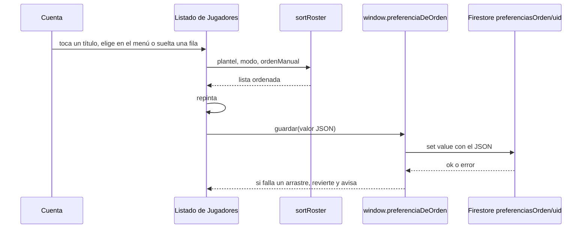
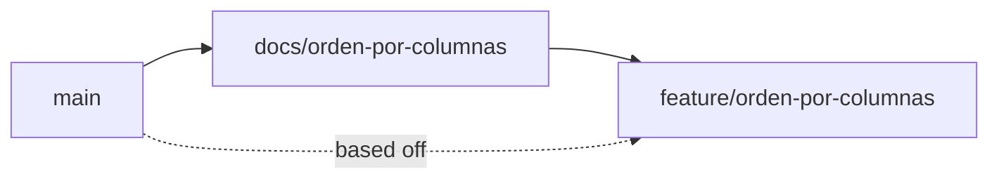

# Orden por columnas del listado de jugadores — Implementation Plan

> **Status:** Draft · **Date:** 2026-10-02 · **Owner:** Lucas Manoukian
>
> **Reviewers:** *pending*
>
> **Spec:** [ORDEN_POR_COLUMNAS_SPEC.md](./ORDEN_POR_COLUMNAS_SPEC.md)
>
> **Concept note:** [ORDEN_POR_COLUMNAS_CONCEPT.md](./ORDEN_POR_COLUMNAS_CONCEPT.md)

> **Grounding evidence (`MD-25`).** Este Plan se apoya en el ledger §6.5 del Concept Note y
> en las citas en línea de la Spec. Donde una tarea `T-N.*`, una decisión `TD-*` o una
> elección de módulo se apoya en una ubicación de código que ninguno de los dos cubre, la
> cita va en línea acá. Todas las líneas de `index.html`, `tests/` y `tools/` citadas se
> leyeron el 2026-10-02 sobre `main` en `4d6306d`.

## 1. Summary

Se cambia el orden del listado de Jugadores en `index.html`: el modo pasa de cinco valores a
trece (`manual` más seis columnas en dos sentidos), los títulos de la grilla desde 760px pasan
a ser botones, el menú `#ordenModo` queda sólo abajo de 760px, cualquier cuenta arrastra, y el
orden activo y el orden manual se guardan en un documento por cuenta,
`preferenciasOrden/{uid}`, a través de una interfaz nueva de guardar/leer
(`window.preferenciaDeOrden`). `playersSortMode` se retira del código, del contrato y de las
reglas. Lo único no obvio antes de leer el resto: **las reglas de Firestore no viven en el
repositorio**, se publican a mano desde la consola de cada proyecto
([`firestore-rules.md`](../rol-en-el-token/contracts/firestore-rules.md) §1), así que el orden
de publicación entre staging, producción y el merge del código es parte del Plan (§13), no un
detalle operativo. La entrega sigue `AGENTS.md` § Ramas: esta rama de documentos primero, la
de código después.

## 2. Goals & non-goals

- **Technical goal 1** — Un único comparador, `sortRoster(list, modo, ordenManual)`, resuelve
  los trece modos; conserva su firma de dos argumentos para los modos de columna, así
  `tests/puestos.test.js:641-650` sigue pasando sin cambios (`TC-010`, `TD-04`).
- **Technical goal 2** — Ninguna función de interfaz ni de orden conoce el `uid` ni la ruta de
  Firestore: sólo `window.preferenciaDeOrden.leer()`/`guardar(valor)` (`TC-013`, `TD-02`).
- **Technical goal 3** — Ningún camino del arrastre llama a `savePlayers()`; la regla de
  `data/players` no cambia (`TC-041`, `FR-036`).
- **Technical goal 4** — El arranque sigue haciendo el mismo total de lecturas: una menos en
  `data`, una en `preferenciasOrden`, todas en paralelo (`NFR-002`, `TC-015`).

**Non-goals:**

- No se convierte el listado en una tabla ARIA (Spec `NFR-004`, decisión del propietario).
- No se toca la convocatoria (§7.8 de OJ), ni `savePlayers`, ni el motor.
- No se borra el campo `orden` de los jugadores ni la migración `ordenJugadoresMigrado`: siguen
  dando el orden base (Spec `FR-037`).
- No se borra el documento `data/playersSortMode` de la base: queda sin lector ni regla.

## 3. Architecture overview



Capas (`AGENTS.md`, Arquitectura desacoplada): la interfaz (títulos, menú, arrastre) llama a
una función de dominio pura (`sortRoster`, `ordenManualTrasSoltar`,
`normalizarPreferenciaOrden`) y a la persistencia sólo a través de
`window.preferenciaDeOrden`, que es la única que conoce Firebase Auth y la colección. El motor
de generación no participa.

### 3.1 Key design decisions

| ID | Decision | Spec ref | Rationale |
|---|---|---|---|
| TD-01 | Sin feature flag: la rama sin mergear es la red de seguridad, como en `intercambiar-colores` (`TD-01` de su Plan) | — | El proyecto publica por merge a `main` después de probar contra staging (`AGENTS.md` § Ramas); un flag sería infraestructura anticipada (Simplicidad) |
| TD-02 | Interfaz nueva `window.preferenciaDeOrden = { leer(), guardar(valor) }`, declarada justo después de `window.auth` ([index.html:1416-1430](../../index.html#L1416-L1430)). `leer()` devuelve el `value` del documento `preferenciasOrden/{uid}` o `null` (sin sesión, sin documento o con error, que se registra con `console.error`); `guardar(valor)` escribe `{ value }` y **no traga el error**, igual que `window.storage.set` ([index.html:1395-1402](../../index.html#L1395-L1402)). El `uid` sale de `auth.currentUser` | TC-013, TC-014, D-03 | Resuelve `OPEN-Q-05`. `window.storage` queda intacto sobre `data`, y el resto del código no conoce ni el `uid` ni la colección. Va después de `window.auth` porque usa la variable `auth` |
| TD-03 | El documento guarda en `value` un JSON: `{"modo":"goles_desc","ordenManual":["p_…", …]}`. Cada escritura manda los dos campos | FR-040, FR-039 | Mismo formato `{ value: <string> }` que todos los documentos de `data` y que `leerJson` ya sabe leer. Mandar los dos campos siempre hace que elegir una columna conserve el orden manual sin una lectura previa (`FR-039`) |
| TD-04 | `modo` es una sola cadena `<criterio>_<sentido>` del conjunto cerrado `ORDEN_MODOS` = `manual`, `posicion_asc`, `posicion_desc`, `jugador_asc`, `jugador_desc`, `pj_desc`, `pj_asc`, `goles_desc`, `goles_asc`, `asist_desc`, `asist_asc`, `puntaje_desc`, `puntaje_asc`. Las claves `posicion_*` y `puntaje_*` conservan su nombre interno | FR-001, FR-026, D-01 | El orden de la lista es el de `FR-026` (primero el primer sentido), así el menú se arma recorriéndola. Conservar las claves de hoy deja pasar `tests/puestos.test.js` sin cambios; "Pts" es sólo el rótulo (`D-01` habla del nombre visible) |
| TD-05 | `sortRoster(list, modo, ordenManual = [])`: los modos de columna siguen el patrón actual (`index.html:2575-2601`); `jugador_*` compara `fullName` con `localeCompare` y desempata con `alfabetico`; `pj_*`, `goles_*`, `asist_*` ponen al final a todo `!p.partidosJugados`; todo desempate es `alfabetico` ascendente, sin multiplicar por el signo. `manual`: los ids de `ordenManual` primero, por su índice; el resto, por `orden` y después `alfabetico`, como hoy | FR-005–FR-010, FR-037 | Un solo comparador (`TC-010`). El desempate sin signo ya es la conducta de hoy (`index.html:2582-2585`) |
| TD-06 | Funciones puras nuevas, junto a `sortRoster`: `PRIMER_SENTIDO` (`{posicion:'asc', jugador:'asc', pj:'desc', goles:'desc', asist:'desc', puntaje:'desc'}`), `modoTrasElegirColumna(criterio, modoActual)`, `normalizarPreferenciaOrden(crudo)` y `ordenManualTrasSoltar(ids, arrastradoId, destinoId)` | FR-003, FR-004, FR-031, FR-038, FR-043 | Recortables por `extraer` para tests unitarios y de propiedad, sin navegador |
| TD-07 | El estado pasa de `playersSortMode` ([index.html:1838](../../index.html#L1838)) a dos variables: `ordenActivo` (un `modo`) y `ordenManualCuenta` (array de ids). `effectiveSortMode()` devuelve `'manual'` si el modo es `puntaje_*` y la cuenta no es admin; nunca escribe | FR-044, FR-056 | El respaldo vive en la lectura y no toca lo guardado, como `FR-052` de OJ hoy |
| TD-08 | `normalizarPreferenciaOrden` acepta `null`, JSON inválido o cualquier forma: `modo` fuera de `ORDEN_MODOS` → `'manual'`; `ordenManual` que no sea array → `[]`; dentro, descarta lo que no sea texto y las repeticiones (se queda con la primera). Los ids que no son del plantel se ignoran en `sortRoster`, no al normalizar | FR-038, FR-043, TC-042 | Normalizar en memoria no escribe (`FR-056`). Ignorar ids desconocidos al ordenar y no al leer evita depender del orden en que llegan `players` y la preferencia |
| TD-09 | Los títulos ordenables son `<button type="button" class="roster-orden" onclick="window.__ordenarPorColumna('<criterio>')" aria-label="<nombre>[, <sentido en palabras>]">` dentro de su celda; la celda de G E P y las vacías llevan `aria-hidden="true"`; `.roster-head` deja de llevarlo entero. Nombres: Posición, Jugador, Partidos jugados, Goles, Asistencias, Pts. Sentidos: "de mayor a menor"/"de menor a mayor" (PJ, Goles, Asist, Pts), "de la A a la Z"/"de la Z a la A" (Jugador), "del arquero al delantero"/"del delantero al arquero" (Pos). Lo arma `etiquetaTituloOrden(criterio, modo)` | FR-020, FR-021, FR-023, FR-029, NFR-004 | `NFR-004` enmendado: el sentido va en el nombre accesible, no en `aria-sort`. Un `button` nativo ya se activa con Enter y Espacio (`FR-029`) |
| TD-10 | Indicador: dos constantes, `ICON_ORDEN_ASC` y `ICON_ORDEN_DESC`, con los `path` de `arrow-up` y `arrow-down` de Lucide 0.544.0 (`m5 12 7-7 7 7` + `M12 19V5`; `M12 5v14` + `m19 12-7 7-7-7`, leídos de `unpkg.com/lucide-static@0.544.0` el 2026-10-02), 10 × 10 px, `aria-hidden`, a la derecha del texto con 2px de separación, `stroke: currentColor`. Sólo se dibuja en el título activo. Si `S-09` mide que "Pos" con el indicador no entra en 34px a 760px, la primera columna de las dos grillas (`--roster-cols`, [index.html:226-229](../../index.html#L226-L229)) pasa de `34px` a `40px` | FR-022, NFR-005, TC-033 | Deja `OPEN-Q-16` con una regla de decisión (40px sólo si la medición lo pide); la medición es `T-2.10`. Estimado: "POS" en mono 10px con `letter-spacing: .08em` ≈ 20px + 2 + 10 = 32px. Ensanchar la columna no inventa un valor visual nuevo: es la grilla existente |
| TD-11 | El menú `#ordenModo` ([index.html:1180](../../index.html#L1180)) se esconde desde 760px con un `@media (min-width: 760px)` junto al de la grilla. `renderOrdenModoSelect` recorre `ORDEN_MODOS` sin `manual` (y sin `puntaje_*` si no es admin); en Manual antepone `<option value="" disabled selected hidden>Ordenar por…</option>`. Rótulos: "Posición ↑/↓", "Jugador ↑/↓", "Partidos jugados ↓/↑", "Goles ↓/↑", "Asistencias ↓/↑", "Pts ↓/↑", con ↑ ascendente y ↓ descendente, como hoy | FR-024–FR-027, D-02 | Resuelve `OPEN-Q-15` (decisión del propietario del 2026-10-02: nombre completo y flecha). `hidden` en la opción es lo que Safari de iOS no respeta (`A-07` de la Spec, verificado en `T-2.17`) |
| TD-12 | `window.__ordenarPorColumna(criterio)` y el `change` del menú llaman a `aplicarOrden(modo)`: fija `ordenActivo`, repinta, y después llama a `guardarPreferenciaOrden()` con un `.catch` que sólo hace `console.error` | FR-045, FR-046, FR-057 | Repintar antes de guardar es `FR-057`; tragar el error es `FR-046` (decisión del propietario) |
| TD-13 | Toda fila es arrastrable, para cualquier cuenta. `window.__dragStartRosterRow` y `window.__dropOnRosterRow` ([index.html:2754-2790](../../index.html#L2754-L2790)) pierden `if(!isAdmin()) return;`. El soltado: valida contra `getFiltered()` (`TC-043`), arma `ids = sortRoster(players, effectiveSortMode(), ordenManualCuenta).map(id)` **sin filtros**, calcula `ordenManualTrasSoltar`, guarda el estado anterior, fija `ordenManualCuenta` y `ordenActivo = 'manual'`, repinta, `await guardarPreferenciaOrden()`; si falla, restaura los dos, repinta y muestra el aviso de hoy ("No se pudo guardar el nuevo orden. Intentá de nuevo.") | FR-030–FR-036, FR-047, FR-058, OPEN-Q-09 | La lista completa en el orden activo es `FR-031`. Soltar sobre sí mismo sigue cortando antes de todo (`FR-034`, `index.html:2763`) |
| TD-14 | `iniciarLecturas` suma `pedidos.preferenciaOrden = pedirPreferenciaOrden()` y deja de pedir `playersSortMode`; `loadAll` hace lo mismo y, antes del primer pintado, aplica `normalizarPreferenciaOrden` a `ordenActivo`/`ordenManualCuenta` | FR-041, FR-054, TC-015, FR-048 | Sale en el mismo `Promise.all` que el resto ([index.html:2109-2114](../../index.html#L2109-L2114)); `pedirPreferenciaOrden` atrapa cualquier error y devuelve `null`, como `pedirDoc` |
| TD-15 | El doble de Firebase (`fakeFirebase`, [tests/fixtures-app.js:295-384](../../tests/fixtures-app.js#L295-L384)) guarda los documentos fuera de `data` como `'<colección>/<clave>'`, registra esa misma clave en `window.__escrituras`, acepta una opción `uid` (default `'u-test'`), y expone `currentUser` cuando `onAuthStateChanged` entrega la cuenta | — | Hoy el doble ignora la colección y no tiene `currentUser`. Con la clave compuesta un escenario siembra la preferencia por `transformarDatos` (`datos['preferenciasOrden/u-test']`) sin chocar con un documento de `data` |
| TD-16 | Tests en un archivo nuevo, `tests/orden.test.js`, con su propia lista de declaraciones; prefijo de binding `orden/`. Los casos de reglas van en `tests/reglas.test.js`, los de pantalla en `tests/layout.test.js` | TC-031, AC-50 | Mismo criterio que `colores.test.js` (`TD-09` de su Plan) |
| TD-17 | Una sola publicación de reglas por proyecto, que agrega el bloque de `preferenciasOrden` **y** saca el de `data/playersSortMode`: primero staging, antes de probar la rama; después producción, inmediatamente antes del merge | TC-030, FR-048 | Con las reglas nuevas, la versión vieja de la app lee `playersSortMode` denegado: `pedirDoc` atrapa el error y cae a Manual ([index.html:2094-2098](../../index.html#L2094-L2098)), y su escritura ya fallaba en silencio. El hueco entre publicar en producción y mergear se mide en minutos (`R-07`). Dos publicaciones por proyecto dejarían el contrato y `EQUIVALENCIA` describiendo un estado intermedio |

## 4. Module map

| Module / package | Role | Status |
|---|---|---|
| `index.html` — `window.preferenciaDeOrden` (nueva, después de `window.auth`, [index.html:1416](../../index.html#L1416)) | Interfaz de guardar/leer de la preferencia (`TD-02`) | new |
| `index.html` — `ORDEN_MODOS` ([index.html:1597](../../index.html#L1597)) | Trece modos (`TD-04`) | modified |
| `index.html` — `playersSortMode` ([index.html:1838](../../index.html#L1838)) | Reemplazada por `ordenActivo` y `ordenManualCuenta` (`TD-07`) | deleted |
| `index.html` — `iniciarLecturas`, `loadAll`, `pedirPreferenciaOrden` (nueva) ([index.html:2088-2127](../../index.html#L2088-L2127)) | Lectura del arranque (`TD-14`) | modified |
| `index.html` — `sortRoster`, `effectiveSortMode` ([index.html:2568-2601](../../index.html#L2568-L2601)) | Comparador y respaldo (`TD-05`, `TD-07`) | modified |
| `index.html` — `getFiltered` ([index.html:2612-2623](../../index.html#L2612-L2623)) | Pasa `ordenManualCuenta` como tercer argumento de `sortRoster`; sin eso Manual nunca muestra el orden de la cuenta (`TD-05`, `TC-010`, `FR-037`) | modified |
| `index.html` — `PRIMER_SENTIDO`, `modoTrasElegirColumna`, `normalizarPreferenciaOrden`, `ordenManualTrasSoltar`, `etiquetaTituloOrden` (nuevas, junto a `sortRoster`) | Dominio puro (`TD-06`, `TD-08`, `TD-09`) | new |
| `index.html` — `ORDEN_MODO_LABELS`, `renderOrdenModoSelect` ([index.html:2625-2636](../../index.html#L2625-L2636)) | Menú (`TD-11`) | modified |
| `index.html` — `renderPlayersTab`, encabezado ([index.html:2660-2706](../../index.html#L2660-L2706)) | Títulos como botones, indicador (`TD-09`, `TD-10`) | modified |
| `index.html` — `puedeArrastrar` dentro de `renderPlayersTab` ([index.html:2666](../../index.html#L2666)) | Pasa de `isAdmin() && effectiveSortMode() === 'manual'` a `true`: toda fila lleva `draggable` (`TD-13`, `FR-030`) | modified |
| `index.html` — `ICON_ORDEN_ASC`, `ICON_ORDEN_DESC` (nuevas) | Indicador (`TD-10`) | new |
| `index.html` — `window.__ordenarPorColumna`, `aplicarOrden`, `guardarPreferenciaOrden` (nuevas) | Cambio de orden (`TD-12`) | new |
| `index.html` — `window.__dragStartRosterRow`, `window.__dropOnRosterRow` ([index.html:2754-2790](../../index.html#L2754-L2790)) | Arrastre (`TD-13`) | modified |
| `index.html` — listener de `#ordenModo` ([index.html:2883-2887](../../index.html#L2883-L2887)) | Llama a `aplicarOrden` | modified |
| CSS — `.roster-head`, `.roster-orden`, `@media (min-width: 760px)` ([index.html:220-240](../../index.html#L220-L240)) | Botón de título e indicador; menú escondido desde 760px | modified |
| `index.html` — `savePlayers`, `window.storage`, convocatoria (§7.8 de OJ), motor | Sin cambios | untouched (`TC-041`) |
| `tests/orden.test.js` | Tests unitarios, de propiedad, de medición y sobre la fuente | new |
| `tests/fixtures-app.js` — `fakeFirebase` | `TD-15` | modified |
| `tests/layout.test.js` | Escenarios `orden-*`; conteos de lecturas de `rol-admin-primer-pintado` y `rol-jugador-primer-pintado` ([tests/layout.test.js:479](../../tests/layout.test.js#L479), [:499](../../tests/layout.test.js#L499)) pasan a 8 y 2 | modified |
| `tests/sesion.test.js` | Listas de documentos del arranque ([tests/sesion.test.js:261-273](../../tests/sesion.test.js#L261-L273)) y el stub `pedirPreferenciaOrden` en `cargarSesion` ([:45-62](../../tests/sesion.test.js#L45-L62)) | modified |
| `tests/reglas.test.js` | Casos `orden/S-20*`, `orden/S-03a`; fila `data/playersSortMode` de `EQUIVALENCIA` ([tests/reglas.test.js:295](../../tests/reglas.test.js#L295)) pasa a `''`/`''` | modified |
| `tests/puestos.test.js` | Usa `sortRoster(lista, 'posicion_asc')` ([:641-650](../../tests/puestos.test.js#L641-L650)); si `sortRoster` pasa a usar `fullName`, se suma a `DECLARACIONES_FICHA` ([:549-553](../../tests/puestos.test.js#L549-L553)) | modified |
| `tools/medir-arranque.js` | Suma la línea de `preferenciasOrden` al informe, con `orden/NFR-001` y `orden/NFR-002` | modified |
| `docs/rol-en-el-token/contracts/firestore-rules.md` | §1 (publicación), §3 (tabla), §4 (texto) | modified |
| `tests/README.md`, `AGENTS.md` § Tests | Suman `node tests/orden.test.js` | modified |

## 5. Engineering rules / project conventions reference

Restatadas de [`AGENTS.md`](../../AGENTS.md).

| Rule | Summary |
|---|---|
| Estructura | Toda la aplicación en `index.html`, dentro de un IIFE. Sin build, bundler ni framework. |
| Imports | No aplica: no hay módulos. |
| Typing | No aplica: JavaScript sin anotaciones ni type-checker. |
| Logging | No aplica: la app no tiene logging propio; los errores de persistencia van a `console.error`, como hoy. |
| Estilo | Interfaz por plantillas de cadena e `innerHTML`; todo texto de jugador se escapa. Los rótulos y nombres accesibles nuevos son fijos (`TC-044`). |
| Tests | `tests/*.test.js`, con `node`, devuelven 1 sólo ante regresión. Se recorta de `index.html` por nombre con `extraer` de `tests/harness.js`. Renombrar una función recortada obliga a actualizar la lista en el mismo commit. |
| Binding | `variant-a` — el ID va en forma canónica con guion dentro de un string literal, con el prefijo `orden/`: el título del caso en `tests/orden.test.js` y `tests/reglas.test.js` (`'orden/S-05b: …'`), el campo `spec: ['orden/S-02', …]` de cada escenario de `tests/layout.test.js`, y la etiqueta impresa por `tools/medir-arranque.js` (`'orden/NFR-001'`). Nunca en comentarios. |
| Supply-chain | `none — el repositorio no versiona ningún lockfile y la aplicación no tiene dependencias instaladas (Firebase por CDN; Playwright es dev-only externo, AGENTS.md § Dependencias)` |
| Lint / type-check | `none — el repositorio no tiene linter ni type-checker configurados`. `T-N.D3`/`T-N.D4` pasan de forma vacua y se declaran como tales. |
| Constants | Los modos en `ORDEN_MODOS`, el primer sentido en `PRIMER_SENTIDO`, los íconos en `ICON_ORDEN_*`, el nombre de la colección sólo dentro de `window.preferenciaDeOrden`. |
| Commits | Conventional Commits con asunto en español: `tipo(scope): asunto (IDs de la Spec)`, ≤ 72 caracteres, un cambio lógico por commit, cada commit pasa los tests. Scope `orden-por-columnas` (o `tests` para el doble). Nunca `chore: bump version`. La versión la sube el workflow (`AGENTS.md` § Versionado). |
| Backwards compat | La versión vieja de la app sigue funcionando con las reglas nuevas, en Manual (`TD-17`). `data/playersSortMode` y `orden` quedan en la base. |

## 6. Definition of Done (every branch)

- [ ] La implementación sigue §5
- [ ] Cada FR/TC de la Spec asignado a la rama está implementado
- [ ] Cada escenario y variante tiene un test ejecutable (`AC-50`; `T-N.D8`, `T-N.D8b`)
- [ ] Cada NFR cuantificado tiene un test de medición (`AC-51`; `T-N.D9`)
- [ ] Cada `TC-*` de la Spec §4 tiene entrada en §12 de este Plan (`AC-52`; `T-N.D10`, `T-N.D10b`)
- [ ] §12.2 tiene una fila `IMP-*` por alcance afectado (`AC-53`; `T-N.D15`)
- [ ] Cada NFR cuantificado tiene una fila `OBS-*` en §11 (`AC-54`; `T-N.D16`)
- [ ] Supply-chain: `none` declarado en §5 (`AC-55`; `T-N.D20`, pasa de forma vacua)
- [ ] Cada `R-*` de §14 registra una vía de mitigación (`T-N.D17`)
- [ ] Auto-consistencia (`T-N.D18`) y unicidad de definiciones (`T-N.D18b`)
- [ ] Consistencia cruzada con Spec y Concept Note (`T-N.D19`)
- [ ] Tests nuevos y existentes pasan
- [ ] Linter y type-checker: no aplican (§5), declarado
- [ ] Sin `TODO`/`FIXME`/`HACK`
- [ ] Historial de commits limpio, formato §5 (`T-N.D11`)
- [ ] Descripción del PR con resumen, referencias a la Spec y decisiones (`T-N.D12`)
- [ ] **Gate propio del proyecto:** la pantalla se miró en un navegador real contra staging a 360, 759, 760 y 1200 px, con las dos cuentas (`T-N.D13`)
- [ ] PR abierto contra `main` (`T-N.D14`)

## 7. Branch / phase plan

### 7.0 Branch strategy — model (`MD-33`) + sizing (`MD-27`)

```
Branching model: trunk-based — detected by <skill-dir>/scripts/detect-branching-model.sh (basis: fallback; default branch main, sin develop/release/hotfix), consistente con AGENTS.md § Ramas (docs/<rebanada> y feature/<rebanada> salen de main y vuelven a main) y con el historial: los merges a main del 2026-09-29 al 2026-10-02 (4d6306d, 89f58b0, 28b1a78, 7ce74f4) vienen de ramas cortas, sin develop ni release/*. Confirmado por el propietario el 2026-10-02
Long-lived branches: none
```

```
Custom arc: 2 branches — AGENTS.md § Ramas (decisión 11 del Concept Note de equipos-en-el-campo) fija dos ramas por entrega: docs/<slug> con Spec y Plan, que se mergea primero, y feature/<slug> con el código. La publicación de reglas es un paso manual en las dos consolas (§13), no una rama: no hay código que la separe.
```

### 7.1 Branch tracker

| # | Git branch | Base branch | Status | PR | Tests | Notes |
|---|---|---|---|---|---|---|
| 1 | `docs/orden-por-columnas` | `main` | In progress | — | — | Concept Note y Spec ya mergeados (`89f58b0`, `4d6306d`); esta rama suma el Plan y dos enmiendas de la Spec |
| 2 | `feature/orden-por-columnas` | `main` | In progress | — | — | Creada desde `main` en `e8141fd` el 2026-10-02 |



Flechas = orden de merge. Línea punteada = base en git: la rama 2 sale de `main` una vez
mergeada la 1, no de la rama 1.

---

### 7.2 Branch 1 — `docs/orden-por-columnas`

**Goal:** dejar mergeado en `main` este Plan y las dos enmiendas de la Spec que surgieron al
derivarlo. Sin cambios de código.

**Spec coverage:** §18 de la Spec (fila "Dos enmiendas…"); la Declaración de reemplazo ya quedó
anotada en OJ (`ddc8d62`, `7bed0c7`).

#### 7.2.7 Verification

- [ ] La Spec dice `NFR-004` sin `aria-sort`, `S-08`/`S-08a` con el nombre accesible, y `A-07`
- [ ] La cabecera de la Spec enlaza este Plan
- [ ] Los enlaces cruzados de los tres documentos resuelven

#### 7.2.8 Files inventory

**New files:**
```
docs/orden-por-columnas/ORDEN_POR_COLUMNAS_IMPLEMENTATION_PLAN.md
```

**Modified files:**
```
docs/orden-por-columnas/ORDEN_POR_COLUMNAS_SPEC.md   (NFR-004, S-08, S-08a, FR-027, A-07, enlace al Plan;
                                                       AC-15 y AC-19, que necesita T-1.D10b)
```

#### 7.2.9 Task checklist (agent-runnable)

- [ ] T-1.1 Enmendar la Spec: `NFR-004`, `S-08`, `S-08a`, `FR-027`, `A-07`, con su fila de Change log; y `AC-15` (enumera `TC-011`, `TC-012`) y `AC-19` (declara retirados `TC-032`, `TC-034`), sin los cuales `T-1.D10b` no da vacío
- [ ] T-1.C1 Commit — `docs(orden-por-columnas): enmienda accesibilidad y menú en iOS (NFR-004)`
- [ ] T-1.2 Escribir este Plan y enlazarlo desde la cabecera de la Spec
- [ ] T-1.C2 Commit — `docs(orden-por-columnas): agrega el implementation plan`

DoD verification (§6):

- [ ] T-1.D1 Tests nuevos: no aplica, rama de documentos — declarado
- [ ] T-1.D2 Tests existentes: no aplica, no se toca código — declarado
- [ ] T-1.D3 Linter: no aplica (§5), declarado
- [ ] T-1.D4 Type-checker: no aplica (§5), declarado
- [ ] T-1.D5 Sin `TODO`/`FIXME`/`HACK` — `git grep -nE "TODO|FIXME|HACK" -- docs/orden-por-columnas/` vacío
- [ ] T-1.D6 Documentos revisados contra §5 (formato de commits)
- [ ] T-1.D7 Las enmiendas de `T-1.1`, incluidas `AC-15` y `AC-19`, están en la Spec y en su Change log
- [ ] T-1.D8 Binding de escenarios: vacío en esta rama (no hay tests); el gate real corre en `T-2.D8`
- [ ] T-1.D8b Cada `Scenario S-NN` de la Spec tiene `Variants:` o `Variants: none` — ``awk 'BEGIN{in_fence=0} /^```/{in_fence=!in_fence; next} in_fence{next} /^#{2,5} +Scenario +S-[0-9]+([^a-z0-9]|$)/ {if(current!="" && !found) print "MISSING Variants block: " current; current=$0; found=0; next} /^[ \t]*\*\*Variants:\*\*/ || /^[ \t]*Variants: *none/ {found=1} END{if(current!="" && !found) print "MISSING Variants block: " current}' docs/orden-por-columnas/ORDEN_POR_COLUMNAS_SPEC.md`` vacío
- [ ] T-1.D9 NFRs: vacío en esta rama; el gate real corre en `T-2.D9`
- [ ] T-1.D10 Cada `TC-*` de la Spec §4 aparece en §12 de este Plan — `comm -23 <(sed -n '/^## 4\./,/^## 5\./p' docs/orden-por-columnas/ORDEN_POR_COLUMNAS_SPEC.md | grep -oE "TC-[0-9]+" | sort -u) <(sed -n '/^## 12\./,/^## 13\./p' docs/orden-por-columnas/ORDEN_POR_COLUMNAS_IMPLEMENTATION_PLAN.md | grep -oE "TC-[0-9]+" | sort -u)` vacío
- [ ] T-1.D10b Cada `TC-*` de la Spec §4 tiene chequeo en su §11.3 — `comm -23 <(sed -n '/^## 4\./,/^## 5\./p' docs/orden-por-columnas/ORDEN_POR_COLUMNAS_SPEC.md | grep -oE "TC-[0-9]+" | sort -u) <(sed -nE '/^#{2,4} +11\.3/,/^#{2,4} +11\.4/p' docs/orden-por-columnas/ORDEN_POR_COLUMNAS_SPEC.md | grep -oE "TC-[0-9]+" | sort -u)` vacío
- [ ] T-1.D11 Historial limpio — `git log --oneline main..HEAD`
- [ ] T-1.D12 Descripción del merge con las dos enmiendas y el Plan
- [ ] T-1.D13 Gate propio: no aplica a una rama de documentos — declarado
- [ ] T-1.D14 Merge a `main` (o PR, a elección del propietario)
- [ ] T-1.D15 §12.2 no vacía — `sed -n '/^### 12\.2/,/^### 12\.3/p' docs/orden-por-columnas/ORDEN_POR_COLUMNAS_IMPLEMENTATION_PLAN.md | grep -cE "^\| *IMP-[0-9]+"` ≥ 1
- [ ] T-1.D16 Cada NFR cuantificado de la Spec tiene fila `OBS-*` — `comm -23 <(printf 'NFR-001\nNFR-002\nNFR-003\nNFR-004\nNFR-005\nNFR-006\n') <(sed -n '/^## 11\./,/^## 12\./p' docs/orden-por-columnas/ORDEN_POR_COLUMNAS_IMPLEMENTATION_PLAN.md | grep -oE "NFR-[0-9]+" | sort -u)` vacío. `NFR-007` a `NFR-009` no tienen un número que medir (Spec §8) — declarado
- [ ] T-1.D17 Cada `R-*` de §14 tiene vía de mitigación, y cada `T-N.*` citado en §14 está definido — `comm -23 <(sed -n '/^## 14\./,/^## 15\./p' docs/orden-por-columnas/ORDEN_POR_COLUMNAS_IMPLEMENTATION_PLAN.md | grep -oE "T-[0-9]+\.[A-Z]?[0-9]+" | sort -u) <(grep -oE "^- \[[ x]\] T-[0-9]+\.[A-Z]?[0-9]+" docs/orden-por-columnas/ORDEN_POR_COLUMNAS_IMPLEMENTATION_PLAN.md | grep -oE "T-[0-9]+\.[A-Z]?[0-9]+" | sort -u)` vacío
- [ ] T-1.D18 Auto-consistencia del Plan (`references/review-passes.md`, Pass 1)
- [ ] T-1.D18b Unicidad de definiciones, por documento — ``for f in docs/orden-por-columnas/ORDEN_POR_COLUMNAS_CONCEPT.md docs/orden-por-columnas/ORDEN_POR_COLUMNAS_SPEC.md docs/orden-por-columnas/ORDEN_POR_COLUMNAS_IMPLEMENTATION_PLAN.md; do { for p in D FR NFR TC AC TD OBS IMP R A US OPEN-Q; do { grep -ohE "^- \*\*${p}-[0-9]+[a-z]*\*\*" "$f"; grep -ohE "^\| *${p}-[0-9]+[a-z]* *\|" "$f"; } | grep -ohE "${p}-[0-9]+[a-z]*"; done; grep -ohE "^#### +Scenario +S-[0-9]+" "$f" | grep -oE "S-[0-9]+"; grep -ohE '^- `S-[0-9]+[a-z]* \[' "$f" | grep -oE "S-[0-9]+[a-z]*"; } | sort | uniq -d; done`` vacío en los tres (mismo comando que `T-1.D18b` de `intercambiar-colores`, porque `scripts/id-uniqueness.sh` no viene con el skill instalado)
- [ ] T-1.D19 Consistencia cruzada, por familia (`FR`, `NFR`, `TC`, `AC`, `S`, y `D` contra el Concept Note), con el left-anchor de la receta del template. Las citas a OJ (`FR-053` de OJ, etc.) se excluyen a mano: van siempre con "de OJ" al lado
- [ ] T-1.D20 Supply-chain: `none` declarado en §5, pasa de forma vacua

---

### 7.3 Branch 2 — `feature/orden-por-columnas`

**Goal:** el orden por columnas, el menú, el arrastre para cualquier cuenta y la preferencia
por cuenta funcionando, con todos los escenarios de la Spec cubiertos por tests, las reglas
publicadas y verificadas en staging, y publicadas en producción justo antes del merge.

**Spec coverage:** FR-001 a FR-058, NFR-001 a NFR-009, TC-001 a TC-044, AC-01 a AC-55,
S-01 a S-09, S-20 y sus variantes.

#### 7.3.1 Design decisions specific to this branch

`TD-02` a `TD-17` (§3.1). El orden de las tareas pone primero el dominio puro y sus tests, después
la persistencia, después la interfaz; los escenarios responsive nuevos se escriben y se ven
fallar antes de cambiar el encabezado (`AGENTS.md`, Responsive), sin commitear el estado rojo.

#### 7.3.2 New types / enums

File: `index.html`

| Symbol | Values | Notes |
|---|---|---|
| `ORDEN_MODOS` | los trece de `TD-04`, en ese orden | El orden es el del menú (`FR-026`) |
| `PRIMER_SENTIDO` | `{ posicion:'asc', jugador:'asc', pj:'desc', goles:'desc', asist:'desc', puntaje:'desc' }` | `FR-003` |
| Preferencia guardada | `{ modo: <ORDEN_MODOS>, ordenManual: string[] }`, como JSON en `value` | `TD-03` |

#### 7.3.3 New constants

| Constant | Value | Purpose |
|---|---|---|
| `ICON_ORDEN_ASC` | `'<svg class="roster-orden-icono" viewBox="0 0 24 24" width="10" height="10" aria-hidden="true"><path d="m5 12 7-7 7 7"/><path d="M12 19V5"/></svg>'` | `TD-10` |
| `ICON_ORDEN_DESC` | `'<svg class="roster-orden-icono" viewBox="0 0 24 24" width="10" height="10" aria-hidden="true"><path d="M12 5v14"/><path d="m19 12-7 7-7-7"/></svg>'` | `TD-10` |
| `'preferenciasOrden'` | nombre de la colección, sólo dentro de `window.preferenciaDeOrden` | `TC-013`, `TC-014` |

#### 7.3.5 New / modified interfaces

File: `index.html`

| Symbol | Signature | Notes |
|---|---|---|
| `window.preferenciaDeOrden.leer` | `() -> Promise<string\|null>` | `TD-02` |
| `window.preferenciaDeOrden.guardar` | `(valor: string) -> Promise<void>`, tira si falla | `TD-02` |
| `pedirPreferenciaOrden` | `() -> Promise<string\|null>` | Envuelve `leer()`; atrapa todo (`TD-14`) |
| `normalizarPreferenciaOrden` | `(crudo: string\|null) -> { modo, ordenManual }` | `TD-08`. Pura. Con ids repetidos se queda con la primera aparición; no mira el plantel |
| `sortRoster` | `(list, modo, ordenManual = []) -> list` | `TD-05`. Pura; no muta `list` |
| `effectiveSortMode` | `() -> modo` | `TD-07` |
| `modoTrasElegirColumna` | `(criterio, modoActual) -> modo` | Misma columna: invierte; otra: `criterio + '_' + PRIMER_SENTIDO[criterio]` (`FR-003`, `FR-004`) |
| `ordenManualTrasSoltar` | `(ids: string[], arrastradoId, destinoId) -> string[]` | Saca el arrastrado y lo inserta inmediatamente antes del destino; si son iguales o alguno no está, devuelve `ids` sin cambios. Pura |
| `etiquetaTituloOrden` | `(criterio, modo) -> string` | `TD-09` |
| `aplicarOrden` | `(modo) -> void` | `TD-12` |
| `guardarPreferenciaOrden` | `() -> Promise<void>` | `JSON.stringify({ modo: ordenActivo, ordenManual: ordenManualCuenta })` a `guardar` |
| `window.__ordenarPorColumna` | `(criterio) -> void` | `aplicarOrden(modoTrasElegirColumna(criterio, effectiveSortMode()))`; ignora `puntaje` si no es admin |
| `window.__dropOnRosterRow` | sin cambio de firma | `TD-13` |
| `renderOrdenModoSelect`, `renderPlayersTab` | sin cambio de firma | `TD-09` a `TD-11` |

File: `tests/fixtures-app.js`

| Symbol | Change | Notes |
|---|---|---|
| `fakeFirebase` | Opción `uid`; documentos fuera de `data` como `'<col>/<clave>'`; `currentUser` | `TD-15` |

#### 7.3.6 Tests

| File | Case / scenario | What it covers |
|---|---|---|
| `tests/orden.test.js` | `'orden/S-01a'`, `'orden/S-01b'`, `'orden/S-01e'`, `'orden/S-01h'`, `'orden/S-01k'` | `sortRoster` sobre planteles construidos a mano: empates, nadie jugó, 0 goles contra sin partidos, nombre visible contra apellido, Pts con sin puntaje |
| `tests/orden.test.js` | `'orden/S-01c'`, `'orden/S-01d'` | `modoTrasElegirColumna`: primer sentido de Jugador y de Pos |
| `tests/orden.test.js` | `'orden/S-01f'` | Propiedad sobre 200 planteles aleatorios con semilla fija: para cada columna, descendente invierte a ascendente entre los que tienen dato, los sin dato al final, desempate A→Z en los dos |
| `tests/orden.test.js` | `'orden/S-04b'`, `'orden/S-07b'`, `'orden/S-07c'` | `normalizarPreferenciaOrden` con `null`, JSON roto, modo desconocido, sentido desconocido, ids repetidos y no-texto, lista vacía |
| `tests/orden.test.js` | `'orden/S-05'`, `'orden/S-05a'`, `'orden/S-05b'`, `'orden/S-05c'` | `ordenManualTrasSoltar` sobre la lista completa en el orden activo, con los valores exactos de la Spec |
| `tests/orden.test.js` | `'orden/S-05g'` | Propiedad: para cualquier plantel, modo, filtro y par, el resultado tiene a cada jugador exactamente una vez |
| `tests/orden.test.js` | `'orden/S-07'`, `'orden/S-07a'` | `sortRoster(…, 'manual', lista)` con un borrado y un nuevo; cuenta que nunca arrastró |
| `tests/orden.test.js` | `'orden/S-08a'` | Propiedad sobre `etiquetaTituloOrden`: en cualquier secuencia de modos, a lo sumo un criterio tiene etiqueta con sentido, ninguno en `manual` |
| `tests/orden.test.js` | `'orden/S-03b'` | Sobre la fuente: `index.html` no contiene `onSnapshot` |
| `tests/orden.test.js` | `'orden/S-06'`, `'orden/TC-041'` | Sobre la fuente: el cuerpo de `window.__dropOnRosterRow` no contiene `savePlayers` ni `isAdmin` |
| `tests/orden.test.js` | `'orden/TC-013'` | Sobre la fuente: `preferenciasOrden` y `currentUser` aparecen sólo dentro del bloque de `window.preferenciaDeOrden` |
| `tests/orden.test.js` | `'orden/TC-044'` | `etiquetaTituloOrden` y `renderOrdenModoSelect` con una preferencia cuyo modo es ``: el texto insertado es un rótulo fijo |
| `tests/orden.test.js` | `'orden/NFR-003'` | 500 jugadores sintéticos, cada uno de los trece modos, mediana de 5 corridas ≤ 50 ms con `performance.now()` |
| `tests/layout.test.js` | `clave: 'orden-titulo'`, admin, `anchos: [1200]`, `spec: ['orden/S-01', 'orden/S-01i', 'orden/S-01j']` | Clic en "Goles": orden, indicador sólo en Goles; segundo clic invierte; con el filtro DEL, ordena sólo a los visibles; `window.__escrituras` tiene `preferenciasOrden/u-test` y no `playersSortMode` |
| `tests/layout.test.js` | `clave: 'orden-guardado-falla'`, admin, `doble: { escrituraFalla: true }`, `spec: ['orden/S-01g', 'orden/S-05e']` | Clic en un título: sin aviso, la lista queda ordenada. Arrastre: aviso de error y la lista vuelve al orden anterior |
| `tests/layout.test.js` | `clave: 'orden-menu'`, `rol: 'jugador'`, `anchos: [390, 759]`, `spec: ['orden/S-02', 'orden/S-02a']` | Sin títulos; el menú muestra "Ordenar por…" y las diez opciones de `FR-026` en orden, sin Pts ni Manual; elegir Asistencias ↓ ordena |
| `tests/layout.test.js` | `clave: 'orden-cruce'`, admin, `spec: ['orden/S-02a', 'orden/S-02b', 'orden/S-02c']` | A 390 el menú tiene Pts; a 760 hay títulos y el menú no está; 700 → 900 → 700 conserva Asistencias ↓ y lo muestra en cada control |
| `tests/layout.test.js` | `clave: 'orden-persistencia'`, admin, `spec: ['orden/S-03', 'orden/S-03c']` | Con la preferencia sembrada en `goles_desc` arranca por Goles; con `doble: { uid: 'u-otro' }` sobre los mismos datos arranca en Manual, en el orden base |
| `tests/layout.test.js` | `clave: 'orden-jugador'`, `rol: 'jugador'`, `spec: ['orden/S-04', 'orden/S-04a', 'orden/S-04b']` | Sin "Pts"; clic en Asist; segunda página con los datos escritos arranca por Asist. Sembrado `puntaje_desc` o basura: Manual, sin aviso, `window.__escrituras` vacío |
| `tests/layout.test.js` | `clave: 'orden-arrastre'`, admin, `anchos: [390, 1200]`, `spec: ['orden/S-05', 'orden/S-05d', 'orden/S-05f', 'orden/S-05h']` | Arrastre real con `page.dragAndDrop`; ningún título con indicador; el JSON escrito tiene `modo: 'manual'`; clic en PJ después escribe el mismo `ordenManual`; `__dropOnRosterRow` con un id inexistente no escribe |
| `tests/layout.test.js` | `clave: 'orden-arrastre-jugador'`, `rol: 'jugador'`, `spec: ['orden/S-06']` | El `jugador` arrastra; `window.__escrituras` no tiene `players` |
| `tests/layout.test.js` | `clave: 'orden-teclado'`, admin, `anchos: [1200]`, `spec: ['orden/S-08', 'orden/S-08b', 'orden/NFR-004']` | `page.focus` + Enter + Espacio sobre PJ; `aria-label` de cada botón; G E P no es un botón ni se alcanza con Tab |
| `tests/layout.test.js` | `clave: 'orden-encabezado'`, admin, `anchos: ANCHOS`, `spec: ['orden/S-09', 'orden/S-09b', 'orden/NFR-005']` | Con el orden en Pos y después en Pts: indicador dentro de su celda y del viewport, sin scroll horizontal; rótulos en orden; a 360 y 759 el menú con "Partidos jugados ↓" elegido no desborda |
| `tests/layout.test.js` | `clave: 'orden-encabezado-jugador'`, `rol: 'jugador'`, `anchos: ANCHOS`, `spec: ['orden/S-09a']` | Lo mismo en la grilla sin Pts |
| `tests/layout.test.js` | escenarios existentes `rol-admin-primer-pintado`, `rol-jugador-primer-pintado` | Esperan `data` 8 y 2, y `preferenciasOrden` 1; suman `'orden/NFR-002'` a su `spec` |
| `tests/reglas.test.js` | `'orden/S-20'`, `'orden/S-20a'`, `'orden/S-20b'`, `'orden/S-20c'`, `'orden/S-20d'`, `'orden/S-20e'`, `'orden/S-20f'` (un caso por literal) y `'orden/NFR-006'` | Contra staging, por REST con `puedeLeer`/`puedeEscribir` sobre `preferenciasOrden/<uid>` de cada cuenta ([tests/reglas.test.js:243-279](../../tests/reglas.test.js#L243-L279)); `S-20c` con el token sin claim, mismo procedimiento que `rol/S-20b` ([:367-391](../../tests/reglas.test.js#L367-L391)); `S-20d` sobre `data/players`; `S-20e` sin `Authorization` |
| `tests/reglas.test.js` | `'orden/S-03a'` | Dos escrituras seguidas de la cuenta admin a su propia preferencia; la lectura devuelve la segunda |
| `tests/reglas.test.js` | `'orden/TC-030'` | `EQUIVALENCIA` con `data/playersSortMode` en `''`/`''`, y el contrato con el bloque de `preferenciasOrden` (texto `preferenciasOrden/{uid}`) |

#### 7.3.7 Verification

- [ ] `node tests/orden.test.js` pasa
- [ ] `LAYOUT_STRICT=1 node tests/layout.test.js` pasa, incluidos los dos escenarios `rol-*-primer-pintado` con los conteos nuevos
- [ ] `node tests/puestos.test.js` y `node tests/sesion.test.js` pasan
- [ ] `REGLAS_STRICT=1 node tests/reglas.test.js` pasa contra staging con las reglas nuevas publicadas
- [ ] `orden-encabezado` y `orden-titulo` se vieron fallar antes de cambiar el encabezado, con la salida pegada en el PR
- [ ] `tools/medir-arranque.js` corrido en `main` antes del primer commit y en la rama al final (`NFR-001`)

#### 7.3.8 Files inventory

**New files:**
```
tests/orden.test.js
```

**Modified files:**
```
index.html
tests/fixtures-app.js
tests/layout.test.js
tests/sesion.test.js
tests/reglas.test.js
tests/puestos.test.js            (sólo si sortRoster pasa a usar fullName)
tools/medir-arranque.js
docs/rol-en-el-token/contracts/firestore-rules.md
tests/README.md
AGENTS.md
docs/orden-por-columnas/ORDEN_POR_COLUMNAS_IMPLEMENTATION_PLAN.md   (estado, mediciones)
```

#### 7.3.9 Task checklist (agent-runnable)

Implementation tasks (grouped into atomic commits):

- [x] T-2.1 En `main`, antes de crear la rama: `node tools/medir-arranque.js --caso=vigente --corridas=5` y `--lecturas` contra staging. Anotar las dos medianas y el conteo por colección en este Plan (`NFR-001`, `NFR-002`). Sin esto no hay línea de base
  - **Medido el 2026-10-02 sobre `main` en `e8141fd`**, contra staging, desde la misma máquina y red, cuenta admin.
  - `--caso=vigente --corridas=5`: arranque completo 968, 1066, 1094, 718, 1218 ms → **mediana 1066 ms**; hueco de la solapa **mediana 0 ms**; refrescos 0; frames incompletos 0.
  - `--caso=vigente --lecturas` (3 corridas por defecto), admin: `data` = 9, 9, 9 → **mediana 9**; `userRoles` 0; ninguna otra colección.
  - Mismo comando con la cuenta `jugador` (no lo pide la tarea; sirve de base para los 3 → 2 de `NFR-002`): `data` = 3, 3, 3 → **mediana 3**; `userRoles` 0.
  - Dispersión observada: 500 ms entre la corrida más rápida y la más lenta, diez veces el margen de 50 ms de `NFR-001`. Si `T-2.19` sale por encima del margen, la repetición con `--corridas=10` que prevé la tarea es la que decide
- [x] T-2.2 Ampliar `ORDEN_MODOS` y, en el mismo commit, `ORDEN_MODO_LABELS` con los rótulos de `TD-11` (sin esto el menú muestra ocho opciones `undefined` hasta `T-2.C5`); agregar `PRIMER_SENTIDO`, `modoTrasElegirColumna`, `normalizarPreferenciaOrden`, `ordenManualTrasSoltar`, `etiquetaTituloOrden`, y el tercer parámetro y los modos nuevos de `sortRoster` (`TD-04` a `TD-06`, `TD-08`, `TD-09`). Si `sortRoster` usa `fullName`, sumarlo a `DECLARACIONES_FICHA` de `tests/puestos.test.js` en el mismo commit
- [x] T-2.C1 Commit — `feat(orden-por-columnas): ordena por seis columnas (FR-001, FR-005)`

- [x] T-2.3 Crear `tests/orden.test.js` con los casos **puros** de §7.3.6: unitarios, de propiedad, `'orden/S-08a'` y `'orden/NFR-003'`. Los casos sobre la fuente (`'orden/S-03b'`, `'orden/TC-013'`, `'orden/TC-044'`, `'orden/S-06'`/`'orden/TC-041'`) entran en el commit que vuelve verdadera su condición (`T-2.21` a `T-2.23`), para que cada commit pase los tests (§5)
- [x] T-2.4 [P] Sumar `node tests/orden.test.js` a `tests/README.md` y a `AGENTS.md` § Tests
- [x] T-2.C2 Commit — `test(orden-por-columnas): cubre el comparador y el soltado (S-01, S-05)`

- [x] T-2.5 `fakeFirebase`: opción `uid`, clave compuesta fuera de `data`, `currentUser` (`TD-15`). Correr todo `tests/layout.test.js`: sin cambios en la app, tiene que seguir pasando
- [x] T-2.C3 Commit — `test(tests): el doble de firebase distingue colecciones y cuentas`

- [x] T-2.6 Declarar `window.preferenciaDeOrden` y `pedirPreferenciaOrden` (`TD-02`); cambiar `iniciarLecturas`/`loadAll` (`TD-14`); reemplazar `playersSortMode` por `ordenActivo`/`ordenManualCuenta` (`TD-07`); `aplicarOrden`, `guardarPreferenciaOrden`; el listener de `#ordenModo` llama a `aplicarOrden` y deja de escribir `playersSortMode` (`FR-048`); `getFiltered` pasa `ordenManualCuenta` a `sortRoster`
- [x] T-2.7 En el mismo commit: `tests/sesion.test.js` (listas y stub), conteos de `rol-*-primer-pintado` en `tests/layout.test.js` con `'orden/NFR-002'`, y la línea `orden/NFR-001`/`orden/NFR-002` del informe de `tools/medir-arranque.js` (`TC-031`)
- [x] T-2.21 [P] Sumar a `tests/orden.test.js` `'orden/TC-013'` y `'orden/S-03b'`
- [x] T-2.C4 Commit — `feat(orden-por-columnas): guarda el orden por cuenta (FR-040, FR-048)`

- [x] T-2.8 Escribir los escenarios `orden-encabezado`, `orden-encabezado-jugador`, `orden-titulo` y `orden-teclado` y **correrlos sin el cambio de encabezado**: tienen que fallar por "no hay botón de título". Guardar la salida para el PR. No se commitea todavía
- [x] T-2.9 Encabezado con botones, indicador, CSS de `.roster-orden` y menú escondido desde 760px; `renderOrdenModoSelect` con "Ordenar por…" (`TD-09` a `TD-11`); `window.__ordenarPorColumna`
- [x] T-2.10 Medir `orden-encabezado` a 760 con el orden en Pos: si el indicador sale de su celda, aplicar los `40px` de `TD-10` en las dos grillas y volver a medir. Anotar el resultado en §15.1 (`OPEN-Q-16`). Después, con el escenario en verde, forzar a mano `--roster-cols` a una primera columna de `20px`, confirmar que `orden-encabezado` falla **por el borde del indicador fuera de su celda**, revertir, y guardar esa salida para el PR junto con la de `T-2.8` (`AGENTS.md` § Responsive: la aserción de contención tiene que verse roja por su propia causa)
- [x] T-2.22 [P] Sumar a `tests/orden.test.js` `'orden/TC-044'`
- [x] T-2.C5 Commit — `feat(orden-por-columnas): ordena tocando el título (FR-020, FR-022)`, incluye `T-2.8` a `T-2.10` y `T-2.22`

- [x] T-2.11 Arrastre para cualquier cuenta y soltado sobre la lista completa (`TD-13`); `puedeArrastrar` pasa a `true`
- [x] T-2.23 [P] Sumar a `tests/orden.test.js` `'orden/S-06'` y `'orden/TC-041'`
- [x] T-2.C6 Commit — `feat(orden-por-columnas): cualquier cuenta arrastra (FR-030, FR-031)`

- [x] T-2.12 Escribir los escenarios `orden-menu`, `orden-cruce`, `orden-persistencia`, `orden-jugador`, `orden-arrastre`, `orden-arrastre-jugador` y `orden-guardado-falla`
- [x] T-2.C7 Commit — `test(orden-por-columnas): escenarios de pantalla (S-02..S-06)`

- [x] T-2.13 Contrato de reglas: en §4, bloque `match /preferenciasOrden/{uid} { allow read, write: if request.auth != null && request.auth.uid == uid && request.auth.token.rol in ['admin', 'jugador']; }` y sin el bloque de `data/playersSortMode`; en §3, fila nueva y la de `playersSortMode` en "—" para los dos roles; en §1, una fila de estado para esta publicación (`TC-030`, `TC-040`, `TC-014`)
- [x] T-2.14 `tests/reglas.test.js`: casos `orden/*` de §7.3.6 y la fila de `EQUIVALENCIA`. Ayudantes nuevos, junto a `puedeLeer`/`puedeEscribir`: `leerValor(idToken, doc)` (devuelve el campo `value` o `null`), `escribirValor(idToken, doc, valor)`, `pedirSinToken(metodo, doc)` (sin `Authorization`, para `S-20e`), y `conPreferenciaRestaurada(cuenta, fn)`, que lee la preferencia de la cuenta antes de cada caso que escribe (`S-03a`, `S-20f`) y al terminar la restaura, o borra el documento si no existía, para no dejar rastro ni tocar lo que `T-2.17` usa
- [x] T-2.C8 Commit — `feat(orden-por-columnas): regla de la preferencia por cuenta (TC-040)`

- [x] T-2.15 **El propietario publica** las reglas de §4 del contrato en la consola de **staging**. Después: `REGLAS_STRICT=1 node tests/reglas.test.js` pasa entero (los casos `rol/*` y los `orden/*`)
  - Publicadas por el propietario el 2026-10-02. `REGLAS_STRICT=1 node tests/reglas.test.js`: **30/30**. Antes de publicar, `--solo=orden/` con las reglas viejas daba 5 fallas (ninguna cuenta leía su propia preferencia; una era `orden/S-20c` por falta de llave). Al terminar, `preferenciasOrden` sin documentos en staging y los claims de las dos cuentas intactos
- [x] T-2.16 Correr el gate de binding (`T-2.D8`) y cerrar cualquier hueco antes de seguir
  - 2026-10-02: `T-2.D8`, `T-2.D9` y `T-2.D10` vacíos, sin huecos que cerrar
- [x] T-2.17 Abrir `index.html` localmente contra staging con las dos cuentas, a 360, 759, 760 y 1200 px: ordenar, recargar, arrastrar, recargar, y confirmar que una cuenta no ve los cambios de la otra (`AC-03`). En un iPhone real, abrir el menú en Manual y anotar si "Ordenar por…" aparece deshabilitada o escondida (`A-07`); en el mismo teléfono, arrastrar una fila del listado (`A-05`). Credenciales de staging fuera del repositorio
  - 2026-10-02: el propietario lo probó en la computadora con las dos cuentas y en un iPhone real, y confirma que todo anda: el orden y el arrastre se conservan al recargar, cada cuenta no ve los cambios de la otra (`AC-03`), y en el iPhone el menú y el arrastre funcionan (`A-05` verificado por el propietario). No se registró si Safari de iOS muestra "Ordenar por…" deshabilitada o escondida (`A-07`); las dos salidas son aceptables según `FR-027`
- [x] T-2.18 Confirmar en la consola de producción, sólo leyendo, que los jugadores de `data/players` tienen `orden` (`A-06`, `AC-02`). Si alguno no lo tiene, abrir `R-06` antes de mergear
  - 2026-10-02, sólo lectura con el Admin SDK sobre `organizador-futbol`: **40 jugadores, los 40 con `orden`**, sin valores repetidos; `data/ordenJugadoresMigrado` = `"true"`. `A-06` verificado; `R-06` no se abre
- [x] T-2.19 `node tools/medir-arranque.js --caso=vigente --corridas=5` y `--lecturas` en la rama, contra staging, en la misma red que `T-2.1`. Si la mediana sube más de 50 ms, repetir las dos con `--corridas=10` (`NFR-001`). Anotar todo en este Plan
  - **Medido el 2026-10-02 en la rama (`bc60803`)**, contra staging, misma máquina y red que `T-2.1`, cuenta admin.
  - `--caso=vigente --corridas=5`: 909, 753, 761, 736, 863 ms → **mediana 761 ms**, contra 1066 ms de la línea de base: −305 ms, dentro de +50 ms (`NFR-001`), así que no corresponde repetir con `--corridas=10`. La diferencia es menor que la dispersión entre corridas (~500 ms, `T-2.1`): se lee como "no empeoró", no como una mejora
  - `--lecturas`, admin: `data` 8, 8, 8 y `preferenciasOrden` 1, 1, 1. Cuenta `jugador`: `data` 2, 2, 2 y `preferenciasOrden` 1, 1, 1. El total por arranque no cambia: 9 y 3, como en `T-2.1` (`NFR-002`)
- [ ] T-2.C9 Commit — `docs(orden-por-columnas): registra mediciones y verificaciones`
- [x] T-2.20 **El propietario publica** las mismas reglas en la consola de **producción**, inmediatamente antes de mergear, y anota la fecha en §1 del contrato (`TD-17`)
  - Publicadas por el propietario el 2026-10-02; fecha anotada en §1 del contrato

DoD verification (§6). Todo arreglo hecho durante la verificación va en un commit propio
(numerado a continuación del último `T-2.C*`, con `fix(...)`):

- [ ] T-2.D1 Tests nuevos pasan — `node tests/orden.test.js && LAYOUT_STRICT=1 node tests/layout.test.js && REGLAS_STRICT=1 node tests/reglas.test.js`
- [ ] T-2.D2 Tests existentes pasan — `node tests/motor.test.js && node tests/cancha.test.js && node tests/panel.test.js && node tests/finalizado.test.js && node tests/eventos.test.js && node tests/toque.test.js && node tests/escapado.test.js && node tests/colores.test.js && node tests/puestos.test.js && node tests/sesion.test.js && node tests/rol-script.test.js`
- [ ] T-2.D3 Linter: no aplica (§5), declarado
- [ ] T-2.D4 Type-checker: no aplica (§5), declarado
- [ ] T-2.D5 Sin `TODO`/`FIXME`/`HACK` — `git grep -nE "TODO|FIXME|HACK" -- tests/orden.test.js` vacío, y `git diff main -- index.html tests/ tools/ | grep -E "^\+.*(TODO|FIXME|HACK)"` vacío. Además, por `TC-002`: `git diff main -- index.html | grep -E "^\+.*(localStorage|sessionStorage)"` vacío
- [ ] T-2.D6 Implementación revisada contra §5
- [ ] T-2.D7 Cada FR/NFR/TC de la Spec está implementado — revisar la tabla de §7.3.5 contra Spec §7 y §8, y **recorrer §12.9 fila por fila** anotando en el PR, por cada `TC-*`, qué se miró y el resultado. Lo hace quien abre el PR; el propietario lo revisa antes de mergear
- [ ] T-2.D8 Binding de escenarios y variantes — `comm -23 <(sed -n '/^## 9\./,/^## 10\./p' docs/orden-por-columnas/ORDEN_POR_COLUMNAS_SPEC.md | grep -oE '(^|[^A-Za-z])S-[0-9]+[a-z]*' | sed -E 's/^[^S]+//' | sort -u) <(grep -rEho "orden/S-[0-9]+[a-z]*" tests/ | sed 's#orden/##' | sort -u)` vacío
- [ ] T-2.D8b Bloques `Variants:` presentes — mismo `awk` que `T-1.D8b`, vacío
- [ ] T-2.D9 Binding de NFRs cuantificados — `comm -23 <(printf 'NFR-001\nNFR-002\nNFR-003\nNFR-004\nNFR-005\nNFR-006\n') <(grep -rEho "orden/NFR-[0-9]+" tests/ tools/medir-arranque.js | sed 's#orden/##' | sort -u)` vacío
- [ ] T-2.D10 Mismo comando que `T-1.D10`, vacío
- [ ] T-2.D10b Mismo comando que `T-1.D10b`, vacío
- [ ] T-2.D11 Historial limpio — `git log --oneline main..HEAD`, cada commit con formato §5
- [ ] T-2.D12 Descripción del PR: resumen, IDs de la Spec, `TD-*` tomadas, salida roja de `T-2.8`, mediciones de `T-2.1`/`T-2.19`, resultado de `T-2.17` y `T-2.18`, fecha de publicación de las reglas en los dos proyectos
- [ ] T-2.D13 Gate propio: `T-2.17` hecho
- [ ] T-2.D14 PR abierto contra `main` (o merge directo, a elección del propietario), después de `T-2.20`
- [ ] T-2.D15 Mismo comando que `T-1.D15`, ≥ 1
- [ ] T-2.D16 Mismo comando que `T-1.D16`, vacío
- [ ] T-2.D17 Mismo comando que `T-1.D17`, vacío
- [ ] T-2.D18 Auto-consistencia del Plan, Pass 1
- [ ] T-2.D18b Unicidad de definiciones — mismo comando que `T-1.D18b`, vacío en los tres
- [ ] T-2.D19 Consistencia cruzada, Pass 2
- [ ] T-2.D20 Supply-chain: `none` declarado en §5, pasa de forma vacua

## 8. Data model & migrations

### 8.1 Schema changes

| Table / collection | Change | Index changes | Default values | Backfill plan |
|---|---|---|---|---|
| `preferenciasOrden` (nueva) | Un documento por cuenta, id = `uid`, campo `value` con el JSON de `TD-03` | ninguno | sin documento = Manual en el orden base (`FR-042`) | ninguno: se crea con el primer cambio de la cuenta |
| `data/playersSortMode` | Sin lector ni regla | — | — | ninguno; el documento queda en la base sin efecto |
| `data/players`, campo `orden` | Sin cambios; nadie lo escribe arrastrando | — | — | — |

### 8.2 Migration strategy

No hay migración de datos: nada se copia de `playersSortMode` a las preferencias (Spec
`OPEN-Q-04`: nadie hereda su valor) y el orden base es el `orden` que ya existe. El único paso
ordenado es el de las reglas (`TD-17`, §13). Sin migración, no corresponde diagrama de estados.

### 8.3 Reversibility

Revertir el merge vuelve a la app de hoy. Con las reglas nuevas publicadas, esa app lee
`playersSortMode` denegado y queda en Manual: para devolverle el modo compartido, el
propietario republica el texto anterior de §4 del contrato (está en el historial de git). Las
preferencias guardadas quedan en la base sin efecto.

## 9. API & contract changes

### 9.1 New / modified endpoints

No aplica: no hay endpoints. Lo que cambia es el contrato de reglas.

### 9.2 Internal contracts

- `window.preferenciaDeOrden` (`TD-02`) y el JSON de `TD-03`.
- La regla de `preferenciasOrden/{uid}` (`T-2.13`). No hay pares productor/consumidor entre
  servicios, así que no corresponde diagrama §9.2.1.

### 9.3 Backwards compatibility

- La versión vieja de la app con las reglas nuevas: Manual, sin error visible (`TD-17`).
- La versión nueva con las reglas viejas (sólo si alguien prueba la rama antes de `T-2.15`): la
  lectura de la preferencia se deniega, `pedirPreferenciaOrden` devuelve `null` y la cuenta ve
  Manual; los cambios de columna no se guardan, y un arrastre muestra el aviso de error.

## 10. Configuration & feature flags

No aplica — `TD-01`.

## 11. Observability

> El proyecto no tiene telemetría de producción (riesgo aceptado, `R-01`). Los `OBS-*` son
> chequeos automáticos o mediciones que corren en cada PR, como en el resto de las features.

| ID | Signal | Type | Source | Binds to | Threshold / use |
|---|---|---|---|---|---|
| OBS-01 | Mediana del arranque completo, antes y después | measurement | `tools/medir-arranque.js` (`T-2.1`, `T-2.19`) | NFR-001, R-04 | Falla si sube más de 50 ms tras la repetición con `--corridas=10` |
| OBS-02 | Lecturas por colección en un arranque | automated check | `rol-*-primer-pintado` de `tests/layout.test.js` + `tools/medir-arranque.js --lecturas` | NFR-002 | Falla si `data` ≠ 8/2 o `preferenciasOrden` ≠ 1 |
| OBS-03 | Mediana de `sortRoster` con 500 jugadores | automated check | `tests/orden.test.js` `'orden/NFR-003'` | NFR-003 | Falla por encima de 50 ms |
| OBS-04 | Nombre accesible de cada título y foco con teclado | automated check | `orden-teclado` | NFR-004 | Falla ante un sentido mal anunciado o un título sin foco |
| OBS-05 | `scrollWidth === clientWidth` y bordes dentro del viewport en los diecisiete anchos | automated check | `orden-encabezado`, `orden-encabezado-jugador` + invariantes de `tests/layout.test.js` | NFR-005, R-03 | Falla ante cualquier desborde |
| OBS-06 | Permisos sobre `preferenciasOrden` y `data/players` por cuenta | automated check | `tests/reglas.test.js` `orden/*` contra staging | NFR-006, R-02 | Falla ante cualquier permiso concedido de más o de menos |

**Dashboards:** ninguno — no aplica a este proyecto.

## 12. Test plan

### 12.1 Scenario Traceability Matrix

| Spec scenario | Test | Level | Branch |
|---|---|---|---|
| S-01 | `tests/layout.test.js` `orden-titulo` | e2e | Branch 2 |
| S-01a `[boundary]` | `tests/orden.test.js` `'orden/S-01a: …'` | unit | Branch 2 |
| S-01b `[boundary]` | `tests/orden.test.js` `'orden/S-01b: …'` | unit | Branch 2 |
| S-01c `[boundary]` | `tests/orden.test.js` `'orden/S-01c: …'` | unit | Branch 2 |
| S-01d `[boundary]` | `tests/orden.test.js` `'orden/S-01d: …'` | unit | Branch 2 |
| S-01e `[boundary]` | `tests/orden.test.js` `'orden/S-01e: …'` | unit | Branch 2 |
| S-01f `[property]` | `tests/orden.test.js` `'orden/S-01f: …'` | property | Branch 2 |
| S-01g `[failure]` | `tests/layout.test.js` `orden-guardado-falla` | e2e | Branch 2 |
| S-01h `[boundary]` | `tests/orden.test.js` `'orden/S-01h: …'` | unit | Branch 2 |
| S-01i `[boundary]` | `tests/layout.test.js` `orden-titulo` | e2e | Branch 2 |
| S-01j `[boundary]` | `tests/layout.test.js` `orden-titulo` | e2e | Branch 2 |
| S-01k `[boundary]` | `tests/orden.test.js` `'orden/S-01k: …'` | unit | Branch 2 |
| S-02 | `tests/layout.test.js` `orden-menu` | e2e | Branch 2 |
| S-02a `[boundary]` | `tests/layout.test.js` `orden-menu`, `orden-cruce` | e2e | Branch 2 |
| S-02b `[boundary]` | `tests/layout.test.js` `orden-cruce` | e2e | Branch 2 |
| S-02c `[boundary]` | `tests/layout.test.js` `orden-cruce` | e2e | Branch 2 |
| S-03 | `tests/layout.test.js` `orden-persistencia` | e2e | Branch 2 |
| S-03a `[concurrency]` | `tests/reglas.test.js` `'orden/S-03a: …'` | integration | Branch 2 |
| S-03b `[concurrency]` | `tests/orden.test.js` `'orden/S-03b: …'` — sobre la fuente: sin `onSnapshot` la app sólo lee la preferencia al arrancar (`TD-14`), así que no puede cambiar en vivo; una prueba con dos dispositivos verificaría lo mismo con más costo | unit | Branch 2 |
| S-03c `[boundary]` | `tests/layout.test.js` `orden-persistencia` | e2e | Branch 2 |
| S-04 | `tests/layout.test.js` `orden-jugador` | e2e | Branch 2 |
| S-04a `[failure]` | `tests/layout.test.js` `orden-jugador` | e2e | Branch 2 |
| S-04b `[failure]` | `tests/orden.test.js` `'orden/S-04b: …'` + `tests/layout.test.js` `orden-jugador` | unit + e2e | Branch 2 |
| S-05 | `tests/orden.test.js` `'orden/S-05: …'` + `tests/layout.test.js` `orden-arrastre` | unit + e2e | Branch 2 |
| S-05a `[boundary]` | `tests/orden.test.js` `'orden/S-05a: …'` | unit | Branch 2 |
| S-05b `[boundary]` | `tests/orden.test.js` `'orden/S-05b: …'` | unit | Branch 2 |
| S-05c `[boundary]` | `tests/orden.test.js` `'orden/S-05c: …'` | unit | Branch 2 |
| S-05d `[boundary]` | `tests/layout.test.js` `orden-arrastre` | e2e | Branch 2 |
| S-05e `[failure]` | `tests/layout.test.js` `orden-guardado-falla` | e2e | Branch 2 |
| S-05f `[failure]` | `tests/layout.test.js` `orden-arrastre` | e2e | Branch 2 |
| S-05g `[property]` | `tests/orden.test.js` `'orden/S-05g: …'` | property | Branch 2 |
| S-05h `[boundary]` | `tests/layout.test.js` `orden-arrastre` a 390 | e2e | Branch 2 |
| S-06 | `tests/layout.test.js` `orden-arrastre-jugador` + `tests/orden.test.js` `'orden/S-06: …'` | unit + e2e | Branch 2 |
| S-07 | `tests/orden.test.js` `'orden/S-07: …'` | unit | Branch 2 |
| S-07a `[boundary]` | `tests/orden.test.js` `'orden/S-07a: …'` | unit | Branch 2 |
| S-07b `[failure]` | `tests/orden.test.js` `'orden/S-07b: …'` | unit | Branch 2 |
| S-07c `[boundary]` | `tests/orden.test.js` `'orden/S-07c: …'` | unit | Branch 2 |
| S-08 | `tests/layout.test.js` `orden-teclado` | e2e | Branch 2 |
| S-08a `[property]` | `tests/orden.test.js` `'orden/S-08a: …'` | property | Branch 2 |
| S-08b `[boundary]` | `tests/layout.test.js` `orden-teclado` | e2e | Branch 2 |
| S-09 | `tests/layout.test.js` `orden-encabezado` | e2e | Branch 2 |
| S-09a `[boundary]` | `tests/layout.test.js` `orden-encabezado-jugador` | e2e | Branch 2 |
| S-09b `[boundary]` | `tests/layout.test.js` `orden-encabezado` | e2e | Branch 2 |
| S-20 | `tests/reglas.test.js` `'orden/S-20: …'` | integration | Branch 2 |
| S-20a `[failure]` | `tests/reglas.test.js` `'orden/S-20a: …'` | integration | Branch 2 |
| S-20b `[failure]` | `tests/reglas.test.js` `'orden/S-20b: …'` | integration | Branch 2 |
| S-20c `[failure]` | `tests/reglas.test.js` `'orden/S-20c: …'` | integration | Branch 2 |
| S-20d `[failure]` | `tests/reglas.test.js` `'orden/S-20d: …'` | integration | Branch 2 |
| S-20e `[failure]` | `tests/reglas.test.js` `'orden/S-20e: …'` | integration | Branch 2 |
| S-20f `[boundary]` | `tests/reglas.test.js` `'orden/S-20f: …'` | integration | Branch 2 |

### 12.2 Impact Traceability

| ID | Scope | Description | Triggered by | Risk | OBS | Mitigation task |
|---|---|---|---|---|---|---|
| IMP-01 | code | `index.html`: comparador, encabezado, menú, arrastre, lecturas del arranque y una interfaz nueva de persistencia. Cambian las expectativas de `tests/sesion.test.js` y de dos escenarios `rol-*` de `tests/layout.test.js`; el doble de Firebase gana colecciones y cuentas | FR-001, FR-020, FR-030, FR-041, FR-048, TC-031 | R-03, R-05 | OBS-02, OBS-05 | `T-2.5`, `T-2.7`, `T-2.8` |
| IMP-02 | system | Una colección y una regla nuevas en dos proyectos de Firestore, y una regla menos (`playersSortMode`), publicadas a mano | TC-014, TC-030, TC-040, FR-048 | R-02, R-07 | OBS-06 | `T-2.13`, `T-2.15`, `T-2.20` |
| IMP-03 | business | El orden deja de ser común: cada cuenta ve el suyo. El `jugador` gana el arrastre y que su orden se guarde. El orden manual anterior se pierde al elegir una columna | FR-030, FR-040, FR-049, FR-039 | R-01, R-06 | — | `T-2.17` |
| IMP-04 | system | El arranque hace una lectura en otra colección | NFR-001, NFR-002, TC-015 | R-04 | OBS-01, OBS-02 | `T-2.1`, `T-2.19` |
| IMP-05 | code | La Spec queda enmendada en `NFR-004` y `A-07` | NFR-004, FR-027 | — | — | `T-1.1` |

### 12.3 Unit tests

- `tests/orden.test.js` — §7.3.6.
- Los demás archivos de `tests/` corren para confirmar que no hay regresión (`T-2.D2`); en
  particular `tests/puestos.test.js`, que llama a `sortRoster` con dos argumentos.

### 12.4 Integration tests

- `tests/reglas.test.js`, casos `orden/*` — contra staging, después de `T-2.15`.

### 12.5 Contract tests

*No aplica* — sin pares productor/consumidor. La regla de Firestore se verifica en §12.4.

### 12.6 End-to-end / smoke tests

- `tests/layout.test.js` con `LAYOUT_STRICT=1`, escenarios `orden-*`.
- Prueba contra staging en navegador real con las dos cuentas (`T-2.17`).

### 12.7 Manual QA

- `T-2.17`: los cuatro anchos con las dos cuentas; menú y arrastre en un iPhone real (`A-05`,
  `A-07`).
- `T-2.18`: `orden` en los datos de producción (`A-06`).

### 12.8 Performance / load tests

- `NFR-001`: `tools/medir-arranque.js` antes y después (`T-2.1`, `T-2.19`, `OBS-01`).
- `NFR-002`: `rol-*-primer-pintado` y `--lecturas` (`OBS-02`).
- `NFR-003`: `tests/orden.test.js` `'orden/NFR-003'` (`OBS-03`).

### 12.9 Technical constraint verification (`AC-52`)

| TC | Verification |
|---|---|
| TC-001 | Revisión de código: ningún archivo, módulo ni librería nuevos en la app; el arrastre sigue siendo HTML5 nativo (`AC-15`) |
| TC-002 | `T-2.D5`: `git diff main -- index.html | grep -E "^\+.*(localStorage|sessionStorage)"` vacío (`AC-15`) |
| TC-010 | Revisión de código: `getFiltered` sigue terminando en `sortRoster` (`AC-15`) |
| TC-011 | Revisión de código: Pts usa `computeAvg` y Pos `ordenDePuesto`; `node tests/puestos.test.js` pasa sin cambios en sus casos (`AC-15`) |
| TC-012 | Revisión de código: PJ, Goles y Asist leen `partidosJugados`, `golesTotales`, `asistenciasTotales` (`AC-15`) |
| TC-013 | `tests/orden.test.js` `'orden/TC-013: …'` (`AC-15`) |
| TC-014 | `tests/reglas.test.js` `'orden/S-20*'` y revisión de §4 del contrato: ruta explícita, sin comodín (`AC-16`) |
| TC-015 | `tests/sesion.test.js`: `iniciarLecturas` devuelve `preferenciaOrden` entre sus pedidos; `OBS-02` (`AC-15`) |
| TC-030 | `tests/reglas.test.js` `'orden/TC-030: …'` y `'rol/TC-041'`; §1 del contrato con las dos fechas de publicación (`AC-17`) |
| TC-031 | `node tests/sesion.test.js` y `LAYOUT_STRICT=1 node tests/layout.test.js` pasan con las listas y los conteos nuevos (`AC-19`) |
| TC-032 | Retirado en la Spec (hallazgo 9 de su crítica); la regla de `DECLARACIONES` de `AGENTS.md` se cumple en `T-2.2` |
| TC-033 | Revisión contra `.claude/skills/football-app-design/`: íconos de Lucide 0.544.0 (`TD-10`), colores por `currentColor` y tokens existentes; `T-2.17` (`AC-15`) |
| TC-034 | Retirado en la Spec (hallazgo 9 de su crítica); el binding de `AGENTS.md` lo verifican `T-2.D8` y `T-2.D9` |
| TC-040 | `tests/reglas.test.js` `'orden/S-20'` a `'orden/S-20f'` (`AC-16`, `AC-20`) |
| TC-041 | `tests/orden.test.js` `'orden/TC-041: …'` + `orden-arrastre-jugador` + `'orden/S-20d'` (`AC-16`, `AC-21`) |
| TC-042 | `tests/orden.test.js` `'orden/S-04b'`, `'orden/S-07b'` (`AC-18`) |
| TC-043 | `orden-arrastre` con id inexistente (`'orden/S-05f'`) (`AC-18`) |
| TC-044 | `tests/orden.test.js` `'orden/TC-044: …'` (`AC-18`) |

## 13. Rollout plan

1. Mergear la rama 1 (`docs/orden-por-columnas`) a `main`.
2. Medir la línea de base en `main` (`T-2.1`) y crear la rama 2 desde `main`.
3. Completar `T-2.2` a `T-2.14`.
4. El propietario publica las reglas nuevas en **staging** (`T-2.15`) y corre
   `REGLAS_STRICT=1 node tests/reglas.test.js`.
5. Probar contra staging y medir (`T-2.16` a `T-2.19`).
6. El propietario publica las mismas reglas en **producción** (`T-2.20`).
7. Inmediatamente después, mergear a `main`: GitHub Pages publica contra la base real y el
   workflow sube la versión.
8. No hay flag que retirar (`TD-01`).

## 14. Risks & rollback

| ID | Risk | Likelihood | Severity | Detection signal | Mitigation task | Rollback procedure |
|---|---|---|---|---|---|---|
| R-01 | Sin telemetría, un problema que los tests no atrapen se descubre cuando alguien del grupo lo cuenta | med | low | manual — reporte del grupo | accepted (rationale: telemetría para un orden de lista sería infraestructura anticipada, prohibida por Simplicidad; el grupo es chico y el canal es inmediato) | Revertir el merge |
| R-02 | Las reglas publicadas no coinciden con el contrato, o se publican en un solo proyecto (R1 del Concept) | med | high | `OBS-06` | `T-2.13`, `T-2.15`, `T-2.20` | Republicar el texto de §4 del contrato |
| R-03 | "Pos" con el indicador no entra en su columna a 760px (R2 del Concept) | med | low | `OBS-05` | `T-2.10` | Revertir el commit del encabezado |
| R-04 | La lectura nueva alarga el arranque (R3 del Concept) | low | med | `OBS-01` | `T-2.19` | Revertir el merge |
| R-05 | `sortRoster` cambia de conducta para un modo existente y rompe `tests/puestos.test.js` | low | med | `T-2.D2` | `T-2.2` | Revertir el commit del comparador |
| R-06 | Algún jugador de producción no tiene `orden` y el primer día el orden base no es el que se veía (`A-06` de la Spec) | low | low | `T-2.18` | `T-2.18` | Ninguno necesario: un jugador sin `orden` va al final en alfabético, como hoy |
| R-07 | Entre publicar las reglas en producción y mergear, la app publicada no guarda el modo de nadie y arranca en Manual | high | low | manual | accepted (rationale: dura lo que tarda el merge después de `T-2.20`; la versión vieja ya no guardaba el de los `jugador`) | — |
| R-08 | En el iPhone, "Ordenar por…" se ve en la lista (`A-07` de la Spec) | high | low | `T-2.17` | accepted (rationale: decisión del propietario del 2026-10-02) | — |
| R-09 | El arrastre del listado no responde en un teléfono (`A-05` de la Spec, R10 del Concept) | low | med | `T-2.17` | `T-2.17` | Si falla, abrir una feature aparte: el orden por columnas no depende del arrastre |

| R-10 | El título "PJ" se anuncia "Partidos jugados, …": quien controla la computadora con la voz y dice "PJ" no lo activa (WCAG 2.1 2.5.3, *Label in Name*). "Pos" y "Asist" están dentro de "Posición" y "Asistencias", así que no tienen el problema | high | low | manual | accepted (rationale: decisión del propietario del 2026-10-02, que eligió conservar el nombre de la Spec `NFR-004`) | — |

**Worst-case blast radius:** una cuenta ve su lista en Manual en vez del orden que eligió, o no
logra guardar un arrastre y ve el aviso. Ningún dato del plantel ni de los partidos se toca:
`data/players` no se escribe y la regla que lo protege no cambia.

## 15. Open questions & assumptions

### 15.1 Open questions

| ID | Question | Owner | Resolution by branch | Notes |
|---|---|---|---|---|
| OPEN-Q-05 | ¿Cómo entra el documento por cuenta en la interfaz simple de guardar/leer? | Lucas Manoukian | Resuelta en este Plan | `TD-02`: una interfaz propia, `window.preferenciaDeOrden`, al lado de `window.storage` y no dentro |
| OPEN-Q-15 | El texto exacto de cada opción del menú | Lucas Manoukian | Resuelta en este Plan | `TD-11`: nombre completo y flecha ("Asistencias ↓"), decisión del propietario del 2026-10-02 |
| OPEN-Q-16 | Dónde va el indicador y si la columna de 34px se ensancha | — | Resuelta en Branch 2 (`T-2.10`, 2026-10-02) | `TD-10` fija la regla: a la derecha, 10px; 40px sólo si la medición lo pide. **Medido:** con 34px, `orden-encabezado` y `orden-encabezado-jugador` fallaron de 760 a 1200px porque el botón "Pos" con su indicador mide 35px (p. ej. a 760: indicador en 58–68 contra la celda 33–67). Se aplicaron los 40px en las dos grillas y los dos escenarios pasan en los diecisiete anchos. Con la primera columna forzada a 20px los dos fallan por el indicador fuera de su celda (p. ej. 58–68 contra 33–53), y se revirtió |
| OPEN-Q-17 | ¿Se cumple `A-05` de la Spec: el arrastre del listado funciona en un teléfono? `[UNVERIFIED]` heredado | Lucas Manoukian | Branch 2 (`T-2.17`) | Si no, `R-09` |
| OPEN-Q-18 | ¿Se cumple `A-06` de la Spec: todo jugador de producción tiene `orden`? `[UNVERIFIED]` heredado | Lucas Manoukian | Branch 2 (`T-2.18`) | Si no, `R-06` |
| OPEN-Q-19 | ¿Se cumple `A-07` de la Spec: Safari de iOS muestra la opción `hidden`? `[UNVERIFIED]` heredado | Lucas Manoukian | Branch 2 (`T-2.17`) | Si no la muestra, mejor: `FR-027` sin excepción |

### 15.2 Assumptions

| ID | Assumption | Owner | If false |
|---|---|---|---|
| A-01 | La API REST de Firestore aplica las reglas a una colección nueva igual que a `data`: `puedeLeer`/`puedeEscribir` sirven para los veredictos de permiso de `preferenciasOrden/<uid>`; leer y escribir un valor real, y pedir sin token, necesitan los ayudantes de `T-2.14` | Lucas Manoukian | Revisar `T-2.14` |
| A-02 | `auth.currentUser` ya tiene la cuenta cuando corre `iniciarLecturas`, porque se llama dentro de `onAuthStateChanged` después de `resolveSession` ([index.html:8030-8039](../../index.html#L8030-L8039)) | Lucas Manoukian | `pedirPreferenciaOrden` devolvería `null` y toda cuenta arrancaría en Manual: `orden-persistencia` lo detecta |
| A-03 | Safari de iOS no respeta `hidden` en una opción (`A-07` de la Spec). `[UNVERIFIED — conocimiento general, no probado en un iPhone; se verifica en T-2.17]` | Lucas Manoukian | Si sí lo respeta, mejor: se cumple `FR-027` sin excepción. Se anota en `T-2.17` |

## 16. Acceptance criteria coverage

| Spec AC | Satisfied by | Test |
|---|---|---|
| AC-01 | Branch 2 | `tests/orden.test.js` + escenarios `orden-*` — cubren `S-01`..`S-09` (§12.1) |
| AC-02 | Branch 2 | `orden-persistencia` (`S-03c`) + `T-2.18` |
| AC-03 | Branch 2 | `T-2.17` con las dos cuentas de staging |
| AC-10 | Branch 2 | `T-2.1` + `T-2.19` (`orden/NFR-001`) |
| AC-11 | Branch 2 | `rol-*-primer-pintado` + `--lecturas` (`orden/NFR-002`) |
| AC-12 | Branch 2 | `tests/orden.test.js` `'orden/NFR-003'` |
| AC-13 | Branch 2 | `orden-teclado` (`orden/NFR-004`) |
| AC-14 | Branch 2 | `orden-encabezado`, `orden-encabezado-jugador` + salida roja de `T-2.8` |
| AC-15 | Branch 2 | revisión de código (§12.9) + `'orden/TC-013'` + `tests/sesion.test.js` |
| AC-16 | Branch 2 | `REGLAS_STRICT=1 node tests/reglas.test.js` (`orden/S-20*`) + revisión del contrato |
| AC-17 | Branch 2 | `'orden/TC-030'` + §1 del contrato |
| AC-18 | Branch 2 | `'orden/S-04b'`, `'orden/S-05f'`, `'orden/S-07b'`, `'orden/TC-044'`. `S-05f` se cumple a nivel e2e (`orden-arrastre`) y no unitario, como dice la letra del `AC`: el chequeo vive dentro del handler, que sólo se ejercita con la pantalla |
| AC-19 | Branch 2 | `tests/sesion.test.js` + `tests/layout.test.js` |
| AC-20 | Branch 2 | `tests/reglas.test.js` `orden/S-20*` |
| AC-21 | Branch 2 | `'orden/TC-041'` + `orden-arrastre-jugador` |
| AC-50 | Branch 2 | meta-gate — §12.1 completa; `T-2.D8` y `T-2.D8b` vacíos |
| AC-51 | Branch 2 | meta-gate — §12.8 y `T-2.D9` |
| AC-52 | Branch 1 y 2 | meta-gate — §12.9, `T-N.D10` y `T-N.D10b` |
| AC-53 | Branch 1 y 2 | meta-gate — §12.2, `T-N.D15` |
| AC-54 | Branch 1 y 2 | meta-gate — §11, `T-N.D16` |
| AC-55 | Branch 1 y 2 | meta-gate — `Supply-chain: none` en §5, `T-N.D20` |

## 17. Change log

| Date | Author | Change |
|---|---|---|
| 2026-10-02 | Lucas Manoukian (claude-opus-5-5) | Initial draft. Resuelve `OPEN-Q-05` (`TD-02`) y `OPEN-Q-15` (`TD-11`, decisión del propietario); `OPEN-Q-16` queda con regla y medición en `T-2.10`. Al derivarlo surgieron dos enmiendas de la Spec, decididas por el propietario y hechas en esta rama: `NFR-004` sin `aria-sort` y `A-07` (menú en iOS). Self-critique: skipped. |
| 2026-10-02 | Lucas Manoukian (claude-opus-5-5) | Incorpora la crítica [`ORDEN_POR_COLUMNAS_PLAN_CRITIQUE_2026-10-02_sonnet-5-5.md`](./ORDEN_POR_COLUMNAS_PLAN_CRITIQUE_2026-10-02_sonnet-5-5.md) (0🔴 / 7🟡 / 5🔵). 🟡: 1 (una sola firma de `normalizarPreferenciaOrden`), 4 (`getFiltered` y `puedeArrastrar` en §4, `T-2.6`, `T-2.11`), 5 (`A-03` con `[UNVERIFIED]`; `OPEN-Q-17` a `OPEN-Q-19` heredan la deuda de `A-05`, `A-06`, `A-07`), 6 (`T-2.D7` recorre §12.9; `TC-002` pasa a comando en `T-2.D5`), 7 (casos sobre la fuente en el commit que los vuelve verdaderos: `T-2.21` a `T-2.23`), 9 (`T-2.10` ve roja la aserción de contención), 10 (ayudantes de `tests/reglas.test.js` en `T-2.14` y `A-01` corregida). 🔵: 2, 3, 8 (`ORDEN_MODO_LABELS` en `T-2.2`), 11 (diagrama, modelo de ramas confirmado por el propietario, asunto de `T-2.C6`), 12 (a: `R-10`, aceptado por el propietario; b y c: una línea en §16 y en §12.1; d: no aplicada, los escenarios de esos IDs están en §12.1). Self-critique: no corresponde (incorporación de una crítica independiente). |

---

*This Implementation Plan is the contract a coding agent (human or AI) executes. Behavioural
questions belong in [ORDEN_POR_COLUMNAS_SPEC.md](./ORDEN_POR_COLUMNAS_SPEC.md). Motivation and
decision rationale belong in [ORDEN_POR_COLUMNAS_CONCEPT.md](./ORDEN_POR_COLUMNAS_CONCEPT.md).*
