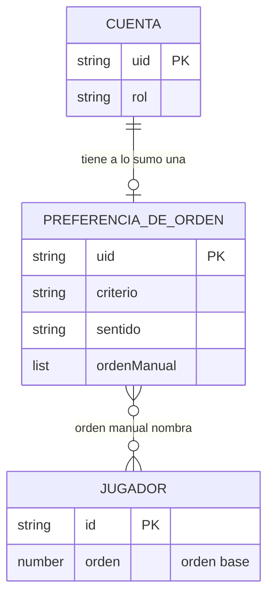

# Orden por columnas del listado de jugadores — Spec

> **Status:** Draft · **Date:** 2026-10-02 · **Owner:** Lucas Manoukian
>
> **Reviewers:** *pending*
>
> **Concept note:** [ORDEN_POR_COLUMNAS_CONCEPT.md](./ORDEN_POR_COLUMNAS_CONCEPT.md)
>
> **Implementation plan:** *not yet written*

> **Grounding evidence (`MD-25`).** Esta Spec se apoya en el ledger §6.5 *Sources &
> Origins* del Concept Note. Donde un `FR-*`/`NFR-*`/`TC-*` se apoya en una ubicación de
> código, un test o un contrato que el Concept Note no cubre, la cita va **en línea** en la
> sección donde se define el requisito. Las citas de `index.html` se verificaron contra
> `main` en `89f58b0` el 2026-10-02.

> **Declaración de reemplazo (gobernanza vigente en [`AGENTS.md`](../../AGENTS.md)).**
> Esta Spec reemplaza parte de
> [`ORDEN_JUGADORES_SPEC.md`](../orden-jugadores/ORDEN_JUGADORES_SPEC.md) (en adelante,
> **OJ**). Cada parte queda marcada como reemplazada en OJ, en la misma rama que esta Spec.
> Las líneas son las de OJ en `89f58b0`.
>
> | Parte de OJ | Línea | Qué deja de ser cierto | Reemplazado por |
> |---|---|---|---|
> | §2 Summary, en lo que dice del listado de Jugadores | 29-47 | un selector de cinco modos; Manual es un modo; orden y modo compartidos; arrastre sólo de admin | §2 de esta Spec |
> | §3.1, viñetas 1, 2, 4 y 5 | 53-63 | selector de cinco modos; arrastre sólo en Manual; `playersSortMode` compartido; respaldo sobre el valor global | §3.1 de esta Spec |
> | §3.2, non-goal de preferencias por usuario | 94-96 | "no per-user ordering preferences" | `FR-040`, `D-03` |
> | `TC-013` | 133-138 | `playersSortMode` se lee en toda sesión | `FR-048`: deja de leerse |
> | `TC-030`, en el listado de Jugadores | 158-162 | todo handler de arrastre y de cambio de orden empieza con `if(!isAdmin()) return;` | `FR-030`, `FR-045`. Sigue vigente para la convocatoria (§7.8 de OJ) |
> | `TC-040`, en el listado de Jugadores | 186-198 | toda mutación del orden pasa por `isAdmin()` | `TC-040` y `TC-041` de esta Spec. Sigue vigente para la convocatoria (`TC-042` de OJ) |
> | `TC-041`, en quién arrastra | 199-209 | el id arrastrado se busca "en el array del admin" | `FR-035`: la misma validación, para cualquier cuenta |
> | `US-01`, `US-04`, `US-05` | 260, 263, 264 | arrastre de admin; mismo orden para todos; el `jugador` ante el modo global | `US-05`, `US-03`, `US-04` de esta Spec |
> | §6 Glosario: "Modo de orden", "Orden manual", `playersSortMode` | 271, 272, 274 | definiciones del modelo compartido | §6 de esta Spec |
> | §6 Glosario: `orden`, en su uso | 273 | "used to sort the roster in Manual mode" | §6 "Orden base": ya nadie lo modifica arrastrando; es el punto de partida de cada cuenta |
> | `FR-001`, `FR-002`, `FR-003` | 396-406 | las opciones del selector y su único disparador | `FR-001`–`FR-004`, `FR-020`–`FR-027` |
> | `FR-010`, `FR-011`, `FR-012`, `FR-013` | 410-424 | arrastre sólo en Manual, sólo admin, escribe `orden` | `FR-030`–`FR-036` |
> | `FR-041` | 455-459 | reordenar con filtro: sólo admin, sólo en Manual | `FR-031`, que lo generaliza y lo conserva cuando el orden activo es Manual |
> | `FR-050`, `FR-051`, `FR-052` | 463-475 | `orden` y modo compartidos; respaldo sobre el valor global | `FR-040`–`FR-044`, `FR-048` |
> | `FR-053` | 476-478 | revierte el `orden` de `data/players` | `FR-047`: la misma conducta, sobre la preferencia de la cuenta |
> | `S-01` (con `S-01a`–`S-01e`), `S-04` (con `S-04a`), `S-05` (con `S-05a`), `S-06` (con `S-06a`, `S-06b`) | 548-562, 591-612, 614-626 | orden compartido, arrastre de admin en Manual, volver a elegir Manual | `S-01`–`S-07`, `S-20` de esta Spec |
> | §10.1, filas "Jugador" (en el ciclo de vida de `orden`) y `playersSortMode` | 673-674 | `orden` se actualiza al arrastrar; modo compartido | §10.1 de esta Spec |
> | `AC-16`, en el listado de Jugadores; `AC-20` | 719-724, 728-730 | verifican `TC-040` y `S-05a` de OJ | `AC-16`, `AC-20` de esta Spec |
> | `A-02`, `A-03`, `A-04` (en el arrastre) | 808-821 | arrastre sólo en Manual; orden compartido; arrastre sólo de admin | `D-03`, `D-04` (§3.3) |
>
> **No reemplaza** —y lo declara para que no se lea como contradicción—: `FR-020`–`FR-022`
> (Pts, sin puntaje al final, desempate) y `FR-030`–`FR-031` (posición, con la secuencia de
> [`DESGLOSE_POSICIONES_SPEC.md`](../desglose-posiciones/DESGLOSE_POSICIONES_SPEC.md)
> `FR-003`/`FR-032`), que esta Spec conserva y generaliza a las columnas nuevas; `FR-040`
> (el orden va después de búsqueda y filtros); `FR-060`, `FR-061` y `TC-031` (la migración
> y el `orden` de un jugador nuevo), que siguen alimentando el orden base (`FR-037`);
> `TC-001`, `TC-010`, `TC-011`, `TC-012`; `NFR-006` y `A-05`, cuyo alcance se extiende a la
> cuenta `jugador`; y todo §7.8 (convocatoria).

## 1. Purpose

Esta Spec define cómo se ordena el listado de la pestaña Jugadores: por cuál de seis
columnas, en qué sentido, con qué control en cada ancho de pantalla, cómo se entra al orden
manual arrastrando, y dónde y para quién se guarda el orden elegido. Está escrita para quien
derive el Implementation Plan y para quien verifique la entrega. El *por qué* vive en el
[Concept Note](./ORDEN_POR_COLUMNAS_CONCEPT.md); el *cómo* (módulos, nombres, ruta del
documento), en el Implementation Plan.

## 2. Summary

Hoy el listado de Jugadores se ordena desde un menú con cinco modos (Manual, Puntaje ↑/↓,
Posición ↑/↓), y el modo elegido es uno solo para todos. Con esta feature, cualquier cuenta
ordena por **Pos, Jugador, PJ, Goles, Asist o Pts** (Pts sólo admin), en los dos sentidos.
Desde 760px de ancho se ordena tocando el título de la columna; abajo de 760px, desde el
menú, que ya no muestra títulos. El orden **Manual** deja de ser una opción: cualquier
cuenta, admin o `jugador`, entra a él arrastrando una fila, con cualquier orden activo, y lo
que queda en pantalla pasa a ser **su** orden manual. Todo lo elegido —la columna, el
sentido y el orden manual— se guarda **por cuenta** en Firestore, en un documento que sólo
esa cuenta lee y escribe, y la acompaña entre recargas y dispositivos sin cambiar lo que ven
los demás. El listado sigue siendo una vista de consulta del plantel; lo que cambia es que
el orden pasa a ser de cada persona.

## 3. Scope

### 3.1 In scope

- Seis criterios de orden, cada uno en dos sentidos, sobre el resultado de la búsqueda y los
  filtros (`FR-001`–`FR-010`).
- Títulos de columna interactivos desde 760px; menú desplegable abajo de 760px; nunca los
  dos a la vez (`FR-020`–`FR-028`).
- Arrastre de filas para cualquier cuenta y con cualquier orden activo, que reemplaza el
  orden manual de esa cuenta (`FR-030`–`FR-038`).
- Una preferencia de orden por cuenta, en Firestore, direccionada por el `uid`, con su regla
  de seguridad nueva (`FR-040`–`FR-049`, `TC-040`).
- El retiro de `data/playersSortMode` de la aplicación y de las reglas (`FR-048`).
- Los títulos "Pos" (hoy vacío) y "Asist" (hoy "Asist.") (`FR-023`).

### 3.2 Out of scope / non-goals

- El sistema no ofrecerá ordenar por más de una columna a la vez; el desempate es siempre el
  alfabético existente (Concept §4).
- El sistema no ocultará, agregará ni reacomodará columnas del listado (Concept §4).
- El sistema no mostrará Pts, ni ofrecerá ordenar por Pts, a una cuenta que no es admin
  (Concept §4).
- El sistema no cambiará el orden de la cola de convocatoria de un partido (§7.8 de OJ)
  (Concept §4).
- El sistema no ofrecerá una forma de armar el orden manual sin arrastrar (teclado o lector
  de pantalla). Ordenar por columna sí es operable con teclado (`NFR-004`) (Concept §4).
- El sistema no ofrecerá ordenar por G E P (Concept §14; en [`Roadmap.md`](../../Roadmap.md) §3).
- El sistema no ofrecerá un control para volver a un orden manual anterior, ni "deshacer"
  un arrastre (`D-04`, R8, R9 del Concept).
- El sistema no avisará cuando falle guardar un cambio de columna (`FR-046`, `OPEN-Q-07`).
- El sistema no sincronizará en vivo la preferencia entre dos dispositivos abiertos de la
  misma cuenta: el otro dispositivo la ve en su próximo arranque. *(Nuevo en la Spec: hoy
  `playersSortMode` tampoco se sincroniza en vivo, `index.html:2127` lo lee sólo al
  arrancar.)*

### 3.3 Constraints inherited from the Concept Note

- **D-01** (seis criterios) — heredada: Pos, Jugador, PJ, Goles, Asist y Pts, en dos sentidos;
  Pts es el dato que hoy se llama Puntaje (`FR-001`).
- **D-02** (un control por ancho) — heredada: títulos desde 760px, menú abajo; nunca los dos
  (`FR-020`, `FR-024`, `FR-025`).
- **D-03** (preferencia por cuenta en Firestore) — heredada: un documento por cuenta,
  direccionado por el `uid`, que sólo esa cuenta lee y escribe (`FR-040`, `TC-014`, `TC-040`).
- **D-04** (Manual por cuenta, sólo por arrastre) — heredada, precisada según el §16 del
  Concept por las respuestas a `OPEN-Q-09`, `OPEN-Q-10` y `OPEN-Q-11` (`FR-031`, `FR-037`).
  Sin camino de vuelta al manual anterior ni "deshacer".
- **D-05** (sin partidos, al final) — heredada (`FR-007`).
- **D-06** (desempate alfabético) — heredada (`FR-005`).
- **D-07** (cada cuenta ordena por lo que puede ver; dos casos caen a Manual) — heredada
  (`FR-002`, `FR-043`, `FR-044`).
- **D-08** (el orden va sobre búsqueda y filtros) — heredada (`FR-010`).
- **D-09** (títulos "Pos" y "Asist") — heredada (`FR-023`).

**Preguntas del Concept Note resueltas en esta Spec** (respuestas del propietario del
2026-10-02):

| Pregunta | Resolución | Dónde |
|---|---|---|
| `OPEN-Q-01` | El primer toque ordena "lo más útil primero": PJ, Goles, Asist y Pts de mayor a menor; Jugador de la A a la Z; Pos en la secuencia de puestos (ARQ primero) | `FR-003` |
| `OPEN-Q-02` | Jugador ordena por el nombre como se muestra (nombre y apellido) | `FR-006` |
| `OPEN-Q-04` | `data/playersSortMode` se retira: no se lee, no se escribe, se saca su regla; nadie hereda su valor. El `orden` compartido se conserva congelado como orden base | `FR-048`, `FR-037` |
| `OPEN-Q-07` | Silencio, como hoy: no se avisa; el orden queda en pantalla hasta recargar | `FR-046` |
| `OPEN-Q-09` | Los jugadores ocultos quedan donde estaban en la lista completa, sin filtro, en el orden que estaba activo | `FR-031` |
| `OPEN-Q-10` | El orden manual inicial de cada cuenta es el `orden` compartido de hoy, congelado | `FR-037` |
| `OPEN-Q-11` | Un jugador nuevo aparece al final del orden manual de cada cuenta | `FR-037` |
| `OPEN-Q-12` | Manual no figura en el menú de ninguna forma; mientras la cuenta está en Manual, la casilla muestra "Ordenar por…", que no es una opción | `FR-027` |
| `OPEN-Q-13` | La regla exige la propia cuenta **y** un `rol` reconocido (`admin` o `jugador`) | `TC-040` |
| `OPEN-Q-14` | La mediana del arranque sube como máximo 50 ms | `NFR-001` |

`OPEN-Q-05` sigue abierta y pasa al Plan (§16).

## 4. Technical & architectural constraints

### 4.1 Platform / stack constraints

- **TC-001** — La implementación extiende `index.html` y el drag and drop nativo de HTML5
  que el listado ya usa (`index.html:2704-2706`, `index.html:2754-2790`); no agrega archivos,
  módulos ni librerías. Conserva `TC-001` de OJ.
- **TC-002** — La preferencia se persiste en Cloud Firestore; no se usa `localStorage` ni
  `sessionStorage` como fuente de datos ([`AGENTS.md`](../../AGENTS.md) → Stack y
  persistencia; descarta la Alternativa D del Concept).

### 4.2 Architectural / integration constraints

- **TC-010** — Todo criterio se resuelve en el mismo paso de orden que hoy sigue a búsqueda
  y filtros (`getFiltered` → `sortRoster`, `index.html:2612-2623`, `index.html:2575-2601`);
  no se agrega un camino de pintado paralelo. Conserva `TC-010` de OJ.
- **TC-011** — Pts se calcula con `computeAvg` y Pos con la secuencia de puestos compartida
  (`ordenDePuesto`), igual que hoy (`index.html:2580`, `index.html:2591`). Conserva
  `TC-011`/`TC-012` de OJ.
- **TC-012** — PJ, Goles y Asist se leen de los campos que el listado ya muestra
  (`partidosJugados`, `golesTotales`, `asistenciasTotales`, `index.html:2696-2703`); no se
  recalculan a partir de los partidos.
- **TC-013** — El resto del código accede a la preferencia sólo a través de la interfaz
  simple de guardar/leer; ninguna función de interfaz ni de orden conoce la ruta de
  Firestore ni el `uid` ([`AGENTS.md`](../../AGENTS.md) → Arquitectura desacoplada). Cómo
  entra en esa interfaz lo decide el Plan (`OPEN-Q-05`).
- **TC-014** — La preferencia vive en un documento por cuenta cuyo identificador es el `uid`
  de Firebase Auth, **fuera** de la colección `data`. No se agrega ninguna regla comodín
  sobre `data` (el contrato registra que no hay catch-all,
  [`firestore-rules.md`](../rol-en-el-token/contracts/firestore-rules.md) §2.3, Hallazgo B).
- **TC-015** — La lectura de la preferencia sale junto con las demás lecturas del arranque,
  no después de ellas (`iniciarLecturas`, `index.html:2088-2093`; misma lista en `loadAll`,
  `index.html:2107`). Es la condición estructural de `NFR-001`.

### 4.3 Compliance / regulatory constraints

Ninguna — la preferencia es un dato de interfaz asociado a una cuenta, sin datos regulados
(Concept §5.2, *Data sensitivity*).

### 4.4 Conventions to follow

- **TC-030** — El contrato de reglas
  ([`firestore-rules.md`](../rol-en-el-token/contracts/firestore-rules.md)) suma el bloque
  del documento por cuenta y saca el de `data/playersSortMode`, en §3 (tabla) y §4 (texto),
  en la misma rama que el código; la tabla `EQUIVALENCIA` de `tests/reglas.test.js`
  (`tests/reglas.test.js:288-302`) cambia en el mismo commit; las reglas se publican en
  staging y en producción como paso explícito (R1 del Concept).
- **TC-031** — Las listas de documentos del arranque que fija `tests/sesion.test.js`
  (`tests/sesion.test.js:261-271`) cambian en el mismo commit que `iniciarLecturas` y
  `loadAll`.
- **TC-032** — Toda función renombrada o borrada que figure en `DECLARACIONES` de
  `tests/harness.js` se actualiza ahí en el mismo commit ([`AGENTS.md`](../../AGENTS.md) →
  Estilo).
- **TC-033** — El título interactivo, el indicador de sentido y la casilla "Ordenar por…" se
  construyen con tokens y componentes de
  [`.claude/skills/football-app-design/`](../../.claude/skills/football-app-design/); el
  indicador sale de Lucide vía `Icon`. Si ninguno alcanza, la excepción se documenta en el
  Plan ([`AGENTS.md`](../../AGENTS.md) → Design system).
- **TC-034** — Los tests que satisfacen un `S-NN`, `NFR-NNN` o `TC-NNN` de esta Spec llevan
  el identificador con guion dentro de un string literal, nunca en un comentario
  ([`AGENTS.md`](../../AGENTS.md) → Tests).

### 4.5 Security constraints (`MD-31`)

CWE Top 25 consultado en vivo el 2026-10-02 en `https://cwe.mitre.org/top25/`: la edición
vigente es la **2025** (`https://cwe.mitre.org/top25/archive/2025/2025_cwe_top25.html`).
Esto salda la deuda `[UNVERIFIED]` del Concept §5.2.

- **TC-040** — La regla del documento de preferencia concede leer y escribir sólo si
  `request.auth.uid` es igual al `uid` del documento **y** `request.auth.token.rol` es
  `admin` o `jugador`. Ninguna otra cuenta lo lee ni lo escribe. **Defiende `CWE-862`
  *Missing Authorization***, **`CWE-639` *Authorization Bypass Through User-Controlled Key***
  (el `uid` de la ruta lo elige el cliente; la regla lo ata al token), **`CWE-863`
  *Incorrect Authorization*** y **`CWE-284` *Improper Access Control***. La exigencia de
  `rol` es la misma regla fail-closed del contrato §3, "Cuenta sin claim" (`OPEN-Q-13`).
  La lectura restringida al dueño **defiende `CWE-200` *Exposure of Sensitive Information***:
  el orden manual de un admin puede codificar el ranking de Pts (Concept §5.2).
- **TC-041** — La regla de `data/players` no cambia: la escribe sólo `admin`. Ningún arrastre,
  de ninguna cuenta, escribe `data/players`. **Defiende `CWE-862`**: abrirla para guardar un
  orden dejaría a una cuenta `jugador` editar o borrar jugadores (Concept §5.2, R6).
- **TC-042** — Lo leído de la preferencia se trata como no confiable: un criterio fuera del
  conjunto cerrado, un sentido distinto de ascendente/descendente, o un documento que no se
  puede interpretar, cae a Manual (`FR-043`); el orden manual se usa sólo como lista de ids,
  y se ignora todo id que no sea texto, que no corresponda a un jugador del plantel o que
  esté repetido (`FR-038`). **Defiende `CWE-20` *Improper Input Validation***.
- **TC-043** — Antes de aplicar un soltado, el sistema valida que el id arrastrado y el de la
  fila destino estén en la lista visible; si no, no hace nada (`FR-035`). Conserva `TC-041`
  de OJ para cualquier cuenta. **Defiende `CWE-20`**.
- **TC-044** — Ningún valor leído de la preferencia se inserta como HTML: el criterio y el
  sentido sólo eligen entre rótulos fijos, y el orden manual sólo elige qué jugadores pintar,
  cuyos textos se escapan como siempre ([`AGENTS.md`](../../AGENTS.md) → Estilo). **Defiende
  `CWE-79` *Cross-site Scripting***.
- **`CWE-770` *Allocation of Resources Without Limits*** — aceptado, no mitigado: una cuenta
  puede escribir en su documento un valor de hasta el máximo de Firestore y alargar su propio
  arranque; el daño queda en esa cuenta (Concept §5.2), y lo que se pinta está acotado por el
  plantel, porque los ids desconocidos se ignoran (`TC-042`).
- **`CWE-306` *Missing Authentication*** — cubierto por `TC-040`: la igualdad con
  `request.auth.uid` exige sesión.
- **`CWE-352` CSRF, `CWE-918` SSRF** — no aplican; la feature no agrega endpoints ni
  peticiones del lado del servidor: escribe con el SDK de Firebase, como el resto.
- **`CWE-89`, `CWE-78`, `CWE-77`, `CWE-94`** (inyección) — no aplican; no hay SQL, shell ni
  ejecución de código dinámico.
- **`CWE-787`, `CWE-125`, `CWE-416`, `CWE-120`, `CWE-121`, `CWE-122`, `CWE-476`** (memoria) —
  no aplican; JavaScript en el navegador, sin manejo manual de memoria.
- **`CWE-22`, `CWE-434`** — no aplican; no hay rutas de archivo ni subidas.
- **`CWE-502` *Deserialization of Untrusted Data*** — no aplica como deserialización
  peligrosa: interpretar el documento no ejecuta nada; una falla al interpretarlo cae a
  Manual por `TC-042`.

## 5. Users & use cases

### 5.1 Personas / actors

| Actor | Description | Primary need |
|---|---|---|
| Admin | Cuenta con `rol` `admin` (`index.html:1483`) | Ordenar por cualquiera de las seis columnas para consultar, y armar su propio orden manual, sin cambiar lo que ven otros |
| Jugador | Cuenta con `rol` `jugador`; no ve Pts | Ordenar por las cinco columnas que ve, y que el orden se recuerde (hoy no se guarda, Concept Pain 4) |

### 5.2 User stories

| ID | Story | Implements |
|---|---|---|
| US-01 | Como cualquier cuenta, quiero ordenar por Goles, Asist o PJ para ver al primero arriba sin recorrer la lista. | FR-001, FR-003, FR-007 |
| US-02 | Como cualquier cuenta en pantalla ancha, quiero tocar el título de la columna para ordenar, y tocarlo otra vez para invertir. | FR-004, FR-020, FR-022 |
| US-03 | Como cualquier cuenta, quiero que mi orden se mantenga al recargar y en otro dispositivo, sin cambiar el de los demás. | FR-040, FR-041, FR-049 |
| US-04 | Como `jugador`, quiero que el orden que elijo se guarde de verdad. | FR-002, FR-045 |
| US-05 | Como cualquier cuenta, quiero arrastrar una fila para armar mi propio orden, sin elegir antes un modo. | FR-030, FR-031, FR-032, FR-033 |
| US-06 | Como cualquier cuenta en el celular, quiero ordenar desde el menú, porque no hay títulos. | FR-024, FR-026, FR-027 |

## 6. Glossary

| Term | Definition |
|---|---|
| Columna ordenable | Una de Pos, Jugador, PJ, Goles, Asist y Pts. G E P no es ordenable. |
| Criterio | Qué determina el orden: una columna ordenable, o Manual. |
| Sentido | Ascendente o descendente. Sólo existe cuando el criterio es una columna. |
| Orden activo | El par criterio + sentido que gobierna lo que la cuenta ve ahora. |
| Primer sentido | El sentido que aplica el primer toque sobre una columna (`FR-003`). |
| Manual | El criterio en el que la lista sigue el orden manual de la cuenta. No es una opción de ningún control; se entra arrastrando (`D-04`). |
| Orden manual (de la cuenta) | La secuencia de jugadores que una cuenta armó con su último arrastre. Es de esa cuenta y de nadie más. |
| Orden base | El `orden` de cada jugador en `data/players`, que hoy es el orden manual compartido y desde esta feature nadie modifica arrastrando. Es el punto de partida de cada cuenta (`FR-037`). Un jugador sin `orden` va después, en alfabético (`index.html:2596-2601`). |
| Preferencia de orden | El documento de una cuenta con su orden activo y su orden manual. |
| Sin partidos | Jugador con `partidosJugados` vacío o cero: nunca jugó un partido finalizado (`index.html:2687`). |
| Alfabético existente | Apellido y después nombre (`alfabetico`, `index.html:2563`). |
| Nombre visible | Nombre y después apellido, como lo muestra la fila (`fullName`, `index.html:1858`). |
| Banda ancha / angosta | Ancho de ventana ≥ 760px / < 760px (`index.html:223`). |

## 7. Functional requirements

### 7.1 Criterios y sentido

- **FR-001** — El sistema ofrecerá como criterios las columnas Pos, Jugador, PJ, Goles, Asist
  y Pts, cada una en sentido ascendente y descendente (`D-01`).
- **FR-002** — Where la cuenta no es admin, el sistema no ofrecerá Pts en ningún control
  (`D-07`).
- **FR-003** — When una cuenta elige una columna distinta de la activa, el sistema la
  ordenará en su primer sentido: descendente en PJ, Goles, Asist y Pts; ascendente (A→Z) en
  Jugador; ascendente (la secuencia de puestos, ARQ primero) en Pos (`OPEN-Q-01`).
- **FR-004** — When una cuenta elige la columna que ya está activa, el sistema invertirá el
  sentido.
- **FR-005** — If dos jugadores empatan en el criterio activo, then el sistema los
  desempatará con el alfabético existente, en sentido ascendente, cualquiera sea el sentido
  activo (`D-06`; conserva `FR-022`/`FR-031` de OJ y el comparador de `index.html:2575-2601`).
- **FR-006** — While el criterio es Jugador, el sistema ordenará por el nombre visible
  (`OPEN-Q-02`).
- **FR-007** — While el criterio es PJ, Goles o Asist, el sistema ubicará a todo jugador sin
  partidos después de todos los demás, en los dos sentidos (`D-05`).
- **FR-008** — While el criterio es Pts, el sistema ubicará a todo jugador sin puntaje después
  de todos los demás, en los dos sentidos (conserva `FR-021` de OJ).
- **FR-009** — While el criterio es Pos, el sistema ordenará por la secuencia de puestos
  vigente, o su inversa (conserva `FR-030` de OJ con la secuencia de `DESGLOSE_POSICIONES_SPEC.md`
  `FR-003`/`FR-032`).
- **FR-010** — El sistema aplicará el orden activo sobre el resultado de la búsqueda y los
  filtros (`D-08`; conserva `FR-040` de OJ).

### 7.2 Controles por ancho

- **FR-020** — While la ventana está en la banda ancha, el sistema mostrará el título de cada
  columna ordenable como un control que se activa con clic, toque, Enter o Espacio y aplica
  `FR-003`/`FR-004` (`D-02`).
- **FR-021** — El sistema no hará interactivo el título de G E P.
- **FR-022** — While el criterio es una columna, el sistema mostrará junto a su título un
  indicador del sentido, y ningún indicador en las demás.
- **FR-023** — El sistema rotulará la columna de posición "Pos" y la de asistencias "Asist",
  sin punto (`D-09`; hoy vacío y "Asist.", `index.html:2673`, `index.html:2678`).
- **FR-024** — While la ventana está en la banda angosta, el sistema mostrará un menú
  desplegable de orden (`D-02`).
- **FR-025** — While la ventana está en la banda ancha, el sistema no mostrará el menú
  desplegable de orden (`D-02`).
- **FR-026** — El menú ofrecerá, por cada columna ordenable que la cuenta puede usar, en el
  orden en que aparecen en pantalla (Pos, Jugador, PJ, Goles, Asist, Pts), una opción por
  sentido, primero la del primer sentido; ninguna opción será Manual (`D-04`).
- **FR-027** — While el criterio es Manual, la casilla del menú mostrará "Ordenar por…", que
  no figura entre sus opciones, y ningún título mostrará indicador de sentido (`OPEN-Q-12`).
- **FR-028** — When la ventana cruza los 760px, el sistema conservará el orden activo y el
  control que aparece lo reflejará.

### 7.3 Arrastre y orden manual

- **FR-030** — El sistema hará arrastrable toda fila del listado, para cualquier cuenta, con
  cualquier orden activo y en los dos anchos (`D-04`; reemplaza `FR-010`, `FR-012`, `FR-013`
  de OJ).
- **FR-031** — When una cuenta suelta una fila sobre otra, el sistema tomará la lista
  **completa** del plantel —sin búsqueda ni filtros— en el orden activo, y ubicará la fila
  arrastrada inmediatamente antes de la fila destino, como hoy (`index.html:2776-2778`)
  (`OPEN-Q-09`).
- **FR-032** — When se completa `FR-031`, el sistema guardará esa lista como el orden manual
  de la cuenta, reemplazando el anterior (`D-04`).
- **FR-033** — When se completa `FR-031`, el sistema pasará el criterio de la cuenta a Manual.
- **FR-034** — If una fila se suelta sobre sí misma, then el sistema no cambiará el orden ni
  escribirá nada.
- **FR-035** — If el id arrastrado o el de la fila destino no están en la lista visible, then
  el sistema no cambiará el orden ni escribirá nada (`TC-043`).
- **FR-036** — El sistema no escribirá `data/players` como efecto de un arrastre (`TC-041`).
- **FR-037** — While el criterio es Manual, el sistema mostrará primero, en ese orden, los
  jugadores que figuran en el orden manual de la cuenta, y después todos los demás en el orden
  base. Esto cubre a la cuenta que nunca arrastró (todos en el orden base, `OPEN-Q-10`) y al
  jugador agregado después de un arrastre (al final, `OPEN-Q-11`).
- **FR-038** — If el orden manual de la cuenta contiene un id que no es texto, que no es de
  ningún jugador del plantel o que ya apareció antes en la lista, then el sistema lo ignorará
  (`TC-042`).

### 7.4 Persistencia

- **FR-040** — El sistema persistirá, por cuenta, el orden activo y el orden manual en un
  documento que sólo esa cuenta lee y escribe (`D-03`, `TC-014`, `TC-040`).
- **FR-041** — When la aplicación arranca con sesión, el sistema leerá la preferencia de la
  cuenta y la aplicará antes de mostrar el listado (`TC-015`).
- **FR-042** — If la cuenta no tiene preferencia guardada, then el sistema mostrará Manual.
- **FR-043** — If la preferencia tiene un criterio o un sentido que el sistema no reconoce, o
  no se puede interpretar, then el sistema mostrará Manual sin error visible y sin escribir la
  preferencia (`D-07` b, `TC-042`).
- **FR-044** — If la preferencia es Pts y la cuenta no es admin, then el sistema mostrará
  Manual sin error visible y sin escribir la preferencia (`D-07` a; conserva `FR-052` de OJ
  sobre la preferencia propia).
- **FR-045** — When una cuenta elige una columna o un sentido, el sistema mostrará el orden
  nuevo sin esperar a que termine de guardarse, y lo persistirá en su preferencia.
- **FR-046** — If falla guardar un cambio de columna o de sentido, then el sistema no avisará
  y conservará el orden en pantalla hasta que la cuenta recargue (`OPEN-Q-07`; R4 del Concept,
  aceptado).
- **FR-047** — If falla guardar un arrastre, then el sistema mostrará el aviso de error de la
  app (`window.__showToast(…, 'error')`) y volverá a mostrar el orden activo y el orden manual
  que la cuenta tenía antes del arrastre (conserva `FR-053` de OJ).
- **FR-048** — El sistema no leerá ni escribirá `data/playersSortMode`; su regla se retira del
  contrato y de las dos consolas (`OPEN-Q-04`; `index.html:2089`, `2107`, `2127`, `2886`).
- **FR-049** — El sistema no cambiará lo que ve una cuenta como efecto de lo que hace otra
  cuenta con su orden (`D-03`, `D-04`).

## 8. Non-functional requirements

| ID | Category | Requirement |
|---|---|---|
| NFR-001 | Performance | La mediana del "arranque completo" de `tools/medir-arranque.js --caso=vigente --corridas=5`, contra staging, sube **como máximo 50 ms** respecto de la misma medición en `main` antes de la feature (línea de base ~620 ms de lectura, Roadmap §3) (`OPEN-Q-14`). |
| NFR-002 | Performance | Un arranque hace **exactamente una** lectura de Firestore más que antes de la feature (la preferencia) y **una menos** sobre `data` (`playersSortMode`), medido con `tools/medir-arranque.js --lecturas`. |
| NFR-003 | Performance | Un cambio de criterio o un soltado repinta el listado sin esperar a la red (`FR-045`, `FR-047`); con 500 jugadores, ordenar en memoria la lista completa tarda **≤ 50 ms** en el comparador, medido en Node sobre `sortRoster` con un plantel sintético. |
| NFR-004 | Accessibility | Cada título ordenable es un `button` dentro de su celda; la columna activa lleva `aria-sort` (`ascending`/`descending`) y es la **única** que lo lleva; en Manual ninguna lo lleva; los títulos se alcanzan con Tab y se activan con Enter y Espacio; el foco es visible (WAI-ARIA APG *Sortable Table*, Concept §6.5; WCAG 2.1 AA). El arrastre sigue sin alternativa de teclado (`NFR-006` y `A-05` de OJ, extendidos a `jugador`). |
| NFR-005 | Responsive | En 360, 759, 760, 768 y 1200px, con rol admin y con rol `jugador`, la pestaña Jugadores no produce scroll horizontal (`scrollWidth === clientWidth`) y ningún elemento —incluidos "Pos" con su indicador y "Pts" con el suyo— tiene el borde derecho fuera del viewport (`node tests/layout.test.js`; [`AGENTS.md`](../../AGENTS.md) → Responsive). |
| NFR-006 | Security | Ver §4.5. Ninguna cuenta lee ni escribe la preferencia de otra, verificado contra staging (`TC-040`). |
| NFR-007 | Observability | Ninguna capa nueva: la app no tiene telemetría (`NFR-005` de OJ). Las señales de `NFR-001`/`NFR-002` son la salida de `tools/medir-arranque.js`. |
| NFR-008 | i18n | Ninguna: la app es sólo en español. |
| NFR-009 | Scalability | Hasta ~500 jugadores por grupo ([`AGENTS.md`](../../AGENTS.md)); el orden manual de una cuenta tiene a lo sumo un id por jugador. |

## 9. System behaviour & scenarios

### 9.1 Happy path scenarios

#### Scenario S-01 — Ordenar por Goles tocando el título (covers FR-001, FR-003, FR-004, FR-005, FR-007, FR-020, FR-022, FR-045)

- **Given** un admin en Jugadores a 1200px, en Manual, con Ana Ríos (5 goles), Beto Ríos (5 goles),
  Ciro Paz (2 goles) y Dani Sosa, que nunca jugó
- **When** toca el título "Goles"
- **Then** la lista queda Ana, Beto, Ciro, Dani: el desempate entre Ana y Beto es el
  alfabético existente, y Dani queda al final
- **And** "Goles" muestra el indicador de descendente y ningún otro título lo muestra
- **When** toca "Goles" otra vez
- **Then** la lista queda Ciro, Ana, Beto, Dani: Dani sigue al final y el desempate sigue
  siendo A→Z

**Variants:**

- `S-01a [boundary]` — todos los visibles tienen los mismos goles → el orden es el alfabético existente, en los dos sentidos.
- `S-01b [boundary]` — ningún visible jugó → la lista es el alfabético existente.
- `S-01c [boundary]` — con Goles activo, toca "Jugador" → ordena A→Z por nombre visible (su primer sentido), no Z→A.
- `S-01d [boundary]` — toca "Pos" → ordena por la secuencia de puestos, ARQ primero.
- `S-01e [boundary]` — un jugador con PJ 3 y 0 goles queda antes que Dani (sin partidos) en los dos sentidos: 0 es un dato, "sin partidos" no.
- `S-01f [property]` — para cualquier plantel y cualquier columna, el sentido descendente invierte al ascendente entre los jugadores con dato, conserva a los sin dato al final y desempata A→Z en los dos.
- `S-01g [failure]` — falla guardar la preferencia → no hay aviso, la lista queda ordenada por Goles; al recargar se ve el orden guardado antes (`FR-046`).
- `S-01h [boundary]` — Jugador con "Ana Zeta" y "Beto Alfa" → A→Z pone primero a Ana (nombre visible), aunque por apellido iría Beto (`FR-006`).

#### Scenario S-02 — Ordenar desde el menú en el celular (covers FR-024, FR-025, FR-026, FR-027, FR-028)

- **Given** una cuenta `jugador` a 390px, en Manual
- **Then** no hay fila de títulos, el menú muestra "Ordenar por…" y sus opciones son Pos,
  Jugador, PJ, Goles y Asist, dos por columna, primero la del primer sentido, sin Pts ni Manual
- **When** elige Asist descendente
- **Then** la lista queda ordenada por asistencias, de mayor a menor, y el menú muestra esa opción

**Variants:**

- `S-02a [boundary]` — a 759px se ve el menú y no los títulos; a 760px se ven los títulos y no el menú.
- `S-02b [boundary]` — con Asist descendente, la ventana pasa de 700 a 900px → "Asist" muestra el indicador de descendente y la lista no cambia; de vuelta a 700, el menú muestra Asist descendente.
- `S-02c [boundary]` — una cuenta admin a 390px → el menú incluye Pts en los dos sentidos.

#### Scenario S-03 — El orden acompaña a la cuenta y no a las demás (covers FR-040, FR-041, FR-049)

- **Given** dos cuentas admin, A y B, las dos en Manual
- **When** A ordena por Goles en la computadora
- **And** después abre la app en el teléfono
- **Then** el teléfono de A muestra la lista por Goles descendente
- **And** B, al recargar, sigue viendo Manual

**Variants:**

- `S-03a [concurrency]` — A tiene la app abierta en dos dispositivos y ordena por PJ en uno y por Goles en el otro → al recargar cualquiera, gana la última escritura; B no se entera (R11 del Concept).
- `S-03b [concurrency]` — A ordena por Goles con la app abierta en el teléfono → el teléfono no cambia hasta su próximo arranque (§3.2).
- `S-03c [boundary]` — una cuenta sin preferencia guardada (el primer día) → ve Manual, en el orden base, igual que veía el orden compartido antes de la feature (`FR-042`, `FR-037`).

#### Scenario S-04 — Una cuenta jugador ordena y su orden se guarda (covers FR-002, FR-045, FR-041)

- **Given** una cuenta `jugador` a 1200px
- **Then** la fila de títulos no tiene "Pts"
- **When** toca "Asist" y recarga
- **Then** la lista sigue ordenada por Asist descendente (hoy vuelve al orden anterior, Concept Pain 4)

**Variants:**

- `S-04a [failure]` — la preferencia guardada de la cuenta `jugador` es Pts (se le bajó el rol, o la escribió fuera de la interfaz) → ve Manual, sin error, y la preferencia sigue diciendo Pts (`FR-044`).
- `S-04b [failure]` — la preferencia tiene un criterio desconocido, un sentido desconocido o un contenido que no se puede interpretar → ve Manual, sin error, y la preferencia no se reescribe (`FR-043`).

#### Scenario S-05 — Arrastrar con un orden por columna arma el orden manual (covers FR-030, FR-031, FR-032, FR-033, FR-037)

- **Given** un admin con la lista por Goles descendente: Ana, Beto, Ciro, Dani, Eva
- **When** arrastra a Dani y lo suelta sobre Beto
- **Then** la lista queda Ana, Dani, Beto, Ciro, Eva
- **And** ningún título muestra indicador de sentido (en el celular, el menú muestra "Ordenar por…")
- **And** al recargar ve esa misma lista, en Manual

**Variants:**

- `S-05a [boundary]` — suelta a Dani sobre sí mismo → nada cambia y no se escribe nada (`FR-034`).
- `S-05b [boundary]` — con Goles descendente **y** el filtro de puesto en DEL, que deja visibles a Ciro y Eva, arrastra a Eva sobre Ciro → su orden manual es Ana, Beto, Eva, Ciro, Dani: los ocultos quedan donde estaban por Goles (`FR-031`).
- `S-05c [boundary]` — ya en Manual, con una búsqueda que deja visibles a Beto y Eva, arrastra a Eva sobre Beto → los ocultos conservan su lugar relativo (lo que hoy fija `FR-041` de OJ).
- `S-05d [boundary]` — después del arrastre toca "PJ" → la lista se ordena por PJ; no hay control que vuelva al orden manual, y el próximo arrastre lo reemplaza (R8 del Concept, aceptado).
- `S-05e [failure]` — falla guardar el arrastre → aviso de error, y la lista vuelve a Goles descendente con el orden manual anterior (`FR-047`).
- `S-05f [failure]` — el id arrastrado ya no está en la lista visible (se borró el jugador, o el dato se manipuló) → nada cambia y no se escribe nada (`FR-035`).
- `S-05g [property]` — para cualquier plantel, orden activo, filtro y par arrastrado/destino, el orden manual resultante contiene a cada jugador del plantel exactamente una vez.
- `S-05h [boundary]` — a 390px, arrastrar en el renglón apilado produce el mismo resultado que a 1200px.

#### Scenario S-06 — Una cuenta jugador arrastra sin tocar el plantel (covers FR-030, FR-036, FR-049)

- **Given** una cuenta `jugador` y una cuenta admin, las dos en Manual con el mismo orden base
- **When** el `jugador` arrastra a un jugador al primer lugar
- **Then** el `jugador` ve su lista con ese jugador primero, también al recargar
- **And** `data/players` no recibe ninguna escritura
- **And** el admin, al recargar, sigue viendo el orden base

Variants: none — single-path scenario. Sus fallas son `S-05e`/`S-05f`, que no dependen del
rol, y el intento de escribir `data/players` es `S-20d`.

#### Scenario S-07 — El orden manual sigue al plantel (covers FR-037, FR-038)

- **Given** una cuenta cuyo orden manual es Beto, Ana, Ciro
- **When** un admin agrega a Fede y borra a Ciro
- **Then** la cuenta, en Manual, ve Beto, Ana, Fede

**Variants:**

- `S-07a [boundary]` — una cuenta que nunca arrastró → ve el orden base, con Fede al final (su `orden` lo ubica último, `FR-061` de OJ).
- `S-07b [failure]` — el orden manual guardado tiene ids repetidos, ids que no son texto o ids que no existen → se ignoran y cada jugador aparece una sola vez (`FR-038`).
- `S-07c [boundary]` — el orden manual guardado está vacío → la cuenta ve el orden base.

#### Scenario S-08 — Ordenar con el teclado (covers FR-020, NFR-004)

- **Given** un admin a 1200px que navega con el teclado
- **When** llega con Tab al título "PJ" y aprieta Enter
- **Then** la lista se ordena por PJ descendente
- **And** el encabezado de PJ tiene `aria-sort="descending"` y ningún otro encabezado tiene `aria-sort`
- **When** aprieta Espacio
- **Then** el sentido se invierte y `aria-sort` pasa a `ascending`

**Variants:**

- `S-08a [property]` — en cualquier secuencia de cambios de criterio y arrastres, a lo sumo un encabezado tiene `aria-sort`, y ninguno en Manual.
- `S-08b [boundary]` — el título de G E P no se alcanza con Tab ni reacciona a Enter (`FR-021`).

#### Scenario S-09 — El encabezado entra en todos los anchos (covers FR-023, NFR-005)

- **Given** la pestaña Jugadores con rol admin
- **When** se mide a 760px con el orden activo en Pos, y después en Pts
- **Then** "Pos" con su indicador y "Pts" con el suyo quedan dentro de su columna y del viewport, sin scroll horizontal

**Variants:**

- `S-09a [boundary]` — lo mismo con rol `jugador`, cuya grilla no tiene Pts ni acciones.
- `S-09b [boundary]` — a 360px y 759px, con el menú mostrando la opción de texto más largo, no hay scroll horizontal.

### 9.2 Edge cases

Ninguno sin escenario padre: los bordes viven como variantes en §9.1.

### 9.3 Failure / unwanted-behaviour scenarios

#### Scenario S-20 — Una cuenta intenta tocar la preferencia de otra (covers TC-040, TC-041, NFR-006)

- **Given** las cuentas de staging admin y `jugador`, cada una con su preferencia
- **When** la cuenta `jugador` intenta escribir la preferencia de la cuenta admin
- **Then** Firestore lo rechaza y la preferencia del admin no cambia

**Variants:**

- `S-20a [failure]` — la cuenta `jugador` intenta leer la preferencia del admin → rechazado.
- `S-20b [failure]` — la cuenta admin intenta leer o escribir la del `jugador` → rechazado.
- `S-20c [failure]` — una cuenta sin claim `rol` intenta leer o escribir **su propia** preferencia → rechazado (`OPEN-Q-13`).
- `S-20d [failure]` — la cuenta `jugador` intenta escribir `data/players` → rechazado, como hoy.
- `S-20e [failure]` — una petición sin sesión intenta leer o escribir cualquier preferencia → rechazado.
- `S-20f [boundary]` — cada cuenta lee y escribe la suya → concedido.

## 10. Data model & external contracts

### 10.1 Domain entities (conceptual)

| Entity | Purpose | Key attributes (conceptual) | Lifecycle |
|---|---|---|---|
| Preferencia de orden (nueva) | El orden de una cuenta | dueño (`uid`); criterio (una columna o Manual); sentido; orden manual (lista de ids de jugador) | Se crea la primera vez que la cuenta elige una columna o arrastra; la reescribe cada cambio de esa cuenta; sin vencimiento |
| Cuenta (existente, Firebase Auth) | Identidad que da dueño a la preferencia | `uid`, claim `rol` | Sin cambios |
| Jugador (existente) | Ficha del plantel | `orden` pasa a ser el orden base: nadie lo modifica arrastrando; se sigue asignando al crear (`FR-061` de OJ) | Sin cambios de esquema |
| `playersSortMode` (existente) | — | — | **Se retira** (`FR-048`): sin lector ni escritor ni regla. El documento puede quedar en la base sin efecto |

#### 10.1.1 Entity-relationship diagram

### 10.2 External APIs / events the feature consumes

| Source | Contract | Direction | Notes |
|---|---|---|---|
| Firebase Auth | `uid` de la cuenta y claim `rol` del token | inbound | Ya en uso; el `uid` direcciona el documento (`TC-014`) |
| Cloud Firestore | Documento de preferencia de la cuenta | inbound / outbound | Última escritura gana dentro de la misma cuenta (`S-03a`) |
| Cloud Firestore | `data/players` | inbound | Sólo lectura para esta feature (`TC-041`) |

### 10.3 External APIs / events the feature exposes

| Endpoint / event | Inputs | Outputs | Notes |
|---|---|---|---|
| Regla de Firestore del documento de preferencia | `request.auth.uid`, `request.auth.token.rol`, `uid` del documento | concede o niega leer y escribir | Nueva (`TC-040`). Entra al contrato de reglas y a `tests/reglas.test.js` (`TC-030`) |
| Regla de `data/playersSortMode` | — | — | Se retira (`FR-048`) |

## 11. Acceptance criteria

### 11.1 Functional acceptance

- **AC-01** — `S-01` a `S-09` y sus variantes pasan contra un arranque de la app con datos
  de prueba (covers `FR-001`–`FR-049`).
- **AC-02** — El primer día, con los datos de staging copiados de producción, una cuenta sin
  preferencia ve el listado en el mismo orden que el orden manual compartido de antes de la
  feature (`S-03c`).
- **AC-03** — Con las dos cuentas de staging: la cuenta `jugador` ordena por Asist, recarga y
  lo encuentra igual; arrastra una fila, recarga y la encuentra donde la dejó; la cuenta admin
  no ve ninguno de los dos cambios (`S-04`, `S-06`; Concept §12).

### 11.2 Non-functional acceptance

- **AC-10** — `NFR-001` verificado con `tools/medir-arranque.js --caso=vigente --corridas=5`
  antes y después, sobre la misma red, con las dos medianas registradas en el Plan.
- **AC-11** — `NFR-002` verificado con `tools/medir-arranque.js --lecturas`.
- **AC-12** — `NFR-003` verificado con un test en Node que mide `sortRoster` sobre 500
  jugadores sintéticos en cada criterio y sentido.
- **AC-13** — `NFR-004` verificado por `S-08` y sus variantes.
- **AC-14** — `NFR-005` verificado por `node tests/layout.test.js` con escenarios nuevos para
  `S-09`, vistos fallar al menos una vez antes del arreglo ([`AGENTS.md`](../../AGENTS.md)).

### 11.3 Constraint compliance

- **AC-15** — `TC-001`, `TC-002`, `TC-010`–`TC-013`, `TC-015` y `TC-033` verificados por
  revisión de código contra las ubicaciones citadas; `TC-015` además por `tests/sesion.test.js`
  (las lecturas del arranque salen juntas).
- **AC-16** — `TC-040`, `TC-041` y `TC-014` verificados por `REGLAS_STRICT=1 node
  tests/reglas.test.js` contra staging, con las variantes de `S-20`; y por revisión de que el
  texto de §4 del contrato no agrega un `match` comodín sobre `data`.
- **AC-17** — `TC-030` verificado por revisión: el contrato de reglas tiene el bloque nuevo y
  no el de `playersSortMode`, la tabla `EQUIVALENCIA` coincide con su §3, y el §1 del contrato
  registra la publicación en staging y en producción.
- **AC-18** — `TC-042`, `TC-043` y `TC-044` verificados por tests unitarios de `S-04b`,
  `S-05f` y `S-07b`, y por un test de escapado sobre una preferencia con texto HTML.
- **AC-19** — `TC-031`, `TC-032` y `TC-034` verificados porque `node tests/sesion.test.js` y
  `node tests/motor.test.js` pasan, y por los gates de `grep` del Plan.

### 11.4 Negative / safety acceptance

- **AC-20** — `S-20` y sus variantes no modifican ninguna preferencia ajena ni `data/players`,
  observado contra staging con `tests/reglas.test.js`.
- **AC-21** — Ningún camino del arrastre llama a la escritura de `data/players`: verificado
  por un test sobre la fuente y por `S-06` contra staging.

### 11.5 Test & traceability obligations

- **AC-50** — Every scenario in §9 — including every enumerated variant (`S-NNa`, `S-NNb`, …) — has at least one runnable test referenced in the Plan's §12.1 *Scenario Traceability Matrix*, with the scenario or variant ID embedded via a **structurally-anchored** binding (a framework mark, an `it()` / `t.Run()` / `test_case` string argument, or a function-name binding with the §12.1 normalising regex — *not* in a comment or docstring; those false-match the `T-N.D8` grep gate). The §16 *AC coverage* matrix should also cite the scenarios or scenario ranges each `AC-*` aggregates, so the roll-up is readable — this half is **reviewer-checked, not mechanically gated**. Additionally, every scenario heading in §9 is followed by either a `Variants:` block enumerating its shifts or the explicit `Variants: none — single-path scenario` declaration. Mechanically enforced by Plan `T-N.D8` **and** `T-N.D8b`. *En este repositorio el binding es el de [`AGENTS.md`](../../AGENTS.md) → Tests (`TC-034`). Los escenarios que dependen de las reglas vivas (`S-03`, `S-04`, `S-06`, `S-20`) se ligan a `tests/reglas.test.js`; los de layout, a un campo `spec:` de `tests/layout.test.js`.*
- **AC-51** — Every NFR in §8 with a quantified target has a measurement test referenced in the Plan's §12, with the NFR ID embedded similarly. *Aplica a `NFR-001`, `NFR-002`, `NFR-003` y `NFR-005`.*
- **AC-52** — Every TC in §4 has a §11.3 compliance check AND a corresponding entry in the Plan's §12. Where the TC is mechanically verifiable, the §12 entry references the runnable verification with the TC ID embedded in the test name or tag. Where the TC is inherently non-mechanical, the §12 entry names the reviewer / review checklist that verifies it. Mechanically gated by Plan `T-N.D10` **and** `T-N.D10b`.
- **AC-53** — The change has at least one `IMP-*` row in the Plan's §12.2 *Impact Traceability* matrix for every materially-affected scope (`code` / `system` / `business` / `external`). Mechanically gated by Plan `T-N.D15`. *Como mínimo: `code` (el comparador, el encabezado, el arrastre, las lecturas del arranque), `system` (reglas nuevas publicadas a mano en dos proyectos; retiro de `playersSortMode`) y `business` (el orden deja de ser común; el `jugador` gana el arrastre; el manual anterior se pierde al elegir una columna).*
- **AC-54** — Every NFR in §8 with a quantified target has at least one `OBS-*` row in the Plan's §11 *Observability*, with the NFR ID embedded in the row's *Binds to* column. Mechanically gated by Plan `T-N.D16`. *Sin telemetría (`NFR-007`), la señal es la salida de `tools/medir-arranque.js`, de `tests/layout.test.js` o del test de `NFR-003`.*
- **AC-55** — Every direct and transitive dependency in the branch's committed lockfile passes a current-advisory-DB check with **no unwaived advisory**; any advisory the team accepts is cited in the Plan's §14 as an `R-*` row with a rationale. A branch with no lockfile to scan declares `Supply-chain: none — <reason>` in Plan §5 and satisfies this vacuously. Mechanically gated by Plan `T-N.D20`. *El repositorio no versiona lockfile y la feature no agrega dependencias ([`AGENTS.md`](../../AGENTS.md) → Dependencias).*

## 12. Success metrics

La app no tiene analítica (`NFR-007`); las señales se observan a mano con las cuentas de
staging y de producción (Concept §12).

| Metric | Target | Measurement |
|---|---|---|
| Encontrar al goleador, al máximo asistidor y al que más jugó | Un toque o una opción del menú | Prueba manual con cada rol |
| Aislamiento entre cuentas | Ningún cambio de una cuenta visible en otra | `AC-03` con las dos cuentas |
| El `jugador` conserva su orden | Al recargar, el orden elegido | `AC-03` |
| Arranque | Mediana +≤ 50 ms | `AC-10` |

## 13. Dependencies

- **Upstream services / specs:** [`ORDEN_JUGADORES_SPEC.md`](../orden-jugadores/ORDEN_JUGADORES_SPEC.md)
  (reemplazada en parte, ver Declaración de reemplazo);
  [`DESGLOSE_POSICIONES_SPEC.md`](../desglose-posiciones/DESGLOSE_POSICIONES_SPEC.md)
  (secuencia de puestos, se conserva);
  [`firestore-rules.md`](../rol-en-el-token/contracts/firestore-rules.md) (contrato de reglas,
  cambia por `TC-030`); [`ROL_EN_EL_TOKEN_SPEC.md`](../rol-en-el-token/ROL_EN_EL_TOKEN_SPEC.md)
  (el `rol` sale del token, fail-closed).
- **Internal modules / teams:** `getFiltered`, `sortRoster`, `renderPlayersTab`,
  `iniciarLecturas`, `loadAll`, `window.storage`, los handlers de arrastre del listado
  (`index.html`).
- **Feature flags / config:** ninguno; la app no tiene feature flags.
- **Third-party APIs:** Firebase Auth y Cloud Firestore, ya en uso.

## 14. Assumptions

- **A-01** — Cada cuenta es personal y está vinculada a una persona
  (`D-02` de [`ROL_EN_EL_TOKEN_CONCEPT.md`](../rol-en-el-token/ROL_EN_EL_TOKEN_CONCEPT.md)),
  así que "la preferencia de cada cuenta" es "la preferencia de cada persona".
- **A-02** — El `uid` de Firebase Auth de una cuenta no cambia entre sesiones ni
  dispositivos. `[UNVERIFIED — propiedad documentada de Firebase Auth, no medida en este
  proyecto]`
- **A-03** — PJ, goles y asistencias ya están en `data/players` y los recibe cualquier cuenta
  (`index.html:2253`, `index.html:2696-2703`); Pts sólo llega a admin (`playerScores`).
- **A-04** — Las reglas de Firestore se publican a mano desde la consola de cada proyecto
  ([`firestore-rules.md`](../rol-en-el-token/contracts/firestore-rules.md) §1).
- **A-05** — El drag and drop nativo funciona en el listado en pantalla táctil, como se
  verificó en la cancha el 2026-08-27 (Roadmap §3). `[UNVERIFIED — no se probó el arrastre
  del listado en un teléfono; R10 del Concept]`
- **A-06** — El `orden` de `data/players` que existe hoy es el orden manual compartido que ven
  todos: la migración de `FR-060` de OJ ya corrió. `[UNVERIFIED — verificar en los datos de
  producción antes de dar por bueno AC-02]`

## 15. Risks

| Risk | Severity | Likelihood | Spec-level mitigation |
|---|---|---|---|
| R1 (Concept) — la regla nueva se publica sin su bloque en el contrato, o en una sola consola | High | Med | `TC-030`, `AC-16`, `AC-17` |
| R2 (Concept) — "Pos" con su indicador no entra en 34px, o los títulos rompen la accesibilidad | Med | Med | `NFR-004`, `NFR-005`, `S-08`, `S-09`; el Plan resuelve ancho o ubicación (`OPEN-Q-16`) |
| R3 (Concept) — la lectura nueva alarga el arranque | Med | Low | `TC-015`, `NFR-001`, `NFR-002` |
| R4 (Concept) — una falla al guardar un cambio de columna pasa en silencio | Low | Med | Aceptado por el propietario (`FR-046`) |
| R8 (Concept) — elegir una columna pierde el orden manual anterior | Med | High | Aceptado; declarado como conducta en `S-05d` |
| R9 (Concept) — un arrastre sin querer reemplaza el orden manual | Med | Med | Aceptado; sin confirmación ni deshacer (§3.2) |
| R10 (Concept) — el arrastre en táctil no responde en el listado | Low | Low | `S-05h`, `A-05` |
| Nuevo — "Ordenar por…" se lee como "no hay orden" cuando la lista sí está en el orden manual de la cuenta | Low | Med | Elegido por el propietario (`OPEN-Q-12`); no se mitiga en la Spec |
| Nuevo — el orden base deja de corresponder a lo que alguien recuerda como "el orden de todos", porque nadie puede cambiarlo | Low | Low | Es sólo el punto de partida; cada cuenta lo reemplaza con su primer arrastre (`FR-037`) |

## 16. Open questions

| ID | Question | Owner | Target stage | Notes |
|---|---|---|---|---|
| OPEN-Q-05 | ¿Cómo entra el documento por cuenta en la interfaz simple de guardar/leer, que hoy usa claves fijas de `data`? | — | Implementation Plan | Heredada del Concept. La forma (un documento por `uid`, fuera de `data`, sin regla comodín) ya la fijan `TC-013`, `TC-014` y `TC-040` |
| OPEN-Q-15 | El texto exacto de cada opción del menú (por ejemplo "Goles ↓" o "Goles: mayor a menor") | Lucas Manoukian | Implementation Plan | `FR-026` fija qué opciones hay y en qué orden; el rótulo de cada una lo decide el Plan contra el design system |
| OPEN-Q-16 | Dónde va el indicador de sentido y si la columna de 34px se ensancha para "Pos" | — | Implementation Plan | R2; lo decide la medición de `S-09` |

## 17. Handoff to the Implementation Plan

- **Plan must respect (no relitigation):** every FR-* (§7), every NFR-* (§8), every TC-* (§4), every AC-* (§11 — including the `AC-50`/`AC-51`/`AC-52` test-obligation gates, the `AC-53`/`AC-54` traceability gates, and the `AC-55` supply-chain gate in §11.5), and every Concept Note constraint inherited in §3.3. En particular, las tres cosas que más fácil se desvían acá: el arrastre **nunca** escribe `data/players` (`TC-041`); la regla nueva **no** es un comodín sobre `data` (`TC-014`); y la lectura nueva sale **junto** con las demás (`TC-015`).
- **Plan has freedom over:** el nombre de la colección y la forma del documento de preferencia (dentro de `TC-014`); cómo entra en `window.storage` (`OPEN-Q-05`); los rótulos del menú (`OPEN-Q-15`); el indicador y el ancho de la columna Pos (`OPEN-Q-16`); la forma interna del comparador; el orden de las ramas.
- **Plan must resolve:** OPEN-Q-05, OPEN-Q-15, OPEN-Q-16.
- **Marcar el reemplazo en OJ:** las partes de la Declaración de reemplazo quedan marcadas en
  OJ en la rama de esta Spec, antes de su merge.
- **Deuda de verificación (`MD-26`):** `A-02`, `A-05` y `A-06` llevan `[UNVERIFIED]`; `A-06`
  se salda antes de `AC-02`, y `A-05` con `S-05h` en un teléfono. La del CWE Top 25 quedó
  saldada en §4.5; la del patrón habitual de tablas (Concept §6.5, §7.1) no condiciona ningún
  requisito y queda como estaba.
- **Medir antes:** la mediana de `NFR-001` se mide en `main` **antes** del primer commit de
  código, porque después no hay forma de reconstruirla.

## 18. Change log

| Date | Author | Change |
|---|---|---|
| 2026-10-02 | Lucas Manoukian (claude-opus-5-5) | Initial draft desde el Concept Note. Resuelve con el propietario `OPEN-Q-01`, `02`, `04`, `07`, `09`, `10`, `11`, `12`, `13` y `14`; `OPEN-Q-05` pasa al Plan; agrega `OPEN-Q-15` y `OPEN-Q-16`. CWE Top 25 2025 consultado en vivo. Self-critique: skipped. |

---

*This Spec defines what the system shall do, how it shall behave, and which solutions are
admissible. Concrete implementation choices (module layout, file paths, design patterns,
library picks within TC-* limits) live in
[ORDEN_POR_COLUMNAS_IMPLEMENTATION_PLAN.md](./ORDEN_POR_COLUMNAS_IMPLEMENTATION_PLAN.md).
Motivation and decision rationale live in
[ORDEN_POR_COLUMNAS_CONCEPT.md](./ORDEN_POR_COLUMNAS_CONCEPT.md).*
