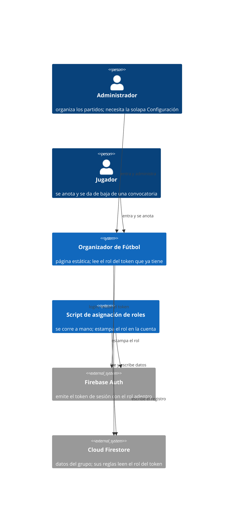

# Rol en el token — Concept Note

> **Status:** Draft · **Date:** 2026-09-09 · **Owner:** Lucas Manoukian
>
> **Reviewers:** *pending*
>
> **Spec:** [ROL_EN_EL_TOKEN_SPEC.md](./ROL_EN_EL_TOKEN_SPEC.md) · **Implementation plan:** *not yet written*

## 1. TL;DR

Hoy la app no sabe si la cuenta que entró es `admin` o `jugador` hasta que vuelve una
lectura a Firestore posterior al login, así que se muestra asumiendo el rol más
restringido y completa la interfaz después: para un admin, la solapa **Configuración**
aparece con un retraso visible respecto de las otras dos. Se propone que el rol viaje
**dentro del propio token de sesión** de Firebase Auth (*custom claims*), de forma que
esté disponible en el instante en que el login resuelve, sin ningún viaje de red propio.
El mismo cambio elimina una lectura extra que hoy paga **cada** operación contra la base,
porque las reglas de seguridad dejan de tener que consultar el documento del rol para
autorizar. La decisión que el lector debe conocer antes que ninguna otra: esto **revierte
deliberadamente** una decisión ya tomada y documentada — `research.md` #1 de
`007-permisos-por-usuario` descartó los custom claims "por infraestructura inexistente" —
y el motivo por el que se reabre es que la infraestructura que faltaba resultó ser mucho
menor de lo que esa decisión asumió: un script local que se corre a mano, no un backend
desplegado.

## 2. Problem statement

La app se muestra **antes** de saber quién entró. Es una decisión deliberada y está
documentada en el código: esperar a resolver el rol dejaba la pantalla de login congelada
un par de segundos ([`index.html:7133-7137`](../../index.html#L7133-L7137)). Pero como en
ese momento todavía no se sabe el rol, el `body` arranca en la clase `role-jugador`
([`index.html:1085`](../../index.html#L1085)), que es *fail-closed*: tapa por CSS todo lo
marcado como `admin-only` ([`index.html:102`](../../index.html#L102)). La solapa
Configuración es una de esas cosas ([`index.html:1118`](../../index.html#L1118)).

- **Pain 1 — la solapa Configuración llega tarde para un admin.** Partidos y Jugadores
  están visibles desde el primer pintado, porque las ve cualquier rol. Configuración
  aparece recién cuando vuelve `resolveSession()`, que lee `userRoles/{uid}`
  ([`index.html:1407`](../../index.html#L1407)) y sólo entonces saca la clase
  ([`index.html:7145`](../../index.html#L7145)). El efecto es peor que la espera en sí:
  la barra de solapas se reacomoda cuando el usuario ya daba la carga por terminada.
  **Medido el 2026-09-09 contra staging** (`OPEN-Q-01`, resuelta): el hueco entre que
  aparece la app y que aparece la solapa es de **821 ms promedio** con login explícito
  (933 / 830 / 701 en tres corridas) y **487 ms** cuando la sesión ya estaba abierta
  (649 / 442 / 370). Tres consecuencias: está muy por encima del umbral de lo perceptible;
  el caso de la sesión ya abierta es **el habitual**, porque la persistencia es `LOCAL`
  ([`index.html:1378`](../../index.html#L1378)), así que el hueco aparece cada vez que se
  abre la app y no una vez por día; y los tres números bajan corrida a corrida porque la
  conexión se calienta, o sea que la primera apertura del día es el peor caso. La medición
  se hizo en una computadora con buena conexión, así que es un **piso**: en un teléfono con
  datos móviles es peor. No confundir con la única medición previa que había en el repo
  (~1,4 s), que mide otra cosa: los **dos** round-trips en serie de antes de paralelizarlos
  ([`index.html:1860`](../../index.html#L1860)).
- **Pain 2 — cada operación contra la base paga una lectura extra.** Las reglas de
  seguridad resuelven el rol con un `get()` al documento `userRoles/{uid}`
  ([`docs/007-permisos-por-usuario/contracts/firestore-rules.md:19`](../007-permisos-por-usuario/contracts/firestore-rules.md#L19)).
  La documentación de Firestore es explícita en que esas llamadas **se facturan como
  lecturas incluso cuando la regla rechaza el pedido**, y que hay un techo de 10 por
  pedido de un documento. O sea: no es sólo el arranque. Con precisión: lo pagan **todas
  las escrituras** y **todas las lecturas de un documento sólo-admin**; las lecturas de
  `data/players` y `data/partidos`, que son públicas para cualquier cuenta autenticada, no
  llaman a `rol()` y no lo pagan
  ([`docs/007-permisos-por-usuario/contracts/firestore-rules.md:27-38`](../007-permisos-por-usuario/contracts/firestore-rules.md#L27-L38)).
  Para un admin eso igual significa seis lecturas extra sólo en el arranque, una por cada
  documento sólo-admin que pide.
- **Pain 3 — la optimización que ya existe no puede resolverlo.** El código guarda una
  pista del rol en `localStorage` y la usa para adelantar el pedido de los documentos de
  admin ([`index.html:1871`](../../index.html#L1871)), pero tiene **prohibido** usarla
  para habilitar interfaz, por decisión explícita
  ([`index.html:1883-1885`](../../index.html#L1883-L1885)): un `localStorage`
  manipulado no debe poder mostrar nada. Es la decisión correcta, y es exactamente por eso
  que el problema no se puede arreglar del lado del cliente sin cambiar de mecanismo.

## 3. Goals

- Un admin ve las tres solapas juntas, sin espera perceptible entre ellas ni reacomodo de
  la barra después del primer pintado.
- Saber quién es la sesión no cuesta ningún viaje de red propio: el dato llega adentro de
  lo que el login ya devuelve.
- Autorizar una operación contra Firestore no cuesta una lectura extra facturada.
- Asignar un rol sigue siendo una operación deliberada y auditable, no auto-servicio: hoy
  se hace a mano y debe seguir requiriendo una acción explícita del propietario.
- La cuenta `jugador` también mejora su arranque, no sólo la de admin.

## 4. Non-goals

Permanentemente fuera de alcance (a diferencia de §14, que es la lista de lo diferido):

- **No se construye una pantalla de registro ni de gestión de cuentas.** Esa idea vive en
  `Roadmap.md` → "Cuentas y acceso" y sigue ahí; esta feature cambia *cómo se guarda* el
  rol, no *quién puede asignarlo* ni *desde dónde*.
- **No se agrega Cloud Functions ni ningún backend desplegado.** Si la solución exigiera
  eso, la decisión de `007` seguiría siendo correcta y esta feature no debería existir.
- **No cambia qué puede hacer cada rol.** Todos los permisos de `007-permisos-por-usuario`
  quedan idénticos: esto es un cambio de *dónde vive el dato del rol*, no de las reglas de
  negocio que ese rol habilita.
- **No se migra `data/partidos` a documentos nativos.** Es un pendiente real y anotado en
  `Roadmap.md`, y este cambio no lo acerca ni lo aleja.
- **No se persigue una mejora general de performance del arranque.** El objetivo es el
  costo de *identidad*; los otros costos del arranque quedan como están.

## 5. Vision / desired end state

Lucas abre la app en el teléfono, escribe usuario y contraseña, y la aplicación aparece
**completa**: Partidos, Jugadores y Configuración, las tres solapas juntas, sin que
ninguna se sume después. No hay un momento intermedio en el que la app se vea como la de
otra persona.

Del lado de la administración, cuando entra alguien nuevo al grupo, Lucas corre un
comando en su computadora que le asigna el rol a esa cuenta. La consola de Firebase sigue
mostrando la lista de quién es qué, igual que hoy, así que no pierde la vista de conjunto
que usa para acordarse de a quién le falta rol.

### 5.1 System context diagram

> **Render verificado el 2026-09-09.** Se instaló el navegador que le faltaba a la CLI de
> Mermaid y se renderizó el bloque a imagen: dibuja los 6 elementos y las 6 relaciones, sin
> carteles de error. La primera versión renderizaba pero era **parcialmente ilegible** —los
> rótulos de las dos flechas que se cruzan en el medio se superponían y se leían encimados—,
> algo que sólo se detectó al mirar la imagen y no al comprobar que "no da error". Se acortaron
> esos cuatro rótulos y se separaron con `UpdateRelStyle`; la versión de arriba es la
> corregida y ya se lee entera.

### 5.2 Security posture (`MD-31`)

- **Feature exposure** — la feature no procesa entrada no confiable de terceros: consume
  un token **firmado por Firebase Auth** y lo verifica Firebase, no la app. La única
  entrada humana es la del script de asignación, que corre localmente y sólo lo ejecuta el
  propietario del proyecto. La app sigue siendo una página estática sin servidor propio.
- **Data sensitivity** — no hay datos regulados nuevos (no hay PII más allá de los emails
  que Firebase Auth ya guarda). Sí aparece **un artefacto sensible nuevo**: la llave de
  cuenta de servicio que el script necesita para estampar roles, que es una credencial
  con permisos administrativos sobre el proyecto Firebase.
- **Deployment surface** — la app se publica en GitHub Pages contra Firestore; el script
  **no se despliega en ningún lado**, vive y corre en la máquina del propietario.

Categorías del CWE Top 25 que esta postura pone en juego, y que la Spec deberá atender en
su §4.5: control de acceso incorrecto o ausente (el mecanismo de autorización es
justamente lo que cambia) y protección insuficiente de credenciales (la llave de servicio
nueva, que no debe versionarse ni quedar en el repo). El listado vigente del CWE Top 25 se
consulta en vivo al escribir la Spec, no se congela acá.

## 6. Context & background

- **Existing system** — el rol de cada cuenta lo introdujo `007-permisos-por-usuario`
  ([`docs/007-permisos-por-usuario/`](../007-permisos-por-usuario/)): una colección
  `userRoles`, un documento por cuenta, con campos nativos de Firestore porque **las
  reglas de seguridad necesitan poder leer el rol** para decidir qué puede tocar cada
  cuenta. Ese requisito es el que forzó el diseño actual, y es el mismo que los custom
  claims satisfacen mejor.
- **Reemplazo declarado (gobernanza de [`AGENTS.md`](../../AGENTS.md), "Dónde vive la
  fuente de verdad de cada feature").** Esta feature modifica comportamiento ya descripto
  en un spec vigente y lo declara explícitamente:
  - **`FR-016` de [`docs/007-permisos-por-usuario/spec.md:95`](../007-permisos-por-usuario/spec.md#L95)**
    — *"La asignación del perfil […] MUST realizarse manualmente en la base de datos de
    Firebase"* — queda **reemplazado en su parte**: la asignación pasa a hacerse con un
    script local contra Firebase Auth. Lo que **no** cambia de ese `FR` es su intención de
    fondo: sigue siendo una operación manual y deliberada del propietario, sin pantalla de
    registro (ver §4).
  - La **decisión #1 de [`docs/007-permisos-por-usuario/research.md:19`](../007-permisos-por-usuario/research.md#L19)**,
    que descartó los custom claims, queda revertida. Ver §9.1 para el motivo.
  - El **contrato de reglas** de
    [`docs/007-permisos-por-usuario/contracts/firestore-rules.md`](../007-permisos-por-usuario/contracts/firestore-rules.md)
    queda reemplazado en la parte de la función `rol()`, que deja de hacer un `get()`.
  - El **modelo de datos** de `userRoles`
    ([`docs/007-permisos-por-usuario/data-model.md`](../007-permisos-por-usuario/data-model.md))
    queda reemplazado en su rol de fuente de verdad: pasa a ser un registro legible, no el
    dato que la app y las reglas consultan.
- **Organisational context** — no hay fecha límite ni presión externa. El grupo es uno,
  con pocas cuentas, y los roles cambian muy rara vez: eso es lo que hace aceptables las
  concesiones de §10 (`D-08`, `D-10`).

### 6.5 Sources & Origins (`MD-25`)

**Codebase evidence**

- [`index.html:7128-7157`](../../index.html#L7128-L7157) — la secuencia de arranque
  completa: fija que la app se muestra antes de resolver el rol y que la clase
  `role-jugador` se saca recién después de `resolveSession()`. Es el origen del Pain 1.
- [`index.html:1403-1421`](../../index.html#L1403-L1421) — `window.session`,
  `resolveSession()` e `isAdmin()`: pinta la forma exacta del objeto de sesión que hay que
  preservar y el comportamiento *fail-closed* ante dato faltante (`D-07`).
- [`index.html:1085`](../../index.html#L1085) y [`index.html:102`](../../index.html#L102)
  — el mecanismo `role-jugador` + `admin-only`: fija que la interfaz se tapa por CSS, no
  por render condicional, y por qué el retraso se ve como un reacomodo de la barra.
- [`index.html:1118`](../../index.html#L1118) — la solapa Configuración, marcada
  `admin-only`: el elemento concreto que el usuario reporta.
- [`index.html:1855-1894`](../../index.html#L1855-L1894) — `DOCS_SOLO_ADMIN`,
  `iniciarLecturas()` y la pista de rol en `localStorage`: fija que ya existe una
  optimización de prefetch y que su comentario **prohíbe** usarla para habilitar
  interfaz. Es el origen del Pain 3 y de por qué la alternativa §9.3 se rechaza.
- [`index.html:1953`](../../index.html#L1953) — `renderMotorTab()` dentro de `loadAll()`:
  fija que el *contenido* de la solapa depende de `motorConfig`, un documento sólo-admin,
  y por lo tanto que hay un segundo retraso, más chico, además del del botón.
- [`index.html:1317-1319`](../../index.html#L1317-L1319) y
  [`index.html:1378`](../../index.html#L1378) — SDK de Firebase 11.0.2 en su versión
  *compat*, cargado por CDN, con persistencia de sesión `LOCAL`: fija con qué API se
  tiene que leer el claim y que la sesión sobrevive al cierre del navegador (relevante
  para `D-08`/`D-09`).
- [`tests/fixtures-app.js:282`](../../tests/fixtures-app.js#L282) — el doble de prueba
  intercepta la colección `userRoles`: fija que los tests de interfaz van a necesitar
  cambiar de punto de intercepción cuando el rol deje de leerse de Firestore.
- [`docs/007-permisos-por-usuario/contracts/firestore-rules.md:19`](../007-permisos-por-usuario/contracts/firestore-rules.md#L19)
  — la función `rol()` con su `get()`: origen del Pain 2 y de `D-06`.

**Industry-standard evidence**

- *Architectural:* [Firebase — Control Access with Custom Claims and Security
  Rules](https://firebase.google.com/docs/auth/admin/custom-claims) — verificado el
  2026-09-09. Fija tres restricciones de diseño duras: `setCustomUserClaims()` **sólo
  existe en el Admin SDK, del lado servidor** (origen de `D-03`); el payload de claims
  **no puede pasar de 1000 bytes** (holgadísimo para `{rol, jugadorId}`); y los claims
  llegan al cliente **en la próxima emisión o refresco del token**, no al instante — con
  refresco forzado disponible vía `currentUser.getIdToken(true)`, que es exactamente lo
  que habilita `D-09`. La misma página advierte que los claims son **para control de
  acceso, no para almacenar datos de perfil**: es el criterio contra el que se justifica
  `D-02`.
- *Architectural:* [Firebase — Rules and
  Auth](https://firebase.google.com/docs/rules/rules-and-auth) — verificado el
  2026-09-09. Confirma que `request.auth.token` **contiene los custom claims** y que
  Firebase **recomienda explícitamente los custom claims para control de acceso por
  roles**, con ejemplos de reglas que leen `request.auth.token.<claim>`. Fundamenta
  `D-01` y `D-06`.
- *Architectural:* [Firestore — Security rules
  conditions](https://firebase.google.com/docs/firestore/security/rules-conditions) —
  verificado el 2026-09-09. Fija que `get()`/`exists()` dentro de una regla **se facturan
  como lecturas incluso si la regla rechaza el pedido**, con un techo de 10 llamadas por
  pedido de un documento (20 en lotes/transacciones). Cuantifica el Pain 2.
- *Architectural:* [Firebase — Manage user
  sessions](https://firebase.google.com/docs/auth/admin/manage-sessions) — verificado el
  2026-09-09. *"Firebase ID tokens are short lived and last for an hour"*: es el número
  que acota cuánto puede tardar en aplicarse un cambio de rol (`D-10`).
- *Style / project convention:* [`AGENTS.md`](../../AGENTS.md) — "Simplicidad ante todo"
  (nada de infraestructura anticipada: fundamenta que se elija un script local y no Cloud
  Functions), "Arquitectura desacoplada" (el rol se sigue leyendo detrás del wrapper
  `window.session`, no desparramado por la interfaz), y la obligación de declarar qué spec
  se reemplaza, cumplida en §6.
- *Regulatory:* ninguna aplica — no hay datos regulados nuevos, no hay superficie pública
  nueva y la interfaz no cambia (ver §5.2).

**Prior-art evidence**

- [`docs/007-permisos-por-usuario/research.md:19`](../007-permisos-por-usuario/research.md#L19)
  — la decisión que evaluó y descartó esta misma idea, con su motivo textual: *"es el
  mecanismo 'canónico' de Firebase para roles, pero requiere Admin SDK (Cloud Functions o
  un backend) […] Se descarta por infraestructura inexistente, no por preferencia."* Es el
  prior art más importante del documento: dice qué hay que refutar para que esta feature
  se justifique (§9.1).
- [`docs/007-permisos-por-usuario/research.md`](../007-permisos-por-usuario/research.md)
  §2 y §3 — el razonamiento de por qué las reglas no pueden filtrar campos dentro de un
  blob JSON, y la limitación aceptada de `data/partidos`. Confirma que esta feature **no**
  resuelve esa limitación y no debe pretender hacerlo (§4).
- Firebase (el propio proveedor) como par: su documentación recomienda los custom claims
  como el camino para RBAC, o sea que la dirección propuesta es la canónica de la
  plataforma y no una invención del proyecto (ver *Industry-standard evidence*).
- *Papers / literatura:* ninguno — el problema es de integración con una plataforma
  concreta, no un problema de investigación; no se identificó literatura académica
  aplicable.

## 7. Research & industry context

### 7.1 How established products handle this

El patrón dominante en autenticación moderna es **meter las autorizaciones adentro del
token** en vez de resolverlas con una consulta posterior. En OAuth 2.0 / OpenID Connect
esto son los *scopes* y *claims* del access token: el cliente recibe, junto con la prueba
de que se autenticó, la descripción de lo que puede hacer, firmada por el emisor. Quien
valida no necesita ir a buscar nada.

Firebase implementa exactamente ese patrón con los **custom claims**, y su propia
documentación los presenta como el mecanismo para control de acceso por roles, con
ejemplos de reglas que leen `request.auth.token.<claim>`. Es decir: la dirección que
propone este documento no es una alternativa creativa, es la que el proveedor recomienda,
y el diseño actual del proyecto es el que se aparta de ella — por una razón que era buena
en su momento (§9.1).

El otro patrón que se ve en productos grandes es **no mostrar nada definitivo hasta saber
quién sos**: el esqueleto gris de Gmail, Notion o Linear, que aparece completo de una vez.
Resuelve el síntoma visual sin resolver el costo, y en esta app tendría el efecto
colateral de deshacer una optimización previa deliberada — se analiza y se rechaza en
§9.2.

### 7.2 Relevant prior art / papers / standards

- **Firebase custom claims** — payload máximo 1000 bytes; asignables sólo desde el Admin
  SDK; visibles en `request.auth.token` en las reglas; llegan al cliente en el próximo
  refresco del token. Ver §6.5 para las URLs y qué fijó cada una.
- **Tokens de ID de Firebase: una hora de vida.** Acota el peor caso de demora de un
  cambio de rol y hace que `D-10` sea una concesión chica.
- **`get()` en reglas: lectura facturada, techo de 10 por pedido.** Convierte el Pain 2 de
  "una molestia teórica" en un costo medible por operación.
- **Advertencia del proveedor:** los claims son para control de acceso, no para guardar
  datos de perfil, porque viajan en **todos** los pedidos autenticados. Es el criterio
  contra el que hay que justificar cada campo que se meta adentro (§9.1, `D-02`).

### 7.3 Proofs of concept

Ninguno todavía. La decisión de `007` se tomó por análisis, no por prototipo, y esta
reversión también: lo que cambió no es un resultado experimental sino la lectura de cuánta
infraestructura hace falta realmente.

| PoC | Status | Link | What it proved | What it disproved |
|---|---|---|---|---|
| *ninguno* | — | — | — | — |

`OPEN-Q-01` (ver §15) propone el único experimento que valdría la pena antes de escribir
código: medir el retraso real de la solapa hoy, para tener con qué comparar después.

## 8. Proposed direction

### 8.1 Approach

El rol deja de ser **un dato que la app va a buscar** y pasa a ser **un dato que la app ya
tiene**. Concretamente, el rol se guarda como *custom claim* dentro de la cuenta de
Firebase Auth, de modo que viaja adentro del token de sesión que el login ya devuelve. En
el instante en que el login resuelve, la app puede leer el rol del token y pintar la
interfaz correcta de una sola vez: no hay un estado intermedio en el que la app se vea
como la de otro rol.

El mismo dato sirve a las reglas de seguridad. Firestore expone los custom claims en
`request.auth.token`, así que la función `rol()` del contrato actual —que hoy hace un
`get()` al documento del rol, facturado como lectura incluso cuando rechaza— se reemplaza
por una lectura del token, que no cuesta nada. Ese es el segundo beneficio, y no se limita
al arranque: alcanza a todas las escrituras y a todas las lecturas de documentos
sólo-admin, que son las operaciones cuyas reglas hoy consultan el rol.

Asignar un rol pasa a hacerse con un **script que se corre a mano** desde la computadora
del propietario, usando el Admin SDK de Firebase. Esto es lo que refuta el motivo por el
que `007` descartó esta idea: la asignación de claims sí exige un entorno privilegiado,
pero *"entorno privilegiado"* no significa *"backend desplegado"* — una consola local con
una llave de servicio alcanza, y encaja con el flujo que el proyecto ya tiene, donde los
roles se cargan a mano de a uno. El script hace dos cosas en la misma corrida: estampa el
claim en la cuenta y escribe el registro legible en `userRoles`, para que la consola de
Firebase siga sirviendo como vista de conjunto de quién es qué.

Queda un detalle que decide si la mudanza es cómoda o incómoda. Los claims llegan al
cliente **en el próximo refresco del token**, no al instante: una cuenta que ya tenía la
sesión abierta sigue con un token viejo, sin el claim adentro. Como el proyecto eligió un
corte de una vez (`D-08`) en vez de reglas de transición, la app se encarga: si al
arrancar el token no trae el claim, fuerza **un** refresco (`getIdToken(true)`) y recién
entonces decide el rol. Con eso, nadie tiene que cerrar sesión a mano y el corte deja de
tener el riesgo que tendría si no. Es una sola línea de defensa, pequeña, en el único
punto donde hace falta.

Como consecuencia colateral, la pista de rol en `localStorage`
([`index.html:1885-1894`](../../index.html#L1885-L1894)) **deja de tener razón de
existir**: se había agregado justamente para adelantar el prefetch de los documentos de
admin sin esperar la lectura del rol, y esa espera desaparece. El prefetch pasa a decidirse
con el claim, que ya está disponible, y la maquinaria de la pista se elimina (`D-12`).

### 8.2 Information / data model sketch

No hay entidades nuevas. Hay una que **cambia de lugar** y una que **cambia de papel**:

- **Identidad de la sesión** (`rol`, `jugadorId`) — hoy vive en el documento
  `userRoles/{uid}` de Firestore; pasa a vivir adentro del token de la cuenta de Firebase
  Auth. Es el mismo par de campos, con los mismos valores posibles; lo que cambia es quién
  lo emite (Firebase Auth, firmado) y cuándo está disponible (al resolver el login, sin
  viaje propio).
- **`userRoles`** — deja de ser fuente de verdad y pasa a ser un **registro legible** que
  el script mantiene para consumo humano. Nadie —ni la app, ni las reglas— lo lee para
  decidir nada. La fuente de verdad, ante cualquier discrepancia, es el claim.
- **`window.session`** — el objeto en memoria que el resto de la interfaz consulta
  conserva su forma exacta (`{ rol, jugadorId }`). Cambia de dónde se llena, no su
  contrato: ninguna función que hoy pregunta `isAdmin()` se entera de nada (`D-11`).

## 9. Alternatives considered

### 9.1 Alternative A — El rol viaja en el token (custom claims)

- **Description:** el rol se guarda como custom claim en la cuenta de Firebase Auth, se
  asigna con un script local vía Admin SDK, y tanto la app como las reglas lo leen del
  token.
- **Pros:** elimina el viaje de red de identidad por completo (no lo esconde ni lo
  disimula); elimina también la lectura extra de **cada** operación; es el mecanismo que
  el propio proveedor recomienda para control de acceso por roles; el dato viene firmado
  por Firebase, así que no hay ninguna concesión de seguridad.
- **Cons:** exige una llave de cuenta de servicio, que es un artefacto sensible nuevo; los
  cambios de rol no son inmediatos (hasta una hora, o el próximo login); el rol deja de
  verse como una lista en la consola de Firebase, salvo que se lo mantenga a propósito
  (`D-05`); hay que republicar las reglas en los dos proyectos.
- **Decision:** **Selected.** Es la única alternativa que ataca las dos causas y no sólo
  el síntoma visible.

  **Por qué se reabre una decisión ya tomada.** `research.md` #1 de `007` descartó esta
  misma idea con este motivo textual: *"requiere Admin SDK (Cloud Functions o un backend)
  — este proyecto no tiene Cloud Functions ni backend propio […] Se descarta por
  infraestructura inexistente, no por preferencia."* La premisa —el Admin SDK es
  obligatorio— es **correcta y sigue vigente**. Lo que no se sostiene es la inferencia:
  que el Admin SDK obligue a *desplegar* algo. El Admin SDK corre en cualquier entorno
  privilegiado, incluida una terminal local con una llave de servicio, y el proyecto ya
  tiene una carpeta [`tools/`](../../tools/) con utilidades de ese estilo que se corren a
  mano. Sumado a que la asignación de roles **ya es** un trámite manual y ocasional
  (`FR-016`), el costo real es un script, no una pieza de infraestructura. Esa es la
  diferencia que justifica revertir la decisión, y es lo único que cambió: no hay dato
  experimental nuevo.

### 9.2 Alternative B — Esqueleto de carga hasta saber la identidad

- **Description:** no mostrar nada definitivo hasta que se resuelva el rol; mientras
  tanto, un esqueleto gris. Es lo que hacen Gmail, Notion o Linear.
- **Pros:** elimina el efecto visual molesto por completo, y sin tocar infraestructura ni
  seguridad; es el patrón de la industria para este síntoma exacto.
- **Cons:** no toca ninguna de las dos causas — el viaje de red de identidad sigue ahí, y
  la lectura extra por operación también. Y **deshace una optimización deliberada**: el
  código eligió a propósito mostrar la app sin esperar el rol, porque esperar dejaba la
  pantalla de login congelada ([`index.html:7133-7137`](../../index.html#L7133-L7137)).
  Cambiaría un reacomodo molesto por una espera más larga para todos.
- **Decision:** **Rejected.** Mejora la percepción a costa del tiempo real, en una app que
  ya había decidido lo contrario con fundamento.

### 9.3 Alternative C — Rol recordado del navegador (optimista) y corrección posterior

- **Description:** usar la pista que ya existe en `localStorage` para pintar de entrada la
  interfaz del rol recordado, y corregirla si el servidor contesta distinto.
- **Pros:** costo casi nulo — el dato ya se guarda y ya se usa para el prefetch; instantáneo;
  cero infraestructura.
- **Cons:** el proyecto **prohibió explícitamente** este uso, y dejó el motivo escrito en
  el código ([`index.html:1883-1885`](../../index.html#L1883-L1885)): la pista no debe
  habilitar interfaz. Aunque el daño real sería cosmético —Firestore rechazaría igual
  todos los datos, así que un `localStorage` manipulado sólo lograría ver una solapa
  vacía— aceptarlo significa que la interfaz pasa a depender de un dato que el usuario
  controla. Tampoco toca el Pain 2.
- **Decision:** **Rejected.** Es la opción barata, y se rechaza a favor de la que arregla
  la causa. Queda anotada como el plan B si `D-01` se cayera por un impedimento
  imprevisto.

### 9.4 Alternative D — Sólo cosmético: reservar el espacio de la solapa

- **Description:** dejar el hueco de la solapa ocupado desde el arranque (invisible pero
  con su lugar tomado) y aparecerla con una transición suave.
- **Pros:** lo más barato de todo; elimina el salto de la barra, que es la parte que más
  molesta.
- **Cons:** no arregla nada: la solapa sigue llegando tarde, y las reglas siguen pagando
  su lectura. Además filtra que la solapa existe, a cualquier rol.
- **Decision:** **Rejected** como solución. Se anota como paliativo si por algún motivo
  `D-01` se posterga.

### 9.5 Alternative E — Cloud Function como intermediaria

- **Description:** una Cloud Function que resuelva el rol (o que asigne los claims al
  crear la cuenta) en vez de un script local.
- **Pros:** automatiza la asignación; no hay llave de servicio en ninguna computadora.
- **Cons:** es exactamente la infraestructura que `007` rechazó dos veces (secciones 2 y 3
  de su `research.md`) y que el principio de **simplicidad ante todo** de
  [`AGENTS.md`](../../AGENTS.md) prohíbe anticipar. El proyecto no tiene `firebase.json`,
  ni CLI configurado, ni despliegue de funciones, y esta feature no lo necesita: los roles
  se asignan de a uno, a mano, unas pocas veces por año.
- **Decision:** **Rejected.** Se reabre sólo si aparece registro de usuarios (§14), donde
  la asignación sí tendría que ser automática.

### 9.6 Comparison summary

| Dimensión | A · Rol en el token | B · Esqueleto | C · Optimista | D · Cosmético | E · Cloud Function |
|---|---|---|---|---|---|
| Arregla el retraso de la solapa | Sí, de raíz | Sí, ocultándolo | Sí | No, lo disimula | Sí, de raíz |
| Elimina la lectura extra por operación | **Sí** | No | No | No | Sí |
| Infraestructura nueva | Un script local | Ninguna | Ninguna | Ninguna | Backend desplegado |
| Concesión de seguridad | Ninguna | Ninguna | Cosmética | Filtra que existe | Ninguna |
| Choca con una decisión previa del proyecto | Sí (`research.md` #1) | Sí (la optimización del arranque) | Sí (prohibición explícita) | No | Sí (simplicidad) |
| Costo | Una tarde, con cuidado | Bajo | Muy bajo | Mínimo | Alto |

## 10. Key decisions

| ID | Decision | Rationale | Reversibility |
|---|---|---|---|
| D-01 | El rol de la cuenta viaja como *custom claim* en el token de Firebase Auth, y es la fuente de verdad para la app y para las reglas | Elimina el viaje de red de identidad y la lectura extra por operación; es el mecanismo recomendado por el proveedor. Revierte `research.md` #1 de `007` (ver §9.1) | Hard |
| D-02 | El claim lleva **dos** campos: `rol` y `jugadorId` | El jugador vinculado se usa para decidir permisos (que una cuenta sólo pueda darse de baja a sí misma), así que entra en el uso que Firebase recomienda para claims y no en el de "datos de perfil" que desaconseja. `{rol, jugadorId}` es holgadamente menor al límite de 1000 bytes. Beneficio: la cuenta `jugador` también deja de leer identidad en el arranque | Easy |
| D-03 | Los claims se asignan con un **script local** que usa el Admin SDK, corrido a mano por el propietario. No se agrega Cloud Functions ni backend desplegado | Es lo que refuta el motivo de `007`: el Admin SDK exige entorno privilegiado, no despliegue. Encaja con que la asignación ya es manual y ocasional, y con "simplicidad ante todo" | Easy |
| D-04 | La llave de cuenta de servicio **nunca** se versiona: vive fuera del repo, se referencia por ruta, y el repo la ignora explícitamente | Es una credencial con permisos administrativos sobre el proyecto Firebase; filtrarla es el peor escenario de esta feature y no tiene vuelta atrás | One-way |
| D-05 | `userRoles` sobrevive como **registro legible** que el script escribe en la misma corrida. Ni la app ni las reglas la leen | Conserva la vista de conjunto que el propietario usa en la consola de Firebase, sin volver a poner una lectura en el camino crítico. Ante discrepancia, el claim manda | Easy |
| D-06 | Las reglas de Firestore leen `request.auth.token.rol`; la función `rol()` con su `get()` se elimina | Es lo que convierte el beneficio de "arranque" en un beneficio de toda la app. Hay que republicar en los dos proyectos, prod y staging | Hard |
| D-07 | Se conserva el *fail-closed*: un token sin claim `rol` se trata como `jugador`, nunca como `admin` | Invariante de seguridad heredado de `007` ([`index.html:1414`](../../index.html#L1414)); ante dato faltante, el rol más restringido | One-way |
| D-08 | La mudanza es un **corte de una vez**, avisando al grupo, en vez de reglas de transición que acepten los dos mecanismos por unos días | Decisión del propietario, con el riesgo conocido y aceptado (§11). El grupo es chico y se avisa por WhatsApp. `D-09` es lo que hace que el riesgo sea chico | Easy |
| D-09 | Si al arrancar el token no trae el claim `rol`, la app fuerza **un** refresco del token antes de decidir el rol | Es lo que evita que el corte de `D-08` obligue a alguien a cerrar sesión a mano: el claim ya está estampado del lado servidor, sólo hay que pedir un token nuevo. Una vez por sesión, y sólo cuando falta el claim | Easy |
| D-10 | No se fuerza el cierre de sesión al cambiar un rol: el cambio aplica en el próximo refresco del token (hasta una hora) o en el próximo login | Los roles cambian muy rara vez en esta app; forzar el cierre agrega código y molesta a la persona. Decisión del propietario | Easy |
| D-11 | `window.session` conserva su forma `{ rol, jugadorId }`: cambia de dónde se llena, no su contrato con el resto de la interfaz | Principio de arquitectura desacoplada de [`AGENTS.md`](../../AGENTS.md): ninguna función que hoy pregunta `isAdmin()` debería enterarse del cambio | Easy |
| D-12 | Se elimina la pista de rol en `localStorage` y el prefetch pasa a decidirse con el claim | Esa maquinaria existía sólo para adelantarse a la lectura del rol; sin esa lectura, es código muerto. Borrarla es parte de la feature, no un extra | Easy |

## 11. Risks

| Risk | Severity | Likelihood | Mitigation idea |
|---|---|---|---|
| La llave de cuenta de servicio se filtra (se commitea por error, se comparte, queda en una carpeta sincronizada) | **High** | Low | `D-04`: fuera del repo, ignorada explícitamente, referenciada por ruta. Revisar el diff antes de commitear el script. Si se filtra, se revoca desde la consola de Firebase y se emite otra |
| El corte de una vez (`D-08`) deja a alguien con la app rota: token viejo sin claim, reglas nuevas que lo rechazan | Med | Low | `D-09` es la mitigación principal y hace que el caso normal se resuelva solo. Como red: avisar al grupo antes, y hacerlo en un momento tranquilo. Si algo sale mal, se puede publicar la regla de transición que `D-08` descartó |
| Las reglas nuevas se publican en un proyecto y no en el otro, o mal | Med | Med | Probar primero en staging, que es lo que la app usa sola desde local; publicar en prod recién después, con la lista de los dos proyectos a la vista |
| El claim y el registro `userRoles` (`D-05`) se desincronizan, y la consola muestra algo que no es | Low | Med | El script escribe los dos en la misma corrida. La Spec debe declarar explícitamente que el claim es la fuente de verdad, para que nadie "arregle" el rol editando el registro |
| Una cuenta nueva se crea y nadie le asigna el rol | Low | Med | `D-07` la trata como `jugador`, que es el comportamiento correcto. Conviene que el script pueda **listar** cuentas sin rol, para que el olvido se vea (ver `OPEN-Q-02`) |
| El refresco forzado de `D-09` se dispara siempre por un error de implementación y suma latencia a cada arranque | Low | Low | Sólo cuando falta el claim, y una sola vez por sesión. Es un caso de prueba obligatorio de la Spec |
| Los tests de interfaz dejan de cubrir el rol: hoy interceptan Firestore ([`tests/fixtures-app.js:282`](../../tests/fixtures-app.js#L282)), no el token | Med | High | Es trabajo seguro, no un riesgo eventual: hay que mover el punto de intercepción. Anotado como `OPEN-Q-05` para el Plan |

## 12. Success signals

- Un admin entra y ve las tres solapas juntas: no hay reacomodo de la barra después del
  primer pintado. La línea de base contra la que se compara está medida: **821 ms** con
  login y **487 ms** con sesión ya abierta (§2).
- La diferencia de aparición **entre** solapas desaparece: las tres se pintan juntas,
  porque el viaje de red que separaba a Configuración de las otras dos ya no existe. Lo que
  no cambia es cuándo aparece la app entera, que depende de la carga de datos y queda
  explícitamente fuera de alcance (§4).
- Ninguna operación de la app dispara una lectura de `userRoles`: verificable mirando el
  uso de Firestore en la consola, que debería bajar de forma visible.
- Seis meses después: nadie tuvo que entrar a la consola de Firebase a tocar un rol para
  desbloquear a alguien, y nadie perdió tiempo preguntándose por qué no le aparecía una
  solapa.

## 13. Dependencies & stakeholders

### 13.1 Dependencies

- **Services / vendors:** Firebase Auth (custom claims), Cloud Firestore (reglas leyendo
  `request.auth.token`), Firebase Admin SDK — dependencia **nueva**, de desarrollo, local,
  que no entra en la app publicada (la app sigue cargando Firebase por CDN y sin lockfile,
  según [`AGENTS.md`](../../AGENTS.md) → Dependencias).
- **Upstream specs / RFCs:** ninguna. Las restricciones de plataforma están en §6.5.
- **Downstream consumers:** las reglas de seguridad de los **dos** proyectos Firebase
  (`organizador-futbol` y `organizador-futbol-staging`); los tests de interfaz
  ([`tests/fixtures-app.js`](../../tests/fixtures-app.js)); el spec de
  `007-permisos-por-usuario`, que queda parcialmente reemplazado (§6).

### 13.2 Stakeholders

- **Owning team:** Lucas Manoukian — propietario del producto y único desarrollador.
- **Reviewing teams:** ninguno formal. La revisión es la del propietario más, si se quiere,
  una crítica independiente de la Spec (Step 7 de la metodología).
- **Customers / partners:** el grupo de jugadores que usa la app. No perciben el cambio
  salvo por el arranque, y una vez, la necesidad de volver a entrar si `D-09` fallara.

## 14. Out of scope / deferred

- **Registro de usuarios / pantalla de gestión de cuentas** — *diferido sin fecha*; vive en
  `Roadmap.md` → "Cuentas y acceso". Se reabre si entra gente al grupo con frecuencia
  suficiente para que asignar roles a mano moleste. Ahí sí volvería a discutirse la
  Cloud Function de §9.5.
- **Múltiples administradores** — *diferido sin fecha*, también en `Roadmap.md`. Vale
  anotar que el mecanismo de `D-01` lo soportaría sin ningún cambio: son más cuentas con
  el mismo claim.
- **Forzar el cierre de sesión al cambiar un rol** — *diferido* por `D-10`; se reabre si
  algún día hace falta quitarle el rol a alguien de forma inmediata.
- **Reglas más finas para `data/partidos`** — *diferido sin fecha*, en `Roadmap.md`. Es
  independiente de esta feature: no se acerca ni se aleja.
- **Medir y optimizar el resto del arranque** (la carga de datos, no la identidad) —
  *diferido*; se reabre si después de este cambio el arranque sigue sintiéndose lento.

## 15. Open questions

| ID | Question | Owner | Target stage | Notes |
|---|---|---|---|---|
| ~~OPEN-Q-01~~ | ~~¿Cuánto tarda **hoy** en aparecer la solapa Configuración, medido?~~ | Lucas Manoukian | ~~Spec~~ | **Resuelta el 2026-09-09**: 821 ms con login explícito, 487 ms con sesión ya abierta, medido contra staging con Playwright sobre la app real. Detalle y salvedades en §2 |
| OPEN-Q-02 | ¿El script vive en [`tools/`](../../tools/) dentro del repo, o fuera? ¿Y sabe **listar** los roles asignados y las cuentas sin rol? | Lucas Manoukian | Spec | Si vive en el repo hay que fijar cómo referencia la llave sin arrastrarla (`D-04`). El listado es lo que compensa la pérdida de visibilidad, junto con `D-05` |
| OPEN-Q-03 | Si el refresco forzado de `D-09` tampoco trae el claim (cuenta sin rol asignado), ¿la app se queda en `jugador` en silencio o avisa algo? | Lucas Manoukian | Spec | `D-07` fija el comportamiento de permisos; lo que falta decidir es el comportamiento **visible**. Hoy no hay ningún aviso |
| OPEN-Q-04 | ¿El claim se llama `rol` (español, como el resto del proyecto) o `role`? | Lucas Manoukian | Spec | Trivial pero hay que fijarlo antes de escribir las reglas: una vez publicado, renombrarlo obliga a re-estampar todas las cuentas |
| OPEN-Q-05 | ¿Cómo se prueba el rol cuando ya no viene de Firestore? | Lucas Manoukian | Plan | Hoy el doble de prueba intercepta la colección `userRoles` ([`tests/fixtures-app.js:282`](../../tests/fixtures-app.js#L282)); habrá que interceptar el token en su lugar |

## 16. Handoff to the Spec

- **Settled (do not relitigate):** `D-01` a `D-12`. En particular no se vuelve a discutir
  si conviene usar custom claims (`D-01`, con su refutación en §9.1), si el `jugadorId`
  entra en el claim (`D-02`), si hace falta un backend (`D-03`, `E` rechazada en §9.5), ni
  si la mudanza es por corte o por transición (`D-08`).
- **Decide in Spec:** `OPEN-Q-02`, `OPEN-Q-03`, `OPEN-Q-04`. (`OPEN-Q-01` quedó resuelta al escribir este documento — ver §2.)
- **Decide in Plan:** `OPEN-Q-05`.
- **Declarar en la Spec, sin excepción:** el reemplazo parcial de `FR-016` de
  `007-permisos-por-usuario`, la reversión de su `research.md` #1, el reemplazo de la
  función `rol()` de su contrato de reglas y el cambio de papel de `userRoles` en su
  modelo de datos (§6). Y anotar recíprocamente esas partes como reemplazadas en el spec
  viejo — sin eso, quedan dos specs vigentes contradiciéndose
  ([`AGENTS.md`](../../AGENTS.md)).
- **Verificación pendiente heredada (`MD-26`): ninguna.** El bloque Mermaid de §5.1 llevaba
  un marcador `[UNVERIFIED]` porque su render no se había podido validar; quedó **cerrado el
  2026-09-09** renderizándolo a imagen, lo que además destapó que los rótulos se superponían
  y forzó corregir el diagrama (ver la nota en §5.1). Esta Concept Note no traspasa deuda de
  verificación a la Spec.
- **La Spec debe atender en su §4.5** las dos categorías de seguridad que §5.2 pone en
  juego: control de acceso ausente o incorrecto, y protección insuficiente de credenciales
  (la llave de servicio de `D-04`). El CWE Top 25 vigente se consulta en vivo al escribirla.
- **Must remain non-goals** (citados textualmente de §4, no por número de sección):
  - *"No se construye una pantalla de registro ni de gestión de cuentas."*
  - *"No se agrega Cloud Functions ni ningún backend desplegado."*
  - *"No cambia qué puede hacer cada rol."*
  - *"No se migra `data/partidos` a documentos nativos."*
  - *"No se persigue una mejora general de performance del arranque."*

## 17. Appendix

- [`docs/007-permisos-por-usuario/`](../007-permisos-por-usuario/) — la feature que
  introdujo los roles. Lectura mínima antes de escribir la Spec: `research.md` #1 (la
  decisión que esta feature revierte), `contracts/firestore-rules.md` (el contrato que se
  reemplaza) y `data-model.md` (la forma de `userRoles`).
- [Firebase — Control Access with Custom Claims and Security Rules](https://firebase.google.com/docs/auth/admin/custom-claims)
- [Firebase — Rules and Auth](https://firebase.google.com/docs/rules/rules-and-auth)
- [Firestore — Security rules conditions](https://firebase.google.com/docs/firestore/security/rules-conditions)
- [Firebase — Manage user sessions](https://firebase.google.com/docs/auth/admin/manage-sessions)
- El análisis de alternativas de §9 salió de una conversación del 2026-09-09 que arrancó
  como una pregunta de diagnóstico ("¿por qué la solapa Configuración tarda más para un
  admin?") y derivó en las cinco opciones. Las opciones B, C y D se plantearon ahí como
  las respuestas típicas de la industria antes de compararlas contra A.

## 18. Change log

| Date | Author | Change |
|---|---|---|
| 2026-09-09 | Lucas Manoukian (claude-opus-5) | Initial draft. Deriva de la conversación de diagnóstico del 2026-09-09 y de las cuatro decisiones de producto que el propietario tomó ahí (`D-02`, `D-05`, `D-08`, `D-10`). Declara el reemplazo parcial de `FR-016`, la reversión de `research.md` #1, y el reemplazo de la función `rol()` del contrato de reglas y del papel de `userRoles` en el modelo de datos, todo de `007-permisos-por-usuario` (§6). Self-critique: passed (1🔴 / 3🟡 / 2🔵) — el 🔴 (ausencia de esta propia §18) y los tres 🟡 resueltos: §2 y §8.1 exageraban el beneficio de las reglas diciendo "cada lectura y cada escritura" cuando las lecturas de `data/players` y `data/partidos` no consultan el rol (corregido contra el contrato de reglas real); §12 afirmaba que el retraso "baja a cero" cuando lo que desaparece es la diferencia *entre* solapas; y el bloque Mermaid de §5.1 no tenía marcador de verificación pese a que su render no se pudo validar (agregado y citado en §16 per `MD-26`). Los dos 🔵 se dejan: §5 usa dos párrafos donde la rúbrica prefiere uno (la plantilla admite hasta tres), y §9.3/§9.4 se postulan las dos como plan B de `D-01`, redundancia inofensiva. |

| 2026-09-09 | Lucas Manoukian (claude-opus-5) | Resuelve `OPEN-Q-01` con una medición real contra staging (Playwright sobre la app, tres corridas por caso): 821 ms de hueco con login explícito, 487 ms con sesión ya abierta. Actualiza §2 (que declaraba el retraso como no medido), §12 (que ahora tiene línea de base) y §16 (que ya no la lista como pendiente para la Spec). Se agrega la salvedad de que el número es un piso, medido con buena conexión, y que el caso habitual es el de sesión ya abierta porque la persistencia es `LOCAL`. Sin cambios de decisiones ni de alcance. Self-critique: no corresponde (incorporación de una medición, verificada por ejecución). |
| 2026-09-09 | Lucas Manoukian (claude-opus-5) | **Cierra el marcador `[UNVERIFIED]` de §5.1 y corrige el diagrama.** Se instaló el `chrome-headless-shell` que le faltaba a la CLI de Mermaid y se renderizó el bloque a imagen. Renderizaba sin errores, pero al **mirar** la imagen apareció un defecto que la comprobación mecánica no ve: los rótulos de las dos flechas que se cruzan en el medio (`app→auth` con `app→fs`, y `script→auth` con `script→fs`) se superponían y quedaban ilegibles — se leía "login; recibe el token con el rol**lee y escribe**" encimado. Se acortaron esos cuatro rótulos y se separaron con `UpdateRelStyle`; la versión corregida se volvió a renderizar y los seis rótulos se leen enteros. §16 pasa a declarar que esta Concept Note **no** traspasa deuda de verificación a la Spec. El procedimiento de validación quedó documentado en [`AGENTS.md`](../../AGENTS.md) → Dependencias, incluida la advertencia de que renderizar sin error no equivale a ser legible. Sin cambios de decisiones, requisitos ni alcance. Self-critique: no corresponde (verificación y corrección de un diagrama, comprobada por render). |

---

*Next document: [Spec](./ROL_EN_EL_TOKEN_SPEC.md). La Spec define qué debe hacer el
sistema, cómo debe comportarse, y qué soluciones son admisibles. El detalle de
implementación concreto vive en el Implementation Plan, no acá ni en la Spec.*
