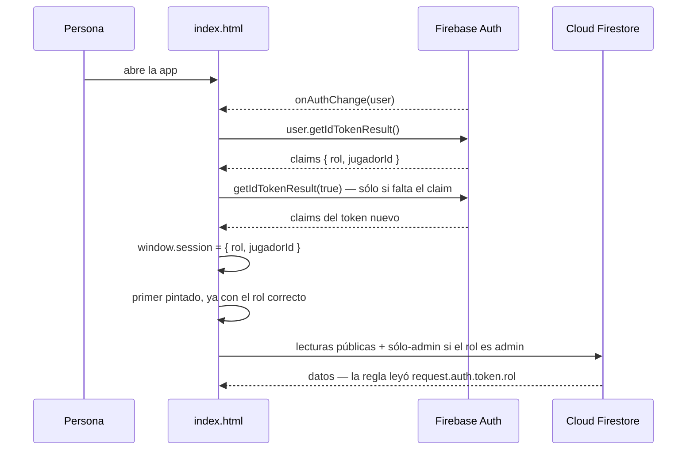
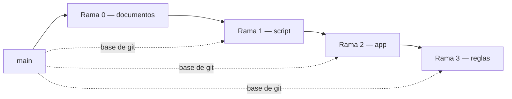
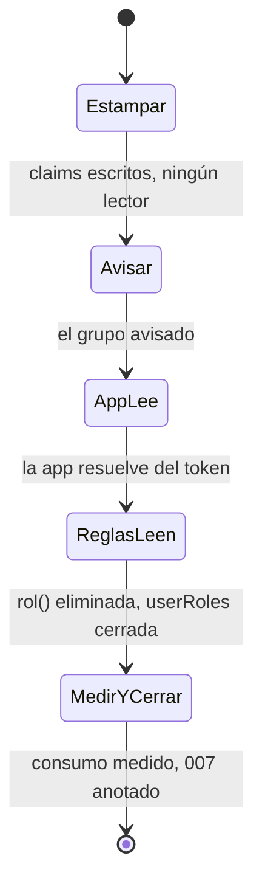
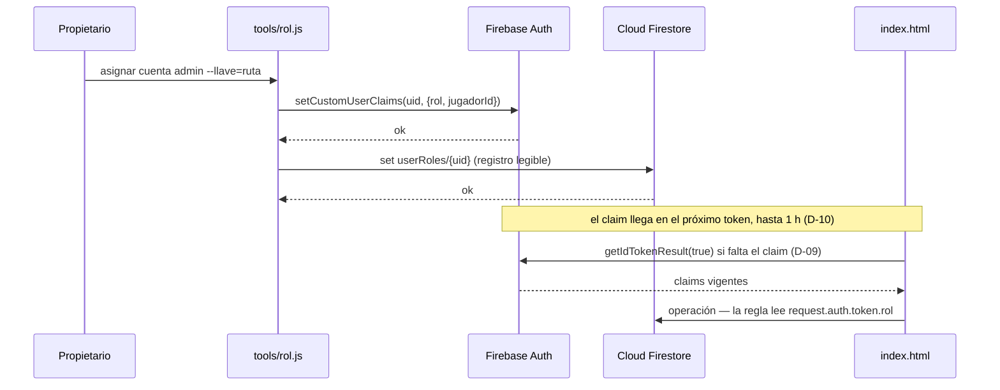

# Rol en el token — Implementation Plan

> **Status:** Draft · **Date:** 2026-09-09 · **Owner:** Lucas Manoukian
>
> **Reviewers:** *pending*
>
> **Spec:** [ROL_EN_EL_TOKEN_SPEC.md](./ROL_EN_EL_TOKEN_SPEC.md)
>
> **Concept note:** [ROL_EN_EL_TOKEN_CONCEPT.md](./ROL_EN_EL_TOKEN_CONCEPT.md)

> **Grounding evidence (`MD-25`).** Este Plan se apoya en el ledger §6.5
> *Sources & Origins* de la Concept Note, que es el registro maestro, y en las
> citas en línea de la Spec. Las ubicaciones de código que este Plan agrega
> —las que fijan dónde va cada tarea— se citan **en línea**, en la sección que
> las usa. Las líneas de `index.html` citadas acá corresponden al estado del
> archivo en el commit `f7b001b` y fueron releídas al escribir este Plan, no
> heredadas de la Spec.

## 1. Summary

Se reemplaza la resolución del rol por lectura de Firestore por una lectura de
los *custom claims* del token de Firebase Auth, en las tres piezas que la
tocan: `resolveSession()` en [`index.html`](../../index.html), las reglas de
seguridad publicadas en los dos proyectos Firebase, y un script nuevo
[`tools/rol.js`](../../tools/rol.js) que estampa el claim y mantiene el
registro legible en `userRoles`. Se entrega en **tres ramas de código**
ordenadas por *quién lee el claim*: primero nadie (el script lo estampa),
después la aplicación, después las reglas. No hay feature flag —el proyecto no
tiene infraestructura de flags y la Spec §13 prohíbe anticiparla—, así que el
aislamiento lo da la rama sin mergear y el orden de merge, que **no es
opcional**: si las reglas se publican antes de que la aplicación lea el claim,
toda cuenta pierde su rol (ver `R-08`).

La restricción no obvia que hay que conocer antes de seguir leyendo: **las
reglas de Firestore no viven en el repositorio**. Se publican a mano desde la
consola de cada proyecto y lo único versionado es un contrato en Markdown
([`docs/007-permisos-por-usuario/contracts/firestore-rules.md`](../007-permisos-por-usuario/contracts/firestore-rules.md)),
que está **probadamente incompleto** (le falta `data/ordenJugadoresMigrado`).
Por eso `TC-041` obliga a copiar el texto vivo de las dos consolas *antes* de
reescribir nada, y por eso la Rama 3 arranca con una tarea de lectura y no de
escritura.

## 2. Goals & non-goals

- **Objetivo técnico 1** — `resolveSession()` resuelve `{ rol, jugadorId }` desde los claims del token, sin ninguna llamada a Firestore, y lo hace **antes** del primer pintado de la barra de solapas (FR-001, FR-002, NFR-001).
- **Objetivo técnico 2** — Las reglas de los dos proyectos autorizan leyendo `request.auth.token.rol`, con el conjunto de operaciones por documento **idéntico** al de hoy, los seis documentos sólo-admin incluidos (FR-010, FR-011, `TC-041`).
- **Objetivo técnico 3** — Un script en [`tools/`](../../tools/) asigna y lista roles, escribiendo claim y registro en la misma corrida y rechazando sin escribir ante entrada inválida (FR-020 a FR-028, `TC-013`).
- **Objetivo técnico 4** — Desaparece del repositorio toda la maquinaria que existía sólo para adelantarse a la lectura del rol: `ROL_HINT_KEY`, `leerRolHint()`, `guardarRolHint()` (FR-008, NFR-005, `D-12`).
- **Objetivo técnico 5** — Los tests de interfaz interceptan el **token** y no la colección `userRoles`, y el consumo de lecturas queda medible por una herramienta repetible (`TC-033`, NFR-007; resuelve `OPEN-Q-01` y `OPEN-Q-03`).

**Non-goals** (de Spec §3.2; se restatean acá porque son los que un agente rompe por inercia):

- No se refactoriza `window.storage` ni el wrapper `window.auth`: conservan su forma exacta.
- No se cambia el contrato de `window.session` ni la firma de `isAdmin()` (`D-11`, `TC-010`).
- No se toca ninguna de las ~90 llamadas a `isAdmin()` de [`index.html`](../../index.html): el punto del diseño es que no se enteren.
- No se agrega paso de build, bundler, framework, Cloud Function ni dependencia versionada del repositorio (`TC-002`, `TC-003`).
- No se migra `data/partidos` a documentos nativos, y no se cierra la limitación aceptada de [`docs/007-permisos-por-usuario/research.md`](../007-permisos-por-usuario/research.md) §3.
- No se agrega pantalla de registro ni de administración de cuentas.

## 3. Architecture overview

Feature de comportamiento con módulos nuevos mínimos: el diagrama que sirve es
el de la **secuencia de arranque**, que es lo que cambia. Cuatro actores, diez
mensajes.



Lo que **sale** del diagrama respecto de hoy: el mensaje
`App->>FS: get userRoles/{uid}` que hoy va entre `onAuthChange` y el primer
pintado ([`index.html:1407`](../../index.html#L1407)), y el `get()` que cada
regla sólo-admin hace por su cuenta.

> **Render verificado el 2026-09-09.** Los cuatro bloques Mermaid de este Plan
> —la secuencia de arranque de acá, el grafo de ramas de §7.1, el diagrama de
> estados del corte de §8.2 y la secuencia productor/consumidor de §9.2.1— se
> renderizaron a imagen con la CLI de Mermaid y **se miraron**, no sólo se
> comprobó que el comando terminara bien ([`AGENTS.md`](../../AGENTS.md) →
> Validar los diagramas Mermaid). Los cuatro dibujan todos sus elementos, con
> los rótulos legibles y sin superposiciones. Dos de ellos **no compilaban** en
> su primera versión: un `;` dentro del texto de un mensaje de
> `sequenceDiagram` es separador de sentencias para el parser, que corta la
> línea y se queda esperando una flecha. Se reemplazó por un guión largo en los
> dos casos.

### 3.1 Key design decisions

| ID | Decisión | Spec ref | Rationale |
|---|---|---|---|
| TD-01 | `resolveSession()` cambia su parámetro de `uid` (string) al objeto `user` de Firebase Auth, y lee `user.getIdTokenResult()`. `window.session` e `isAdmin()` no cambian | FR-001, FR-003, `TC-010`, `D-11` | El claim se lee del `user`, no del `uid`; es el cambio de firma más chico que habilita la lectura sin filtrar Firebase al resto de la interfaz. Hoy el único llamador es [`index.html:7144`](../../index.html#L7144) |
| TD-02 | El rol se resuelve **antes** de revelar `appRoot`, no después. `loginScreen`/`appRoot` cambian de visibilidad recién cuando `window.session` está poblado | FR-002, NFR-001, NFR-001b, S-01 | Es la única forma de cumplir FR-002 en **todos** los casos: la barra de solapas vive dentro de `appRoot` ([`index.html:1115-1119`](../../index.html#L1115-L1119)), así que revelarlo pinta las solapas. Con token vigente el costo es 0 ms (medido, Spec NFR-001); con token vencido es el refresco, que TD-03 tapa con un loader. Invierte deliberadamente la decisión del comentario de [`index.html:7133-7136`](../../index.html#L7133-L7136), que era correcta cuando resolver el rol costaba ~2 s |
| ~~TD-03~~ | ~~Mientras se espera el refresco del token se muestra el **loader de pelota que ya existe** dentro de `.login-screen`~~ · **DADA DE BAJA el 2026-09-10**, por decisión del propietario, antes de mergear la rama | FR-006, NFR-001b, NFR-006 | Se implementó y se retiró. Al implementarla apareció una restricción del design system que la decisión no había considerado: [`BallLoader.prompt.md`](../../.claude/skills/football-app-design/components/feedback/BallLoader.prompt.md) fija que *montar un loader por menos de ~400 ms es peor que no mostrar nada*, y el refresco mide **250 ms de mediana** — o sea que el loader inmediato que pedía TD-03 producía un parpadeo en el caso normal. Se implementó primero con una demora de 400 ms (desvío declarado), y el propietario decidió después darlo de baja: la espera que tapaba dura una sola vez por persona, durante el corte de la mudanza, y no vuelve a ocurrir con el claim ya estampado. **Qué queda:** la espera se ve como pantalla en blanco durante ~250 ms en ese único arranque. **Qué no se pierde:** el escenario `rol-corte-token-vencido` de [`tests/layout.test.js`](../../tests/layout.test.js) sigue probando ese camino sobre la aplicación real, sin la parte visual. `TD-02` **no** cambia |
| TD-04 | El refresco forzado se acota con una bandera de módulo `refrescoIntentado`, declarada al lado de `window.session` y **nunca** persistida | FR-006, `TC-046`, S-11c | Una vez por carga de página es lo que `TC-046` pide ("como máximo una vez por sesión de navegador"). Una bandera de módulo muere con la pestaña, que es exactamente el alcance pedido; persistirla en `localStorage` la volvería un dato bajo control del usuario y chocaría con `TC-040` |
| TD-05 | `iniciarLecturas()` pierde su parámetro `uid` y pasa a recibir el rol ya resuelto. El orden se invierte: primero resolver, después pedir | FR-009, NFR-005, `D-12` | El paralelismo que la pista de `localStorage` compraba ([`index.html:1870-1871`](../../index.html#L1870-L1871)) deja de tener sentido: no queda ninguna lectura de identidad con la que paralelizar. Con el rol gratis, pedir el conjunto correcto de una vez es más simple **y** más rápido que adivinarlo |
| TD-06 | El texto de las reglas nuevas se versiona como contrato propio en `docs/rol-en-el-token/contracts/firestore-rules.md`, con la tabla de equivalencia documento por documento. El de `007` queda apuntando a él | FR-010, FR-011, `TC-011`, `TC-041` | Sigue la convención del proyecto (`005` y `007` ya tienen su `contracts/firestore-rules.md`) y es lo que hace de `TC-041` algo revisable: sin el texto viejo y el nuevo lado a lado, la equivalencia es una afirmación |
| TD-07 | El doble de pruebas intercepta el **objeto `user`**: `onAuthStateChanged` entrega `{ uid, getIdTokenResult }`, y la rama `col === 'userRoles'` de [`tests/fixtures-app.js:281`](../../tests/fixtures-app.js#L281) se elimina. `fakeFirebase` gana campos opcionales `jugadorId`, `claimAusente`, `refrescoTrae`, `refrescoFalla` | `TC-033`, S-01a/b/c, S-10a/b, S-11a/b/c | **Resuelve `OPEN-Q-01`.** Es el mismo punto de intercepción que ya usa el fake (un único global falseado, sin red) movido de Firestore a Auth. Los campos opcionales son lo que permite escribir el corte (`S-11`) y el fail-closed (`S-10`) como escenarios y no como prosa. `rol` se conserva para no romper [`tools/servir-fixture.js:38`](../../tools/servir-fixture.js#L38) |
| TD-08 | El consumo de lecturas se mide con `tools/medir-arranque.js`: una sonda Playwright que envuelve `firebase.firestore` **antes** de que arranque la app y cuenta los `get` por colección, y que además cronometra el hueco de la solapa | NFR-002, NFR-004, NFR-007, AC-10, AC-11, AC-12 | **Resuelve `OPEN-Q-03`.** Es exacto y repetible porque la aplicación tiene **exactamente tres** puntos de acceso a Firestore, verificado: [`index.html:1357`](../../index.html#L1357), [`index.html:1367`](../../index.html#L1367) y [`index.html:1407`](../../index.html#L1407) — el último es el que desaparece. Los `get()` de las reglas no los ve el cliente: para ésos la evidencia es estructural (el texto publicado no tiene `get(`) más el panel de uso de la consola como corroboración |
| TD-09 | El núcleo del script se exporta como módulo cuando se lo requiere (`if (require.main === module)` para el arranque CLI) y recibe el SDK por parámetro | FR-023, FR-024, FR-027, `TC-044`, `TC-045` | Es lo que vuelve unitarios los cinco escenarios de rechazo (`S-04b`, `S-04c`, `S-04d`, `S-05a`, `S-05b`): con un doble del Admin SDK inyectado corren sin credenciales ni red. Mismo criterio con el que [`tests/panel.test.js`](../../tests/panel.test.js) prueba decisiones sin DOM |
| TD-10 | Tres ramas de código, ordenadas por quién lee el claim (script → app → reglas), todas basadas en `main` | §7.0 | Decisión del propietario. Cada una es independientemente mergeable y revertible sin flag, que es lo que el proyecto no tiene. El orden de **merge** sí es obligatorio (`R-08`) |

## 4. Module map

| Módulo / archivo | Rol en este cambio | Status |
|---|---|---|
| [`index.html`](../../index.html) | `resolveSession()`, `iniciarLecturas()`, `loadAll()`, el arranque de `onAuthChange`, el loader de sesión y su marcado/CSS | modified |
| `tools/rol.js` | Script de asignación y listado de roles (Admin SDK) | new |
| `tools/medir-arranque.js` | Sonda de medición: hueco de la solapa + conteo de lecturas por colección | new |
| `docs/rol-en-el-token/contracts/firestore-rules.md` | Texto de las reglas nuevas + tabla de equivalencia documento por documento | new |
| `tests/sesion.test.js` | Unitarios de la resolución del rol desde el claim | new |
| `tests/rol-script.test.js` | Unitarios del núcleo del script con un doble del Admin SDK | new |
| `tests/reglas.test.js` | Integración contra staging: reglas vivas y corridas reales del script | new |
| [`tests/fixtures-app.js`](../../tests/fixtures-app.js) | El doble de Firebase pasa a servir claims en vez de un documento `userRoles` | modified |
| [`tests/layout.test.js`](../../tests/layout.test.js) | Escenarios nuevos (primer pintado por rol, loader de sesión, sin claim) y etiquetas `spec:` | modified |
| [`.gitignore`](../../.gitignore) | Ignora explícitamente la llave de cuenta de servicio (`TC-032`) | modified |
| [`AGENTS.md`](../../AGENTS.md) | Suma los tres comandos de test nuevos a su lista | modified |
| [`tests/README.md`](../../tests/README.md) | Documenta los tres archivos de test nuevos | modified |
| [`ROL_EN_EL_TOKEN_SPEC.md`](./ROL_EN_EL_TOKEN_SPEC.md) | Corrección de NFR-006 (el loader es un estado de layout nuevo) + fila de change log | modified |
| [`docs/007-permisos-por-usuario/spec.md`](../007-permisos-por-usuario/spec.md) | Anotación recíproca de reemplazo sobre su `FR` de asignación manual | modified |
| [`docs/007-permisos-por-usuario/research.md`](../007-permisos-por-usuario/research.md) | Anotación recíproca: su decisión #1 queda revertida | modified |
| [`docs/007-permisos-por-usuario/data-model.md`](../007-permisos-por-usuario/data-model.md) | Anotación recíproca: `userRoles` cambia de papel | modified |
| [`docs/007-permisos-por-usuario/contracts/firestore-rules.md`](../007-permisos-por-usuario/contracts/firestore-rules.md) | Ya lleva la marca de reemplazo (hecha el 2026-09-09); pasa a apuntar al contrato nuevo | modified |
| [`tests/harness.js`](../../tests/harness.js) | Recorta declaraciones **por nombre**. `resolveSession` no está en su lista `DECLARACIONES`, así que el cambio de firma no lo rompe — verificado | untouched |
| [`tools/servir-fixture.js`](../../tools/servir-fixture.js) | Consume `fakeFirebase` con `{ datos, rol }`; sigue funcionando porque TD-07 conserva ese campo | untouched |
| `window.storage` / `window.auth` ([`index.html:1351-1396`](../../index.html#L1351-L1396)) | En el camino de la feature, pero su contrato no cambia | untouched |
| `firebase-admin` | Dependencia del script. Se instala en el `node_modules/` del repo, **no versionado** (igual que Playwright: `.gitignore` ignora `node_modules/`, `package.json` y `package-lock.json`) | new (externa) |

## 5. Engineering rules / project conventions reference

Restatement de [`AGENTS.md`](../../AGENTS.md); un agente que ejecute este Plan no debería tener que abrirlo.

| Rule | Summary |
|---|---|
| Imports | La aplicación **no tiene imports**: todo `index.html` vive dentro de un IIFE, sin build ni bundler. Los archivos de `tests/` y `tools/` usan `require` de CommonJS con rutas relativas |
| Typing | Sin tipos: JavaScript plano, sin type-checker. El gate mecánico disponible es `node --check <archivo>` sobre cada `.js` nuevo o modificado |
| Logging | `console.error` para fallas (patrón ya usado en `window.storage`, `resolveSession`, `pedirDoc`), `console.log` sólo para la línea de diagnóstico de arranque (`OBS-01`). Nunca se loguea el contenido de la llave de servicio (`TC-047`) |
| Tests | Viven en `tests/`, se corren con Node (`node tests/<archivo>.test.js`), devuelven 1 sólo ante regresión. Cada archivo trae sus helpers `prueba`/`ok`/`eq` copiados de [`tests/panel.test.js`](../../tests/panel.test.js) (la convención del repo es duplicarlos, no factorizarlos). Los unitarios recortan declaraciones de `index.html` **por nombre** con `extraer` de [`tests/harness.js`](../../tests/harness.js) |
| Binding | `variant-a` — el identificador viaja en **forma canónica con guion, dentro de un string literal**, con el prefijo de rebanada `rol/`: el título del caso (`prueba('"rol/S-10a" …')`) o el campo `spec:` de un escenario de `layout.test.js` (`spec: ['rol/S-01', 'rol/NFR-002']`). El prefijo **no es decorativo**: sin él, los gates de este Plan contarían como cobertura los `panel/S-01`, `cancha/S-01` y `toque/S-01` que ya viven en `tests/`. Nunca en un comentario (`AGENTS.md` → Tests) |
| Supply-chain | `none — el repositorio no versiona lockfile; la única dependencia nueva es del script, externa al repositorio (TC-003)` |
| Constants | Al lado de su uso, en mayúsculas con guion bajo, dentro del IIFE (`ADMIN_EMAIL`, `DOCS_SOLO_ADMIN`, `ROL_HINT_KEY`). Sin números mágicos: el conjunto cerrado `{admin, jugador}` se declara una vez como constante (`ROLES_VALIDOS`) y se reusa en la app y en el script |
| Commits | **Conventional Commits con el asunto en español**: `tipo(scope): asunto en minúscula, ≤ 72 caracteres (IDs de la Spec)`. Tipos: `feat`, `fix`, `docs`, `test`, `refactor`, `style`, `chore`. Scope de esta feature: `rol-en-el-token` (o `tests` / `tools` cuando el cambio es sólo de esa zona). Asunto en imperativo o infinitivo, sin punto final. Un cambio lógico por commit; cada commit pasa `node --check` y sus tests por separado, para que `git bisect` sirva |
| Backwards compat | **Requerida en el contrato interno, no en el mecanismo.** `window.session`, `isAdmin()` y `window.storage` no cambian (`TC-010`, `D-11`). La lectura de `userRoles` sí desaparece y no coexiste (`FR-032`, `TC-011`): la Spec §3.2 descartó las reglas de transición (`D-08`) |
| Ramas | Dos ramas por rebanada, las dos desde `main`: `docs/<rebanada>` (los documentos, se mergea primero) y `feature/<rebanada>` (el código, después). Esta feature usa **una** rama de documentos y **tres** de código — ver §7.0 |
| Responsive | Piso de 360 px sin techo, verificado midiendo con `node tests/layout.test.js`: en cada ancho donde el layout cambia de forma, (1) `scrollWidth === clientWidth` y (2) ningún elemento con el borde derecho fuera del viewport. Una pantalla nueva se agrega ahí como escenario, y **ese escenario tiene que verse fallar al menos una vez** antes de darlo por bueno |
| Design system | Todo valor visual sale de [`.claude/skills/football-app-design/`](../../.claude/skills/football-app-design/), en orden: token o componente existente → combinación de tokens → excepción documentada. El loader de TD-03 usa el componente existente `renderBallLoader`, así que cae en el primer nivel y **no** necesita excepción |
| Desacople | Separación estricta interfaz / motor de generación / persistencia. Esta feature no toca el motor. La persistencia se sigue accediendo por `window.storage`; la identidad, por `window.session`. Ninguna función de interfaz lee el token, el claim ni Firebase Auth (`TC-010`) |

## 6. Definition of Done (every branch)

Cada rama de §7 satisface esto antes de mergear:

- [ ] La implementación sigue las convenciones de §5
- [ ] Cada sección de la Spec asignada a la rama está implementada (los `FR-*` / `NFR-*` / `TC-*` / `AC-*` de su *Spec coverage*)
- [ ] Cada escenario (`S-NN`) y **cada variante** (`S-NNa`, `S-NNb`, …) asignados a la rama tienen test ejecutable (gate de Spec `AC-50`; lo verifican `T-N.D8` y `T-N.D8b`)
- [ ] Cada NFR cuantificado asignado a la rama tiene test de medición (gate de `AC-51`; lo verifica `T-N.D9`)
- [ ] Cada `TC-*` de Spec §4 tiene su entrada en §12 —test ejecutable o revisor nombrado— y su chequeo en Spec §11.3 (gate de `AC-52`; lo verifican `T-N.D10` y `T-N.D10b`)
- [ ] Las consecuencias del cambio están enumeradas en §12.2, al menos una fila `IMP-*` por ámbito materialmente afectado (gate de `AC-53`; lo verifica `T-N.D15`)
- [ ] Cada NFR cuantificado tiene al menos una fila `OBS-*` en §11 (gate de `AC-54`; lo verifica `T-N.D16`)
- [ ] El lockfile de la rama pasa el chequeo de avisos vigentes, o la rama declara `Supply-chain: none — <motivo>` en §5 (gate de `AC-55`; lo verifica `T-N.D20`)
- [ ] Cada riesgo `R-*` de §14 en alcance de la rama tiene camino de mitigación registrado (lo verifica `T-N.D17`)
- [ ] Auto-consistencia: todo ID referenciado dentro de este Plan resuelve a una definición dentro de este Plan; los `OPEN-Q-*` de §15.1 coinciden con lo resuelto y lo arrastrado (lo verifica `T-N.D18`)
- [ ] Consistencia cruzada: todo ID de la Spec citado por este Plan existe en la Spec, y todo `D-*` citado existe en la Concept Note (lo verifica `T-N.D19`)
- [ ] Todos los tests nuevos pasan
- [ ] Todos los tests existentes pasan (sin regresiones)
- [ ] Chequeo de sintaxis: `node --check` sobre cada `.js` nuevo o modificado (el proyecto no tiene linter ni type-checker; ver §5)
- [ ] No quedan comentarios `TODO`, `FIXME` ni `HACK` en el código committeado
- [ ] Historial limpio: cada commit es atómico, pasa `node --check` y sigue el formato de §5 *Commits* (lo verifica `T-N.D11`)
- [ ] La descripción del PR trae resumen, referencias cruzadas a la Spec y las decisiones tomadas (lo verifica `T-N.D12`)
- [ ] Verificación responsive: `node tests/layout.test.js` pasa, y si la rama agregó un escenario, **se lo vio fallar** al menos una vez (lo verifica `T-N.D13`)
- [ ] PR abierto contra `main` (lo verifica `T-N.D14`)

> **Nota de autoría (no borrar).** Este DoD es normativo, pero un agente que
> ejecuta una lista de tareas por rama no vuelve acá. Dos movimientos
> estructurales lo hacen cumplir: los `T-N.D*` al cierre de cada §7.x.9, que
> enumeran cada ítem como tarea con comando corrible, y los `T-N.C*` entre
> grupos de tareas de implementación, que fuerzan commits atómicos. El bloque
> §7.2.9 de la Rama 1 es el ejemplo canónico; las otras dos lo espejan con sus
> propios comandos. Si se reparten tareas a subagentes, **hay que pasarles los
> `T-N.C*` y los `T-N.D*` junto con las de implementación**: un subagente no ve
> §5 ni §6.

## 7. Branch / phase plan

### 7.0 Branch sizing (`MD-27`)

```
Arc: three-branch-scaffold-core-rollout — Fallthrough de la regla 7 del árbol de decisión, confirmado por descarte explícito de los otros seis: no es refactor-only (26 FR); no es migration-5 porque Spec §10 no declara ningún cambio de esquema y porque `D-08` descartó dual-write y reglas de transición, que son dos de sus cinco fases; no hay par productor/consumidor entre servicios independientemente desplegables (Spec §9.2 no lo declara y §10.2/§10.3 son la plataforma y una CLI); no hay NFR de rollout progresivo (Spec §13: "Feature flags / config: ninguno"); y el script es herramienta de operación, que la regla 5 excluye del eje backend+UI.
```

Mapeo de las tres fases del arco a esta feature, por el eje **quién lee el claim**:

| Fase del arco | Rama | Qué es acá |
|---|---|---|
| `scaffolding` | Rama 1 — `feature/rol-en-el-token-script` | Nadie lee el claim todavía. El script lo estampa. Mergeable el día 1 con cero cambio de comportamiento: los claims son aditivos y ningún lector existe |
| `core` | Rama 2 — `feature/rol-en-el-token-app` | La **aplicación** empieza a leer el claim. Las reglas siguen con su `get()`, así que nada se rompe si esta rama se revierte |
| `rollout` | Rama 3 — `feature/rol-en-el-token-reglas` | Las **reglas** empiezan a leer el claim, `rol()` muere, `userRoles` cierra su lectura y se mide el resultado |

**Desvío declarado de [`AGENTS.md`](../../AGENTS.md) → Ramas.** La convención del
proyecto es una rama de código por rebanada (`feature/<rebanada>`). Acá hay
**tres**, sobre una sola rama de documentos. El motivo es que el corte de `D-08`
tiene tres superficies de falla distintas —una credencial nueva, el arranque de
la aplicación, y reglas publicadas a mano en dos proyectos— y sin flag la única
forma de partir el radio de daño es partir las ramas. Revertir un tercio en vez
de todo es el beneficio concreto. La convención de dos ramas por rebanada se
respeta en su intención: los documentos primero, el código después.

> **Topología.** Las tres ramas salen de `main`. Las flechas de §7.1 son el
> **orden de merge**, no la base de git. El orden de merge **no es opcional**:
> Rama 1 (y su corrida contra los dos proyectos) antes que la Rama 2, y Rama 2
> antes que la Rama 3. Ver `R-08`.

### 7.1 Branch tracker

| # | Git branch | Base branch | Status | PR | Tests | Notes |
|---|---|---|---|---|---|---|
| 0 | `feat/rol-en-el-token` | `main` | Código escrito | — | — | Rama de documentos (Concept, Spec, este Plan). El nombre usa el prefijo `feat/` y no el `docs/` que fija `AGENTS.md`; se deja como está para no reescribir historia, y se anota como desvío |
| 1 | `feature/rol-en-el-token-script` | Rama 0 | **Código completo** — falta la corrida | — | `rol-script` ✅ 17/17 · `reglas` (parte script) ⛔ sin llave | Fase `scaffolding`. `index.html` sin cambios, verificado. Bloqueada en `T-1.16`/`T-1.17`: estampar los claims necesita la llave de cuenta de servicio de cada proyecto |
| 2 | `feature/rol-en-el-token-app` | Rama 1 | **Código completo** — falta medir | — | `sesion` ✅ 24/24 · `layout` ✅ 38 escenarios | Fase `core`. Bloqueada en `T-2.19`: medir con `tools/medir-arranque.js` sólo tiene sentido con las cuentas ya estampadas |
| 3 | `feature/rol-en-el-token-reglas` | Rama 2 | **Código completo** — falta la consola | — | `reglas` (parte reglas) ✅ los estructurales y el lado *deny*; los que dependen de las reglas nuevas fallan hasta publicarlas | Fase `rollout`. Bloqueada en `T-3.1` (copiar el texto vivo), `T-3.8` y `T-3.10` (publicar) |

> **Desvío de base declarado.** El plan fija `main` como base de las tres ramas,
> con el orden de merge como única dependencia. En la ejecución se apilaron
> —Rama 1 sobre la 0, Rama 2 sobre la 1, Rama 3 sobre la 2— porque la rama de
> documentos todavía no está mergeada a `main` y las tres necesitan la Spec para
> sus gates (y la Rama 3 necesita el `tests/reglas.test.js` que crea la Rama 1).
> El orden de merge que exige `R-08` es el mismo; lo que cambia es que cada PR
> se abre contra la rama anterior y no contra `main`. Decisión del propietario.

**Grafo de orden de merge:**



Flechas = orden de merge obligatorio. Punteadas = base de git. Cada rama sale
de `main`, no de la anterior.

---

### 7.2 Branch 1 — `feature/rol-en-el-token-script`

**Goal:** dejar en `tools/` un script que asigna y lista roles, con la llave de
servicio fuera del repositorio y explícitamente ignorada, y correrlo contra los
dos proyectos Firebase para estampar todas las cuentas existentes. Al terminar
esta rama, **cada cuenta tiene su claim y nadie lo lee todavía**: `index.html`
no cambió una línea y las reglas siguen con su `get()`. Es mergeable con cero
cambio de comportamiento observable.

**Spec coverage:** FR-020, FR-021, FR-022, FR-023, FR-024, FR-025, FR-026,
FR-027, FR-028, `TC-003`, `TC-013`, `TC-030`, `TC-031`, `TC-032`, `TC-044`,
`TC-045`, `TC-047`, AC-05, AC-19, AC-19b, AC-21, escenarios S-04, S-04a, S-04b,
S-04c, S-04d, S-04e, S-05, S-05a, S-05b.

#### 7.2.1 Design decisions specific to this branch

> **El núcleo se separa de la CLI (TD-09)** — `tools/rol.js` exporta
> `{ asignar, listar, validarRol }` y arranca la CLI sólo bajo
> `require.main === module`. Es lo que vuelve unitarios los cinco escenarios de
> rechazo, sin credenciales ni red.

> **La llave se pasa por ruta y no tiene default (`TC-045`)** — sin `--llave`
> el script termina con código 1 antes de tocar nada. No hay modo degradado ni
> variable de entorno de respaldo: un único camino, explícito.

> **Claim y registro se escriben en la misma función, en ese orden (`TC-013`)** —
> primero `setCustomUserClaims`, después el `set` en `userRoles`. El orden
> importa para la falla parcial: si falla el segundo, la fuente de verdad (el
> claim) ya quedó bien y el registro legible queda atrasado, que es la
> inconsistencia inofensiva. Al revés sería la peligrosa: la consola diría
> `admin` y la cuenta no lo sería. `S-04e` y AC-21 cubren esto.

#### 7.2.2 New constants

Archivo: `tools/rol.js`

| Constante | Valor | Propósito |
|---|---|---|
| `ROLES_VALIDOS` | `['admin', 'jugador']` | Conjunto cerrado contra el que se valida (`TC-030`, `TC-044`) |
| `COLECCION_REGISTRO` | `'userRoles'` | El registro legible que el script mantiene (`D-05`) |

#### 7.2.3 New / modified interfaces

Archivo: `tools/rol.js`

| Función | Firma | Notas |
|---|---|---|
| `validarRol` | `(rol: string) -> string` | Devuelve el rol si pertenece a `ROLES_VALIDOS`; tira `Error` si no. `TC-042` (igualdad exacta, sin coerción ni normalización de caja: `Admin` es inválido), `TC-044`, FR-023 |
| `asignar` | `async (sdk, { cuenta, rol, jugadorId }) -> { uid, rol, jugadorId }` | `cuenta` es email (si contiene `@`) o uid. Resuelve la cuenta, valida el rol, estampa el claim y escribe el registro **en esa orden**. FR-020, FR-021, FR-022, FR-024, FR-028, `TC-013` |
| `listar` | `async (sdk) -> Array<{ uid, email, rol, jugadorId }>` | Recorre todas las cuentas; `rol` es `null` cuando la cuenta no tiene claim. FR-025, FR-026 |
| `cargarSdk` | `(rutaLlave: string) -> sdk` | Inicializa `firebase-admin` con la llave. Tira si la ruta no existe o no es una llave válida, sin volcar su contenido en el mensaje. FR-027, `TC-045`, `TC-047` |

`sdk` es el objeto inyectable: `{ auth, firestore }` con la superficie mínima
que el script usa (`getUser`, `getUserByEmail`, `setCustomUserClaims`,
`listUsers`, `collection().doc().set()`). Es lo que el doble de
`tests/rol-script.test.js` implementa.

**Interfaz de línea de comandos** (FR-020, FR-025, `TC-031`):

```
node tools/rol.js asignar <email|uid> <admin|jugador> [jugadorId] --llave=<ruta>
node tools/rol.js listar --llave=<ruta>
```

El encabezado del archivo documenta propósito y uso, como
[`tools/medir-motor.js`](../../tools/medir-motor.js) y
[`tools/servir-fixture.js`](../../tools/servir-fixture.js) (`TC-031`).

#### 7.2.4 Tests

```
tests/rol-script.test.js     unitarios, con doble del Admin SDK inyectado
tests/reglas.test.js         integración contra staging (parte del script)
```

| Archivo | Qué cubre |
|---|---|
| `tests/rol-script.test.js` | `rol/S-04b` rol inválido no escribe nada · `rol/S-04c` cuenta inexistente no escribe nada · `rol/S-04d` llave ausente interrumpe sin operar · `rol/S-05` el listado informa el rol de cada cuenta · `rol/S-05a` sin cuentas huérfanas lo declara explícitamente · `rol/S-05b` todas sin rol · `rol/TC-042` la comparación es por igualdad exacta (`Admin`, `ADMIN`, `administrador` son inválidos) · `rol/TC-044` el conjunto cerrado se valida antes de cualquier escritura · `rol/TC-045` no hay camino sin credencial · `rol/TC-013` claim y registro salen de la misma función |
| `tests/reglas.test.js` (parte script) | `rol/S-04` asignación real contra staging: claim escrito y registro reflejándolo · `rol/S-04a` reasignar el mismo rol es idempotente · `rol/S-04e` dos corridas solapadas dejan claim y registro coherentes |

`tests/reglas.test.js` necesita credenciales de staging y sigue el patrón
`LAYOUT_STRICT` de [`tests/layout.test.js:17-21`](../../tests/layout.test.js#L17-L21):
sin credenciales avisa y no falla; con `REGLAS_STRICT=1` su ausencia **sí**
falla. Lee `ROL_TEST_LLAVE`, `ROL_TEST_ADMIN_USER`, `ROL_TEST_ADMIN_PASS`,
`ROL_TEST_JUGADOR_USER`, `ROL_TEST_JUGADOR_PASS` del entorno.

#### 7.2.5 Verification

- [ ] `node tools/rol.js listar --llave=<ruta>` imprime todas las cuentas de staging, con las sin rol señaladas (AC-05)
- [ ] `node tools/rol.js asignar <cuenta> admin --llave=<ruta>` deja el claim y el registro coincidiendo (`TC-013`)
- [ ] `node tools/rol.js asignar <cuenta> Admin --llave=<ruta>` termina con código 1 y **sin ninguna escritura** (`TC-044`, AC-21)
- [ ] `node tools/rol.js listar` sin `--llave` termina con código 1 y sin operar (`TC-045`)
- [ ] `git status` no muestra la llave, ni `node_modules/`, ni `package.json` (`TC-032`, `TC-047`)
- [ ] `git grep -nE -- "-----BEGIN [A-Z ]*PRIVATE KEY-----"` no devuelve nada (`TC-047`). **Corregido al implementar:** el gate decía `git grep -n "BEGIN PRIVATE KEY\|private_key"`, y así escrito es imposible de cumplir — `cargarSdk` tiene que *nombrar* el campo `private_key` para validar que la llave tenga la forma esperada, y el caso `rol/TC-047` de [`tests/rol-script.test.js`](../../tests/rol-script.test.js) tiene que nombrarlo para armar la llave rota con la que prueba que el error no la vuelca. Lo que `TC-047` prohíbe es **material de llave** versionado, no la cadena `private_key`, así que el gate rastrea el encabezado PEM completo. El nombre del campo se revisa a ojo: los tres usos que quedan son referencias al nombre, ninguno un valor
- [ ] `index.html` no cambió: `git diff main..HEAD -- index.html` está vacío (`TC-003` — el Admin SDK no aparece en la aplicación)
- [ ] Todos los tests existentes pasan (sin regresiones)

#### 7.2.6 Files inventory

**Nuevos:**
```
tools/rol.js
tests/rol-script.test.js
tests/reglas.test.js
```

**Modificados:**
```
.gitignore
AGENTS.md
tests/README.md
```

**Borrados:** ninguno.

#### 7.2.7 Task checklist (agent-runnable)

Tareas de implementación (agrupadas en commits atómicos):

- [ ] T-1.1 Verificar contra la documentación del Admin SDK de Firebase los nombres y la paginación de `getUser`, `getUserByEmail`, `setCustomUserClaims` y `listUsers`, y anotar la versión verificada en el encabezado de `tools/rol.js`. Cierra el marcador `[UNVERIFIED]` de `A-07`
- [ ] T-1.2 Agregar a [`.gitignore`](../../.gitignore) la entrada de la llave de cuenta de servicio, con comentario del motivo (`TC-032`, `D-04`), en el mismo estilo del bloque de Playwright que ya está ahí
- [ ] T-1.C1 Commit — `chore(rol-en-el-token): ignorar la llave de cuenta de servicio (TC-032)`

- [ ] T-1.3 Crear `tools/rol.js` con el encabezado documentado (propósito + uso, estilo `tools/medir-motor.js`), `ROLES_VALIDOS`, `COLECCION_REGISTRO` y `validarRol` (`TC-030`, `TC-031`, `TC-042`, `TC-044`)
- [ ] T-1.4 Agregar `cargarSdk(rutaLlave)` a `tools/rol.js`: exige la ruta, tira sin volcar el contenido de la llave (FR-027, `TC-045`, `TC-047`)
- [ ] T-1.5 Agregar `asignar(sdk, {cuenta, rol, jugadorId})`: resuelve email o uid, valida, estampa el claim y escribe el registro en esa orden (FR-020, FR-021, FR-022, FR-024, FR-028, `TC-013`)
- [ ] T-1.6 Agregar `listar(sdk)`: recorre todas las cuentas paginando, marca con `null` las sin claim (FR-025, FR-026)
- [ ] T-1.7 Agregar el arranque CLI bajo `require.main === module` con los subcomandos `asignar` y `listar`, y `module.exports = { asignar, listar, validarRol, cargarSdk }` (TD-09)
- [ ] T-1.C2 Commit — `feat(rol-en-el-token): script de asignación y listado de roles (FR-020, FR-025)`

- [ ] T-1.8 Crear `tests/rol-script.test.js` con el doble del Admin SDK y los helpers `prueba`/`ok`/`eq` copiados de `tests/panel.test.js`
- [ ] T-1.9 Escribir los casos de rechazo: `rol/S-04b`, `rol/S-04c`, `rol/S-04d`, `rol/TC-042`, `rol/TC-044`, `rol/TC-045`
- [ ] T-1.10 [P] Escribir los casos de listado: `rol/S-05`, `rol/S-05a`, `rol/S-05b`
- [ ] T-1.11 [P] Escribir el caso de escritura conjunta: `rol/TC-013`
- [ ] T-1.C3 Commit — `test(rol-en-el-token): unitarios del script con doble del Admin SDK (S-04b, S-05)`

- [ ] T-1.12 Crear `tests/reglas.test.js` con el patrón de salteo `REGLAS_STRICT` y la lectura de credenciales del entorno
- [ ] T-1.13 Escribir los casos de integración del script: `rol/S-04`, `rol/S-04a`, `rol/S-04e`
- [ ] T-1.C4 Commit — `test(rol-en-el-token): integración del script contra staging (S-04, S-04e)`

- [ ] T-1.14 Sumar `node tests/rol-script.test.js` y `node tests/reglas.test.js` (con su variante `REGLAS_STRICT=1`) a la lista de comandos de [`AGENTS.md`](../../AGENTS.md) → Tests
- [ ] T-1.15 [P] Documentar los dos archivos nuevos en [`tests/README.md`](../../tests/README.md): qué cubren y por qué uno necesita credenciales
- [ ] T-1.C5 Commit — `docs(rol-en-el-token): documentar los tests nuevos del script`

- [ ] T-1.16 **Corrida real, staging:** `node tools/rol.js listar` para inventariar las cuentas, y `asignar` para estampar cada una. Guardar la salida del listado final en la descripción del PR
- [ ] T-1.17 **Corrida real, producción:** lo mismo contra el proyecto `organizador-futbol`, con su propia llave. Guardar la salida del listado final en la descripción del PR (`A-04`)
- [ ] T-1.18 Verificar en la consola de Firebase de los dos proyectos que la colección `userRoles` refleja lo estampado (`OBS-04`)

DoD (§6). Todo cambio de código hecho durante la verificación (arreglar un
chequeo de sintaxis, por ejemplo) va en su propio commit de seguimiento
(`T-1.C6`) con mensaje `fix(...)` o `chore(...)`, nunca doblado en un commit
anterior:

- [ ] T-1.D1 Pasan los tests nuevos — `node tests/rol-script.test.js` y `REGLAS_STRICT=1 node tests/reglas.test.js`
- [ ] T-1.D2 Pasan los existentes, sin regresiones — `for t in tests/motor tests/cancha tests/panel tests/finalizado tests/eventos tests/toque tests/layout; do node $t.test.js || break; done`
- [ ] T-1.D3 Chequeo de sintaxis — `node --check tools/rol.js && node --check tests/rol-script.test.js && node --check tests/reglas.test.js`
- [ ] T-1.D4 Sin type-checker: el proyecto no tiene ninguno (§5 *Typing*). `T-1.D3` es el gate mecánico disponible; se declara y no se saltea en silencio
- [ ] T-1.D5  Sin `TODO`/`FIXME`/`HACK` — `git grep -nE "\\b(FIXME|HACK)\\b|TODO:" -- tools/rol.js tests/rol-script.test.js tests/reglas.test.js` no devuelve nada. **Corregido al implementar:** el patrón era `"TODO|FIXME|HACK"`, y en este repositorio devuelve decenas de falsos positivos porque los comentarios están en español y usan "TODO"/"TODOS" en mayúscula para enfatizar ("prueba TODOS los repartos posibles"). Pasa a `"\\b(FIXME|HACK)\\b|TODO:"`, que sigue atrapando el marcador de verdad (`TODO:`) y no la palabra.
- [ ] T-1.D6 La implementación cumple §5 (releer §5 antes de mandar el PR), en particular el binding con prefijo `rol/` y el formato de commits
- [ ] T-1.D7 Cada ref de la Spec asignada a la rama está implementada: recorrer uno por uno los `FR-*` / `TC-*` / `AC-*` del *Spec coverage* de §7.2 contra el código
- [ ] T-1.D8 Cada escenario y variante de la rama tiene test. Binding `variant-a` con prefijo `rol/` (§5), así que:
  ```bash
  SPEC=docs/rol-en-el-token/ROL_EN_EL_TOKEN_SPEC.md
  comm -23 <(printf 'S-04\nS-04a\nS-04b\nS-04c\nS-04d\nS-04e\nS-05\nS-05a\nS-05b\n' | sort -u) \
           <(grep -rEho "['\"]rol/S-[0-9]+[a-z]*" tests/ | grep -oE 'S-[0-9]+[a-z]*' | sort -u)
  ```
  devuelve vacío. El prefijo `rol/` del lado de los tests **es obligatorio**: sin él, los `panel/S-04a` y `cancha/S-04b` que ya existen en `tests/` contarían como cobertura de esta feature. Gate de `AC-50`
- [ ] T-1.D8b Cada encabezado de escenario de Spec §9 va seguido de su bloque `Variants:` o de la declaración explícita. Lint estructural:
  ```bash
  awk 'BEGIN{in_fence=0} /^```/{in_fence=!in_fence; next} in_fence{next} /^#{2,5} +Scenario +S-[0-9]+([^a-z0-9]|$)/ {if(current!="" && !found) print "MISSING Variants block: " current; current=$0; found=0; next} /^[ \t]*\*\*Variants:\*\*/ || /^[ \t]*Variants: *none/ {found=1} END{if(current!="" && !found) print "MISSING Variants block: " current}' docs/rol-en-el-token/ROL_EN_EL_TOKEN_SPEC.md
  ```
  devuelve vacío. Gate de `AC-50` (mitad estructural)
- [ ] T-1.D9 Ningún NFR cuantificado cae en esta rama (los cuatro —NFR-001, NFR-001b, NFR-002, NFR-004— son de las Ramas 2 y 3), así que el lado izquierdo del `comm` es vacío y el gate pasa de forma vacua **pero mecánica**: `comm -23 <(printf '' ) <(grep -rEho "['\"]rol/NFR-[0-9]+[a-z]*" tests/ | grep -oE 'NFR-[0-9]+[a-z]*' | sort -u)` devuelve vacío. Gate de `AC-51`
- [ ] T-1.D10 Cada `TC-*` de Spec §4 está referenciado en §12 de este Plan:
  ```bash
  comm -23 <(grep -oE '(^|[^A-Za-z])TC-[0-9]+[a-z]*' docs/rol-en-el-token/ROL_EN_EL_TOKEN_SPEC.md | sed -E 's/^[^A-Za-z]//' | sort -u) \
           <(sed -n '/^## 12\./,/^## 13\./p' docs/rol-en-el-token/ROL_EN_EL_TOKEN_IMPLEMENTATION_PLAN.md | grep -oE 'TC-[0-9]+[a-z]*' | sort -u)
  ```
  devuelve vacío. Gate de `AC-52`, primer conjunto
- [ ] T-1.D10b Cada `TC-*` tiene además su chequeo de cumplimiento en Spec §11.3:
  ```bash
  S=docs/rol-en-el-token/ROL_EN_EL_TOKEN_SPEC.md
  comm -23 <(grep -oE '(^|[^A-Za-z])TC-[0-9]+[a-z]*' $S | sed -E 's/^[^A-Za-z]//' | sort -u) \
           <(sed -nE '/^#{2,4} +11\.3/,/^#{2,4} +11\.4/p' $S | grep -oE '(^|[^A-Za-z])TC-[0-9]+[a-z]*' | sed -E 's/^[^A-Za-z]//' | sort -u)
  ```
  devuelve vacío. Gate de `AC-52`, segundo conjunto
- [ ] T-1.D11 Historial limpio — `git log --oneline main..HEAD`: cada commit atómico, en español, ≤ 72 caracteres, con IDs de la Spec entre paréntesis
- [ ] T-1.D12 Descripción del PR redactada: resumen, refs a la Spec, decisiones, y **las dos salidas de listado** de `T-1.16` y `T-1.17`
- [ ] T-1.D13 Verificación responsive: esta rama no toca interfaz (`git diff main..HEAD -- index.html` vacío), así que `node tests/layout.test.js` corre sólo como no-regresión y no hay escenario nuevo que ver fallar
- [ ] T-1.D14 Abrir el PR contra `main`
- [ ] T-1.D15 Las consecuencias están enumeradas en §12.2 a granularidad de feature — `sed -n '/^### 12\.2/,/^### 12\.3/p' docs/rol-en-el-token/ROL_EN_EL_TOKEN_IMPLEMENTATION_PLAN.md | grep -cE "^\| *IMP-[0-9]+"` es ≥ 1, y el revisor confirma que los tres ámbitos que Spec `AC-53` nombra (`code`, `system`, `business`) tienen fila. Gate de `AC-53`
- [ ] T-1.D16 Cada NFR cuantificado tiene fila `OBS-*` en §11:
  ```bash
  comm -23 <(printf 'NFR-001\nNFR-001b\nNFR-002\nNFR-004\n' | sort -u) \
           <(sed -n '/^## 11\./,/^## 12\./p' docs/rol-en-el-token/ROL_EN_EL_TOKEN_IMPLEMENTATION_PLAN.md | grep -oE 'NFR-[0-9]+[a-z]*' | sort -u)
  ```
  devuelve vacío. El lado izquierdo enumera los **cuatro cuantificados** en vez de barrer la Spec, porque NFR-003, NFR-005, NFR-006 y NFR-007 no son magnitudes y `AC-54` sólo obliga sobre los cuantificados. Gate de `AC-54`
- [ ] T-1.D17 Cada `R-*` de §14 en alcance tiene camino de mitigación no vacío, y cada `T-N.*` citado en §14 resuelve a una tarea definida en algún §7.x.7:
  ```bash
  P=docs/rol-en-el-token/ROL_EN_EL_TOKEN_IMPLEMENTATION_PLAN.md
  comm -23 <(sed -n '/^## 14\./,/^## 15\./p' $P | grep -oE 'T-[0-9]+\.[A-Z]?[0-9]+' | sort -u) \
           <(grep -oE '^- \[[ x]\] T-[0-9]+\.[A-Z]?[0-9]+' $P | grep -oE 'T-[0-9]+\.[A-Z]?[0-9]+' | sort -u)
  ```
  devuelve vacío
- [ ] T-1.D18 **Pasada de auto-consistencia** — dentro de este Plan: todo ID referenciado desde una sección resuelve a una definición en otra (`TD-*`, `OBS-*`, `IMP-*`, `R-*`, `A-*`, `T-*`, `OPEN-Q-*`); cada `OPEN-Q-*` de §15.1 está marcado como resuelto con puntero, o aparece en la descripción del PR. Sólo integridad referencial: la numeración con huecos es deliberada y **no** se gatea
- [ ] T-1.D19 **Pasada de consistencia cruzada** — por familia, con el ancla izquierda y el `sed` (sin ellos, `D-` engancha `TD-`/`MD-`, `S-` engancha `US-`/`OBS-` y `FR-` engancha `NFR-`, y el gate reporta referencias colgadas que no existen):
  ```bash
  P=docs/rol-en-el-token/ROL_EN_EL_TOKEN_IMPLEMENTATION_PLAN.md
  S=docs/rol-en-el-token/ROL_EN_EL_TOKEN_SPEC.md
  C=docs/rol-en-el-token/ROL_EN_EL_TOKEN_CONCEPT.md
  for pre in FR NFR TC AC S; do
    echo "== $pre"; comm -23 <(grep -oE "(^|[^A-Za-z])$pre-[0-9]+[a-z]*" $P | sed -E 's/^[^A-Za-z]//' | sort -u) \
                             <(grep -oE "(^|[^A-Za-z])$pre-[0-9]+[a-z]*" $S | sed -E 's/^[^A-Za-z]//' | sort -u)
  done
  echo "== D"; comm -23 <(grep -oE '(^|[^A-Za-z])D-[0-9]+[a-z]*' $P | sed -E 's/^[^A-Za-z]//' | sort -u) \
                        <(grep -oE '(^|[^A-Za-z])D-[0-9]+[a-z]*' $C | sed -E 's/^[^A-Za-z]//' | sort -u)
  ```
  cada bloque devuelve vacío
- [ ] T-1.D20 **Auditoría de cadena de suministro** — §5 declara `Supply-chain: none — el repositorio no versiona lockfile; la única dependencia nueva es del script, externa al repositorio (TC-003)`, así que el gate pasa de forma vacua. Se verifica que la declaración sigue siendo cierta: `git ls-files | grep -E 'package-lock\.json|yarn\.lock|pnpm-lock\.yaml'` no devuelve nada. Gate de `AC-55` (`MD-31`)

---

### 7.3 Branch 2 — `feature/rol-en-el-token-app`

**Goal:** la aplicación resuelve `{ rol, jugadorId }` desde el claim del token,
antes del primer pintado, con un refresco forzado a lo sumo una vez cuando el
claim falta y el loader existente tapando esa espera. Desaparecen
`ROL_HINT_KEY`, `leerRolHint()`, `guardarRolHint()` y la lectura de `userRoles`.
Las reglas siguen intactas, con su `get()`: si esta rama se revierte, la
aplicación vuelve al mecanismo viejo y nada más se rompe.

**Requisito de merge:** la Rama 1 mergeada **y corrida** contra los dos
proyectos (`T-1.16`, `T-1.17`). Sin eso, toda cuenta arranca sin claim y el
fail-closed las manda a `jugador` (`R-08`).

**Spec coverage:** FR-001, FR-002, FR-003, FR-004, FR-005, FR-006, FR-007,
FR-008, FR-009, FR-030, FR-031, FR-032, NFR-001, NFR-001b, NFR-005, NFR-006,
`TC-001`, `TC-002`, `TC-010`, `TC-033`, `TC-040`, `TC-042`, `TC-043`, `TC-046`,
AC-01, AC-02, AC-03, AC-04, AC-04b, AC-10, AC-11, AC-22, AC-23, escenarios S-01,
S-01a, S-01b, S-01c, S-01d, S-02, S-02a, S-02b, S-03, S-03a, S-10, S-10a, S-10b,
S-11, S-11a, S-11b, S-11c, S-21a.

#### 7.3.1 Design decisions specific to this branch

> **Las correcciones de la Spec van primero (T-2.1, T-2.1b)** — `TD-02` y
> `TD-03` dejan dos afirmaciones de la Spec desactualizadas: NFR-006 dice que la
> feature no introduce ningún estado de layout nuevo (y el loader lo es), y
> NFR-001b/AC-11 fijan su objetivo sobre un "hueco de la solapa" que `TD-02`
> vuelve 0 ms por construcción. Las dos se corrigen en el **primer commit** de la
> rama, antes del código: si el orden se invierte, el repositorio queda con un
> spec vigente contradiciendo su propia implementación, que es exactamente lo que
> [`AGENTS.md`](../../AGENTS.md) prohíbe. Detalle de las dos en §15.1.

> **El fail-closed se conserva por construcción, no por rama de error (`TC-043`)** —
> `window.session` arranca en `{ rol: 'jugador', jugadorId: null }`
> ([`index.html:1403`](../../index.html#L1403)) y sólo se sobrescribe con
> `admin` cuando el claim es **exactamente** la cadena `admin`. Un claim
> ausente, vacío, `Admin` o `administrador` no entra en ese `if` y no necesita
> tratamiento propio. `body` sigue arrancando en `role-jugador`
> ([`index.html:1085`](../../index.html#L1085)).

> **El loader no se pinta en el camino feliz (TD-03)** — se muestra sólo dentro
> de la rama del refresco. Con token vigente, entre `onAuthChange` y el primer
> pintado no hay ni un `await` de red, así que meter el loader ahí agregaría un
> parpadeo donde hoy no hay ninguno.

#### 7.3.2 New constants

Archivo: [`index.html`](../../index.html), junto a `window.session`

| Constante / variable | Valor | Propósito |
|---|---|---|
| `ROLES_VALIDOS` | `['admin', 'jugador']` | Conjunto cerrado, mismo que el del script (`TC-030`, `TC-042`) |
| `refrescoIntentado` | `false` (variable de módulo) | Acota el refresco forzado a uno por carga de página (`TC-046`, TD-04) |

**Se eliminan:** `ROL_HINT_KEY` ([`index.html:1885`](../../index.html#L1885)),
`leerRolHint()` ([`index.html:1886`](../../index.html#L1886)) y
`guardarRolHint()` ([`index.html:1890`](../../index.html#L1890)), junto con su
comentario de bloque y la llamada de
[`index.html:7146`](../../index.html#L7146) (FR-008, NFR-005, `D-12`).

#### 7.3.3 New / modified interfaces

Archivo: [`index.html`](../../index.html)

| Función | Firma | Notas |
|---|---|---|
| `resolveSession` | `async (user) -> void` | **Firma modificada** (era `(uid)`). Lee `user.getIdTokenResult()`; si falta el claim `rol` y `refrescoIntentado` es `false`, lo pone en `true` y reintenta con `getIdTokenResult(true)`. Puebla `window.session`. Sin claim válido tras el refresco, deja el `jugador` sin vínculo y **no avisa nada** (FR-001, FR-004, FR-006, FR-007, `TC-043`, `TC-046`) |
| `isAdmin` | `() -> boolean` | **Sin cambios.** `window.session.rol === 'admin'` ([`index.html:1421`](../../index.html#L1421)) |
| `iniciarLecturas` | `(esAdmin: boolean) -> Object` | **Firma modificada** (era `(uid)`). Ya no consulta ninguna pista: recibe el rol resuelto (FR-009, TD-05) |
| ~~`mostrarLoaderSesion`~~ / ~~`ocultarLoaderSesion`~~ | — | **No existen**: eran de `TD-03`, dada de baja el 2026-09-10 |

**Orden nuevo del arranque** ([`index.html:7128-7148`](../../index.html#L7128-L7148)):

1. `onAuthChange(user)` con `user` presente.
2. Si el token no trae claim: `mostrarLoaderSesion()`.
3. `await resolveSession(user)` — 0 ms con token vigente, ~250 ms con refresco.
4. `document.body.classList.toggle('role-jugador', !isAdmin())`.
5. `ocultarLoaderSesion()`; recién ahora `loginScreen.style.display = 'none'` y `appRoot.style.display = ''` → **primer pintado con el rol correcto** (FR-002).
6. `showLoadingState()` y `loadAll(iniciarLecturas(isAdmin()))`.

Los pasos 4 y 5 invertidos respecto de hoy son todo el cambio de comportamiento
visible: hoy el 5 va antes del 3.

#### 7.3.4 Tests

```
tests/sesion.test.js      unitarios de la resolución del rol
tests/layout.test.js      escenarios nuevos de primer pintado y loader
```

| Archivo | Qué cubre |
|---|---|
| `tests/sesion.test.js` | `rol/S-01a` token recién emitido con claim: resuelve sin refresco · `rol/S-01c` el refresco falla: resuelve `jugador` sin romperse · `rol/S-03a` claim `jugadorId` nulo · `rol/S-10` sin claim: `jugador` sin vínculo y sin aviso · `rol/S-10a` claim cadena vacía · `rol/S-10b` claim `Admin` / `administrador` · `rol/S-11a` el refresco trae el claim al primer intento · `rol/S-11b` el refresco no lo trae: `jugador` en silencio · `rol/S-11c` **[property]** para cualquier secuencia de resoluciones en la misma página, el refresco forzado ocurre a lo sumo una vez · `rol/S-21a` **[failure]** no existe código que lea una pista de rol: `ROL_HINT_KEY`, `leerRolHint`, `guardarRolHint` no aparecen en `index.html` · `rol/NFR-005` no queda ninguna referencia a la pista en el repositorio · `rol/TC-010` ninguna función de interfaz lee el token, el claim ni `firebase.auth` directo · `rol/TC-042` la comparación del rol es por igualdad exacta · `rol/TC-043` claim ausente/vacío/desconocido nunca da `admin` · `rol/TC-046` el refresco está acotado a uno |
| `tests/layout.test.js` | Escenarios nuevos: `rol-admin-primer-pintado` (`rol/S-01`, `rol/S-01d`, `rol/S-02`, `rol/NFR-001`, `rol/NFR-002`, `rol/NFR-007`) · `rol-corte-token-vencido` (`rol/S-01b`, `rol/S-11`, `rol/NFR-001b`, `rol/NFR-006`) · `rol-jugador-primer-pintado` (`rol/S-03`) · `rol-login-fallido` (`rol/S-02a`) · `rol-dos-pestanias` (`rol/S-02b`) |

`tests/sesion.test.js` recorta de `index.html` por nombre —`ROLES_VALIDOS`,
`resolveSession`, `isAdmin`, `iniciarLecturas`— con `extraer` de
[`tests/harness.js`](../../tests/harness.js), y le inyecta un `user` falso cuyo
`getIdTokenResult(force)` devuelve claims distintos según `force`: es lo que
vuelve unitario el corte (`S-11`).

Los casos `rol/S-21a`, `rol/NFR-005` y `rol/TC-010` son aserciones **sobre la
fuente**, con el mismo mecanismo que
[`tests/panel.test.js`](../../tests/panel.test.js) usa (`src.match(...)` sobre
`index.html`). Es la única forma de probar la **ausencia** de un camino de
código.

`rol-dos-pestanias` (`S-02b`) abre una **segunda página en el mismo contexto**
de Playwright, que es donde el riesgo real vive: dos pestañas comparten
`localStorage` e IndexedDB, así que si `refrescoIntentado` se hubiera
persistido, la segunda pestaña no refrescaría. Dos contextos separados no
probarían nada.

#### 7.3.5 Verification

- [ ] Con `rol: 'admin'` y claim presente, la barra tiene las tres solapas en su **primer** pintado y su composición no cambia después (AC-03, S-01, S-01d)
- [ ] Con `rol: 'jugador'`, la solapa Configuración no está visible ni accesible en ningún momento (S-03)
- [ ] Con `claimAusente: true, refrescoTrae: 'admin'`, se pide **un** refresco y la app aparece con las tres solapas ya completas (S-11, S-11a). Sin loader: `TD-03` fue dada de baja
- [ ] Con `claimAusente: true, refrescoTrae: null`, la app arranca como `jugador` sin ningún aviso ni pantalla nueva (S-10, AC-22)
- [ ] `grep -n "userRoles" index.html` no devuelve ninguna línea ejecutable (AC-04b, FR-032)
- [ ] `grep -nE "ROL_HINT_KEY|leerRolHint|guardarRolHint" index.html` no devuelve nada (AC-04, NFR-005)
- [ ] El escenario del corte de `layout.test.js` **se vio fallar** al menos una vez antes de darlo por bueno (`AGENTS.md` → Tareas). Se cumplió sobre `rol-corte-token-vencido`, que se vio fallar en los 17 anchos revirtiendo `mostrarLoaderSesion`; al darse de baja el loader, ese escenario pasó a ser `rol-corte-token-vencido`
- [ ] `node tools/medir-arranque.js --caso=vigente` contra staging: hueco ≤ 50 ms (AC-10, NFR-001)
- [x] `node tools/medir-arranque.js --caso=vencido` contra staging: arranque completo ≤ 600 ms en la mediana de tres corridas (AC-11, NFR-001b). **Medido el 2026-09-10: mediana 497 ms** (470–498). El objetivo era 400 y se subió a 600 por esta misma medición — ver el change log de la Spec
- [ ] `node tools/servir-fixture.js --rol=jugador` sigue levantando la aplicación (el campo `rol` de `fakeFirebase` se conservó)
- [ ] Todos los tests existentes pasan (sin regresiones)

#### 7.3.6 Files inventory

**Nuevos:**
```
tests/sesion.test.js
tools/medir-arranque.js
```

**Modificados:**
```
index.html
tests/fixtures-app.js
tests/layout.test.js
tests/README.md
AGENTS.md
docs/rol-en-el-token/ROL_EN_EL_TOKEN_SPEC.md
```

**Borrados:** ninguno (la pista de rol se borra *dentro* de `index.html`).

#### 7.3.7 Task checklist (agent-runnable)

- [ ] T-2.1 Corregir NFR-006 en [`ROL_EN_EL_TOKEN_SPEC.md`](./ROL_EN_EL_TOKEN_SPEC.md): pasa de "no introduce ningún estado de layout nuevo" a declarar **un** estado nuevo —el loader de sesión— cubierto por su escenario propio en `layout.test.js` desde 360 px, y agregar la fila correspondiente al change log §18
- [ ] T-2.1b Corregir **NFR-001b** y **AC-11** en la misma pasada y por la misma causa raíz: con `TD-02` el "hueco de la solapa" —tal como lo define el Glosario de la Spec— es **0 ms por construcción** en los dos casos, así que el objetivo de ≤ 400 ms medido sobre esa magnitud queda vacuo. La métrica pasa a ser **hueco + retención del loader de sesión**, que es lo que §12.8 de este Plan ya mide y lo que `AC-11` debe pedir. Es el mismo tipo de consecuencia que `T-2.1` corrige para NFR-006, con las mismas dos decisiones detrás (`TD-02`, `TD-03`) (Hallazgo 1 de la crítica independiente). **Superada dos veces (2026-09-10):** la métrica quedó en **arranque completo**, sin la retención del loader —`TD-03` fue dada de baja— y el objetivo pasó de 400 a **600 ms** al medirlo end-to-end (mediana 497 ms). Se deja el texto de la tarea como registro de lo que se hizo en su momento; el estado vigente está en `NFR-001b` de la Spec.
- [ ] T-2.C1 Commit — `docs(rol-en-el-token): la Spec absorbe las consecuencias de TD-02 y TD-03`

- [ ] T-2.2 Reescribir `resolveSession` en [`index.html:1404-1420`](../../index.html#L1404-L1420): parámetro `user`, lectura de `getIdTokenResult()`, refresco único guardado por `refrescoIntentado`, `ROLES_VALIDOS` y comparación exacta (FR-001, FR-004, FR-006, FR-007, `TC-042`, `TC-043`, `TC-046`)
- [ ] T-2.3 Actualizar el comentario de bloque de arriba de `resolveSession` ([`index.html:1398-1402`](../../index.html#L1398-L1402)): hoy explica por qué el rol vive en una colección aparte de `data`, y eso deja de ser cierto
- [ ] T-2.C2 Commit — `feat(rol-en-el-token): resolver el rol desde el claim del token (FR-001, FR-006)`

- [ ] ~~T-2.4~~ ~~Agregar el marcado del loader de sesión y las funciones `mostrarLoaderSesion` / `ocultarLoaderSesion`~~ — **anulada**: `TD-03` dada de baja el 2026-09-10. Se hizo y se revirtió; el commit que la introduce queda en el historial de la rama por si el loader se quiere de vuelta
- [ ] ~~T-2.5~~ ~~El CSS del loader~~ — **anulada**, mismo motivo
- [ ] T-2.6 Reordenar el arranque de `onAuthChange` en [`index.html:7128-7148`](../../index.html#L7128-L7148) según los seis pasos de §7.3.3: resolver **antes** de revelar `appRoot`, loader durante el refresco, y quitar la llamada a `guardarRolHint` (FR-002, TD-02, TD-03)
- [ ] T-2.C3 Commit — `feat(rol-en-el-token): pintar la barra con el rol ya resuelto (FR-002, NFR-001)`

- [ ] T-2.7 Cambiar `iniciarLecturas` a `(esAdmin)` en [`index.html:1870-1875`](../../index.html#L1870-L1875) y actualizar su comentario de bloque, que hoy justifica el paralelismo con la lectura de `userRoles` (FR-009, TD-05)
- [ ] T-2.8 Borrar `ROL_HINT_KEY`, `leerRolHint()`, `guardarRolHint()` y su comentario de bloque ([`index.html:1882-1896`](../../index.html#L1882-L1896)) (FR-008, NFR-005, `D-12`)
- [ ] T-2.C4 Commit — `refactor(rol-en-el-token): retirar la pista de rol de localStorage (FR-008, NFR-005)`

- [ ] T-2.9 Modificar `fakeFirebase` en [`tests/fixtures-app.js:270-308`](../../tests/fixtures-app.js#L270-L308): `onAuthStateChanged` entrega `{ uid, getIdTokenResult }`, se elimina la rama `col === 'userRoles'`, y se suman los campos opcionales `jugadorId`, `claimAusente`, `refrescoTrae`, `refrescoFalla`, conservando `rol` (`TC-033`, TD-07)
- [ ] T-2.10 [P] Agregar a `fakeFirebase` un contador de accesos por colección en `window.__lecturas`, para que un escenario pueda afirmar cero lecturas de `userRoles` (NFR-002, NFR-007, TD-08)
- [ ] T-2.C5 Commit — `test(rol-en-el-token): el doble intercepta el token, no userRoles (TC-033)`

- [ ] T-2.11 Crear `tests/sesion.test.js` con la lista `DECLARACIONES`, el prelude con el `user` falso y los helpers de aserción
- [ ] T-2.12 Escribir los casos de resolución: `rol/S-01a`, `rol/S-01c`, `rol/S-03a`, `rol/S-10`, `rol/S-10a`, `rol/S-10b`, `rol/S-11a`, `rol/S-11b`
- [ ] T-2.13 [P] Escribir el caso de propiedad `rol/S-11c` y los de constraint `rol/TC-042`, `rol/TC-043`, `rol/TC-046`
- [ ] T-2.14 [P] Escribir las aserciones sobre la fuente: `rol/S-21a`, `rol/NFR-005`, `rol/TC-010`
- [ ] T-2.C6 Commit — `test(rol-en-el-token): unitarios de la resolución del rol (S-10, S-11c)`

- [ ] T-2.15 Agregar el escenario del corte a [`tests/layout.test.js`](../../tests/layout.test.js) y **verlo fallar** antes de nada más (`AGENTS.md` → Tareas). Se hizo como `rol-corte-token-vencido`, visto fallar en los 17 anchos; con `TD-03` de baja quedó como `rol-corte-token-vencido`, que prueba el mismo camino sin la parte visual
- [ ] T-2.16 Agregar los escenarios `rol-admin-primer-pintado`, `rol-jugador-primer-pintado`, `rol-login-fallido` y `rol-dos-pestanias`, con sus etiquetas `spec:` (S-01, S-01b, S-01d, S-02, S-02a, S-02b, S-03, NFR-001, NFR-001b, NFR-002, NFR-006, NFR-007)
- [ ] T-2.17 [P] Sumar `rol/S-03` a la etiqueta `spec:` del escenario existente `jugadores-jugador` ([`tests/layout.test.js:402`](../../tests/layout.test.js#L402)), que ya mide esa pantalla con rol `jugador`
- [ ] T-2.C7 Commit — `test(rol-en-el-token): escenarios de primer pintado y loader (S-01, S-11, NFR-006)`

- [ ] T-2.18 Crear `tools/medir-arranque.js`: sonda Playwright contra staging que envuelve `firebase.firestore` antes del arranque, cuenta `get` por colección y cronometra el hueco de la solapa y la retención del loader. Subcomandos `--caso=vigente|vencido` (TD-08, NFR-007)
- [ ] T-2.19 Correrla tres veces por caso y anotar las medianas en la descripción del PR (AC-10, AC-11)
- [ ] T-2.C8 Commit — `feat(tools): sonda de arranque, hueco de la solapa y lecturas (NFR-007)`

- [ ] T-2.20 Documentar `tests/sesion.test.js` en [`tests/README.md`](../../tests/README.md) y sumar su comando a [`AGENTS.md`](../../AGENTS.md) → Tests
- [ ] T-2.C9 Commit — `docs(rol-en-el-token): documentar el test de sesión`

DoD (§6). Mismo criterio que la Rama 1 para los commits de seguimiento
(`T-2.C10` y siguientes):

- [ ] T-2.D1 Pasan los tests nuevos — `node tests/sesion.test.js` y `node tests/layout.test.js --solo=rol-corte-token-vencido`
- [ ] T-2.D2 Pasan los existentes, sin regresiones — la lista completa de `AGENTS.md` → Tests, `LAYOUT_STRICT=1 node tests/layout.test.js` incluido
- [ ] T-2.D3 Chequeo de sintaxis — `node --check tests/sesion.test.js && node --check tests/fixtures-app.js && node --check tests/layout.test.js && node --check tools/medir-arranque.js`. Para `index.html`, el gate equivalente es que `tests/sesion.test.js` evalúe lo recortado: si el código no evalúa, `extraer` falla con mensaje claro
- [ ] T-2.D4 Sin type-checker (§5 *Typing*); `T-2.D3` es el gate disponible
- [ ] T-2.D5  Sin `TODO`/`FIXME`/`HACK` — `git grep -nE "\\b(FIXME|HACK)\\b|TODO:" -- index.html tests/sesion.test.js tests/fixtures-app.js tests/layout.test.js tools/medir-arranque.js` no devuelve nada. **Corregido al implementar:** el patrón era `"TODO|FIXME|HACK"`, y en este repositorio devuelve decenas de falsos positivos porque los comentarios están en español y usan "TODO"/"TODOS" en mayúscula para enfatizar ("prueba TODOS los repartos posibles"). Pasa a `"\\b(FIXME|HACK)\\b|TODO:"`, que sigue atrapando el marcador de verdad (`TODO:`) y no la palabra.
- [ ] T-2.D6 La implementación cumple §5, en particular que **ninguna llamada de interfaz** a `isAdmin()` cambió: `git diff main..HEAD -- index.html | grep '^-.*isAdmin()'` no muestra ninguna línea fuera del arranque de `onAuthChange` (`TC-010`, `D-11`). **Corregido al implementar:** el gate pedía que el conteo de líneas del diff con `isAdmin()` fuera **0**, y eso es imposible por construcción — §7.3.3 de este mismo Plan reordena el arranque, y dos de sus seis pasos *son* llamadas a `isAdmin()` (el `classList.toggle` y el `iniciarLecturas(isAdmin())`). El conteo real es **3** y las tres están en el arranque. De paso: las llamadas no son ~90 sino **64** antes del cambio y 65 después — la de más es la que `iniciarLecturas` recibe ahora en vez de la pista
- [ ] T-2.D7 Cada ref de la Spec de esta rama está implementada: recorrer uno por uno los `FR-*` / `NFR-*` / `TC-*` / `AC-*` del *Spec coverage* de §7.3
- [ ] T-2.D8 Cada escenario y variante de la rama tiene test:
  ```bash
  comm -23 <(printf 'S-01\nS-01a\nS-01b\nS-01c\nS-01d\nS-02\nS-02a\nS-02b\nS-03\nS-03a\nS-10\nS-10a\nS-10b\nS-11\nS-11a\nS-11b\nS-11c\nS-21a\n' | sort -u) \
           <(grep -rEho "['\"]rol/S-[0-9]+[a-z]*" tests/ | grep -oE 'S-[0-9]+[a-z]*' | sort -u)
  ```
  devuelve vacío. Gate de `AC-50`
- [ ] T-2.D8b Mismo lint `awk` que `T-1.D8b` sobre Spec §9: devuelve vacío
- [ ] T-2.D9 Cada NFR cuantificado de la rama tiene test de medición:
  ```bash
  comm -23 <(printf 'NFR-001\nNFR-001b\n' | sort -u) \
           <(grep -rEho "['\"]rol/NFR-[0-9]+[a-z]*" tests/ | grep -oE 'NFR-[0-9]+[a-z]*' | sort -u)
  ```
  devuelve vacío. Gate de `AC-51`
- [ ] T-2.D10 Mismo `comm` que `T-1.D10`: devuelve vacío
- [ ] T-2.D10b Mismo `comm` que `T-1.D10b`: devuelve vacío
- [ ] T-2.D11 Historial limpio — `git log --oneline main..HEAD`
- [ ] T-2.D12 Descripción del PR redactada, con las medianas de `T-2.19` y la nota de que NFR-006 se corrigió en `T-2.1` y NFR-001b/AC-11 en `T-2.1b`
- [ ] T-2.D13 Verificación responsive: `node tests/layout.test.js` pasa en todos los anchos, y el escenario `rol-corte-token-vencido` **se vio fallar** en `T-2.15`. Se declara explícitamente en el PR cuál fue el fallo observado
- [ ] T-2.D14 Abrir el PR contra `main`
- [ ] T-2.D15 Mismo chequeo de §12.2 que `T-1.D15`
- [ ] T-2.D16 Mismo `comm` que `T-1.D16`: devuelve vacío
- [ ] T-2.D17 Mismo `comm` que `T-1.D17`: devuelve vacío
- [ ] T-2.D18 **Pasada de auto-consistencia**, como `T-1.D18`
- [ ] T-2.D19 **Pasada de consistencia cruzada**, como `T-1.D19`. Ojo con este: `T-2.1` **edita la Spec**, así que hay que correrla contra la Spec ya corregida
- [ ] T-2.D20 **Auditoría de cadena de suministro**, como `T-1.D20`: pasa de forma vacua, y se verifica que sigue sin haber lockfile versionado

---

### 7.4 Branch 3 — `feature/rol-en-el-token-reglas`

**Goal:** las reglas de los dos proyectos autorizan leyendo
`request.auth.token.rol`, `rol()` y su `get()` desaparecen, la lectura de
`userRoles` desde el cliente pasa a denegar, y el resultado queda **medido** y
no afirmado. Cierra también las anotaciones recíprocas de reemplazo sobre
`007-permisos-por-usuario` que la Concept Note §6 declaró.

**Requisito de merge:** la Rama 2 mergeada y publicada. Si las reglas nuevas se
publican mientras la aplicación vieja todavía lee `userRoles`, esa lectura pasa
a denegar y **toda cuenta se resuelve como `jugador`** (`R-08`).

**Spec coverage:** FR-010, FR-011, FR-012, FR-013, NFR-002, NFR-003, NFR-004,
NFR-007, `TC-011`, `TC-012`, `TC-041`, `TC-047`, AC-12, AC-13, AC-16, AC-17,
AC-18, AC-20, escenarios S-03b, S-20, S-20a, S-20b, S-20c, S-21, S-21b.

#### 7.4.1 Design decisions specific to this branch

> **Primero se lee, después se escribe (`TC-041`)** — la primera tarea de la
> rama es copiar el texto **vivo** de las reglas de las dos consolas a
> `docs/rol-en-el-token/contracts/firestore-rules.md`. El contrato committeado
> de `007` **no** sirve como fuente: le falta el bloque `match` de
> `data/ordenJugadoresMigrado`, uno de los seis documentos de `DOCS_SOLO_ADMIN`
> ([`index.html:1855-1857`](../../index.html#L1855-L1857)). Está medido que la
> regla existe en los dos proyectos, pero su texto sólo se ve en la consola
> (`OPEN-Q-05`).

> **La equivalencia se documenta como tabla, no como afirmación (`TC-041`)** —
> el contrato nuevo lleva una fila por documento con las operaciones concedidas
> a cada rol **antes** y **después**. Es lo que vuelve revisable la
> equivalencia, y lo que `S-20c` convierte en propiedad ejecutable.

> **`userRoles` cierra su lectura pero conserva sus datos (`TC-012`, `D-05`)** —
> `allow read: if false`. El registro sigue existiendo y sigue siendo visible
> desde la consola de Firebase, que es todo su propósito nuevo. Lo que
> desaparece es que el cliente pueda leerlo.

#### 7.4.2 New / modified interfaces

Archivo nuevo: `docs/rol-en-el-token/contracts/firestore-rules.md`

| Sección | Contenido |
|---|---|
| Texto vivo copiado | Las reglas tal como están hoy en cada consola, las dos, con fecha de copia. Cierra `OPEN-Q-05` |
| Texto nuevo | El mismo, con `rol()` eliminada y cada condición leyendo `request.auth.token.rol`. Bloque `match` para **los seis** documentos sólo-admin, `data/ordenJugadoresMigrado` incluido |
| Tabla de equivalencia | Una fila por documento: operaciones concedidas a `admin` y a `jugador`, antes y después. `TC-041`, FR-011 |
| Cómo se publica | Consola → proyecto → Firestore Database → Rules → reemplazar → Publicar, en `organizador-futbol` y `organizador-futbol-staging`. Misma ubicación que documentan `005` y `007` |

Cambios de condición, uno por uno (FR-010, FR-013, `TC-011`):

| Antes | Después |
|---|---|
| `rol() == 'admin'` | `request.auth.token.rol == 'admin'` |
| `rol() == 'admin' \|\| rol() == 'jugador'` | `request.auth.token.rol in ['admin', 'jugador']` |
| `match /userRoles/{uid}` → `allow read: if request.auth != null && request.auth.uid == uid` | `allow read: if false` (`TC-012`, FR-012) |
| `function rol() { return get(...).data.rol; }` | **eliminada** (`TC-011`, `D-06`) |

Un token sin claim `rol` hace que la comparación falle y la regla deniegue, que
es `FR-013` por construcción: no hace falta una cláusula propia.

#### 7.4.3 Tests

```
tests/reglas.test.js      integración contra staging (parte reglas)
```

| Archivo | Qué cubre |
|---|---|
| `tests/reglas.test.js` (parte reglas) | `rol/S-03b` una cuenta `jugador` que lee `userRoles` directo recibe `permission-denied` · `rol/S-20` una cuenta `jugador` que escribe `data/motorConfig` directo es denegada · `rol/S-20a` lo mismo sobre `data/playerScores` y `data/partidosArmado` · `rol/S-20b` token sin claim `rol`: denegado igual · `rol/S-20c` **[property]** para **cada uno de los seis** documentos sólo-admin y para `data/players` y `data/partidos`, el conjunto de operaciones concedidas a cada rol es idéntico al de la tabla de equivalencia · `rol/S-21` con el almacenamiento local manipulado, ni la interfaz concede nada ni Firestore acepta nada · `rol/S-21b` con `window.session` alterado desde la consola, Firestore rechaza toda operación sólo-admin · `rol/NFR-002` cero lecturas de `userRoles` en un arranque de admin · `rol/NFR-003` el rol efectivo depende sólo de datos firmados · `rol/NFR-004` el consumo de Firestore no sube · `rol/TC-011` el texto publicado no contiene `get(` · `rol/TC-012` `userRoles` no tiene lector automático · `rol/TC-041` la tabla de equivalencia se cumple documento por documento |

`rol/S-20c` es la propiedad más importante de la rama: es la que convierte
`TC-041` en algo ejecutable en vez de una revisión a ojo. Recorre los ocho
documentos con las dos cuentas y compara el resultado observado contra la tabla
de equivalencia del contrato.

#### 7.4.4 Verification

- [ ] El texto vivo de las **dos** consolas está copiado en el contrato, con fecha (`OPEN-Q-05`)
- [ ] La tabla de equivalencia cubre los ocho documentos y `data/ordenJugadoresMigrado` está entre ellos (`TC-041`, `R-06`)
- [ ] El texto publicado no contiene la subcadena `get(` (`TC-011`, `D-06`)
- [ ] `REGLAS_STRICT=1 node tests/reglas.test.js` pasa contra staging, `rol/S-20c` incluido
- [ ] Reglas publicadas en **staging**, verificadas con la corrida anterior
- [ ] Reglas publicadas en **producción**, verificadas con una cuenta `admin` real (el lado *deny* de producción queda sin probar por falta de credenciales `jugador` ahí — `OPEN-Q-07`)
- [ ] `node tools/medir-arranque.js --caso=vigente --lecturas` da 0 lecturas de `userRoles` (AC-12, NFR-002)
- [ ] El panel de uso de Firestore de los dos proyectos muestra el consumo por arranque de admin antes y después, y no subió (AC-12, NFR-004, `OBS-02`)
- [ ] Las cuatro anotaciones recíprocas de reemplazo sobre `007` están hechas (Spec §17)
- [ ] Todos los tests existentes pasan (sin regresiones)

#### 7.4.5 Files inventory

**Nuevos:**
```
docs/rol-en-el-token/contracts/firestore-rules.md
```

**Modificados:**
```
tests/reglas.test.js
docs/007-permisos-por-usuario/spec.md
docs/007-permisos-por-usuario/research.md
docs/007-permisos-por-usuario/data-model.md
docs/007-permisos-por-usuario/contracts/firestore-rules.md
docs/rol-en-el-token/ROL_EN_EL_TOKEN_IMPLEMENTATION_PLAN.md
```

**Borrados:** ninguno.

#### 7.4.6 Task checklist (agent-runnable)

- [ ] T-3.1 Copiar el texto vivo de las reglas de la consola de **staging** y de la de **producción** a `docs/rol-en-el-token/contracts/firestore-rules.md`, con fecha de copia y una nota si difieren entre sí. Cierra `OPEN-Q-05`; mitiga `R-02` y `R-06`
- [ ] T-3.C1 Commit — `docs(rol-en-el-token): copiar el texto vivo de las reglas de los dos proyectos (TC-041)`

- [ ] T-3.2 Escribir en el mismo contrato el texto nuevo: `rol()` eliminada, cada condición leyendo `request.auth.token.rol`, bloque `match` para **los seis** documentos sólo-admin, y `userRoles` con `allow read: if false` (FR-010, FR-012, FR-013, `TC-011`, `TC-012`)
- [ ] T-3.3 Escribir la tabla de equivalencia documento por documento, con las operaciones por rol antes y después (FR-011, `TC-041`)
- [ ] T-3.4 [P] Apuntar el contrato de `007` ([`docs/007-permisos-por-usuario/contracts/firestore-rules.md`](../007-permisos-por-usuario/contracts/firestore-rules.md)) al contrato nuevo, sobre la marca de reemplazo que ya lleva
- [ ] T-3.C2 Commit — `docs(rol-en-el-token): contrato de reglas nuevo y tabla de equivalencia (FR-011, TC-041)`

- [ ] T-3.5 Agregar a `tests/reglas.test.js` los casos de reglas: `rol/S-03b`, `rol/S-20`, `rol/S-20a`, `rol/S-20b`, `rol/TC-011`, `rol/TC-012`
- [ ] T-3.6 Agregar el caso de propiedad `rol/S-20c`: los ocho documentos x los dos roles contra la tabla de equivalencia (`TC-041`, AC-18)
- [ ] T-3.7 [P] Agregar los casos de manipulación: `rol/S-21`, `rol/S-21b`, `rol/NFR-003`
- [ ] T-3.C3 Commit — `test(rol-en-el-token): integración de las reglas nuevas (S-20, S-20c)`

- [ ] T-3.8 **Publicar las reglas en staging** desde la consola y correr `REGLAS_STRICT=1 node tests/reglas.test.js` contra ella
- [ ] T-3.9 Medir en staging: `node tools/medir-arranque.js --caso=vigente --lecturas` y agregar los casos `rol/NFR-002`, `rol/NFR-004`, `rol/NFR-007` a `tests/reglas.test.js` (AC-12)
- [ ] T-3.C4 Commit — `test(rol-en-el-token): medición de lecturas por arranque (NFR-002, NFR-004)`

- [ ] T-3.10 **Publicar las reglas en producción** desde la consola y verificar con una cuenta `admin` real que los seis documentos sólo-admin se leen y se escriben (`A-08`)
- [ ] T-3.11 Anotar en [`docs/007-permisos-por-usuario/spec.md`](../007-permisos-por-usuario/spec.md) que su `FR` de asignación manual queda reemplazado en su parte por esta feature (Spec §17, `AGENTS.md` → gobernanza)
- [ ] T-3.12 [P] Anotar en [`docs/007-permisos-por-usuario/research.md`](../007-permisos-por-usuario/research.md) que su decisión #1 queda revertida, con puntero a Concept Note §9.1
- [ ] T-3.13 [P] Anotar en [`docs/007-permisos-por-usuario/data-model.md`](../007-permisos-por-usuario/data-model.md) que `userRoles` cambia de papel: registro legible, no fuente de verdad (`D-05`)
- [ ] T-3.C5 Commit — `docs(007-permisos-por-usuario): anotar las cuatro partes reemplazadas`

- [ ] T-3.14 Actualizar el tracker de §7.1 de este Plan (PR y tests de las tres ramas) y agregar la fila de cierre al change log §17
- [ ] T-3.C6 Commit — `docs(rol-en-el-token): cerrar el plan con el estado de las tres ramas`

DoD (§6). Mismo criterio para los commits de seguimiento (`T-3.C7` y
siguientes):

- [ ] T-3.D1 Pasan los tests nuevos — `REGLAS_STRICT=1 node tests/reglas.test.js`
- [ ] T-3.D2 Pasan los existentes, sin regresiones — la lista completa de `AGENTS.md` → Tests
- [ ] T-3.D3 Chequeo de sintaxis — `node --check tests/reglas.test.js`
- [ ] T-3.D4 Sin type-checker (§5 *Typing*); `T-3.D3` es el gate disponible. Las reglas de Firestore no tienen chequeo local: su validación es el `Publicar` de la consola, que rechaza sintaxis inválida, más `T-3.D1`
- [ ] T-3.D5  Sin `TODO`/`FIXME`/`HACK` — `git grep -nE "\\b(FIXME|HACK)\\b|TODO:" -- tests/reglas.test.js docs/rol-en-el-token/contracts/` no devuelve nada. **Corregido al implementar:** el patrón era `"TODO|FIXME|HACK"`, y en este repositorio devuelve decenas de falsos positivos porque los comentarios están en español y usan "TODO"/"TODOS" en mayúscula para enfatizar ("prueba TODOS los repartos posibles"). Pasa a `"\\b(FIXME|HACK)\\b|TODO:"`, que sigue atrapando el marcador de verdad (`TODO:`) y no la palabra.
- [ ] T-3.D6 La implementación cumple §5. En particular: el contrato nuevo no reintroduce ningún `get(` y la tabla de equivalencia no amplía ninguna operación
- [ ] T-3.D7 Cada ref de la Spec de esta rama está implementada: recorrer los `FR-*` / `NFR-*` / `TC-*` / `AC-*` del *Spec coverage* de §7.4
- [ ] T-3.D8 Cada escenario y variante de la rama tiene test:
  ```bash
  comm -23 <(printf 'S-03b\nS-20\nS-20a\nS-20b\nS-20c\nS-21\nS-21b\n' | sort -u) \
           <(grep -rEho "['\"]rol/S-[0-9]+[a-z]*" tests/ | grep -oE 'S-[0-9]+[a-z]*' | sort -u)
  ```
  devuelve vacío. Al ser la última rama, correr además el `comm` con **los 34** IDs de Spec §9 —`grep -oE '(^|[^A-Za-z])S-[0-9]+[a-z]*' $SPEC | sed -E 's/^[^S]+//' | sort -u` del lado izquierdo— que también debe devolver vacío: es el cierre de `AC-50` para la feature entera
- [ ] T-3.D8b Mismo lint `awk` que `T-1.D8b`: devuelve vacío
- [ ] T-3.D9 Cada NFR cuantificado de la rama tiene test de medición:
  ```bash
  comm -23 <(printf 'NFR-002\nNFR-004\n' | sort -u) \
           <(grep -rEho "['\"]rol/NFR-[0-9]+[a-z]*" tests/ | grep -oE 'NFR-[0-9]+[a-z]*' | sort -u)
  ```
  devuelve vacío. Correr además el de los cuatro cuantificados como cierre de `AC-51`
- [ ] T-3.D10 Mismo `comm` que `T-1.D10`: devuelve vacío
- [ ] T-3.D10b Mismo `comm` que `T-1.D10b`: devuelve vacío
- [ ] T-3.D11 Historial limpio — `git log --oneline main..HEAD`
- [ ] T-3.D12 Descripción del PR redactada, con el texto viejo y el nuevo de las reglas lado a lado, la tabla de equivalencia y las cifras de consumo de `T-3.9`
- [ ] T-3.D13 Verificación responsive: esta rama no toca interfaz; `node tests/layout.test.js` corre como no-regresión, sin escenario nuevo
- [ ] T-3.D14 Abrir el PR contra `main`
- [ ] T-3.D15 Mismo chequeo de §12.2 que `T-1.D15`
- [ ] T-3.D16 Mismo `comm` que `T-1.D16`: devuelve vacío
- [ ] T-3.D17 Mismo `comm` que `T-1.D17`: devuelve vacío
- [ ] T-3.D18 **Pasada de auto-consistencia**, como `T-1.D18`. Al ser la última rama, verificar además que los `OPEN-Q-*` de §15.1 quedaron todos resueltos o explícitamente arrastrados
- [ ] T-3.D19 **Pasada de consistencia cruzada**, como `T-1.D19`
- [ ] T-3.D20 **Auditoría de cadena de suministro**, como `T-1.D20`: pasa de forma vacua

## 8. Data model & migrations

### 8.1 Schema changes

Ninguno. La Spec §10.1 lo dice explícitamente: no se introduce ninguna entidad
nueva, no se agrega ni se quita ningún campo, y `userRoles` conserva su forma
(`uid`, `rol`, `jugadorId`). Lo que cambia es **quién es fuente de verdad** y
**quién puede leerla**, no su esquema.

| Colección | Cambio | Índices | Defaults | Backfill |
|---|---|---|---|---|
| `userRoles` | Ninguno de esquema. Cambia su regla de lectura a `if false` (`TC-012`) y su papel a registro legible (`D-05`) | Sin cambios | Sin cambios | No aplica |
| Cuenta de Firebase Auth | Gana dos *custom claims*, `rol` y `jugadorId`. No es un esquema de base: es el payload del token, con techo de 1000 bytes (`A-02`) | No aplica | Sin claim ⇒ `jugador` por fail-closed (`TC-043`) | `T-1.16` y `T-1.17`: una pasada del script por cada proyecto |

### 8.2 Migration strategy

No hay expand-migrate-contract: `D-08` descartó las reglas de transición y el
dual-write. Lo que sí hay es una **coreografía de corte** con cinco estados, y
cada uno cae en una rama de §7. El diagrama existe porque el orden es
obligatorio y equivocarlo es `R-08`.

| Fase | Descripción | Cae en |
|---|---|---|
| Estampar | El script escribe el claim en cada cuenta de los dos proyectos. Nadie lo lee todavía | Rama 1 (`T-1.16`, `T-1.17`) |
| Avisar | Aviso al grupo por el canal existente, antes de tocar la aplicación (`D-08`, `A-06`) | Rama 2, antes del merge (`T-2.D12`) |
| La app lee | `resolveSession` pasa a leer el claim. Las reglas siguen con su `get()` | Rama 2 |
| Las reglas leen | `rol()` muere, `userRoles` cierra su lectura. Se publica a mano en los dos proyectos | Rama 3 (`T-3.8`, `T-3.10`) |
| Medir y cerrar | Consumo antes/después, anotaciones recíprocas sobre `007`, cierre del Plan | Rama 3 (`T-3.9`, `T-3.11` a `T-3.14`) |



### 8.3 Reversibility

| Fase | ¿Reversible? | Cómo |
|---|---|---|
| Estampar | Sí, y sin urgencia | Los claims son aditivos y no tienen lector hasta la Rama 2. Para deshacerlos: `setCustomUserClaims(uid, null)` cuenta por cuenta |
| Avisar | No aplica | |
| La app lee | Sí | `git revert` del PR de la Rama 2. La aplicación vuelve a leer `userRoles`, que todavía existe con sus datos y su regla de lectura intacta. **Esto deja de ser cierto una vez publicada la Rama 3**, y es todo el motivo del orden de merge |
| Las reglas leen | Sí, a mano | Volver a pegar en la consola el texto viejo, que el contrato guarda copiado por `T-3.1`. Es la razón por la que `T-3.1` existe y va primero: sin esa copia, el rollback exige reconstruir de memoria un texto que el repositorio nunca tuvo completo |
| Medir y cerrar | Sí | Sólo documentos |

**Radio de daño del peor caso:** publicar la Rama 3 con la Rama 2 sin mergear.
Toda cuenta se resuelve como `jugador`: nadie puede administrar, y la aplicación
sigue usable para anotarse. Se sale volviendo a pegar el texto viejo de las
reglas, con el efecto inmediato. No hay pérdida de datos en ninguna fase: nada
de este cambio borra ni transforma un documento.

## 9. API & contract changes

### 9.1 New / modified endpoints

Ninguno. La aplicación es una página estática sin servidor propio y esta feature
no agrega ninguno (Spec §3.2, `TC-003`). Los dos contratos externos que consume
—el token de Firebase Auth y `request.auth.token` dentro de una regla— los
provee la plataforma y están en Spec §10.2.

### 9.2 Internal contracts

| Contrato | Antes | Después | Spec ref |
|---|---|---|---|
| `window.session` | `{ rol, jugadorId }`, poblado desde `userRoles/{uid}` | `{ rol, jugadorId }`, poblado desde los claims. **Misma forma** | FR-003, `D-11` |
| `isAdmin()` | `window.session.rol === 'admin'` | Sin cambios | `TC-010` |
| `resolveSession` | `async (uid: string) -> void` | `async (user: firebase.User) -> void` | FR-001, TD-01 |
| `iniciarLecturas` | `(uid: string) -> Object` | `(esAdmin: boolean) -> Object` | FR-009, TD-05 |
| `fakeFirebase` | `({ datos, rol })` | `({ datos, rol, jugadorId?, claimAusente?, refrescoTrae?, refrescoFalla? })`. `rol` se conserva para no romper `tools/servir-fixture.js` | `TC-033`, TD-07 |
| Claim de la cuenta | No existía | `{ rol: 'admin'\|'jugador', jugadorId: string\|null }` | `TC-030`, `D-02` |
| CLI del script | No existía | `asignar <email\|uid> <rol> [jugadorId] --llave=<ruta>` · `listar --llave=<ruta>` | FR-020, FR-025, `TC-031` |

#### 9.2.1 Cross-service sequence diagram

Hay un par productor/consumidor nuevo: el **script** produce el claim y la
**aplicación** (y las reglas) lo consumen, sin ningún canal directo entre ellos
—el token es el medio, y el desfasaje de hasta una hora es lo que `D-09` y
`D-10` administran. El diagrama existe para que ese desfasaje quede explícito.



### 9.3 Backwards compatibility

- **Preservado:** `window.session`, `isAdmin()`, `window.storage`, `window.auth`, el campo `rol` de `fakeFirebase`, la forma y los datos de la colección `userRoles`, y la tabla de acceso por documento de `007` (`TC-041`).
- **Retirado sin período de gracia:** la lectura de `userRoles` desde la aplicación (`FR-032`), su regla de lectura desde el cliente (`FR-012`, `TC-012`), la función `rol()` de las reglas (`TC-011`) y la pista de rol en `localStorage` (`FR-008`). Los cuatro se retiran de una vez, por `D-08`: la Spec §3.2 descartó explícitamente las reglas de transición, y el orden de merge de §7.1 es lo que reemplaza al período de deprecación.
- **Ventana de deprecación:** ninguna, deliberadamente. No hay consumidores de terceros (`AC-53` declara el ámbito `external` vacío) y el grupo es uno, avisado por el canal de `A-06`.

## 10. Configuration & feature flags

**Ningún flag.** El proyecto no tiene infraestructura de flags y el principio de
simplicidad de [`AGENTS.md`](../../AGENTS.md) prohíbe anticiparla (Spec §13). El
aislamiento lo dan la rama sin mergear y el orden de merge de §7.1.

Lo que sí hay es configuración de entorno, toda fuera del repositorio:

| Variable / parámetro | Tipo | Default | Dónde se usa | Notas |
|---|---|---|---|---|
| `--llave=<ruta>` | ruta | **sin default** | `tools/rol.js` | Obligatoria. Sin ella el script termina con 1 antes de operar (`TC-045`, FR-027). Un default sería un modo degradado, que `TC-045` prohíbe |
| `ROL_TEST_LLAVE` | ruta | vacío | `tests/reglas.test.js` | Llave de **staging** para los casos que corren el script de verdad |
| `ROL_TEST_ADMIN_USER` / `_PASS` | string | vacío | `tests/reglas.test.js` | Cuenta `admin` de staging |
| `ROL_TEST_JUGADOR_USER` / `_PASS` | string | vacío | `tests/reglas.test.js` | Cuenta `jugador` de staging |
| `REGLAS_STRICT` | `0`/`1` | `0` | `tests/reglas.test.js` | Con `1`, la ausencia de credenciales **falla**. Mismo patrón que `LAYOUT_STRICT` ([`tests/layout.test.js:17-21`](../../tests/layout.test.js#L17-L21)) |
| `PROD_HOSTNAME` | constante | `sirlucman.github.io` | [`index.html:1325`](../../index.html#L1325) | **Sin cambios.** Sigue siendo lo que elige entre los dos proyectos Firebase |

**Kill-switch:** volver a pegar el texto viejo de las reglas en la consola
(guardado por `T-3.1`) y, si hace falta, `git revert` del PR de la Rama 2. Ver
§8.3.

## 11. Observability

Restricción de partida: la aplicación es una página estática sin servidor, así
que no hay métricas de servidor ni trazas. Los canales realmente disponibles son
tres: la consola del navegador, los paneles de la consola de Firebase, y la
sonda de `tools/medir-arranque.js` corrida a demanda. Las filas de abajo no
inventan un cuarto.

| ID | Señal | Tipo | Origen | Binds to | Umbral / uso |
|---|---|---|---|---|---|
| OBS-01 | `console.log` de una línea al resolver la sesión: `{ rol, refresco: true\|false, ms }` | structured log | `resolveSession` en [`index.html`](../../index.html) | NFR-001, NFR-001b, R-03, R-09 | Sin umbral automático. Es la señal de diagnóstico de la semana del corte: si `refresco` aparece `true` en arranques repetidos de la misma pestaña, `TC-046` se rompió. **No lleva `uid` ni email**: sólo el rol y el tiempo (`TC-047`, y para no sumar dato personal a un canal nuevo) |
| OBS-02 | Panel de uso de Firestore, lecturas por día, por proyecto | dashboard | Consola de Firebase → Firestore → Usage, en `organizador-futbol` y `organizador-futbol-staging` | NFR-002, NFR-004 | Corroboración agregada del antes/después. No aísla un arranque (es diario y con retraso), por eso el número comprometido lo mide `OBS-03` y éste confirma la tendencia. Alerta manual: si las lecturas **suben** tras la Rama 3, NFR-004 se rompió |
| OBS-03 | Salida de `node tools/medir-arranque.js`: hueco de la solapa, arranque completo y conteo de `get` por colección | metric (a demanda) | `tools/medir-arranque.js` | NFR-001, NFR-001b, NFR-002, NFR-004, NFR-007 | NFR-001 ≤ 50 ms con token vigente; NFR-001b ≤ 600 ms de arranque completo, mediana de tres, con token vencido (objetivo subido de 400 el 2026-09-10, por medición); NFR-002 exactamente 0 `get` de `userRoles`. Es la señal **primaria** de los cuatro NFR cuantificados, y es la que NFR-007 exige para que no se verifiquen por inspección de código |
| OBS-04 | La colección `userRoles` mirada desde la consola de Firebase, y la salida de `node tools/rol.js listar` | dashboard | Consola de Firebase → Firestore → `userRoles`; `tools/rol.js` | FR-022, FR-025, FR-026, R-04, R-07 | Es el registro legible de `D-05` en su papel nuevo. Uso: detectar una cuenta sin rol antes de que la persona lo reporte, y detectar una desincronización entre claim y registro comparando el listado del script (que lee el claim) contra la consola (que muestra el registro) |
| OBS-05 | Errores `permission-denied` en la consola del navegador, por los `console.error` que ya existen en [`index.html:1360`](../../index.html#L1360) y [`index.html:1878`](../../index.html#L1878) | structured log | `window.storage.get`, `pedirDoc` | NFR-003, R-02, R-08 | Señal de detección de una regla mal reescrita: si una cuenta `admin` empieza a ver `permission-denied` sobre un documento sólo-admin, la equivalencia de `TC-041` se rompió. Ya existe, no hay que agregarla; lo que se agrega es mirarla durante la semana del corte |

**Dashboards:** no hay dashboard propio y no se agrega ninguno (sería
infraestructura anticipada). Los dos paneles que se usan son de la consola de
Firebase: *Firestore → Usage* (`OBS-02`) y *Firestore → Data → `userRoles`*
(`OBS-04`).

## 12. Test plan

### 12.1 Scenario Traceability Matrix

Los 34 escenarios y variantes de Spec §9, cada uno con test corrible y su nivel
elegido por el árbol de decisión de la guía. Vocabulario de niveles del
proyecto, traducido a lo que existe acá: **unit** = `node tests/<x>.test.js` con
declaraciones recortadas de `index.html`; **integration** =
`tests/reglas.test.js` contra staging real; **e2e** = `tests/layout.test.js`,
que maneja la aplicación completa en un navegador; **property** = una aserción
que recorre todo el espacio relevante (los ocho documentos, cualquier secuencia
de navegación).

| Spec scenario | Test | Level | Branch |
|---|---|---|---|
| S-01 (parent) | `tests/layout.test.js` escenario `rol-admin-primer-pintado` (`spec: ['rol/S-01']`) | e2e | Rama 2 |
| S-01a `[boundary]` token recién emitido | `tests/sesion.test.js` `"rol/S-01a"` | unit | Rama 2 |
| S-01b `[boundary]` token vencido | `tests/layout.test.js` escenario `rol-corte-token-vencido` (`spec: ['rol/S-01b']`) | e2e | Rama 2 |
| S-01c `[failure]` el refresco falla sin red | `tests/sesion.test.js` `"rol/S-01c"` | unit | Rama 2 |
| S-01d `[property]` el juego de solapas del primer pintado corresponde al rol y no cambia | `tests/layout.test.js` escenario `rol-admin-primer-pintado` (`spec: ['rol/S-01d']`) | e2e + property | Rama 2 |
| S-02 (parent) login explícito | `tests/layout.test.js` escenario `rol-admin-primer-pintado` (`spec: ['rol/S-02']`) | e2e | Rama 2 |
| S-02a `[failure]` credenciales incorrectas | `tests/layout.test.js` escenario `rol-login-fallido` (`spec: ['rol/S-02a']`) | e2e | Rama 2 |
| S-02b `[concurrency]` dos pestañas de la misma cuenta | `tests/layout.test.js` escenario `rol-dos-pestanias` (`spec: ['rol/S-02b']`) | e2e | Rama 2 |
| S-03 (parent) un jugador abre la app | `tests/layout.test.js` escenarios `rol-jugador-primer-pintado` y `jugadores-jugador` (`spec: ['rol/S-03']`) | e2e | Rama 2 |
| S-03a `[boundary]` `jugadorId` nulo | `tests/sesion.test.js` `"rol/S-03a"` | unit | Rama 2 |
| S-03b `[failure]` lee `userRoles` directo: denegado | `tests/reglas.test.js` `"rol/S-03b"` | integration | Rama 3 |
| S-04 (parent) asignar un rol con el script | `tests/reglas.test.js` `"rol/S-04"` | integration | Rama 1 |
| S-04a `[boundary]` reasignar el mismo rol, idempotente | `tests/reglas.test.js` `"rol/S-04a"` | integration | Rama 1 |
| S-04b `[failure]` rol fuera del conjunto cerrado | `tests/rol-script.test.js` `"rol/S-04b"` | unit | Rama 1 |
| S-04c `[failure]` la cuenta no existe | `tests/rol-script.test.js` `"rol/S-04c"` | unit | Rama 1 |
| S-04d `[failure]` la llave no está en la ruta | `tests/rol-script.test.js` `"rol/S-04d"` | unit | Rama 1 |
| S-04e `[concurrency]` dos corridas solapadas | `tests/reglas.test.js` `"rol/S-04e"` | integration | Rama 1 |
| S-05 (parent) listar los roles asignados | `tests/rol-script.test.js` `"rol/S-05"` | unit | Rama 1 |
| S-05a `[boundary]` ninguna cuenta sin rol | `tests/rol-script.test.js` `"rol/S-05a"` | unit | Rama 1 |
| S-05b `[boundary]` todas las cuentas sin rol | `tests/rol-script.test.js` `"rol/S-05b"` | unit | Rama 1 |
| S-10 (parent) cuenta sin ningún rol entra | `tests/sesion.test.js` `"rol/S-10"` | unit | Rama 2 |
| S-10a `[boundary]` claim `rol` cadena vacía | `tests/sesion.test.js` `"rol/S-10a"` | unit | Rama 2 |
| S-10b `[failure]` claim con valor desconocido | `tests/sesion.test.js` `"rol/S-10b"` | unit | Rama 2 |
| S-11 (parent) el corte: sesión abierta antes del cambio | `tests/layout.test.js` escenario `rol-corte-token-vencido` (`spec: ['rol/S-11']`) | e2e | Rama 2 |
| S-11a `[boundary]` el refresco trae el claim al primer intento | `tests/sesion.test.js` `"rol/S-11a"` | unit | Rama 2 |
| S-11b `[failure]` el refresco no lo trae | `tests/sesion.test.js` `"rol/S-11b"` | unit | Rama 2 |
| S-11c `[property]` el refresco forzado ocurre a lo sumo una vez | `tests/sesion.test.js` `"rol/S-11c"` | unit + property | Rama 2 |
| S-20 (parent) un jugador escribe un documento sólo-admin | `tests/reglas.test.js` `"rol/S-20"` | integration | Rama 3 |
| S-20a `[failure]` lo mismo sobre `playerScores` y `partidosArmado` | `tests/reglas.test.js` `"rol/S-20a"` | integration | Rama 3 |
| S-20b `[failure]` token sin claim `rol`: denegado igual | `tests/reglas.test.js` `"rol/S-20b"` | integration | Rama 3 |
| S-20c `[property]` equivalencia documento por documento | `tests/reglas.test.js` `"rol/S-20c"` | integration + property | Rama 3 |
| S-21 (parent) navegador manipulado | `tests/reglas.test.js` `"rol/S-21"` | integration | Rama 3 |
| S-21a `[failure]` pista de rol inyectada en el almacenamiento local | `tests/sesion.test.js` `"rol/S-21a"` | unit | Rama 2 |
| S-21b `[failure]` `window.session` alterado desde la consola | `tests/reglas.test.js` `"rol/S-21b"` | integration | Rama 3 |

**Por qué esos niveles, en los cuatro casos donde la elección no es obvia:**

- **`S-01b` y `S-11` son e2e y no unit** aunque `tests/sesion.test.js` cubra la lógica del refresco (`S-01a`, `S-11a`, `S-11b`): lo que el escenario afirma es que el **primer pintado** ya es correcto, y eso sólo se ve en un navegador. La lógica sin el pintado no es la evidencia del escenario.
- **`S-20c` es integration + property** y no unit: la equivalencia de permisos se afirma sobre las reglas **publicadas**, y una regla de Firestore no existe fuera de Firestore. Un unit test sobre el texto del contrato probaría que el archivo dice lo que dice, no que el servidor haga lo que dice.
- **`S-04e` y `S-02b` son los dos `[concurrency]`** y los dos van a integration o e2e, por lo que la guía advierte: una carrera no se reproduce bajo dobles. `S-04e` necesita dos procesos escribiendo contra el mismo proyecto; `S-02b`, dos pestañas del mismo navegador compartiendo almacenamiento.
- **`S-21a` es unit y es una aserción sobre la fuente**: el escenario afirma que **no existe código** que lea la pista. Una ausencia no se prueba ejecutando; se prueba mirando el archivo, que es lo que ya hace [`tests/panel.test.js`](../../tests/panel.test.js) con `src.match(...)`.

**Derivación mecánica de esta matriz.** Binding `variant-a` con prefijo `rol/`
(§5). El lado Spec y el lado tests:

```bash
SPEC=docs/rol-en-el-token/ROL_EN_EL_TOKEN_SPEC.md

# los 34 IDs declarados en la Spec (ancla izquierda para que US-01 no matchee):
grep -oE '(^|[^A-Za-z])S-[0-9]+[a-z]*' $SPEC | sed -E 's/^[^S]+//' | sort -u

# los IDs realmente atados a un test de ESTA feature (el prefijo rol/ es lo que
# separa nuestros S-01 de los panel/S-01, cancha/S-01 y toque/S-01 que ya existen):
grep -rEho "['\"]rol/S-[0-9]+[a-z]*" tests/ | grep -oE 'S-[0-9]+[a-z]*' | sort -u

# el hueco (vacío = sin hueco):
comm -23 <(grep -oE '(^|[^A-Za-z])S-[0-9]+[a-z]*' $SPEC | sed -E 's/^[^S]+//' | sort -u) \
         <(grep -rEho "['\"]rol/S-[0-9]+[a-z]*" tests/ | grep -oE 'S-[0-9]+[a-z]*' | sort -u)
```

Para `NFR-NN` y `TC-NN` valen los mismos dos comandos con el prefijo cambiado —
sin sufijo de variante para `TC-`, y **con** `[a-z]*` para `NFR-` porque
`NFR-001b` existe.

### 12.2 Impact Traceability

Los tres ámbitos que Spec `AC-53` nombra, a granularidad de feature.

| ID | Scope | Description | Triggered by | Risk | OBS | Mitigation task |
|---|---|---|---|---|---|---|
| IMP-01 | code | La resolución de sesión y el prefetch de [`index.html`](../../index.html): `resolveSession` cambia de firma, `iniciarLecturas` también, `ROL_HINT_KEY` / `leerRolHint` / `guardarRolHint` desaparecen, y el orden del arranque de `onAuthChange` se invierte. El doble de [`tests/fixtures-app.js`](../../tests/fixtures-app.js) cambia de punto de intercepción, lo que toca a **todos** los escenarios de `layout.test.js`, no sólo a los nuevos | FR-001, FR-008, FR-009, FR-032, S-01, S-10 | R-05 | OBS-01 | `T-2.2`, `T-2.6`, `T-2.7`, `T-2.8`, `T-2.9` |
| IMP-02 | system | Las reglas publicadas en los **dos** proyectos Firebase. No están versionadas: se publican a mano desde la consola, y el único registro es el contrato en Markdown. Un error acá afecta a las dos bases de datos y no lo detecta ningún test de CI | FR-010, FR-011, FR-012, FR-013, S-20, S-20c | R-02, R-06, R-08 | OBS-05, OBS-02 | `T-3.1`, `T-3.2`, `T-3.6`, `T-3.8`, `T-3.10` |
| IMP-03 | business | Las cuentas con sesión abierta durante el corte. Su token no trae el claim, así que dependen del refresco forzado de `D-09` para no quedar como `jugador`. Si el refresco falla, la persona ve la aplicación de otro rol hasta recargar | FR-006, FR-030, S-11 | R-03, R-09 | OBS-01 | `T-2.2`, `T-2.15` |
| IMP-04 | business | El flujo operativo del propietario: asignar un rol pasa de crear un documento a mano en la consola de Firebase a correr un script con una llave de servicio. Es una credencial nueva que hay que custodiar, y un comando nuevo que hay que recordar — por eso `TC-031` obliga a documentar el uso en el encabezado del archivo | FR-020, FR-025, S-04, S-05 | R-01, R-04, R-10 | OBS-04 | `T-1.2`, `T-1.3`, `T-1.6`, `T-1.15` |

**Ámbito `external`: declarado vacío**, con el motivo de Spec `AC-53`: la
aplicación no tiene consumidores de terceros ni integraciones externas que
dependan de ella. No es una omisión; es la resolución explícita que `AC-53`
pide.

### 12.3 Unit tests

Además de los escenarios de §12.1:

- `tests/sesion.test.js` — cobertura de constraint más allá de los escenarios: `"rol/TC-010"` (ninguna función de interfaz lee el token, el claim ni `firebase.auth` directo), `"rol/TC-042"` (comparación por igualdad exacta), `"rol/TC-043"` (claim ausente, vacío o desconocido nunca da `admin`), `"rol/TC-046"` (el refresco está acotado a uno), `"rol/NFR-005"` (no queda ninguna referencia a la pista de rol en el repositorio).
- `tests/fixtures-app.js` + `tests/sesion.test.js` — `"rol/S-01a"` es la evidencia ejecutable de `TC-033`: el caso sólo pasa si el doble sirve el claim desde el objeto `user`, porque la rama `col === 'userRoles'` ya no existe.
- `tests/rol-script.test.js` — `"rol/TC-013"` (claim y registro salen de la misma función, en el orden que deja la inconsistencia inofensiva), `"rol/TC-042"` y `"rol/TC-044"` (el conjunto cerrado se valida **antes** de cualquier escritura), `"rol/TC-045"` (no hay camino sin credencial).
- Todos los archivos de test existentes (`motor`, `cancha`, `panel`, `finalizado`, `eventos`, `toque`) corren como no-regresión en el DoD de las tres ramas. Los seis recortan declaraciones de `index.html` por nombre, y ninguno pide `resolveSession` ni `iniciarLecturas` — verificado contra las listas `DECLARACIONES` de los seis archivos, así que el cambio de firma no los alcanza.

### 12.4 Integration tests

- `tests/reglas.test.js` — el archivo nuevo, contra staging real. Cubre los siete escenarios de reglas (`S-03b`, `S-20`, `S-20a`, `S-20b`, `S-20c`, `S-21`, `S-21b`) y los tres del script que necesitan Firebase de verdad (`S-04`, `S-04a`, `S-04e`). Verifica además `"rol/TC-011"` (el texto publicado no contiene `get(`), `"rol/TC-012"` (`userRoles` sin lector automático) y `"rol/TC-041"` (la tabla de equivalencia se cumple documento por documento).
- `TC-040` (el rol se deriva únicamente de un token verificado por Firebase) se verifica por test en los dos extremos: `"rol/S-21a"` en `tests/sesion.test.js` (no existe código que lea una pista del navegador) y `"rol/S-21b"` + `"rol/NFR-003"` en `tests/reglas.test.js` (con `window.session` alterado, Firestore rechaza igual).
- Sigue el patrón de salteo de `layout.test.js`: sin credenciales avisa y no falla; con `REGLAS_STRICT=1` la ausencia falla. Se corre a mano y en el DoD de las Ramas 1 y 3, no en CI (necesita credenciales que no viven en el repositorio).

### 12.5 Contract tests

No aplica en el sentido productor/consumidor entre servicios: no hay dos
servicios independientemente desplegables. El contrato que sí se verifica —el
del claim entre el script y la aplicación— se verifica en los dos extremos:
`"rol/S-04"` comprueba que el script escribe la forma `{ rol, jugadorId }`, y
`"rol/S-01a"` que la aplicación lee exactamente esa forma. Ambos citan
`TC-030`, que es lo que fija los nombres.

### 12.6 End-to-end / smoke tests

- `tests/layout.test.js` — cinco escenarios nuevos (`rol-admin-primer-pintado`, `rol-corte-token-vencido`, `rol-jugador-primer-pintado`, `rol-login-fallido`, `rol-dos-pestanias`) y una etiqueta `spec:` sumada al escenario existente `jugadores-jugador`. Corre en todos los anchos desde 360 px, que es donde se cruza con la verificación responsive de `AGENTS.md`.
- **Smoke previo a publicar reglas** (`T-3.8`, `T-3.10`): con una cuenta `admin` real de cada proyecto, leer y escribir los seis documentos sólo-admin. Es la última red antes de que un error de reglas llegue a producción, y es manual porque la publicación es manual.

### 12.7 Manual QA

Tres cosas que ningún test automatiza, y que van en la descripción del PR de su
rama:

**Constraints verificados por revisión o por comando de repositorio.** Los
`TC-*` de esta lista no son amenables a un test de comportamiento: no describen
qué hace el sistema sino qué **no** debe aparecer en el repositorio o en el
artefacto publicado. Cada uno lleva su comando o su revisor nombrado, que es la
segunda forma de evidencia que `AC-52` admite. Revisor en todos los casos: el
propietario (Lucas Manoukian).

| TC | Cómo se verifica | Tarea |
|---|---|---|
| `TC-001` | Revisión: el rol viaja **sólo** como custom claim. Comando de apoyo — `grep -nE "localStorage\|sessionStorage\|document.cookie" index.html` no devuelve ninguna línea relacionada con el rol (la única que había era la pista, borrada en `T-2.8`) | `T-2.8`, `T-2.D6` |
| `TC-002` | Comando: `git diff main..HEAD -- index.html \| grep -E '^\+.*<script src'` vacío — no se agregó ningún SDK; y `git ls-files` sin archivos de build ni configuración de bundler | `T-2.D6` |
| `TC-003` | Comando: `git diff main..HEAD -- index.html` **vacío** en la Rama 1 (el Admin SDK no llega a la aplicación), y `git ls-files \| grep -E 'node_modules\|package'` vacío en las tres | `T-1.D7`, `T-1.D20` |
| `TC-032` | Comando: la entrada de la llave está en `.gitignore` (`git check-ignore -v <ruta>` la reporta) y `git ls-files \| grep -i 'serviceaccount\|\.json$'` no lista ninguna llave | `T-1.2`, `T-1.D5` |
| `TC-047` | Comando: `git grep -nE -- "-----BEGIN [A-Z ]*PRIVATE KEY-----"` vacío (ver la corrección del gate en §7.2.5). Test: `rol/TC-047` de [`tests/rol-script.test.js`](../../tests/rol-script.test.js) comprueba que el error de una llave ilegible no cite su contenido. Revisión: ningún mensaje de error de `cargarSdk` incluye el contenido de la llave, sólo su ruta | `T-1.4`, `T-1.D5` |
| `TC-031` | Revisión contra checklist de tres puntos: el script vive en `tools/`, su encabezado documenta propósito y uso al estilo de `tools/medir-motor.js`, y es corrible a mano con Node sin paso previo | `T-1.3`, `T-1.D6` |
| `TC-030` | Revisión de los tres nombres (`rol`, `admin`/`jugador`, `jugadorId`) contra el modelo de datos de `007`, más la evidencia ejecutable de `"rol/TC-042"` en los dos lados (app y script) | `T-1.3`, `T-2.2` |


- **La corrida del script contra los dos proyectos** (`T-1.16`, `T-1.17`): la salida del listado final, pegada en el PR, es la evidencia de que toda cuenta quedó estampada.
- **La copia del texto vivo de las reglas** (`T-3.1`): sólo se ve en la consola. Cierra `OPEN-Q-05`.
- **El lado *deny* en producción** para `data/ordenJugadoresMigrado`: sin credenciales de una cuenta `jugador` de ese proyecto, no se puede probar. Queda como `OPEN-Q-07`, arrastrado del residuo de la `OPEN-Q-04` de la Spec.

### 12.8 Performance / load tests

Los cuatro NFR cuantificados, cada uno con su medición (`AC-51`):

| NFR | Objetivo | Medición |
|---|---|---|
| NFR-001 | Hueco de la solapa ≤ 50 ms con token vigente | `node tools/medir-arranque.js --caso=vigente`, tres corridas, contra staging (`OBS-03`, AC-10). Gate mecánico en CI: escenario `rol-admin-primer-pintado` de `layout.test.js` con etiqueta `rol/NFR-001`, que afirma que la composición de la barra no cambia después del primer pintado — el hueco de 0 ms por construcción |
| NFR-001b | Arranque completo ≤ 600 ms con token vencido, mediana de tres | `node tools/medir-arranque.js --caso=vencido`, tres corridas (`OBS-03`, AC-11). **La magnitud es el arranque completo** —desde que `onAuthChange` entrega la cuenta hasta que la barra queda pintada— y no el hueco de la solapa: con `TD-02` el hueco es 0 ms en los dos casos y medirlo no discriminaría nada. **Medido el 2026-09-10: mediana 497 ms**, con lo que el objetivo pasó de 400 a 600 ms; los 400 salían del refresco medido aislado (250 ms) y no del camino completo. En la misma corrida el caso normal dio **12 ms** contra un objetivo de 50 |
| NFR-002 | 0 lecturas de `userRoles/{uid}` por arranque de admin | `node tools/medir-arranque.js --caso=vigente --lecturas` cuenta los `get` por colección envolviendo `firebase.firestore` antes del arranque (`OBS-03`, AC-12). Es exacto porque la aplicación tiene tres puntos de acceso a Firestore y ninguno más — verificado con `grep -n "\.collection("` sobre `index.html`. Gate mecánico: escenario `rol-admin-primer-pintado` con etiqueta `rol/NFR-002`, que afirma `window.__lecturas.userRoles === 0` |
| NFR-004 | El consumo de Firestore no sube; único costo nuevo admisible, 1 escritura por asignación | La misma sonda para el lado aplicación, más el panel de uso de los dos proyectos antes y después (`OBS-02`, `OBS-03`, AC-12). Los `get()` que hacían las reglas no los ve el cliente: para ésos la evidencia es que el texto publicado no contiene `get(` (`"rol/TC-011"`), y el panel de uso lo corrobora en agregado |

**Sin test de carga.** El volumen es de ~500 jugadores y ~500 partidos por grupo
([`AGENTS.md`](../../AGENTS.md) → Stack), con un grupo y pocas cuentas: no hay
carga que probar, y montar un test de carga sería infraestructura anticipada.

## 13. Rollout plan

1. **Mergear la Rama 0** (documentos: Concept, Spec, este Plan) a `main`.
2. **Mergear la Rama 1** (`feature/rol-en-el-token-script`) tras su DoD. Cero cambio de comportamiento: los claims todavía no tienen lector.
3. **Correr el script contra staging** (`T-1.16`): inventariar las cuentas y estampar todas. Verificar con `listar` que ninguna quedó sin rol.
4. **Correr el script contra producción** (`T-1.17`): lo mismo, con la llave de ese proyecto. Verificar con `listar`.
5. **Avisar al grupo** por el canal de `A-06`, antes de tocar la aplicación (`D-08`). El aviso dice qué puede pasar (que la app tarde un cuarto de segundo más la primera vez) y qué hacer si algo se ve raro (recargar).
6. **Mergear la Rama 2** (`feature/rol-en-el-token-app`) tras su DoD. GitHub Pages publica y la aplicación pasa a leer el claim; las reglas siguen intactas.
7. **Mirar `OBS-01` y `OBS-05` durante 48 h**: que `refresco: true` no aparezca repetido en la misma pestaña (`TC-046`), y que no haya `permission-denied` nuevos.
8. **Copiar el texto vivo de las reglas** de las dos consolas (`T-3.1`) y escribir el contrato nuevo con su tabla de equivalencia.
9. **Publicar las reglas en staging** (`T-3.8`) y correr `REGLAS_STRICT=1 node tests/reglas.test.js`, `"rol/S-20c"` incluido.
10. **Publicar las reglas en producción** (`T-3.10`) y hacer el smoke con una cuenta `admin` real sobre los seis documentos sólo-admin.
11. **Medir** (`T-3.9`): hueco de la solapa en los dos casos, lecturas por arranque, y el panel de uso de los dos proyectos antes/después.
12. **Mergear la Rama 3** con las anotaciones recíprocas sobre `007` y el cierre del Plan.

**Sin habilitación progresiva por porcentajes**: no hay infraestructura de flags
(§10) y el universo son unas pocas cuentas de un grupo. Lo que reemplaza al
rollout progresivo es el orden de los doce pasos y la ventana de observación del
paso 7. La habilitación por etapas real está en la separación staging →
producción de los pasos 3-4 y 9-10.

## 14. Risks & rollback

| ID | Risk | Likelihood | Severity | Detection signal | Mitigation task | Rollback procedure |
|---|---|---|---|---|---|---|
| R-01 | La llave de cuenta de servicio se filtra al repositorio o a un log | low | high | `git status` antes de cada commit; `git grep -n "private_key"` en `T-1.D5` | `T-1.2` | Revocar la llave en la consola de Firebase y emitir una nueva. **Irreversible en el sentido que importa**: una llave publicada se considera comprometida para siempre, aunque se borre el commit |
| R-02 | Las reglas nuevas no son equivalentes documento por documento, y amplían o restringen permisos sin que nadie lo note | med | high | `OBS-05` (permission-denied nuevos en cuentas admin), `"rol/S-20c"` | `T-3.1`, `T-3.3`, `T-3.6` | Volver a pegar en la consola el texto viejo, guardado por `T-3.1`. Efecto inmediato, los dos proyectos por separado |
| R-03 | El refresco forzado se dispara repetidamente y agrega latencia a cada arranque | low | med | `OBS-01` (`refresco: true` repetido en la misma pestaña), `"rol/S-11c"` | `T-2.2`, `T-2.13` | `git revert` del PR de la Rama 2 |
| R-04 | El claim y el registro legible se desincronizan, y la consola de Firebase miente | med | low | `OBS-04` (el listado del script contra la consola) | `T-1.5`, `T-1.11` | Volver a correr `asignar` sobre la cuenta afectada: reescribe los dos en la misma corrida |
| R-05 | Los tests dejan de cubrir el comportamiento por rol al mover el punto de intercepción, y la pérdida no se nota porque los escenarios siguen pasando | high | med | El `comm` de `T-2.D8` sobre los 34 IDs; el escenario nuevo **visto fallar** en `T-2.15` | `T-2.9`, `T-2.15`, `T-2.16` | `git revert` del PR de la Rama 2. La mitigación de fondo es el prefijo `rol/` del binding: sin él, los `panel/S-01` existentes darían cobertura falsa y este riesgo sería invisible |
| R-06 | La reescritura de reglas omite `data/ordenJugadoresMigrado`, porque la fuente committeada no lo documenta, y ese documento queda con su regla vieja haciendo el `get()` que la feature elimina | low | med | `"rol/S-20c"` recorre los **seis** documentos sólo-admin, no los cinco del contrato viejo | `T-3.1`, `T-3.2`, `T-3.6` | Publicar el bloque `match` faltante. Ya está medido que la regla existe en los dos proyectos, así que el escenario es olvidarse de migrarla, no descubrir que falta |
| R-07 | Una cuenta queda sin rol y nadie se entera, porque el fail-closed es silencioso | med | low | `OBS-04` (el listado señala las cuentas sin rol) | accepted (rationale: es la decisión consciente de FR-007 — no mostrar aviso al usuario. La contrapartida es FR-026: el olvido se detecta desde el listado del propietario, no desde un cartel) | Correr `asignar` sobre la cuenta |
| R-08 | La Rama 3 se publica antes de que la Rama 2 esté en producción: la lectura de `userRoles` pasa a denegar mientras la aplicación vieja todavía la necesita, y **toda cuenta se resuelve como `jugador`** | low | high | `OBS-05` (permission-denied masivos sobre `userRoles`), y el aviso del grupo | `T-3.8`, `T-3.10` (los dos gateados por el requisito de merge de §7.4) | Volver a pegar el texto viejo de las reglas (`T-3.1`). Es el peor caso del §8.3 y el motivo por el que el orden de merge de §7.1 no es opcional |
| R-09 | La espera de ~250 ms con token vencido se siente como un cuelgue en un teléfono con datos móviles, donde el refresco puede costar bastante más que la mediana medida. **Sube de severidad con la baja de `TD-03`**: sin loader, esa espera es pantalla en blanco. Sigue siendo de una sola vez por persona, durante el corte | med | low | `OBS-01` (el campo `ms`), `OBS-03` (`--caso=vencido`) | `T-2.18` | monitored only — see OBS-01. Si el `ms` observado en uso real se va muy por encima de los 600 ms de NFR-001b (medido: 497 ms de mediana contra staging), la alternativa es revisar TD-02 con el propietario: mostrar la app antes y aceptar el reacomodo, que exige corregir FR-002 |
| R-10 | `firebase-admin` termina versionado en el repositorio, contra `TC-003` | low | med | `git ls-files \| grep -E 'node_modules\|package'` en `T-1.D20` | `T-1.2`, `T-1.D20` | `git rm -r --cached` y corregir `.gitignore`. Hoy `.gitignore` ya cubre `node_modules/`, `package.json` y `package-lock.json`, así que el riesgo es que alguien las designore, no que se filtren por descuido |

**Radio de daño del peor caso:** `R-08`. Toda cuenta pierde su rol de
administrador hasta que se vuelva a pegar el texto viejo de las reglas. La
aplicación sigue usable para anotarse a un partido, no hay pérdida de datos, y
el arreglo es un copiar-pegar en la consola con efecto inmediato. Ninguna fase
de esta feature borra ni transforma un documento.

## 15. Open questions & assumptions

### 15.1 Open questions

| ID | Question | Owner | Resolution by branch | Notes |
|---|---|---|---|---|
| ~~OPEN-Q-01~~ | ~~¿Cómo interceptan los tests el token, ahora que el rol no viene de Firestore?~~ | Lucas Manoukian | ~~Rama 2~~ | **Resuelta acá, en TD-07.** El doble intercepta el objeto `user` que entrega `onAuthStateChanged`, con un `getIdTokenResult(force)` que devuelve claims distintos según `force`; la rama `col === 'userRoles'` de [`tests/fixtures-app.js:281`](../../tests/fixtures-app.js#L281) se elimina. Es el mismo mecanismo que ya usa el fake —un global falseado, sin red— movido de Firestore a Auth. Los campos opcionales `claimAusente` / `refrescoTrae` / `refrescoFalla` son lo que vuelve escribibles `S-11` y `S-10` como escenarios. Cumple `TC-033` |
| ~~OPEN-Q-03~~ | ~~¿Cómo se observa el consumo de lecturas de Firestore de forma repetible?~~ | Lucas Manoukian | ~~Rama 2~~ | **Resuelta acá, en TD-08.** `tools/medir-arranque.js` envuelve `firebase.firestore` con `addInitScript` antes de que arranque la aplicación y cuenta los `get` por colección. Es exacto porque la aplicación tiene **exactamente tres** puntos de acceso a Firestore, verificado con `grep`: [`index.html:1357`](../../index.html#L1357), [`index.html:1367`](../../index.html#L1367) y [`index.html:1407`](../../index.html#L1407). El panel de uso de la consola (`OBS-02`) queda como corroboración agregada, no como el número comprometido: es diario y con retraso, así que no aísla un arranque — que era exactamente la dificultad que la pregunta planteaba |
| OPEN-Q-05 | ¿Cuál es el **texto exacto** de la regla que rige `data/ordenJugadoresMigrado` en cada proyecto? | Lucas Manoukian | Rama 3 (`T-3.1`) | Arrastrada del residuo de la `OPEN-Q-04` de la Spec. Está medido que la regla **existe** y funciona en los dos proyectos; el texto sólo se lee desde la consola. No bloquea el arranque de la Rama 3 —su primera tarea es justamente ir a leerlo— pero bloquea `T-3.2`. `[UNVERIFIED — el texto de la regla requiere abrir la consola de Firebase de cada proyecto]` |
| OPEN-Q-06 | ¿Un token **orgánicamente** vencido dispara el mismo camino que el refresco forzado que se midió? | Lucas Manoukian | Rama 3 (`T-3.9`) | Es el único marcador `[UNVERIFIED]` que la Spec traspasa (NFR-001b). Lo medido fue `getIdToken(true)`, que ejecuta el mismo intercambio contra el endpoint de tokens que el SDK hace al expirar, pero no es la misma corrida. Se cierra dejando la aplicación cerrada más de una hora y midiendo con `--caso=vencido`. No bloquea nada: el objetivo de 400 ms se mide igual, y si el camino orgánico fuera más caro, aparecería en esa medición |
| OPEN-Q-07 | ¿Deniega producción la lectura de `data/ordenJugadoresMigrado` a una cuenta `jugador`? | Lucas Manoukian | Rama 3 (§12.7) | Arrastrada del mismo residuo. En staging se verificó `permission-denied`; en producción no hay credenciales de una cuenta `jugador` para probarlo. El lado `admin` sí se verificó en los dos y es idéntico. Se cierra creando una cuenta `jugador` de prueba en producción, o se acepta con la evidencia de staging más la equivalencia observada del lado `admin` |

**Las dos correcciones de la Spec que este Plan necesita, y que ejecutan `T-2.1`
y `T-2.1b`.** Las dos salen de la misma causa raíz —`TD-02` (resolver el rol
antes de revelar la aplicación) y `TD-03` (tapar la espera con el loader)— y las
dos van en el **primer commit** de la Rama 2, antes del código: al revés, el
repositorio queda con un spec vigente contradiciendo su implementación, que es lo
que [`AGENTS.md`](../../AGENTS.md) prohíbe.

1. **NFR-006** (`T-2.1`) — hoy dice que la feature no introduce ningún estado de
   layout nuevo, y el loader lo es. Pasa a declarar un único estado nuevo, el
   loader de sesión, cubierto por su escenario propio en `layout.test.js` desde
   360 px.
2. **NFR-001b y AC-11** (`T-2.1b`) — hoy fijan su objetivo sobre "el hueco de la
   solapa", que el Glosario de la Spec define como el tiempo entre que la
   aplicación se vuelve visible y que la solapa Configuración se vuelve visible.
   Con `TD-02` esa magnitud es **0 ms por construcción**, así que el techo de
   ≤ 400 ms deja de discriminar nada. La métrica pasa a ser **hueco + retención
   del loader**, que es la que §12.8 mide y la que de hecho acota lo que la
   persona espera. Es más estricta que la de la Spec, nunca más laxa — pero la
   Spec tiene que decirlo, no el Plan solo.

   > **Superado (2026-09-10).** La métrica quedó en **arranque completo** —sin la retención
   > del loader, que se dio de baja con `TD-03`— y el objetivo pasó de 400 a **600 ms** al
   > medirlo end-to-end contra staging: mediana **497 ms**. El diagnóstico de este hallazgo
   > sigue siendo correcto (el hueco es 0 ms por construcción y medirlo no discrimina nada);
   > lo que cambió es la magnitud que lo reemplaza y su número.

Hasta que `T-2.1` y `T-2.1b` corran, la Spec y este Plan están en desacuerdo en
esos dos puntos, y queda dicho acá para que no se descubra en la revisión.

**Hallazgos de la crítica independiente pendientes de aplicar.** La crítica
cruzada de [`ROL_EN_EL_TOKEN_PLAN_CRITIQUE_2026-09-09_sonnet-5.md`](./ROL_EN_EL_TOKEN_PLAN_CRITIQUE_2026-09-09_sonnet-5.md)
(crítico `claude-sonnet-5`, familia distinta del autor `claude-opus-5`; veredicto
COMMENT, 0🔴 / 4🟡 / 2🔵) dejó, además del Hallazgo 1 ya gateado arriba como
`T-2.1b`, cinco correcciones **de este documento** que el propietario decidió
aplicar al arrancar el código y no antes. Ninguna bloquea ninguna rama; las cinco
son de texto y no dependen de nada que haya que construir primero. Se aplican al
abrir la rama que cada una toca:

| Hallazgo | Qué corregir | Dónde | Al abrir |
|---|---|---|---|
| 2 🟡 | La línea *Spec coverage* de la Rama 1 omite `TC-042`, pese a que su propia tabla de tests (§7.2.4) lo declara cubierto en `tests/rol-script.test.js`. Agregarlo, o quitar la etiqueta de §7.2.4 si no hace falta probarlo dos veces | §7.2 | Rama 1 |
| 3 🟡 | `AC-13` y `AC-18` dicen *Satisfied by: Rama 3* pero citan tests escritos en la Rama 2 (`"rol/S-21a"`, `"rol/TC-042"`, `"rol/TC-043"`). Pasan a `Rama 2 + Rama 3`, como ya hacen `AC-01`, `AC-15` y `AC-17` | §16 | Rama 2 |
| 4 🟡 | §7.0 dice "no hay par productor/consumidor **entre servicios independientemente desplegables**" para descartar `five-branch-default`, y §9.2.1 dice "**hay** un par productor/consumidor nuevo" para justificar su diagrama. Son compatibles —el árbol de arcos pide servicios desplegables por separado, `MD-24` no— pero falta la frase que lo diga | §7.0 o §9.2.1 | Rama 1 |
| 5 🔵 | `TD-09` llama "escenarios de rechazo" a los cinco casos unitarios del script, y `S-05a`/`S-05b` no rechazan nada: son variantes de borde del **listado**. Separar "tres de rechazo (`S-04b`, `S-04c`, `S-04d`) y dos de listado (`S-05a`, `S-05b`)" | §3.1 | Rama 1 |
| 6 🔵 | §7.1 tiene 4 filas de rama para un arco declarado de 3. La fila 0 es la rama de documentos y está rotulada como tal, pero falta la frase que la excluya explícitamente del conteo que `MD-27` chequea | §7.0 | Rama 1 |

Los cinco entran en el commit de documentación de su rama, no en uno propio: son
de una línea cada uno.

### 15.2 Assumptions

La numeración arranca en `A-07` a propósito: `A-01` a `A-06` son los supuestos
de la Spec §14 y siguen vigentes sin cambios. Este Plan los cita —`A-02`,
`A-04` y `A-06` aparecen arriba— y agrega los cinco que son propios de las
decisiones de implementación.

| ID | Assumption | Owner | If false |
|---|---|---|---|
| A-07 | El Admin SDK de Firebase expone `getUser`, `getUserByEmail`, `setCustomUserClaims` y `listUsers` con esos nombres, y `listUsers` pagina | Lucas Manoukian | Cambian los nombres en `tools/rol.js`, no el diseño. `T-1.1` lo verifica **antes** de escribir el script. `[UNVERIFIED — la Concept Note §6.5 verificó la página de custom claims, que documenta `setCustomUserClaims`; los otros tres nombres y la paginación de `listUsers` viven en otras páginas del Admin SDK y no se verificaron al escribir este Plan]` |
| A-08 | Las reglas vivas de staging y de producción son hoy el mismo texto | Lucas Manoukian | `T-3.1` lo detecta al copiar los dos y anota la diferencia; el contrato pasa a llevar dos textos "antes" en vez de uno, y la tabla de equivalencia, dos columnas. Está medido que se comportan igual sobre `data/ordenJugadoresMigrado`, que era el punto dudoso |
| A-09 | `firebase-admin` se puede instalar en el `node_modules/` del repositorio sin versionarlo, igual que Playwright | Lucas Manoukian | Si no, el script se corre desde un directorio fuera del repositorio con el SDK instalado ahí, y `TC-003` se sigue cumpliendo. Hoy `.gitignore` cubre `node_modules/`, `package.json` y `package-lock.json`, así que el supuesto se apoya en el precedente exacto de Playwright |
| A-10 | El compat 11.0.2 del SDK cliente expone `user.getIdTokenResult(forceRefresh)` devolviendo los claims decodificados | Lucas Manoukian | Se usa `getIdToken(force)` —que la Concept Note §6.5 sí verificó— y se decodifica el payload a mano, que es más código y más frágil. `T-2.2` lo verifica contra la consola del navegador antes de escribir. `[UNVERIFIED — la Concept Note verificó `currentUser.getIdToken(true)`; `getIdTokenResult` es su hermano que devuelve los claims ya decodificados, y no se verificó contra la documentación de la versión compat 11.0.2]` |
| A-11 | Correr la sonda de medición contra staging no altera lo que mide | Lucas Manoukian | Las mediciones de la Spec se hicieron con el mismo método, así que el supuesto ya está en uso. Si se rompiera, las cifras de AC-10 / AC-11 / AC-12 dejarían de ser comparables con la línea de base de 821 / 487 ms |

## 16. Acceptance criteria coverage

| Spec AC | Satisfied by | Test |
|---|---|---|
| AC-01 | Rama 1 + Rama 2 | Escenarios de §9.1 con sus variantes: `tests/layout.test.js` (`rol-admin-primer-pintado`, `rol-jugador-primer-pintado`, `rol-login-fallido`, `rol-dos-pestanias`, `rol-corte-token-vencido`) + `tests/sesion.test.js` (`"rol/S-01a"`, `"rol/S-01c"`, `"rol/S-03a"`) + `tests/rol-script.test.js` (`"rol/S-04b"`..`"rol/S-05b"`) + `tests/reglas.test.js` (`"rol/S-04"`, `"rol/S-04a"`, `"rol/S-04e"`). Cada test lleva su `S-NN`; el atado está en §12.1 |
| AC-02 | Rama 2 | `tests/sesion.test.js` `"rol/S-10"`, `"rol/S-10a"`, `"rol/S-10b"`, `"rol/S-11a"`, `"rol/S-11b"`, `"rol/S-11c"` + `tests/layout.test.js` escenario `rol-corte-token-vencido` (`"rol/S-11"`) |
| AC-03 | Rama 2 | `tests/layout.test.js` escenario `rol-admin-primer-pintado` (`spec: ['rol/S-01', 'rol/S-01d', 'rol/S-02']`) — afirma que la composición de la barra no cambia después del primer pintado |
| AC-04 | Rama 2 | `tests/sesion.test.js` `"rol/NFR-005"` y `"rol/S-21a"` — `grep -nE "ROL_HINT_KEY\|leerRolHint\|guardarRolHint"` sobre `index.html` no devuelve nada |
| AC-04b | Rama 2 | `tests/sesion.test.js` `"rol/TC-010"` — `grep -n "userRoles" index.html` no devuelve ninguna línea ejecutable. Camino distinto del de AC-04: la pista vive en el navegador, esta lectura vive en Firestore |
| AC-05 | Rama 1 | `tests/rol-script.test.js` `"rol/S-05"`, `"rol/S-05a"`, `"rol/S-05b"` + la corrida real de `T-1.16` / `T-1.17`, con la salida pegada en el PR |
| AC-10 | Rama 2 | `node tools/medir-arranque.js --caso=vigente` (`T-2.19`), tres corridas contra staging, contrastado con los 821 / 487 ms de la línea de base. Gate mecánico en CI: escenario `rol-admin-primer-pintado`, etiqueta `rol/NFR-001` |
| AC-11 | Rama 2 (y se re-mide en Rama 3) | `node tools/medir-arranque.js --caso=vencido` (`T-2.19`, `T-3.9`), mediana de tres. Gate mecánico: escenario `rol-corte-token-vencido`, etiqueta `rol/NFR-001b`. Ver §12.8 sobre por qué se mide hueco **+** retención |
| AC-12 | Rama 3 | `tests/reglas.test.js` `"rol/NFR-002"`, `"rol/NFR-004"`, `"rol/NFR-007"` + `node tools/medir-arranque.js --lecturas` (`T-3.9`) + el panel de uso de los dos proyectos antes y después (`OBS-02`) |
| AC-13 | Rama 3 | `tests/reglas.test.js` `"rol/S-21"`, `"rol/S-21b"`, `"rol/NFR-003"` + `tests/sesion.test.js` `"rol/S-21a"` |
| AC-15 | Rama 1 + Rama 2 | Revisión de dependencias y del HTML publicado: `TC-001`, `TC-002`, `TC-003`. Evidencia mecánica: `git diff main..HEAD -- index.html` vacío en la Rama 1 (`T-1.D7`, el Admin SDK no llega a la aplicación) y `git ls-files` sin lockfile ni `node_modules` (`T-1.D20`). Revisor: el propietario |
| AC-16 | Rama 3 | `tests/reglas.test.js` `"rol/TC-011"`, `"rol/TC-012"`, `"rol/TC-041"` + `tests/sesion.test.js` `"rol/TC-010"` + `tests/rol-script.test.js` `"rol/TC-013"` |
| AC-17 | Rama 1 + Rama 2 | Revisión: nombres del claim (`TC-030`, verificado por `"rol/TC-042"` y por el contrato de §12.5), ubicación y estilo del script (`TC-031`, checklist de revisión: vive en `tools/`, encabezado con propósito y uso, corrible a mano), tratamiento de la llave (`TC-032`, `T-1.D5`), punto de intercepción de los tests (`TC-033`, `"rol/S-01a"`). Revisor: el propietario |
| AC-18 | Rama 3 | `tests/reglas.test.js` `"rol/S-20c"` (equivalencia documento por documento, `TC-041`), `"rol/S-20b"` (`TC-043` del lado reglas) + `tests/sesion.test.js` `"rol/TC-042"`, `"rol/TC-043"` + `"rol/NFR-003"` (`TC-040`) |
| AC-19 | Rama 1 | `tests/rol-script.test.js` `"rol/TC-044"`, `"rol/TC-045"` + `tests/sesion.test.js` `"rol/TC-046"` |
| AC-19b | Rama 1 | Revisión del repositorio y de la salida del script (`TC-047`). Evidencia mecánica: `T-1.D5` (`git grep -n "private_key"` sin resultado) y la revisión de que ningún mensaje de error de `cargarSdk` incluye el contenido de la llave. Revisor: el propietario |
| AC-20 | Rama 3 | `tests/reglas.test.js` `"rol/S-20"`, `"rol/S-20a"`, `"rol/S-20b"`, `"rol/S-20c"` — ninguna mutación de estado y ninguna lectura de `userRoles` |
| AC-21 | Rama 1 | `tests/rol-script.test.js` `"rol/S-04b"`, `"rol/S-04c"`, `"rol/S-04d"`, `"rol/TC-013"` — sin escrituras parciales |
| AC-22 | Rama 2 | `tests/sesion.test.js` `"rol/S-10"`, `"rol/S-10a"`, `"rol/S-10b"`, `"rol/TC-043"` |
| AC-23 | Rama 2 | `tests/layout.test.js` escenario `rol-corte-token-vencido` (`"rol/S-11"`) + `tests/sesion.test.js` `"rol/S-11a"` |
| AC-50 | Rama 3 | meta-gate — §12.1 con los 34 escenarios y variantes, cada uno con `Test` poblado; `T-3.D8` (`comm -23` sobre los 34 IDs) y `T-3.D8b` (lint `awk` sobre Spec §9) devuelven vacío |
| AC-51 | Rama 3 | meta-gate — §12.8: los cuatro NFR cuantificados con su medición; `T-3.D9` sobre `NFR-001`, `NFR-001b`, `NFR-002`, `NFR-004` devuelve vacío |
| AC-52 | Rama 1 | meta-gate — §12 tiene entrada para los 19 `TC-*` y Spec §11.3 su chequeo; `T-1.D10` y `T-1.D10b` devuelven vacío. Se cierra en la primera rama porque §12 es global |
| AC-53 | Rama 1 | meta-gate — §12.2 con una fila `IMP-*` por ámbito materialmente afectado (`code`, `system`, `business` x2) y `external` declarado vacío con su motivo; `T-1.D15` cuenta ≥ 1 |
| AC-54 | Rama 1 | meta-gate — §11 con `OBS-*` para los cuatro NFR cuantificados; `T-1.D16` devuelve vacío |
| AC-55 | Rama 1 | meta-gate — §5 declara `Supply-chain: none — el repositorio no versiona lockfile; la única dependencia nueva es del script, externa al repositorio (TC-003)`; `T-1.D20` pasa de forma vacua y verifica que la declaración sigue siendo cierta |

## 17. Change log

| Date | Author | Change |
|---|---|---|
| 2026-09-09 | Lucas Manoukian (claude-opus-5) | Initial draft. Deriva de la Spec (los 26 `FR-*`, 8 `NFR-*`, 19 `TC-*`, 26 `AC-*` y 34 escenarios de §9) y de la Concept Note (`D-01` a `D-12`, §6.5). **Resuelve las dos `OPEN-Q` que la Spec §17 le encargaba:** `OPEN-Q-01` en TD-07 (el doble intercepta el objeto `user`, no la colección) y `OPEN-Q-03` en TD-08 (sonda que envuelve `firebase.firestore` y cuenta `get` por colección, exacta porque la aplicación tiene tres puntos de acceso a Firestore y ninguno más). Arrastra tres `OPEN-Q` nuevas o heredadas del residuo de la `OPEN-Q-04` de la Spec: el texto exacto de la regla de `ordenJugadoresMigrado` (`OPEN-Q-05`, se cierra en `T-3.1`), el token orgánicamente vencido (`OPEN-Q-06`) y el lado *deny* en producción (`OPEN-Q-07`). Cuatro decisiones del propietario tomadas al redactar: tres ramas de código en vez de una (§7.0, con el desvío de `AGENTS.md` → Ramas declarado); esperar a resolver el rol **antes** de revelar la aplicación (TD-02, la única lectura que cumple FR-002 en todos los casos); tapar la espera del refresco con el loader de pelota que ya existe (TD-03); y subcomandos en el script (`asignar` / `listar`, §7.2.3). **Corrección de la Spec que el Plan necesita:** el loader es un estado de layout nuevo y NFR-006 dice que no hay ninguno — la corrige `T-2.1`, en el primer commit de la Rama 2, y queda declarada en §15.1. Dos supuestos llevan marcador `[UNVERIFIED]` con su tarea de cierre: los nombres del Admin SDK más allá de `setCustomUserClaims` (`A-07`, cierra `T-1.1`) y `getIdTokenResult` en compat 11.0.2 (`A-10`, cierra `T-2.2`). Self-critique: skipped (first-run baseline). |
| 2026-09-09 | Lucas Manoukian (claude-opus-5) | **Incorpora la crítica independiente** de [`ROL_EN_EL_TOKEN_PLAN_CRITIQUE_2026-09-09_sonnet-5.md`](./ROL_EN_EL_TOKEN_PLAN_CRITIQUE_2026-09-09_sonnet-5.md) (crítico `claude-sonnet-5`, familia distinta del autor `claude-opus-5`, mismo proveedor; veredicto **COMMENT**, 0🔴 / 4🟡 / 2🔵). El Hallazgo 1 —el más importante— queda **gateado como tarea**: `TD-02` volvía vacuo el objetivo de `NFR-001b`/`AC-11`, porque el "hueco de la solapa" que la Spec define es 0 ms por construcción cuando el rol se resuelve antes de revelar la aplicación; §12.8 ya compensaba midiendo hueco + retención del loader, pero eso no se había empujado a la Spec como sí se había hecho con `NFR-006`. Ahora `T-2.1b` lo corrige en el mismo commit que `T-2.1`, con la misma causa raíz declarada, y §12.8 apunta a esa tarea para que las dos secciones no deriven. Los otros cinco hallazgos son correcciones de texto de este documento y el propietario decidió aplicarlas al arrancar el código: quedan anotadas en §15.1 con qué corregir, dónde y al abrir qué rama (`TC-042` ausente de la línea *Spec coverage* de la Rama 1; `AC-13`/`AC-18` atribuidas a una sola rama cuando su evidencia abarca dos; la tensión de redacción entre §7.0 y §9.2.1 sobre el par productor/consumidor; `TD-09` llamando "de rechazo" a dos escenarios de listado; y la fila 0 de §7.1 sin la frase que la excluya del conteo del arco). Lo que la crítica verificó limpio por ejecución y no hace falta revisar de nuevo: las cinco pasadas de consistencia cruzada, las 34 filas de §12.1, las 26 de §16 sin celda `Test` vacía, y dieciocho citas de línea a `index.html` y `tests/fixtures-app.js`. Self-critique: no corresponde (aplicación de hallazgos externos). |
| 2026-09-09 | Lucas Manoukian (claude-opus-5) | **Ejecución de las tres ramas.** Código completo en las tres; lo que queda pendiente necesita acceso a Firebase (la llave de cuenta de servicio y la consola) y está enumerado en el tracker de §7.1. Correcciones al propio Plan que salieron de implementarlo, cada una en su commit: (1) el gate de `TC-047` de §7.2.5 rastreaba la cadena `private_key`, que `cargarSdk` **tiene** que nombrar para validar la forma de la llave — pasa a rastrear el encabezado PEM; (2) los `T-N.D5` rastreaban `TODO|FIXME|HACK` y en este repositorio devuelven decenas de falsos positivos, porque los comentarios están en español y usan "TODO"/"TODOS" en mayúscula para enfatizar; (3) `T-2.D6` exigía que el diff de `index.html` no tocara ninguna línea con `isAdmin()`, y §7.3.3 de este mismo Plan reordena el arranque, donde dos de los seis pasos *son* llamadas a `isAdmin()`. Hallazgos técnicos: (a) firebase-admin 14 **no tiene** la API con espacio de nombres que muestran los ejemplos (`admin.auth()`, `admin.credential.cert()`), sólo la modular; (b) al contrato de reglas de `007` le faltan **dos** bloques y no uno — además de `ordenJugadoresMigrado`, `data/playersSortMode`, así que `TC-041` cubre **nueve** documentos y no ocho; (c) una cuenta `jugador` puede leer `data/playersSortMode` pero **no escribirlo**, y la interfaz igual la deja cambiar el orden del listado: esa escritura se rechaza y falla en silencio, limitación preexistente que la feature preserva. Desvío de `TD-03`: el loader de sesión va detrás de una demora de 400 ms y no inmediato, porque el design system prohíbe montarlo por menos de ~400 ms y el refresco mide 250 ms de mediana — inmediato sería un parpadeo en el caso normal. |
| 2026-09-10 | Lucas Manoukian (claude-opus-5) | **`TD-03` dada de baja: se retira el loader de sesión**, por decisión del propietario, con la Rama 2 escrita y sin mergear. Motivo: la espera que tapaba dura 250 ms de mediana y ocurre **una sola vez por persona**, durante el corte de la mudanza; el design system fija que montar un loader por menos de ~400 ms es peor que no mostrar nada, así que aportaba poco frente a su costo —seis archivos y un requisito de la Spec corregido—. Cambios: se retiran el CSS, el marcado y las dos funciones de `index.html`, la métrica de retención de `tools/medir-arranque.js` y los campos `refrescoRetenido` del doble; `T-2.4` y `T-2.5` quedan anuladas; `R-09` sube de severidad porque la espera pasa a verse como pantalla en blanco. La Spec revierte NFR-006 a su redacción original y reformula NFR-001b/AC-11 como **arranque completo**. **El escenario de layout no se pierde:** `rol-sesion-loader` pasa a `rol-corte-token-vencido`, que prueba el mismo camino —un refresco, barra completa desde el primer frame, presupuesto de 400 ms— sin la parte visual, y conserva los bindings `rol/S-01b`, `rol/S-11`, `rol/S-11a` y `rol/NFR-001b`. `TD-02` no cambia. |

---

*Este Implementation Plan es el contrato que ejecuta un agente de código,
humano o no. Las preguntas de comportamiento viven en
[ROL_EN_EL_TOKEN_SPEC.md](./ROL_EN_EL_TOKEN_SPEC.md). La motivación y el por qué
viven en [ROL_EN_EL_TOKEN_CONCEPT.md](./ROL_EN_EL_TOKEN_CONCEPT.md).*
