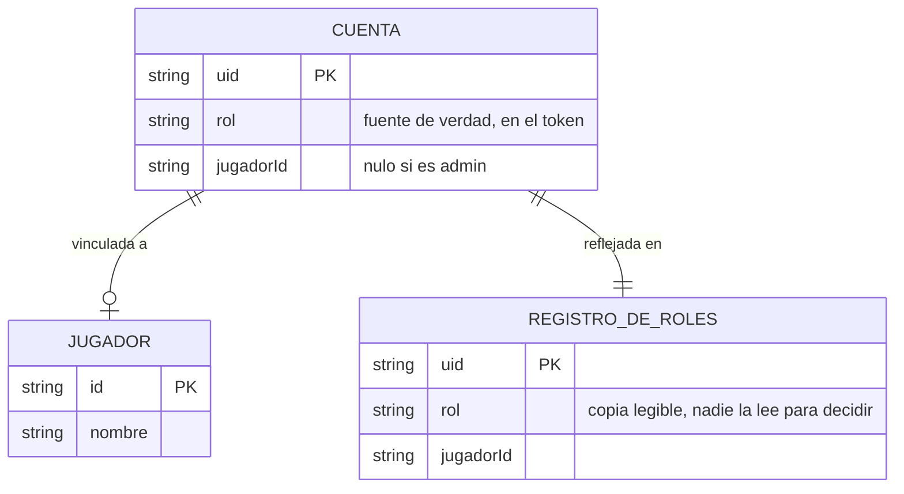

# Rol en el token — Spec

> **Status:** Draft · **Date:** 2026-09-09 · **Owner:** Lucas Manoukian
>
> **Reviewers:** *pending*
>
> **Concept note:** [ROL_EN_EL_TOKEN_CONCEPT.md](./ROL_EN_EL_TOKEN_CONCEPT.md)
>
> **Implementation plan:** [ROL_EN_EL_TOKEN_IMPLEMENTATION_PLAN.md](./ROL_EN_EL_TOKEN_IMPLEMENTATION_PLAN.md)

> **Grounding evidence (`MD-25`).** Esta Spec se apoya en el ledger §6.5
> *Sources & Origins* de la Concept Note, que es el registro maestro. Donde un
> `FR-*` / `NFR-*` / `TC-*` de acá se apoya en una ubicación del código, una
> cláusula de un estándar o una medición que §6.5 no cubre, la cita va **en
> línea** en la sección donde se define. Las líneas de `index.html` citadas
> corresponden al estado del archivo en el commit `19ddf38`.

## 1. Purpose

Esta Spec define qué debe hacer el sistema para que el rol de una cuenta
(`admin` o `jugador`) viaje adentro del token de sesión de Firebase Auth en vez
de resolverse con una lectura a Firestore posterior al login, y cómo debe
comportarse en el arranque, en las reglas de seguridad, al asignar un rol y
durante la mudanza. El *por qué* vive en la Concept Note; el *cómo* (módulos,
rutas, orden de ramas) vive en el Implementation Plan y no acá.

No cubre: qué puede hacer cada rol —eso ya lo fija
[`docs/007-permisos-por-usuario/spec.md`](../007-permisos-por-usuario/spec.md) y
no cambia—, ni ninguna pantalla de registro o administración de cuentas.

## 2. Summary

Hoy la aplicación se muestra antes de saber quién entró: asume el rol más
restringido y completa la interfaz cuando vuelve una lectura a la base. Medido,
eso deja a la solapa **Configuración** apareciendo entre **487 ms** y **821 ms**
después de las otras dos para un administrador. Esta feature mueve el rol
adentro del token que el login ya devuelve, con lo cual el dato está disponible
en el momento en que la sesión resuelve y la interfaz se pinta correcta de una
sola vez. Las reglas de seguridad de Firestore leen el mismo dato del token, así
que dejan de consultar un documento para autorizar. Asignar un rol pasa a
hacerse con un script que el propietario corre a mano, y la colección que hoy
guarda los roles sobrevive como registro legible para consumo humano. La
aplicación sigue siendo una página estática sin servidor propio: lo que cambia es
de dónde saca su identidad, no su arquitectura.

## 3. Scope

### 3.1 In scope

- Resolver el rol y el jugador vinculado a partir del token de Firebase Auth, sin
  ninguna lectura a Firestore en el camino.
- Reescribir las reglas de seguridad de Firestore para que autoricen leyendo el
  token en vez de un documento.
- Un script de asignación de roles, corrido a mano, que estampa el rol en la
  cuenta y mantiene el registro legible.
- El comportamiento del corte: qué pasa con una sesión que ya estaba abierta y
  cuyo token todavía no trae el rol.
- La eliminación de la maquinaria que existía sólo para adelantarse a la lectura
  del rol (la pista en `localStorage` y el prefetch que dependía de ella).

### 3.2 Out of scope / non-goals

Los cinco primeros son los no-objetivos permanentes de la Concept Note §4,
reformulados como límites verificables:

- El sistema **no** ofrecerá ninguna pantalla de registro, alta o administración
  de cuentas: la única forma de asignar un rol seguirá siendo el script.
- El sistema **no** incorporará Cloud Functions ni ningún componente desplegado
  del lado servidor.
- El sistema **no** modificará qué puede ver o hacer cada rol: los permisos de
  `007-permisos-por-usuario` quedan idénticos.
- El sistema **no** migrará `data/partidos` a documentos nativos, y por lo tanto
  **no** cierra la limitación aceptada en el `research.md` §3 de esa feature.
- El sistema **no** perseguirá reducir el tiempo total de arranque: el objetivo
  es el costo de identidad, no la carga de datos.
- **Nuevo (descubierto al redactar):** el sistema **no** forzará el cierre de
  sesión de una cuenta cuando su rol cambie (`D-10`); el cambio se aplica en el
  próximo refresco del token.
- **Nuevo (descubierto al redactar):** el sistema **no** validará que el
  `jugadorId` de un claim corresponda a un jugador existente. Esa validación no
  existe hoy ([`docs/007-permisos-por-usuario/data-model.md`](../007-permisos-por-usuario/data-model.md)
  la declara responsabilidad de quien carga el dato) y esta feature no la agrega.

### 3.3 Constraints inherited from the Concept Note

Se heredan como constraints y no se relitigan:

- **`D-01`** (el rol viaja como custom claim) — esta Spec asume que el token es
  la fuente de verdad del rol, para la app y para las reglas.
- **`D-02`** (el claim lleva `rol` y `jugadorId`) — ambos campos viajan juntos.
- **`D-03`** (script local con Admin SDK, sin backend desplegado).
- **`D-04`** (la llave de cuenta de servicio nunca se versiona).
- **`D-05`** (`userRoles` sobrevive como registro legible; nadie lo lee para
  decidir).
- **`D-06`** (las reglas leen `request.auth.token.rol`; `rol()` se elimina).
- **`D-07`** (*fail-closed*: sin claim `rol`, se trata como `jugador`).
- **`D-08`** (la mudanza es un corte de una vez, con aviso).
- **`D-09`** (si el token no trae el claim, se fuerza **un** refresco).
- **`D-10`** (no se fuerza el cierre de sesión al cambiar un rol).
- **`D-11`** (`window.session` conserva su forma `{ rol, jugadorId }`).
- **`D-12`** (se elimina la pista de rol en `localStorage`).

## 4. Technical & architectural constraints

### 4.1 Platform / stack constraints

- **TC-001** — El rol deberá transportarse mediante *custom claims* de Firebase
  Auth. No se admite ningún otro mecanismo de transporte (cookie propia,
  cabecera, parámetro de URL, almacenamiento del navegador) (`D-01`).
- **TC-002** — El cliente deberá seguir usando el SDK de Firebase ya cargado por
  CDN en su versión *compat* 11.0.2
  ([`index.html:1317-1319`](../../index.html#L1317-L1319)). No se admite agregar
  un SDK nuevo, un paso de build ni un bundler.
- **TC-003** — El Admin SDK de Firebase deberá vivir **exclusivamente** en el
  entorno del script. No se admite que aparezca en `index.html`, ni en la
  aplicación publicada, ni como dependencia instalada del repositorio: sigue el
  mismo tratamiento que Playwright, dependencia opcional de desarrollo externa al
  repositorio ([`AGENTS.md`](../../AGENTS.md) → Dependencias) (`D-03`).

### 4.2 Architectural / integration constraints

- **TC-010** — El rol deberá seguir accediéndose a través de `window.session` y
  `isAdmin()` ([`index.html:1403-1421`](../../index.html#L1403-L1421)). Ninguna
  función de interfaz deberá leer el token, el claim ni Firebase Auth
  directamente (`D-11`, principio de arquitectura desacoplada de
  [`AGENTS.md`](../../AGENTS.md)).
- **TC-011** — Las reglas de seguridad de Firestore deberán resolver el rol
  leyendo `request.auth.token.rol`. La función `rol()` que hoy hace `get()` sobre
  `userRoles/{uid}`
  ([`docs/007-permisos-por-usuario/contracts/firestore-rules.md:19`](../007-permisos-por-usuario/contracts/firestore-rules.md#L19))
  deberá eliminarse, no coexistir (`D-06`).
- **TC-012** — La colección `userRoles` deberá quedar sin ningún lector
  automático: ni la aplicación ni las reglas deberán consultarla para decidir
  nada. Su regla de lectura desde el cliente deberá pasar a denegar (`D-05`).
- **TC-013** — El script deberá escribir el claim y el registro en la misma
  corrida, de forma que no exista un camino que actualice uno sin el otro
  (`D-05`).

### 4.3 Compliance / regulatory constraints

`Compliance constraints: none` — la feature no introduce datos regulados nuevos,
no cambia qué datos personales se guardan y no agrega superficie pública (Concept
Note §5.2). La única credencial nueva es interna al entorno del propietario y se
trata en §4.5.

### 4.4 Conventions to follow

- **TC-030** — El claim deberá llamarse `rol`, y su valor deberá ser exactamente
  la cadena `admin` o `jugador`. El jugador vinculado deberá llamarse
  `jugadorId`. Los tres nombres replican los del modelo de datos vigente
  ([`docs/007-permisos-por-usuario/data-model.md`](../007-permisos-por-usuario/data-model.md))
  y la convención en español del proyecto (resuelve `OPEN-Q-04` de la Concept
  Note).
- **TC-031** — El script deberá vivir en [`tools/`](../../tools/) y seguir el
  estilo de las utilidades que ya están ahí: Node, ejecutable a mano, con su
  propósito y su modo de uso documentados en el encabezado del archivo (resuelve
  `OPEN-Q-02`).
- **TC-032** — La llave de cuenta de servicio deberá referenciarse por ruta desde
  fuera del repositorio, y el repositorio deberá ignorarla explícitamente. No se
  admite que su contenido aparezca en ningún archivo versionado (`D-04`).
- **TC-033** — Los tests que verifican comportamiento dependiente del rol deberán
  interceptar el token, no la colección `userRoles`
  ([`tests/fixtures-app.js:282`](../../tests/fixtures-app.js#L282)).

### 4.5 Security constraints (`MD-31`)

Categorías derivadas del **CWE Top 25 de 2025**, recuperado en vivo de
<https://cwe.mitre.org/top25/archive/2025/2025_cwe_top25.html> el 2026-09-09
(verificado, sin marcador `[UNVERIFIED]`). Se atienden las categorías que la
postura de seguridad de la Concept Note §5.2 pone en juego; el resto lleva su
resolución explícita.

**Categorías aplicables, como constraints:**

- **TC-040** — El rol deberá derivarse únicamente de un token verificado por
  Firebase. Ningún dato bajo control del usuario —`localStorage`, parámetros de
  URL, campos del DOM— deberá poder influir en el rol efectivo, **defiende
  `CWE-639` *Authorization Bypass Through User-Controlled Key*** (puesto 24) y es
  lo que descalifica a la alternativa C de la Concept Note §9.3.
- **TC-041** — Toda regla de Firestore que hoy exige `rol() == 'admin'` deberá
  seguir exigiendo el rol equivalente leído del token, sin ampliar el conjunto de
  operaciones permitidas, **defiende `CWE-862` *Missing Authorization*** (puesto
  4). La equivalencia deberá verificarse documento por documento contra las **reglas
  vivas de los dos proyectos Firebase**, leídas de la consola, y **no** contra el
  contrato committeado en
  [`docs/007-permisos-por-usuario/contracts/firestore-rules.md`](../007-permisos-por-usuario/contracts/firestore-rules.md):
  ese contrato está **probadamente incompleto**. Cubre 5 de los 6 documentos de
  `DOCS_SOLO_ADMIN` ([`index.html:1855-1857`](../../index.html#L1855-L1857)) — no tiene
  bloque `match` para `ordenJugadoresMigrado`, que la feature `orden-jugadores` agregó a
  esa lista después ([`ORDEN_JUGADORES_IMPLEMENTATION_PLAN.md`](../orden-jugadores/ORDEN_JUGADORES_IMPLEMENTATION_PLAN.md)).
  Ver `OPEN-Q-04`.
- **TC-042** — La comparación del rol deberá ser por igualdad exacta contra la
  cadena esperada. No se admite coerción de tipos, comparación laxa ni
  interpretación de valores ausentes como verdaderos, **defiende `CWE-863`
  *Incorrect Authorization*** (puesto 17).
- **TC-043** — Un token sin el claim `rol`, con el claim vacío, o con un valor
  distinto de `admin`/`jugador`, deberá tratarse como `jugador`; nunca como
  `admin`, **defiende `CWE-284` *Improper Access Control*** (puesto 19) y
  materializa `D-07`.
- **TC-044** — El script deberá validar el rol recibido contra el conjunto
  cerrado `{admin, jugador}` y rechazar cualquier otro valor sin escribir nada —
  ni claim ni registro—, **defiende `CWE-20` *Improper Input Validation***
  (puesto 18).
- **TC-045** — El script deberá exigir la llave de cuenta de servicio para
  operar; no deberá tener ningún modo de funcionamiento sin credencial ni
  degradado, **defiende `CWE-306` *Missing Authentication for Critical
  Function*** (puesto 21).
- **TC-046** — El refresco forzado del token deberá ejecutarse **como máximo una
  vez por sesión de navegador** y sólo cuando el claim falta, **defiende
  `CWE-770` *Allocation of Resources Without Limits or Throttling*** (puesto 25)
  y acota `D-09`.
- **TC-047** — La llave de cuenta de servicio deberá quedar fuera del repositorio
  e ignorada explícitamente, y el script no deberá volcar su contenido en logs ni
  en mensajes de error, **defiende `CWE-522` *Insufficiently Protected
  Credentials***. *Inclusión fuera del Top 25 — motivo:* `CWE-522` no figura en
  el Top 25 de 2025, pero es la categoría que describe exactamente el único
  artefacto sensible nuevo que introduce esta feature (Concept Note §5.2), y
  omitirla dejaría el riesgo de mayor severidad de §15 sin constraint que lo
  ancle.

**Categorías del Top 25 resueltas como no aplicables:**

- **`CWE-79` *XSS***, **`CWE-352` *CSRF***, **`CWE-200` *Exposure of Sensitive
  Information***, **`CWE-434` *Unrestricted Upload***, **`CWE-918` *SSRF*** — no
  aplicables; la feature no agrega superficie de renderizado, ni formularios, ni
  subida de archivos, ni pedidos salientes a URLs provistas por el usuario (§5.2
  declara que no procesa entrada no confiable de terceros). Los valores que
  viajan en el claim (`rol`, `jugadorId`) no son sensibles ni regulados.
- **`CWE-89` *SQL Injection***, **`CWE-78` / `CWE-77` *Command Injection***,
  **`CWE-94` *Code Injection***, **`CWE-502` *Deserialization*** — no aplicables;
  no hay SQL, no se construyen comandos de sistema, no se evalúa código, y la
  feature no agrega ninguna deserialización nueva (la de los blobs JSON de
  Firestore es preexistente y queda sin cambios).
- **`CWE-787` / `CWE-125` *Out-of-bounds***, **`CWE-416` *Use After Free***,
  **`CWE-476` *NULL Pointer Dereference***, **`CWE-120` / `CWE-121` / `CWE-122`
  *Buffer Overflow*** — no aplicables; el proyecto es JavaScript sobre navegador
  y Node, sin manejo manual de memoria.
- **`CWE-22` *Path Traversal*** — no aplicable a la aplicación. En el script, la
  única ruta que se maneja es la de la llave, provista por el propio operador en
  su máquina; no hay ruta de origen no confiable (§5.2 declara que la única
  entrada humana es la del operador).

## 5. Users & use cases

### 5.1 Personas / actors

| Actor | Description | Primary need |
|---|---|---|
| Administrador | Cuenta con rol `admin`. Organiza los partidos, arma equipos y configura el motor | Que la aplicación se muestre completa desde el primer pintado, sin que la solapa Configuración llegue tarde |
| Jugador | Cuenta con rol `jugador`. Se anota y se da de baja de una convocatoria | Que la aplicación sepa qué jugador es sin pagar una lectura de red, y que nunca vea funciones que no le corresponden |
| Propietario / operador | La persona que asigna los roles. Hoy y después, es Lucas Manoukian | Poder asignar un rol y ver, de un vistazo, quién tiene cuál y a quién le falta |

### 5.2 User stories

| ID | Story | Implements |
|---|---|---|
| US-01 | Como administrador, quiero que la solapa Configuración aparezca junto con las otras dos, para no ver la barra reacomodarse cuando ya daba la carga por terminada | FR-001, FR-002, FR-003 |
| US-02 | Como jugador, quiero que la aplicación sepa qué jugador soy sin ir a buscarlo, para que mi arranque también sea inmediato | FR-004, FR-005 |
| US-03 | Como propietario, quiero asignar un rol con un comando, para no tener que crear documentos a mano en la consola | FR-020, FR-021, FR-022 |
| US-04 | Como propietario, quiero listar los roles asignados y las cuentas sin rol, para detectar un olvido antes de que alguien lo reporte | FR-025, FR-026 |
| US-05 | Como cualquier usuario con la sesión ya abierta, quiero que el cambio de mecanismo no me obligue a cerrar sesión y volver a entrar | FR-030, FR-031 |

## 6. Glossary

| Term | Definition |
|---|---|
| Token de ID | Credencial firmada que Firebase Auth emite al resolver una sesión, válida una hora, que la aplicación ya posee sin pedirla por red |
| Claim | Campo transportado adentro del token de ID. Los *custom claims* son los que este proyecto define: `rol` y `jugadorId` |
| Rol | Perfil de la cuenta. Conjunto cerrado: exactamente `admin` o `jugador` |
| Registro de roles | La colección `userRoles` en su papel nuevo: copia legible por humanos de qué rol tiene cada cuenta, que nadie lee para decidir nada (`D-05`) |
| Refresco forzado | Pedido explícito de un token nuevo, que trae los claims vigentes sin esperar a que el actual expire (`D-09`) |
| Fail-closed | Regla de resolución ante un dato ausente o inválido: se asume el rol más restringido, nunca el más permisivo (`D-07`) |
| Hueco de la solapa | Tiempo transcurrido entre el instante en que la aplicación se vuelve visible y el instante en que la solapa Configuración se vuelve visible. Es la magnitud que esta feature reduce, medida en NFR-001 |

## 7. Functional requirements

### 7.1 Resolución del rol en el arranque

- **FR-001** — Cuando una sesión se resuelve, el sistema deberá obtener el rol y
  el jugador vinculado de los claims del token de ID, sin realizar ninguna
  lectura a Firestore para ese fin.
- **FR-002** — Cuando el rol resuelto es `admin`, el sistema deberá habilitar la
  interfaz de administrador antes del primer pintado de la barra de solapas, de
  forma que las tres solapas aparezcan en el mismo estado visual inicial.
- **FR-003** — El sistema deberá exponer el rol y el jugador vinculado resueltos
  a través del objeto de sesión, con la forma `{ rol, jugadorId }` (`D-11`). Que
  ésa sea la **única** vía de acceso es un mandato sobre el espacio de soluciones
  y vive en `TC-010`, no acá.
- **FR-004** — Cuando el rol resuelto es `jugador`, el sistema deberá tomar el
  jugador vinculado del claim `jugadorId` del mismo token.
- **FR-005** — El sistema deberá completar la resolución del rol sin ninguna
  petición de red, siempre que el token en poder del cliente esté vigente y
  contenga el claim `rol`. Esto es la **conducta**; el presupuesto de tiempo que
  la acompaña es NFR-001 y el de lecturas es NFR-002 — si se edita uno hay que
  revisar los tres.
- **FR-006** — Si el token vigente no contiene el claim `rol`, entonces el
  sistema deberá solicitar un refresco del token una única vez y reintentar la
  resolución con el token nuevo (`D-09`, `TC-046`).
- **FR-007** — Si tras el refresco el token sigue sin contener un claim `rol`
  válido, entonces el sistema deberá resolver la sesión como `jugador` sin
  jugador vinculado, sin mostrar ningún aviso al usuario (`D-07`, `TC-043`;
  resuelve `OPEN-Q-03` de la Concept Note manteniendo el comportamiento actual).
- **FR-008** — El sistema no deberá leer ni escribir ninguna pista del rol en el
  almacenamiento del navegador (`D-12`).
- **FR-009** — Cuando el rol resuelto es `admin`, el sistema deberá pedir los
  documentos de administrador a partir de ese rol, sin depender de ninguna pista
  previa (`D-12`).

### 7.2 Autorización en la persistencia

- **FR-010** — Las reglas de seguridad deberán autorizar cada operación
  comparando el claim `rol` del token contra el rol exigido por el documento
  afectado (`D-06`, `TC-011`).
- **FR-011** — Las reglas deberán conceder, para cada documento, exactamente el
  mismo conjunto de operaciones por rol que concede el contrato vigente de
  `007-permisos-por-usuario` (`TC-041`).
- **FR-012** — Las reglas deberán denegar la lectura de la colección `userRoles`
  desde el cliente (`D-05`, `TC-012`).
- **FR-013** — Si el token no presenta un claim `rol` reconocido, entonces las
  reglas deberán denegar toda operación que exija rol `admin` (`TC-043`).

### 7.3 Asignación de roles

- **FR-020** — El script deberá asignar a una cuenta indicada un rol del conjunto
  `{admin, jugador}`, escribiéndolo como claim de esa cuenta.
- **FR-021** — Cuando el rol asignado es `jugador`, el script deberá aceptar
  además un jugador vinculado y escribirlo en el claim `jugadorId`.
- **FR-022** — Cuando una asignación se completa, el script deberá dejar el
  registro de roles reflejando el mismo valor que quedó en el claim (`TC-013`).
- **FR-023** — Si el rol recibido no pertenece al conjunto `{admin, jugador}`,
  entonces el script deberá rechazar la operación sin escribir el claim ni el
  registro (`TC-044`).
- **FR-024** — Si la cuenta indicada no existe, entonces el script deberá
  rechazar la operación sin escribir nada.
- **FR-025** — El script deberá poder listar, para todas las cuentas existentes,
  el rol asignado a cada una.
- **FR-026** — El listado deberá señalar explícitamente las cuentas que no tienen
  ningún rol asignado.
- **FR-027** — Si la llave de cuenta de servicio no está disponible en la ruta
  indicada, entonces el script deberá interrumpirse con un error y no deberá
  intentar ninguna operación (`TC-045`).
- **FR-028** — Cuando el rol indicado coincide con el que la cuenta ya tiene, el script
  deberá completar la operación sin alterar el resultado y sin fallar.

### 7.4 Mudanza

- **FR-030** — Durante la mudanza, el sistema deberá resolver, para una cuenta
  cuya sesión ya estaba abierta antes del cambio, el mismo rol que está estampado
  en su cuenta del lado servidor, sin requerir que la persona cierre sesión
  (`D-08` mitigado por `D-09`, vía FR-006).
- **FR-031** — El sistema deberá aplicar un cambio de rol a partir del siguiente
  token que la cuenta obtenga, sin forzar el cierre de la sesión en curso
  (`D-10`).
- **FR-032** — El sistema no deberá conservar ningún camino de código que
  resuelva el rol leyendo la colección `userRoles`. Es la contraparte, del lado
  de la aplicación, de lo que `TC-011` exige en las reglas y `TC-012` en la
  colección — si se edita uno hay que revisar los tres.

## 8. Non-functional requirements

| ID | Category | Requirement |
|---|---|---|
| NFR-001 | Performance | **Con el token vigente** (login recién hecho, o sesión abierta hace menos de una hora), el hueco de la solapa deberá ser **≤ 50 ms**: el rol sale de un token que el cliente ya tiene y su lectura no requiere red. **Confirmado alcanzable por medición** (2026-09-09, 12 corridas contra staging): leer los claims de un token vigente cuesta **0 ms** (máximo observado: 1 ms), porque no toca la red. Línea de base contra la que se compara: **821 ms** con login explícito, **487 ms** con sesión ya abierta |
| NFR-001b | Performance | **Con el token vencido** (la aplicación no se abrió en más de una hora, que es el caso más frecuente en uso real), la magnitud a medir es el **arranque completo** —desde que la página empieza a vivir hasta que la barra de solapas queda pintada con su composición final— y deberá ser **≤ 2000 ms** en la mediana de tres corridas. **El objetivo se subió de 600 a 2000 ms el 2026-09-10 por segunda vez, al cambiar QUÉ instante cierra la magnitud** (ver §18): desde el arreglo del arranque en dos etapas, la barra de solapas se pinta junto con los datos, así que esta magnitud pasó a incluir la lectura a Firestore (~620 ms) que antes caía fuera. Medido con `tools/medir-arranque.js --caso=vencido` contra staging el 2026-09-10, ya con el arreglo: **mediana 1693 ms** (1444-1698, tres corridas); el caso normal (`--caso=vigente`) da **809 ms**. **Lo que NO cambió es la espera de la persona**, y se midió de los dos lados con la misma sonda: el contenido queda pintado a los **625 ms** antes del arreglo y a los **613 ms** después (mediana de cinco recargas). Lo que se eliminó no es tiempo sino un estado — la aplicación visible y vacía. **Consecuencia que hay que tener presente:** con la lectura adentro, este número ya no aísla una regresión en la resolución del rol; para eso quedan `TC-046` (un refresco por carga) y el presupuesto de sobrecosto del escenario `rol-corte-token-vencido` en `tests/layout.test.js`, que corre contra un doble sin latencia de red. **El objetivo anterior de 600 ms venía a su vez de subirlo desde 400 el mismo día, por medición** (ver §18): los 400 ms salían de medir el refresco *aislado* (mediana 250 ms) más margen, y medido end-to-end sobre la aplicación real contra staging el arranque con token vencido da **mediana 497 ms** (470–498, tres corridas, cuentas ya estampadas). Los 400 ms eran inalcanzables, no por un defecto de la implementación —el hueco es 0 ms y no hay ningún refresco de más— sino porque el presupuesto se había fijado sobre una medición parcial. Los 600 ms dejan margen de varianza de red sobre los 497 observados. **Corregido el 2026-09-09** (ver §18): el objetivo estaba fijado sobre el *hueco de la solapa* tal como lo define el Glosario, y con `TD-02` del Implementation Plan —que resuelve el rol **antes** de revelar `appRoot`— ese hueco es **0 ms por construcción** en los dos casos, con lo que un techo de 400 ms medido sobre él quedaba vacuo. La espera no desaparece, se mueve: hay que acotar el arranque entero, que es lo que incluye el refresco del token. Reformulado el 2026-09-10 al darse de baja el loader de sesión, que era donde la corrección original ponía esa espera. El número sale de medir el costo aislado del refresco (`OPEN-Q-02`, resuelta el 2026-09-09, 12 corridas contra staging): **mediana 250 ms**, rango 225–582 ms; el techo de 400 ms deja margen para la varianza de red sin volver el objetivo inofensivo. **Importante para dimensionar la mejora:** la línea de base de 487 ms se midió con un token *fresco*, así que subestima el caso real. Hoy, con el token vencido, se paga el refresco **más** la lectura a Firestore (mediana 499 ms aislada, que cuadra con los 487 ms medidos end-to-end): del orden de **750 ms**. La mejora real de este caso es de ~750 ms a ~250 ms, no de 487 a algo. `[UNVERIFIED — lo medido es un refresco *forzado* (`getIdToken(true)`), que ejecuta el mismo intercambio contra el endpoint de tokens que el SDK hace al expirar; no se verificó con una sesión orgánicamente vencida de más de una hora. Es el mismo mecanismo, pero no la misma corrida]` |
| NFR-002 | Performance | Un arranque completo de una cuenta `admin` deberá producir **0 lecturas** del documento `userRoles/{uid}`. La línea de base contra la que se compara **se mide en AC-12, no se asume**: por composición serían una lectura de la aplicación más una por cada documento sólo-admin que evalúa `rol()` (siete en total), pero Firestore documenta que algunas de esas consultas se cachean sin decir cuándo, así que el número real puede ser menor. El objetivo comprometido es el cero, que no depende de esa incógnita |
| NFR-003 | Security | El rol efectivo deberá depender exclusivamente de datos firmados por Firebase. Un navegador con su almacenamiento local manipulado en cualquier forma no deberá poder obtener rol `admin` ni acceso a ningún documento sólo-admin (`TC-040`) |
| NFR-004 | Cost | El cambio no deberá aumentar el consumo de Firestore. El único costo nuevo admisible es **1 escritura por asignación de rol**; el consumo por arranque y por operación deberá bajar |
| NFR-005 | Maintainability | Tras el cambio no deberá quedar en el repositorio ningún código cuya única razón de existir fuera adelantarse a la lectura del rol (`D-12`, FR-008), verificable por ausencia de referencias a la pista de rol |
| NFR-006 | Compatibility | La feature no deberá introducir ningún estado de layout nuevo: la barra con tres solapas ya existe hoy para un administrador y está cubierta por `tests/layout.test.js`. El piso de 360 px de [`AGENTS.md`](../../AGENTS.md) se cumple por no-regresión, no por escenario nuevo. **Nota del 2026-09-10** (ver §18): esto se corrigió el 2026-09-09 para declarar un estado nuevo —el loader de sesión de `TD-03`— y se **volvió atrás** el 2026-09-10 al darse de baja ese loader. El requisito queda como estaba en el borrador original, y esta vez con la implementación coincidiendo. **Segunda nota del 2026-09-10:** el arranque **sí** tiene desde ese día un estado de layout nuevo, la *pantalla de carga*, con su escenario `carga` en `tests/layout.test.js` desde 360 px. No lo introduce esta feature y por eso el requisito no cambia: lo introduce el arreglo del arranque en dos etapas (misma fecha, §18), que tapa la espera de las **lecturas a Firestore** —siempre presente, ~620 ms— y no la del refresco del token, que era lo que tapaba el loader dado de baja. La diferencia importa: aquel loader se montaba por 250 ms y sólo durante el corte de la mudanza; éste cubre una espera que existe en todos los arranques |
| NFR-007 | Observability | El consumo de lecturas de Firestore deberá quedar observable antes y después del cambio, de forma que NFR-002 y NFR-004 puedan verificarse sobre datos y no por inspección de código |

## 9. System behaviour & scenarios

### 9.1 Happy path scenarios

#### Scenario S-01 — Un administrador abre la aplicación con la sesión ya guardada (covers FR-001, FR-002, FR-003, NFR-001)

- **Given** una cuenta con claim `rol` igual a `admin`
- **And** la sesión ya persistida en el navegador
- **When** la persona abre la aplicación
- **Then** el sistema deberá resolver el rol a partir del token, sin leer `userRoles`
- **And** la barra deberá pintarse con las tres solapas en su primer estado visible
- **And** la barra no deberá cambiar de composición después de ese primer pintado

**Variants:**

- `S-01a [boundary]` — token emitido hace segundos: el claim ya está y no hace falta refresco
- `S-01b [boundary]` — token vencido: se refresca y el rol resuelve igual, cumpliendo NFR-001b
- `S-01c [failure]` — el refresco del token falla por falta de red: la sesión resuelve como `jugador` y la aplicación arranca sin romperse (FR-007)
- `S-01d [property]` — para cualquier token con claim `rol` válido, el conjunto de solapas del primer pintado es el que corresponde a ese rol y no cambia después

#### Scenario S-02 — Un administrador hace login explícito (covers FR-001, FR-002, NFR-001)

- **Given** la pantalla de login
- **When** la persona ingresa credenciales válidas de una cuenta con claim `rol` igual a `admin`
- **Then** el sistema deberá resolver el rol del token que devuelve el login, sin ninguna lectura adicional
- **And** la aplicación deberá aparecer con las tres solapas juntas

**Variants:**

- `S-02a [failure]` — credenciales incorrectas: no hay sesión y no se intenta resolver ningún rol
- `S-02b [concurrency]` — dos pestañas de la misma cuenta abriendo a la vez: cada una resuelve su rol de su propio token, sin coordinarse ni interferir

#### Scenario S-03 — Un jugador abre la aplicación (covers FR-004, FR-005, FR-012)

- **Given** una cuenta con claim `rol` igual a `jugador` y claim `jugadorId` con el identificador de un jugador
- **When** la persona abre la aplicación
- **Then** el sistema deberá tomar el jugador vinculado del token, sin leer `userRoles`
- **And** la solapa Configuración no deberá estar visible ni accesible en ningún momento

**Variants:**

- `S-03a [boundary]` — cuenta `jugador` cuyo claim `jugadorId` es nulo: la sesión resuelve sin jugador vinculado, como hoy
- `S-03b [failure]` — la cuenta intenta leer `userRoles` directo contra Firestore: denegado (FR-012)

#### Scenario S-04 — El propietario asigna un rol con el script (covers FR-020, FR-021, FR-022)

- **Given** la llave de cuenta de servicio disponible en su ruta
- **And** una cuenta existente sin rol asignado
- **When** el propietario corre el script indicando esa cuenta y el rol `admin`
- **Then** el script deberá escribir el claim `rol` en la cuenta
- **And** deberá dejar el registro de roles reflejando el mismo valor
- **And** la persona deberá ver el rol nuevo en su siguiente ingreso (FR-031)

**Variants:**

- `S-04a [boundary]` — se asigna el mismo rol que la cuenta ya tenía: la operación es idempotente y no deja el registro inconsistente (FR-028)
- `S-04b [failure]` — el rol indicado no pertenece a `{admin, jugador}`: no se escribe ni el claim ni el registro (FR-023, TC-044)
- `S-04c [failure]` — la cuenta indicada no existe: no se escribe nada (FR-024)
- `S-04d [failure]` — la llave no está en la ruta indicada: el script se interrumpe sin operar (FR-027, TC-045)
- `S-04e [concurrency]` — dos corridas del script sobre la misma cuenta se solapan: el estado final corresponde a una de las dos, y claim y registro quedan coherentes entre sí (TC-013)

#### Scenario S-05 — El propietario lista los roles asignados (covers FR-025, FR-026)

- **Given** varias cuentas, algunas con rol y otras sin ninguno
- **When** el propietario corre el script en modo listado
- **Then** el script deberá informar el rol de cada cuenta existente
- **And** deberá señalar explícitamente las que no tienen ninguno

**Variants:**

- `S-05a [boundary]` — ninguna cuenta sin rol: el listado lo declara explícitamente en vez de omitir la sección
- `S-05b [boundary]` — todas las cuentas sin rol, como quedaría un proyecto antes de la mudanza

### 9.2 Edge cases

#### Scenario S-10 — Una cuenta sin ningún rol asignado entra a la aplicación (covers FR-007, TC-043)

- **Given** una cuenta autenticada cuyo token no trae claim `rol`
- **And** ninguna asignación pendiente que un refresco pudiera traer
- **When** la persona abre la aplicación
- **Then** el sistema deberá resolver la sesión como `jugador` sin jugador vinculado
- **And** no deberá mostrar ningún aviso ni pantalla nueva
- **And** no deberá conceder en ningún momento acceso a funciones de administrador

**Variants:**

- `S-10a [boundary]` — el claim `rol` está presente pero es una cadena vacía
- `S-10b [failure]` — el claim `rol` trae un valor desconocido, como `Admin` o `administrador`: se trata como `jugador` por comparación exacta (TC-042)

#### Scenario S-11 — El corte: una sesión abierta antes del cambio (covers FR-006, FR-030, TC-046)

- **Given** una cuenta `admin` ya estampada del lado servidor
- **And** una sesión abierta en el navegador desde antes del cambio, cuyo token no trae el claim
- **When** la persona abre la aplicación
- **Then** el sistema deberá pedir un refresco del token una única vez
- **And** deberá resolver el rol `admin` con el token nuevo
- **And** no deberá requerir que la persona cierre sesión ni vuelva a ingresar credenciales

**Variants:**

- `S-11a [boundary]` — el refresco trae el claim en el primer intento, que es el caso esperado del corte
- `S-11b [failure]` — el refresco no trae el claim porque la cuenta no fue estampada: resuelve como `jugador`, en silencio (FR-007)
- `S-11c [property]` — para cualquier secuencia de navegación dentro de la misma pestaña, el refresco forzado ocurre a lo sumo una vez (TC-046)

### 9.3 Failure / unwanted-behaviour scenarios

#### Scenario S-20 — Un jugador intenta escribir un documento sólo-admin sin pasar por la interfaz (covers FR-011, FR-013, TC-041)

- **Given** una cuenta con claim `rol` igual a `jugador`
- **When** intenta escribir `data/motorConfig` directo contra Firestore
- **Then** las reglas deberán denegar la operación
- **And** no deberán producir ninguna lectura de `userRoles` al decidirlo (NFR-002)

**Variants:**

- `S-20a [failure]` — el mismo intento sobre `data/playerScores` y `data/partidosArmado`
- `S-20b [failure]` — token sin claim `rol`: denegado igual (FR-013)
- `S-20c [property]` — para cada documento del contrato de `007-permisos-por-usuario`, el conjunto de operaciones concedidas a cada rol es idéntico al que concedía el contrato anterior (TC-041)

#### Scenario S-21 — Un navegador manipulado intenta hacerse pasar por administrador (covers NFR-003, TC-040)

- **Given** una cuenta con claim `rol` igual a `jugador`
- **When** se manipula el almacenamiento local del navegador para declarar rol `admin`
- **Then** la interfaz no deberá conceder ninguna función de administrador
- **And** Firestore deberá rechazar toda operación sólo-admin, porque autoriza contra el token firmado y no contra el navegador

**Variants:**

- `S-21a [failure]` — se inyecta una pista de rol `admin` en el almacenamiento local: no existe código que la lea (FR-008)
- `S-21b [failure]` — se modifica el objeto de sesión en memoria desde la consola del navegador: la interfaz puede mostrarse alterada, pero Firestore rechaza toda operación y ningún dato sólo-admin llega al cliente (NFR-003)

## 10. Data model & external contracts

### 10.1 Domain entities (conceptual)

No se introduce ninguna entidad de dominio nueva. Una entidad **cambia de
lugar** y otra **cambia de papel**:

| Entity | Purpose | Key attributes (conceptual) | Lifecycle |
|---|---|---|---|
| Cuenta de usuario | Identidad autenticada. Pasa a **portar** el rol y el jugador vinculado adentro de su token | `rol` (`admin`/`jugador`), `jugadorId` (o nulo) | La crea el propietario en Firebase Auth; el script le estampa los claims; los claims llegan al cliente en el siguiente token |
| Registro de roles | Copia legible por humanos de qué rol tiene cada cuenta. **Ningún** proceso la lee para decidir (`D-05`) | `uid`, `rol`, `jugadorId` | La escribe el script en la misma corrida que el claim; nadie más la toca |
| Jugador | Entidad de dominio existente, sin cambios | `id`, nombre, posiciones, … | Sin cambios respecto de `002-gestion-jugadores` |

#### 10.1.1 Entity-relationship diagram

Se incluye aunque no es obligatorio —no hay entidad nueva— porque la relación
entre las tres, y sobre todo cuál es fuente de verdad, es lo que esta feature
cambia.

> **Render verificado el 2026-09-09.** Se instaló el navegador que le faltaba a la CLI de
> Mermaid y se renderizó el bloque a imagen: dibuja las 3 entidades con sus atributos y las
> 2 relaciones con su cardinalidad, sin carteles de error y sin rótulos superpuestos. El
> marcador `[UNVERIFIED]` que llevaba antes —agregado tras la crítica independiente, que
> señaló que la Concept Note declaraba esta limitación para su diagrama y esta Spec la había
> omitido para el suyo— queda cerrado.

### 10.2 External APIs / events the feature consumes

| Source | Contract | Direction | Notes |
|---|---|---|---|
| Firebase Auth | Token de ID con los claims `rol` y `jugadorId` | inbound | Firmado por Firebase; válido una hora; el cliente lo obtiene sin pedido propio salvo que haya vencido |
| Firestore Security Rules | `request.auth.token.rol` | inbound (dentro de la regla) | Provisto por la plataforma; no requiere lectura de documentos |

### 10.3 External APIs / events the feature exposes

| Endpoint / event | Inputs | Outputs | Notes |
|---|---|---|---|
| Script de asignación, modo asignar | cuenta a modificar, rol del conjunto `{admin, jugador}`, jugador vinculado cuando el rol es `jugador` | claim escrito en la cuenta + registro actualizado | Interfaz de línea de comandos, corrida a mano. Rechaza sin escribir ante rol inválido, cuenta inexistente o llave ausente |
| Script de asignación, modo listado | ninguno | rol de cada cuenta existente, con las cuentas sin rol señaladas | Sólo lectura |

## 11. Acceptance criteria

### 11.1 Functional acceptance

- **AC-01** — Todos los escenarios de §9.1 y sus variantes pasan contra la aplicación real (cubre FR-001 a FR-005, FR-020 a FR-028; agrega S-01..S-05 con sus variantes).
- **AC-02** — Los escenarios de §9.2 y sus variantes pasan, incluida la resolución silenciosa como `jugador` (cubre FR-006, FR-007, FR-030; agrega S-10, S-11).
- **AC-03** — Una cuenta `admin` completa un arranque sin que la interfaz cambie de composición después del primer pintado (cubre FR-002; agrega S-01, S-02).
- **AC-04** — No queda en el repositorio ninguna referencia a la pista de rol en el almacenamiento del navegador (cubre FR-008, NFR-005).
- **AC-04b** — No queda en el código de la aplicación ninguna lectura de la colección `userRoles`: `grep -n "userRoles" index.html` no devuelve ninguna línea ejecutable, sólo comentarios históricos si los hubiera (cubre FR-032). Es un camino de código distinto del de AC-04 — la pista vive en el almacenamiento del navegador, esta lectura vive en Firestore — y por eso necesita su propia evidencia.
- **AC-05** — El listado del script informa el rol de cada cuenta y señala las que no tienen ninguno (cubre FR-025, FR-026; agrega S-05).

### 11.2 Non-functional acceptance

- **AC-10** — NFR-001 verificado midiendo el hueco de la solapa con token vigente, con el mismo método que estableció la línea de base, y contrastando contra los 821 ms / 487 ms medidos.
- **AC-11** — NFR-001b verificado midiendo el **arranque completo** con una sesión de más de una hora, y comprobando que la mediana de tres corridas es ≤ 2000 ms y menor que la línea de base de ~750 ms del mecanismo viejo en ese mismo caso (487 ms era la línea de base con token *fresco*, que subestima este caso). **Corregido el 2026-09-09** por la misma causa raíz que NFR-001b: medir sólo el hueco, que `TD-02` vuelve 0 ms por construcción, no verificaría nada. Reformulado el 2026-09-10 sin el loader. **Recalibrado el 2026-09-10** a ≤ 2000 ms al pasar la barra de solapas a pintarse junto con los datos: la magnitud absorbió la lectura a Firestore. La verificación suma desde entonces una comprobación que antes no hacía falta — que **ninguna** muestra tenga la aplicación visible y vacía —, que es la propiedad que el cambio compra y que un número de tiempo no expresa; la cubre el escenario `carga` de `tests/layout.test.js`.
- **AC-12** — NFR-002 y NFR-004 verificados observando el consumo de Firestore de un arranque de administrador antes y después del cambio (NFR-007 provee la observabilidad).
- **AC-13** — NFR-003 verificado ejecutando S-21 y sus dos variantes: ni la interfaz ni Firestore conceden nada ante un navegador manipulado.

### 11.3 Constraint compliance

- **AC-15** — Plataforma y aislamiento del Admin SDK verificados por inspección de dependencias y del HTML publicado: TC-001, TC-002, TC-003.
- **AC-16** — Desacople y contrato de la persistencia verificados por revisión del código y por las reglas publicadas: TC-010, TC-011, TC-012, TC-013.
- **AC-17** — Convenciones verificadas por revisión: nombres del claim, ubicación y estilo del script, tratamiento de la llave y punto de intercepción de los tests: TC-030, TC-031, TC-032, TC-033.
- **AC-18** — Constraints de autorización verificados por test ejecutable: TC-040, TC-041, TC-042, TC-043.
- **AC-19** — Constraints del script verificados por test ejecutable: TC-044, TC-045, TC-046.
- **AC-19b** — Protección de la credencial verificada por revisión del repositorio y de la salida del script: TC-047.

### 11.4 Negative / safety acceptance

- **AC-20** — El escenario S-20 y sus variantes no producen ninguna mutación de estado ni ninguna lectura de `userRoles`.
- **AC-21** — El escenario S-04b, S-04c y S-04d no dejan ninguna escritura parcial: ni claim sin registro, ni registro sin claim.
- **AC-22** — Ninguna ruta de resolución de sesión concede `admin` ante un claim ausente, vacío o desconocido (S-10, S-10a, S-10b).
- **AC-23** — Tras el corte, ninguna cuenta ya estampada queda obligada a cerrar sesión para recuperar su rol (S-11, S-11a).

### 11.5 Test & traceability obligations

- **AC-50** — Cada escenario de §9 —y cada variante enumerada— tiene al menos un test ejecutable referenciado en la §12.1 *Scenario Traceability Matrix* del Implementation Plan, con el identificador embebido de forma estructural (nombre del caso o etiqueta del framework, nunca en un comentario). Cada encabezado de escenario de §9 va seguido de su bloque `Variants:` o de la declaración explícita `Variants: none`. Lo verifican mecánicamente `T-N.D8` y `T-N.D8b` del Plan.
- **AC-51** — Cada NFR de §8 con objetivo cuantificado —NFR-001, NFR-001b, NFR-002, NFR-004— tiene un test de medición referenciado en la §12 del Plan, con el identificador embebido.
- **AC-52** — Cada `TC-*` de §4 tiene su chequeo de cumplimiento en §11.3 y su entrada correspondiente en la §12 del Plan: test ejecutable donde el constraint es mecánico, o revisor/checklist nombrado donde no lo es. Lo verifican `T-N.D10` y `T-N.D10b`.
- **AC-53** — El cambio tiene al menos una fila `IMP-*` en la §12.2 *Impact Traceability* del Plan por cada ámbito materialmente afectado. Los ámbitos que esta Spec identifica son tres: `code` (la resolución de sesión y el prefetch), `system` (las reglas publicadas en los dos proyectos Firebase y los tests de interfaz) y `business` (dos consecuencias distintas sobre las personas: las cuentas con sesión abierta durante el corte, y el cambio de flujo operativo del propietario, que pasa de crear un documento a mano en la consola a correr un script). El ámbito `external` **no aplica** y se declara vacío: la aplicación no tiene consumidores de terceros ni integraciones externas que dependan de ella. Lo verifica `T-N.D15`.
- **AC-54** — Cada NFR cuantificado tiene al menos una fila `OBS-*` en la §11 *Observability* del Plan, con el identificador del NFR en su columna *Binds to*. NFR-007 existe precisamente para que NFR-002 y NFR-004 tengan señal observable y no dependan de inspección de código. Lo verifica `T-N.D16`.
- **AC-55** — El repositorio no versiona ningún lockfile ([`AGENTS.md`](../../AGENTS.md) → Dependencias), por lo que el Plan declara `Supply-chain: none — el repositorio no versiona lockfile; la única dependencia nueva es del script, externa al repositorio (TC-003)` en su §5 y satisface esta obligación de forma vacua. Lo verifica `T-N.D20`.

## 12. Success metrics

| Metric | Target | Measurement |
|---|---|---|
| Hueco de la solapa, token vigente | ≤ 50 ms, desde 821 ms (login) y 487 ms (sesión abierta) | El mismo medidor que estableció la línea de base, corrido contra staging |
| Arranque completo, token vencido | ≤ 2000 ms (mediana) | Igual, con una sesión de más de una hora. **El objetivo cambió de escala el 2026-09-10**, no porque la aplicación se haya vuelto más lenta sino porque la magnitud cambió de instante final: la barra de solapas ahora se pinta junto con los datos, así que incluye la lectura a Firestore. Medido con el arreglo puesto: mediana 1693 ms |
| Aparición de la aplicación con el contenido ya pintado | 613 ms, desde 625 ms | La misma sonda de los dos lados del cambio, mediana de cinco recargas contra staging. Es el número que mide lo que la persona espera, y **no cambió**: el arreglo del 2026-09-10 no acorta la espera, elimina el estado intermedio |
| Frames con la aplicación visible y vacía por arranque | 0, desde ~75 | Muestreo frame a frame de `#appRoot` visible sin contenido. Es la magnitud que el arreglo del 2026-09-10 lleva a cero, y la que motivó el pedido. Gate mecánico: escenario `carga` de `tests/layout.test.js` |
| Lecturas de `userRoles` por arranque de administrador | 0, desde ~7 | Consumo de Firestore en la consola de Firebase |
| Olvidos de asignación detectados por el propietario y no por el usuario | 100% de los casos | El listado del script (FR-025, FR-026) |
| Cuentas que necesitaron cerrar sesión a mano por el corte | 0 | Reportes del grupo durante la semana posterior |

## 13. Dependencies

- **Upstream services / specs:** Firebase Auth (custom claims y emisión del token) y Cloud Firestore (reglas leyendo `request.auth.token`). El spec de [`007-permisos-por-usuario`](../007-permisos-por-usuario/spec.md) como fuente de los permisos por rol que esta feature debe preservar sin cambios, y como spec parcialmente reemplazado (Concept Note §6).
- **Internal modules / teams:** el wrapper de sesión de `index.html` y el doble de pruebas de [`tests/fixtures-app.js`](../../tests/fixtures-app.js). No hay otros equipos.
- **Feature flags / config:** ninguno. El proyecto no tiene infraestructura de flags y el principio de simplicidad de [`AGENTS.md`](../../AGENTS.md) prohíbe anticiparla; la red de seguridad es la rama sin mergear.
- **Third-party APIs:** el Admin SDK de Firebase, sólo en el entorno del script (`TC-003`).
- **Credenciales:** una llave de cuenta de servicio por proyecto Firebase, emitida por el propietario y guardada fuera del repositorio (`TC-032`).

## 14. Assumptions

- **A-01** — Firestore expone los custom claims en `request.auth.token` sin configuración adicional (verificado contra la documentación oficial, Concept Note §6.5).
- **A-02** — El payload `{rol, jugadorId}` queda holgadamente por debajo del límite de 1000 bytes que Firebase impone a los claims (verificado, Concept Note §6.5).
- **A-03** — El propietario tiene acceso administrativo a los dos proyectos Firebase, para emitir la llave de servicio y publicar reglas.
- **A-04** — Las cuentas existentes son pocas y conocidas, de modo que estamparlas todas en una sola pasada es viable (sostiene `D-08`).
- **A-05** — Los roles cambian rara vez, lo que hace aceptable que un cambio tarde hasta una hora en aplicarse (sostiene `D-10`).
- **A-06** — Existe un canal para avisarle al grupo antes del corte (sostiene `D-08`). Si no existiera, `D-08` debería revisarse a favor de las reglas de transición que descartó.

## 15. Risks

| Risk | Severity | Likelihood | Spec-level mitigation |
|---|---|---|---|
| La llave de cuenta de servicio se filtra al repositorio o a un log | High | Low | `TC-032` la mantiene fuera y explícitamente ignorada; `TC-047` prohíbe volcarla en salida; `AC-19b` lo verifica por revisión |
| Las reglas nuevas no son equivalentes a las viejas documento por documento, y amplían o restringen permisos sin que nadie lo note | High | Med | `TC-041` exige equivalencia exacta; la variante `S-20c` la convierte en una propiedad verificable sobre **cada** documento del contrato; `AC-18` la ejecuta |
| El refresco forzado se dispara repetidamente y agrega latencia a cada arranque | Med | Low | `TC-046` lo acota a una vez por sesión; `S-11c` lo verifica como propiedad sobre cualquier secuencia de navegación |
| El claim y el registro legible se desincronizan, y la consola miente | Low | Med | `TC-013` exige escritura conjunta; `S-04e` cubre el solapamiento de dos corridas; `AC-21` verifica que no queden escrituras parciales |
| ~~NFR-001b resulta inalcanzable porque el refresco del token domina el arranque~~ | ~~Med~~ | **Descartado** | Medido el 2026-09-09 antes de escribir el Plan, que era exactamente el punto: el refresco tiene mediana de 250 ms contra una lectura a Firestore de 499 ms, así que no domina — la reemplaza por algo la mitad de caro. `NFR-001b` quedó con objetivo concreto y no hizo falta renegociar nada |
| Los tests dejan de cubrir el comportamiento por rol al mover el punto de intercepción | Med | High | `TC-033` fija el punto nuevo; `AC-17` lo verifica; `OPEN-Q-01` deja la técnica concreta al Plan |
| La reescritura de reglas omite `ordenJugadoresMigrado` porque la fuente de verificación committeada no lo incluye, y ese documento queda con su regla vieja —haciendo el `get()` que esta feature elimina— mientras los otros cinco migran | Med | Low | `TC-041` no admite el contrato committeado como fuente: exige verificar contra las reglas vivas de los dos proyectos. `OPEN-Q-04` ya confirmó por medición que la regla existe y funciona en **ambos**, así que el riesgo quedó reducido a olvidarse de ese documento al reescribir — y ahora está nombrado explícitamente en `TC-041`, que es la mitigación |
| Una cuenta queda sin rol y nadie se entera, porque el fail-closed es silencioso | Low | Med | Decisión consciente (FR-007). La contrapartida es `FR-026`: el olvido se detecta desde el listado del propietario, no desde un cartel al usuario |

## 16. Open questions

| ID | Question | Owner | Target stage | Notes |
|---|---|---|---|---|
| OPEN-Q-01 | ¿Cómo interceptan los tests el token, ahora que el rol no viene de Firestore? | Lucas Manoukian | Implementation Plan | Heredada de `OPEN-Q-05` de la Concept Note. Hoy el doble intercepta la colección `userRoles` ([`tests/fixtures-app.js:282`](../../tests/fixtures-app.js#L282)); `TC-033` fija que debe pasar a interceptar el token, y el Plan elige la técnica |
| ~~OPEN-Q-02~~ | ~~¿Cuánto tarda el refresco del token cuando la sesión tiene más de una hora?~~ | Lucas Manoukian | ~~Implementation Plan~~ | **Resuelta el 2026-09-09 por medición.** Sonda contra staging, 3 contextos limpios x 4 vueltas: refresco forzado **mediana 250 ms** (225–582); leer claims con token vigente **0 ms** (máx 1); lectura a Firestore de `userRoles` **mediana 499 ms** (127–932). Esa última cuadra con los 487 ms medidos end-to-end para el hueco, lo que confirma que el hueco de hoy *es* la lectura a Firestore. `NFR-001b` pasa de "menor que la línea de base" a un objetivo concreto de ≤ 400 ms. Queda un residuo de verificación, anotado en `NFR-001b`: lo medido es un refresco forzado, no una sesión orgánicamente vencida |
| OPEN-Q-03 | ¿Cómo se observa el consumo de lecturas de Firestore de forma repetible? | Lucas Manoukian | Implementation Plan | NFR-007 exige que NFR-002 y NFR-004 se verifiquen sobre datos. La consola de Firebase muestra el consumo, pero hay que definir cómo se aísla el de un arranque |
| ~~OPEN-Q-04~~ | ~~¿Qué regla rige **hoy** el documento `data/ordenJugadoresMigrado` en cada proyecto Firebase?~~ | Lucas Manoukian | ~~Implementation Plan~~ | **Resuelta el 2026-09-09 por medición en los dos proyectos.** Detectada por la crítica independiente: el contrato committeado de `007` no tiene bloque `match` para ese documento, aunque la app lo pide como sólo-admin desde `orden-jugadores`. Probado con una sonda de solo lectura (login real con el SDK de Firebase, sin cargar `index.html` — deliberadamente, para no disparar la migración durante la prueba): en **staging** un `admin` lee el documento con valor `true` y un `jugador` recibe `permission-denied`; en **producción** un `admin` lo lee, también con valor `true`. Conclusión: **la regla existe en los dos proyectos y el flag persistió en los dos**, con lo que queda descartado el peor escenario que se había planteado — que la escritura del flag fallara en silencio y la migración reseteara el orden del plantel a alfabético en cada arranque de admin. Quedan dos huecos menores, ninguno bloqueante: el **texto** exacto de la regla, que sólo se ve en la consola y hay que copiar para reescribirlo junto con los otros cinco (`TC-041`), y el lado *deny* en producción, no probado por no tener credenciales de una cuenta `jugador` de ese proyecto — en staging sí se verificó, y el comportamiento de `admin` es idéntico en ambos |

## 17. Handoff to the Implementation Plan

- **Plan must respect (no relitigation):** todos los `FR-*` de §7, todos los `NFR-*` de §8, todos los `TC-*` de §4 —incluidos los siete de seguridad de §4.5—, todos los `AC-*` de §11 —incluidas las seis obligaciones de §11.5— y los doce constraints heredados de la Concept Note en §3.3.
- **Plan has freedom over:** cómo se estructura el script y su interfaz de línea de comandos, la técnica concreta de intercepción en los tests, el orden y la cantidad de ramas, el reparto de tareas, la elección de las herramientas de medición, y cualquier decisión de patrón de diseño dentro de los límites de los `TC-*`.
- **Plan must resolve:** `OPEN-Q-01` y `OPEN-Q-03`. (`OPEN-Q-02` y `OPEN-Q-04` quedaron resueltas por medición el 2026-09-09, antes de escribir el Plan y precisamente para que no lo condicionaran — ver §16.) Al reescribir las reglas, `TC-041` obliga a incluir `data/ordenJugadoresMigrado`, que el contrato committeado no documenta.
- **Verificación pendiente heredada (`MD-26`):** esta Spec lleva **un** marcador `[UNVERIFIED]`, en **NFR-001b**. El que tenía en **§10.1.1**, por el render del `erDiagram`, quedó **cerrado el 2026-09-09**: se instaló el navegador que faltaba y se verificó la imagen. El de **NFR-001b**, quedó **muy reducido** tras la medición del 2026-09-09: el costo del refresco ya no se deduce, se midió (mediana 250 ms), y con eso el objetivo pasó a ser un número concreto. Lo único que sigue sin comprobarse es que un token *orgánicamente* vencido dispare ese mismo camino automáticamente — se midió un refresco forzado, que ejecuta el mismo intercambio contra el endpoint de tokens. Cerrarlo requiere una sesión real de más de una hora, o manipular la fecha de expiración guardada; no bloquea nada. La Concept Note aporta además su propio marcador, sobre el render de su diagrama `C4Context`.
- **Declaración de reemplazo pendiente de ejecución:** la Concept Note §6 declara cuatro reemplazos sobre `007-permisos-por-usuario` —`FR-016`, la decisión #1 de su `research.md`, la función `rol()` de su contrato de reglas y el papel de `userRoles` en su modelo de datos—. La anotación recíproca en esos archivos se ejecuta junto con esta Spec; el Plan debe verificar que está hecha antes de dar la feature por terminada.
- **El Plan no debe introducir** ningún componente desplegado, ningún flag, ningún paso de build, ni ninguna dependencia instalada del repositorio: son no-objetivos de §3.2 y constraints de §4.1.

## 18. Change log

| Date | Author | Change |
|---|---|---|
| 2026-09-09 | Lucas Manoukian (claude-opus-5) | Initial draft. Deriva de la Concept Note (`D-01` a `D-12`, §6.5) y resuelve sus `OPEN-Q-02`, `OPEN-Q-03` y `OPEN-Q-04` con las decisiones del propietario: el script vive en `tools/` y sabe listar (`TC-031`, FR-025/FR-026), una cuenta sin rol entra como `jugador` en silencio (FR-007), y el claim se llama `rol` (`TC-030`). Las categorías de §4.5 se derivaron del CWE Top 25 de 2025 recuperado en vivo el 2026-09-09. Al redactar se dividió NFR-001 en NFR-001/NFR-001b: el objetivo de ≤ 50 ms sólo es alcanzable con el token vigente, porque con el token vencido Firebase necesita un refresco de red antes de entregar los claims — se agregó `OPEN-Q-02` para medirlo y un marcador `[UNVERIFIED]` mientras no esté medido. Se agregaron dos no-objetivos descubiertos al redactar (§3.2). Self-critique: passed (1🔴 / 4🟡 / 2🔵) — el 🔴 (FR-008 era compuesto: unía dejar de usar la pista con decidir el prefetch, contra EARS/`MD-03`) se resolvió partiéndolo en FR-008 y FR-009. Los 🟡: FR-003 repetía casi textual el mandato de `TC-010` (se quedó con la conducta y remite el mandato al TC); FR-005 y FR-032 se solapan legítimamente con NFR-001/NFR-002 y con `TC-011`/`TC-012` (se anotó el vínculo en cada uno para que un cambio futuro no los haga divergir en silencio); FR-030 decía "correctamente", que no es verificable (se reemplazó por la obligación concreta); y NFR-002 afirmaba una línea de base de siete lecturas que no está medida (pasa a medirse en AC-12, con el objetivo comprometido en cero). Los dos 🔵 se dejan: §11.2 no cubre visiblemente NFR-005 ni NFR-006 (los cubren AC-04 y la no-regresión de layout), y los `FR-*` usan sujetos de componente ("las reglas deberán", "el script deberá") en vez de "el sistema deberá", que EARS admite al nombrar el sistema de interés y acá es más claro. |
| 2026-09-09 | Lucas Manoukian (claude-opus-5) | Aplica los cinco hallazgos de la crítica independiente de [`ROL_EN_EL_TOKEN_SPEC_CRITIQUE_2026-09-09_sonnet-5.md`](./ROL_EN_EL_TOKEN_SPEC_CRITIQUE_2026-09-09_sonnet-5.md) (crítico `claude-sonnet-5`, familia distinta del autor `claude-opus-5`; veredicto CHANGES REQUESTED con 2🔴 / 3🟡). **Los dos 🔴:** (1) el `erDiagram` de §10.1.1 no llevaba marcador `[UNVERIFIED]` pese a que su render no se pudo validar y la Concept Note sí declaraba esa misma limitación para el suyo — agregado, y sumado como segunda deuda en §17; (2) `TC-041` mandaba verificar la equivalencia de permisos "contra el contrato vigente", y ese contrato está probadamente incompleto: no tiene bloque `match` para `ordenJugadoresMigrado`, uno de los seis documentos sólo-admin, que `orden-jugadores` agregó después. Se cambió la fuente de verificación a las reglas vivas de los dos proyectos, se agregó `OPEN-Q-04` como bloqueante previo a tocar `rol()`, y una fila de riesgo `High`. Ese hallazgo lo había señalado ya la crítica previa de la Concept Note y no se había resuelto: ahora sí. Al verificarlo se encontró una consecuencia que ninguna de las dos críticas había desarrollado — si la regla no existe, Firestore deniega por defecto, la escritura del flag falla en silencio y la migración de `orden-jugadores` podría estar re-corriendo en cada arranque; queda registrado en `OPEN-Q-04` como bug preexistente a reportar aparte. **Los tres 🟡:** `S-04a` asumía idempotencia sin `FR` que la respaldara (nuevo `FR-028`); `AC-04` decía cubrir `FR-032` pero su evidencia sólo alcanzaba la pista de `localStorage`, no las lecturas de Firestore (partido en `AC-04`/`AC-04b`); y `AC-53` clasificaba el impacto sobre los usuarios como `external` (reclasificado a `business`, sumando el cambio de flujo del propietario, y declarando `external` vacío explícitamente). Sin cambios en las decisiones heredadas ni en el alcance. Self-critique: no corresponde (aplicación de hallazgos externos, cada uno verificado contra el repositorio antes de aplicarlo). |
| 2026-09-09 | Lucas Manoukian (claude-opus-5) | **Resuelve `OPEN-Q-04` por medición en los dos proyectos.** Sonda de solo lectura (login real con el SDK de Firebase, sin cargar `index.html`, deliberadamente, para no disparar la migración de `orden-jugadores` durante la prueba): en staging un `admin` lee `data/ordenJugadoresMigrado` con valor `true` y un `jugador` recibe `permission-denied`; en producción un `admin` también lo lee, mismo valor. La regla existe en ambos y el flag persistió en ambos, con lo que **queda descartado** el peor escenario planteado al aplicar la crítica: que la escritura del flag fallara en silencio —el `try/catch` de `index.html:1987` sólo loguea— y que la migración reseteara el orden del plantel a alfabético en cada arranque de admin. El riesgo de §15 baja de `High` a `Med`/`Low`: quedó reducido a olvidarse de ese documento al reescribir, y `TC-041` ahora lo nombra explícitamente. `OPEN-Q-04` sale de la lista de pendientes del Plan en §17. En paralelo se anotó la deriva en el contrato de `007` ([`contracts/firestore-rules.md`](../007-permisos-por-usuario/contracts/firestore-rules.md)), que es la causa raíz: documenta cinco de los seis documentos sólo-admin. Lo único que sigue marcado como no verificado ahí es el texto de la regla, que sólo se lee en la consola. Self-critique: no corresponde (incorporación de una medición, verificada por ejecución). |
| 2026-09-09 | Lucas Manoukian (claude-opus-5) | **Resuelve `OPEN-Q-02` por medición, antes de escribir el Plan**, que era el punto: era lo último pendiente que todavía podía forzar una revisión de esta Spec. Sonda contra staging (3 contextos limpios x 4 vueltas, sólo lecturas): refresco forzado del token **mediana 250 ms** (225–582); leer los claims de un token vigente **0 ms** (máx 1); lectura a Firestore de `userRoles` **mediana 499 ms** (127–932). Esa última cuadra con los 487 ms que se habían medido end-to-end para el hueco de la solapa, lo que confirma que el hueco de hoy *es* esa lectura. Consecuencias: `NFR-001` queda confirmado como alcanzable (leer claims no toca la red); `NFR-001b` pasa de "menor que la línea de base" a un objetivo concreto de **≤ 400 ms**; y el riesgo de §15 sobre que el refresco dominara el arranque queda **descartado** — no domina, cuesta la mitad que la lectura que reemplaza. Aparece además una corrección de encuadre: los 487 ms de línea de base se midieron con un token *fresco*, así que subestimaban el caso real; hoy, con el token vencido, se pagan refresco **más** lectura, del orden de **750 ms**, con lo que la mejora real de ese caso es de ~750 a ~250 ms. El marcador `[UNVERIFIED]` de `NFR-001b` se reduce a un residuo: se midió un refresco forzado, no una sesión orgánicamente vencida. Self-critique: no corresponde (incorporación de una medición, verificada por ejecución). |
| 2026-09-09 | Lucas Manoukian (claude-opus-5) | **Cierra el marcador `[UNVERIFIED]` de §10.1.1.** Se instaló el `chrome-headless-shell` que le faltaba a la CLI de Mermaid y se renderizó el `erDiagram` a imagen: dibuja las 3 entidades con sus atributos y las 2 relaciones con su cardinalidad, sin errores y sin rótulos superpuestos — a diferencia del `C4Context` de la Concept Note, que en la misma pasada resultó ilegible y hubo que corregir. Con esto la Spec queda con **un** solo marcador, el residuo de `NFR-001b` (se midió un refresco forzado, no una sesión orgánicamente vencida), y §17 se actualiza en consecuencia. El procedimiento quedó documentado en [`AGENTS.md`](../../AGENTS.md) → Dependencias. Sin cambios de decisiones, requisitos ni alcance. Self-critique: no corresponde (verificación de un diagrama, comprobada por render). |
| 2026-09-09 | Lucas Manoukian (claude-opus-5) | **La Spec absorbe las consecuencias de `TD-02` y `TD-03` del Implementation Plan**, antes de escribir el código de la rama de la aplicación (`T-2.1`, `T-2.1b`). Dos afirmaciones quedaron desactualizadas por decisiones del Plan y se corrigen acá, no allá: un requisito vigente no puede contradecir su propia implementación. (1) **NFR-006** decía que la feature no introducía ningún estado de layout nuevo; `TD-03` decidió tapar la espera del refresco con el loader de pelota que ya existe, y eso **es** un estado nuevo — pasa a declararlo, con escenario propio en `tests/layout.test.js` desde 360 px. (2) **NFR-001b** y **AC-11** fijaban su objetivo sobre el *hueco de la solapa*, y `TD-02` —resolver el rol **antes** de revelar `appRoot`— vuelve esa magnitud **0 ms por construcción**, con lo que un techo de 400 ms sobre ella quedaba vacuo. La magnitud pasa a ser **hueco + retención del loader de sesión**, que es la espera que efectivamente hay que acotar y la que mide `tools/medir-arranque.js`. Sin cambios de alcance: las dos correcciones alinean el texto con decisiones ya tomadas y revisadas. Self-critique: no corresponde (absorción de consecuencias de un documento aguas abajo, sin decisiones nuevas). |
| 2026-09-10 | Lucas Manoukian (claude-opus-5) | **Se da de baja el loader de sesión** (`TD-03` del Implementation Plan), por decisión del propietario, antes de mergear la rama que lo introducía. El motivo: el loader sólo se mostraba durante el **corte** de la mudanza —una sesión abierta desde antes del cambio, que necesita refrescar su token— y esa espera mide 250 ms de mediana. El propio design system fija que montar un loader por menos de ~400 ms es peor que no mostrar nada ([`BallLoader.prompt.md`](../../.claude/skills/football-app-design/components/feedback/BallLoader.prompt.md)), así que aportaba poco y costaba código en seis archivos y un requisito corregido. Consecuencias en esta Spec, las tres inversas de la fila anterior: **NFR-006** vuelve a su redacción original —la feature no introduce ningún estado de layout nuevo—, y **NFR-001b** / **AC-11** conservan la corrección de magnitud que `TD-02` obliga (el hueco es 0 ms por construcción) pero reformulada como **arranque completo**, sin mencionar el loader. Lo que NO se pierde: el escenario que probaba el camino del corte sobre la aplicación real sigue existiendo en `tests/layout.test.js` como `rol-corte-token-vencido`, sin la parte visual — que la cuenta entre bien, con un solo refresco y con la barra completa desde el primer frame, hay que seguir probándolo con loader o sin él. Self-critique: no corresponde (baja de una decisión de diseño, sin cambios de alcance funcional). |
| 2026-09-10 | Lucas Manoukian (claude-opus-5) | **`NFR-001b` sube su objetivo de 400 a 600 ms, por medición end-to-end.** Con las cuatro cuentas ya estampadas (staging y producción) se midió el arranque real con `tools/medir-arranque.js --caso=vencido` contra staging: **mediana 497 ms** (470–498, tres corridas). Los 400 ms se habían fijado sobre el refresco medido **aislado** —250 ms— más margen, y ese presupuesto no cubre el camino completo. Lo que la medición **descarta** es que la diferencia sea un defecto de la implementación: el hueco de la solapa es **0 ms**, los frames con la barra incompleta son **0**, el refresco forzado ocurre **una** vez y las lecturas de `userRoles` son **0** — todo lo que la feature promete se cumple; lo que estaba mal calibrado era el número. `AC-11` y la tabla de §12 acompañan. Referencia del caso normal en la misma corrida: **12 ms** contra un objetivo de 50 y una línea de base de 487, o sea que ahí la mejora es de ~40x. Self-critique: no corresponde (recalibración de un objetivo cuantificado sobre medición, sin cambios de alcance). |
| 2026-09-10 | Lucas Manoukian (claude-opus-5) | **Se arregla el arranque en dos etapas, y `NFR-001b` / `AC-11` / §12 / `NFR-006` absorben la consecuencia.** Pedido del propietario: al entrar, primero aparecía el encabezado con la barra de solapas y medio segundo largo después, de golpe, el contenido — se leía como una aplicación rota a medio cargar. **Se midió antes de tocar nada** (sonda derivada de `tools/medir-arranque.js`, contra staging, cuenta admin): el encabezado aparecía a los **11 ms** y el contenido a los **662 ms**, con ~75 frames de aplicación visible y vacía. **Se descartó atacar el tiempo, por medición y no por opinión:** las nueve lecturas se piden en 4 ms y llegan todas en el mismo milisegundo, y pintar cuesta 6 ms — los ~620 ms son abrir la conexión con Firestore y esperar su primera respuesta. `preconnect` da 661 ms contra 625 de base y precalentar el canal 621 contra 625 (ruido en los dos casos), y el piso leyendo por REST `batchGet`, sin el canal del SDK, es ~400-500 ms en frío: ni reescribiendo la capa de lectura se baja del umbral de ~400 ms donde el design system dice que un loader empieza a valer la pena. La única vía a un arranque instantáneo —caché local con datos viejos hasta el refresco— se postergó y quedó anotada en [`Roadmap.md`](../../Roadmap.md). **El arreglo:** `appRoot` se revela recién cuando `loadAll()` terminó de pintar, y la espera transcurre sobre una pantalla de carga con el fondo de la aplicación (`--paper`, no el `--ink` del login, decisión del propietario: así al aparecer la app no cambia el color de fondo) y la pelota del design system montada recién a los 400 ms. `loadAll()` avisa apenas pintó y no al terminar, para no retener la revelación por las migraciones de una sola vez. **Consecuencias en esta Spec:** `NFR-001b` y `AC-11` suben de 600 a **2000 ms** y §12 acompaña — no porque la aplicación se haya vuelto más lenta, sino porque la barra de solapas ahora se pinta junto con los datos y la magnitud absorbió la lectura (medido con el arreglo: mediana **1693 ms** en el corte, **809 ms** en el caso normal). Que la espera de la persona **no** cambió está medido de los dos lados con la misma sonda: contenido pintado a **625 ms** antes y **613 ms** después. §12 suma dos filas que sí expresan lo que el cambio compra: esa espera, y los frames con la aplicación visible y vacía (0, desde ~75). `NFR-006` recibe una segunda nota: el arranque tiene ahora un estado de layout nuevo, con escenario `carga` en `tests/layout.test.js` desde 360 px, visto fallar contra el código sin el arreglo antes de darlo por bueno. **Lo que NO cambia:** el hueco de la solapa sigue en 0 ms, los frames con la barra incompleta en 0, el refresco forzado en uno y las lecturas de `userRoles` en cero. Self-critique: no corresponde (arreglo puntual sobre una feature con documentos, con las consecuencias absorbidas acá). |

---

*Esta Spec define qué debe hacer el sistema, cómo debe comportarse y qué
soluciones son admisibles. Las decisiones concretas de implementación
—estructura de módulos, rutas, patrones, orden de ramas— viven en el
Implementation Plan ([ROL_EN_EL_TOKEN_IMPLEMENTATION_PLAN.md](./ROL_EN_EL_TOKEN_IMPLEMENTATION_PLAN.md)). La motivación y el porqué viven en la
[Concept Note](./ROL_EN_EL_TOKEN_CONCEPT.md).*
